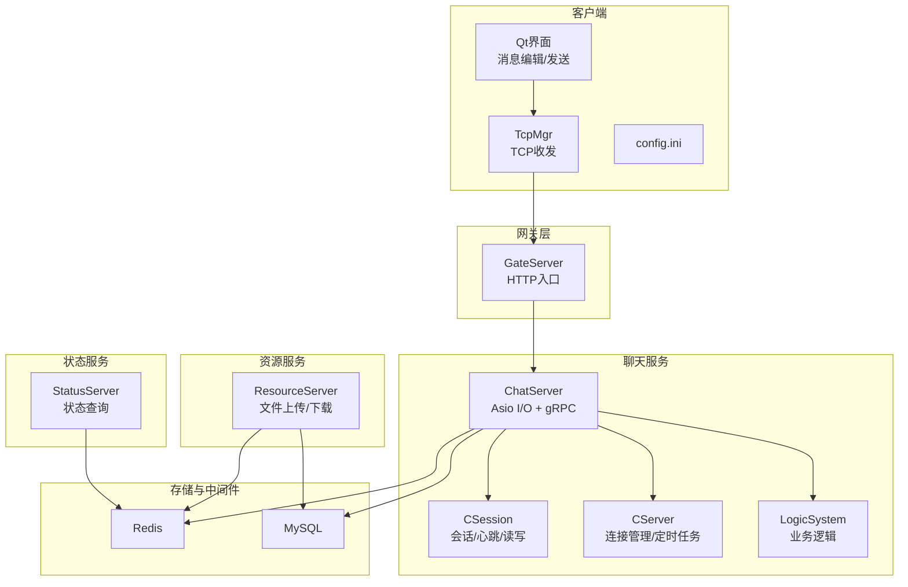
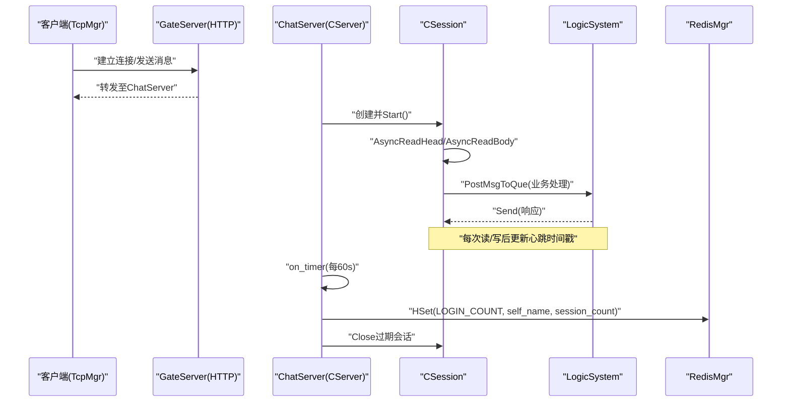
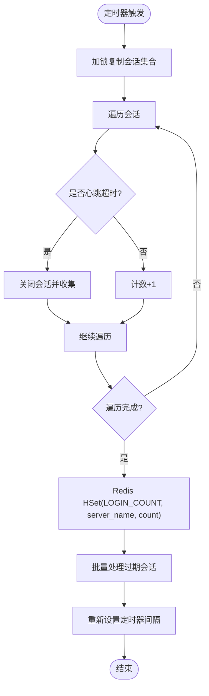
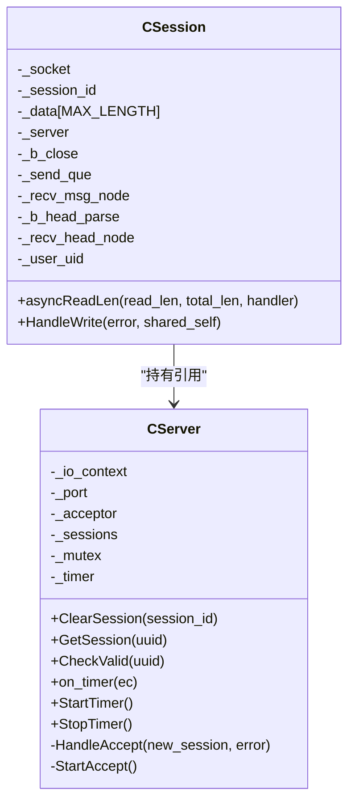
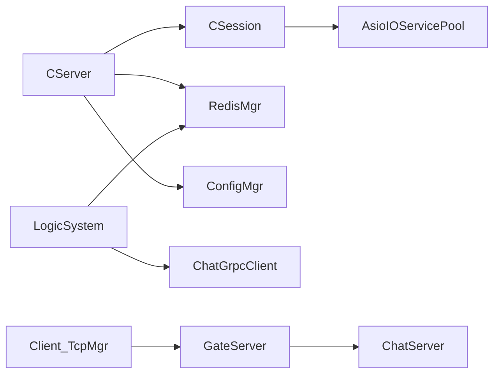

# 监控与日志

<cite>
**本文引用的文件**   
- [CServer.h](file://server/ChatServer/include/CServer.h)
- [CServer.cpp](file://server/ChatServer/src/CServer.cpp)
- [CSession.h](file://server/ChatServer/include/CSession.h)
- [CSession.cpp](file://server/ChatServer/src/CSession.cpp)
- [RedisMgr.h](file://server/ChatServer/include/RedisMgr.h)
- [const.h](file://server/ChatServer/include/const.h)
- [LogicSystem.cpp](file://server/ChatServer/src/LogicSystem.cpp)
- [chatserver1.ini](file://server/ChatServer/config/chatserver1.ini)
- [config.ini](file://client/llfcchat/config/config.ini)
- [global.h](file://client/llfcchat/include/global.h)
</cite>

## 目录
1. [简介](#简介)
2. [项目结构](#项目结构)
3. [核心组件](#核心组件)
4. [架构总览](#架构总览)
5. [详细组件分析](#详细组件分析)
6. [依赖关系分析](#依赖关系分析)
7. [性能考量](#性能考量)
8. [故障排查指南](#故障排查指南)
9. [结论](#结论)
10. [附录](#附录)

## 简介
本文件为 LLFCChat 的“监控与日志”综合文档，聚焦以下目标：
- 日志系统设计：日志级别、格式规范与异步写入机制（基于现有代码现状给出建议方案）。
- 关键业务指标采集与上报：QPS、延迟、错误率等核心指标的埋点位置与上报路径。
- 分布式链路追踪：请求ID贯穿与调用链分析（结合现有消息ID与gRPC服务）。
- 监控告警规则配置：阈值设定与通知渠道集成（概念性指导）。
- 性能分析工具使用：CPU、内存、网络IO监控（通用实践）。
- 日志聚合与分析：ELK栈或同类工具的集成方案（概念性指导）。
- 监控面板搭建与自定义指标展示（概念性指导）。
- 具体监控配置示例与日志查询语句（概念性指导）。

说明：当前仓库未内置统一日志框架与监控系统，但已具备心跳检测、连接数统计、错误码定义、消息ID枚举、gRPC服务与Redis持久化等基础能力，可作为监控与日志体系扩展的切入点。

## 项目结构
本项目包含客户端与服务端多模块：
- 客户端（Qt）：负责UI交互、TCP通信、消息组装与发送。
- 服务端（C++）：包括 ChatServer、GateServer、ResourceServer、StatusServer 等；使用 Boost.Asio 实现高并发I/O，gRPC用于服务间通信，Redis用于状态与锁。
- 配置文件：各服务独立ini配置，包含端口、主机、数据库与Redis信息等。



图表来源
- [CServer.h:1-39](file://server/ChatServer/include/CServer.h#L1-L39)
- [CServer.cpp:1-133](file://server/ChatServer/src/CServer.cpp#L1-L133)
- [CSession.h:43-63](file://server/ChatServer/include/CSession.h#L43-L63)
- [CSession.cpp:99-140](file://server/ChatServer/src/CSession.cpp#L99-L140)
- [chatserver1.ini:1-30](file://server/ChatServer/config/chatserver1.ini#L1-L30)
- [config.ini:1-4](file://client/llfcchat/config/config.ini#L1-L4)

章节来源
- [CServer.h:1-39](file://server/ChatServer/include/CServer.h#L1-L39)
- [CServer.cpp:1-133](file://server/ChatServer/src/CServer.cpp#L1-L133)
- [CSession.h:43-63](file://server/ChatServer/include/CSession.h#L43-L63)
- [CSession.cpp:99-140](file://server/ChatServer/src/CSession.cpp#L99-L140)
- [chatserver1.ini:1-30](file://server/ChatServer/config/chatserver1.ini#L1-L30)
- [config.ini:1-4](file://client/llfcchat/config/config.ini#L1-L4)

## 核心组件
- CServer：监听端口、接受连接、维护活跃会话映射、启动定时器进行心跳检测与连接数统计上报。
- CSession：封装TCP socket读写、消息头解析、心跳更新、异常处理与清理。
- RedisMgr：Redis连接池、健康检查、分布式锁、计数器等。
- LogicSystem：业务逻辑处理（如心跳处理、消息通知等）。
- const.h：错误码、消息ID、常量定义。
- global.h：客户端ReqId枚举，用于消息路由。

章节来源
- [CServer.h:1-39](file://server/ChatServer/include/CServer.h#L1-L39)
- [CServer.cpp:1-133](file://server/ChatServer/src/CServer.cpp#L1-L133)
- [CSession.h:43-63](file://server/ChatServer/include/CSession.h#L43-L63)
- [CSession.cpp:99-140](file://server/ChatServer/src/CSession.cpp#L99-L140)
- [RedisMgr.h:1-305](file://server/ChatServer/include/RedisMgr.h#L1-L305)
- [const.h:1-104](file://server/ChatServer/include/const.h#L1-L104)
- [global.h:43-68](file://client/llfcchat/include/global.h#L43-L68)

## 架构总览
下图展示了从客户端到服务端的请求链路，以及心跳检测与连接数统计的关键流程。



图表来源
- [CServer.cpp:75-118](file://server/ChatServer/src/CServer.cpp#L75-L118)
- [CSession.cpp:99-140](file://server/ChatServer/src/CSession.cpp#L99-L140)
- [LogicSystem.cpp:564-575](file://server/ChatServer/src/LogicSystem.cpp#L564-L575)
- [RedisMgr.h:267-305](file://server/ChatServer/include/RedisMgr.h#L267-L305)

## 详细组件分析

### 心跳检测与连接数统计
- 心跳机制：CSession在每次读取数据后更新心跳时间戳；CServer定时器周期性扫描会话，判断是否超时并关闭无效连接。
- 连接数统计：定时器内统计有效会话数量，通过Redis HSet上报当前服务器的连接数。



图表来源
- [CServer.cpp:75-118](file://server/ChatServer/src/CServer.cpp#L75-L118)
- [CSession.cpp:99-140](file://server/ChatServer/src/CSession.cpp#L99-L140)

章节来源
- [CServer.cpp:75-118](file://server/ChatServer/src/CServer.cpp#L75-L118)
- [CSession.cpp:99-140](file://server/ChatServer/src/CSession.cpp#L99-L140)

### 异步读写与异常处理
- 异步读：CSession::AsyncReadHead/AsyncReadBody 使用Boost.Asio回调处理头部与体部读取，失败时记录错误并清理会话。
- 异常处理：捕获std::exception，打印错误信息，必要时关闭连接并清理用户会话关联。



图表来源
- [CSession.h:43-63](file://server/ChatServer/include/CSession.h#L43-L63)
- [CServer.h:1-39](file://server/ChatServer/include/CServer.h#L1-L39)

章节来源
- [CSession.h:43-63](file://server/ChatServer/include/CSession.h#L43-L63)
- [CSession.cpp:99-140](file://server/ChatServer/src/CSession.cpp#L99-L140)
- [CServer.h:1-39](file://server/ChatServer/include/CServer.h#L1-L39)

### 错误码与消息ID
- 错误码：统一在const.h中定义，便于跨模块识别错误类型。
- 消息ID：服务端MSG_IDS与客户端ReqId对应，确保请求/响应正确路由。

章节来源
- [const.h:1-104](file://server/ChatServer/include/const.h#L1-L104)
- [global.h:43-68](file://client/llfcchat/include/global.h#L43-L68)

### Redis连接池与健康检查
- 连接池：RedisConPool维护多个hiredis上下文，支持获取/归还连接。
- 健康检查：后台线程定期PING检测连接存活，失败则尝试重连。
- 分布式锁：acquireLock/releaseLock实现简单分布式锁，用于踢人等场景。

章节来源
- [RedisMgr.h:1-305](file://server/ChatServer/include/RedisMgr.h#L1-L305)

## 依赖关系分析
- CServer依赖CSession、RedisMgr、ConfigMgr。
- CSession依赖CServer、AsioIOServicePool。
- LogicSystem依赖ChatGrpcClient、RedisMgr。
- 客户端依赖TcpMgr、UserMgr、FileTcpMgr等。



图表来源
- [CServer.h:1-39](file://server/ChatServer/include/CServer.h#L1-L39)
- [CSession.h:43-63](file://server/ChatServer/include/CSession.h#L43-L63)
- [RedisMgr.h:267-305](file://server/ChatServer/include/RedisMgr.h#L267-L305)

章节来源
- [CServer.h:1-39](file://server/ChatServer/include/CServer.h#L1-L39)
- [CSession.h:43-63](file://server/ChatServer/include/CSession.h#L43-L63)
- [RedisMgr.h:267-305](file://server/ChatServer/include/RedisMgr.h#L267-L305)

## 性能考量
- 异步I/O：使用Boost.Asio避免阻塞，提高吞吐。
- 心跳优化：将连接数统计集中在定时器中执行，减少频繁加锁。
- Redis连接池：复用连接，降低握手开销。
- 建议：
  - 引入结构化日志（JSON），便于聚合分析。
  - 指标采集采用计数器与直方图，避免高频同步。
  - 对热点操作（如Redis操作）增加重试与熔断。

[本节为通用指导，不直接分析具体文件]

## 故障排查指南
- 常见问题：
  - 连接超时：检查心跳阈值与客户端心跳频率。
  - 读写失败：查看错误码与异常日志，确认网络与序列化。
  - Redis连接失败：检查连接池健康检查与重连逻辑。
- 定位步骤：
  - 查看CSession异常处理日志。
  - 检查CServer定时器输出与Redis上报结果。
  - 核对错误码与消息ID匹配。

章节来源
- [CSession.cpp:99-140](file://server/ChatServer/src/CSession.cpp#L99-L140)
- [CServer.cpp:75-118](file://server/ChatServer/src/CServer.cpp#L75-L118)
- [const.h:1-104](file://server/ChatServer/include/const.h#L1-L104)

## 结论
当前LLFCChat已具备心跳检测、连接数统计、错误码与消息ID等基础能力，为构建完整的监控与日志体系提供了良好起点。建议优先引入结构化日志、指标采集与链路追踪，逐步完善告警与可视化能力。

[本节为总结，不直接分析具体文件]

## 附录

### 日志系统设计建议
- 日志级别：DEBUG、INFO、WARN、ERROR、FATAL。
- 格式规范：JSON格式，包含timestamp、level、service、trace_id、msg等字段。
- 异步写入：使用独立线程或队列缓冲日志，避免阻塞主流程。
- 落盘策略：按大小或时间轮转，保留最近N天日志。

[本节为概念性指导，不直接分析具体文件]

### 关键业务指标采集与上报
- QPS：每秒请求数，按接口维度统计。
- 延迟：P50/P90/P99延迟，使用直方图记录。
- 错误率：错误请求数/总请求数，按错误码分类。
- 连接数：活跃会话数，通过Redis上报。
- 上报路径：Prometheus Exporter或自研指标服务。

[本节为概念性指导，不直接分析具体文件]

### 分布式链路追踪实现
- 请求ID传递：在消息头中携带trace_id，贯穿客户端、网关、服务。
- 调用链分析：记录每个调用的开始/结束时间、耗时、状态。
- 工具推荐：OpenTelemetry、Jaeger、Zipkin。

[本节为概念性指导，不直接分析具体文件]

### 监控告警规则配置
- 阈值设定：QPS突增、延迟超阈值、错误率升高、连接数异常。
- 通知渠道：邮件、短信、企业微信、钉钉。
- 规则引擎：Prometheus Alertmanager或自研规则系统。

[本节为概念性指导，不直接分析具体文件]

### 性能分析工具使用
- CPU：perf、top、htop、Visual Studio Profiler。
- 内存：Valgrind、AddressSanitizer、Windows内存诊断。
- 网络IO：Wireshark、netstat、ss。

[本节为概念性指导，不直接分析具体文件]

### 日志聚合与分析方案
- ELK栈：Elasticsearch存储、Logstash采集、Kibana可视化。
- 替代方案：Fluentd、Vector、ClickHouse。
- 采集器：Filebeat、Fluent Bit。

[本节为概念性指导，不直接分析具体文件]

### 监控面板搭建与自定义指标展示
- Grafana：导入Prometheus数据源，创建仪表盘。
- 自定义指标：暴露HTTP端点供Prometheus抓取。
- 告警面板：集成Alertmanager，显示告警状态。

[本节为概念性指导，不直接分析具体文件]

### 监控配置示例与日志查询语句
- Prometheus抓取配置：
  ```yaml
  scrape_configs:
    - job_name: 'chat_server'
      metrics_path: '/metrics'
      static_configs:
        - targets: ['localhost:9090']
  ```
- Kibana日志查询：
  ```json
  {
    "query": {
      "bool": {
        "must": [
          {"term": {"level": "ERROR"}},
          {"range": {"@timestamp": {"gte": "now-1h"}}}
        ]
      }
    }
  }
  ```

[本节为概念性指导，不直接分析具体文件]