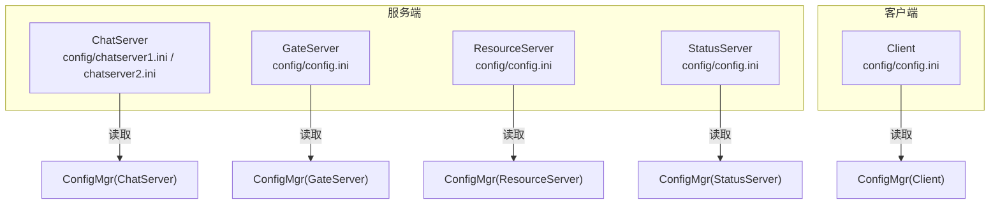
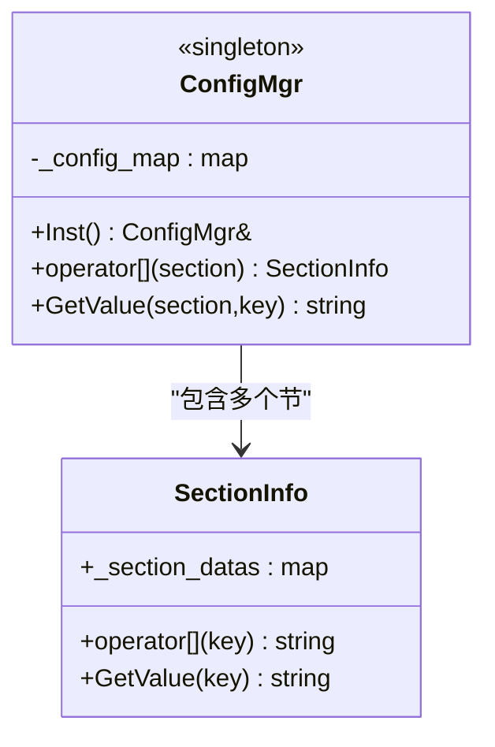
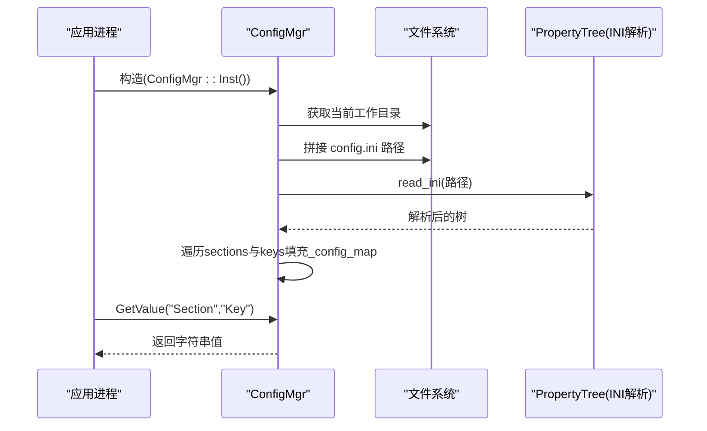
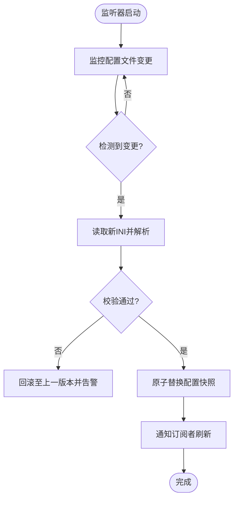
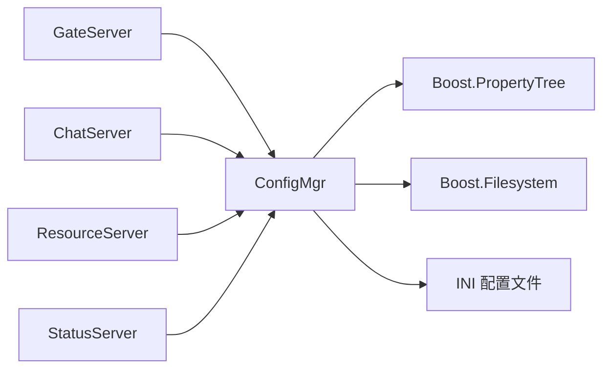

# 配置中心管理

<cite>
**本文引用的文件**   
- [ConfigMgr.h](file://server/ChatServer/include/ConfigMgr.h)
- [ConfigMgr.cpp](file://server/ChatServer/src/ConfigMgr.cpp)
- [CServer.cpp](file://server/ChatServer/src/CServer.cpp)
- [config.ini（客户端）](file://client/llfcchat/config/config.ini)
- [chatserver1.ini](file://server/ChatServer/config/chatserver1.ini)
- [chatserver2.ini](file://server/ChatServer/config/chatserver2.ini)
- [ConfigMgr.h（GateServer）](file://server/GateServer/include/ConfigMgr.h)
- [ConfigMgr.cpp（GateServer）](file://server/GateServer/src/ConfigMgr.cpp)
- [GateServer.cpp](file://server/GateServer/src/GateServer.cpp)
- [config.ini（GateServer）](file://server/GateServer/config/config.ini)
- [ConfigMgr.h（ResourceServer）](file://server/ResourceServer/include/ConfigMgr.h)
- [ConfigMgr.cpp（ResourceServer）](file://server/ResourceServer/src/ConfigMgr.cpp)
- [config.ini（ResourceServer）](file://server/ResourceServer/config/config.ini)
- [ConfigMgr.h（StatusServer）](file://server/StatusServer/include/ConfigMgr.h)
- [ConfigMgr.cpp（StatusServer）](file://server/StatusServer/src/ConfigMgr.cpp)
- [config.ini（StatusServer）](file://server/StatusServer/config/config.ini)
</cite>

## 目录
1. [简介](#简介)
2. [项目结构](#项目结构)
3. [核心组件](#核心组件)
4. [架构总览](#架构总览)
5. [详细组件分析](#详细组件分析)
6. [依赖关系分析](#依赖关系分析)
7. [性能考虑](#性能考虑)
8. [故障排查指南](#故障排查指南)
9. [结论](#结论)
10. [附录](#附录)

## 简介
本文件为 LLFCChat 配置中心管理系统提供综合文档，聚焦于 INI 格式配置文件组织与命名规范、配置热更新机制设计、配置优先级与覆盖规则、环境差异化配置方案、敏感信息加密与安全存储、配置校验与默认值处理，以及最佳实践与常见模式。同时给出具体配置示例与热更新调用示例，帮助读者快速落地并安全运维。

## 项目结构
LLFCChat 各服务均使用独立的 INI 配置文件，并通过统一的 ConfigMgr 单例进行加载与访问。不同服务的配置文件位于各自服务的 config 目录下，客户端配置文件位于 client/llfcchat/config。

图表来源 
- [chatserver1.ini:1-30](file://server/ChatServer/config/chatserver1.ini#L1-L30)
- [chatserver2.ini:1-30](file://server/ChatServer/config/chatserver2.ini#L1-L30)
- [config.ini（GateServer）:1-25](file://server/GateServer/config/config.ini#L1-L25)
- [config.ini（ResourceServer）:1-27](file://server/ResourceServer/config/config.ini#L1-L27)
- [config.ini（StatusServer）:1-23](file://server/StatusServer/config/config.ini#L1-L23)
- [config.ini（客户端）:1-4](file://client/llfcchat/config/config.ini#L1-L4)

章节来源
- [chatserver1.ini:1-30](file://server/ChatServer/config/chatserver1.ini#L1-L30)
- [chatserver2.ini:1-30](file://server/ChatServer/config/chatserver2.ini#L1-L30)
- [config.ini（GateServer）:1-25](file://server/GateServer/config/config.ini#L1-L25)
- [config.ini（ResourceServer）:1-27](file://server/ResourceServer/config/config.ini#L1-L27)
- [config.ini（StatusServer）:1-23](file://server/StatusServer/config/config.ini#L1-L23)
- [config.ini（客户端）:1-4](file://client/llfcchat/config/config.ini#L1-L4)

## 核心组件
- SectionInfo：表示一个 INI 节（section）内的键值映射，提供按 key 取值与空值保护。
- ConfigMgr：INI 配置管理器，单例模式，负责解析 ini 文件到内存 map，并提供 GetValue(section, key) 接口。
- 各服务中的 CServer/GateServer/ResourceServer/StatusServer 等模块通过 ConfigMgr::Inst() 获取配置。

图表来源 
- [ConfigMgr.h（ChatServer）:9-82](file://server/ChatServer/include/ConfigMgr.h#L9-L82)
- [ConfigMgr.cpp（ChatServer）:1-50](file://server/ChatServer/src/ConfigMgr.cpp#L1-L50)

章节来源
- [ConfigMgr.h（ChatServer）:9-82](file://server/ChatServer/include/ConfigMgr.h#L9-L82)
- [ConfigMgr.cpp（ChatServer）:1-50](file://server/ChatServer/src/ConfigMgr.cpp#L1-L50)

## 架构总览
配置中心采用“进程内单例 + INI 文件”的轻量级方案。每个服务启动时由 ConfigMgr 构造函数读取当前工作目录下的 config.ini（或特定名称的 ini），构建内存配置表。业务代码通过 ConfigMgr::Inst()["Section"]["Key"] 或 GetValue(section, key) 访问。

图表来源 
- [ConfigMgr.cpp（ChatServer）:1-50](file://server/ChatServer/src/ConfigMgr.cpp#L1-L50)
- [ConfigMgr.cpp（GateServer）:1-50](file://server/GateServer/src/ConfigMgr.cpp#L1-L50)
- [ConfigMgr.cpp（ResourceServer）:1-83](file://server/ResourceServer/src/ConfigMgr.cpp#L1-L83)
- [ConfigMgr.cpp（StatusServer）:1-50](file://server/StatusServer/src/ConfigMgr.cpp#L1-L50)

章节来源
- [ConfigMgr.cpp（ChatServer）:1-50](file://server/ChatServer/src/ConfigMgr.cpp#L1-L50)
- [ConfigMgr.cpp（GateServer）:1-50](file://server/GateServer/src/ConfigMgr.cpp#L1-L50)
- [ConfigMgr.cpp（ResourceServer）:1-83](file://server/ResourceServer/src/ConfigMgr.cpp#L1-L83)
- [ConfigMgr.cpp（StatusServer）:1-50](file://server/StatusServer/src/ConfigMgr.cpp#L1-L50)

## 详细组件分析

### 配置结构与命名规范
- 文件名
  - 服务端：各服务独立配置文件，如 ChatServer 使用 chatserver1.ini、chatserver2.ini；其他服务统一使用 config.ini。
  - 客户端：client/llfcchat/config/config.ini。
- 节（Section）命名
  - SelfServer：自身服务标识（Name/Host/Port/RPCPort）。
  - GateServer/VarifyServer/StatusServer：外部依赖服务地址与端口。
  - Mysql/Redis：数据库与缓存连接参数（Host/Port/User/Passwd/Schema）。
  - PeerServer/chatservers：对端节点列表或名称集合。
  - Output/Static：资源输出与静态目录路径。
- 键（Key）命名
  - 统一小写或首字母大写均可，但需保持一致性；避免空格与特殊字符。
  - 数值型键（如 Port）在业务层做类型转换。

章节来源
- [chatserver1.ini:1-30](file://server/ChatServer/config/chatserver1.ini#L1-L30)
- [chatserver2.ini:1-30](file://server/ChatServer/config/chatserver2.ini#L1-L30)
- [config.ini（GateServer）:1-25](file://server/GateServer/config/config.ini#L1-L25)
- [config.ini（ResourceServer）:1-27](file://server/ResourceServer/config/config.ini#L1-L27)
- [config.ini（StatusServer）:1-23](file://server/StatusServer/config/config.ini#L1-L23)
- [config.ini（客户端）:1-4](file://client/llfcchat/config/config.ini#L1-L4)

### 配置热更新机制（设计与实现建议）
当前实现为启动时一次性加载，未包含运行时监听与动态重载。推荐的热更新方案如下：
- 变更监听
  - 基于文件系统事件（如 boost::asio::signal 或平台 API）监控配置文件修改时间戳变化。
  - 或使用定时轮询对比文件哈希值。
- 动态加载
  - 新增 Reload() 方法，重新 read_ini 并替换 _config_map 原子指针或互斥保护下的副本。
  - 切换后通知订阅者（观察者模式）刷新相关子系统（如网络端口、DB 连接池）。
- 版本控制
  - 每次重载生成新版本号（单调递增），旧版本保留一段时间用于回滚。
  - 记录变更日志（时间、操作人、差异摘要）。
- 线程安全
  - 使用读写锁或双缓冲（read-write copy-swap）确保并发读取不阻塞。
- 回滚策略
  - 若新配置校验失败，自动回滚至上一版本并告警。

[该图为概念流程图，不直接对应具体源码]

### 配置优先级与覆盖规则
- 当前实现：单一配置文件，无多源合并与覆盖逻辑。
- 建议优先级（从低到高）：
  - 默认配置（编译期或内置默认）
  - 基础配置文件（如 base.ini）
  - 环境覆盖（dev/test/prod 覆盖文件）
  - 运行期环境变量（最高优先级）
- 覆盖策略：同名键高优先级覆盖低优先级；支持节级覆盖与键级覆盖。

[本节为通用设计建议，不直接分析具体文件]

### 环境差异化配置（开发、测试、生产）
- 文件拆分：base.ini + env/dev.ini / test.ini / prod.ini，启动时按环境变量选择加载顺序并合并。
- 变量注入：通过环境变量注入敏感项（如密码、密钥），运行时覆盖配置文件值。
- 部署约定：不同环境使用不同启动脚本或容器镜像，自动注入对应覆盖文件。

[本节为通用设计建议，不直接分析具体文件]

### 配置加密与安全存储
- 敏感字段（如 Passwd、RPC 密钥）建议使用对称加密（AES-GCM）或 KMS 托管密钥。
- 存储形式：
  - 配置文件仅存放密文或引用标识（如 vault 路径）。
  - 启动时解密并放入内存，不落盘明文。
- 访问控制：限制配置文件权限（Linux chmod 600），最小化可访问用户。
- 审计：记录配置加载与变更审计日志。

[本节为通用设计建议，不直接分析具体文件]

### 配置验证与默认值处理
- 必填校验：关键键（如 Host、Port、User、Passwd）缺失时报错并终止启动。
- 类型校验：Port 必须为数字且在合法范围；Path 存在性或可创建性检查。
- 默认值：为可选键提供合理默认值，避免空串导致下游异常。
- 校验时机：加载后立即执行，失败则拒绝启动或回滚。

[本节为通用设计建议，不直接分析具体文件]

### 使用示例与调用方式
- 读取配置
  - 通过 ConfigMgr::Inst()["Section"]["Key"] 或 GetValue(section, key) 获取字符串值。
  - 数值型需在业务层转换（如 atoi）。
- 典型用法
  - GateServer 启动时读取 GateServer.Port 作为监听端口。
  - ChatServer 定时器中读取 SelfServer.Name 写入 Redis 统计。
  - ResourceServer 根据 Output.Path 与 Static.Path 初始化输出与静态目录。

章节来源
- [GateServer.cpp:128-160](file://server/GateServer/src/GateServer.cpp#L128-L160)
- [CServer.cpp:103-106](file://server/ChatServer/src/CServer.cpp#L103-L106)
- [ConfigMgr.cpp（ResourceServer）:59-83](file://server/ResourceServer/src/ConfigMgr.cpp#L59-L83)

## 依赖关系分析
- ConfigMgr 依赖 Boost.PropertyTree 与 Boost.Filesystem 进行 INI 解析与路径处理。
- 各服务模块依赖 ConfigMgr 单例获取配置，形成松耦合。
- 部分服务还依赖 Redis/Mysql 等中间件，其连接参数来自配置。

图表来源 
- [ConfigMgr.h（ChatServer）:1-8](file://server/ChatServer/include/ConfigMgr.h#L1-L8)
- [ConfigMgr.cpp（ChatServer）:1-12](file://server/ChatServer/src/ConfigMgr.cpp#L1-L12)
- [ConfigMgr.cpp（ResourceServer）:1-12](file://server/ResourceServer/src/ConfigMgr.cpp#L1-L12)

章节来源
- [ConfigMgr.h（ChatServer）:1-8](file://server/ChatServer/include/ConfigMgr.h#L1-L8)
- [ConfigMgr.cpp（ChatServer）:1-12](file://server/ChatServer/src/ConfigMgr.cpp#L1-L12)
- [ConfigMgr.cpp（ResourceServer）:1-12](file://server/ResourceServer/src/ConfigMgr.cpp#L1-L12)

## 性能考虑
- 启动开销：INI 解析为 O(N)（N 为键值总数），通常可忽略。
- 运行时访问：map 查找 O(log N)，满足高频读取需求。
- 热更新优化：使用双缓冲与原子交换，避免频繁分配与锁竞争。
- I/O 优化：监听文件变更时使用增量比较（mtime/hash），减少全量解析频率。

[本节为通用性能建议，不直接分析具体文件]

## 故障排查指南
- 常见问题
  - 配置文件路径错误：确认当前工作目录与配置文件名一致。
  - 解析失败：检查 INI 语法（括号、等号、注释）。
  - 键不存在：GetValue 返回空串，需在上层提供默认值或报错。
  - 端口冲突：启动前检查端口占用。
- 定位手段
  - 打印配置路径与解析结果（已有调试输出）。
  - 增加校验失败时的详细日志（缺失键、类型错误）。
  - 对热更新增加版本号与差异日志。

章节来源
- [ConfigMgr.cpp（ChatServer）:1-12](file://server/ChatServer/src/ConfigMgr.cpp#L1-L12)
- [ConfigMgr.cpp（ResourceServer）:1-12](file://server/ResourceServer/src/ConfigMgr.cpp#L1-L12)

## 结论
当前配置中心以轻量 INI + 进程内单例为核心，满足基本配置读取需求。为支撑生产环境的稳定性与可运维性，建议引入热更新、多源覆盖、环境差异化、加密存储与严格校验等能力，并在现有 ConfigMgr 基础上扩展 Reload、Validate、Encrypt/Decrypt 等接口，配合审计与回滚机制，形成完善的配置管理体系。

## 附录

### 配置示例（节选说明）
- 客户端配置（连接网关）
  - 节：GateServer
  - 键：host、port
- ChatServer 配置
  - 节：SelfServer（Name/Host/Port/RPCPort）、Mysql、Redis、PeerServer、对端节点节（如 chatserver2）
- GateServer 配置
  - 节：GateServer、VarifyServer、StatusServer、Mysql、Redis、ResServer
- ResourceServer 配置
  - 节：SelfServer、Mysql、Redis、Output、Static、对端节点节
- StatusServer 配置
  - 节：StatusServer、Mysql、Redis、chatservers、对端节点节

章节来源
- [config.ini（客户端）:1-4](file://client/llfcchat/config/config.ini#L1-L4)
- [chatserver1.ini:1-30](file://server/ChatServer/config/chatserver1.ini#L1-L30)
- [chatserver2.ini:1-30](file://server/ChatServer/config/chatserver2.ini#L1-L30)
- [config.ini（GateServer）:1-25](file://server/GateServer/config/config.ini#L1-L25)
- [config.ini（ResourceServer）:1-27](file://server/ResourceServer/config/config.ini#L1-L27)
- [config.ini（StatusServer）:1-23](file://server/StatusServer/config/config.ini#L1-L23)

### 热更新调用示例（建议接口）
- 触发重载
  - 调用 ConfigMgr::Reload() 重新加载配置文件并替换内存快照。
- 订阅变更
  - 注册回调函数，在配置变更后刷新相关子系统（如重连 DB、更新 RPC 目标）。
- 版本与回滚
  - 获取当前版本号，失败时调用 RollbackTo(version-1)。

[本节为接口建议，不直接分析具体文件]