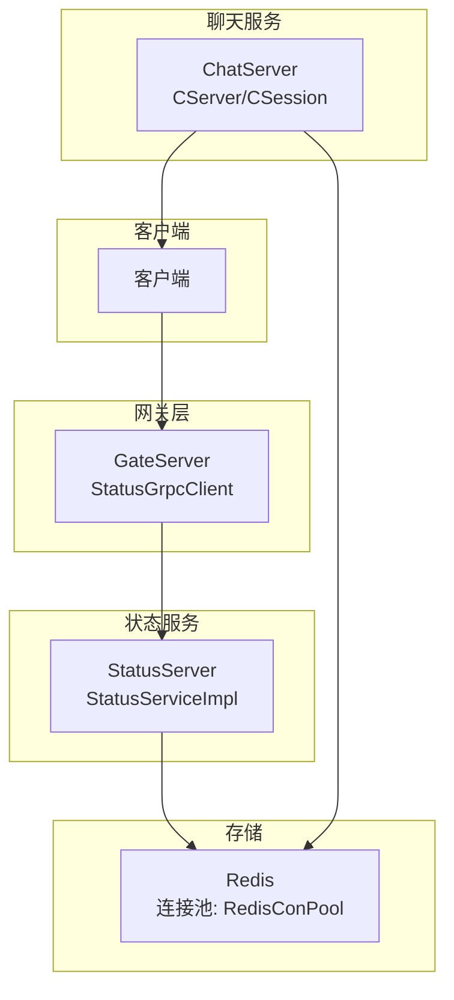
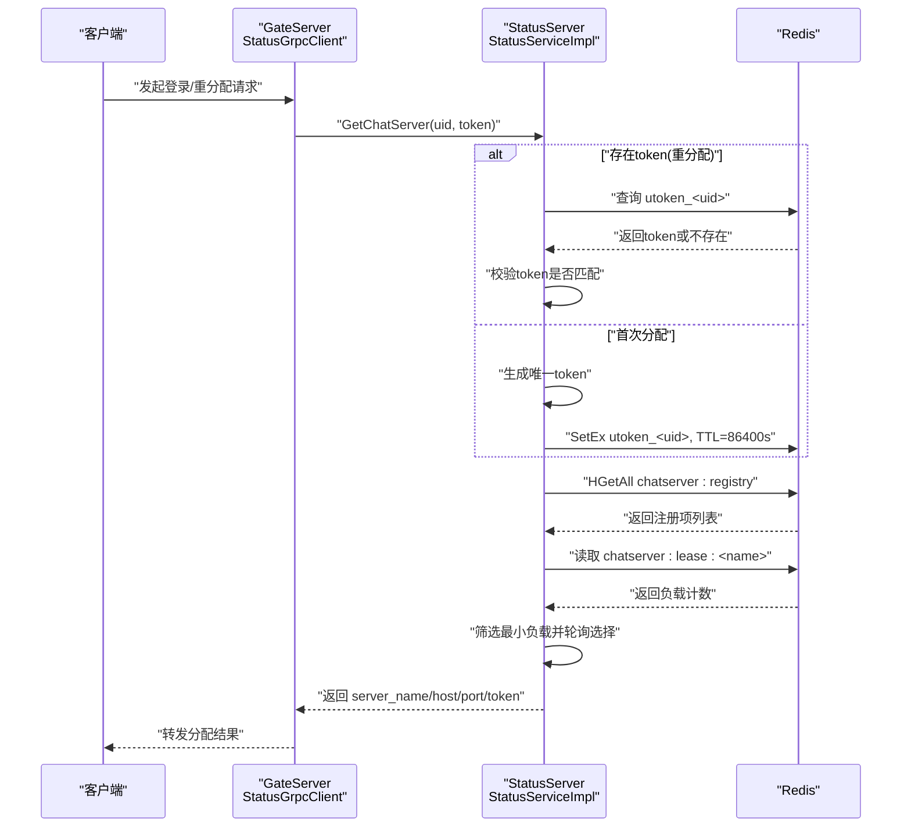
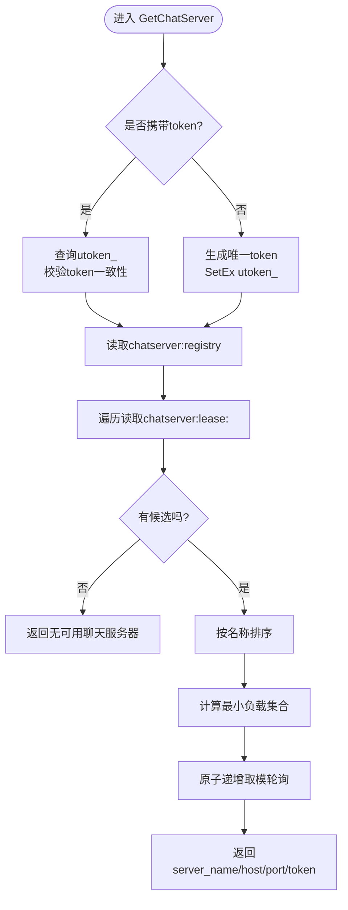
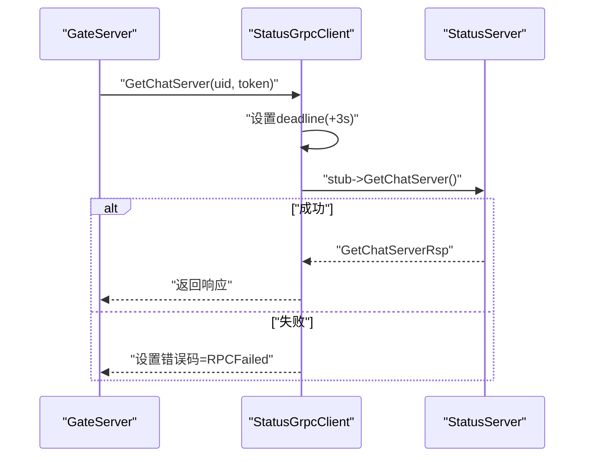
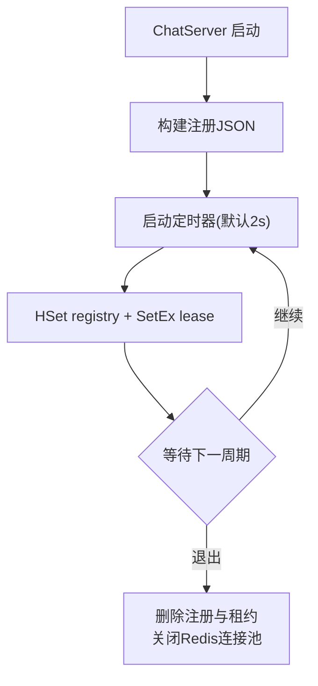
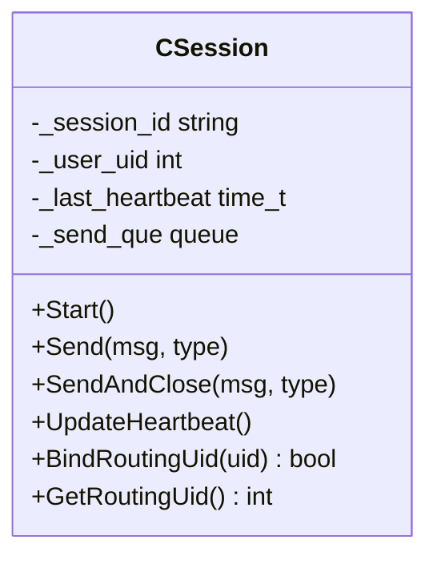
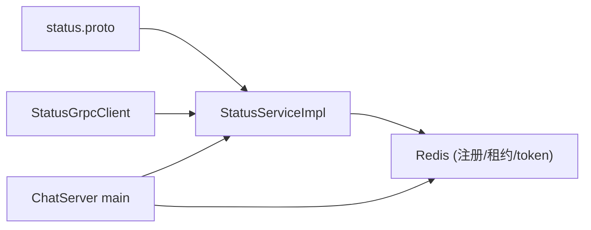

# 聊天服务器发现与故障转移

<cite>
**本文引用的文件**
- [status.proto](file://proto/status_service/status.proto)
- [StatusServiceImpl.h](file://server/StatusServer/include/StatusServiceImpl.h)
- [StatusServiceImpl.cpp](file://server/StatusServer/src/StatusServiceImpl.cpp)
- [StatusGrpcClient.h](file://server/GateServer/include/StatusGrpcClient.h)
- [StatusGrpcClient.cpp](file://server/GateServer/src/StatusGrpcClient.cpp)
- [ChatServerRegistry.h](file://server/common/include/ChatServerRegistry.h)
- [RedisConPool.h](file://server/common/include/RedisConPool.h)
- [GateServer.cpp](file://server/GateServer/src/GateServer.cpp)
- [ChatServer.cpp](file://server/ChatServer/src/ChatServer.cpp)
- [CSession.cpp](file://server/ChatServer/src/CSession.cpp)
</cite>

## 目录
1. [简介](#简介)
2. [项目结构](#项目结构)
3. [核心组件](#核心组件)
4. [架构总览](#架构总览)
5. [详细组件分析](#详细组件分析)
6. [依赖关系分析](#依赖关系分析)
7. [性能考量](#性能考量)
8. [故障排查指南](#故障排查指南)
9. [结论](#结论)
10. [附录](#附录)

## 简介
本文件聚焦于聊天系统的“服务发现与故障转移”机制：客户端通过网关（GateServer）向状态服务（StatusServer）请求当前可用的聊天服务器（ChatServer），并基于 Redis 中的注册信息与租约实现负载均衡与故障剔除；ChatServer 周期性上报自身负载，StatusServer 据此选择最优实例返回给 GateServer，从而完成无感切换与高可用。

## 项目结构
围绕“发现与故障转移”的关键路径涉及以下模块：
- 协议定义：gRPC 接口与消息类型
- 状态服务：解析注册信息、读取租约、选择 ChatServer、生成登录令牌
- 网关客户端：调用状态服务，设置超时与错误码
- 聊天服务：启动时注册自身信息，定时续租并上报在线会话数
- Redis 连接池：为各服务提供稳定可靠的 Redis 访问能力

图表来源
- [status.proto:1-23](file://proto/status_service/status.proto#L1-L23)
- [StatusGrpcClient.cpp:1-31](file://server/GateServer/src/StatusGrpcClient.cpp#L1-L31)
- [StatusServiceImpl.cpp:70-151](file://server/StatusServer/src/StatusServiceImpl.cpp#L70-L151)
- [ChatServer.cpp:18-81](file://server/ChatServer/src/ChatServer.cpp#L18-L81)
- [RedisConPool.h:13-84](file://server/common/include/RedisConPool.h#L13-L84)

章节来源
- [status.proto:1-23](file://proto/status_service/status.proto#L1-L23)
- [StatusGrpcClient.h:1-32](file://server/GateServer/include/StatusGrpcClient.h#L1-L32)
- [StatusGrpcClient.cpp:1-31](file://server/GateServer/src/StatusGrpcClient.cpp#L1-L31)
- [StatusServiceImpl.h:1-31](file://server/StatusServer/include/StatusServiceImpl.h#L1-L31)
- [StatusServiceImpl.cpp:1-152](file://server/StatusServer/src/StatusServiceImpl.cpp#L1-L152)
- [ChatServerRegistry.h:1-15](file://server/common/include/ChatServerRegistry.h#L1-L15)
- [ChatServer.cpp:18-127](file://server/ChatServer/src/ChatServer.cpp#L18-L127)
- [RedisConPool.h:13-84](file://server/common/include/RedisConPool.h#L13-L84)

## 核心组件
- gRPC 协议：定义 GetChatServer 请求/响应，包含 uid、token、server_name、host、port 等字段
- 状态服务实现：校验 token、从 Redis 读取注册表与租约、按最小负载+轮询选择 ChatServer、写入/复用登录令牌
- 网关客户端：构造请求、设置超时、处理 RPC 失败映射为业务错误码
- 聊天服务注册与租约：启动时上报 TCP/RPC 地址，定时续租并上报在线会话数；优雅退出删除租约
- Redis 连接池：管理连接、健康检测、自动重连，保障高可用

章节来源
- [status.proto:5-22](file://proto/status_service/status.proto#L5-L22)
- [StatusServiceImpl.cpp:70-151](file://server/StatusServer/src/StatusServiceImpl.cpp#L70-L151)
- [StatusGrpcClient.cpp:1-31](file://server/GateServer/src/StatusGrpcClient.cpp#L1-L31)
- [ChatServer.cpp:18-81](file://server/ChatServer/src/ChatServer.cpp#L18-L81)
- [RedisConPool.h:13-84](file://server/common/include/RedisConPool.h#L13-L84)

## 架构总览
下图展示一次“获取聊天服务器分配”的完整时序：客户端经 Gate 调用 Status，Status 校验 token、读取注册表与租约、选择 ChatServer 并返回；若为重新分配则复用已有 token，否则生成新 token 写入 Redis。

图表来源
- [StatusGrpcClient.cpp:3-20](file://server/GateServer/src/StatusGrpcClient.cpp#L3-L20)
- [StatusServiceImpl.cpp:70-151](file://server/StatusServer/src/StatusServiceImpl.cpp#L70-L151)
- [ChatServerRegistry.h:7-12](file://server/common/include/ChatServerRegistry.h#L7-L12)

## 详细组件分析

### 状态服务（StatusServer）
- 职责
  - 校验重分配时的 token 有效性
  - 从 Redis 读取 ChatServer 注册信息与租约
  - 基于“最小负载 + 名称排序 + 轮询”策略选择目标 ChatServer
  - 首次分配生成 token 并写入 Redis，重分配时复用
- 关键数据
  - 注册键：chatserver:registry（哈希表，key=name，value=JSON）
  - 租约键：chatserver:lease:<name>（字符串，值为在线会话数）
  - Token 键：utoken_<uid>（TTL 86400s）
- 容错
  - 解析失败或无可用实例时返回相应错误码
  - 仅记录错误日志，不泄露敏感配置

图表来源
- [StatusServiceImpl.cpp:70-151](file://server/StatusServer/src/StatusServiceImpl.cpp#L70-L151)
- [ChatServerRegistry.h:7-12](file://server/common/include/ChatServerRegistry.h#L7-L12)

章节来源
- [StatusServiceImpl.h:15-30](file://server/StatusServer/include/StatusServiceImpl.h#L15-L30)
- [StatusServiceImpl.cpp:17-68](file://server/StatusServer/src/StatusServiceImpl.cpp#L17-L68)
- [StatusServiceImpl.cpp:70-151](file://server/StatusServer/src/StatusServiceImpl.cpp#L70-L151)

### 网关客户端（GateServer -> StatusServer）
- 职责
  - 构造 GetChatServer 请求，设置 3 秒超时
  - 将 RPC 失败映射为业务错误码
  - 从配置中读取 StatusServer 地址建立通道
- 行为
  - 若网络异常或服务不可用，统一返回 RPCFailed，由上层重试或降级

图表来源
- [StatusGrpcClient.cpp:3-30](file://server/GateServer/src/StatusGrpcClient.cpp#L3-L30)

章节来源
- [StatusGrpcClient.h:17-31](file://server/GateServer/include/StatusGrpcClient.h#L17-L31)
- [StatusGrpcClient.cpp:1-31](file://server/GateServer/src/StatusGrpcClient.cpp#L1-L31)

### 聊天服务（ChatServer）注册与租约
- 职责
  - 启动时组装注册 JSON（name、tcp_host、tcp_port、rpc_host、rpc_port）
  - 定时上报注册信息与租约（在线会话数），默认 2 秒间隔，租约 TTL 6 秒
  - 优雅退出时删除注册与租约，关闭 Redis 连接池
- 影响
  - 租约过期即视为下线，StatusServer 不再将其纳入选择范围，实现故障剔除

图表来源
- [ChatServer.cpp:18-81](file://server/ChatServer/src/ChatServer.cpp#L18-L81)

章节来源
- [ChatServer.cpp:18-127](file://server/ChatServer/src/ChatServer.cpp#L18-L127)

### 会话与心跳（CSession）
- 职责
  - 维护会话 ID、用户 UID 绑定、发送队列、心跳时间戳
  - 接收消息后更新心跳；心跳超时会清理会话
  - 登录包用于固定路由 UID，防止跨用户混用连接
- 与发现的关联
  - 心跳活跃是“在线会话数”的基础，直接影响 ChatServer 的负载上报与选择概率

图表来源
- [CSession.cpp:17-23](file://server/ChatServer/src/CSession.cpp#L17-L23)
- [CSession.cpp:62-121](file://server/ChatServer/src/CSession.cpp#L62-L121)
- [CSession.cpp:133-200](file://server/ChatServer/src/CSession.cpp#L133-L200)
- [CSession.cpp:408-432](file://server/ChatServer/src/CSession.cpp#L408-L432)

章节来源
- [CSession.cpp:17-200](file://server/ChatServer/src/CSession.cpp#L17-L200)
- [CSession.cpp:408-432](file://server/ChatServer/src/CSession.cpp#L408-L432)

### Redis 连接池（RedisConPool）
- 职责
  - 管理多个 hiredis 连接，提供获取/归还、健康检测、自动重连
  - 每 60 秒对空闲连接发送 PING，失败连接释放并重连
  - 支持幂等 Close，确保进程退出时资源安全释放
- 对发现的贡献
  - 保证注册、租约、token 的高可靠读写，避免单点失效

章节来源
- [RedisConPool.h:13-84](file://server/common/include/RedisConPool.h#L13-L84)

## 依赖关系分析
- 协议依赖：StatusService 接口与消息类型在 proto 中统一定义
- 运行时依赖
  - GateServer 通过 StatusGrpcClient 调用 StatusServer
  - StatusServer 依赖 Redis 进行注册表、租约、token 的管理
  - ChatServer 依赖 Redis 上报注册与租约，并通过心跳维持在线状态
  - 所有服务共享 RedisConPool 提供的连接管理能力
- 耦合与内聚
  - StatusServiceImpl 与 ChatServerRegistry 解耦良好，通过常量键名约定
  - 各服务通过配置中心（ConfigMgr）获取地址与端口，降低硬编码耦合

图表来源
- [status.proto:5-22](file://proto/status_service/status.proto#L5-L22)
- [StatusServiceImpl.cpp:70-151](file://server/StatusServer/src/StatusServiceImpl.cpp#L70-L151)
- [StatusGrpcClient.cpp:1-31](file://server/GateServer/src/StatusGrpcClient.cpp#L1-L31)
- [ChatServer.cpp:18-81](file://server/ChatServer/src/ChatServer.cpp#L18-L81)

章节来源
- [status.proto:1-23](file://proto/status_service/status.proto#L1-L23)
- [StatusGrpcClient.cpp:1-31](file://server/GateServer/src/StatusGrpcClient.cpp#L1-L31)
- [StatusServiceImpl.cpp:70-151](file://server/StatusServer/src/StatusServiceImpl.cpp#L70-L151)
- [ChatServer.cpp:18-81](file://server/ChatServer/src/ChatServer.cpp#L18-L81)

## 性能考量
- 选择算法复杂度
  - 遍历注册表 O(N)，排序 O(N log N)，最小负载查找 O(N)，整体 O(N log N)
  - 使用原子计数器实现轮询，避免锁竞争
- 超时与重试
  - 网关客户端设置 3 秒超时，避免长尾阻塞
- Redis 连接池
  - 连接复用与健康检测降低延迟与抖动
- 建议
  - 合理设置报告间隔与租约 TTL，平衡实时性与开销
  - 监控注册表大小与选择耗时，必要时引入缓存或分片

[本节为通用指导，无需特定文件引用]

## 故障排查指南
- 无法分配到聊天服务器
  - 检查 StatusServer 是否能读取 chatserver:registry 与租约
  - 确认 ChatServer 是否正常上报注册与租约
  - 查看返回错误码是否为“无可用聊天服务器”
- Token 无效或重分配失败
  - 检查 utoken_<uid> 是否存在且与请求一致
  - 确认 TTL 未过期或被其他实例覆盖
- RPC 失败
  - 检查 StatusGrpcClient 超时设置与网络连通性
  - 确认 StatusServer 地址配置正确
- 会话掉线
  - 检查 CSession 心跳是否被正常更新
  - 观察心跳阈值与清理逻辑

章节来源
- [StatusGrpcClient.cpp:3-20](file://server/GateServer/src/StatusGrpcClient.cpp#L3-L20)
- [StatusServiceImpl.cpp:70-107](file://server/StatusServer/src/StatusServiceImpl.cpp#L70-L107)
- [CSession.cpp:408-432](file://server/ChatServer/src/CSession.cpp#L408-L432)

## 结论
该方案通过“注册表 + 租约 + 轮询”的组合实现了聊天服务器的动态发现与故障转移：ChatServer 主动上报负载，StatusServer 基于最小负载选择实例，GateServer 负责调用与超时控制，Redis 作为统一的协调存储。配合连接池与心跳机制，系统在可用性、可扩展性与稳定性方面具备良好表现。

[本节为总结性内容，无需特定文件引用]

## 附录
- 关键键名约定
  - 注册表：chatserver:registry
  - 租约前缀：chatserver:lease:
  - Token 前缀：utoken_
- 默认参数
  - 报告间隔：2 秒
  - 租约 TTL：6 秒
  - 网关超时：3 秒

章节来源
- [ChatServerRegistry.h:7-12](file://server/common/include/ChatServerRegistry.h#L7-L12)
- [ChatServer.cpp:38-42](file://server/ChatServer/src/ChatServer.cpp#L38-L42)
- [StatusGrpcClient.cpp:5-6](file://server/GateServer/src/StatusGrpcClient.cpp#L5-L6)