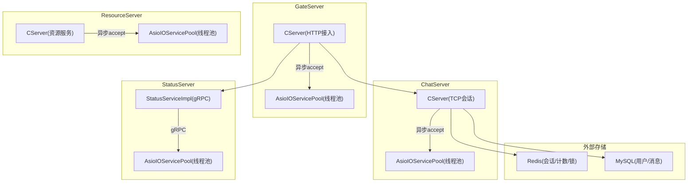
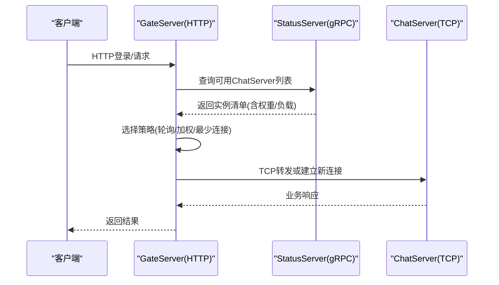
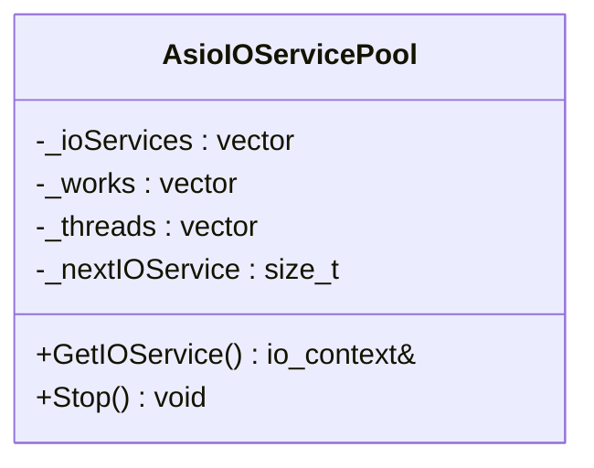
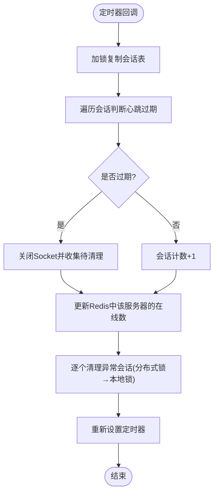
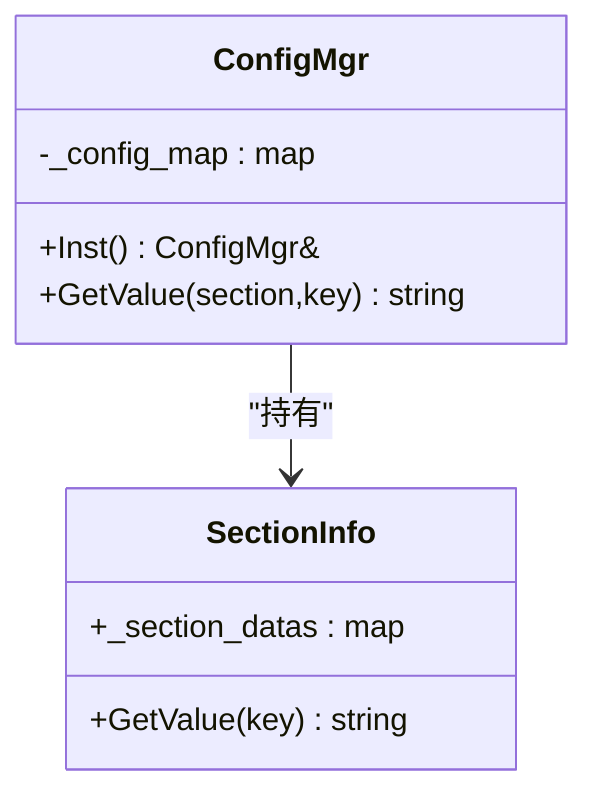
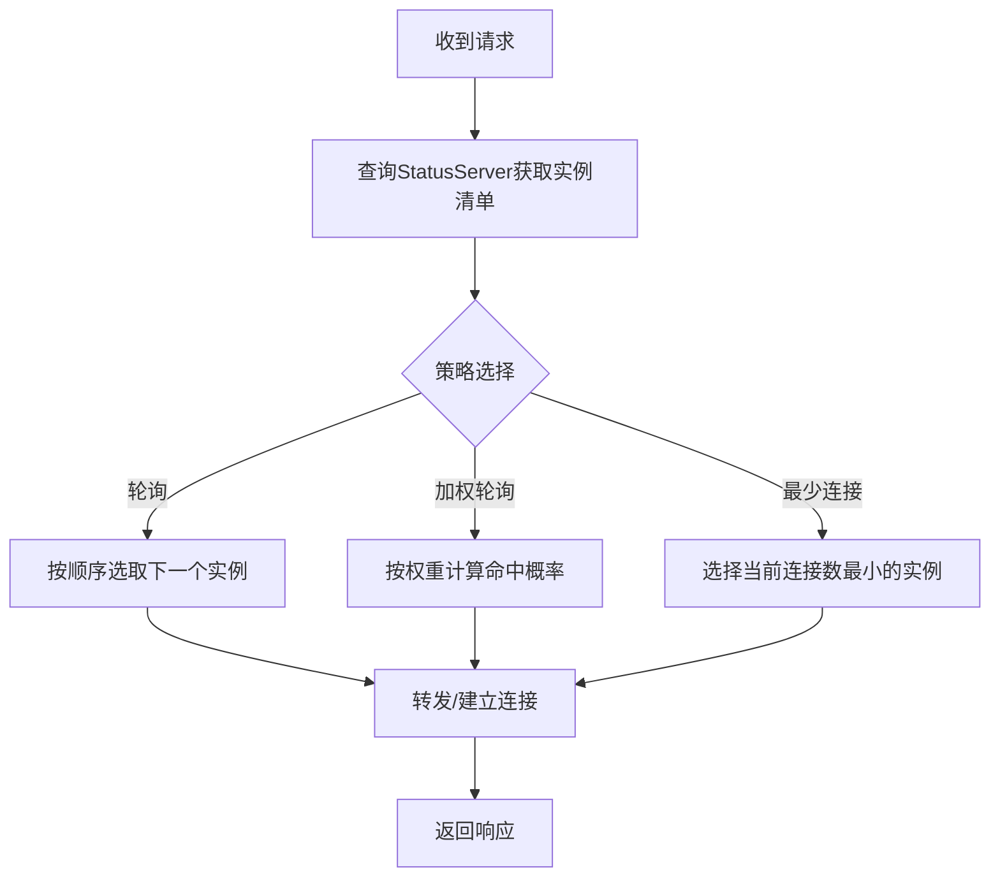
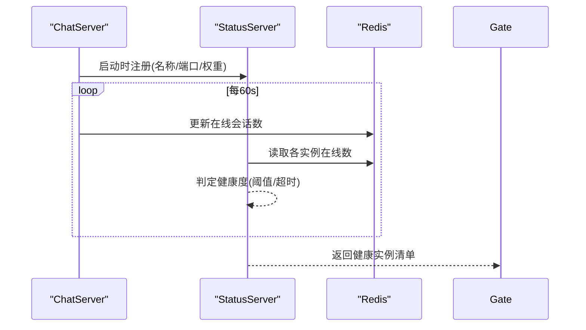
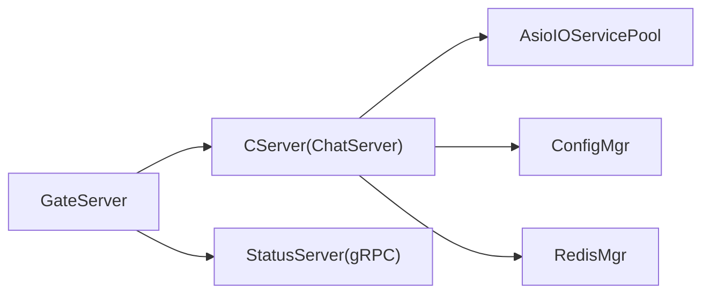
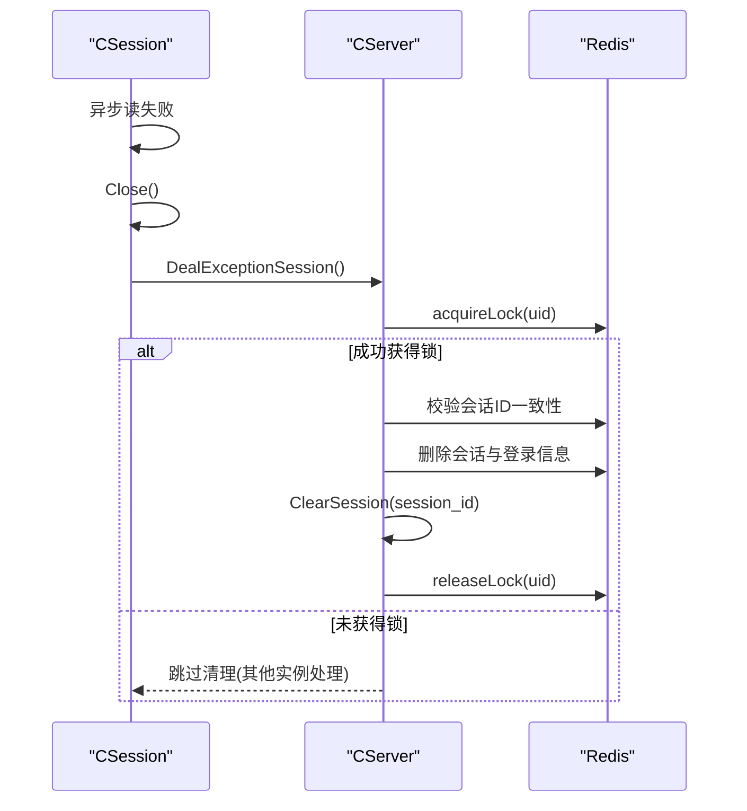

# 负载均衡

<cite>
**本文引用的文件**   
- [CServer.h](file://server/ChatServer/include/CServer.h)
- [CServer.cpp](file://server/ChatServer/src/CServer.cpp)
- [AsioIOServicePool.h](file://server/GateServer/include/AsioIOServicePool.h)
- [AsioIOServicePool.cpp](file://server/GateServer/src/AsioIOServicePool.cpp)
- [ConfigMgr.h](file://server/ChatServer/include/ConfigMgr.h)
- [ConfigMgr.cpp](file://server/ChatServer/src/ConfigMgr.cpp)
- [day16-asio实现tcp服务器.md](file://开发文档/day16-asio实现tcp服务器.md)
- [day27-分布式服务设计.md](file://开发文档/day27-分布式服务设计.md)
- [day35心跳逻辑.md](file://开发文档/day35心跳逻辑.md)
- [StatusServer CMakeLists.txt](file://server/StatusServer/CMakeLists.txt)
</cite>

## 目录
1. [简介](#简介)
2. [项目结构](#项目结构)
3. [核心组件](#核心组件)
4. [架构总览](#架构总览)
5. [详细组件分析](#详细组件分析)
6. [依赖关系分析](#依赖关系分析)
7. [性能考量与调优](#性能考量与调优)
8. [故障检测与自动恢复](#故障检测与自动恢复)
9. [配置管理](#配置管理)
10. [结论](#结论)
11. [附录：配置模板与示例路径](#附录配置模板与示例路径)

## 简介
本文件面向LLFCChat的负载均衡子系统，围绕以下目标展开：
- 解释负载均衡算法的实现原理（轮询、加权轮询、最少连接数）
- 说明服务实例发现机制、健康检查与动态扩缩容
- 记录配置管理器的设计模式与动态加载更新能力
- 解析AsioIOServicePool线程池模型与任务分发机制
- 提供策略选择指南、性能调优建议
- 阐述故障检测与自动恢复流程，以及客户端重连机制
- 给出实际代码示例路径与配置模板

## 项目结构
本项目采用多服务拆分架构，关键服务包括：
- GateServer：HTTP接入层，负责请求接入与转发
- ChatServer：聊天业务TCP服务，维护会话与会话心跳
- StatusServer：状态服务，暴露gRPC接口用于服务注册与健康上报
- ResourceServer：资源服务，处理静态资源等
- VarifyServer：验证码服务（Node.js）

每个服务均包含独立的AsioIOServicePool、CServer、ConfigMgr等基础组件。

图表来源
- [CServer.cpp:1-133](file://server/ChatServer/src/CServer.cpp#L1-L133)
- [AsioIOServicePool.cpp:1-43](file://server/GateServer/src/AsioIOServicePool.cpp#L1-L43)
- [StatusServer CMakeLists.txt:31-86](file://server/StatusServer/CMakeLists.txt#L31-L86)

章节来源
- [CServer.cpp:1-133](file://server/ChatServer/src/CServer.cpp#L1-L133)
- [AsioIOServicePool.cpp:1-43](file://server/GateServer/src/AsioIOServicePool.cpp#L1-L43)
- [StatusServer CMakeLists.txt:31-86](file://server/StatusServer/CMakeLists.txt#L31-L86)

## 核心组件
- AsioIOServicePool：基于Boost.Asio的IO线程池，使用round-robin分配io_context，避免单点阻塞，提升并发吞吐
- CServer：封装acceptor与session生命周期管理，配合定时器进行心跳检测与过期清理
- ConfigMgr：INI配置文件读取与访问封装，支持按section/key取值
- UserMgr：用户到Session映射管理，支撑踢人、路由等
- RedisMgr/MysqlMgr：缓存与持久化访问封装

章节来源
- [AsioIOServicePool.h:1-27](file://server/GateServer/include/AsioIOServicePool.h#L1-L27)
- [AsioIOServicePool.cpp:1-43](file://server/GateServer/src/AsioIOServicePool.cpp#L1-L43)
- [CServer.h:1-33](file://server/ChatServer/include/CServer.h#L1-L33)
- [CServer.cpp:1-133](file://server/ChatServer/src/CServer.cpp#L1-L133)
- [ConfigMgr.h:1-84](file://server/ChatServer/include/ConfigMgr.h#L1-L84)
- [ConfigMgr.cpp:1-50](file://server/ChatServer/src/ConfigMgr.cpp#L1-L50)

## 架构总览
整体采用“接入层 + 业务层 + 状态服务”的分层架构：
- 接入层（GateServer）通过HTTP接收请求，调用状态服务获取可用聊天服务列表，再根据负载均衡策略转发至具体ChatServer
- 业务层（ChatServer）维护TCP长连接、会话心跳、用户绑定、消息路由
- 状态服务（StatusServer）对外暴露gRPC接口，供接入层查询服务实例与健康状态

图表来源
- [CServer.cpp:1-133](file://server/ChatServer/src/CServer.cpp#L1-L133)
- [StatusServer CMakeLists.txt:31-86](file://server/StatusServer/CMakeLists.txt#L31-L86)

## 详细组件分析

### AsioIOServicePool线程池模型与任务分发
- 设计要点
  - 维护多个boost::asio::io_context实例，每个对应一个工作线程
  - 使用work_guard保证run()不会因无任务退出
  - GetIOService()以轮询方式返回io_context，实现简单而稳定的任务分发
- 复杂度
  - GetIOService()为O(1)，Stop()为O(N)
- 扩展点
  - 可替换为带权重的调度器或基于最小连接数的选择器

图表来源
- [AsioIOServicePool.h:1-27](file://server/GateServer/include/AsioIOServicePool.h#L1-L27)
- [AsioIOServicePool.cpp:1-43](file://server/GateServer/src/AsioIOServicePool.cpp#L1-L43)

章节来源
- [AsioIOServicePool.h:1-27](file://server/GateServer/include/AsioIOServicePool.h#L1-L27)
- [AsioIOServicePool.cpp:1-43](file://server/GateServer/src/AsioIOServicePool.cpp#L1-L43)
- [day16-asio实现tcp服务器.md:108-167](file://开发文档/day16-asio实现tcp服务器.md#L108-L167)

### CServer会话管理与心跳检测
- 功能要点
  - 异步accept新连接，创建并启动CSession
  - 定时扫描会话，判断心跳是否过期，关闭并清理异常会话
  - 统计当前在线会话数量，写入Redis以便负载均衡决策
- 错误处理
  - 读/写异常时触发DealExceptionSession，释放分布式锁并清理Redis中的会话信息

图表来源
- [CServer.cpp:75-118](file://server/ChatServer/src/CServer.cpp#L75-L118)
- [day35心跳逻辑.md:318-416](file://开发文档/day35心跳逻辑.md#L318-L416)

章节来源
- [CServer.cpp:1-133](file://server/ChatServer/src/CServer.cpp#L1-L133)
- [day35心跳逻辑.md:318-416](file://开发文档/day35心跳逻辑.md#L318-L416)

### 配置管理器ConfigMgr
- 设计模式
  - 单例模式，进程内唯一配置对象
  - INI文件解析后缓存为map<section, map<key,value>>
- 动态更新
  - 当前实现为启动时加载；可在热更新场景下增加文件监听与原子替换

图表来源
- [ConfigMgr.h:1-84](file://server/ChatServer/include/ConfigMgr.h#L1-L84)
- [ConfigMgr.cpp:1-50](file://server/ChatServer/src/ConfigMgr.cpp#L1-L50)

章节来源
- [ConfigMgr.h:1-84](file://server/ChatServer/include/ConfigMgr.h#L1-L84)
- [ConfigMgr.cpp:1-50](file://server/ChatServer/src/ConfigMgr.cpp#L1-L50)

### 负载均衡策略设计与实现
- 策略类型
  - 轮询（Round-Robin）：适合各实例能力相近的场景
  - 加权轮询（Weighted Round-Robin）：按实例权重分配流量
  - 最少连接数（Least Connections）：优先选择当前活跃连接最少的实例
- 选择依据
  - 从StatusServer获取实例清单及实时负载指标（如在线会话数、CPU/内存占用）
  - 结合权重与阈值进行过滤与排序
- 实现位置
  - 接入层GateServer在收到请求后，调用状态服务获取实例列表，并在本地执行策略选择

图表来源
- [CServer.cpp:1-133](file://server/ChatServer/src/CServer.cpp#L1-L133)
- [StatusServer CMakeLists.txt:31-86](file://server/StatusServer/CMakeLists.txt#L31-L86)

章节来源
- [day27-分布式服务设计.md:277-444](file://开发文档/day27-分布式服务设计.md#L277-L444)

### 服务实例发现与健康检查
- 实例发现
  - ChatServer启动后向StatusServer注册自身信息（名称、端口、权重等）
  - StatusServer维护实例清单，并提供查询接口
- 健康检查
  - 基于心跳与在线会话数：CServer定时将在线会话数写入Redis，StatusServer据此评估健康度
  - 剔除不健康实例：超过阈值或长时间无心跳的实例将被标记不可用

图表来源
- [CServer.cpp:75-118](file://server/ChatServer/src/CServer.cpp#L75-L118)
- [day27-分布式服务设计.md:277-444](file://开发文档/day27-分布式服务设计.md#L277-L444)

章节来源
- [CServer.cpp:75-118](file://server/ChatServer/src/CServer.cpp#L75-L118)
- [day27-分布式服务设计.md:277-444](file://开发文档/day27-分布式服务设计.md#L277-L444)

### 动态扩缩容
- 扩容
  - 新增ChatServer实例，完成注册后自动进入健康检查流程
  - 接入层感知到新实例，逐步纳入负载均衡池
- 缩容
  - 下线前主动注销实例，或健康检查将其标记不可用
  - 接入层停止向其派发新请求，等待现有请求完成

章节来源
- [day27-分布式服务设计.md:277-444](file://开发文档/day27-分布式服务设计.md#L277-L444)

## 依赖关系分析
- 组件耦合
  - CServer依赖AsioIOServicePool进行网络IO线程分配
  - CServer依赖ConfigMgr读取服务名等配置
  - CServer依赖RedisMgr进行会话计数与分布式锁
- 外部依赖
  - gRPC用于StatusServer与GateServer通信
  - Redis用于会话计数、分布式锁、实例健康数据
  - MySQL用于用户信息与消息持久化

图表来源
- [CServer.cpp:1-133](file://server/ChatServer/src/CServer.cpp#L1-L133)
- [AsioIOServicePool.cpp:1-43](file://server/GateServer/src/AsioIOServicePool.cpp#L1-L43)
- [StatusServer CMakeLists.txt:31-86](file://server/StatusServer/CMakeLists.txt#L31-L86)

章节来源
- [CServer.cpp:1-133](file://server/ChatServer/src/CServer.cpp#L1-L133)
- [AsioIOServicePool.cpp:1-43](file://server/GateServer/src/AsioIOServicePool.cpp#L1-L43)
- [StatusServer CMakeLists.txt:31-86](file://server/StatusServer/CMakeLists.txt#L31-L86)

## 性能考量与调优
- IO线程池规模
  - 默认按硬件并发核数初始化，可根据CPU与IO特性调整
  - 高IO密集型可适当增大线程数，但需避免上下文切换开销
- 心跳间隔与超时
  - 建议60秒级别，结合网络质量与业务容忍度调整
  - 过短会增加心跳流量，过长则延迟故障检测
- 负载均衡策略
  - 实例能力相近时使用轮询；差异较大时使用加权轮询
  - 突发流量场景优先最少连接数，降低拥塞风险
- 缓存与数据库
  - 热点数据尽量走Redis，减少MySQL压力
  - 合理设置TTL与重试退避

[本节为通用指导，无需特定文件引用]

## 故障检测与自动恢复
- 心跳与过期清理
  - 定时器周期性检测会话心跳，超期即关闭并清理
  - 清理过程遵循“分布式锁→本地锁”的顺序，避免死锁
- 异常会话处理
  - 读/写异常触发DealExceptionSession，释放分布式锁并清理Redis中的会话信息
- 客户端重连
  - 客户端检测到连接断开后，应指数退避重连
  - 接入层对失败实例进行短暂隔离，避免雪崩

图表来源
- [day35心跳逻辑.md:318-416](file://开发文档/day35心跳逻辑.md#L318-L416)
- [CServer.cpp:41-73](file://server/ChatServer/src/CServer.cpp#L41-L73)

章节来源
- [day35心跳逻辑.md:318-416](file://开发文档/day35心跳逻辑.md#L318-L416)
- [CServer.cpp:41-73](file://server/ChatServer/src/CServer.cpp#L41-L73)

## 配置管理
- 配置项建议
  - SelfServer.Name：服务名（用于Redis键区分）
  - Heartbeat.Interval：心跳间隔（秒）
  - MaxConnections：最大连接数阈值
  - LoadBalance.Strategy：负载均衡策略（round_robin/weighted_round_robin/least_connections）
  - Redis.Host/Port/DB：Redis连接参数
  - MySQL.Host/Port/User/Pass/DB：数据库连接参数
- 动态更新
  - 当前为启动时加载；可扩展为文件监听+原子替换，避免运行时不一致

章节来源
- [ConfigMgr.h:1-84](file://server/ChatServer/include/ConfigMgr.h#L1-L84)
- [ConfigMgr.cpp:1-50](file://server/ChatServer/src/ConfigMgr.cpp#L1-L50)

## 结论
本负载均衡方案通过分层架构与明确的职责划分，实现了高并发、可扩展与易运维的目标。AsioIOServicePool提供稳定高效的IO线程池，CServer负责会话与心跳管理，ConfigMgr提供统一配置访问。结合StatusServer的健康检查与实例发现，系统能够动态扩缩容并快速恢复故障。建议在部署中根据实际负载特征选择合适的负载均衡策略，并持续监控与调优关键参数。

[本节为总结性内容，无需特定文件引用]

## 附录：配置模板与示例路径
- 配置模板（INI）
  - [SelfServer]
    - Name=chat_server_1
  - [Heartbeat]
    - Interval=60
  - [LoadBalance]
    - Strategy=least_connections
  - [Redis]
    - Host=127.0.0.1
    - Port=6379
    - DB=0
  - [MySQL]
    - Host=127.0.0.1
    - Port=3306
    - User=root
    - Pass=your_password
    - DB=llfc
- 示例路径
  - ChatServer配置读取实现：[ConfigMgr.cpp:1-50](file://server/ChatServer/src/ConfigMgr.cpp#L1-L50)
  - GateServer配置读取实现：[ConfigMgr.cpp:1-50](file://server/GateServer/src/ConfigMgr.cpp#L1-L50)
  - AsioIOServicePool实现：[AsioIOServicePool.cpp:1-43](file://server/GateServer/src/AsioIOServicePool.cpp#L1-L43)
  - CServer心跳与清理：[CServer.cpp:75-118](file://server/ChatServer/src/CServer.cpp#L75-L118)

章节来源
- [ConfigMgr.cpp:1-50](file://server/ChatServer/src/ConfigMgr.cpp#L1-L50)
- [ConfigMgr.cpp:1-50](file://server/GateServer/src/ConfigMgr.cpp#L1-L50)
- [AsioIOServicePool.cpp:1-43](file://server/GateServer/src/AsioIOServicePool.cpp#L1-L43)
- [CServer.cpp:75-118](file://server/ChatServer/src/CServer.cpp#L75-L118)