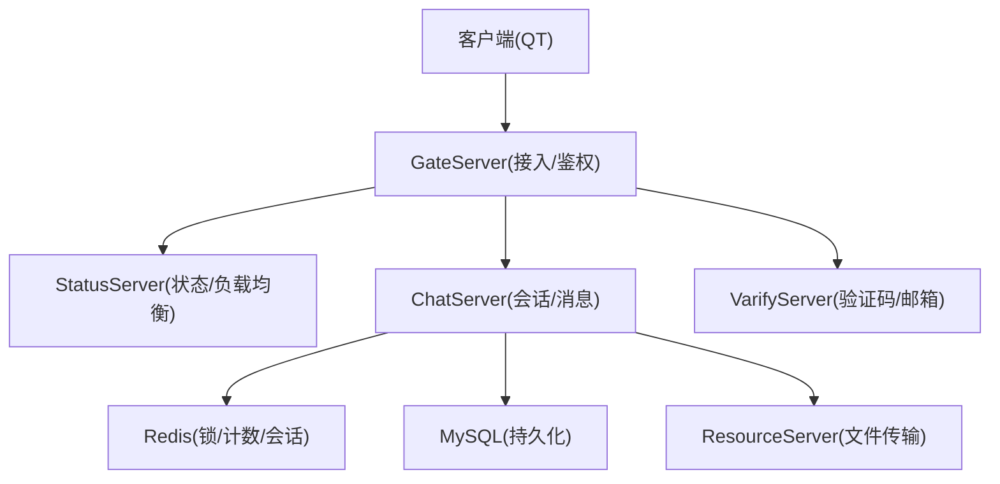
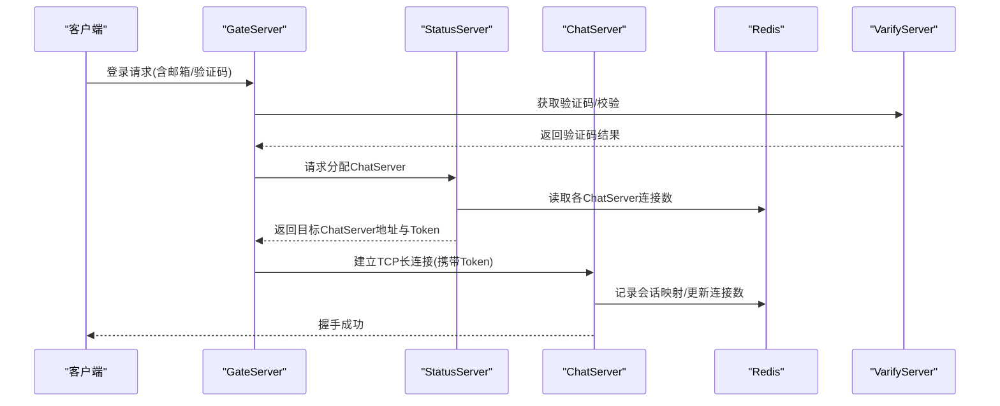
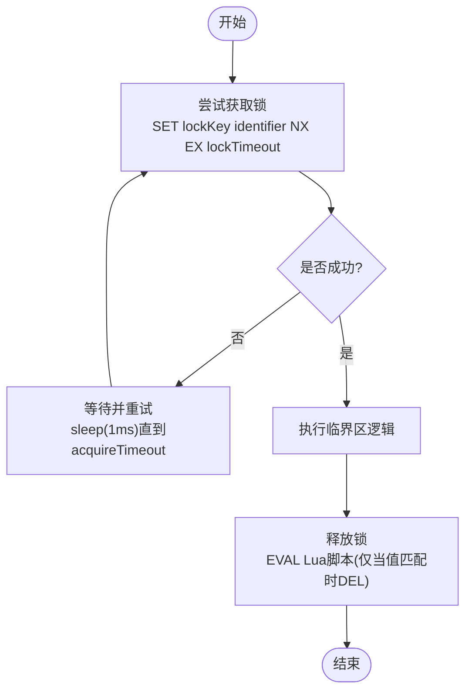
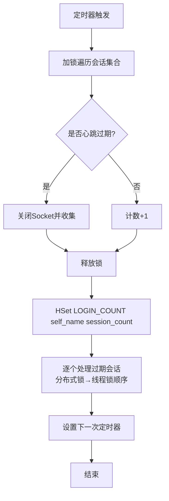
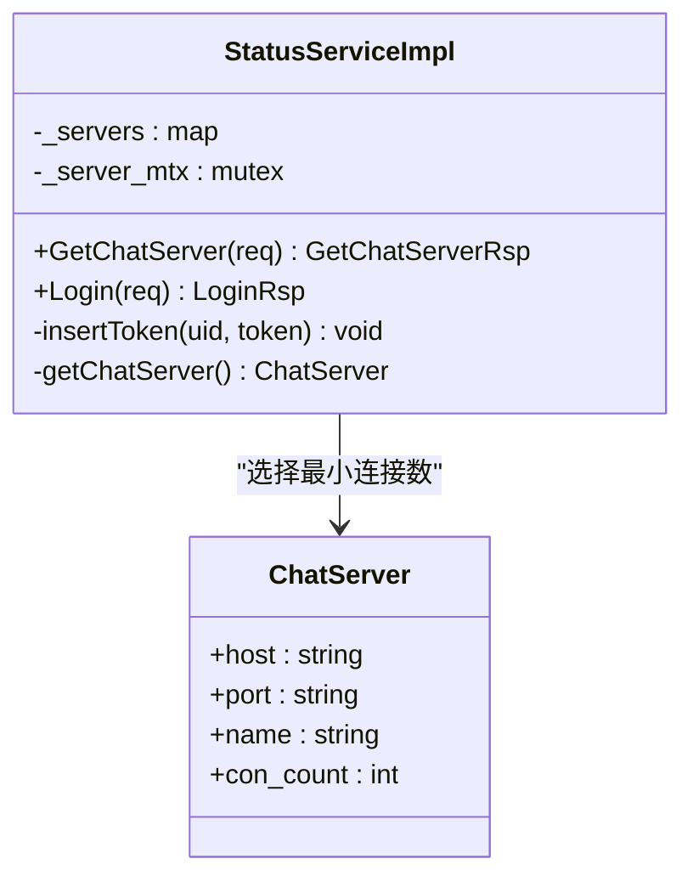
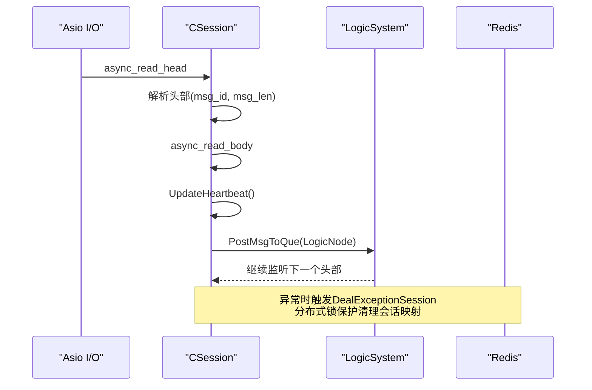
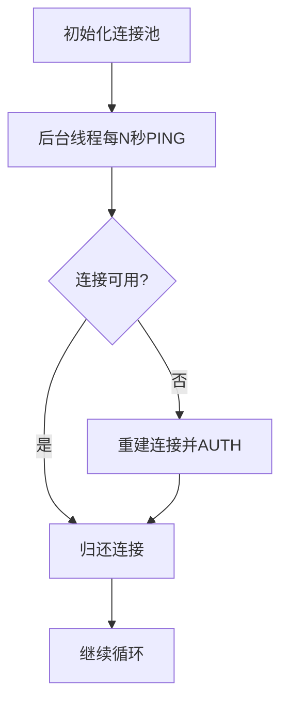
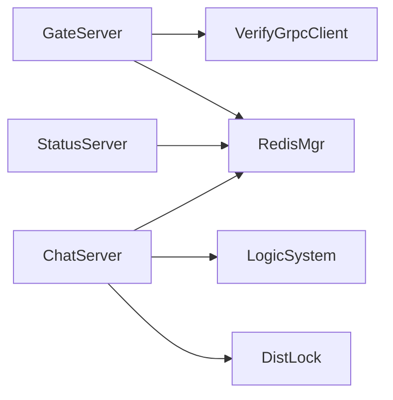

# 分布式系统设计

<cite>
**本文引用的文件**   
- [README.md](file://README.md)
- [day27-分布式服务设计.md](file://开发文档/day27-分布式服务设计.md)
- [day35心跳逻辑.md](file://开发文档/day35心跳逻辑.md)
- [day32分布式锁设计思路.md](file://开发文档/day32分布式锁设计思路.md)
- [DistLock.h](file://server/ChatServer/include/DistLock.h)
- [DistLock.cpp](file://server/ChatServer/src/DistLock.cpp)
- [RedisMgr.h](file://server/ChatServer/include/RedisMgr.h)
- [CSession.h](file://server/ChatServer/include/CSession.h)
- [CSession.cpp](file://server/ChatServer/src/CSession.cpp)
- [StatusServiceImpl.h](file://server/StatusServer/include/StatusServiceImpl.h)
- [StatusServiceImpl.cpp](file://server/StatusServer/src/StatusServiceImpl.cpp)
- [StatusServer.cpp](file://server/StatusServer/src/StatusServer.cpp)
- [GateServer.cpp](file://server/GateServer/src/GateServer.cpp)
- [VerifyGrpcClient.h](file://server/GateServer/include/VerifyGrpcClient.h)
</cite>

## 目录
1. [引言](#引言)
2. [项目结构](#项目结构)
3. [核心组件](#核心组件)
4. [架构总览](#架构总览)
5. [详细组件分析](#详细组件分析)
6. [依赖关系分析](#依赖关系分析)
7. [性能考量](#性能考量)
8. [故障排查指南](#故障排查指南)
9. [结论](#结论)
10. [附录](#附录)

## 引言
本设计文档面向LLFCChat项目的分布式系统，围绕负载均衡、分布式锁、心跳检测、服务发现与注册、分布式事务与一致性、跨服务调用追踪、以及运维监控告警等关键能力进行系统化说明。项目采用多进程/多实例的C++后端（ChatServer、GateServer、StatusServer、ResourceServer、VarifyServer），通过gRPC进行服务间通信，使用Redis作为分布式协调与状态存储，结合Boost.Asio实现高并发网络I/O。

## 项目结构
- 客户端：Qt GUI + TCP/HTTP管理模块
- 网关层：GateServer负责接入、鉴权、路由
- 业务层：ChatServer承载聊天会话、消息转发、心跳与踢人逻辑
- 状态与发现：StatusServer提供负载均衡决策、Token校验
- 资源服务：ResourceServer处理文件上传下载与断点续传
- 验证服务：VarifyServer提供验证码、邮箱认证等
- 中间件：Redis（连接池、分布式锁、计数）、MySQL（持久化）

**图示来源** 
- [GateServer.cpp:1-163](file://server/GateServer/src/GateServer.cpp#L1-L163)
- [StatusServer.cpp:1-72](file://server/StatusServer/src/StatusServer.cpp#L1-L72)
- [CSession.cpp:1-338](file://server/ChatServer/src/CSession.cpp#L1-L338)
- [RedisMgr.h:1-305](file://server/ChatServer/include/RedisMgr.h#L1-L305)

**章节来源**
- [README.md:1-112](file://README.md#L1-L112)
- [day27-分布式服务设计.md:1-7](file://开发文档/day27-分布式服务设计.md#L1-L7)

## 核心组件
- 分布式锁：基于Redis SET NX EX + Lua原子释放，支持超时与重试，避免死锁
- 心跳与连接保活：定时器扫描会话，按阈值判断过期，异步清理并更新连接数
- 负载均衡：StatusServer维护ChatServer列表，按Redis中连接数选择最少负载节点
- 服务发现与注册：配置驱动+Redis共享状态，支持动态扩缩容与热更新
- 会话与异常处理：CSession封装读写、粘包处理、异常回退与优雅关闭
- 连接池：Redis连接池自动健康检查与重连；gRPC连接池复用通道

**章节来源**
- [DistLock.h:1-18](file://server/ChatServer/include/DistLock.h#L1-L18)
- [DistLock.cpp:1-73](file://server/ChatServer/src/DistLock.cpp#L1-L73)
- [RedisMgr.h:1-305](file://server/ChatServer/include/RedisMgr.h#L1-L305)
- [CSession.h:1-86](file://server/ChatServer/include/CSession.h#L1-L86)
- [CSession.cpp:1-338](file://server/ChatServer/src/CSession.cpp#L1-L338)
- [StatusServiceImpl.h:1-52](file://server/StatusServer/include/StatusServiceImpl.h#L1-L52)
- [StatusServiceImpl.cpp:1-125](file://server/StatusServer/src/StatusServiceImpl.cpp#L1-L125)

## 架构总览
整体采用“接入-状态-业务-资源”分层架构：
- GateServer统一入口，完成鉴权与路由
- StatusServer集中式负载均衡与Token校验
- ChatServer处理会话、消息、心跳、踢人与资源通知
- ResourceServer提供文件传输与断点续传
- VarifyServer提供验证码与邮件服务
- Redis作为分布式协调中心（锁、计数、会话映射、Token）
- MySQL用于用户与消息持久化

**图示来源** 
- [GateServer.cpp:1-163](file://server/GateServer/src/GateServer.cpp#L1-L163)
- [StatusServiceImpl.cpp:1-125](file://server/StatusServer/src/StatusServiceImpl.cpp#L1-L125)
- [CSession.cpp:1-338](file://server/ChatServer/src/CSession.cpp#L1-L338)
- [RedisMgr.h:1-305](file://server/ChatServer/include/RedisMgr.h#L1-L305)

## 详细组件分析

### 分布式锁设计与实现
- 机制：使用Redis的SET key value NX EX ttl实现原子加锁；释放时使用Lua脚本保证“仅持有者可删除”
- 特性：支持获取超时acquireTimeout、锁有效期lockTimeout；生成唯一identifier防止误删
- 使用场景：会话清理、连接数统计、跨服踢人、资源操作等临界区保护
- 死锁预防：统一锁顺序（先分布式锁后线程锁），避免嵌套等待；必要时引入tryLock+退避重试

**图示来源** 
- [DistLock.cpp:1-73](file://server/ChatServer/src/DistLock.cpp#L1-L73)

**章节来源**
- [DistLock.h:1-18](file://server/ChatServer/include/DistLock.h#L1-L18)
- [DistLock.cpp:1-73](file://server/ChatServer/src/DistLock.cpp#L1-L73)
- [day32分布式锁设计思路.md:430-479](file://开发文档/day32分布式锁设计思路.md#L430-L479)

### 心跳检测与连接保活
- 会话心跳：每个CSession维护_last_heartbeat时间戳，收到数据即更新
- 定时扫描：服务器定时器周期（如60s）遍历会话，超过阈值（如20s）判定为过期
- 异常处理：关闭Socket、收集过期会话、在分布式锁保护下清理Redis中的会话映射与登录信息
- 连接数统计：每次心跳周期结束后将当前活跃会话数写入Redis，供负载均衡使用

**图示来源** 
- [CSession.cpp:288-338](file://server/ChatServer/src/CSession.cpp#L288-L338)
- [day35心跳逻辑.md:41-92](file://开发文档/day35心跳逻辑.md#L41-L92)

**章节来源**
- [CSession.h:1-86](file://server/ChatServer/include/CSession.h#L1-L86)
- [CSession.cpp:1-338](file://server/ChatServer/src/CSession.cpp#L1-L338)
- [day35心跳逻辑.md:1-444](file://开发文档/day35心跳逻辑.md#L1-L444)

### 负载均衡与服务发现
- 服务列表：StatusServer从配置加载ChatServer列表（名称、主机、端口）
- 负载策略：读取Redis中LOGIN_COUNT哈希表，选择连接数最小的ChatServer
- Token机制：StatusServer为每次分配生成唯一token并写入Redis，GateServer后续校验
- 动态扩缩容：新增ChatServer只需加入配置，StatusServer即可感知；下线则移除配置或心跳清理

**图示来源** 
- [StatusServiceImpl.h:1-52](file://server/StatusServer/include/StatusServiceImpl.h#L1-L52)
- [StatusServiceImpl.cpp:1-125](file://server/StatusServer/src/StatusServiceImpl.cpp#L1-L125)

**章节来源**
- [StatusServiceImpl.h:1-52](file://server/StatusServer/include/StatusServiceImpl.h#L1-L52)
- [StatusServiceImpl.cpp:1-125](file://server/StatusServer/src/StatusServiceImpl.cpp#L1-L125)
- [day27-分布式服务设计.md:1-7](file://开发文档/day27-分布式服务设计.md#L1-L7)

### 会话管理与异常处理
- 读写模型：基于Boost.Asio异步读写，头体分离解析，防粘包
- 发送队列：每个会话维护发送队列，串行写出，避免竞争
- 异常路径：读失败/写错误均触发Close与DealExceptionSession，确保资源释放与状态清理
- 优雅关闭：信号捕获后停止IO循环，等待任务完成再退出

**图示来源** 
- [CSession.cpp:90-194](file://server/ChatServer/src/CSession.cpp#L90-L194)
- [CSession.cpp:304-338](file://server/ChatServer/src/CSession.cpp#L304-L338)

**章节来源**
- [CSession.h:1-86](file://server/ChatServer/include/CSession.h#L1-L86)
- [CSession.cpp:1-338](file://server/ChatServer/src/CSession.cpp#L1-L338)

### 连接池与可靠性
- Redis连接池：初始化时创建固定数量连接，后台线程定期PING检测健康，失败连接自动重建
- gRPC连接池：GateServer对VarifyService维护Stub池，带条件变量唤醒与优雅关闭
- 健康检查：周期性探测，失败计数累计，达到阈值触发重连

**图示来源** 
- [RedisMgr.h:1-305](file://server/ChatServer/include/RedisMgr.h#L1-L305)
- [VerifyGrpcClient.h:1-113](file://server/GateServer/include/VerifyGrpcClient.h#L1-L113)

**章节来源**
- [RedisMgr.h:1-305](file://server/ChatServer/include/RedisMgr.h#L1-L305)
- [VerifyGrpcClient.h:1-113](file://server/GateServer/include/VerifyGrpcClient.h#L1-L113)

### 服务启动与优雅关闭
- GateServer：启动Asio io_context，监听端口，捕获SIGINT/SIGTERM后停止
- StatusServer：gRPC服务启动，配合Asio信号处理，Shutdown后等待完成
- 资源释放：Redis连接池Close与ClearConnections确保无泄漏

**章节来源**
- [GateServer.cpp:1-163](file://server/GateServer/src/GateServer.cpp#L1-L163)
- [StatusServer.cpp:1-72](file://server/StatusServer/src/StatusServer.cpp#L1-L72)

## 依赖关系分析
- GateServer依赖：ConfigMgr、RedisMgr、MysqlMgr、AsioIOServicePool、VerifyGrpcClient
- StatusServer依赖：ConfigMgr、RedisMgr、gRPC服务接口
- ChatServer依赖：RedisMgr、MysqlMgr、LogicSystem、CSession、DistLock
- 外部依赖：Redis（锁/计数/会话）、MySQL（持久化）、gRPC（服务间通信）

**图示来源** 
- [GateServer.cpp:1-163](file://server/GateServer/src/GateServer.cpp#L1-L163)
- [StatusServer.cpp:1-72](file://server/StatusServer/src/StatusServer.cpp#L1-L72)
- [CSession.cpp:1-338](file://server/ChatServer/src/CSession.cpp#L1-L338)
- [RedisMgr.h:1-305](file://server/ChatServer/include/RedisMgr.h#L1-L305)
- [DistLock.cpp:1-73](file://server/ChatServer/src/DistLock.cpp#L1-L73)

**章节来源**
- [GateServer.cpp:1-163](file://server/GateServer/src/GateServer.cpp#L1-L163)
- [StatusServer.cpp:1-72](file://server/StatusServer/src/StatusServer.cpp#L1-L72)
- [CSession.cpp:1-338](file://server/ChatServer/src/CSession.cpp#L1-L338)
- [RedisMgr.h:1-305](file://server/ChatServer/include/RedisMgr.h#L1-L305)
- [DistLock.cpp:1-73](file://server/ChatServer/src/DistLock.cpp#L1-L73)

## 性能考量
- 连接数统计优化：由每次登录/析构写Redis改为心跳周期批量更新，降低锁竞争
- 异步I/O：全链路非阻塞读写，减少线程阻塞
- 连接池复用：Redis/gRPC连接池减少握手开销
- 锁粒度控制：分布式锁仅保护关键临界区，避免长时间持有
- 超时与重试：获取锁与网络调用均设置超时，配合指数退避提升鲁棒性

[本节为通用指导，不直接分析具体文件]

## 故障排查指南
- 心跳超时：检查CSession心跳阈值与定时器间隔，确认客户端是否持续发送数据
- 分布式锁冲突：查看acquireTimeout与lockTimeout配置，确认Lua释放逻辑是否被正确调用
- 连接池不可用：观察Redis PING失败计数与重连日志，确认AUTH与网络连通性
- 负载均衡异常：核对LOGIN_COUNT哈希表是否与ChatServer名称一致，确认StatusServer配置
- 服务关闭卡住：检查信号处理与io_context.stop调用，确保无未完成任务挂起

**章节来源**
- [CSession.cpp:288-338](file://server/ChatServer/src/CSession.cpp#L288-L338)
- [DistLock.cpp:1-73](file://server/ChatServer/src/DistLock.cpp#L1-L73)
- [RedisMgr.h:1-305](file://server/ChatServer/include/RedisMgr.h#L1-L305)
- [StatusServiceImpl.cpp:1-125](file://server/StatusServer/src/StatusServiceImpl.cpp#L1-L125)

## 结论
LLFCChat的分布式设计以Redis为核心协调器，结合Asio高并发I/O与gRPC服务间通信，实现了可扩展的负载均衡、可靠的分布式锁、健壮的心跳与连接保活、以及完善的服务发现与状态管理。通过连接池、超时重试与优雅关闭等机制，系统在稳定性与性能之间取得良好平衡。未来可在服务网格、链路追踪、指标采集等方面进一步增强企业级能力。

[本节为总结，不直接分析具体文件]

## 附录
- 分布式事务与一致性：当前通过分布式锁保障临界区原子性；跨服务一致性可通过幂等设计与补偿机制扩展
- 跨服务调用追踪：建议在gRPC拦截器中添加traceId，串联日志与指标
- 运维支撑：建议集成Prometheus指标导出、结构化日志、告警规则（连接数、锁等待、错误率）

[本节为概念性内容，不直接分析具体文件]