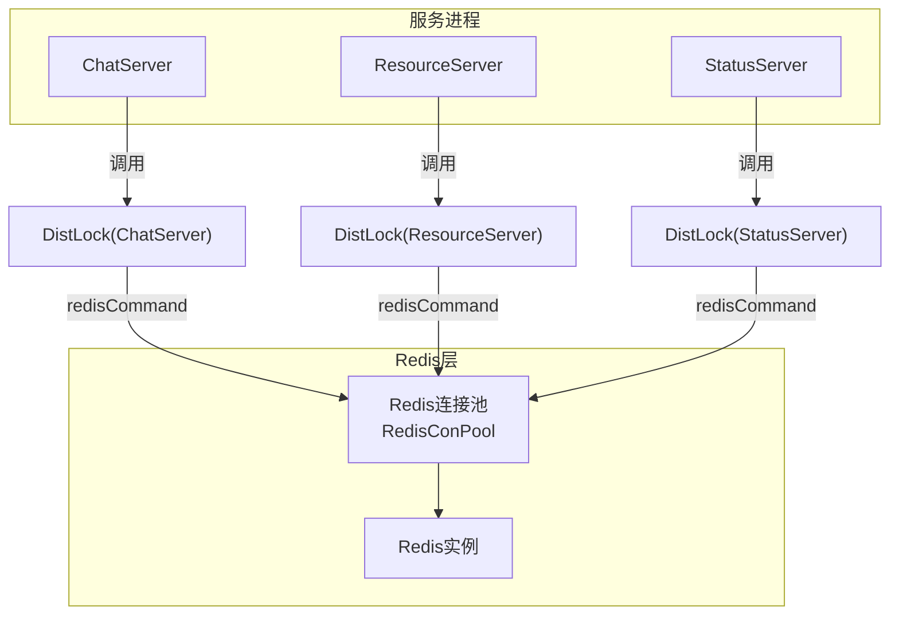
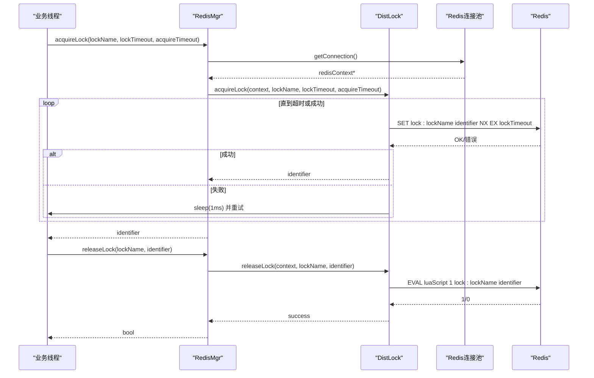
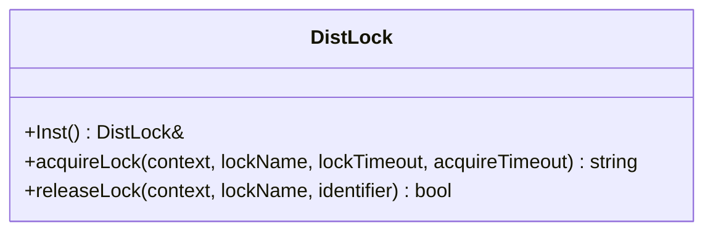
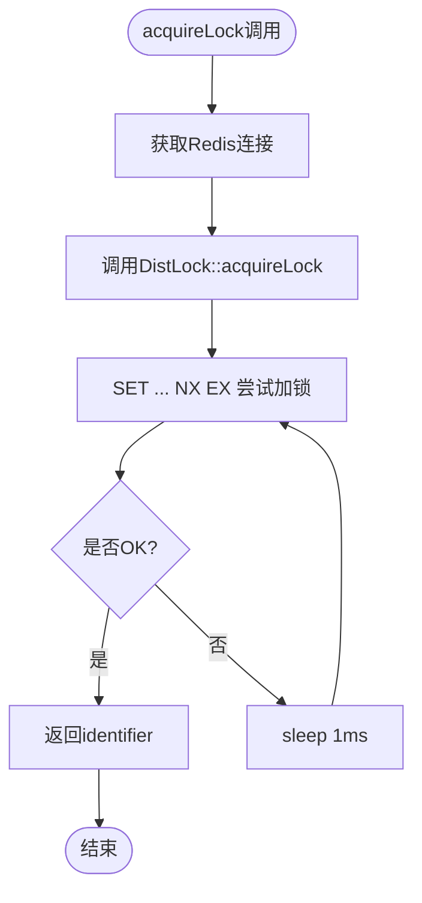
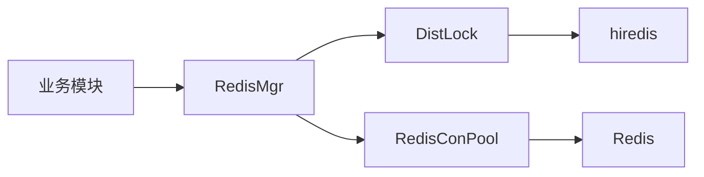

# 分布式锁实现

<cite>
**本文引用的文件**   
- [server/ChatServer/include/DistLock.h](file://server/ChatServer/include/DistLock.h)
- [server/ChatServer/src/DistLock.cpp](file://server/ChatServer/src/DistLock.cpp)
- [server/ResourceServer/include/DistLock.h](file://server/ResourceServer/include/DistLock.h)
- [server/ResourceServer/src/DistLock.cpp](file://server/ResourceServer/src/DistLock.cpp)
- [server/StatusServer/include/DistLock.h](file://server/StatusServer/include/DistLock.h)
- [server/StatusServer/src/DistLock.cpp](file://server/StatusServer/src/DistLock.cpp)
- [server/ChatServer/include/RedisMgr.h](file://server/ChatServer/include/RedisMgr.h)
- [server/ChatServer/src/RedisMgr.cpp](file://server/ChatServer/src/RedisMgr.cpp)
- [server/ChatServer/include/const.h](file://server/ChatServer/include/const.h)
- [开发文档/day32分布式锁设计思路.md](file://开发文档/day32分布式锁设计思路.md)
- [开发文档/day41-分布式死锁解决方案.md](file://开发文档/day41-分布式死锁解决方案.md)
- [开发文档/day35心跳逻辑.md](file://开发文档/day35心跳逻辑.md)
</cite>

## 目录
1. [简介](#简介)
2. [项目结构](#项目结构)
3. [核心组件](#核心组件)
4. [架构总览](#架构总览)
5. [详细组件分析](#详细组件分析)
6. [依赖关系分析](#依赖关系分析)
7. [性能与超时策略](#性能与超时策略)
8. [故障排查指南](#故障排查指南)
9. [结论](#结论)
10. [附录：使用示例与最佳实践](#附录使用示例与最佳实践)

## 简介
本文件面向LLFCChat项目的分布式锁实现，围绕基于Redis的SET NX PX（实际代码中为SET ... NX EX）原子加锁、唯一标识符生成、锁超时、Lua脚本原子释放等核心机制展开。同时结合项目中的Redis连接池、常量配置以及心跳清理场景，给出死锁预防、僵尸锁清理、重试与退避、锁粒度设计与性能调优建议，并提供使用示例与常见问题排查方法。

## 项目结构
分布式锁在多个服务中复用同一套DistLock实现，并通过RedisMgr统一获取Redis连接并封装调用。关键文件分布如下：
- DistLock接口与实现：位于各服务的include/src下，提供acquireLock/releaseLock
- RedisMgr：管理Redis连接池，封装acquireLock/releaseLock调用
- const.h：定义锁超时、重试时间、Key前缀等常量
- 开发文档：记录设计思路、死锁分析与心跳清理中的锁使用方式

图表来源
- [server/ChatServer/src/DistLock.cpp:27-49](file://server/ChatServer/src/DistLock.cpp#L27-L49)
- [server/ChatServer/src/RedisMgr.cpp:362-393](file://server/ChatServer/src/RedisMgr.cpp#L362-L393)
- [server/ChatServer/include/RedisMgr.h:267-305](file://server/ChatServer/include/RedisMgr.h#L267-L305)

章节来源
- [server/ChatServer/include/DistLock.h:1-18](file://server/ChatServer/include/DistLock.h#L1-L18)
- [server/ChatServer/src/DistLock.cpp:1-73](file://server/ChatServer/src/DistLock.cpp#L1-L73)
- [server/ChatServer/include/RedisMgr.h:267-305](file://server/ChatServer/include/RedisMgr.h#L267-L305)
- [server/ChatServer/src/RedisMgr.cpp:362-393](file://server/ChatServer/src/RedisMgr.cpp#L362-L393)
- [server/ChatServer/include/const.h:81-94](file://server/ChatServer/include/const.h#L81-L94)

## 核心组件
- DistLock：分布式锁核心类，提供acquireLock与releaseLock两个方法，内部通过hiredis执行Redis命令与Lua脚本。
- RedisMgr：Redis连接池管理器，负责获取/归还连接，并在上层封装DistLock调用，便于业务侧统一使用。
- 常量配置：LOCK_TIME_OUT、ACQUIRE_TIME_OUT、LOCK_PREFIX等用于控制锁行为与命名空间。

章节来源
- [server/ChatServer/include/DistLock.h:1-18](file://server/ChatServer/include/DistLock.h#L1-L18)
- [server/ChatServer/src/DistLock.cpp:1-73](file://server/ChatServer/src/DistLock.cpp#L1-L73)
- [server/ChatServer/include/RedisMgr.h:267-305](file://server/ChatServer/include/RedisMgr.h#L267-L305)
- [server/ChatServer/src/RedisMgr.cpp:362-393](file://server/ChatServer/src/RedisMgr.cpp#L362-L393)
- [server/ChatServer/include/const.h:81-94](file://server/ChatServer/include/const.h#L81-L94)

## 架构总览
整体流程：业务线程通过RedisMgr获取连接，再调用DistLock进行加锁/解锁；加锁使用SET ... NX EX保证原子性与过期时间，解锁使用EVAL Lua脚本确保“仅持有者可释放”。

图表来源
- [server/ChatServer/src/RedisMgr.cpp:362-393](file://server/ChatServer/src/RedisMgr.cpp#L362-L393)
- [server/ChatServer/src/DistLock.cpp:27-49](file://server/ChatServer/src/DistLock.cpp#L27-L49)
- [server/ChatServer/src/DistLock.cpp:52-73](file://server/ChatServer/src/DistLock.cpp#L52-L73)

## 详细组件分析

### DistLock类分析
- 加锁机制
  - 使用Boost UUID生成全局唯一identifier，作为锁持有者标识。
  - 构造lockKey = "lock:" + lockName，避免命名冲突。
  - 循环尝试SET lockKey identifier NX EX lockTimeout，直到acquireTimeout超时或成功。
  - 每次失败后sleep(1ms)，降低忙等CPU消耗。
- 解锁机制
  - 使用EVAL执行Lua脚本，判断当前值是否等于identifier，相等则DEL key，否则返回0。
  - 保证“仅持有者可释放”，防止误删其他客户端的锁。

图表来源
- [server/ChatServer/include/DistLock.h:1-18](file://server/ChatServer/include/DistLock.h#L1-L18)
- [server/ChatServer/src/DistLock.cpp:27-49](file://server/ChatServer/src/DistLock.cpp#L27-L49)
- [server/ChatServer/src/DistLock.cpp:52-73](file://server/ChatServer/src/DistLock.cpp#L52-L73)

章节来源
- [server/ChatServer/src/DistLock.cpp:27-49](file://server/ChatServer/src/DistLock.cpp#L27-L49)
- [server/ChatServer/src/DistLock.cpp:52-73](file://server/ChatServer/src/DistLock.cpp#L52-L73)
- [开发文档/day32分布式锁设计思路.md:140-189](file://开发文档/day32分布式锁设计思路.md#L140-L189)

### RedisMgr封装与连接池
- 连接池RedisConPool负责创建、校验、回收Redis连接，周期性PING检测健康并自动重连。
- RedisMgr对外暴露acquireLock/releaseLock，内部从池中取context，调用DistLock::Inst().acquireLock/releaseLock，并使用Defer确保连接归还。

图表来源
- [server/ChatServer/src/RedisMgr.cpp:362-393](file://server/ChatServer/src/RedisMgr.cpp#L362-L393)
- [server/ChatServer/src/DistLock.cpp:27-49](file://server/ChatServer/src/DistLock.cpp#L27-L49)

章节来源
- [server/ChatServer/include/RedisMgr.h:267-305](file://server/ChatServer/include/RedisMgr.h#L267-L305)
- [server/ChatServer/src/RedisMgr.cpp:362-393](file://server/ChatServer/src/RedisMgr.cpp#L362-L393)

### 常量与配置
- LOCK_TIME_OUT：锁持有超时时间（秒），默认10秒，用于EX参数。
- ACQUIRE_TIME_OUT：获取锁的最大等待时间（秒），默认5秒，用于循环重试上限。
- LOCK_PREFIX：锁Key前缀，如"lock_"，用于业务级命名空间隔离。
- LOGIN_COUNT、USER_SESSION_PREFIX等：业务Key前缀，配合锁使用。

章节来源
- [server/ChatServer/include/const.h:81-94](file://server/ChatServer/include/const.h#L81-L94)

## 依赖关系分析
- DistLock依赖hiredis库执行Redis命令与Lua脚本。
- RedisMgr依赖RedisConPool管理连接，并依赖DistLock实现加锁/解锁。
- 业务模块通过RedisMgr间接使用DistLock，避免直接操作底层连接。

图表来源
- [server/ChatServer/src/RedisMgr.cpp:362-393](file://server/ChatServer/src/RedisMgr.cpp#L362-L393)
- [server/ChatServer/src/DistLock.cpp:1-12](file://server/ChatServer/src/DistLock.cpp#L1-L12)

章节来源
- [server/ChatServer/include/RedisMgr.h:267-305](file://server/ChatServer/include/RedisMgr.h#L267-L305)
- [server/ChatServer/src/DistLock.cpp:1-12](file://server/ChatServer/src/DistLock.cpp#L1-L12)

## 性能与超时策略
- 加锁重试与退避
  - 当前实现采用固定1ms休眠重试，简单有效但可能在高竞争下造成抖动。可考虑指数退避或随机抖动以降低惊群效应。
- 超时设置
  - lockTimeout需大于临界区最大执行时间，预留时钟漂移与网络延迟余量。
  - acquireTimeout应覆盖重试周期，避免长时间阻塞。
- 锁续期与看门狗
  - 当前实现未内置自动续期。对于长耗时任务，建议在业务层维护一个后台线程，定期根据剩余过期时间计算续期间隔，调用EVAL脚本将key的过期时间延长（例如EX lockTimeout）。
  - 注意续期必须在持有锁的线程内执行，避免跨进程误续期。
- 时钟漂移处理
  - 使用本地steady_clock计算acquireTimeout，不受系统时间回拨影响。
  - 若需跨进程一致性，建议使用NTP同步服务器时间，或在Redis端以原子脚本完成“检查+续期”操作。

章节来源
- [server/ChatServer/src/DistLock.cpp:27-49](file://server/ChatServer/src/DistLock.cpp#L27-L49)
- [server/ChatServer/include/const.h:91-94](file://server/ChatServer/include/const.h#L91-L94)
- [开发文档/day32分布式锁设计思路.md:140-189](file://开发文档/day32分布式锁设计思路.md#L140-L189)

## 故障排查指南
- 常见现象
  - 加锁一直失败：检查Redis连通性、AUTH认证、lockKey命名冲突、acquireTimeout过短。
  - 解锁失败：确认identifier一致，避免跨进程误删；检查Lua脚本返回值是否为1。
  - 僵尸锁：当进程崩溃时，锁会在lockTimeout后自动释放；若业务逻辑过长导致提前过期，需调整lockTimeout或实现续期。
- 定位手段
  - 查看Redis日志与连接池健康状态（PING结果、重连计数）。
  - 打印加锁/解锁的关键路径日志，包括lockKey、identifier、返回值类型与内容。
  - 监控锁竞争热点，必要时拆分锁粒度。
- 死锁预防
  - 统一加锁顺序：先分布式锁，再本地线程锁，避免交叉等待。
  - 使用tryLock模式与退避重试，避免无限等待。
  - 合并锁或封装组合锁，使调用方无需关心多把锁的顺序。

章节来源
- [开发文档/day41-分布式死锁解决方案.md:1-120](file://开发文档/day41-分布式死锁解决方案.md#L1-L120)
- [开发文档/day35心跳逻辑.md:225-270](file://开发文档/day35心跳逻辑.md#L225-L270)
- [server/ChatServer/src/RedisMgr.cpp:362-393](file://server/ChatServer/src/RedisMgr.cpp#L362-L393)

## 结论
本项目实现了基于Redis的分布式锁，具备原子加锁、唯一标识、超时释放与Lua原子解锁等关键特性。通过RedisMgr统一管理连接与调用，简化了业务集成。当前版本未实现自动续期与重入支持，但在心跳清理、会话管理等场景中已能稳定运行。后续可按需引入续期机制与重入锁能力，进一步提升鲁棒性与易用性。

## 附录：使用示例与最佳实践
- 基本用法
  - 获取锁：RedisMgr::acquireLock(lockName, lockTimeout, acquireTimeout)
  - 执行业务逻辑
  - 释放锁：RedisMgr::releaseLock(lockName, identifier)
- 最佳实践
  - 合理设置lockTimeout与acquireTimeout，避免过短导致频繁失败或过长导致资源占用。
  - 使用Defer或RAII风格确保异常路径也能释放锁。
  - 对热点资源进行细粒度锁设计，减少竞争面。
  - 避免在锁内执行I/O密集型操作，缩短临界区。
  - 监控锁命中率、平均等待时间、超时率等指标，持续优化。
- 常见问题
  - 为什么解锁总是失败？确认identifier一致且未被其他进程覆盖。
  - 如何避免死锁？统一加锁顺序，优先分布式锁，再本地锁；使用tryLock与退避。
  - 如何处理长耗时任务？实现续期看门狗，或拆分任务为短临界区。

章节来源
- [server/ChatServer/src/RedisMgr.cpp:395-462](file://server/ChatServer/src/RedisMgr.cpp#L395-L462)
- [开发文档/day35心跳逻辑.md:272-365](file://开发文档/day35心跳逻辑.md#L272-L365)
- [开发文档/day32分布式锁设计思路.md:191-285](file://开发文档/day32分布式锁设计思路.md#L191-L285)