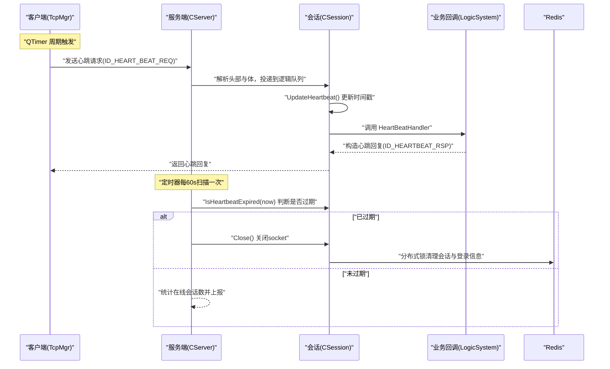
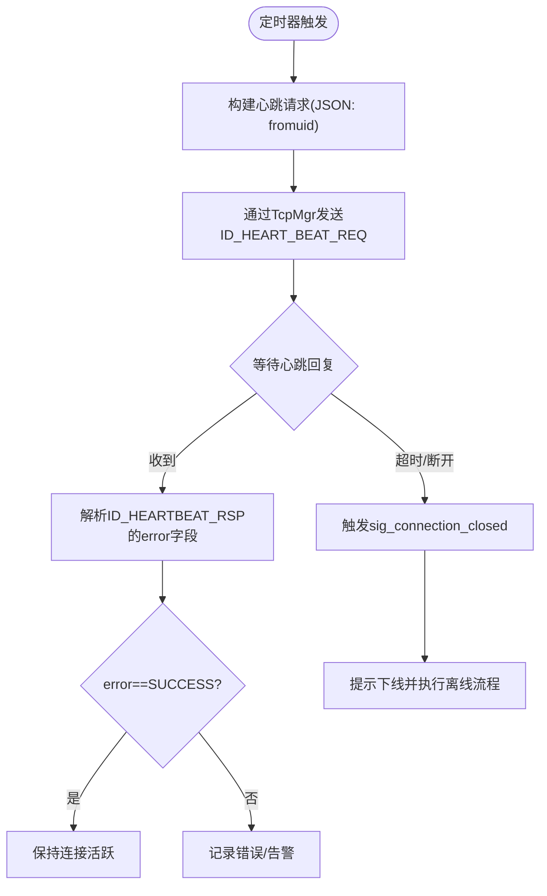
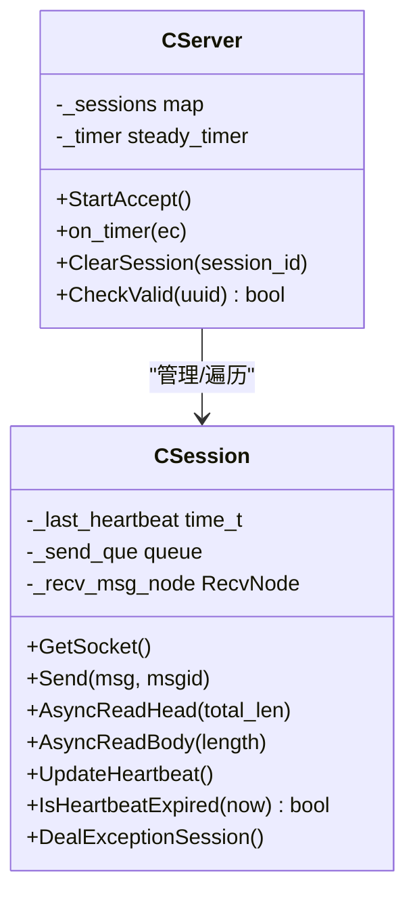
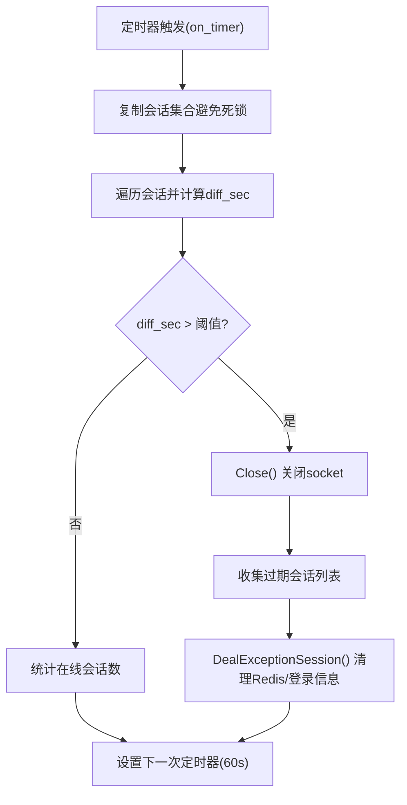
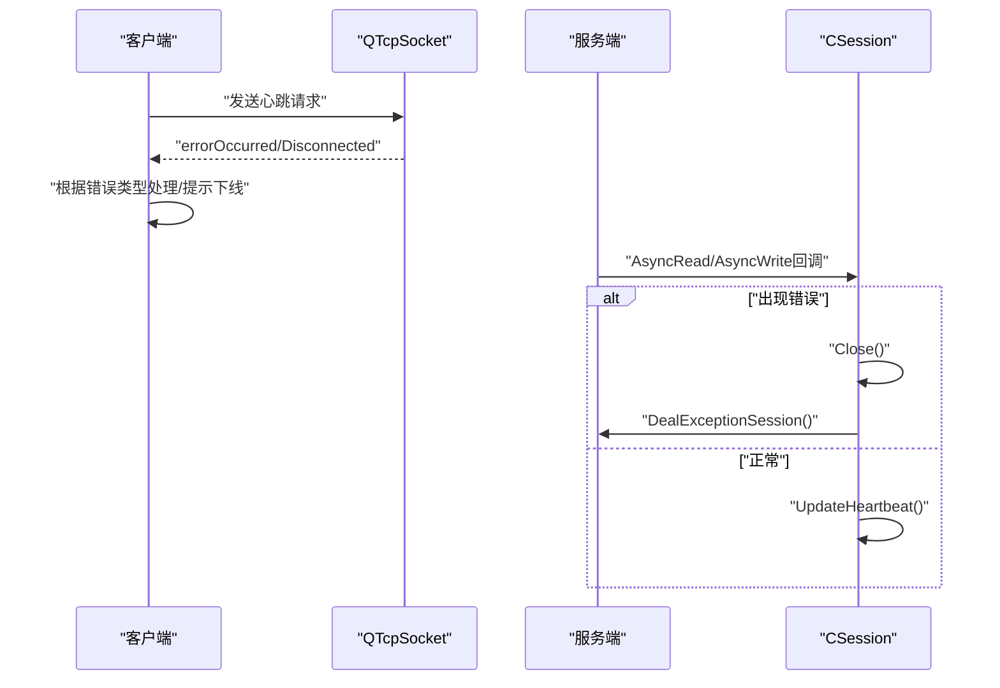
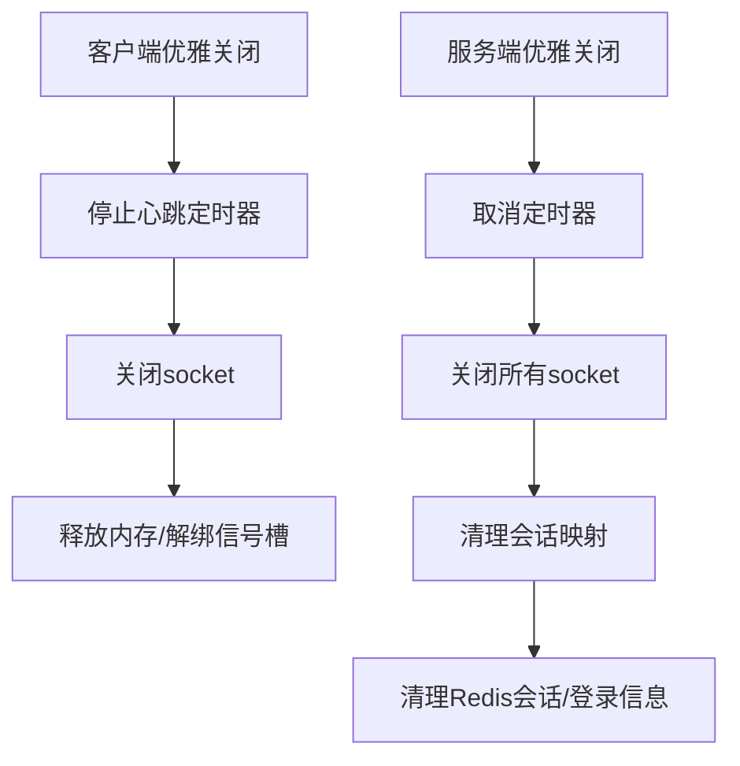
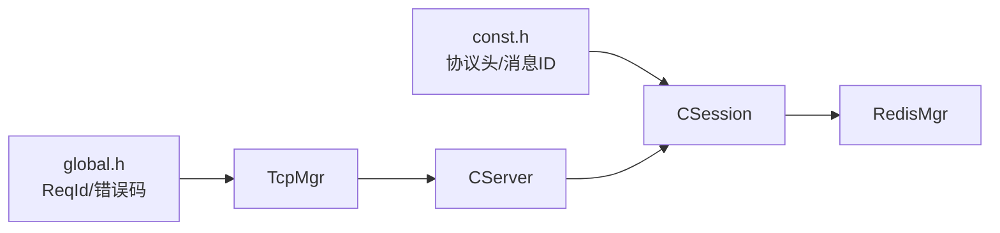

# 心跳检测机制

<cite>
**本文引用的文件**   
- [tcpmgr.h](file://client/llfcchat/include/tcpmgr.h)
- [tcpmgr.cpp](file://client/llfcchat/src/tcpmgr.cpp)
- [global.h](file://client/llfcchat/include/global.h)
- [CSession.h](file://server/ChatServer/include/CSession.h)
- [CSession.cpp](file://server/ChatServer/src/CSession.cpp)
- [CServer.h](file://server/ChatServer/include/CServer.h)
- [CServer.cpp](file://server/ChatServer/src/CServer.cpp)
- [const.h](file://server/ChatServer/include/const.h)
- [day35心跳逻辑.md](file://开发文档/day35心跳逻辑.md)
</cite>

## 目录
1. [简介](#简介)
2. [项目结构](#项目结构)
3. [核心组件](#核心组件)
4. [架构总览](#架构总览)
5. [详细组件分析](#详细组件分析)
6. [依赖关系分析](#依赖关系分析)
7. [性能考量](#性能考量)
8. [故障诊断指南](#故障诊断指南)
9. [结论](#结论)
10. [附录](#附录)

## 简介
本文件面向 LLFCChat 项目的“心跳检测机制”，从客户端与服务端两个维度，系统阐述心跳包设计、连接保活、异常检测与处理、自动重连策略、优雅关闭流程，以及监控指标与调优建议。目标是帮助读者快速理解并正确配置、排查和优化心跳相关行为。

## 项目结构
本项目采用前后端分离的架构：
- 客户端（Qt）通过 TCP 长连接与聊天服务器通信，使用定时器周期性发送心跳请求，并在收到心跳回复后维持连接活跃状态。
- 服务端（Boost.Asio）维护会话（Session），在每次接收消息时更新最后心跳时间戳；同时启动定时任务扫描过期会话，进行清理与资源回收。

```mermaid
graph TB
subgraph "客户端"
UI["界面层"]
TMgr["TcpMgr<br/>TCP管理器"]
Timer["QTimer<br/>心跳定时器"]
end
subgraph "服务端"
CServer["CServer<br/>会话管理与定时扫描"]
CSession["CSession<br/>读写与心跳时间戳"]
Logic["LogicSystem<br/>业务回调(含心跳处理)"]
Redis["Redis<br/>分布式锁/会话信息"]
end
UI --> TMgr
Timer --> TMgr
TMgr < --> |TCP 长连接| CServer
CServer --> CSession
CSession --> Logic
CServer --> Redis
```

**图表来源** 
- [tcpmgr.cpp:1-137](file://client/llfcchat/src/tcpmgr.cpp#L1-L137)
- [CServer.cpp:1-133](file://server/ChatServer/src/CServer.cpp#L1-L133)
- [CSession.cpp:1-338](file://server/ChatServer/src/CSession.cpp#L1-L338)

**章节来源**
- [tcpmgr.h:1-90](file://client/llfcchat/include/tcpmgr.h#L1-L90)
- [tcpmgr.cpp:1-137](file://client/llfcchat/src/tcpmgr.cpp#L1-L137)
- [CServer.h:1-33](file://server/ChatServer/include/CServer.h#L1-L33)
- [CServer.cpp:1-133](file://server/ChatServer/src/CServer.cpp#L1-L133)
- [CSession.h:1-86](file://server/ChatServer/include/CSession.h#L1-L86)
- [CSession.cpp:1-338](file://server/ChatServer/src/CSession.cpp#L1-L338)

## 核心组件
- 客户端 TcpMgr：封装 QTcpSocket 的收发、粘包处理、错误处理与信号分发；提供发送接口与连接生命周期事件。
- 客户端全局常量：定义心跳请求/回复的消息 ID，便于统一编解码与路由。
- 服务端 CServer：管理所有会话，启动定时器周期性扫描并清理过期连接。
- 服务端 CSession：维护每个连接的 socket、发送队列、接收缓冲、最后心跳时间戳，并提供心跳过期判断与更新方法。
- 服务端 const.h：定义协议头长度、消息 ID、错误码等常量。
- 开发文档 day35：对心跳概念、服务器侧实现思路、客户端发包与回包处理进行了说明。

**章节来源**
- [tcpmgr.h:1-90](file://client/llfcchat/include/tcpmgr.h#L1-L90)
- [tcpmgr.cpp:1-137](file://client/llfcchat/src/tcpmgr.cpp#L1-L137)
- [global.h:43-88](file://client/llfcchat/include/global.h#L43-L88)
- [CServer.h:1-33](file://server/ChatServer/include/CServer.h#L1-L33)
- [CServer.cpp:1-133](file://server/ChatServer/src/CServer.cpp#L1-L133)
- [CSession.h:1-86](file://server/ChatServer/include/CSession.h#L1-L86)
- [CSession.cpp:1-338](file://server/ChatServer/src/CSession.cpp#L1-L338)
- [const.h:1-104](file://server/ChatServer/include/const.h#L1-L104)
- [day35心跳逻辑.md:1-580](file://开发文档/day35心跳逻辑.md#L1-L580)

## 架构总览
下图展示心跳检测的整体交互流程：客户端定时发送心跳请求，服务端收到后更新会话心跳时间戳并返回心跳回复；服务端定时器定期扫描会话，若超过阈值则判定为过期并进行清理。



**图表来源** 
- [tcpmgr.cpp:583-612](file://client/llfcchat/src/tcpmgr.cpp#L583-L612)
- [CSession.cpp:119-126](file://server/ChatServer/src/CSession.cpp#L119-L126)
- [CSession.cpp:288-302](file://server/ChatServer/src/CSession.cpp#L288-L302)
- [CServer.cpp:75-118](file://server/ChatServer/src/CServer.cpp#L75-L118)
- [day35心跳逻辑.md:446-580](file://开发文档/day35心跳逻辑.md#L446-L580)

## 详细组件分析

### 客户端心跳发送与接收
- 发送频率：客户端使用 QTimer 周期触发，按开发文档示例设置为 10 秒（可根据网络环境调整）。
- 心跳请求格式：JSON 对象包含 fromuid 字段，用于标识发起方用户。
- 心跳回复处理：解析 JSON 中的 error 字段，成功则记录日志，失败则走错误分支。
- 连接断开处理：监听 disconnected 信号，通知上层进行下线提示与后续处理。



**图表来源** 
- [tcpmgr.cpp:583-612](file://client/llfcchat/src/tcpmgr.cpp#L583-L612)
- [day35心跳逻辑.md:488-548](file://开发文档/day35心跳逻辑.md#L488-L548)

**章节来源**
- [tcpmgr.cpp:1-137](file://client/llfcchat/src/tcpmgr.cpp#L1-L137)
- [tcpmgr.cpp:583-612](file://client/llfcchat/src/tcpmgr.cpp#L583-L612)
- [global.h:61-63](file://client/llfcchat/include/global.h#L61-L63)
- [day35心跳逻辑.md:488-548](file://开发文档/day35心跳逻辑.md#L488-L548)

### 服务端心跳接收与更新
- 读取流程：异步读取头部与体，校验长度与合法性后，将数据投递至逻辑队列。
- 心跳更新：在读取完整消息体后调用 UpdateHeartbeat() 更新 _last_heartbeat。
- 心跳处理：LogicSystem::HeartBeatHandler 解析请求并返回心跳回复。



**图表来源** 
- [CSession.h:28-76](file://server/ChatServer/include/CSession.h#L28-L76)
- [CSession.cpp:133-194](file://server/ChatServer/src/CSession.cpp#L133-L194)
- [CSession.cpp:288-302](file://server/ChatServer/src/CSession.cpp#L288-L302)
- [CServer.h:10-31](file://server/ChatServer/include/CServer.h#L10-L31)
- [CServer.cpp:75-118](file://server/ChatServer/src/CServer.cpp#L75-L118)

**章节来源**
- [CSession.cpp:133-194](file://server/ChatServer/src/CSession.cpp#L133-L194)
- [CSession.cpp:288-302](file://server/ChatServer/src/CSession.cpp#L288-L302)
- [const.h:63-65](file://server/ChatServer/include/const.h#L63-L65)
- [day35心跳逻辑.md:446-482](file://开发文档/day35心跳逻辑.md#L446-L482)

### 空闲连接检测与过期清理
- 检测周期：CServer 启动 steady_timer，每 60 秒触发 on_timer。
- 过期判断：遍历会话副本，调用 IsHeartbeatExpired(now)，差值超过阈值即认为过期。
- 清理流程：关闭 socket，收集过期会话，单独线程或循环外调用 DealExceptionSession() 清理 Redis 中的会话与登录信息。



**图表来源** 
- [CServer.cpp:75-118](file://server/ChatServer/src/CServer.cpp#L75-L118)
- [CSession.cpp:288-302](file://server/ChatServer/src/CSession.cpp#L288-L302)
- [CSession.cpp:304-336](file://server/ChatServer/src/CSession.cpp#L304-L336)

**章节来源**
- [CServer.cpp:75-118](file://server/ChatServer/src/CServer.cpp#L75-L118)
- [CSession.cpp:288-302](file://server/ChatServer/src/CSession.cpp#L288-L302)
- [CSession.cpp:304-336](file://server/ChatServer/src/CSession.cpp#L304-L336)

### 异常检测与连接状态维护
- 客户端异常：QTcpSocket::error 信号区分拒绝、远程关闭、主机不可达、超时、网络错误等；disconnected 信号触发下线流程。
- 服务端异常：异步读/写回调中捕获错误码，关闭 socket 并进入 DealExceptionSession() 清理。
- 连接有效性：CServer::CheckValid() 检查 session 是否存在，防止无效操作。



**图表来源** 
- [tcpmgr.cpp:63-98](file://client/llfcchat/src/tcpmgr.cpp#L63-L98)
- [CSession.cpp:196-220](file://server/ChatServer/src/CSession.cpp#L196-L220)
- [CServer.cpp:65-73](file://server/ChatServer/src/CServer.cpp#L65-L73)

**章节来源**
- [tcpmgr.cpp:63-98](file://client/llfcchat/src/tcpmgr.cpp#L63-L98)
- [CSession.cpp:196-220](file://server/ChatServer/src/CSession.cpp#L196-L220)
- [CServer.cpp:65-73](file://server/ChatServer/src/CServer.cpp#L65-L73)

### 自动重连逻辑
- 当前实现：客户端在连接断开时触发 sig_connection_closed，上层进行提示与离线流程；具体重连策略（如指数退避、最大重试次数）未在代码中体现。
- 建议方案：在 MainWindow 或独立的重连管理器中实现指数退避算法，结合网络状态与错误类型动态调整间隔，限制最大重试次数以避免无限重试。

[本节为通用建议，不直接分析具体文件]

### 优雅关闭流程
- 客户端：停止定时器、关闭 socket、释放资源；确保信号槽解绑，避免悬空引用。
- 服务端：关闭 socket，清理会话映射，释放 Redis 中的会话与登录信息；定时器取消。



**图表来源** 
- [tcpmgr.cpp:132-137](file://client/llfcchat/src/tcpmgr.cpp#L132-L137)
- [CServer.cpp:120-133](file://server/ChatServer/src/CServer.cpp#L120-L133)
- [CSession.cpp:80-84](file://server/ChatServer/src/CSession.cpp#L80-L84)

**章节来源**
- [tcpmgr.cpp:132-137](file://client/llfcchat/src/tcpmgr.cpp#L132-L137)
- [CServer.cpp:120-133](file://server/ChatServer/src/CServer.cpp#L120-L133)
- [CSession.cpp:80-84](file://server/ChatServer/src/CSession.cpp#L80-L84)

## 依赖关系分析
- 客户端依赖 Qt 网络模块与 JSON 库，通过 TcpMgr 统一管理 TCP 连接与消息路由。
- 服务端依赖 Boost.Asio 进行异步 I/O，使用 Redis 进行分布式锁与会话状态管理。
- 协议常量集中在 global.h 与 const.h，保证两端消息 ID 一致。



**图表来源** 
- [global.h:43-88](file://client/llfcchat/include/global.h#L43-L88)
- [const.h:38-79](file://server/ChatServer/include/const.h#L38-L79)
- [CServer.cpp:1-133](file://server/ChatServer/src/CServer.cpp#L1-L133)
- [CSession.cpp:1-338](file://server/ChatServer/src/CSession.cpp#L1-L338)

**章节来源**
- [global.h:43-88](file://client/llfcchat/include/global.h#L43-L88)
- [const.h:38-79](file://server/ChatServer/include/const.h#L38-L79)
- [CServer.cpp:1-133](file://server/ChatServer/src/CServer.cpp#L1-L133)
- [CSession.cpp:1-338](file://server/ChatServer/src/CSession.cpp#L1-L338)

## 性能考量
- 心跳频率：客户端默认 10 秒，可根据网络质量与设备功耗调整；过短会增加带宽与 CPU 开销，过长会降低异常检测灵敏度。
- 服务端扫描周期：默认 60 秒，适合大多数场景；高并发下可考虑分片扫描或增量扫描以减少锁竞争。
- 发送队列：服务端维护发送队列，需关注 MAX_SENDQUE 上限，避免内存膨胀。
- 序列化开销：JSON 解析与生成存在 CPU 开销，可在高频路径上考虑二进制协议或缓存优化。

[本节为通用指导，不直接分析具体文件]

## 故障诊断指南
- 客户端无心跳回复：检查网络连通性、防火墙/NAT 规则、服务端心跳处理逻辑；查看 TcpMgr 的错误信号与日志。
- 服务端会话频繁过期：确认客户端心跳是否正常发送；检查 IsHeartbeatExpired 阈值与 UpdateHeartbeat 调用点。
- 分布式锁冲突：观察 Redis 锁获取失败情况，确保清理流程正确释放锁。
- 连接异常断开：定位 QTcpSocket::error 的具体错误码，结合服务端 async_read/write 回调错误码进行分析。

**章节来源**
- [tcpmgr.cpp:63-98](file://client/llfcchat/src/tcpmgr.cpp#L63-L98)
- [CSession.cpp:196-220](file://server/ChatServer/src/CSession.cpp#L196-L220)
- [CSession.cpp:304-336](file://server/ChatServer/src/CSession.cpp#L304-L336)

## 结论
LLFCChat 的心跳机制通过客户端定时发送与服务端被动更新相结合，实现了连接保活与异常检测。服务端定时器扫描与分布式锁清理保证了资源的有效回收。建议在现有基础上完善客户端自动重连策略，并根据实际网络环境调优心跳频率与扫描周期，以提升系统的可靠性与性能。

[本节为总结，不直接分析具体文件]

## 附录
- 关键参数参考
  - 客户端心跳频率：10 秒（可按需调整）
  - 服务端扫描周期：60 秒
  - 心跳过期阈值：20 秒（演示用，生产建议与扫描周期匹配）
  - 协议头长度：HEAD_TOTAL_LEN=4，HEAD_ID_LEN=2，HEAD_DATA_LEN=2
  - 消息 ID：ID_HEART_BEAT_REQ=1023，ID_HEARTBEAT_RSP=1024

**章节来源**
- [day35心跳逻辑.md:418-444](file://开发文档/day35心跳逻辑.md#L418-L444)
- [const.h:38-45](file://server/ChatServer/include/const.h#L38-L45)
- [const.h:63-65](file://server/ChatServer/include/const.h#L63-L65)
- [global.h:61-63](file://client/llfcchat/include/global.h#L61-L63)