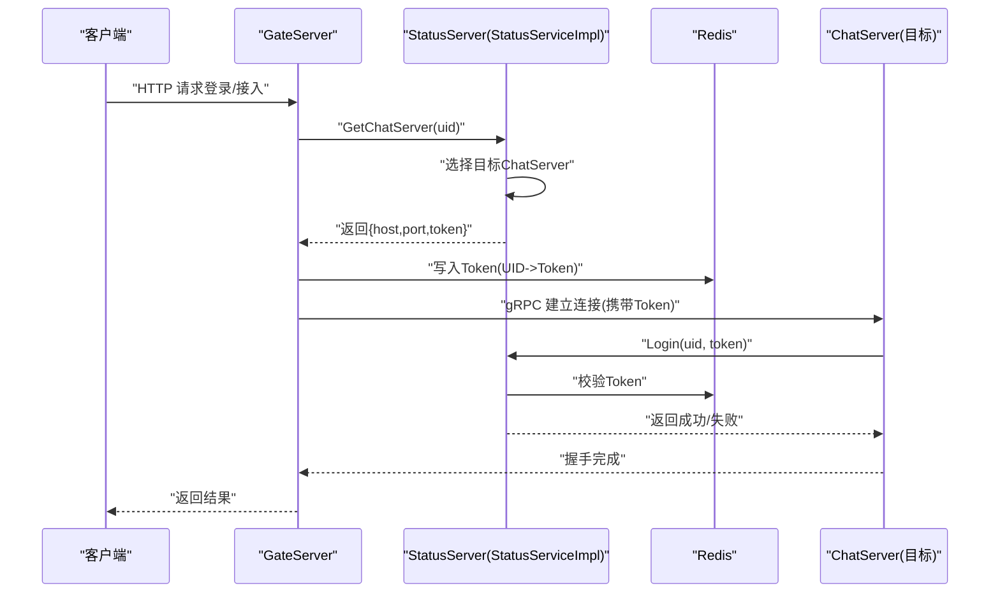
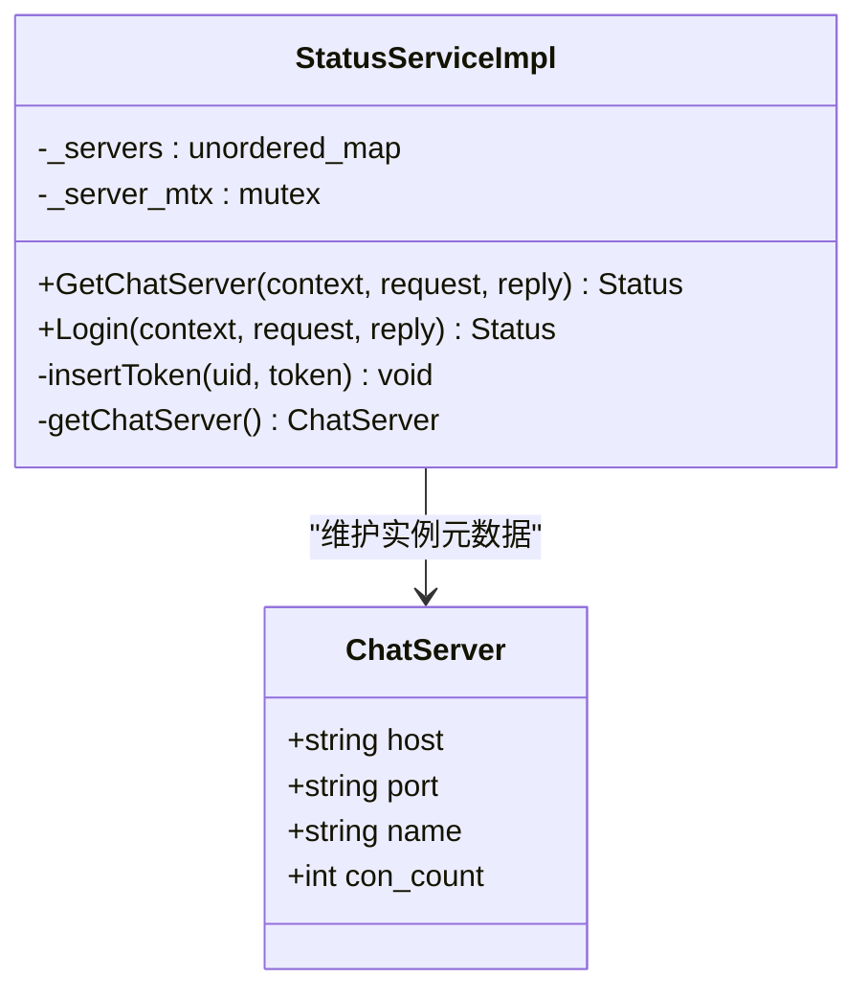
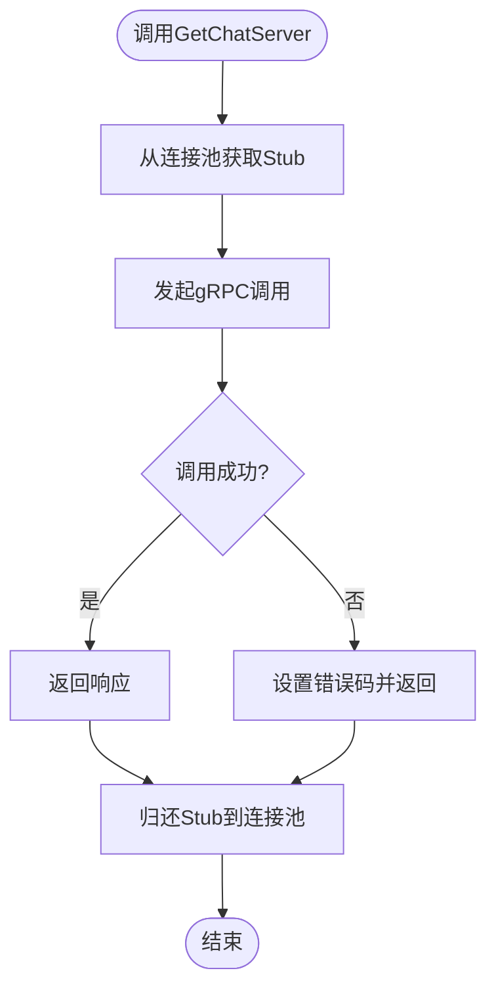
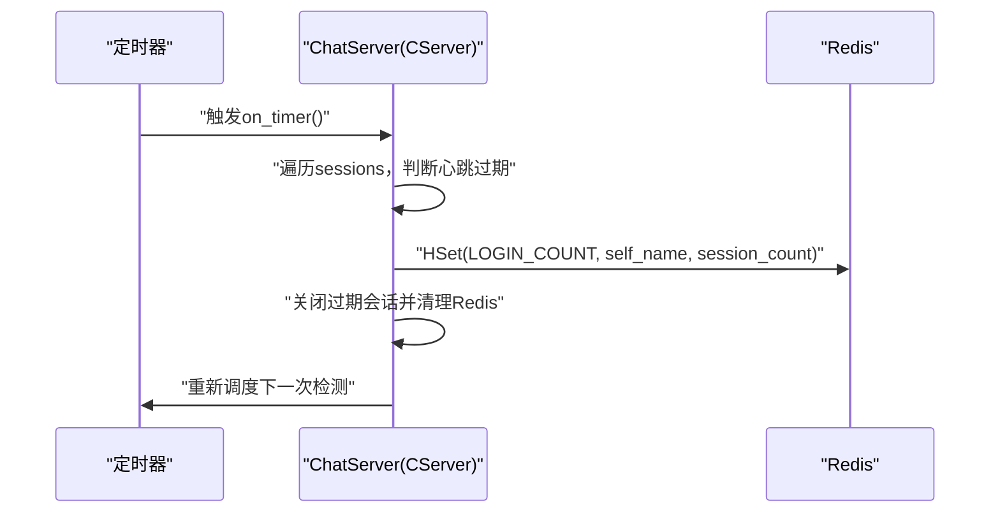
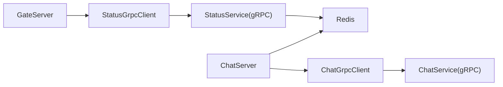

# 服务发现与注册

<cite>
**本文引用的文件**   
- [StatusServiceImpl.h](file://server/StatusServer/include/StatusServiceImpl.h)
- [StatusServiceImpl.cpp](file://server/StatusServer/src/StatusServiceImpl.cpp)
- [StatusServer.cpp](file://server/StatusServer/src/StatusServer.cpp)
- [StatusGrpcClient.h](file://server/GateServer/include/StatusGrpcClient.h)
- [StatusGrpcClient.cpp](file://server/GateServer/src/StatusGrpcClient.cpp)
- [ChatGrpcClient.h](file://server/ChatServer/include/ChatGrpcClient.h)
- [ChatGrpcClient.cpp](file://server/ChatServer/src/ChatGrpcClient.cpp)
- [message.proto](file://server/proto/control/message.proto)
- [config.ini（GateServer）](file://server/GateServer/config/config.ini)
- [config.ini（StatusServer）](file://server/StatusServer/config/config.ini)
- [chatserver1.ini（ChatServer）](file://server/ChatServer/config/chatserver1.ini)
- [CMakeLists.txt（StatusServer）](file://server/StatusServer/CMakeLists.txt)
- [CMakeLists.txt（GateServer）](file://server/GateServer/CMakeLists.txt)
- [day35心跳逻辑.md](file://开发文档/day35心跳逻辑.md)
</cite>

## 目录
1. [简介](#简介)
2. [项目结构](#项目结构)
3. [核心组件](#核心组件)
4. [架构总览](#架构总览)
5. [详细组件分析](#详细组件分析)
6. [依赖关系分析](#依赖关系分析)
7. [性能考量](#性能考量)
8. [故障排查指南](#故障排查指南)
9. [结论](#结论)
10. [附录](#附录)

## 简介
本文件面向 LLFCChat 项目的“服务发现与注册”机制，围绕以下目标展开：
- 服务注册流程：服务启动时的注册逻辑、服务信息上报、元数据管理。
- 服务状态管理：在线状态维护、健康检查集成、状态同步机制。
- 服务发现机制：客户端查询接口、缓存策略、负载均衡集成。
- 动态扩缩容支持：节点上下线处理、配置热更新、流量迁移。
- 配置管理：服务配置存储、版本控制、配置分发。
- 治理与运维：最佳实践、监控告警方案、故障恢复策略。

当前仓库实现了以 StatusServer 为核心的轻量级服务发现与路由能力，GateServer 作为统一入口通过 gRPC 调用 StatusService 获取 ChatServer 实例；ChatServer 之间通过 gRPC 进行横向通信。心跳与健康检查由 ChatServer 侧实现并写入 Redis，为后续基于连接数的负载均衡提供基础。

## 项目结构
- GateServer：对外 HTTP 网关，内部通过 StatusGrpcClient 调用 StatusService 完成服务发现。
- StatusServer：服务发现与路由中心，维护 ChatServer 列表与 Token 校验，返回目标 ChatServer 地址。
- ChatServer：业务聊天服务，提供 gRPC 服务，负责会话、心跳、跨服消息转发等。
- Proto：定义控制面与服务间通信的协议（StatusService、ChatService 等）。
- 配置：各服务通过 config.ini 声明自身与对端服务信息。

```mermaid
graph TB
Client["客户端"] --> Gate["GateServer<br/>HTTP入口"]
Gate --> Status["StatusServer<br/>gRPC: StatusService"]
Status --> |返回| Gate
Gate --> Chat1["ChatServer1<br/>gRPC: ChatService"]
Gate --> Chat2["ChatServer2<br/>gRPC: ChatService"]
Chat1 < --> Chat2
```

图表来源 
- [StatusServer.cpp:20-42](file://server/StatusServer/src/StatusServer.cpp#L20-L42)
- [StatusGrpcClient.cpp:1-53](file://server/GateServer/src/StatusGrpcClient.cpp#L1-L53)
- [ChatGrpcClient.cpp:1-205](file://server/ChatServer/src/ChatGrpcClient.cpp#L1-L205)
- [message.proto:19-44](file://server/proto/control/message.proto#L19-L44)

章节来源
- [StatusServer.cpp:20-42](file://server/StatusServer/src/StatusServer.cpp#L20-L42)
- [StatusGrpcClient.h:19-98](file://server/GateServer/include/StatusGrpcClient.h#L19-L98)
- [StatusGrpcClient.cpp:1-53](file://server/GateServer/src/StatusGrpcClient.cpp#L1-L53)
- [ChatGrpcClient.h:38-116](file://server/ChatServer/include/ChatGrpcClient.h#L38-L116)
- [ChatGrpcClient.cpp:1-205](file://server/ChatServer/src/ChatGrpcClient.cpp#L1-L205)
- [message.proto:19-44](file://server/proto/control/message.proto#L19-L44)

## 核心组件
- StatusServiceImpl：实现 StatusService，提供 GetChatServer 与 Login 两个 RPC，维护 ChatServer 元数据与 Token 校验。
- StatusConPool：GateServer 侧的连接池，复用 gRPC Channel/Stub，降低建立开销。
- ChatGrpcClient：ChatServer 侧的 gRPC 客户端，用于跨 ChatServer 的消息通知与踢人等操作。
- 配置模块：各服务通过 ConfigMgr 读取本地配置文件，初始化服务列表与对端地址。

章节来源
- [StatusServiceImpl.h:16-52](file://server/StatusServer/include/StatusServiceImpl.h#L16-L52)
- [StatusServiceImpl.cpp:17-125](file://server/StatusServer/src/StatusServiceImpl.cpp#L17-L125)
- [StatusGrpcClient.h:19-98](file://server/GateServer/include/StatusGrpcClient.h#L19-L98)
- [StatusGrpcClient.cpp:1-53](file://server/GateServer/src/StatusGrpcClient.cpp#L1-L53)
- [ChatGrpcClient.h:38-116](file://server/ChatServer/include/ChatGrpcClient.h#L38-L116)
- [ChatGrpcClient.cpp:1-205](file://server/ChatServer/src/ChatGrpcClient.cpp#L1-L205)

## 架构总览
下图展示了从客户端到服务发现的完整链路：GateServer 通过 StatusGrpcClient 调用 StatusService.GetChatServer，StatusServiceImpl 根据配置选择目标 ChatServer，并生成 token 写入 Redis；随后 GateServer 使用 token 与 ChatServer 建立会话。



图表来源 
- [StatusGrpcClient.cpp:1-53](file://server/GateServer/src/StatusGrpcClient.cpp#L1-L53)
- [StatusServiceImpl.cpp:17-125](file://server/StatusServer/src/StatusServiceImpl.cpp#L17-L125)
- [message.proto:19-44](file://server/proto/control/message.proto#L19-L44)

章节来源
- [StatusGrpcClient.cpp:1-53](file://server/GateServer/src/StatusGrpcClient.cpp#L1-L53)
- [StatusServiceImpl.cpp:17-125](file://server/StatusServer/src/StatusServiceImpl.cpp#L17-L125)
- [message.proto:19-44](file://server/proto/control/message.proto#L19-L44)

## 详细组件分析

### StatusServiceImpl：服务发现与路由
- 职责
  - 维护 ChatServer 元数据（名称、主机、端口、连接数占位字段）。
  - 提供 GetChatServer：根据策略选择目标 ChatServer，生成唯一 token 并写入 Redis。
  - 提供 Login：校验 token 是否有效，防止非法重放。
- 关键设计
  - 服务列表来源于配置文件 chatservers 与各 chatserverN 段。
  - 当前默认策略返回第一个服务；预留了按连接数最小化的扩展点（注释代码）。
  - Token 校验通过 Redis 键 USERTOKENPREFIX+uid 进行。



图表来源 
- [StatusServiceImpl.h:16-52](file://server/StatusServer/include/StatusServiceImpl.h#L16-L52)
- [StatusServiceImpl.cpp:29-92](file://server/StatusServer/src/StatusServiceImpl.cpp#L29-L92)

章节来源
- [StatusServiceImpl.h:16-52](file://server/StatusServer/include/StatusServiceImpl.h#L16-L52)
- [StatusServiceImpl.cpp:29-92](file://server/StatusServer/src/StatusServiceImpl.cpp#L29-L92)
- [config.ini（StatusServer）:14-23](file://server/StatusServer/config/config.ini#L14-L23)

### GateServer 侧：服务发现客户端
- 职责
  - 封装对 StatusService 的调用，包括 GetChatServer 与 Login。
  - 通过 StatusConPool 复用 gRPC Channel/Stub，提升吞吐与稳定性。
- 关键设计
  - 连接池大小固定，构造时从配置读取 StatusServer 地址。
  - 错误码统一映射为 ErrorCodes::RPCFailed。



图表来源 
- [StatusGrpcClient.cpp:1-53](file://server/GateServer/src/StatusGrpcClient.cpp#L1-L53)
- [StatusGrpcClient.h:19-98](file://server/GateServer/include/StatusGrpcClient.h#L19-L98)

章节来源
- [StatusGrpcClient.h:19-98](file://server/GateServer/include/StatusGrpcClient.h#L19-L98)
- [StatusGrpcClient.cpp:1-53](file://server/GateServer/src/StatusGrpcClient.cpp#L1-L53)
- [config.ini（GateServer）:6-8](file://server/GateServer/config/config.ini#L6-L8)

### ChatServer 侧：跨服通信与心跳
- 职责
  - 提供 ChatService 的 gRPC 服务端（消息通知、踢人等）。
  - 通过 ChatGrpcClient 向其他 ChatServer 发送跨服消息。
  - 定时检测心跳，统计在线会话数并写入 Redis，为负载均衡提供依据。
- 关键设计
  - 连接池按 PeerServer 配置项初始化，支持多对端。
  - 心跳定时器周期性收集过期会话，清理 Redis 中的会话与登录信息。



图表来源 
- [day35心跳逻辑.md:272-315](file://开发文档/day35心跳逻辑.md#L272-L315)
- [ChatGrpcClient.cpp:1-205](file://server/ChatServer/src/ChatGrpcClient.cpp#L1-L205)

章节来源
- [ChatGrpcClient.h:38-116](file://server/ChatServer/include/ChatGrpcClient.h#L38-L116)
- [ChatGrpcClient.cpp:1-205](file://server/ChatServer/src/ChatGrpcClient.cpp#L1-L205)
- [day35心跳逻辑.md:272-315](file://开发文档/day35心跳逻辑.md#L272-L315)

### 配置管理与服务元数据
- StatusServer 通过 chatservers 列表与各 chatserverN 段加载服务元数据。
- GateServer 通过 StatusServer 段配置发现服务地址。
- ChatServer 通过 SelfServer、PeerServer 段配置自身与对端。

章节来源
- [config.ini（StatusServer）:14-23](file://server/StatusServer/config/config.ini#L14-L23)
- [config.ini（GateServer）:6-8](file://server/GateServer/config/config.ini#L6-L8)
- [chatserver1.ini（ChatServer）:9-29](file://server/ChatServer/config/chatserver1.ini#L9-L29)

### 构建与部署要点
- StatusServer 与 GateServer 的 CMakeLists 中定义了可执行目标、依赖库以及将 config.ini 复制到运行目录的后置命令。

章节来源
- [CMakeLists.txt（StatusServer）:36-84](file://server/StatusServer/CMakeLists.txt#L36-L84)
- [CMakeLists.txt（GateServer）:37-89](file://server/GateServer/CMakeLists.txt#L37-L89)

## 依赖关系分析
- GateServer 依赖 StatusGrpcClient，后者依赖 gRPC 生成的 StatusService Stub。
- StatusServer 暴露 StatusService，依赖 Redis 进行 Token 校验。
- ChatServer 依赖 ChatGrpcClient，用于跨服消息；同时依赖 Redis 进行心跳计数与状态清理。



图表来源 
- [StatusGrpcClient.h:19-98](file://server/GateServer/include/StatusGrpcClient.h#L19-L98)
- [StatusServiceImpl.h:36-52](file://server/StatusServer/include/StatusServiceImpl.h#L36-L52)
- [ChatGrpcClient.h:38-116](file://server/ChatServer/include/ChatGrpcClient.h#L38-L116)

章节来源
- [StatusGrpcClient.h:19-98](file://server/GateServer/include/StatusGrpcClient.h#L19-L98)
- [StatusServiceImpl.h:36-52](file://server/StatusServer/include/StatusServiceImpl.h#L36-L52)
- [ChatGrpcClient.h:38-116](file://server/ChatServer/include/ChatGrpcClient.h#L38-L116)

## 性能考量
- 连接池复用：StatusConPool 与 ChatConPool 减少 gRPC Channel/Stub 创建销毁开销。
- 心跳与统计：定时任务批量收集过期会话，避免在锁内做 I/O，降低锁竞争。
- 负载均衡扩展：当前默认返回首个服务，已预留按连接数最小化策略（需启用 Redis 计数比较）。
- 配置热更新：当前为进程启动时读取配置，建议引入监听机制或外部配置中心以实现热更新。

[本节为通用指导，不直接分析具体文件]

## 故障排查指南
- 常见问题
  - Token 校验失败：确认 Redis 中 USERTOKENPREFIX+uid 是否存在且值匹配。
  - 服务不可达：检查 StatusServer/GateServer/ChatServer 配置是否正确，网络连通性是否正常。
  - 心跳超时：确认客户端心跳间隔小于服务器阈值，服务器定时器正常触发。
- 定位步骤
  - 查看 StatusServiceImpl.Login 的返回值与错误码。
  - 检查 Redis 中 LOGIN_COUNT、USER_SESSION_PREFIX、USERTOKENPREFIX 等键的状态。
  - 核对各服务的 config.ini 与 CMake 后置复制是否生效。

章节来源
- [StatusServiceImpl.cpp:94-125](file://server/StatusServer/src/StatusServiceImpl.cpp#L94-L125)
- [day35心跳逻辑.md:272-315](file://开发文档/day35心跳逻辑.md#L272-L315)

## 结论
LLFCChat 的服务发现与注册机制以 StatusServer 为中心，结合 GateServer 的 gRPC 客户端与 ChatServer 的心跳统计，形成了可扩展的轻量级服务发现体系。当前实现满足基本的服务定位与 Token 校验，具备进一步扩展负载均衡、配置热更新与更完善健康检查的基础。建议在现有基础上逐步落地连接数均衡、配置中心集成与更细粒度的健康探针。

[本节为总结性内容，不直接分析具体文件]

## 附录

### 服务注册流程（建议实现）
- 服务启动后向 StatusServer 上报自身元数据（名称、主机、端口、能力标签等）。
- StatusServer 持久化至 Redis 或内存表，并维护健康状态。
- 若采用主动注册模式，建议增加注册重试与幂等保护。

[本节为概念性说明，不直接分析具体文件]

### 服务状态管理（在线、健康、同步）
- 在线状态：ChatServer 定时统计会话数并写入 Redis，供 StatusServer 选择负载。
- 健康检查：可在 StatusServer 侧增加对 ChatServer 的主动探测（如 Ping/Pong）。
- 状态同步：建议引入事件总线或 Watch 机制，使配置变更与节点上下线实时传播。

[本节为概念性说明，不直接分析具体文件]

### 服务发现机制（查询、缓存、负载均衡）
- 查询接口：StatusService.GetChatServer 返回目标 ChatServer 与 Token。
- 缓存策略：GateServer 可缓存最近一次发现结果，配合 TTL 与失效回退。
- 负载均衡：启用按连接数最小化策略，结合 Redis 的 HGET/HINCRBY 原子操作。

[本节为概念性说明，不直接分析具体文件]

### 动态扩缩容（上下线、热更新、流量迁移）
- 节点上线：新增 ChatServer 实例，更新配置或注册中心，StatusServer 自动感知。
- 节点下线：优雅停止，移除配置或标记下线，流量平滑迁移。
- 流量迁移：灰度发布与权重切换，确保零中断。

[本节为概念性说明，不直接分析具体文件]

### 配置管理（存储、版本、分发）
- 存储：当前使用本地 ini 文件，建议迁移至集中式配置中心（如 etcd/Nacos）。
- 版本控制：配置变更需带版本号与回滚能力。
- 分发：通过 Watch 推送变更，客户端按需拉取或订阅。

[本节为概念性说明，不直接分析具体文件]

### 服务治理最佳实践
- 限流与熔断：对关键 RPC 增加限流与熔断保护。
- 可观测性：指标采集（QPS、延迟、错误率）、日志聚合与链路追踪。
- 安全：启用 TLS 与鉴权，限制访问白名单。

[本节为概念性说明，不直接分析具体文件]

### 监控告警方案
- 指标：服务存活、连接数、心跳成功率、Token 校验失败率。
- 告警：阈值告警与异常模式识别（如突发错误、延迟飙升）。
- 可视化：Dashboard 展示关键指标与拓扑。

[本节为概念性说明，不直接分析具体文件]

### 故障恢复策略
- 重试与退避：对瞬时失败进行指数退避重试。
- 降级：当 StatusServer 不可用时，回退到静态配置或只读模式。
- 自愈：自动重启失败实例，隔离异常节点。

[本节为概念性说明，不直接分析具体文件]