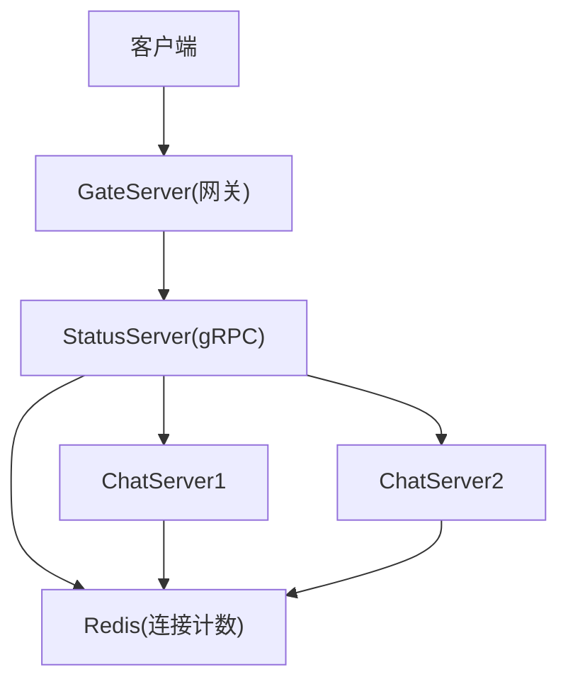
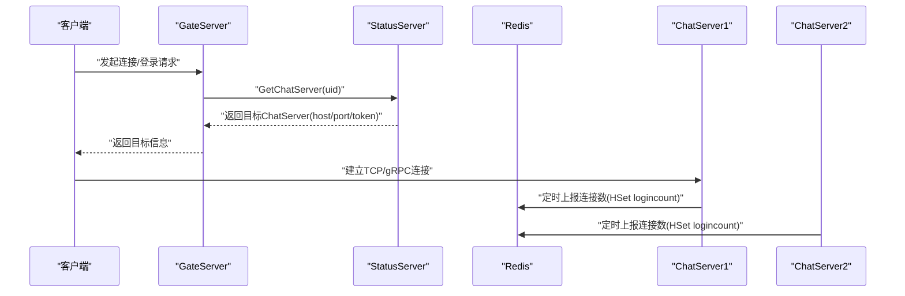
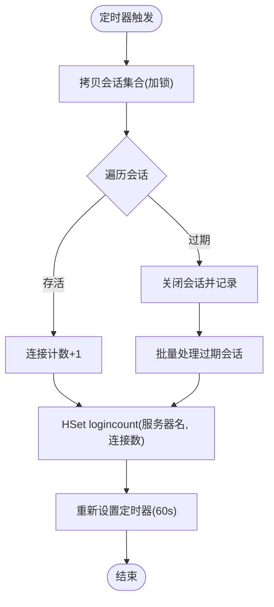
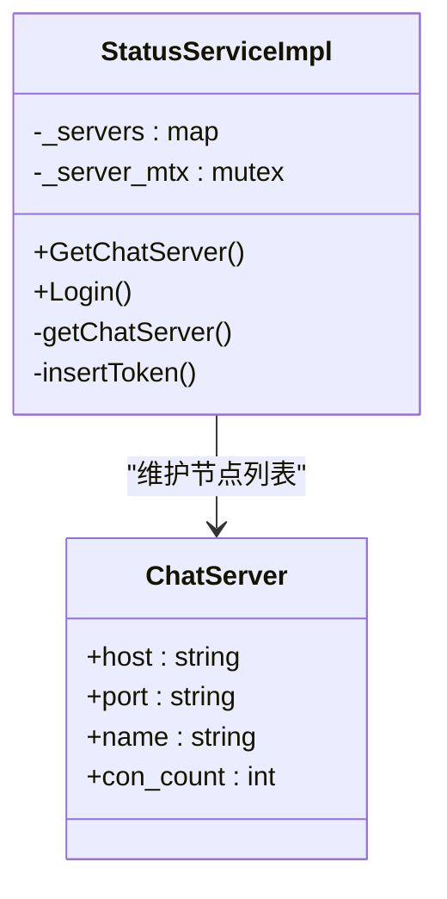
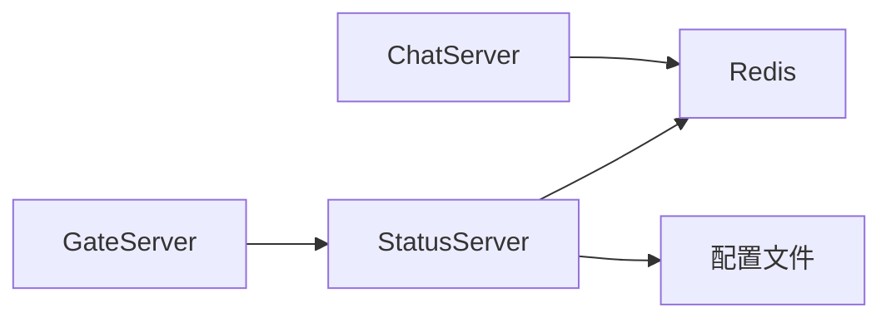

# 负载均衡机制

<cite>
**本文引用的文件**   
- [CServer.cpp](file://server/ChatServer/src/CServer.cpp)
- [StatusServiceImpl.h](file://server/StatusServer/include/StatusServiceImpl.h)
- [StatusServiceImpl.cpp](file://server/StatusServer/src/StatusServiceImpl.cpp)
- [const.h](file://server/ChatServer/include/const.h)
- [config.ini（StatusServer）](file://server/StatusServer/config/config.ini)
- [chatserver1.ini（ChatServer）](file://server/ChatServer/config/chatserver1.ini)
- [day35心跳逻辑.md](file://开发文档/day35心跳逻辑.md)
</cite>

## 目录
1. [引言](#引言)
2. [项目结构](#项目结构)
3. [核心组件](#核心组件)
4. [架构总览](#架构总览)
5. [详细组件分析](#详细组件分析)
6. [依赖关系分析](#依赖关系分析)
7. [性能考量](#性能考量)
8. [故障排查指南](#故障排查指南)
9. [结论](#结论)
10. [附录：配置与运维操作](#附录配置与运维操作)

## 引言
本文件面向LLFCChat项目的负载均衡机制，重点围绕连接数统计、动态分配算法、故障转移策略、服务状态管理以及配置与监控等方面展开。当前仓库中已实现“最少连接”的负载选择思路，并通过心跳定时任务将各ChatServer实例的连接数上报至Redis；状态服务（StatusServer）在请求时读取该数据并返回目标ChatServer地址。GateServer作为入口网关负责接入客户端，后续可扩展为统一的负载均衡器。

## 项目结构
- ChatServer：提供聊天会话能力，维护活跃会话集合，周期性统计连接数并写入Redis。
- StatusServer：暴露gRPC接口，根据配置加载ChatServer列表，并在请求时选择目标节点（当前默认返回首个节点，预留最少连接扩展）。
- GateServer：HTTP/TCP网关，用于接入客户端请求，可承载或转发到后端ChatServer。
- Redis：作为共享状态存储，保存各ChatServer的连接计数（键空间见常量定义）。
- 配置文件：StatusServer与ChatServer各自维护独立配置，包含服务端口、对端信息等。

图表来源 
- [StatusServiceImpl.cpp:17-27](file://server/StatusServer/src/StatusServiceImpl.cpp#L17-L27)
- [CServer.cpp:75-118](file://server/ChatServer/src/CServer.cpp#L75-L118)
- [const.h:85](file://server/ChatServer/include/const.h#L85)
- [config.ini（StatusServer）:14-23](file://server/StatusServer/config/config.ini#L14-L23)

章节来源
- [config.ini（StatusServer）:1-23](file://server/StatusServer/config/config.ini#L1-L23)
- [chatserver1.ini（ChatServer）:1-30](file://server/ChatServer/config/chatserver1.ini#L1-L30)

## 核心组件
- 连接数统计与上报
  - ChatServer通过定时器周期遍历会话，统计存活连接数量，并将结果以Hash形式写入Redis的指定键空间。
  - 心跳检测与连接清理在定时器回调中完成，避免频繁加锁影响性能。
- 状态服务与节点选择
  - StatusServer启动时从配置加载ChatServer列表，对外提供获取节点的gRPC接口。
  - 当前实现直接返回首个节点，但代码中保留了基于Redis连接数的最少连接选择逻辑（注释段），便于后续启用。
- 网关接入
  - GateServer作为统一入口，后续可集成负载均衡策略，依据StatusServer返回的目标节点进行转发。

章节来源
- [CServer.cpp:75-118](file://server/ChatServer/src/CServer.cpp#L75-L118)
- [StatusServiceImpl.cpp:29-55](file://server/StatusServer/src/StatusServiceImpl.cpp#L29-L55)
- [StatusServiceImpl.cpp:57-92](file://server/StatusServer/src/StatusServiceImpl.cpp#L57-L92)
- [const.h:85](file://server/ChatServer/include/const.h#L85)

## 架构总览
下图展示了客户端请求经GateServer进入后，如何调用StatusServer获取目标ChatServer，以及ChatServer如何上报连接数至Redis的完整流程。

图表来源 
- [StatusServiceImpl.cpp:17-27](file://server/StatusServer/src/StatusServiceImpl.cpp#L17-L27)
- [CServer.cpp:102-118](file://server/ChatServer/src/CServer.cpp#L102-L118)
- [const.h:85](file://server/ChatServer/include/const.h#L85)

## 详细组件分析

### 连接数统计与心跳机制
- 统计频率
  - 定时器每60秒触发一次，遍历会话集合统计存活连接数，并写入Redis。
- 数据结构设计
  - Redis使用Hash键“logincount”，字段名为ChatServer名称，值为当前连接数。
  - ChatServer内部维护会话映射，按会话ID索引，支持快速查找与清理。
- 实现要点
  - 定时器回调内加锁拷贝会话集合，避免并发修改导致的问题。
  - 过期会话关闭并收集，随后批量处理，降低锁竞争。
  - 心跳阈值由会话对象维护，超过阈值即判定为过期。

图表来源 
- [CServer.cpp:75-118](file://server/ChatServer/src/CServer.cpp#L75-L118)
- [const.h:85](file://server/ChatServer/include/const.h#L85)

章节来源
- [CServer.cpp:75-118](file://server/ChatServer/src/CServer.cpp#L75-L118)
- [day35心跳逻辑.md:644-750](file://开发文档/day35心跳逻辑.md#L644-L750)

### 动态分配算法
- 当前实现
  - StatusServer默认返回首个ChatServer（轮询未启用）。
- 可选算法
  - 轮询：简单均匀分发，适合节点能力相近场景。
  - 加权：结合节点权重（如CPU/内存/带宽），适用于异构节点。
  - 最少连接：基于Redis中的连接数选择负载最低的节点，适合长连接且负载波动较大的场景。
- 选择依据
  - 若节点能力差异大，优先加权；若连接数能真实反映负载，优先最少连接；否则采用轮询。
- 实现细节建议
  - 在StatusServiceImpl::getChatServer中启用最少连接逻辑：读取每个节点的连接数，比较并选择最小值；缺失值视为最大，确保健壮性。
  - 如需加权，可在配置中增加权重字段，计算加权得分后再选择。

图表来源 
- [StatusServiceImpl.h:16-50](file://server/StatusServer/include/StatusServiceImpl.h#L16-L50)
- [StatusServiceImpl.cpp:57-92](file://server/StatusServer/src/StatusServiceImpl.cpp#L57-L92)

章节来源
- [StatusServiceImpl.cpp:57-92](file://server/StatusServer/src/StatusServiceImpl.cpp#L57-L92)

### 故障转移策略
- 健康检查
  - 通过心跳检测判断会话是否存活；长时间无心跳则判定为异常。
  - 连接数上报失败或超时可作为节点不可用的辅助信号。
- 故障检测阈值
  - 会话心跳阈值（示例为20s，生产建议60s）；定时器间隔60s。
  - Redis读写失败重试与回退策略需完善（当前未体现）。
- 自动切换逻辑
  - StatusServer在选择节点时可加入健康检查：若某节点连接数长期缺失或心跳异常，则跳过该节点。
  - 网关层可缓存节点健康状态，短时间内避免频繁切换。
- 服务恢复处理
  - 当节点恢复心跳并正常上报连接数，状态服务将其纳入选择池。

章节来源
- [CServer.cpp:75-118](file://server/ChatServer/src/CServer.cpp#L75-L118)
- [day35心跳逻辑.md:418-444](file://开发文档/day35心跳逻辑.md#L418-L444)

### 服务状态管理
- 心跳上报
  - ChatServer定时统计连接数并写入Redis；会话收到消息时更新心跳时间戳。
- 状态同步
  - StatusServer启动时加载节点配置；运行时可选择性地拉取Redis中的连接数进行决策。
- 负载均衡器决策过程
  - 当前默认返回首个节点；预留最少连接选择逻辑，可按需启用。

章节来源
- [CServer.cpp:102-118](file://server/ChatServer/src/CServer.cpp#L102-L118)
- [StatusServiceImpl.cpp:29-55](file://server/StatusServer/src/StatusServiceImpl.cpp#L29-L55)

## 依赖关系分析
- ChatServer依赖Redis进行连接数上报，依赖自身会话管理与定时器。
- StatusServer依赖配置与Redis（可选）进行节点选择。
- GateServer作为入口，未来可依赖StatusServer与Redis进行负载均衡决策。

图表来源 
- [CServer.cpp:102-118](file://server/ChatServer/src/CServer.cpp#L102-L118)
- [StatusServiceImpl.cpp:29-55](file://server/StatusServer/src/StatusServiceImpl.cpp#L29-L55)
- [const.h:85](file://server/ChatServer/include/const.h#L85)

章节来源
- [const.h:85](file://server/ChatServer/include/const.h#L85)

## 性能考量
- 定时器粒度
  - 60秒间隔平衡了实时性与开销；在高并发场景可适当缩短至30秒，但需评估Redis压力。
- 锁竞争
  - 定时器内拷贝会话集合，减少持锁时间；批量处理过期会话，避免死锁。
- Redis访问
  - HSet/HGet操作轻量，但高频访问仍需关注网络与序列化开销；可考虑本地缓存最近一次连接数（带过期时间）。
- 选择算法
  - 最少连接需要遍历所有节点，节点规模较大时应引入缓存或增量更新。

[本节为通用指导，不直接分析具体文件]

## 故障排查指南
- 连接数未更新
  - 检查ChatServer定时器是否正常启动与回调执行。
  - 确认Redis连接与权限，验证键空间“logincount”是否存在。
- 节点选择异常
  - 查看StatusServer日志，确认节点配置是否正确加载。
  - 若启用最少连接，检查Redis中各节点连接数是否一致。
- 心跳超时
  - 调整会话心跳阈值与定时器间隔，确保与网络环境匹配。
  - 检查客户端心跳发送与服务器接收处理逻辑。

章节来源
- [CServer.cpp:75-118](file://server/ChatServer/src/CServer.cpp#L75-L118)
- [StatusServiceImpl.cpp:29-55](file://server/StatusServer/src/StatusServiceImpl.cpp#L29-L55)
- [day35心跳逻辑.md:418-444](file://开发文档/day35心跳逻辑.md#L418-L444)

## 结论
LLFCChat当前实现了基于心跳的连接数统计与Redis上报，状态服务具备最少连接的扩展点。建议在StatusServer中启用最少连接策略，并结合健康检查与缓存优化提升稳定性与性能。GateServer可进一步集成负载均衡逻辑，形成完整的分布式调度体系。

[本节为总结，不直接分析具体文件]

## 附录：配置与运维操作
- 权重调整
  - 在StatusServer配置中为各ChatServer添加权重字段，并在选择算法中加权计算。
- 节点上下线控制
  - 修改StatusServer配置中的chatservers列表，动态增删节点。
- 负载均衡策略切换
  - 在StatusServiceImpl::getChatServer中切换轮询、加权或最少连接逻辑，并通过配置开关控制。
- 监控指标与告警
  - 监控Redis中logincount的变化趋势，设置阈值告警（如单节点连接数突增）。
  - 监控StatusServer选择延迟与错误率，异常时触发告警。

章节来源
- [config.ini（StatusServer）:14-23](file://server/StatusServer/config/config.ini#L14-L23)
- [chatserver1.ini（ChatServer）:1-30](file://server/ChatServer/config/chatserver1.ini#L1-L30)
- [StatusServiceImpl.cpp:57-92](file://server/StatusServer/src/StatusServiceImpl.cpp#L57-L92)