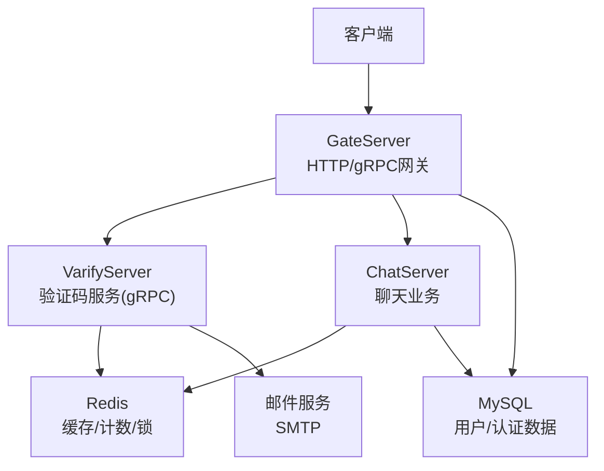
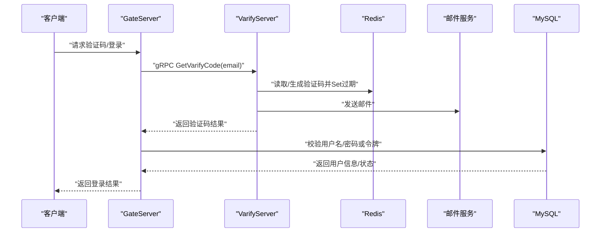
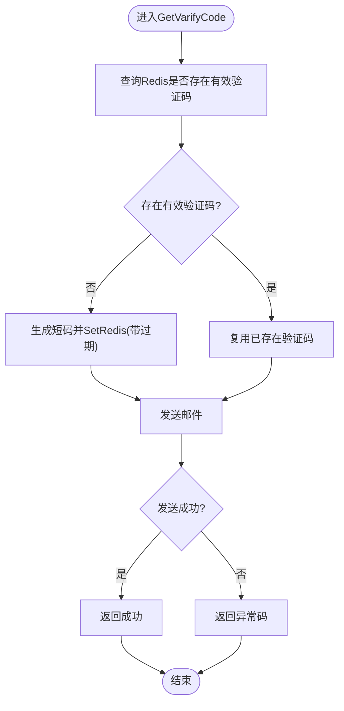
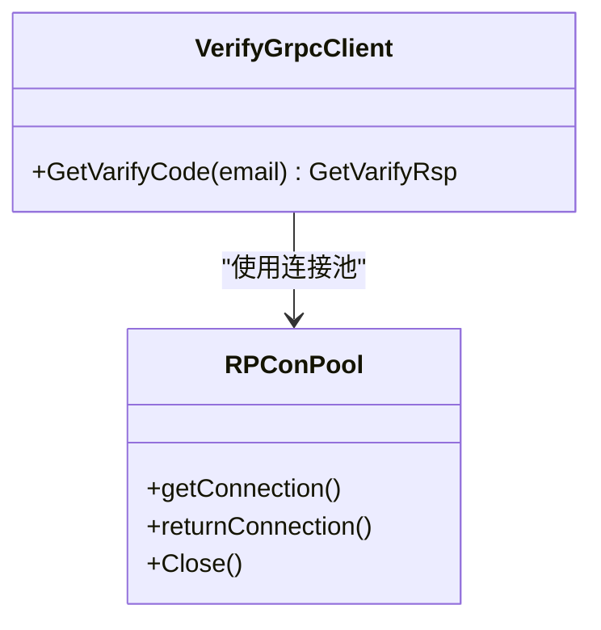
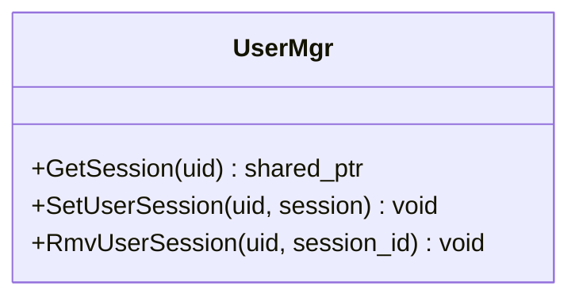
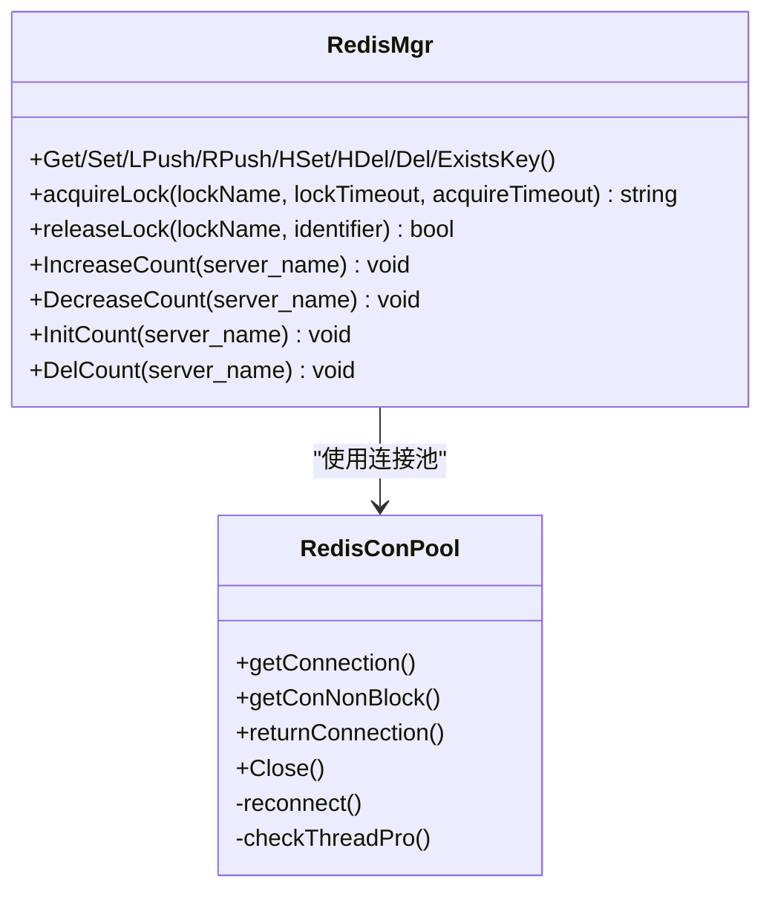
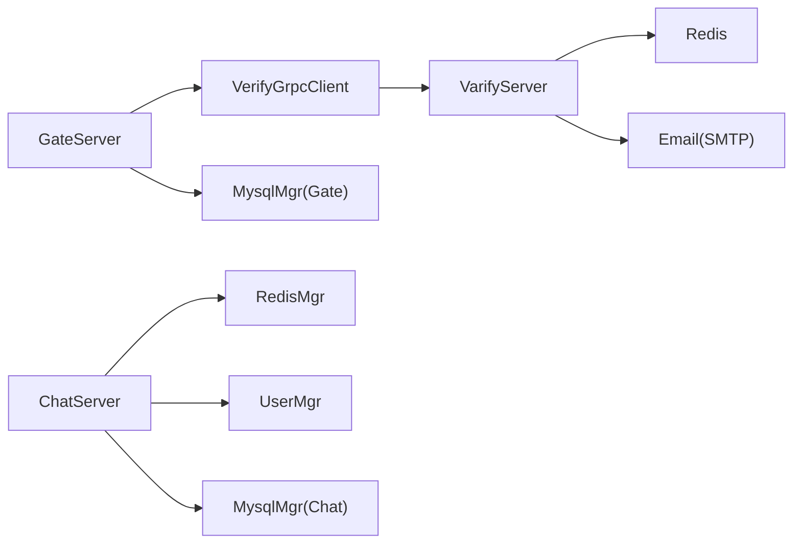

# 安全事件监控

<cite>
**本文引用的文件**   
- [server.js](file://server/VarifyServer/server.js)
- [redis.js](file://server/VarifyServer/redis.js)
- [email.js](file://server/VarifyServer/email.js)
- [VerifyGrpcClient.h](file://server/GateServer/include/VerifyGrpcClient.h)
- [RedisMgr.h](file://server/ChatServer/include/RedisMgr.h)
- [MysqlMgr.h（Gate）](file://server/GateServer/include/MysqlMgr.h)
- [MysqlMgr.h（Chat）](file://server/ChatServer/include/MysqlMgr.h)
- [UserMgr.h](file://server/ChatServer/include/UserMgr.h)
</cite>

## 目录
1. [引言](#引言)
2. [项目结构](#项目结构)
3. [核心组件](#核心组件)
4. [架构总览](#架构总览)
5. [详细组件分析](#详细组件分析)
6. [依赖关系分析](#依赖关系分析)
7. [性能考虑](#性能考虑)
8. [故障排查指南](#故障排查指南)
9. [结论](#结论)
10. [附录：监控配置与告警规则示例](#附录监控配置与告警规则示例)

## 引言
本文件面向LLFCChat项目的运维与安全团队，提供一套完整的安全事件监控方案。围绕登录认证、验证码发放、会话管理、缓存与数据库等关键路径，构建异常登录检测、暴力破解防护、敏感操作告警、安全指标采集与可视化、以及应急响应流程的闭环体系。文档既给出架构级视图，也深入到具体代码模块，帮助快速落地可操作的监控与告警策略。

## 项目结构
本项目采用多服务架构：
- GateServer：网关层，负责HTTP接入、鉴权校验、验证码调用、用户认证入口。
- ChatServer：聊天业务主服务，维护在线会话、消息收发、好友关系等。
- ResourceServer：资源服务，处理文件上传下载等。
- StatusServer：状态服务，用于健康检查与统计上报。
- VarifyServer：验证码服务（Node.js），基于gRPC对外提供验证码生成与邮件发送能力，使用Redis存储验证码并设置过期时间。
- 数据存储：MySQL（持久化）、Redis（缓存与分布式锁）。

**图示来源** 
- [VerifyGrpcClient.h:1-113](file://server/GateServer/include/VerifyGrpcClient.h#L1-L113)
- [server.js:1-76](file://server/VarifyServer/server.js#L1-L76)
- [redis.js:1-101](file://server/VarifyServer/redis.js#L1-L101)
- [email.js:1-37](file://server/VarifyServer/email.js#L1-L37)
- [RedisMgr.h:1-305](file://server/ChatServer/include/RedisMgr.h#L1-L305)
- [MysqlMgr.h（Gate）:1-20](file://server/GateServer/include/MysqlMgr.h#L1-L20)
- [MysqlMgr.h（Chat）:1-41](file://server/ChatServer/include/MysqlMgr.h#L1-L41)

**章节来源**
- [VerifyGrpcClient.h:1-113](file://server/GateServer/include/VerifyGrpcClient.h#L1-L113)
- [server.js:1-76](file://server/VarifyServer/server.js#L1-L76)
- [redis.js:1-101](file://server/VarifyServer/redis.js#L1-L101)
- [email.js:1-37](file://server/VarifyServer/email.js#L1-L37)
- [RedisMgr.h:1-305](file://server/ChatServer/include/RedisMgr.h#L1-L305)
- [MysqlMgr.h（Gate）:1-20](file://server/GateServer/include/MysqlMgr.h#L1-L20)
- [MysqlMgr.h（Chat）:1-41](file://server/ChatServer/include/MysqlMgr.h#L1-L41)

## 核心组件
- 验证码服务（VarifyServer）
  - gRPC接口GetVarifyCode：根据邮箱生成短码，写入Redis并设置过期时间，发送邮件通知。
  - Redis封装：连接池、心跳、错误重连、键值存取与过期控制。
  - 邮件服务：通过SMTP发送验证码邮件。
- 网关验证客户端（GateServer）
  - VerifyGrpcClient：连接池化的gRPC客户端，调用验证码服务，统一错误码处理。
- 会话与会话管理（ChatServer）
  - UserMgr：维护uid到CSession的映射，支持获取、设置、移除会话，为“多设备同时登录”检测提供基础。
- 缓存与分布式锁（ChatServer）
  - RedisMgr：连接池、PING保活、失败重试、分布式锁acquireLock/releaseLock、计数增减等。
- 用户认证与密码校验（GateServer/ChatServer）
  - MysqlMgr：注册、邮箱校验、密码更新、密码校验、用户信息查询等。

**章节来源**
- [server.js:1-76](file://server/VarifyServer/server.js#L1-L76)
- [redis.js:1-101](file://server/VarifyServer/redis.js#L1-L101)
- [email.js:1-37](file://server/VarifyServer/email.js#L1-L37)
- [VerifyGrpcClient.h:1-113](file://server/GateServer/include/VerifyGrpcClient.h#L1-L113)
- [UserMgr.h:1-22](file://server/ChatServer/include/UserMgr.h#L1-L22)
- [RedisMgr.h:1-305](file://server/ChatServer/include/RedisMgr.h#L1-L305)
- [MysqlMgr.h（Gate）:1-20](file://server/GateServer/include/MysqlMgr.h#L1-L20)
- [MysqlMgr.h（Chat）:1-41](file://server/ChatServer/include/MysqlMgr.h#L1-L41)

## 架构总览
下图展示登录与验证码相关的关键调用链，便于定位安全事件发生点与埋点位置。

**图示来源** 
- [VerifyGrpcClient.h:1-113](file://server/GateServer/include/VerifyGrpcClient.h#L1-L113)
- [server.js:1-76](file://server/VarifyServer/server.js#L1-L76)
- [redis.js:1-101](file://server/VarifyServer/redis.js#L1-L101)
- [email.js:1-37](file://server/VarifyServer/email.js#L1-L37)
- [MysqlMgr.h（Gate）:1-20](file://server/GateServer/include/MysqlMgr.h#L1-L20)

## 详细组件分析

### 验证码服务（VarifyServer）
- 功能要点
  - 接收邮箱，查询Redis是否已有有效验证码；若无则生成短码并设置过期时间。
  - 通过SMTP发送邮件，返回统一错误码。
  - Redis封装具备连接错误监听、断线重连、心跳机制。
- 安全意义
  - 验证码作为二次校验手段，降低自动化攻击成功率。
  - 过期时间与唯一ID防止重放与滥用。
- 监控建议
  - 记录验证码生成次数、邮件发送成功/失败率、Redis读写耗时与错误。
  - 对同一邮箱短时间内频繁请求进行限流与告警。

**图示来源** 
- [server.js:1-76](file://server/VarifyServer/server.js#L1-L76)
- [redis.js:1-101](file://server/VarifyServer/redis.js#L1-L101)
- [email.js:1-37](file://server/VarifyServer/email.js#L1-L37)

**章节来源**
- [server.js:1-76](file://server/VarifyServer/server.js#L1-L76)
- [redis.js:1-101](file://server/VarifyServer/redis.js#L1-L101)
- [email.js:1-37](file://server/VarifyServer/email.js#L1-L37)

### 网关验证码客户端（GateServer）
- 功能要点
  - 维护gRPC连接池，调用VarifyServer的GetVarifyCode接口。
  - 统一错误码处理，失败时返回RPC失败码。
- 安全意义
  - 连接池保障高并发下验证码服务的稳定性。
  - 错误码标准化便于上层统一处理与审计。
- 监控建议
  - 统计gRPC调用成功率、延迟分布、连接池占用情况。
  - 对上游服务不可用进行熔断与降级提示。

**图示来源** 
- [VerifyGrpcClient.h:1-113](file://server/GateServer/include/VerifyGrpcClient.h#L1-L113)

**章节来源**
- [VerifyGrpcClient.h:1-113](file://server/GateServer/include/VerifyGrpcClient.h#L1-L113)

### 会话管理与多设备登录检测（ChatServer）
- 功能要点
  - UserMgr维护uid到CSession的映射，支持获取、设置、移除会话。
- 安全意义
  - 通过统计同一uid的活跃会话数量，识别“多设备同时登录”。
  - 结合IP、UA等信息，辅助判断“异地登录”与“异常设备”。
- 监控建议
  - 实时统计每个uid的在线会话数，超过阈值触发告警。
  - 记录会话创建/销毁事件，关联IP、设备指纹、地理位置。

**图示来源** 
- [UserMgr.h:1-22](file://server/ChatServer/include/UserMgr.h#L1-L22)

**章节来源**
- [UserMgr.h:1-22](file://server/ChatServer/include/UserMgr.h#L1-L22)

### 缓存与分布式锁（ChatServer）
- 功能要点
  - RedisMgr提供连接池、PING保活、失败重试、分布式锁、计数增减等能力。
- 安全意义
  - 分布式锁可用于账号锁定、验证码防刷、登录失败计数等场景。
  - 计数增减可用于统计登录失败次数、访问频率等安全指标。
- 监控建议
  - 监控Redis连接健康度、命令执行错误率、锁竞争情况。
  - 对高频失败或锁冲突进行告警。

**图示来源** 
- [RedisMgr.h:1-305](file://server/ChatServer/include/RedisMgr.h#L1-L305)

**章节来源**
- [RedisMgr.h:1-305](file://server/ChatServer/include/RedisMgr.h#L1-L305)

### 用户认证与密码校验（GateServer/ChatServer）
- 功能要点
  - MysqlMgr提供注册、邮箱校验、密码更新、密码校验、用户信息查询等。
- 安全意义
  - 密码校验是登录成功的关键环节，需配合失败计数与账号锁定策略。
  - 邮箱校验与重置密码流程需防范钓鱼与劫持。
- 监控建议
  - 统计登录成功率、失败原因分布、密码重置请求量。
  - 对异常增长（如短时间大量失败）进行告警。

**章节来源**
- [MysqlMgr.h（Gate）:1-20](file://server/GateServer/include/MysqlMgr.h#L1-L20)
- [MysqlMgr.h（Chat）:1-41](file://server/ChatServer/include/MysqlMgr.h#L1-L41)

## 依赖关系分析
- GateServer依赖VerifyGrpcClient调用VarifyServer，依赖MysqlMgr进行用户认证。
- ChatServer依赖RedisMgr进行缓存与分布式锁，依赖UserMgr进行会话管理，依赖MysqlMgr进行用户与消息数据操作。
- VarifyServer依赖Redis与邮件服务。

**图示来源** 
- [VerifyGrpcClient.h:1-113](file://server/GateServer/include/VerifyGrpcClient.h#L1-L113)
- [MysqlMgr.h（Gate）:1-20](file://server/GateServer/include/MysqlMgr.h#L1-L20)
- [RedisMgr.h:1-305](file://server/ChatServer/include/RedisMgr.h#L1-L305)
- [UserMgr.h:1-22](file://server/ChatServer/include/UserMgr.h#L1-L22)
- [MysqlMgr.h（Chat）:1-41](file://server/ChatServer/include/MysqlMgr.h#L1-L41)
- [server.js:1-76](file://server/VarifyServer/server.js#L1-L76)
- [redis.js:1-101](file://server/VarifyServer/redis.js#L1-L101)
- [email.js:1-37](file://server/VarifyServer/email.js#L1-L37)

**章节来源**
- [VerifyGrpcClient.h:1-113](file://server/GateServer/include/VerifyGrpcClient.h#L1-L113)
- [MysqlMgr.h（Gate）:1-20](file://server/GateServer/include/MysqlMgr.h#L1-L20)
- [RedisMgr.h:1-305](file://server/ChatServer/include/RedisMgr.h#L1-L305)
- [UserMgr.h:1-22](file://server/ChatServer/include/UserMgr.h#L1-L22)
- [MysqlMgr.h（Chat）:1-41](file://server/ChatServer/include/MysqlMgr.h#L1-L41)
- [server.js:1-76](file://server/VarifyServer/server.js#L1-L76)
- [redis.js:1-101](file://server/VarifyServer/redis.js#L1-L101)
- [email.js:1-37](file://server/VarifyServer/email.js#L1-L37)

## 性能考虑
- 验证码服务
  - Redis连接池与心跳保活减少连接抖动；邮件发送异步化避免阻塞。
  - 对同一邮箱的请求进行限流，避免短信/邮件轰炸。
- 网关层
  - gRPC连接池复用，降低握手开销；错误码统一便于快速定位问题。
- 聊天服务
  - Redis连接池PING保活与自动重连提升稳定性；分布式锁避免竞态条件。
  - 会话管理使用内存映射，O(1)查找，适合高频访问。

[本节为通用指导，不直接分析具体文件]

## 故障排查指南
- 验证码无法收到
  - 检查Redis键是否存在且未过期；查看邮件发送日志与SMTP配置。
  - 关注VarifyServer的错误码与Redis连接状态。
- 登录失败率高
  - 检查MysqlMgr密码校验逻辑与数据库连通性；统计失败原因分布。
  - 关注Redis中登录失败计数是否异常增长。
- 多设备登录告警误报
  - 核对UserMgr会话映射是否正确清理；确认设备指纹与IP来源。
- Redis不稳定
  - 观察连接池PING结果与错误计数；检查网络与认证配置。

**章节来源**
- [server.js:1-76](file://server/VarifyServer/server.js#L1-L76)
- [redis.js:1-101](file://server/VarifyServer/redis.js#L1-L101)
- [email.js:1-37](file://server/VarifyServer/email.js#L1-L37)
- [VerifyGrpcClient.h:1-113](file://server/GateServer/include/VerifyGrpcClient.h#L1-L113)
- [RedisMgr.h:1-305](file://server/ChatServer/include/RedisMgr.h#L1-L305)
- [MysqlMgr.h（Gate）:1-20](file://server/GateServer/include/MysqlMgr.h#L1-L20)
- [UserMgr.h:1-22](file://server/ChatServer/include/UserMgr.h#L1-L22)

## 结论
通过在验证码服务、网关层、会话管理与缓存层建立完善的监控与告警机制，可实现对异常登录、暴力破解、多设备登录等安全事件的实时识别与处置。结合分布式锁与计数能力，能够灵活实现IP封禁、账号锁定、验证码强化等防护策略，并通过统一指标采集与可视化，支撑运维人员快速响应与持续优化。

[本节为总结性内容，不直接分析具体文件]

## 附录：监控配置与告警规则示例
以下为可直接落地的监控与告警配置建议，覆盖登录成功率、异常访问频率、攻击尝试次数、验证码与邮件服务健康等关键指标。

- 指标定义与采集点
  - 登录成功率：成功登录次数 / 总登录请求次数（GateServer MysqlMgr.CheckPwd）
  - 登录失败次数：按IP、账号维度统计（GateServer + Redis计数）
  - 验证码请求频率：单位时间内同一邮箱/手机号请求次数（VarifyServer server.js）
  - 邮件发送成功率：成功发送次数 / 总发送次数（VarifyServer email.js）
  - Redis健康度：连接可用率、PING成功率、错误率（ChatServer RedisMgr）
  - 多设备登录数：同一uid的活跃会话数（ChatServer UserMgr）
  - 分布式锁竞争：锁获取失败次数、等待时长（ChatServer RedisMgr.acquireLock）

- 告警规则示例
  - 登录失败率阈值：5分钟内失败率 > 30% 触发告警（GateServer）
  - 单IP高频失败：1分钟内失败 > 20次触发封禁（GateServer + Redis）
  - 单账号高频失败：1分钟内失败 > 10次触发账号锁定（GateServer + Redis）
  - 验证码风暴：1分钟内同一邮箱请求 > 5次触发限流（VarifyServer）
  - 邮件发送失败率：1分钟内失败率 > 10% 触发告警（VarifyServer）
  - 多设备登录：同一uid会话数 > 3 触发告警（ChatServer UserMgr）
  - Redis连接错误：连续3次PING失败触发告警（ChatServer RedisMgr）

- 监控面板建议
  - 登录成功率趋势图（按分钟聚合）
  - 登录失败Top IP/账号排行
  - 验证码请求QPS与失败率
  - 邮件发送成功率与延迟分布
  - Redis连接池使用率与健康度
  - 多设备登录实时列表

- 安全事件响应流程
  - 发现：监控告警触发（登录失败率、验证码风暴、多设备登录）
  - 研判：自动收集上下文（IP、账号、设备、地理位置）
  - 处置：自动封禁IP、锁定账号、强制下线异常会话
  - 恢复：解除限制前人工复核，记录审计日志
  - 复盘：输出事件报告，优化规则与策略

- 配置项建议（示例字段）
  - 登录失败阈值：fail_rate_threshold=0.3
  - 单IP失败上限：ip_fail_limit=20/min
  - 单账号失败上限：account_fail_limit=10/min
  - 验证码限流：verify_rate_limit=5/min_per_email
  - 邮件失败阈值：email_fail_threshold=0.1
  - 多设备上限：max_sessions_per_uid=3
  - Redis健康阈值：redis_ping_fail_threshold=3

[本节为通用配置示例，不直接分析具体文件]