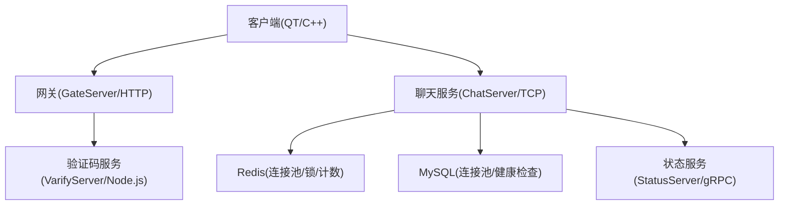
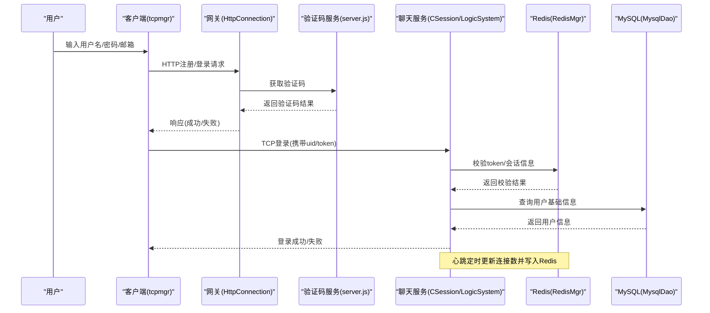
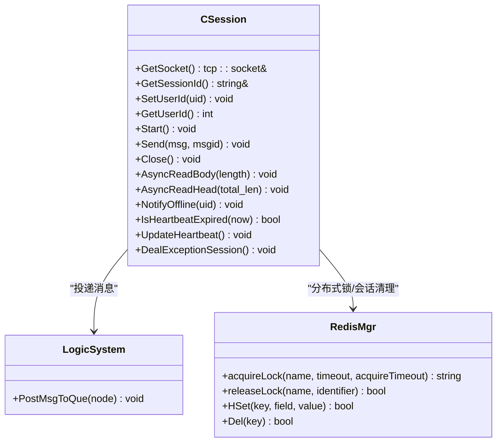
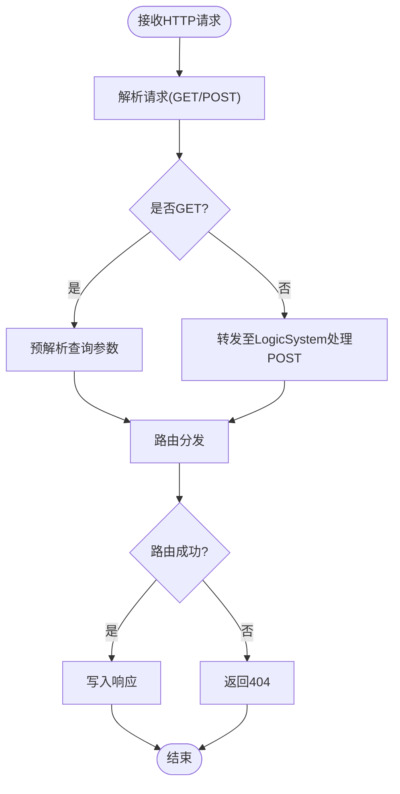
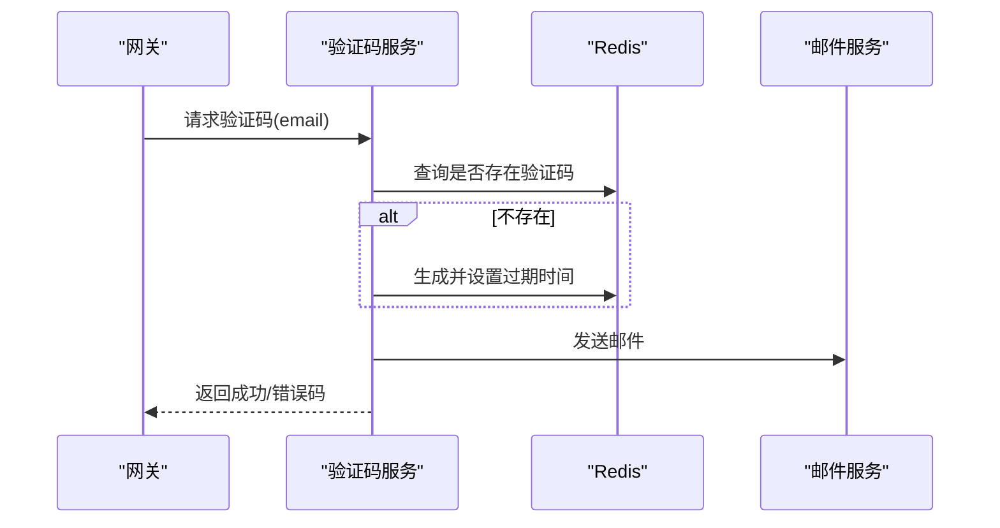
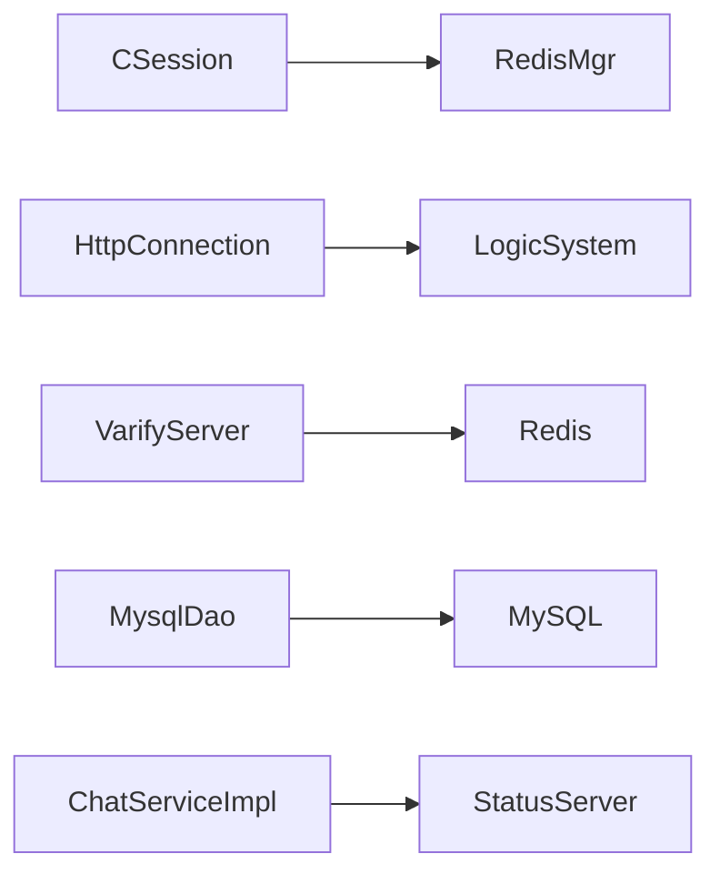

# 安全审计与监控

<cite>
**本文引用的文件**   
- [CSession.h](file://server/ChatServer/include/CSession.h)
- [CSession.cpp](file://server/ChatServer/src/CSession.cpp)
- [const.h](file://server/ChatServer/include/const.h)
- [RedisMgr.h](file://server/ChatServer/include/RedisMgr.h)
- [MysqlDao.h](file://server/ChatServer/include/MysqlDao.h)
- [HttpConnection.h](file://server/GateServer/include/HttpConnection.h)
- [HttpConnection.cpp](file://server/GateServer/src/HttpConnection.cpp)
- [server.js](file://server/VarifyServer/server.js)
- [chatserver1.ini](file://server/ChatServer/config/chatserver1.ini)
- [tcpmgr.cpp](file://client/llfcchat/src/tcpmgr.cpp)
- [logindialog.cpp](file://client/llfcchat/src/logindialog.cpp)
- [registerdialog.cpp](file://client/llfcchat/src/registerdialog.cpp)
- [day27-分布式服务设计.md](file://开发文档/day27-分布式服务设计.md)
- [day35心跳逻辑.md](file://开发文档/day35心跳逻辑.md)
</cite>

## 目录
1. [简介](#简介)
2. [项目结构](#项目结构)
3. [核心组件](#核心组件)
4. [架构总览](#架构总览)
5. [详细组件分析](#详细组件分析)
6. [依赖关系分析](#依赖关系分析)
7. [性能考量](#性能考量)
8. [故障排查指南](#故障排查指南)
9. [结论](#结论)
10. [附录](#附录)

## 简介
本文件面向LLFCChat项目的运维与安全团队，提供一套完整的安全审计与监控方案。内容覆盖：
- 操作日志记录体系：用户行为、API调用、错误日志的统一采集与归档
- 安全事件实时监控：异常登录检测、暴力破解防护、敏感操作告警
- 合规性审计：权限变更、数据访问、配置修改审计
- 统一指标平台：性能、安全、业务指标的集中采集与可视化
- 规范与配置：日志格式、监控配置示例、告警规则模板
- 应急响应：事件处置流程与应急预案

## 项目结构
本项目由客户端（Qt/C++）、网关（GateServer，HTTP）、聊天服务（ChatServer，TCP+gRPC）、验证码服务（VarifyServer，Node.js）以及状态服务（StatusServer）组成。安全与监控相关的关键点包括：
- 会话层的心跳与异常处理（CSession）
- HTTP请求解析与路由（HttpConnection）
- Redis连接池与分布式锁（RedisMgr）
- MySQL连接健康检查（MysqlDao）
- 验证码下发（VarifyServer）
- 客户端网络错误与登录交互（tcpmgr、logindialog、registerdialog）
- 配置文件（chatserver1.ini）

**图表来源** 
- [CSession.cpp](file://server/ChatServer/src/CSession.cpp)
- [HttpConnection.cpp](file://server/GateServer/src/HttpConnection.cpp)
- [server.js](file://server/VarifyServer/server.js)
- [RedisMgr.h](file://server/ChatServer/include/RedisMgr.h)
- [MysqlDao.h](file://server/ChatServer/include/MysqlDao.h)

**章节来源**
- [chatserver1.ini:1-30](file://server/ChatServer/config/chatserver1.ini#L1-L30)

## 核心组件
- CSession：管理TCP会话的生命周期、读写、心跳更新与异常清理，是安全审计的“会话级”关键节点
- HttpConnection：网关HTTP请求解析、参数提取、路由分发，是API审计的入口
- RedisMgr：连接池、键值操作、分布式锁、计数统计，支撑并发安全与指标收集
- MysqlDao：数据库连接池与健康检查，保障持久化层的稳定性
- VarifyServer：验证码生成与邮件发送，支撑注册/重置等安全流程
- 客户端模块：tcpmgr、logindialog、registerdialog负责网络错误上报与输入校验

**章节来源**
- [CSession.h:1-86](file://server/ChatServer/include/CSession.h#L1-L86)
- [CSession.cpp:1-338](file://server/ChatServer/src/CSession.cpp#L1-L338)
- [HttpConnection.h:1-36](file://server/GateServer/include/HttpConnection.h#L1-L36)
- [HttpConnection.cpp:1-225](file://server/GateServer/src/HttpConnection.cpp#L1-L225)
- [RedisMgr.h:1-305](file://server/ChatServer/include/RedisMgr.h#L1-L305)
- [MysqlDao.h:42-100](file://server/ChatServer/include/MysqlDao.h#L42-L100)
- [server.js:1-76](file://server/VarifyServer/server.js#L1-L76)
- [tcpmgr.cpp:63-729](file://client/llfcchat/src/tcpmgr.cpp#L63-L729)
- [logindialog.cpp:140-188](file://client/llfcchat/src/logindialog.cpp#L140-L188)
- [registerdialog.cpp:128-179](file://client/llfcchat/src/registerdialog.cpp#L128-L179)

## 架构总览
下图展示从客户端到各服务的请求链路，标注了安全审计与监控的关键落点（如认证、心跳、异常、指标）。

**图表来源** 
- [HttpConnection.cpp:132-194](file://server/GateServer/src/HttpConnection.cpp#L132-L194)
- [server.js:15-64](file://server/VarifyServer/server.js#L15-L64)
- [CSession.cpp:90-131](file://server/ChatServer/src/CSession.cpp#L90-L131)
- [RedisMgr.h:273-305](file://server/ChatServer/include/RedisMgr.h#L273-L305)
- [MysqlDao.h:42-100](file://server/ChatServer/include/MysqlDao.h#L42-L100)

## 详细组件分析

### 会话与心跳（CSession）
- 功能要点
  - 异步读头/体，长度校验与非法msg_id拦截
  - 心跳时间戳维护与过期判定
  - 异常连接清理与分布式锁保护下的Redis会话清理
  - 发送队列限流与写回调处理
- 安全意义
  - 防止恶意构造消息导致越界或资源耗尽
  - 心跳超时自动断链，降低僵尸连接风险
  - 分布式锁避免多进程并发清理冲突
- 监控建议
  - 记录心跳过期次数、读失败次数、写失败次数
  - 统计发送队列溢出次数，作为容量告警依据

**图表来源** 
- [CSession.h:28-76](file://server/ChatServer/include/CSession.h#L28-L76)
- [CSession.cpp:90-131](file://server/ChatServer/src/CSession.cpp#L90-L131)
- [RedisMgr.h:290-305](file://server/ChatServer/include/RedisMgr.h#L290-L305)

**章节来源**
- [CSession.cpp:1-338](file://server/ChatServer/src/CSession.cpp#L1-L338)
- [day35心跳逻辑.md:41-92](file://开发文档/day35心跳逻辑.md#L41-L92)
- [day35心跳逻辑.md:644-688](file://开发文档/day35心跳逻辑.md#L644-L688)

### 网关HTTP请求（HttpConnection）
- 功能要点
  - GET/POST请求解析，URL解码与参数提取
  - 路由分发至LogicSystem处理
  - 超时定时器与响应写入
- 安全意义
  - URL解码需防注入与畸形参数
  - 跨域设置在生产环境应限制来源
- 监控建议
  - 记录请求方法、路径、耗时、状态码
  - 对频繁404/4xx进行告警

**图表来源** 
- [HttpConnection.cpp:96-130](file://server/GateServer/src/HttpConnection.cpp#L96-L130)
- [HttpConnection.cpp:132-194](file://server/GateServer/src/HttpConnection.cpp#L132-L194)

**章节来源**
- [HttpConnection.cpp:1-225](file://server/GateServer/src/HttpConnection.cpp#L1-L225)

### 验证码服务（VarifyServer）
- 功能要点
  - 基于Redis存储验证码，带过期时间
  - 邮件发送验证码
- 安全意义
  - 验证码唯一性与时效性控制
  - 错误分支统一返回错误码便于审计
- 监控建议
  - 记录验证码生成成功率、邮件发送失败率

**图表来源** 
- [server.js:15-64](file://server/VarifyServer/server.js#L15-L64)

**章节来源**
- [server.js:1-76](file://server/VarifyServer/server.js#L1-L76)

### 客户端网络与登录（tcpmgr、logindialog、registerdialog）
- 功能要点
  - 网络错误分类与提示（连接拒绝、远程关闭、主机未找到、超时、网络错误）
  - 登录/注册界面输入校验（用户名、邮箱、密码、验证码）
- 安全意义
  - 前端校验减少无效请求，降低被扫描/爆破压力
  - 错误提示避免泄露内部细节
- 监控建议
  - 客户端错误类型分布统计，辅助定位网络问题

**章节来源**
- [tcpmgr.cpp:63-729](file://client/llfcchat/src/tcpmgr.cpp#L63-L729)
- [logindialog.cpp:140-188](file://client/llfcchat/src/logindialog.cpp#L140-L188)
- [registerdialog.cpp:128-179](file://client/llfcchat/src/registerdialog.cpp#L128-L179)

### 分布式登录与踢人（LogicSystem、StatusServer）
- 功能要点
  - 登录时校验Redis中的token，绑定session与服务器名
  - 多服踢人通过gRPC通知目标服务器下线
- 安全意义
  - Token校验防止伪造登录
  - 异地登录检测与强制下线
- 监控建议
  - 登录成功/失败计数、踢人触发次数

**章节来源**
- [day27-分布式服务设计.md:365-444](file://开发文档/day27-分布式服务设计.md#L365-L444)
- [day34多服程踢人逻辑.md:330-372](file://开发文档/day34多服程踢人逻辑.md#L330-L372)

## 依赖关系分析
- 组件耦合
  - CSession依赖RedisMgr进行分布式锁与会话清理
  - HttpConnection依赖LogicSystem进行路由处理
  - VarifyServer依赖Redis与邮件服务
  - MysqlDao独立维护连接池与健康检查线程
- 外部依赖
  - Redis：连接池、键值、分布式锁、计数
  - MySQL：连接池、健康检查
  - gRPC：服务间通信（StatusServer、ChatServiceImpl）

**图表来源** 
- [RedisMgr.h:267-305](file://server/ChatServer/include/RedisMgr.h#L267-L305)
- [MysqlDao.h:42-100](file://server/ChatServer/include/MysqlDao.h#L42-L100)

**章节来源**
- [const.h:1-104](file://server/ChatServer/include/const.h#L1-L104)

## 性能考量
- 心跳优化：在定时器中批量统计连接数并写入Redis，减少频繁加锁
- 发送队列限流：防止写放大与内存膨胀
- 连接池健康检查：定期PING与自动重连，提升可用性
- 建议
  - 将心跳阈值与统计间隔按负载调优
  - 对高并发场景增加异步日志落盘与采样策略

[本节为通用指导，不直接分析具体文件]

## 故障排查指南
- 常见问题定位
  - 心跳超时：检查CSession心跳更新与定时器间隔
  - 登录失败：核对Redis token与用户信息一致性
  - HTTP 404：检查路由分发与URL解析
  - 验证码失败：查看Redis存取与邮件发送日志
- 排查步骤
  - 查看服务端标准输出与错误日志
  - 检查Redis键空间（usession_、uip_、utoken_）
  - 验证MySQL连接健康检查线程状态
  - 客户端网络错误分类与重试策略

**章节来源**
- [CSession.cpp:90-131](file://server/ChatServer/src/CSession.cpp#L90-L131)
- [MysqlDao.h:42-100](file://server/ChatServer/include/MysqlDao.h#L42-L100)
- [HttpConnection.cpp:132-194](file://server/GateServer/src/HttpConnection.cpp#L132-L194)
- [server.js:15-64](file://server/VarifyServer/server.js#L15-L64)

## 结论
通过对会话层、网关层、验证码服务、数据库与缓存层的综合分析，可构建完善的LLFCChat安全审计与监控体系。建议在现有实现基础上补充统一的日志格式、指标采集与告警规则，形成闭环的安全生产环境。

[本节为总结，不直接分析具体文件]

## 附录

### 日志格式规范（建议）
- 用户行为日志
  - 字段：时间戳、用户ID、操作类型、来源IP、结果码、附加信息
  - 示例字段说明：操作类型包含登录、登出、好友申请、认证、私聊创建等
- API调用日志
  - 字段：时间戳、请求方法、URL、参数摘要、耗时、状态码、错误信息
- 错误日志
  - 字段：时间戳、模块、错误级别、错误码、堆栈摘要、上下文快照

### 监控配置示例（建议）
- 指标采集
  - 性能指标：QPS、延迟P95/P99、CPU/内存使用率、连接数
  - 安全指标：登录失败率、验证码失败率、异常连接数、踢人次数
  - 业务指标：好友申请通过率、私聊创建成功率、消息收发量
- 采集方式
  - 服务端埋点输出结构化日志
  - Redis计数器与键空间监控
  - MySQL连接池健康指标导出

### 告警规则配置（建议）
- 登录失败率 > 阈值（例如5%）持续N分钟
- 验证码失败率 > 阈值（例如10%）持续N分钟
- 心跳超时会话数突增（例如>100）
- HTTP 4xx/5xx比例超过阈值
- Redis连接池失败次数突增

### 安全事件响应流程与应急预案
- 事件分级
  - P1：大规模登录失败/验证码滥用
  - P2：单用户异常登录/异地登录
  - P3：个别接口错误/超时
- 响应步骤
  - 发现与确认：监控告警与日志复核
  - 隔离与抑制：临时封禁IP/账号、限流
  - 处置与恢复：清理会话、修复配置、重启服务
  - 复盘与改进：根因分析、策略优化、演练
- 预案要点
  - 快速回滚配置与代码版本
  - 启用降级模式（如关闭非核心功能）
  - 通知与沟通机制（对内对外）

[本节为通用指导，不直接分析具体文件]