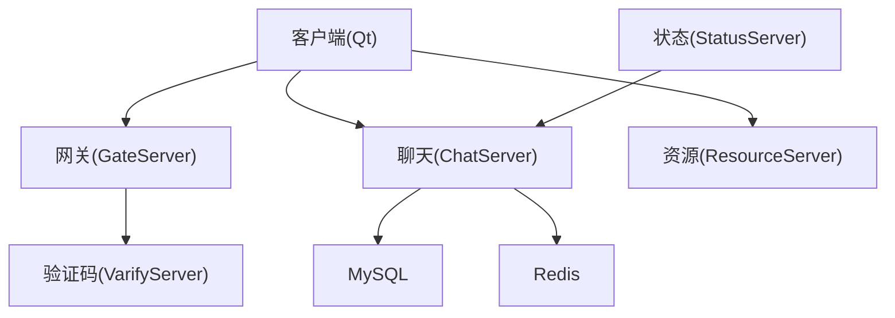
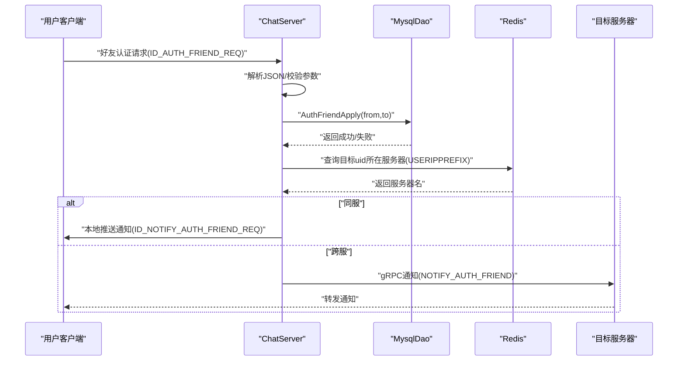
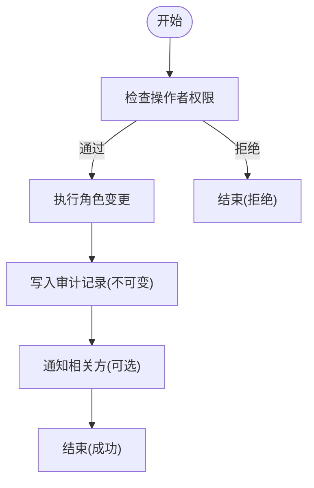
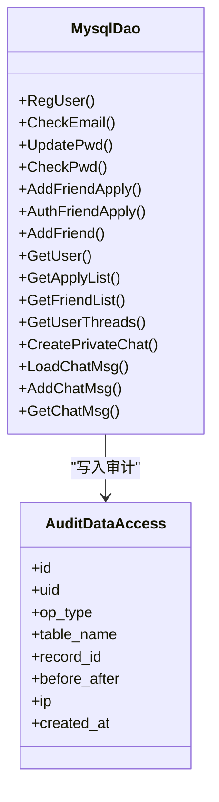
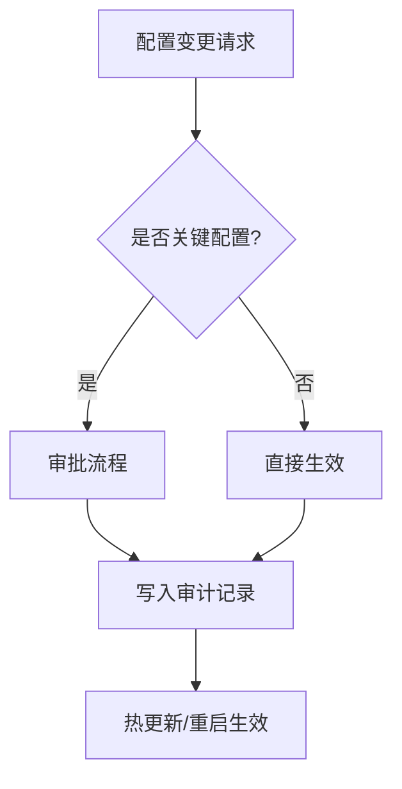
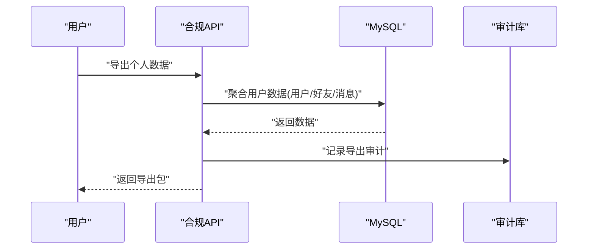
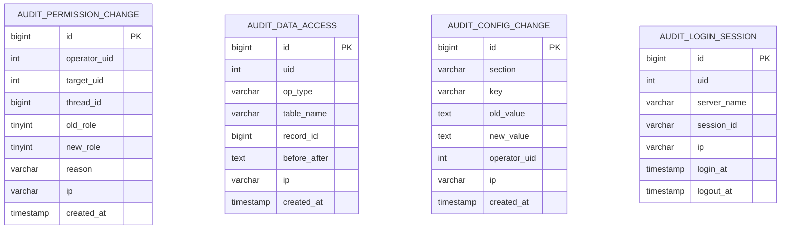
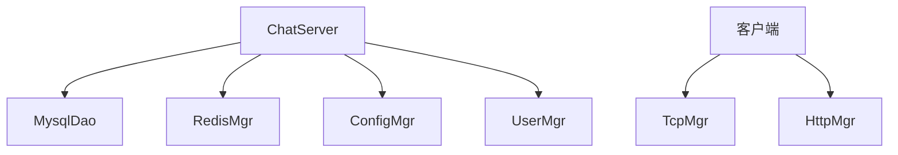

# 审计追踪

<cite>
**本文引用的文件**   
- [README.md](file://README.md)
- [llfc.sql](file://sql备份/llfc.sql)
- [MysqlDao.h](file://server/ChatServer/include/MysqlDao.h)
- [MysqlDao.cpp](file://server/ChatServer/src/MysqlDao.cpp)
- [ConfigMgr.h](file://server/ChatServer/include/ConfigMgr.h)
- [ConfigMgr.cpp](file://server/ChatServer/src/ConfigMgr.cpp)
- [const.h](file://server/ChatServer/include/const.h)
- [UserMgr.cpp](file://server/ChatServer/src/UserMgr.cpp)
- [CServer.cpp](file://server/ChatServer/src/CServer.cpp)
- [authenfriend.cpp](file://client/llfcchat/src/authenfriend.cpp)
- [tcpmgr.cpp](file://client/llfcchat/src/tcpmgr.cpp)
- [day29-好友认证和聊天通信.md](file://开发文档/day29-好友认证和聊天通信.md)
- [day37-聊天信息存储方案.md](file://开发文档/day37-聊天信息存储方案.md)
- [day27-分布式服务设计.md](file://开发文档/day27-分布式服务设计.md)
- [day34多服程踢人逻辑.md](file://开发文档/day34多服程踢人逻辑.md)
- [day35心跳逻辑.md](file://开发文档/day35心跳逻辑.md)
</cite>

## 目录
1. [引言](#引言)
2. [项目结构](#项目结构)
3. [核心组件](#核心组件)
4. [架构总览](#架构总览)
5. [详细组件分析](#详细组件分析)
6. [依赖关系分析](#依赖关系分析)
7. [性能考量](#性能考量)
8. [故障排查指南](#故障排查指南)
9. [结论](#结论)
10. [附录](#附录)

## 引言
本文件为 LLFCChat 项目的“审计追踪”专项文档，围绕权限变更审计、数据访问审计、配置修改审计与合规性审计支持展开。结合现有代码与数据库结构，梳理当前系统已具备的审计基础（如登录态、会话管理、消息持久化、好友申请流程等），并给出可落地的审计模型设计与实现建议，包括审计记录表结构、索引优化、查询调优、导出与分析工具以及审计数据的保护机制（防篡改、防删除）。

## 项目结构
LLFCChat 采用客户端（Qt）+ 多后端服务（ChatServer、GateServer、ResourceServer、StatusServer、VarifyServer）的分层架构。关键审计相关点：
- 客户端负责发起请求（如好友认证、登录、文件传输等），服务端处理业务并持久化到 MySQL，同时通过 Redis 维护会话与状态。
- ChatServer 中 MysqlDao 封装了所有数据库操作；ConfigMgr 提供配置读取；UserMgr 管理用户会话映射；CServer 负责连接管理与定时任务。
- 数据库脚本定义了用户、好友、群成员、聊天线程与消息等核心表结构，为审计数据建模提供了基础。

[无图表来源：该图为概念性架构图，不直接映射具体源码文件]

**章节来源**
- [README.md:1-112](file://README.md#L1-L112)

## 核心组件
- 数据库访问层（MysqlDao）：封装注册、认证、好友申请、好友建立、消息读写等 SQL 操作，使用连接池与事务控制。
- 配置管理（ConfigMgr）：从 INI 文件加载配置，供各模块读取运行参数。
- 会话管理（UserMgr）：维护 uid 与 CSession 的映射，支撑踢人、离线清理等。
- 服务器主循环（CServer）：维护 session 数量、定时器、过期会话清理。
- 客户端交互（authenfriend.cpp、tcpmgr.cpp）：构造请求、发送 TCP 消息、处理响应。

**章节来源**
- [MysqlDao.h:1-270](file://server/ChatServer/include/MysqlDao.h#L1-L270)
- [MysqlDao.cpp:1-800](file://server/ChatServer/src/MysqlDao.cpp#L1-L800)
- [ConfigMgr.h:1-84](file://server/ChatServer/include/ConfigMgr.h#L1-L84)
- [ConfigMgr.cpp:1-50](file://server/ChatServer/src/ConfigMgr.cpp#L1-L50)
- [UserMgr.cpp:1-49](file://server/ChatServer/src/UserMgr.cpp#L1-L49)
- [CServer.cpp:102-132](file://server/ChatServer/src/CServer.cpp#L102-L132)
- [authenfriend.cpp:407-442](file://client/llfcchat/src/authenfriend.cpp#L407-L442)
- [tcpmgr.cpp:63-729](file://client/llfcchat/src/tcpmgr.cpp#L63-L729)

## 架构总览
下图展示与审计相关的核心调用链：客户端发起好友认证请求，ChatServer 解析并调用 MysqlDao 完成数据库更新，随后通过 Redis 定位目标用户所在服务器并通知对方。

**图表来源**
- [MysqlDao.cpp:211-244](file://server/ChatServer/src/MysqlDao.cpp#L211-L244)
- [day29-好友认证和聊天通信.md:1-98](file://开发文档/day29-好友认证和聊天通信.md#L1-L98)
- [day37-聊天信息存储方案.md:1785-1902](file://开发文档/day37-聊天信息存储方案.md#L1785-L1902)

**章节来源**
- [MysqlDao.cpp:211-244](file://server/ChatServer/src/MysqlDao.cpp#L211-L244)
- [day29-好友认证和聊天通信.md:1-98](file://开发文档/day29-好友认证和聊天通信.md#L1-L98)

## 详细组件分析

### 权限变更审计（角色分配、授权/撤销）
- 现状
  - 群聊成员表 group_chat_member 包含 role（普通成员/管理员/创建者）、joined_at、muted_until 等字段，可用于记录成员角色与禁言状态。
  - 当前代码未显式暴露“角色变更”接口或审计写入点，但可在角色调整时追加审计记录。
- 建议
  - 新增审计表 audit_permission_change，记录操作时间、操作者、目标用户、群组 thread_id、旧角色、新角色、原因、来源IP等。
  - 在角色授予/撤销/禁言/解禁等路径插入审计记录，确保不可变（只追加）且带签名或哈希链。
  - 对敏感操作增加二次确认与审批流（可选）。

[无图表来源：该图为概念流程图，不直接映射具体源码文件]

**章节来源**
- [llfc.sql:380-391](file://sql备份/llfc.sql#L380-L391)

### 数据访问审计（敏感数据查询、修改、删除）
- 现状
  - 用户表 user 含 pwd、email、icon 等敏感字段；消息表 chat_message 含 content、status、msg_type 等。
  - MysqlDao 提供 GetUser、UpdatePwd、AddChatMsg、LoadChatMsg 等方法，但未统一打点审计。
- 建议
  - 在 MysqlDao 的关键方法前后插入审计日志（读/写/删），记录 uid、thread_id、message_id、操作类型、影响行数、耗时、错误码等。
  - 对高敏字段（pwd、email、icon）的访问进行脱敏输出与白名单控制。
  - 审计记录独立存储于 audit_data_access 表，禁止被业务逻辑覆盖或删除。

**图表来源**
- [MysqlDao.h:236-267](file://server/ChatServer/include/MysqlDao.h#L236-L267)
- [MysqlDao.cpp:19-504](file://server/ChatServer/src/MysqlDao.cpp#L19-L504)

**章节来源**
- [llfc.sql:464-481](file://sql备份/llfc.sql#L464-L481)
- [llfc.sql:24-37](file://sql备份/llfc.sql#L24-L37)
- [MysqlDao.cpp:19-504](file://server/ChatServer/src/MysqlDao.cpp#L19-L504)

### 配置修改审计（系统配置、业务参数、安全策略）
- 现状
  - ConfigMgr 从 INI 文件加载配置，运行时只读；无配置变更历史。
- 建议
  - 引入配置版本化与变更审计表 audit_config_change，记录 key、old_value、new_value、operator、reason、timestamp。
  - 对关键配置（如数据库连接、Redis 地址、安全策略开关）启用变更审批与灰度发布。
  - 启动时校验配置完整性，异常告警。

[无图表来源：该图为概念流程图，不直接映射具体源码文件]

**章节来源**
- [ConfigMgr.h:1-84](file://server/ChatServer/include/ConfigMgr.h#L1-L84)
- [ConfigMgr.cpp:1-50](file://server/ChatServer/src/ConfigMgr.cpp#L1-L50)

### 合规性审计支持（GDPR、网络安全法等）
- 现状
  - 系统具备用户标识（uid）、会话绑定（USER_SESSION_PREFIX、USERIPPREFIX）、消息持久化（chat_message）、好友申请与关系（friend_apply、friend）。
- 建议
  - 提供“数据主体权利”能力：导出个人数据、删除个人数据、撤回同意、限制处理等。
  - 对敏感数据处理（密码、邮箱、头像）进行最小化采集与加密存储。
  - 审计日志保留周期与访问控制符合法规要求，支持第三方审计。

[无图表来源：该图为概念流程图，不直接映射具体源码文件]

**章节来源**
- [llfc.sql:292-304](file://sql备份/llfc.sql#L292-L304)
- [llfc.sql:177-187](file://sql备份/llfc.sql#L177-L187)
- [llfc.sql:24-37](file://sql备份/llfc.sql#L24-L37)

### 审计数据模型设计（表结构、索引与查询优化）
- 建议表结构
  - audit_permission_change：权限变更审计
  - audit_data_access：数据访问审计
  - audit_config_change：配置变更审计
  - audit_login_session：登录与会话审计
- 索引优化
  - 按 created_at、uid、thread_id、op_type 建立复合索引，提升范围查询与分页效率。
  - 对大文本字段（content、diff）使用外置存储或压缩。
- 查询调优
  - 使用分区表（按月/季度）归档历史审计数据。
  - 对高频查询建立物化视图或汇总表。

[无图表来源：该图为概念ER图，不直接映射具体源码文件]

**章节来源**
- [llfc.sql:24-37](file://sql备份/llfc.sql#L24-L37)
- [llfc.sql:380-391](file://sql备份/llfc.sql#L380-L391)

### 审计数据导出与分析工具
- 导出
  - 提供 REST/gRPC 接口，支持按 uid、时间范围、操作类型导出 CSV/JSON。
  - 支持增量导出与断点续传，避免大数据量阻塞。
- 分析
  - 构建看板：登录失败率、敏感访问热点、权限变更趋势、配置变更频率。
  - 风险评分：基于规则引擎对异常行为打分（如频繁失败登录、越权访问）。
- 报告
  - 生成合规报告（GDPR、网络安全法），包含数据访问统计、处置记录、留存策略。

[无章节来源：本节为通用建议，不直接分析具体文件]

### 审计数据的保护机制（防篡改、防删除）
- 存储
  - 审计表设置为只追加模式，禁用 UPDATE/DELETE。
  - 使用 WORM（Write Once Read Many）存储或区块链式哈希链校验。
- 访问
  - 最小权限原则，仅审计管理员可读取；操作需双人复核。
- 备份
  - 异地多活备份，定期校验一致性。

[无章节来源：本节为通用建议，不直接分析具体文件]

## 依赖关系分析
- 组件耦合
  - ChatServer 依赖 MysqlDao（数据库）、RedisMgr（会话/缓存）、ConfigMgr（配置）、UserMgr（会话映射）。
  - 客户端依赖 TcpMgr 与 HttpMgr 进行网络通信。
- 外部依赖
  - MySQL、Redis、gRPC、Boost.PropertyTree（INI 解析）。

**图表来源**
- [MysqlDao.h:236-267](file://server/ChatServer/include/MysqlDao.h#L236-L267)
- [ConfigMgr.h:46-82](file://server/ChatServer/include/ConfigMgr.h#L46-L82)
- [UserMgr.cpp:10-49](file://server/ChatServer/src/UserMgr.cpp#L10-L49)
- [tcpmgr.cpp:63-729](file://client/llfcchat/src/tcpmgr.cpp#L63-L729)

**章节来源**
- [const.h:1-46](file://server/ChatServer/include/const.h#L1-L46)

## 性能考量
- 审计写入
  - 异步批量写入，降低对主链路延迟的影响。
  - 使用缓冲队列与背压机制，防止雪崩。
- 查询性能
  - 合理索引与分区，避免全表扫描。
  - 冷热数据分离，历史数据归档至低成本存储。
- 资源占用
  - 审计日志压缩与去重，减少 I/O 压力。

[无章节来源：本节为通用建议，不直接分析具体文件]

## 故障排查指南
- 常见问题
  - 登录失败：检查 Redis token 与 USERIPPREFIX 映射。
  - 会话异常：查看 CServer 定时器与 DealExceptionSession 清理逻辑。
  - 好友认证失败：核对 friend_apply 状态与 AddFriend 事务。
- 排查步骤
  - 查看审计日志（若已接入）定位操作轨迹。
  - 检查数据库事务回滚与错误码（const.h 中的 ErrorCodes）。
  - 验证 Redis 键值一致性与锁释放。

**章节来源**
- [day35心跳逻辑.md:318-365](file://开发文档/day35心跳逻辑.md#L318-L365)
- [day34多服程踢人逻辑.md:126-270](file://开发文档/day34多服程踢人逻辑.md#L126-L270)
- [const.h:1-46](file://server/ChatServer/include/const.h#L1-L46)

## 结论
LLFCChat 已具备用户、会话、消息与好友关系的完整数据基础，为审计追踪提供了良好起点。建议在关键路径（权限变更、数据访问、配置修改、登录会话）补充不可变的审计记录，完善索引与归档策略，并提供导出与分析工具以满足合规与安全需求。通过严格的访问控制与防篡改机制，确保审计数据的真实性与可用性。

[无章节来源：本节为总结，不直接分析具体文件]

## 附录
- 相关流程参考
  - 好友认证与聊天通信：[day29-好友认证和聊天通信.md:1-98](file://开发文档/day29-好友认证和聊天通信.md#L1-L98)
  - 聊天信息存储方案：[day37-聊天信息存储方案.md:377-431](file://开发文档/day37-聊天信息存储方案.md#L377-L431)
  - 分布式服务设计与会话管理：[day27-分布式服务设计.md:277-444](file://开发文档/day27-分布式服务设计.md#L277-L444)
  - 多服程踢人逻辑：[day34多服程踢人逻辑.md:126-270](file://开发文档/day34多服程踢人逻辑.md#L126-L270)
  - 心跳与异常会话清理：[day35心跳逻辑.md:318-365](file://开发文档/day35心跳逻辑.md#L318-L365)

**章节来源**
- [day29-好友认证和聊天通信.md:1-98](file://开发文档/day29-好友认证和聊天通信.md#L1-L98)
- [day37-聊天信息存储方案.md:377-431](file://开发文档/day37-聊天信息存储方案.md#L377-L431)
- [day27-分布式服务设计.md:277-444](file://开发文档/day27-分布式服务设计.md#L277-L444)
- [day34多服程踢人逻辑.md:126-270](file://开发文档/day34多服程踢人逻辑.md#L126-L270)
- [day35心跳逻辑.md:318-365](file://开发文档/day35心跳逻辑.md#L318-L365)