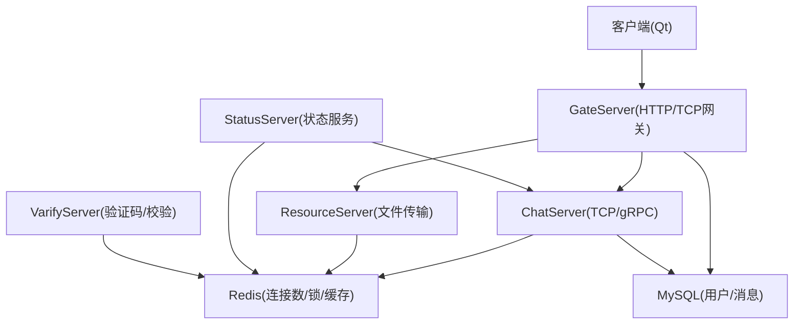
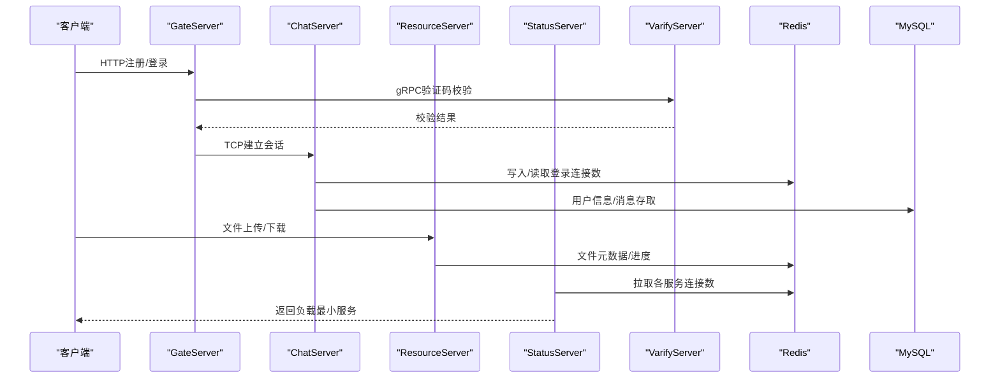
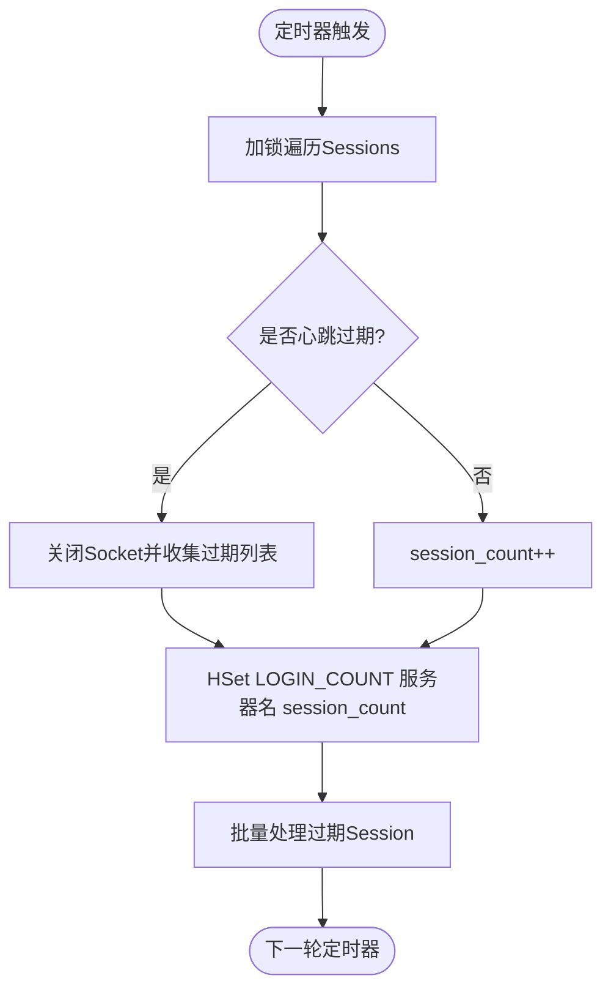
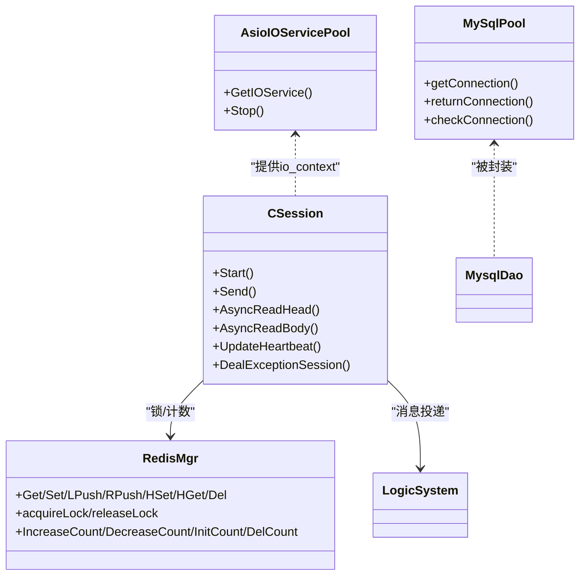
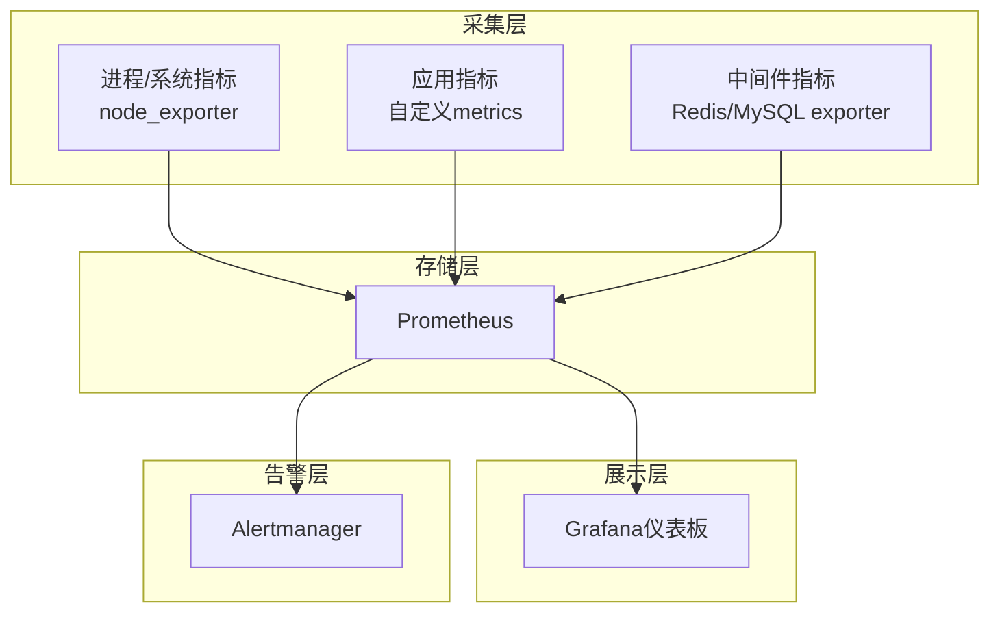

# 指标收集与监控

<cite>
**本文引用的文件**   
- [README.md](file://README.md)
- [CMakePresets.json](file://CMakePresets.json)
- [server/ChatServer/include/CSession.h](file://server/ChatServer/include/CSession.h)
- [server/ChatServer/src/CSession.cpp](file://server/ChatServer/src/CSession.cpp)
- [server/ChatServer/include/AsioIOServicePool.h](file://server/ChatServer/include/AsioIOServicePool.h)
- [server/ChatServer/src/AsioIOServicePool.cpp](file://server/ChatServer/src/AsioIOServicePool.cpp)
- [server/ChatServer/include/RedisMgr.h](file://server/ChatServer/include/RedisMgr.h)
- [server/GateServer/include/RedisMgr.h](file://server/GateServer/include/RedisMgr.h)
- [server/ResourceServer/include/MysqlDao.h](file://server/ResourceServer/include/MysqlDao.h)
- [server/StatusServer/include/MysqlDao.h](file://server/StatusServer/include/MysqlDao.h)
- [开发文档/day35心跳逻辑.md](file://开发文档/day35心跳逻辑.md)
- [开发文档/day34多服程踢人逻辑.md](file://开发文档/day34多服程踢人逻辑.md)
- [开发文档/day08-邮箱认证服务.md](file://开发文档/day08-邮箱认证服务.md)
</cite>

## 目录
1. [简介](#简介)
2. [项目结构](#项目结构)
3. [核心组件](#核心组件)
4. [架构总览](#架构总览)
5. [详细组件分析](#详细组件分析)
6. [依赖关系分析](#依赖关系分析)
7. [性能考量](#性能考量)
8. [故障排查指南](#故障排查指南)
9. [结论](#结论)
10. [附录](#附录)

## 简介
本文件面向LLFCChat项目的“指标收集与监控”需求，围绕系统级、安全与业务三类指标，给出可落地的采集点、存储与展示方案，并配套Prometheus与Grafana的集成配置建议、性能基准测试与容量规划指导，以及可视化仪表板设计方法。内容基于仓库现有代码与服务边界进行梳理，确保与当前实现一致且可操作。

## 项目结构
LLFCChat采用多服务架构：客户端（Qt）通过GateServer接入，ChatServer负责会话与消息转发，ResourceServer处理文件资源，StatusServer提供状态查询，VarifyServer提供验证码等验证能力。各服务均使用Boost.Asio进行高并发网络I/O，并通过Redis与MySQL进行数据持久化与缓存。

图表来源 
- [server/ChatServer/include/AsioIOServicePool.h:1-27](file://server/ChatServer/include/AsioIOServicePool.h#L1-L27)
- [server/ChatServer/src/AsioIOServicePool.cpp:1-43](file://server/ChatServer/src/AsioIOServicePool.cpp#L1-L43)
- [server/ChatServer/include/RedisMgr.h:1-305](file://server/ChatServer/include/RedisMgr.h#L1-L305)
- [server/GateServer/include/RedisMgr.h:1-305](file://server/GateServer/include/RedisMgr.h#L1-L305)
- [server/ResourceServer/include/MysqlDao.h:136-240](file://server/ResourceServer/include/MysqlDao.h#L136-L240)
- [server/StatusServer/include/MysqlDao.h:79-146](file://server/StatusServer/include/MysqlDao.h#L79-L146)

章节来源
- [README.md:1-112](file://README.md#L1-L112)
- [CMakePresets.json:1-35](file://CMakePresets.json#L1-L35)

## 核心组件
- AsioIOServicePool：为每个服务提供多io_context线程池，支撑高并发TCP/gRPC请求。
- CSession：封装单个TCP会话的生命周期、读写、心跳与异常处理。
- RedisMgr：封装hiredis连接池、命令封装、分布式锁与计数统计（如登录连接数）。
- MysqlDao/MySqlPool：封装MySQL连接池、健康检查与重连。
- 各服务启动与生命周期管理：包含gRPC服务器、信号处理、退出清理等。

章节来源
- [server/ChatServer/include/AsioIOServicePool.h:1-27](file://server/ChatServer/include/AsioIOServicePool.h#L1-L27)
- [server/ChatServer/src/AsioIOServicePool.cpp:1-43](file://server/ChatServer/src/AsioIOServicePool.cpp#L1-L43)
- [server/ChatServer/include/CSession.h:1-86](file://server/ChatServer/include/CSession.h#L1-L86)
- [server/ChatServer/src/CSession.cpp:1-200](file://server/ChatServer/src/CSession.cpp#L1-L200)
- [server/ChatServer/include/RedisMgr.h:1-305](file://server/ChatServer/include/RedisMgr.h#L1-L305)
- [server/ResourceServer/include/MysqlDao.h:136-240](file://server/ResourceServer/include/MysqlDao.h#L136-L240)

## 架构总览
下图展示了从客户端到各服务的调用链路与关键指标采集点（连接数、心跳、错误、数据库连接池健康等），这些点将作为Prometheus指标暴露的基础。

图表来源 
- [server/ChatServer/src/CSession.cpp:90-131](file://server/ChatServer/src/CSession.cpp#L90-L131)
- [server/ChatServer/include/RedisMgr.h:267-305](file://server/ChatServer/include/RedisMgr.h#L267-L305)
- [server/ResourceServer/include/MysqlDao.h:136-240](file://server/ResourceServer/include/MysqlDao.h#L136-L240)
- [开发文档/day35心跳逻辑.md:644-750](file://开发文档/day35心跳逻辑.md#L644-L750)

## 详细组件分析

### 系统级指标（CPU、内存、网络I/O、进程/线程）
- 采集点
  - 进程/线程：AsioIOServicePool线程数量、io_context运行状态。
  - CPU/内存：操作系统层面采集（Prometheus node_exporter或Windows对应导出器）。
  - 网络I/O：socket收发字节数、连接建立/断开次数、读/写错误码分布。
- 实现建议
  - 在CSession发送/接收路径埋点，累计bytes_sent/bytes_recv、read_errors/write_errors。
  - 在AsioIOServicePool中记录活跃io_context数量与任务队列长度（可选）。
  - 通过exporter统一暴露为Prometheus metrics（如process_cpu_seconds_total、node_memory_*、node_network_*）。

章节来源
- [server/ChatServer/include/AsioIOServicePool.h:1-27](file://server/ChatServer/include/AsioIOServicePool.h#L1-L27)
- [server/ChatServer/src/AsioIOServicePool.cpp:1-43](file://server/ChatServer/src/AsioIOServicePool.cpp#L1-L43)
- [server/ChatServer/src/CSession.cpp:46-78](file://server/ChatServer/src/CSession.cpp#L46-L78)

### 安全指标（认证失败率、异常访问频率、攻击尝试次数）
- 采集点
  - 认证失败：登录/注册/验证码校验失败次数。
  - 异常访问：非法msg_id、超长包、协议解析错误、频繁重试。
  - 攻击尝试：同一IP短时间高频失败、暴力破解特征。
- 实现建议
  - 在GateServer与VarifyServer的认证流程中计数失败事件。
  - 在CSession头部/体解析失败时计数异常访问。
  - 结合Redis计数器与时间窗口聚合，输出失败率与峰值。

章节来源
- [server/ChatServer/src/CSession.cpp:133-194](file://server/ChatServer/src/CSession.cpp#L133-L194)
- [开发文档/day08-邮箱认证服务.md:337-404](file://开发文档/day08-邮箱认证服务.md#L337-L404)

### 业务指标（在线用户数、消息处理量、文件传输成功率）
- 采集点
  - 在线用户数：各ChatServer的session_count（通过Redis HSet/HGet维护）。
  - 消息处理量：每秒消息吞吐、平均延迟、队列积压。
  - 文件传输成功率：上传/下载成功/失败计数与耗时。
- 实现建议
  - 利用心跳定时器周期性统计session_count并写入Redis（LOGIN_COUNT）。
  - 在消息投递与处理完成处打点，计算QPS与P95/P99延迟。
  - 文件传输在ResourceServer中记录成功/失败与大小。

章节来源
- [开发文档/day35心跳逻辑.md:644-750](file://开发文档/day35心跳逻辑.md#L644-L750)
- [server/ChatServer/include/RedisMgr.h:296-305](file://server/ChatServer/include/RedisMgr.h#L296-L305)
- [server/ResourceServer/include/MysqlDao.h:136-240](file://server/ResourceServer/include/MysqlDao.h#L136-L240)

### 数据库连接池与健康（MySQL）
- 采集点
  - 连接池大小、可用连接数、等待获取连接次数、健康检查失败次数。
  - 慢查询与错误码分布。
- 实现建议
  - 在MySqlPool getConnection/returnConnection处计数。
  - 健康检查线程统计PING失败与重连次数。
  - 暴露为prometheus counter/gauge。

章节来源
- [server/ResourceServer/include/MysqlDao.h:149-183](file://server/ResourceServer/include/MysqlDao.h#L149-L183)
- [server/StatusServer/include/MysqlDao.h:79-146](file://server/StatusServer/include/MysqlDao.h#L79-L146)

### Redis连接池与健康
- 采集点
  - 连接池大小、可用连接数、PING失败次数、重连次数、fail_count。
- 实现建议
  - 在RedisConPool的checkThreadPro中统计fail_count与重连结果。
  - 暴露连接池健康与失败率指标。

章节来源
- [server/ChatServer/include/RedisMgr.h:137-206](file://server/ChatServer/include/RedisMgr.h#L137-L206)
- [server/GateServer/include/RedisMgr.h:137-206](file://server/GateServer/include/RedisMgr.h#L137-L206)

### 心跳与连接数统计流程

图表来源 
- [开发文档/day35心跳逻辑.md:644-750](file://开发文档/day35心跳逻辑.md#L644-L750)

章节来源
- [开发文档/day35心跳逻辑.md:644-750](file://开发文档/day35心跳逻辑.md#L644-L750)

## 依赖关系分析
- 服务间依赖
  - GateServer依赖VarifyServer进行验证码校验；ChatServer与ResourceServer通过Redis共享状态；StatusServer通过Redis获取各服务连接数以做负载均衡。
- 内部模块依赖
  - CSession依赖LogicSystem进行消息投递，依赖RedisMgr进行分布式锁与计数；MysqlDao依赖MySqlPool进行连接管理。
- 潜在循环依赖
  - 通过接口与单例解耦，避免直接循环引用；注意在异常路径释放锁与资源。

图表来源 
- [server/ChatServer/include/AsioIOServicePool.h:1-27](file://server/ChatServer/include/AsioIOServicePool.h#L1-L27)
- [server/ChatServer/include/CSession.h:1-86](file://server/ChatServer/include/CSession.h#L1-L86)
- [server/ChatServer/include/RedisMgr.h:267-305](file://server/ChatServer/include/RedisMgr.h#L267-L305)
- [server/ResourceServer/include/MysqlDao.h:136-240](file://server/ResourceServer/include/MysqlDao.h#L136-L240)

章节来源
- [server/ChatServer/include/AsioIOServicePool.h:1-27](file://server/ChatServer/include/AsioIOServicePool.h#L1-L27)
- [server/ChatServer/include/CSession.h:1-86](file://server/ChatServer/include/CSession.h#L1-L86)
- [server/ChatServer/include/RedisMgr.h:267-305](file://server/ChatServer/include/RedisMgr.h#L267-L305)
- [server/ResourceServer/include/MysqlDao.h:136-240](file://server/ResourceServer/include/MysqlDao.h#L136-L240)

## 性能考量
- 指标采集开销控制
  - 使用增量计数器与采样间隔（如每1s汇总一次），避免热点路径频繁加锁。
  - 对Redis/MySQL健康检查与统计合并执行，减少额外RTT。
- 容量规划
  - 以session_count与消息QPS为基线，评估CPU核数与io_context线程数。
  - 根据Redis连接池大小与失败率调整poolSize与超时参数。
  - MySQL连接池大小按并发查询峰值设定，关注慢查询与锁竞争。
- 压测建议
  - 使用独立压测工具模拟登录、聊天、文件传输场景，观察P95/P99延迟与错误率。
  - 逐步增加并发，定位瓶颈（网络、CPU、锁、DB连接池）。

[本节为通用指导，不直接分析具体文件]

## 故障排查指南
- 常见问题
  - Redis连接不稳定：检查AUTH失败、PING失败与fail_count增长。
  - MySQL连接池耗尽：观察getConnection等待次数与health check失败。
  - 会话异常断开：查看CSession读错误码与心跳过期情况。
- 定位步骤
  - 查看Redis连接池日志与失败计数。
  - 检查CSession的AsyncReadHead/AsyncReadBody错误分支。
  - 核对心跳定时器是否按时更新LOGIN_COUNT。

章节来源
- [server/ChatServer/include/RedisMgr.h:137-206](file://server/ChatServer/include/RedisMgr.h#L137-L206)
- [server/ResourceServer/include/MysqlDao.h:149-183](file://server/ResourceServer/include/MysqlDao.h#L149-L183)
- [server/ChatServer/src/CSession.cpp:133-194](file://server/ChatServer/src/CSession.cpp#L133-L194)

## 结论
通过在CSession、RedisMgr、MySqlPool与各服务启动路径埋点，结合Prometheus与Grafana，可实现对LLFCChat的系统级、安全与业务指标的完整监控。心跳与连接数统计已具备落地基础，进一步扩展即可形成统一的监控平台。

[本节为总结性内容，不直接分析具体文件]

## 附录

### 统一监控平台架构（采集-存储-展示-告警）

[该图为概念性架构图，不映射具体源码文件]

### Prometheus与Grafana集成配置示例
- 目标
  - 在各服务进程内暴露/metrics端点（或使用cAdvisor/node_exporter采集系统指标）。
  - 配置Prometheus抓取各exporter与自研metrics。
  - 在Grafana创建面板展示CPU、内存、网络、连接数、错误率、消息吞吐等。
- 关键点
  - 指标命名规范：前缀区分服务（如chat_session_count、gate_auth_fail_rate）。
  - 标签维度：service、instance、server_name、error_code等。
  - 告警规则：连接数突降、认证失败率飙升、Redis/MySQL健康失败。

[本节为通用配置指导，不直接分析具体文件]

### 性能基准测试与容量规划
- 基准场景
  - 登录认证：QPS、失败率、平均延迟。
  - 聊天消息：吞吐、P95/P99、丢包率。
  - 文件传输：带宽利用率、成功率、断点续传稳定性。
- 容量评估
  - 以峰值QPS与连接数为输入，估算CPU核数、内存、网络带宽。
  - 根据Redis/MySQL连接池大小与失败率调优。

[本节为通用指导，不直接分析具体文件]

### 可视化与自定义仪表板
- 推荐面板
  - 系统概览：CPU、内存、磁盘、网络。
  - 服务健康：连接数、错误率、心跳过期率。
  - 数据库：连接池、慢查询、错误码分布。
  - 安全：认证失败率、异常访问频率、攻击尝试趋势。
- 自定义方法
  - 在Grafana中新建Dashboard，添加Panel，选择Prometheus数据源。
  - 编写PromQL查询，设置阈值与告警规则。

[本节为通用指导，不直接分析具体文件]