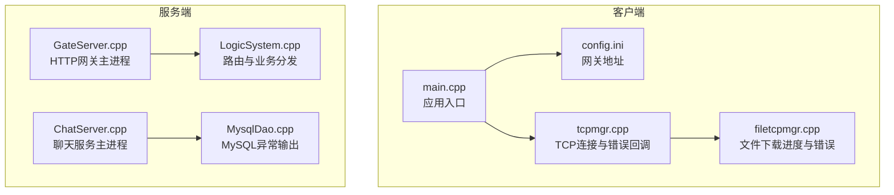
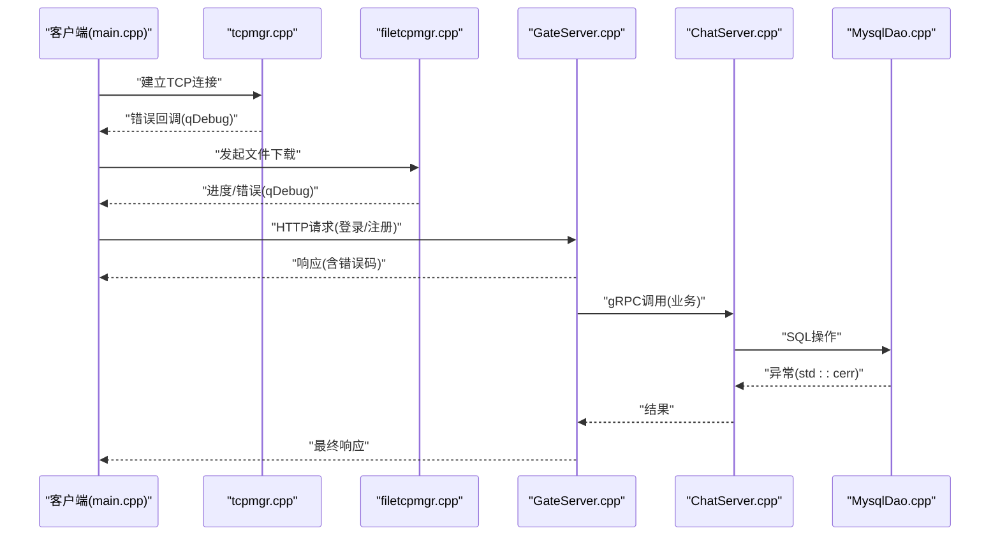
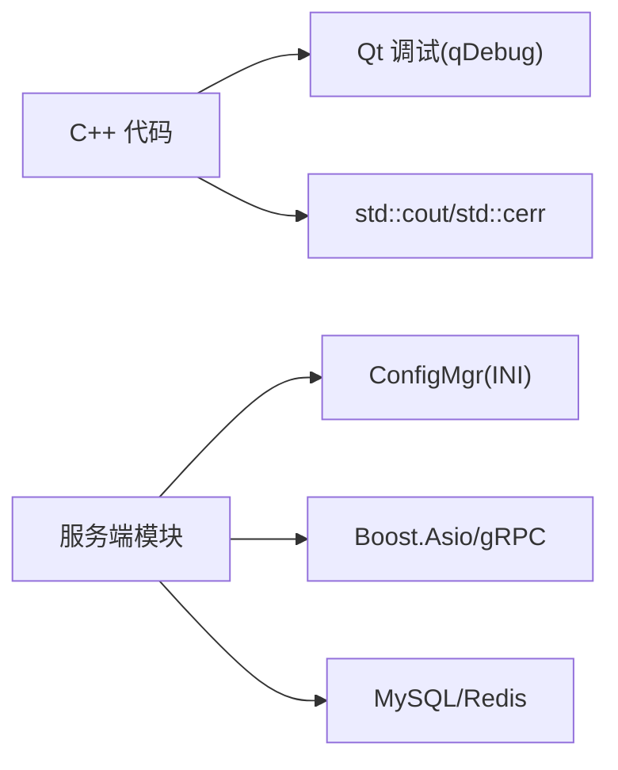

# 日志记录系统

<cite>
**本文引用的文件**   
- [client/llfcchat/src/main.cpp](file://client/llfcchat/src/main.cpp)
- [client/llfcchat/config/config.ini](file://client/llfcchat/config/config.ini)
- [client/llfcchat/src/tcpmgr.cpp](file://client/llfcchat/src/tcpmgr.cpp)
- [client/llfcchat/include/tcpmgr.h](file://client/llfcchat/include/tcpmgr.h)
- [client/llfcchat/src/filetcpmgr.cpp](file://client/llfcchat/src/filetcpmgr.cpp)
- [server/GateServer/src/GateServer.cpp](file://server/GateServer/src/GateServer.cpp)
- [server/GateServer/src/LogicSystem.cpp](file://server/GateServer/src/LogicSystem.cpp)
- [server/GateServer/config/config.ini](file://server/GateServer/config/config.ini)
- [server/ChatServer/src/ChatServer.cpp](file://server/ChatServer/src/ChatServer.cpp)
- [server/ChatServer/src/ConfigMgr.cpp](file://server/ChatServer/src/ConfigMgr.cpp)
- [server/ChatServer/config/chatserver1.ini](file://server/ChatServer/config/chatserver1.ini)
- [server/ResourceServer/src/MysqlDao.cpp](file://server/ResourceServer/src/MysqlDao.cpp)
- [server/ResourceServer/config/config.ini](file://server/ResourceServer/config/config.ini)
- [server/StatusServer/config/config.ini](file://server/StatusServer/config/config.ini)
</cite>

## 目录
1. [简介](#简介)
2. [项目结构](#项目结构)
3. [核心组件](#核心组件)
4. [架构总览](#架构总览)
5. [详细组件分析](#详细组件分析)
6. [依赖关系分析](#依赖关系分析)
7. [性能考量](#性能考量)
8. [故障排查指南](#故障排查指南)
9. [结论](#结论)
10. [附录](#附录)

## 简介
本文件为 LLFCChat 项目的“日志记录系统”文档，聚焦于当前代码库中已有的日志输出与错误处理现状，并在此基础上给出统一的日志规范、级别管理、分类策略、格式标准、轮转与清理机制、配置示例以及查询与分析工具使用建议。目标是帮助开发者快速定位问题、识别性能瓶颈，并为后续引入统一日志框架提供清晰的演进路线。

## 项目结构
LLFCChat 由客户端（Qt/C++）与多个服务端（C++/gRPC/HTTP）组成。当前日志主要体现为：
- 客户端：大量使用 Qt 的调试输出（qDebug），用于网络、UI、文件传输等关键路径。
- 服务端：在启动、异常捕获、IO 错误、数据库异常等处使用 std::cout/std::cerr 进行输出。
- 配置文件：各服务通过 INI 文件加载运行参数，但尚未包含日志相关配置项。

图表来源
- [client/llfcchat/src/main.cpp:1-43](file://client/llfcchat/src/main.cpp#L1-L43)
- [client/llfcchat/config/config.ini:1-4](file://client/llfcchat/config/config.ini#L1-L4)
- [client/llfcchat/src/tcpmgr.cpp:63-91](file://client/llfcchat/src/tcpmgr.cpp#L63-L91)
- [client/llfcchat/src/filetcpmgr.cpp:399-433](file://client/llfcchat/src/filetcpmgr.cpp#L399-L433)
- [server/GateServer/src/GateServer.cpp:131-163](file://server/GateServer/src/GateServer.cpp#L131-L163)
- [server/GateServer/src/LogicSystem.cpp:1-35](file://server/GateServer/src/LogicSystem.cpp#L1-L35)
- [server/ChatServer/src/ChatServer.cpp:20-81](file://server/ChatServer/src/ChatServer.cpp#L20-L81)
- [server/ResourceServer/src/MysqlDao.cpp:161-208](file://server/ResourceServer/src/MysqlDao.cpp#L161-L208)

章节来源
- [client/llfcchat/src/main.cpp:1-43](file://client/llfcchat/src/main.cpp#L1-L43)
- [server/GateServer/src/GateServer.cpp:131-163](file://server/GateServer/src/GateServer.cpp#L131-L163)
- [server/ChatServer/src/ChatServer.cpp:20-81](file://server/ChatServer/src/ChatServer.cpp#L20-L81)

## 核心组件
- 客户端日志
  - 网络层：TCP 连接错误、超时、主机不可达等通过 qDebug 输出，便于开发期定位网络问题。
  - 文件传输：下载进度、写入失败、完成事件等通过 qDebug 输出。
  - 应用入口：样式加载成功/失败、配置读取等通过 qDebug 输出。
- 服务端日志
  - 网关与服务启动：端口监听、异常捕获、Redis/MySQL 初始化测试输出。
  - 业务逻辑：登录、搜索、好友申请等关键路径存在 std::cout 打印。
  - 数据访问：MySQL 异常通过 std::cerr 输出错误码与 SQLState。

章节来源
- [client/llfcchat/src/tcpmgr.cpp:63-91](file://client/llfcchat/src/tcpmgr.cpp#L63-L91)
- [client/llfcchat/src/filetcpmgr.cpp:399-433](file://client/llfcchat/src/filetcpmgr.cpp#L399-L433)
- [client/llfcchat/src/main.cpp:11-21](file://client/llfcchat/src/main.cpp#L11-L21)
- [server/GateServer/src/GateServer.cpp:131-163](file://server/GateServer/src/GateServer.cpp#L131-L163)
- [server/ChatServer/src/ChatServer.cpp:20-81](file://server/ChatServer/src/ChatServer.cpp#L20-L81)
- [server/ResourceServer/src/MysqlDao.cpp:161-208](file://server/ResourceServer/src/MysqlDao.cpp#L161-L208)

## 架构总览
下图展示客户端与服务端的关键交互及现有日志落点，便于理解日志覆盖范围与改进方向。

图表来源
- [client/llfcchat/src/main.cpp:1-43](file://client/llfcchat/src/main.cpp#L1-L43)
- [client/llfcchat/src/tcpmgr.cpp:63-91](file://client/llfcchat/src/tcpmgr.cpp#L63-L91)
- [client/llfcchat/src/filetcpmgr.cpp:399-433](file://client/llfcchat/src/filetcpmgr.cpp#L399-L433)
- [server/GateServer/src/GateServer.cpp:131-163](file://server/GateServer/src/GateServer.cpp#L131-L163)
- [server/ChatServer/src/ChatServer.cpp:20-81](file://server/ChatServer/src/ChatServer.cpp#L20-L81)
- [server/ResourceServer/src/MysqlDao.cpp:161-208](file://server/ResourceServer/src/MysqlDao.cpp#L161-L208)

## 详细组件分析

### 客户端日志现状与建议
- 现状
  - 使用 qDebug() 输出网络错误、文件下载进度与状态、样式加载结果等。
  - 未实现统一的日志级别控制、格式化与持久化。
- 建议
  - 引入统一日志模块，封装 qDebug 并支持级别过滤（DEBUG/INFO/WARN/ERROR）。
  - 标准化格式：时间戳、线程ID、模块标识、消息内容。
  - 输出目标：控制台（开发）、文件（生产）、可选远程日志服务器（集中收集）。
  - 文件轮转：按大小或时间切分，保留固定数量，自动清理过期文件。

章节来源
- [client/llfcchat/src/tcpmgr.cpp:63-91](file://client/llfcchat/src/tcpmgr.cpp#L63-L91)
- [client/llfcchat/src/filetcpmgr.cpp:399-433](file://client/llfcchat/src/filetcpmgr.cpp#L399-L433)
- [client/llfcchat/src/main.cpp:11-21](file://client/llfcchat/src/main.cpp#L11-L21)

### 服务端日志现状与建议
- 现状
  - 启动与异常捕获使用 std::cout/std::cerr 输出。
  - MySQL 异常包含错误码与 SQLState，便于定位。
  - 业务逻辑中存在多处 std::cout 打印，但未结构化。
- 建议
  - 统一日志门面，将 std::cout/std::cerr 替换为结构化日志。
  - 增加 API 调用日志（请求方法、URL、耗时、状态码、用户ID）。
  - 错误日志独立文件，便于告警与聚合。
  - 结合配置管理器注入日志级别与输出目标。

章节来源
- [server/GateServer/src/GateServer.cpp:131-163](file://server/GateServer/src/GateServer.cpp#L131-L163)
- [server/ChatServer/src/ChatServer.cpp:20-81](file://server/ChatServer/src/ChatServer.cpp#L20-L81)
- [server/ResourceServer/src/MysqlDao.cpp:161-208](file://server/ResourceServer/src/MysqlDao.cpp#L161-L208)

### 日志级别管理与分类策略
- 级别定义
  - DEBUG：详细调试信息，仅开发环境启用。
  - INFO：关键业务流程（登录、注册、消息收发、文件传输）。
  - WARN：潜在问题（重试、降级、非致命错误）。
  - ERROR：严重错误（IO失败、数据库异常、崩溃前上下文）。
- 分类策略
  - 模块维度：网络、数据库、缓存、业务逻辑、UI。
  - 事件维度：用户行为、API 调用、错误、性能指标。
- 控制方式
  - 运行时可配置（INI/环境变量），支持热更新。
  - 不同环境默认级别：开发=DEBUG，测试=INFO，生产=WARN。

章节来源
- [server/GateServer/config/config.ini:1-25](file://server/GateServer/config/config.ini#L1-L25)
- [server/ChatServer/config/chatserver1.ini:1-30](file://server/ChatServer/config/chatserver1.ini#L1-L30)

### 日志格式规范
- 字段要求
  - 时间戳：ISO 8601 或 Unix 毫秒级。
  - 线程ID：便于并发追踪。
  - 模块标识：如 TCP、FILE、MYSQL、GATE、CHAT。
  - 级别：DEBUG/INFO/WARN/ERROR。
  - 消息内容：结构化键值对（如 uid、msg_id、url、status_code、cost_ms）。
- 示例（概念性）
  - [2024-01-01T12:00:00.000Z] [tid=1234] [module=TCP] [level=ERROR] msg="Connection refused" host="127.0.0.1" port=8080

[本节为概念说明，不直接分析具体文件]

### 日志文件轮转与存储路径
- 轮转策略
  - 按大小：单文件最大 N MB，超过则滚动生成新文件。
  - 按时间：每日/每小时生成新文件，保留 M 天。
- 存储路径
  - 客户端：应用目录下 logs/ 子目录。
  - 服务端：服务 bin 目录下的 logs/ 子目录，可通过配置项指定。
- 清理机制
  - 定时任务清理过期文件。
  - 磁盘空间阈值触发清理。

[本节为概念说明，不直接分析具体文件]

### 日志配置示例与环境差异
- 客户端配置（INI）
  - 新增 [Log] 段，包含 level、output_console、output_file、file_path、rotate_size_mb、retain_days。
- 服务端配置（INI）
  - 每个服务新增 [Log] 段，支持 per-service 级别与输出目标。
  - 示例键：level、console、file、remote_url、max_size_mb、retention_days。
- 环境差异
  - 开发：level=DEBUG，console=true，file=true。
  - 测试：level=INFO，console=false，file=true。
  - 生产：level=WARN，console=false，file=true，remote_url=http://log-server:port。

章节来源
- [client/llfcchat/config/config.ini:1-4](file://client/llfcchat/config/config.ini#L1-L4)
- [server/GateServer/config/config.ini:1-25](file://server/GateServer/config/config.ini#L1-L25)
- [server/ChatServer/config/chatserver1.ini:1-30](file://server/ChatServer/config/chatserver1.ini#L1-L30)
- [server/ResourceServer/config/config.ini:1-27](file://server/ResourceServer/config/config.ini#L1-L27)
- [server/StatusServer/config/config.ini:1-23](file://server/StatusServer/config/config.ini#L1-L23)

### 日志查询与分析工具
- 本地查询
  - Linux/macOS：grep、awk、sed、tail、less。
  - Windows：PowerShell Select-String、Get-Content。
- 集中式分析
  - ELK（Elasticsearch + Logstash + Kibana）或 Loki + Grafana。
  - 采集器：Filebeat/Fluent Bit。
- 常用查询
  - 按级别筛选：ERROR 级别日志。
  - 按模块筛选：TCP、MYSQL 模块。
  - 按用户筛选：uid、token。
  - 性能分析：API 耗时分布、慢查询统计。

[本节为概念说明，不直接分析具体文件]

## 依赖关系分析
- 客户端依赖 Qt 调试输出，无外部日志库。
- 服务端依赖 Boost.Asio、gRPC、MySQL、Redis，当前未集成统一日志库。
- 配置依赖 ConfigMgr 读取 INI，可扩展加入日志配置。

图表来源
- [client/llfcchat/src/tcpmgr.cpp:63-91](file://client/llfcchat/src/tcpmgr.cpp#L63-L91)
- [server/GateServer/src/GateServer.cpp:131-163](file://server/GateServer/src/GateServer.cpp#L131-L163)
- [server/ChatServer/src/ConfigMgr.cpp:1-30](file://server/ChatServer/src/ConfigMgr.cpp#L1-L30)

章节来源
- [client/llfcchat/src/tcpmgr.cpp:63-91](file://client/llfcchat/src/tcpmgr.cpp#L63-L91)
- [server/GateServer/src/GateServer.cpp:131-163](file://server/GateServer/src/GateServer.cpp#L131-L163)
- [server/ChatServer/src/ConfigMgr.cpp:1-30](file://server/ChatServer/src/ConfigMgr.cpp#L1-L30)

## 性能考量
- 避免在高吞吐路径频繁 I/O，采用异步写入与批量缓冲。
- 合理设置日志级别，生产环境关闭 DEBUG。
- 文件轮转避免频繁创建/删除文件，使用命名约定与索引。
- 远程日志需考虑网络抖动与丢包，支持本地缓存与重试。

[本节为通用指导，不直接分析具体文件]

## 故障排查指南
- 客户端网络问题
  - 查看 tcpmgr.cpp 的错误回调输出，确认连接拒绝、超时、主机不可达等。
- 文件下载失败
  - 检查 filetcpmgr.cpp 的写入失败与进度输出，确认权限与磁盘空间。
- 服务端异常
  - 关注 GateServer.cpp 与 ChatServer.cpp 的异常捕获输出。
  - 检查 MysqlDao.cpp 的 SQLException 错误码与 SQLState。

章节来源
- [client/llfcchat/src/tcpmgr.cpp:63-91](file://client/llfcchat/src/tcpmgr.cpp#L63-L91)
- [client/llfcchat/src/filetcpmgr.cpp:399-433](file://client/llfcchat/src/filetcpmgr.cpp#L399-L433)
- [server/GateServer/src/GateServer.cpp:131-163](file://server/GateServer/src/GateServer.cpp#L131-L163)
- [server/ChatServer/src/ChatServer.cpp:20-81](file://server/ChatServer/src/ChatServer.cpp#L20-L81)
- [server/ResourceServer/src/MysqlDao.cpp:161-208](file://server/ResourceServer/src/MysqlDao.cpp#L161-L208)

## 结论
当前 LLFCChat 项目在开发与调试阶段已具备基本的日志输出能力，但缺乏统一的日志框架、级别管理、格式化与持久化机制。建议尽快引入统一日志模块，完善日志分类、格式、轮转与清理策略，并结合配置管理器实现多环境差异化配置。同时，构建集中式日志采集与分析平台，提升问题定位效率与系统可观测性。

[本节为总结性内容，不直接分析具体文件]

## 附录
- 推荐日志库：spdlog、glog、log4cplus。
- 采集与可视化：ELK、Loki、Prometheus + Grafana。
- 最佳实践：结构化日志、敏感信息脱敏、采样策略、告警规则。

[本节为补充信息，不直接分析具体文件]