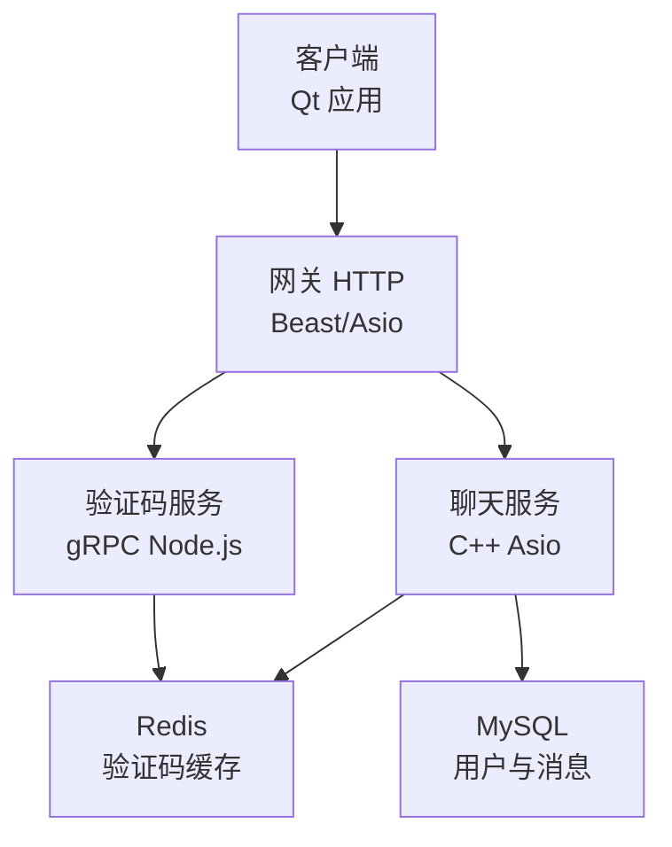
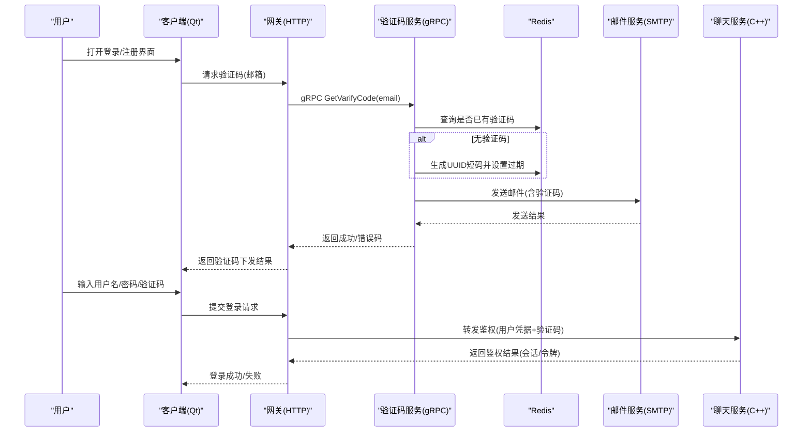
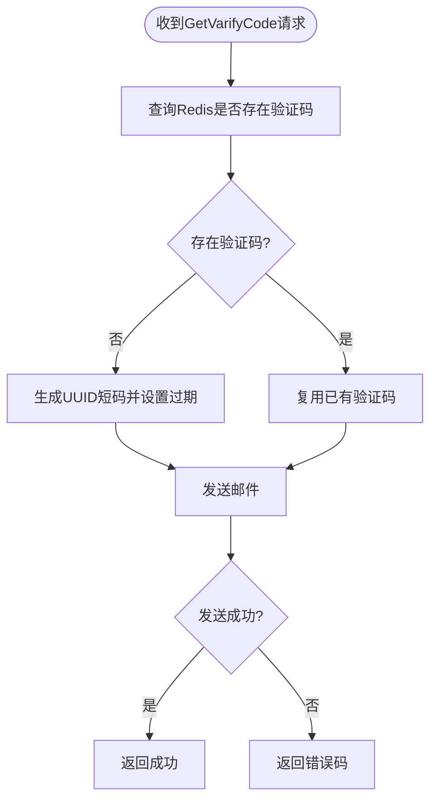
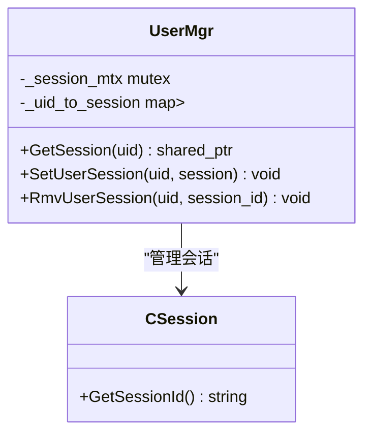
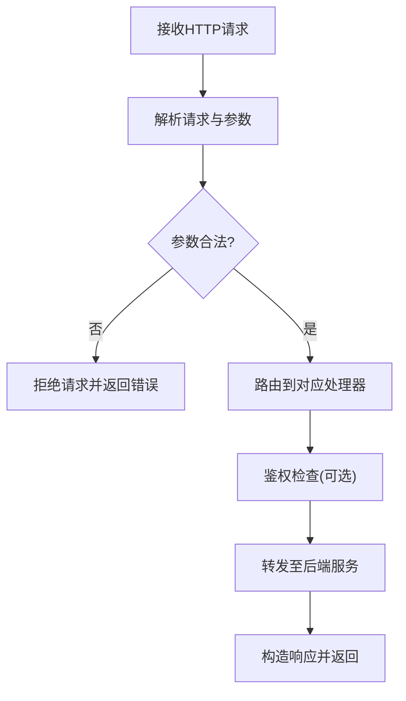
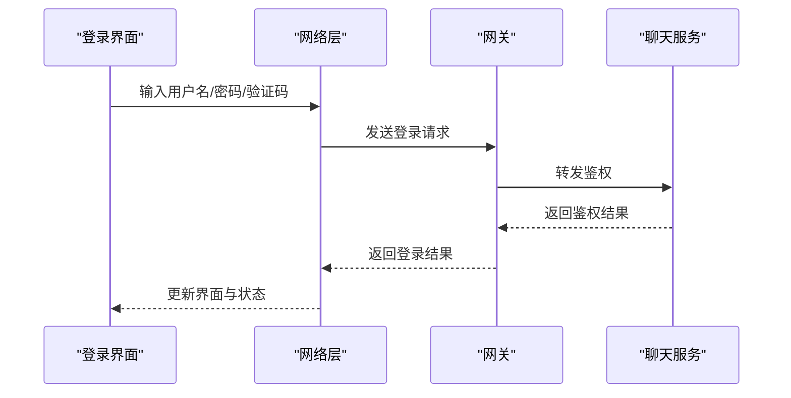
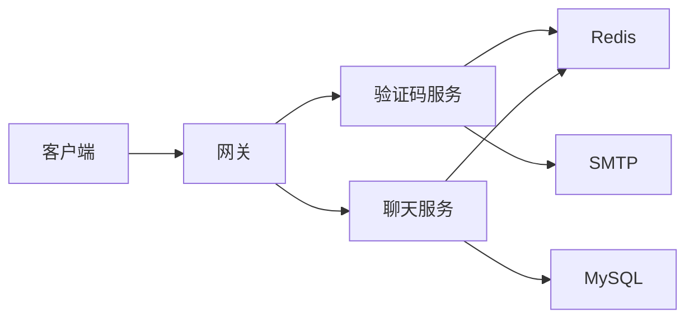

# 安全设计

<cite>
**本文引用的文件**   
- [server.js](file://server/VarifyServer/server.js)
- [email.js](file://server/VarifyServer/email.js)
- [redis.js](file://server/VarifyServer/redis.js)
- [UserMgr.h](file://server/ChatServer/include/UserMgr.h)
- [UserMgr.cpp](file://server/ChatServer/src/UserMgr.cpp)
- [HttpConnection.h](file://server/GateServer/include/HttpConnection.h)
- [logindialog.h](file://client/llfcchat/include/logindialog.h)
- [userdata.h](file://client/llfcchat/include/userdata.h)
</cite>

## 目录
1. [引言](#引言)
2. [项目结构](#项目结构)
3. [核心组件](#核心组件)
4. [架构总览](#架构总览)
5. [详细组件分析](#详细组件分析)
6. [依赖关系分析](#依赖关系分析)
7. [性能与安全权衡](#性能与安全权衡)
8. [故障排查指南](#故障排查指南)
9. [结论](#结论)
10. [附录](#附录)

## 引言
本安全设计文档围绕LLFCChat项目的认证授权、数据安全、网络安全、访问控制、审计与日志、以及安全开发生命周期（SDL）进行系统化说明。结合现有代码实现，重点覆盖以下方面：
- 认证与授权：验证码发放流程、会话管理、多设备登录控制、客户端登录交互
- 数据安全：敏感信息处理、输入校验、存储与传输加密建议、防注入与XSS策略
- 网络安全：HTTPS/TLS、端口暴露面收敛、DDoS防护建议
- 访问控制：角色与资源权限、API访问限制
- 审计与监控：操作日志、安全事件记录、异常行为检测
- 安全生命周期：漏洞扫描、渗透测试、加固与发布前检查清单

## 项目结构
从安全视角看，系统由客户端、网关、聊天服务、资源服务、状态服务、验证码服务（Node.js）及Redis/MySQL等基础设施组成。关键安全相关模块分布如下：
- 验证码服务（VarifyServer）：负责邮箱验证码生成与发送、Redis缓存验证码
- 网关（GateServer）：HTTP入口，解析请求参数、转发鉴权
- 聊天服务（ChatServer）：用户会话管理与在线状态维护
- 客户端（Qt）：登录界面、数据模型与会话上下文

图表来源 
- [HttpConnection.h:1-36](file://server/GateServer/include/HttpConnection.h#L1-L36)
- [server.js:1-76](file://server/VarifyServer/server.js#L1-L76)
- [redis.js:1-101](file://server/VarifyServer/redis.js#L1-L101)
- [UserMgr.h:1-22](file://server/ChatServer/include/UserMgr.h#L1-L22)

章节来源
- [HttpConnection.h:1-36](file://server/GateServer/include/HttpConnection.h#L1-L36)
- [server.js:1-76](file://server/VarifyServer/server.js#L1-L76)
- [redis.js:1-101](file://server/VarifyServer/redis.js#L1-L101)
- [UserMgr.h:1-22](file://server/ChatServer/include/UserMgr.h#L1-L22)

## 核心组件
- 验证码服务（VarifyServer）
  - gRPC接口提供验证码获取，使用UUID生成短码并写入Redis，设置过期时间，通过SMTP发送邮件
  - 错误处理统一返回错误码，便于上层区分失败原因
- 会话管理（ChatServer UserMgr）
  - 基于用户ID到会话的映射，支持设置、查询、删除会话；具备简单的多设备踢人逻辑（按session_id比对）
- 网关HTTP连接（GateServer HttpConnection）
  - 解析GET参数、设置超时、构造响应；作为HTTP入口承载鉴权与路由
- 客户端登录与数据模型（Qt）
  - 登录对话框负责输入校验、触发HTTP登录流程；数据结构包含认证信息与聊天数据模型

章节来源
- [server.js:1-76](file://server/VarifyServer/server.js#L1-L76)
- [email.js:1-37](file://server/VarifyServer/email.js#L1-L37)
- [redis.js:1-101](file://server/VarifyServer/redis.js#L1-L101)
- [UserMgr.h:1-22](file://server/ChatServer/include/UserMgr.h#L1-L22)
- [UserMgr.cpp:1-50](file://server/ChatServer/src/UserMgr.cpp#L1-L50)
- [HttpConnection.h:1-36](file://server/GateServer/include/HttpConnection.h#L1-L36)
- [logindialog.h:1-47](file://client/llfcchat/include/logindialog.h#L1-L47)
- [userdata.h:1-288](file://client/llfcchat/include/userdata.h#L1-L288)

## 架构总览
下图展示登录与验证码发放的关键调用链，体现认证流程中的服务协作与数据流向。

图表来源 
- [server.js:1-76](file://server/VarifyServer/server.js#L1-L76)
- [email.js:1-37](file://server/VarifyServer/email.js#L1-L37)
- [redis.js:1-101](file://server/VarifyServer/redis.js#L1-L101)
- [HttpConnection.h:1-36](file://server/GateServer/include/HttpConnection.h#L1-L36)

## 详细组件分析

### 验证码服务（VarifyServer）
- 功能要点
  - 接收邮箱地址，优先从Redis读取已存在的验证码；不存在则生成UUID短码并设置过期时间
  - 通过SMTP发送邮件，返回统一错误码
  - 使用gRPC提供服务，当前绑定为不安全凭证（需在生产启用TLS）
- 安全评估与建议
  - 验证码有效期较短（分钟级），降低被暴力破解风险
  - 建议增加频率限制（同一邮箱短时间重复请求限流）
  - 建议对gRPC启用TLS，避免中间人攻击
  - 建议对邮件内容做最小化脱敏，避免泄露敏感信息

图表来源 
- [server.js:1-76](file://server/VarifyServer/server.js#L1-L76)
- [redis.js:1-101](file://server/VarifyServer/redis.js#L1-L101)
- [email.js:1-37](file://server/VarifyServer/email.js#L1-L37)

章节来源
- [server.js:1-76](file://server/VarifyServer/server.js#L1-L76)
- [email.js:1-37](file://server/VarifyServer/email.js#L1-L37)
- [redis.js:1-101](file://server/VarifyServer/redis.js#L1-L101)

### 会话管理（ChatServer UserMgr）
- 功能要点
  - 维护用户ID到会话对象的映射，线程安全（互斥锁）
  - 支持设置、查询、删除会话；删除时比较session_id，若不一致说明其他设备登录，可执行踢人逻辑
- 安全评估与建议
  - 当前仅单服内存映射，分布式场景需引入Redis或分布式锁保证一致性
  - 建议增加会话存活时间、心跳续期机制
  - 建议对会话ID进行随机化与不可预测性增强

图表来源 
- [UserMgr.h:1-22](file://server/ChatServer/include/UserMgr.h#L1-L22)
- [UserMgr.cpp:1-50](file://server/ChatServer/src/UserMgr.cpp#L1-L50)

章节来源
- [UserMgr.h:1-22](file://server/ChatServer/include/UserMgr.h#L1-L22)
- [UserMgr.cpp:1-50](file://server/ChatServer/src/UserMgr.cpp#L1-L50)

### 网关HTTP连接（GateServer HttpConnection）
- 功能要点
  - 解析HTTP请求、提取GET参数、设置处理超时、构造响应
  - 作为鉴权与路由的统一入口
- 安全评估与建议
  - 建议对所有HTTP接口强制HTTPS
  - 建议增加请求体大小限制、参数白名单校验
  - 建议对敏感接口增加签名或Token校验

图表来源 
- [HttpConnection.h:1-36](file://server/GateServer/include/HttpConnection.h#L1-L36)

章节来源
- [HttpConnection.h:1-36](file://server/GateServer/include/HttpConnection.h#L1-L36)

### 客户端登录与数据模型（Qt）
- 功能要点
  - 登录对话框负责输入校验、触发登录流程、显示提示信息
  - 数据模型包含认证信息与聊天数据，用于本地状态管理
- 安全评估与建议
  - 建议在客户端对密码进行不可逆哈希后再传输（服务端仍应验证）
  - 建议对敏感字段在本地持久化时加密存储
  - 建议对UI输出进行脱敏，避免日志中打印敏感信息

图表来源 
- [logindialog.h:1-47](file://client/llfcchat/include/logindialog.h#L1-L47)
- [userdata.h:1-288](file://client/llfcchat/include/userdata.h#L1-L288)

章节来源
- [logindialog.h:1-47](file://client/llfcchat/include/logindialog.h#L1-L47)
- [userdata.h:1-288](file://client/llfcchat/include/userdata.h#L1-L288)

## 依赖关系分析
- 验证码服务依赖Redis与SMTP，对外暴露gRPC接口
- 网关HTTP连接依赖Asio/Beast，负责请求解析与转发
- 聊天服务依赖Redis与MySQL，维护会话与持久化数据
- 客户端依赖Qt框架与网络库，负责用户交互与通信

图表来源 
- [server.js:1-76](file://server/VarifyServer/server.js#L1-L76)
- [redis.js:1-101](file://server/VarifyServer/redis.js#L1-L101)
- [email.js:1-37](file://server/VarifyServer/email.js#L1-L37)
- [HttpConnection.h:1-36](file://server/GateServer/include/HttpConnection.h#L1-L36)
- [UserMgr.h:1-22](file://server/ChatServer/include/UserMgr.h#L1-L22)

章节来源
- [server.js:1-76](file://server/VarifyServer/server.js#L1-L76)
- [redis.js:1-101](file://server/VarifyServer/redis.js#L1-L101)
- [email.js:1-37](file://server/VarifyServer/email.js#L1-L37)
- [HttpConnection.h:1-36](file://server/GateServer/include/HttpConnection.h#L1-L36)
- [UserMgr.h:1-22](file://server/ChatServer/include/UserMgr.h#L1-L22)

## 性能与安全权衡
- 验证码有效期与用户体验：过短影响注册体验，过长增加安全风险；建议动态调整并结合IP/邮箱维度限流
- 会话并发与内存占用：单服内存映射简单高效，但扩展性差；分布式场景需引入Redis与分布式锁，带来额外延迟
- HTTPS与TLS开销：提升安全性同时增加握手成本；建议使用会话复用与CDN加速

[本节为通用指导，不直接分析具体文件]

## 故障排查指南
- 验证码服务
  - Redis连接失败：检查配置主机、端口、密码；查看心跳与重连日志
  - 邮件发送失败：核对SMTP配置、授权码、网络连通性
- 网关HTTP
  - 请求超时：检查定时器配置与后端响应时间
  - 参数解析错误：检查URL编码与参数白名单
- 聊天服务会话
  - 会话丢失：检查进程重启与内存清理逻辑
  - 多设备冲突：确认session_id比对与踢人逻辑生效

章节来源
- [redis.js:1-101](file://server/VarifyServer/redis.js#L1-L101)
- [email.js:1-37](file://server/VarifyServer/email.js#L1-L37)
- [server.js:1-76](file://server/VarifyServer/server.js#L1-L76)
- [HttpConnection.h:1-36](file://server/GateServer/include/HttpConnection.h#L1-L36)
- [UserMgr.cpp:1-50](file://server/ChatServer/src/UserMgr.cpp#L1-L50)

## 结论
本项目在验证码发放与会话管理方面具备基础能力，但在传输加密、输入校验、分布式一致性、审计与监控等方面仍有改进空间。建议优先完成HTTPS/TLS改造、强化输入校验与限流、完善会话生命周期管理，并建立完善的审计与监控体系，以全面提升系统安全性与稳定性。

[本节为总结性内容，不直接分析具体文件]

## 附录
- 安全开发生命周期（SDL）建议
  - 需求阶段：明确安全需求与合规要求
  - 设计阶段：威胁建模、安全架构评审
  - 开发阶段：代码审查、静态扫描、依赖漏洞扫描
  - 测试阶段：动态扫描、渗透测试、回归测试
  - 发布阶段：安全基线检查、灰度发布、回滚预案
  - 运维阶段：持续监控、告警联动、应急响应

[本节为通用指导，不直接分析具体文件]