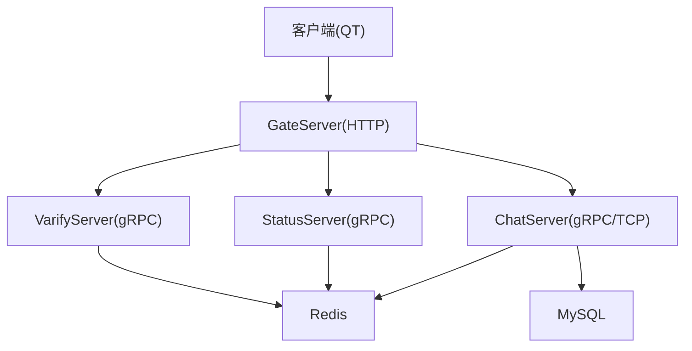
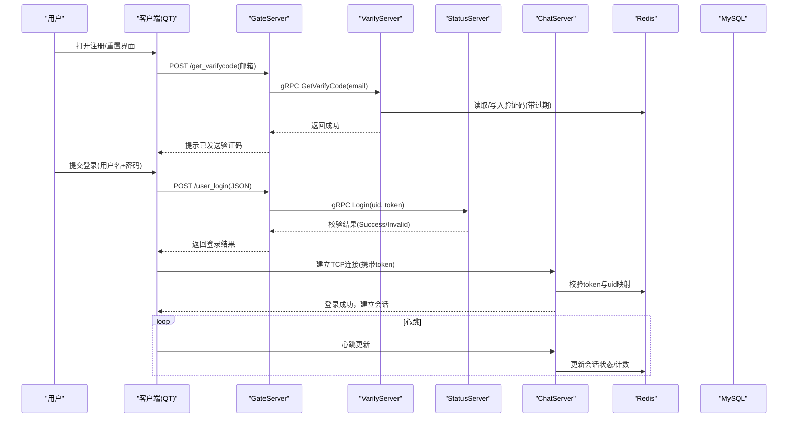
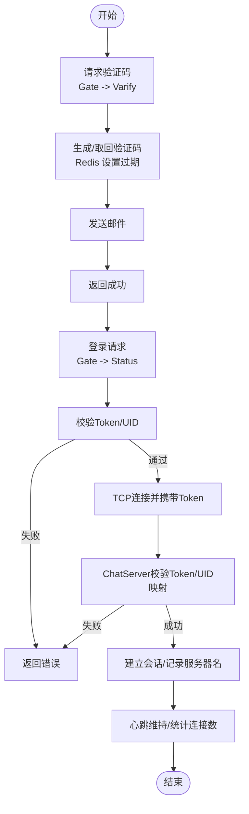
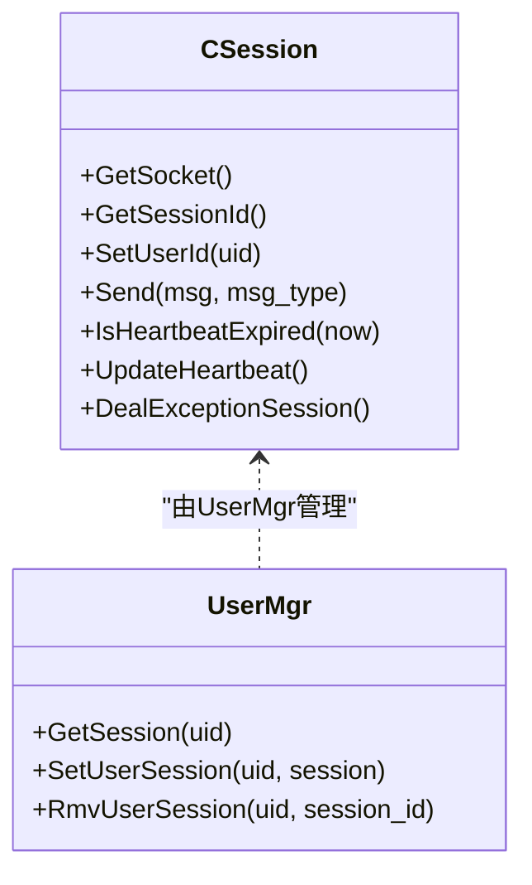
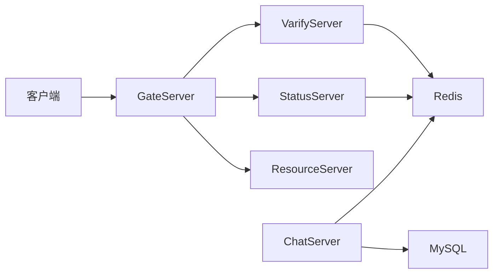

# 安全设计

<cite>
**本文引用的文件**   
- [server.js](file://server/VarifyServer/server.js)
- [MysqlDao.h](file://server/ChatServer/include/MysqlDao.h)
- [MysqlDao.cpp](file://server/ChatServer/src/MysqlDao.cpp)
- [UserMgr.h](file://server/ChatServer/include/UserMgr.h)
- [UserMgr.cpp](file://server/ChatServer/src/UserMgr.cpp)
- [CSession.h](file://server/ChatServer/include/CSession.h)
- [HttpConnection.h](file://server/GateServer/include/HttpConnection.h)
- [chatserver1.ini](file://server/ChatServer/config/chatserver1.ini)
- [config.ini](file://server/GateServer/config/config.ini)
- [logindialog.cpp](file://client/llfcchat/src/logindialog.cpp)
- [registerdialog.cpp](file://client/llfcchat/src/registerdialog.cpp)
- [resetdialog.cpp](file://client/llfcchat/src/resetdialog.cpp)
- [tcpmgr.h](file://client/llfcchat/include/tcpmgr.h)
- [day08-邮箱认证服务.md](file://开发文档/day08-邮箱认证服务.md)
- [day10-多服务验证码派发功能调试.md](file://开发文档/day10-多服务验证码派发功能调试.md)
- [day14-登录功能.md](file://开发文档/day14-登录功能.md)
- [day17-登录服务验证和客户端数据管理.md](file://开发文档/day17-登录服务验证和客户端数据管理.md)
- [day27-分布式服务设计.md](file://开发文档/day27-分布式服务设计.md)
- [day35心跳逻辑.md](file://开发文档/day35心跳逻辑.md)
- [day37-聊天信息存储方案.md](file://开发文档/day37-聊天信息存储方案.md)
- [day41-分布式死锁解决方案.md](file://开发文档/day41-分布式死锁解决方案.md)
</cite>

## 目录
1. [引言](#引言)
2. [项目结构](#项目结构)
3. [核心组件](#核心组件)
4. [架构总览](#架构总览)
5. [详细组件分析](#详细组件分析)
6. [依赖分析](#依赖分析)
7. [性能考虑](#性能考虑)
8. [故障排查指南](#故障排查指南)
9. [结论](#结论)
10. [附录](#附录)

## 引言
本安全设计文档面向 LLFCChat 系统，覆盖身份认证、权限控制与数据安全三大主题。重点说明邮箱验证码流程、密码校验与加密策略、会话管理与令牌机制、访问控制与踢人逻辑、输入校验与防注入/XSS、敏感数据处理、日志安全与网络安全配置，以及多因素认证、令牌管理与安全审计的实现建议与最佳实践。

## 项目结构
LLFCChat 采用多服务架构：
- GateServer：HTTP 网关，处理注册、登录等 HTTP 请求，并转发至后端服务。
- ChatServer：聊天业务主服务，维护用户会话、消息路由、好友关系与聊天线程。
- StatusServer：状态与令牌管理服务，负责生成与校验 Token。
- VarifyServer：验证码服务（Node.js），通过 gRPC 提供邮箱验证码发送能力。
- ResourceServer：资源服务（图片/文件）。
- 数据库：MySQL；缓存与会话：Redis。

图表来源
- [config.ini:1-25](file://server/GateServer/config/config.ini#L1-L25)
- [chatserver1.ini:1-30](file://server/ChatServer/config/chatserver1.ini#L1-L30)
- [server.js:1-76](file://server/VarifyServer/server.js#L1-L76)

章节来源
- [config.ini:1-25](file://server/GateServer/config/config.ini#L1-L25)
- [chatserver1.ini:1-30](file://server/ChatServer/config/chatserver1.ini#L1-L30)

## 核心组件
- 验证码服务（VarifyServer）：基于 gRPC 的 GetVarifyCode 接口，使用 Redis 存储验证码并发送邮件。
- 登录与令牌（StatusServer）：生成 Token 并内存校验，用于后续连接鉴权。
- 会话管理（ChatServer CSession/UserMgr）：维护用户与 TCP 连接的绑定、心跳检测、异常清理与踢人。
- 数据访问（MysqlDao）：使用预编译语句进行 SQL 操作，避免 SQL 注入，事务保证一致性。
- 输入校验（客户端对话框）：邮箱、密码、验证码的前端正则与长度校验。

章节来源
- [server.js:15-64](file://server/VarifyServer/server.js#L15-L64)
- [day17-登录服务验证和客户端数据管理.md:66-104](file://开发文档/day17-登录服务验证和客户端数据管理.md#L66-L104)
- [CSession.h:28-76](file://server/ChatServer/include/CSession.h#L28-L76)
- [UserMgr.h:8-21](file://server/ChatServer/include/UserMgr.h#L8-L21)
- [MysqlDao.h:236-267](file://server/ChatServer/include/MysqlDao.h#L236-L267)
- [logindialog.cpp:175-195](file://client/llfcchat/src/logindialog.cpp#L175-L195)
- [registerdialog.cpp:181-248](file://client/llfcchat/src/registerdialog.cpp#L181-L248)
- [resetdialog.cpp:116-167](file://client/llfcchat/src/resetdialog.cpp#L116-L167)

## 架构总览
下图展示从客户端到各服务的认证与通信路径，包括验证码、登录、Token 校验、TCP 会话建立与心跳。

图表来源
- [server.js:15-64](file://server/VarifyServer/server.js#L15-L64)
- [day17-登录服务验证和客户端数据管理.md:66-104](file://开发文档/day17-登录服务验证和客户端数据管理.md#L66-L104)
- [day27-分布式服务设计.md:367-444](file://开发文档/day27-分布式服务设计.md#L367-L444)
- [day35心跳逻辑.md:318-365](file://开发文档/day35心跳逻辑.md#L318-L365)

## 详细组件分析

### 身份认证与验证码流程
- 验证码获取：客户端调用 GateServer HTTP 接口，GateServer 转发至 VarifyServer 的 gRPC 接口，VarifyServer 从 Redis 获取或生成验证码，设置过期时间，并通过邮件发送。
- 登录校验：客户端将用户名与密码发送至 GateServer，GateServer 调用 StatusServer 的 Login 接口进行 Token 校验（若为首次登录则先获取 Token），成功后返回给客户端。
- 会话建立：客户端使用 Token 与 ChatServer 建立 TCP 连接，ChatServer 在 Redis 中校验 Token 与 uid 的对应关系，建立会话并记录服务器名与连接数。

图表来源
- [server.js:15-64](file://server/VarifyServer/server.js#L15-L64)
- [day10-多服务验证码派发功能调试.md:128-180](file://开发文档/day10-多服务验证码派发功能调试.md#L128-L180)
- [day17-登录服务验证和客户端数据管理.md:66-104](file://开发文档/day17-登录服务验证和客户端数据管理.md#L66-L104)
- [day27-分布式服务设计.md:367-444](file://开发文档/day27-分布式服务设计.md#L367-L444)

章节来源
- [server.js:15-64](file://server/VarifyServer/server.js#L15-L64)
- [day08-邮箱认证服务.md:1-49](file://开发文档/day08-邮箱认证服务.md#L1-L49)
- [day10-多服务验证码派发功能调试.md:128-180](file://开发文档/day10-多服务验证码派发功能调试.md#L128-L180)
- [day17-登录服务验证和客户端数据管理.md:66-104](file://开发文档/day17-登录服务验证和客户端数据管理.md#L66-L104)
- [day27-分布式服务设计.md:367-444](file://开发文档/day27-分布式服务设计.md#L367-L444)

### 密码校验与加密策略
- 前端校验：登录与注册界面均对密码长度与字符集进行正则校验，确保输入合法性。
- 传输层保护：登录请求中对密码进行简单异或编码后传输，但非强加密，存在被重放与破解风险。
- 后端校验：MysqlDao::CheckPwd 使用预编译语句查询用户密码字段并进行比对，当前实现未显示服务端哈希校验，存在明文或弱哈希存储风险。

建议改进：
- 使用 HTTPS 替代仅靠应用层异或编码。
- 服务端采用 bcrypt/argon2 等强哈希算法存储密码，禁止明文或弱哈希。
- 增加登录失败次数限制与账户锁定策略。

章节来源
- [logindialog.cpp:175-195](file://client/llfcchat/src/logindialog.cpp#L175-L195)
- [registerdialog.cpp:181-248](file://client/llfcchat/src/registerdialog.cpp#L181-L248)
- [MysqlDao.cpp:126-167](file://server/ChatServer/src/MysqlDao.cpp#L126-L167)
- [day14-登录功能.md:202-253](file://开发文档/day14-登录功能.md#L202-L253)

### 会话管理与访问控制
- 会话绑定：ChatServer 将 uid 与 CSession 绑定，支持按 uid 获取/删除会话，便于踢人与离线通知。
- 心跳与异常清理：CSession 维护心跳时间戳，定时任务检测过期连接，使用 Redis 分布式锁清理异常会话，防止并发冲突。
- 访问控制：登录成功后，ChatServer 校验 Redis 中的 Token 与 uid 映射，确保只有合法用户可建立会话。

图表来源
- [CSession.h:28-76](file://server/ChatServer/include/CSession.h#L28-L76)
- [UserMgr.h:8-21](file://server/ChatServer/include/UserMgr.h#L8-L21)
- [UserMgr.cpp:1-50](file://server/ChatServer/src/UserMgr.cpp#L1-L50)

章节来源
- [CSession.h:28-76](file://server/ChatServer/include/CSession.h#L28-L76)
- [UserMgr.h:8-21](file://server/ChatServer/include/UserMgr.h#L8-L21)
- [UserMgr.cpp:1-50](file://server/ChatServer/src/UserMgr.cpp#L1-L50)
- [day35心跳逻辑.md:318-365](file://开发文档/day35心跳逻辑.md#L318-L365)

### 输入验证与防注入/XSS防护
- 输入验证：客户端对邮箱、密码、验证码进行正则与长度校验，减少非法输入进入后端。
- SQL 注入防护：所有数据库操作均使用预编译语句（PreparedStatement），有效防止 SQL 注入。
- XSS 防护：建议在输出用户内容时进行 HTML 转义，避免直接渲染用户输入。

章节来源
- [MysqlDao.cpp:1-800](file://server/ChatServer/src/MysqlDao.cpp#L1-L800)
- [logindialog.cpp:175-195](file://client/llfcchat/src/logindialog.cpp#L175-L195)
- [registerdialog.cpp:181-248](file://client/llfcchat/src/registerdialog.cpp#L181-L248)
- [resetdialog.cpp:116-167](file://client/llfcchat/src/resetdialog.cpp#L116-L167)

### 敏感数据处理与日志安全
- 敏感数据：密码不应以明文或弱哈希形式存储；验证码在 Redis 中设置过期时间，避免长期留存。
- 日志安全：避免在日志中打印密码、验证码、Token 等敏感信息；统一错误码与脱敏日志格式。

章节来源
- [server.js:15-64](file://server/VarifyServer/server.js#L15-L64)
- [MysqlDao.cpp:126-167](file://server/ChatServer/src/MysqlDao.cpp#L126-L167)

### 网络安全配置
- 服务端口与地址：配置文件定义各服务监听端口与主机地址，需确保生产环境仅暴露必要端口。
- 传输安全：建议使用 TLS 加密 HTTP/gRPC/TCP 通信，避免中间人攻击。

章节来源
- [config.ini:1-25](file://server/GateServer/config/config.ini#L1-L25)
- [chatserver1.ini:1-30](file://server/ChatServer/config/chatserver1.ini#L1-L30)

## 依赖分析
- GateServer 依赖 VarifyServer（gRPC）、StatusServer（gRPC）、ResourceServer（gRPC）。
- ChatServer 依赖 MySQL（JDBC）、Redis（会话/计数）、StatusServer（Token 校验）。
- 客户端依赖 GateServer（HTTP）、ChatServer（TCP/gRPC）。

图表来源
- [config.ini:1-25](file://server/GateServer/config/config.ini#L1-L25)
- [chatserver1.ini:1-30](file://server/ChatServer/config/chatserver1.ini#L1-L30)

章节来源
- [config.ini:1-25](file://server/GateServer/config/config.ini#L1-L25)
- [chatserver1.ini:1-30](file://server/ChatServer/config/chatserver1.ini#L1-L30)

## 性能考虑
- 心跳优化：连接数统计改为心跳结束后批量写入 Redis，降低频繁加锁开销。
- 分布式锁：清理异常会话时使用 Redis 分布式锁，避免并发冲突与死锁。
- 数据库事务：好友申请与添加好友使用事务与行级锁，保证一致性。

章节来源
- [day35心跳逻辑.md:318-365](file://开发文档/day35心跳逻辑.md#L318-L365)
- [day41-分布式死锁解决方案.md:369-924](file://开发文档/day41-分布式死锁解决方案.md#L369-L924)
- [day37-聊天信息存储方案.md:1904-2122](file://开发文档/day37-聊天信息存储方案.md#L1904-L2122)

## 故障排查指南
- 登录失败：检查 StatusServer 的 Token 校验逻辑与 Redis 中 Token 是否存在。
- 会话异常：查看 CSession 的心跳与 DealExceptionSession 逻辑，确认 Redis 分布式锁是否释放。
- 验证码失败：检查 VarifyServer 的 Redis 读写与邮件发送模块。
- 数据库错误：关注 MysqlDao 的异常捕获与事务回滚逻辑。

章节来源
- [day17-登录服务验证和客户端数据管理.md:66-104](file://开发文档/day17-登录服务验证和客户端数据管理.md#L66-L104)
- [day35心跳逻辑.md:318-365](file://开发文档/day35心跳逻辑.md#L318-L365)
- [server.js:15-64](file://server/VarifyServer/server.js#L15-L64)
- [MysqlDao.cpp:1-800](file://server/ChatServer/src/MysqlDao.cpp#L1-L800)

## 结论
LLFCChat 的安全设计在验证码、登录与会话管理方面具备基础能力，但在密码加密、传输安全与日志脱敏方面仍有提升空间。建议引入强哈希存储、TLS 加密、输入输出过滤与安全审计，以提升整体安全性。

## 附录
- 多因素认证建议：在登录流程中增加短信/邮箱二次验证，结合设备指纹与地理位置风控。
- 令牌管理建议：使用短期 Token 与刷新机制，服务端定期轮换与黑名单管理。
- 安全审计建议：记录关键操作（登录、修改密码、加好友）的时间、IP、结果，并集中存储与分析。