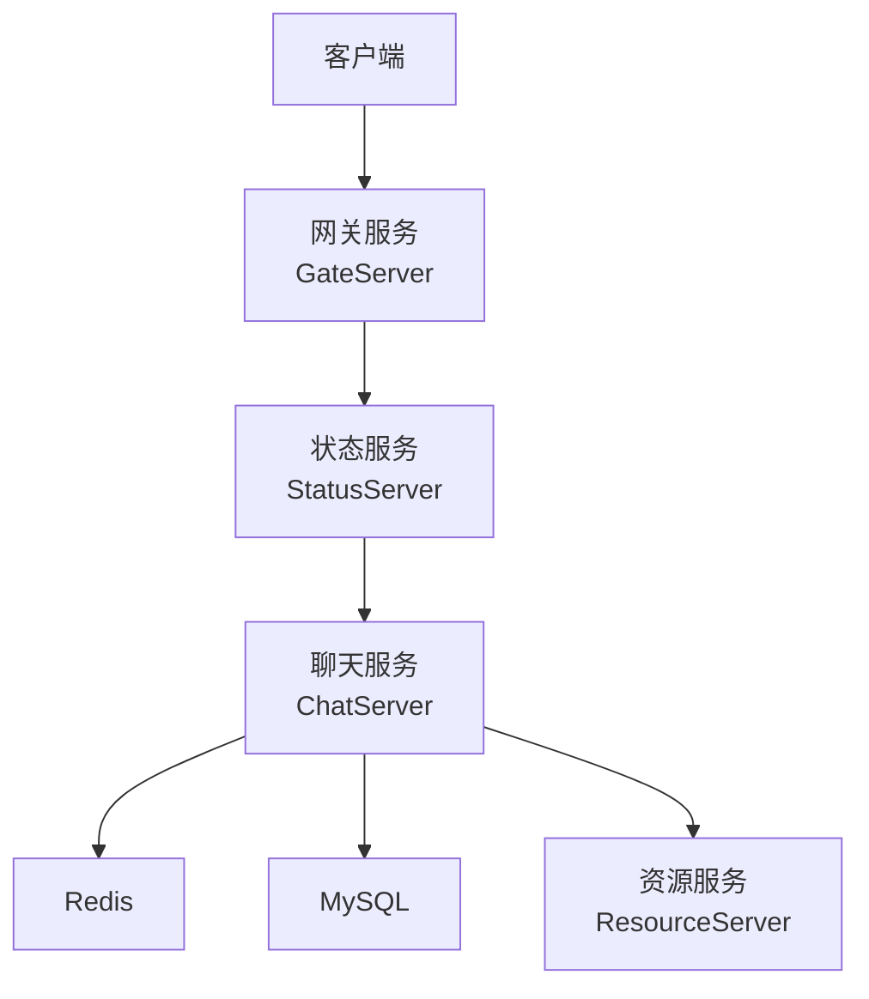
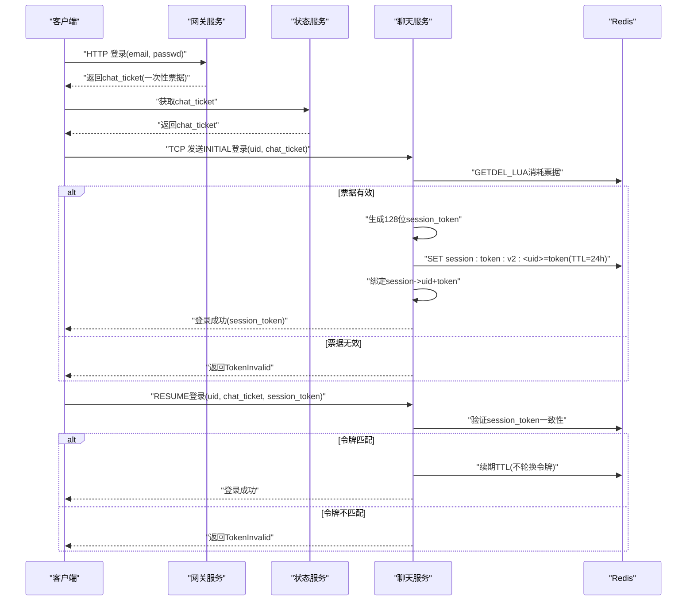
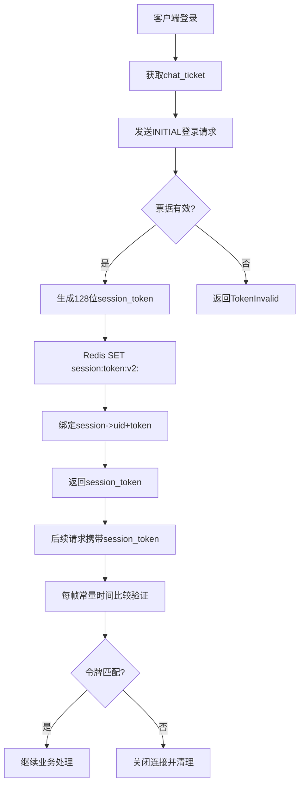
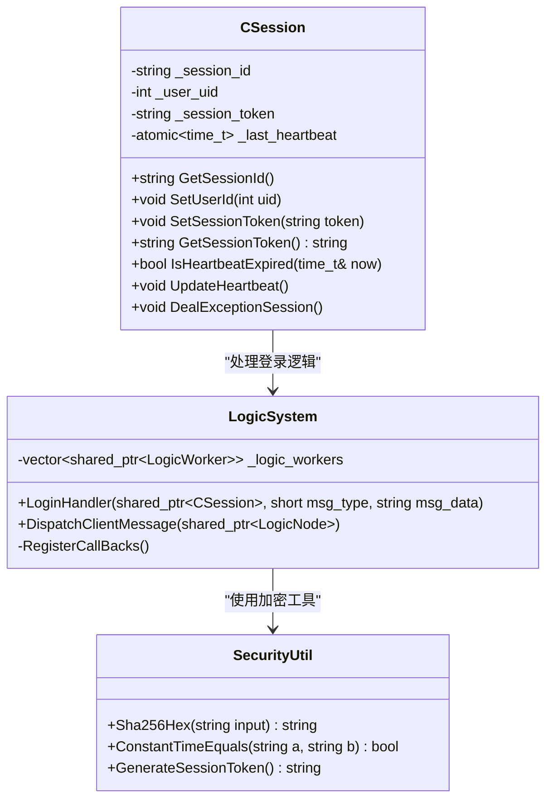
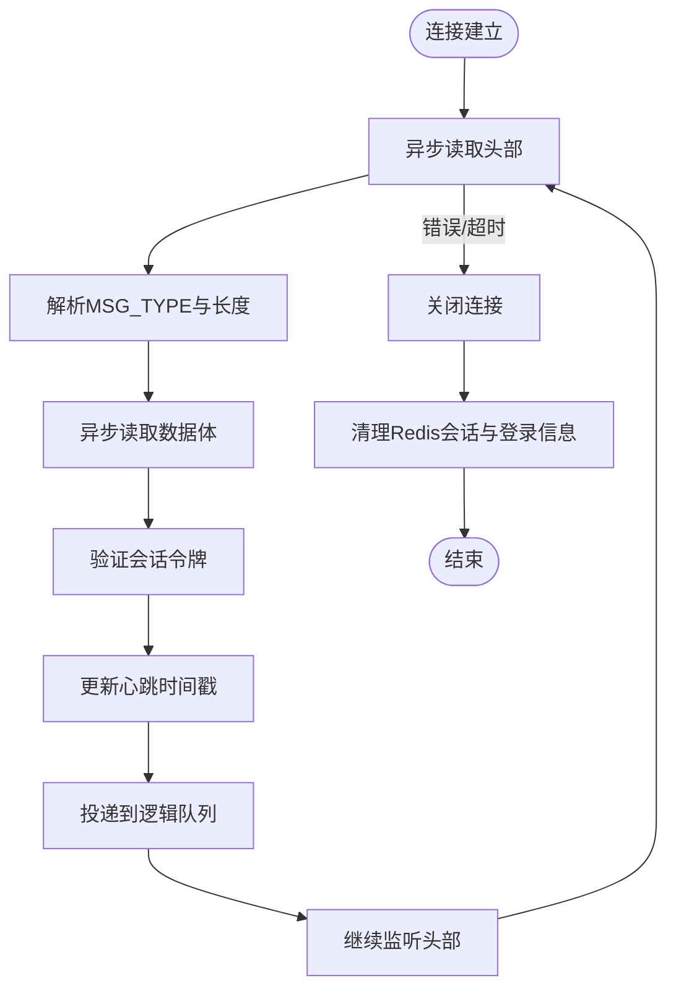
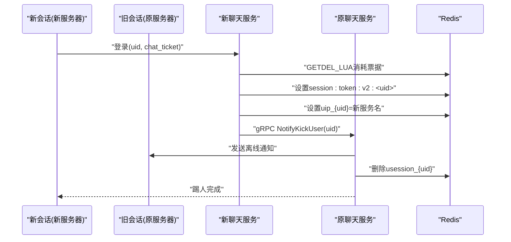
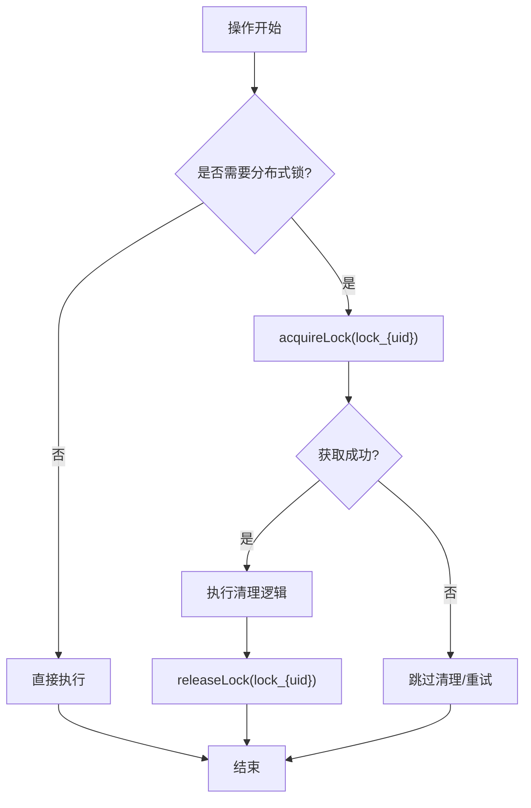
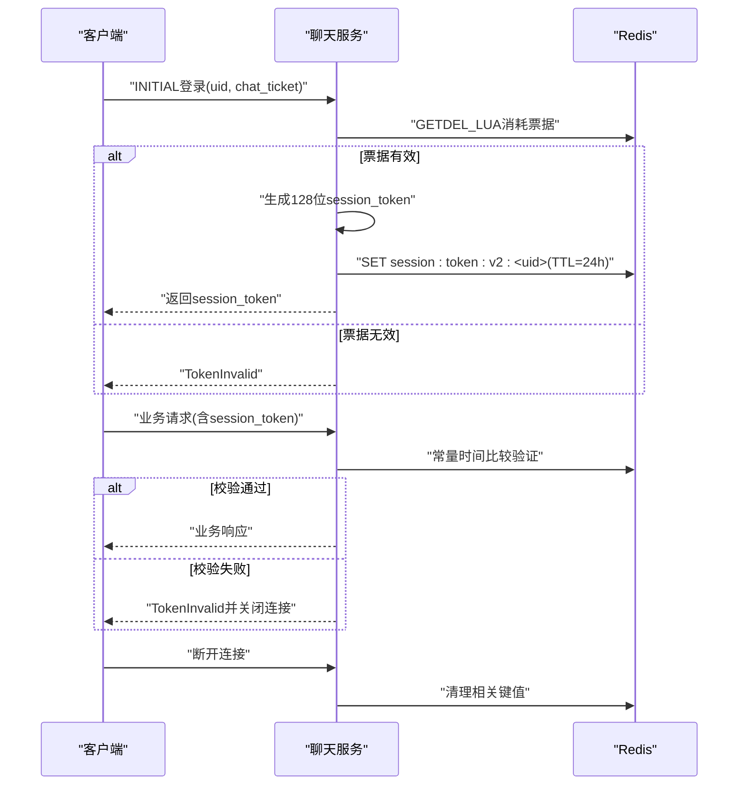
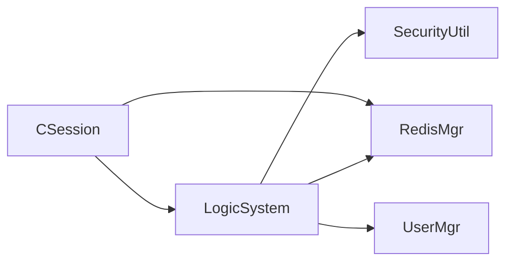

# 会话管理安全

<cite>
**本文引用的文件**   
- [CSession.h](file://server/ChatServer/include/CSession.h)
- [CSession.cpp](file://server/ChatServer/src/CSession.cpp)
- [LogicSystem.cpp](file://server/ChatServer/src/LogicSystem.cpp)
- [const.h](file://server/ChatServer/include/const.h)
- [SecurityUtil.h](file://server/common/include/SecurityUtil.h)
- [logindialog.cpp](file://client/llfcchat/src/logindialog.cpp)
- [tcpmgr.cpp](file://client/llfcchat/src/tcpmgr.cpp)
</cite>

## 更新摘要
**所做更改**   
- 完全重写会话管理机制以支持新的mTLS票据系统
- 实现128位会话令牌生成和验证
- 添加Redis原子操作确保票据一次性消费
- 实现常量时间比较防止时序攻击
- 更新会话生命周期管理支持24小时TTL
- 增强多设备登录支持和跨服务同步机制

## 目录
1. [简介](#简介)
2. [项目结构](#项目结构)
3. [核心组件](#核心组件)
4. [架构总览](#架构总览)
5. [详细组件分析](#详细组件分析)
6. [依赖关系分析](#依赖关系分析)
7. [性能考量](#性能考量)
8. [故障排查指南](#故障排查指南)
9. [结论](#结论)
10. [附录](#附录)

## 简介
本技术文档围绕 LLFCChat 的会话管理安全展开，重点覆盖以下方面：
- mTLS票据系统与128位会话令牌生成策略
- Redis原子操作与会话存储机制
- 会话生命周期管理与超时处理
- 多设备登录支持与跨服务同步
- 并发控制机制（分布式锁、线程锁）
- 自动登出与用户状态管理
- 安全的会话创建、验证与销毁流程
- 会话固定攻击防护、跨站请求伪造防护与会话劫持检测

## 项目结构
LLFCChat 采用多服务架构，涉及聊天服务（ChatServer）、网关服务（GateServer）、资源服务（ResourceServer）、状态服务（StatusServer）等。会话管理主要位于 ChatServer 中，通过 Redis 进行跨进程/跨节点的状态共享，并通过 gRPC 实现服务间通信。

[本图为概念性架构图，不直接映射具体源码文件]

## 核心组件
- CSession：封装单个 TCP 连接的生命周期、心跳、读写队列、异常清理等
- LogicSystem：消息路由与业务逻辑处理，包含mTLS票据验证和会话令牌管理
- SecurityUtil：提供加密原语，包括SHA-256哈希、常量时间比较和128位令牌生成
- const.h：错误码、消息类型、Redis Key前缀、锁常量等

**章节来源**
- [CSession.h:28-76](file://server/ChatServer/include/CSession.h#L28-L76)
- [CSession.cpp:10-16](file://server/ChatServer/src/CSession.cpp#L10-L16)
- [LogicSystem.cpp:234-441](file://server/ChatServer/src/LogicSystem.cpp#L234-L441)
- [SecurityUtil.h:21-96](file://server/common/include/SecurityUtil.h#L21-L96)
- [const.h:158-161](file://server/ChatServer/include/const.h#L158-L161)

## 架构总览
下图展示了从客户端登录到聊天服务器建立会话的关键流程，包括mTLS票据验证、128位会话令牌生成、Redis原子操作校验和会话绑定。

**图表来源**
- [LogicSystem.cpp:234-441](file://server/ChatServer/src/LogicSystem.cpp#L234-L441)
- [const.h:158-161](file://server/ChatServer/include/const.h#L158-L161)
- [SecurityUtil.h:83-96](file://server/common/include/SecurityUtil.h#L83-L96)

**章节来源**
- [LogicSystem.cpp:234-441](file://server/ChatServer/src/LogicSystem.cpp#L234-L441)
- [const.h:158-161](file://server/ChatServer/include/const.h#L158-L161)

## 详细组件分析

### mTLS票据系统与128位会话令牌
- **mTLS票据机制**：
  - 客户端通过HTTP登录获取一次性chat_ticket
  - 票据存储在Redis中，使用GETDEL Lua脚本确保原子性消费
  - 票据包含{uid:int, server:string, intent:0|1[, session_token_sha256:hex]}
  
- **128位会话令牌**：
  - INITIAL登录时生成128位随机令牌（security::GenerateSessionToken）
  - RESUME登录时验证请求令牌与票据SHA、Redis存值三者一致
  - 令牌存储在Redis中带有24小时TTL（SESSION_TOKEN_TTL = 86400秒）

**图表来源**
- [LogicSystem.cpp:267-338](file://server/ChatServer/src/LogicSystem.cpp#L267-L338)
- [SecurityUtil.h:83-96](file://server/common/include/SecurityUtil.h#L83-L96)

**章节来源**
- [LogicSystem.cpp:267-338](file://server/ChatServer/src/LogicSystem.cpp#L267-L338)
- [SecurityUtil.h:83-96](file://server/common/include/SecurityUtil.h#L83-L96)

### 会话ID生成与存储
- **会话ID生成**：在 CSession 构造时通过随机 UUID 生成唯一标识，确保不可预测性与全局唯一性
- **会话ID存储**：
  - 内存：CServer 维护 _sessions 映射（session_id -> CSession）
  - Redis：使用 usession_{uid} 存储当前有效 session_id，用于跨服务同步与踢人判断
  - 登录位置：uip_{uid} 记录用户所在服务名，便于跨服务路由
- **会话令牌存储**：session:token:v2:{uid} 存储可恢复的会话令牌，支持24小时TTL

**图表来源**
- [CSession.h:28-76](file://server/ChatServer/include/CSession.h#L28-L76)
- [CSession.cpp:46-56](file://server/ChatServer/src/CSession.cpp#L46-L56)
- [LogicSystem.cpp:234-441](file://server/ChatServer/src/LogicSystem.cpp#L234-L441)
- [SecurityUtil.h:21-96](file://server/common/include/SecurityUtil.h#L21-L96)

**章节来源**
- [CSession.cpp:46-56](file://server/ChatServer/src/CSession.cpp#L46-L56)
- [LogicSystem.cpp:234-441](file://server/ChatServer/src/LogicSystem.cpp#L234-L441)
- [SecurityUtil.h:21-96](file://server/common/include/SecurityUtil.h#L21-L96)

### 会话生命周期管理
- **创建**：客户端连接后，CSession::Start 启动异步读头/体循环
- **活跃**：每次读取数据后更新心跳时间戳，每帧验证会话令牌
- **过期**：CServer 定时器周期性扫描，超过阈值（如20秒无心跳）则关闭连接并清理
- **销毁**：异常或主动关闭时，调用 DealExceptionSession 清理 Redis 中的会话与登录信息

**图表来源**
- [CSession.cpp:166-259](file://server/ChatServer/src/CSession.cpp#L166-L259)
- [CSession.cpp:452-483](file://server/ChatServer/src/CSession.cpp#L452-L483)

**章节来源**
- [CSession.cpp:166-259](file://server/ChatServer/src/CSession.cpp#L166-L259)
- [CSession.cpp:452-483](file://server/ChatServer/src/CSession.cpp#L452-L483)

### 多设备登录支持与跨服务同步
- **多设备**：允许同一 uid 在不同服务器或不同 session 上同时在线
- **跨服务同步**：通过 uip_{uid} 记录当前服务名，ChatServer 根据该值决定本地推送还是 gRPC 转发
- **踢人机制**：当新登录时，可通过 gRPC 通知旧 session 下线，并清理旧会话

**图表来源**
- [LogicSystem.cpp:392-438](file://server/ChatServer/src/LogicSystem.cpp#L392-L438)

**章节来源**
- [LogicSystem.cpp:392-438](file://server/ChatServer/src/LogicSystem.cpp#L392-L438)

### 并发控制机制
- **线程级锁**：CSession内部使用mutex保护会话状态和发送队列
- **分布式锁**：DealExceptionSession 和登录处理中使用 Redis 分布式锁（lock_{uid}），避免多实例竞争导致的数据不一致
- **会话有效性检查**：每帧验证会话令牌，防止并发篡改

**图表来源**
- [LogicSystem.cpp:392-438](file://server/ChatServer/src/LogicSystem.cpp#L392-L438)
- [CSession.cpp:452-483](file://server/ChatServer/src/CSession.cpp#L452-L483)

**章节来源**
- [LogicSystem.cpp:392-438](file://server/ChatServer/src/LogicSystem.cpp#L392-L438)
- [CSession.cpp:452-483](file://server/ChatServer/src/CSession.cpp#L452-L483)

### 会话超时处理、自动登出与用户状态管理
- **心跳阈值**：CSession::IsHeartbeatExpired 基于最后心跳时间判断是否过期（默认20秒）
- **自动登出**：定时器触发后关闭连接并清理 Redis 中的 usession_{uid}、uip_{uid}
- **用户状态**：LoginHandler 成功后设置用户基础信息缓存至 Redis，便于快速访问
- **会话令牌TTL**：24小时自动过期，支持续期但不轮换令牌

**章节来源**
- [CSession.cpp:436-450](file://server/ChatServer/src/CSession.cpp#L436-L450)
- [LogicSystem.cpp:334-338](file://server/ChatServer/src/LogicSystem.cpp#L334-L338)

### 安全的会话创建、验证与销毁流程
- **创建**：客户端携带 uid 与 chat_ticket 发起登录，服务端通过Redis原子操作验证票据
- **验证**：每帧使用常量时间比较验证session_token，防止时序攻击
- **销毁**：异常或主动退出时清理所有相关 Redis 键，确保状态一致

**图表来源**
- [LogicSystem.cpp:234-441](file://server/ChatServer/src/LogicSystem.cpp#L234-L441)
- [SecurityUtil.h:66-79](file://server/common/include/SecurityUtil.h#L66-L79)

**章节来源**
- [LogicSystem.cpp:234-441](file://server/ChatServer/src/LogicSystem.cpp#L234-L441)
- [SecurityUtil.h:66-79](file://server/common/include/SecurityUtil.h#L66-L79)

### 会话固定攻击防护、跨站请求伪造防护与会话劫持检测
- **会话固定攻击防护**：
  - 每次INITIAL登录成功后生成新的128位session_token
  - 强制校验chat_ticket与uid绑定关系，防止票据重放
  - 使用Redis原子操作确保票据一次性消费
  
- **跨站请求伪造防护**：
  - HTTP接口仅用于验证码等非敏感操作
  - 建议生产环境限制CORS来源
  
- **会话劫持检测**：
  - 通过session:token:v2:<uid>与当前session_token比对
  - 结合心跳与异常清理机制，及时断开可疑连接
  - 常量时间比较防止时序攻击

**章节来源**
- [LogicSystem.cpp:267-338](file://server/ChatServer/src/LogicSystem.cpp#L267-L338)
- [SecurityUtil.h:66-79](file://server/common/include/SecurityUtil.h#L66-L79)

## 依赖关系分析

**图表来源**
- [CSession.h:28-76](file://server/ChatServer/include/CSession.h#L28-L76)
- [LogicSystem.cpp:1-15](file://server/ChatServer/src/LogicSystem.cpp#L1-L15)
- [SecurityUtil.h:1-99](file://server/common/include/SecurityUtil.h#L1-L99)

**章节来源**
- [CSession.h:28-76](file://server/ChatServer/include/CSession.h#L28-L76)
- [LogicSystem.cpp:1-15](file://server/ChatServer/src/LogicSystem.cpp#L1-L15)
- [SecurityUtil.h:1-99](file://server/common/include/SecurityUtil.h#L1-L99)

## 性能考量
- **心跳检测批量处理**：CServer::on_timer 收集过期会话后统一清理，减少锁竞争
- **发送队列限流**：CSession::Send 限制队列长度，避免内存溢出
- **Redis 操作优化**：使用Lua脚本进行原子操作，降低频繁加锁开销
- **常量时间比较**：防止时序攻击的同时保持O(n)时间复杂度
- **票据一次性消费**：GETDEL Lua脚本确保票据只能被消费一次，避免重复使用

**章节来源**
- [LogicSystem.cpp:20-26](file://server/ChatServer/src/LogicSystem.cpp#L20-L26)
- [SecurityUtil.h:66-79](file://server/common/include/SecurityUtil.h#L66-L79)

## 故障排查指南
- **登录失败**：检查Redis中chat_ticket是否存在且未被消费，验证票据内容完整性
- **会话丢失**：确认session:token:v2:<uid>是否与当前session_token匹配，检查分布式锁是否被其他实例持有
- **心跳超时**：查看客户端是否定期发送心跳，服务端日志是否打印"heartbeat expired"
- **跨服务踢人**：验证gRPC调用是否成功，目标服务是否正确收到NotifyKickUser
- **令牌验证失败**：检查常量时间比较逻辑，确认Redis中存储的令牌与请求令牌一致

**章节来源**
- [LogicSystem.cpp:267-338](file://server/ChatServer/src/LogicSystem.cpp#L267-L338)
- [CSession.cpp:452-483](file://server/ChatServer/src/CSession.cpp#L452-L483)

## 结论
LLFCChat 的会话管理通过mTLS票据系统、128位会话令牌、Redis原子操作和常量时间比较，实现了高安全性与高性能的平衡。新的设计有效防止了会话固定攻击、票据重放和时序攻击，同时支持多设备登录和跨服务同步。建议在后续迭代中进一步强化CORS策略、增加会话行为审计与异常告警，以提升整体安全性与可观测性。

## 附录
- 客户端消息类型定义参考const.h，确保与服务器端保持一致
- 配置文件（如config.ini）中Redis、MySQL参数需正确配置以保障会话持久化
- mTLS票据由StatusServer生成，ChatServer通过Redis原子操作验证

**章节来源**
- [const.h:158-161](file://server/ChatServer/include/const.h#L158-L161)
- [logindialog.cpp:104-106](file://client/llfcchat/src/logindialog.cpp#L104-L106)
- [tcpmgr.cpp:287-289](file://client/llfcchat/src/tcpmgr.cpp#L287-L289)