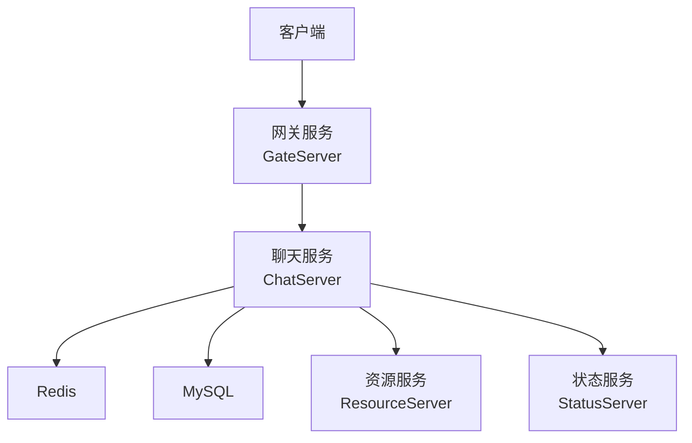
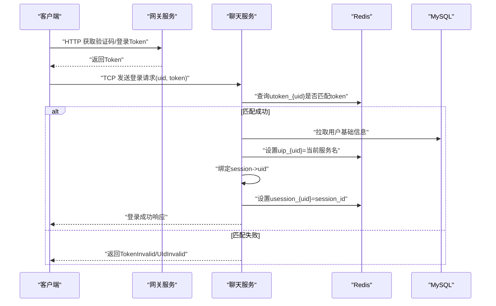
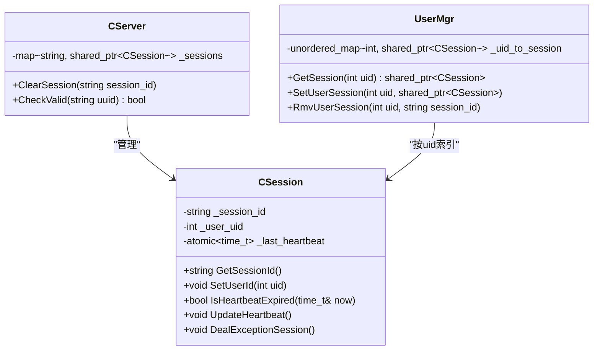
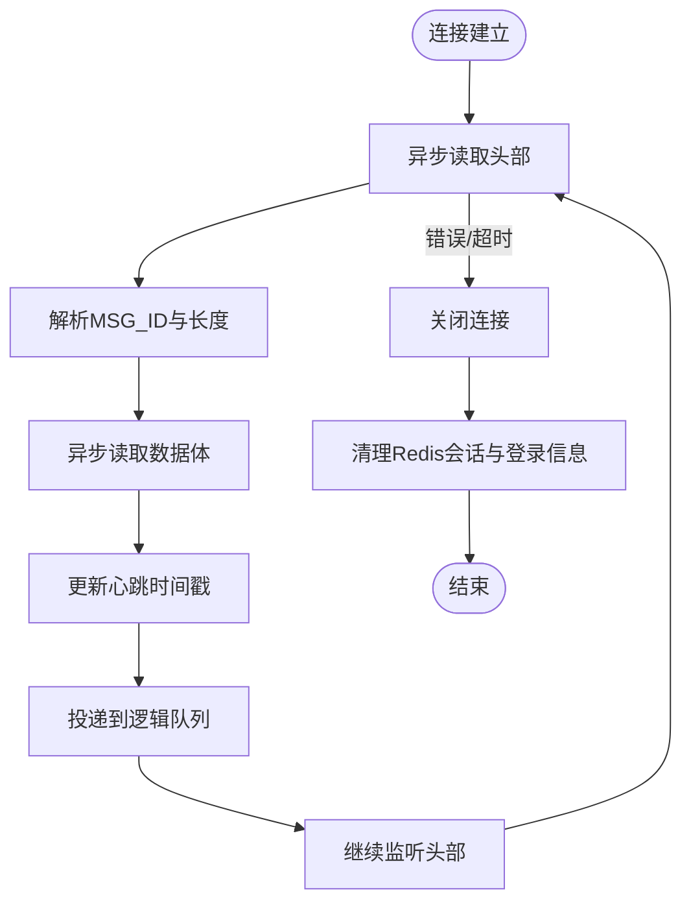
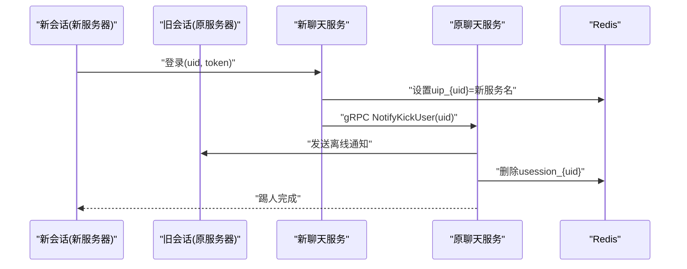
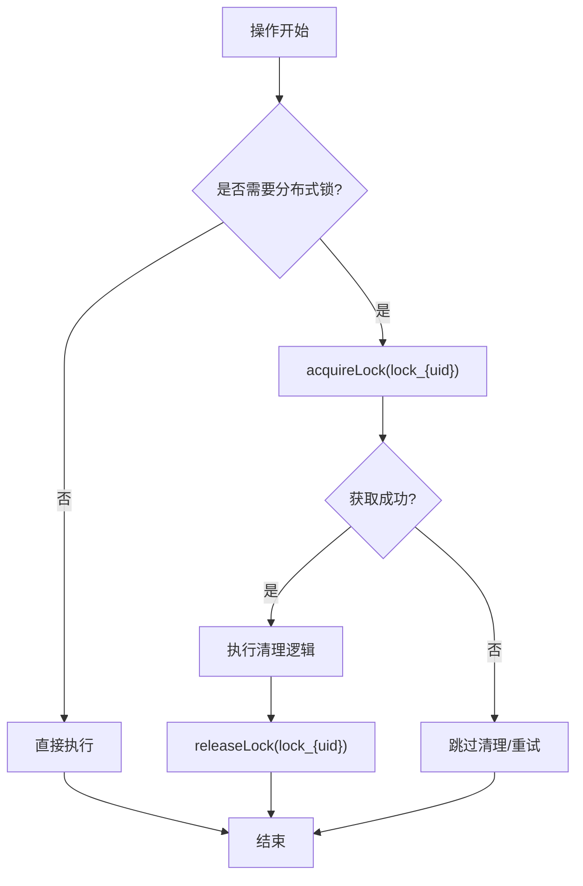
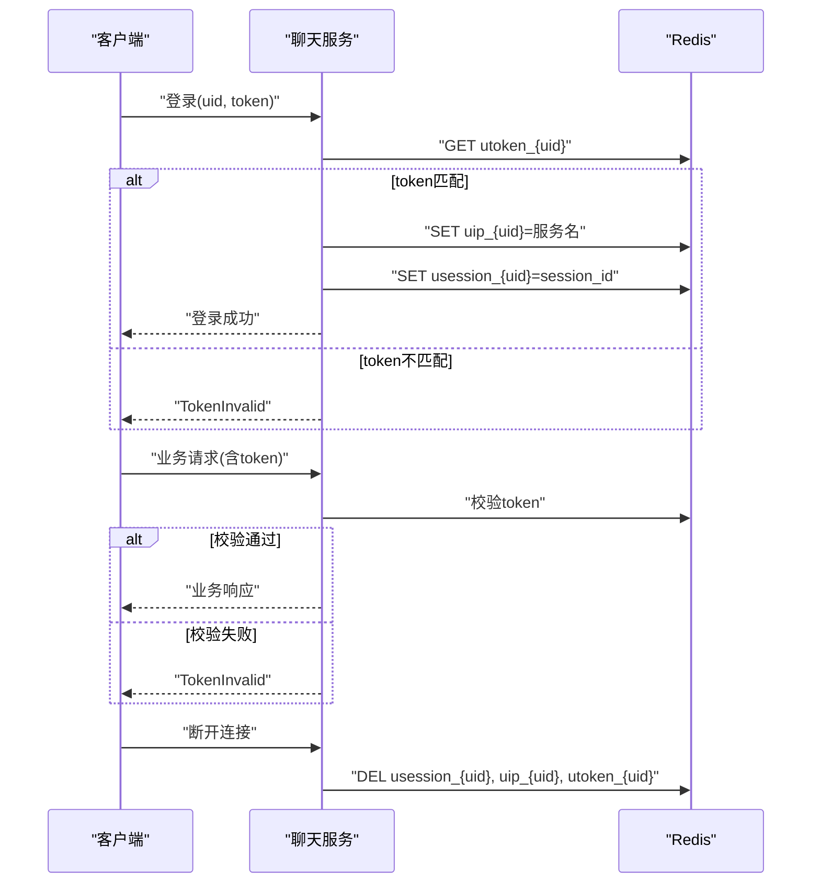
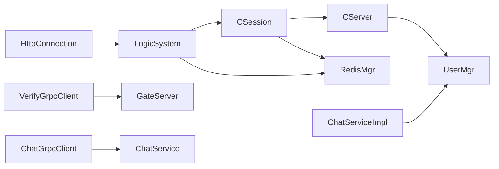

# 会话管理安全

<cite>
**本文引用的文件**   
- [CSession.h](file://server/ChatServer/include/CSession.h)
- [CSession.cpp](file://server/ChatServer/src/CSession.cpp)
- [CServer.h](file://server/ChatServer/include/CServer.h)
- [CServer.cpp](file://server/ChatServer/src/CServer.cpp)
- [UserMgr.h](file://server/ChatServer/include/UserMgr.h)
- [UserMgr.cpp](file://server/ChatServer/src/UserMgr.cpp)
- [LogicSystem.cpp](file://server/ChatServer/src/LogicSystem.cpp)
- [const.h](file://server/ChatServer/include/const.h)
- [HttpConnection.h](file://server/GateServer/include/HttpConnection.h)
- [HttpConnection.cpp](file://server/GateServer/src/HttpConnection.cpp)
- [VerifyGrpcClient.h](file://server/GateServer/include/VerifyGrpcClient.h)
- [ChatServiceImpl.cpp](file://server/ChatServer/src/ChatServiceImpl.cpp)
- [ChatGrpcClient.cpp](file://server/ChatServer/src/ChatGrpcClient.cpp)
- [global.h](file://client/llfcchat/include/global.h)
</cite>

## 目录
1. [简介](#简介)
2. [项目结构](#项目结构)
3. [核心组件](#核心组件)
4. [架构总览](#架构总览)
5. [详细组件分析](#详细组件分析)
6. [依赖关系分析](#依赖关系分析)
7. [性能考量](#性能考量)
8. [故障排查指南](#故障排查指南)
9. [结论](#结论)
10. [附录](#附录)

## 简介
本技术文档围绕 LLFCChat 的会话管理安全展开，重点覆盖以下方面：
- 会话ID生成与存储策略
- 会话生命周期管理与超时处理
- 多设备登录支持与跨服务同步
- 并发控制机制（分布式锁、线程锁）
- 自动登出与用户状态管理
- 安全的会话创建、验证与销毁流程
- 会话固定攻击防护、跨站请求伪造防护与会话劫持检测

## 项目结构
LLFCChat 采用多服务架构，涉及聊天服务（ChatServer）、网关服务（GateServer）、资源服务（ResourceServer）、状态服务（StatusServer）等。会话管理主要位于 ChatServer 中，通过 Redis 进行跨进程/跨节点的状态共享，并通过 gRPC 实现服务间通信。

[本图为概念性架构图，不直接映射具体源码文件]

## 核心组件
- CSession：封装单个 TCP 连接的生命周期、心跳、读写队列、异常清理等
- CServer：维护所有活跃会话、定时心跳检测、会话有效性校验
- UserMgr：维护 uid 到 session 的映射，支持踢人、移除会话
- LogicSystem：消息路由与业务逻辑处理（如登录、聊天、通知）
- HttpConnection：HTTP 请求解析与响应（用于验证码等 HTTP 接口）
- VerifyGrpcClient：调用验证码服务的 gRPC 客户端
- const.h：错误码、消息ID、Redis Key 前缀、锁常量等

**章节来源**
- [CSession.h:1-86](file://server/ChatServer/include/CSession.h#L1-L86)
- [CSession.cpp:1-335](file://server/ChatServer/src/CSession.cpp#L1-L335)
- [CServer.h:1-31](file://server/ChatServer/include/CServer.h#L1-L31)
- [CServer.cpp:47-132](file://server/ChatServer/src/CServer.cpp#L47-L132)
- [UserMgr.h:1-22](file://server/ChatServer/include/UserMgr.h#L1-L22)
- [UserMgr.cpp:1-49](file://server/ChatServer/src/UserMgr.cpp#L1-L49)
- [LogicSystem.cpp:116-145](file://server/ChatServer/src/LogicSystem.cpp#L116-L145)
- [const.h:1-104](file://server/ChatServer/include/const.h#L1-L104)
- [HttpConnection.h:1-36](file://server/GateServer/include/HttpConnection.h#L1-L36)
- [HttpConnection.cpp:1-225](file://server/GateServer/src/HttpConnection.cpp#L1-L225)
- [VerifyGrpcClient.h:1-113](file://server/GateServer/include/VerifyGrpcClient.h#L1-L113)

## 架构总览
下图展示了从客户端登录到聊天服务器建立会话的关键流程，包括 Token 校验、会话绑定、心跳与过期清理。

**图表来源**
- [LogicSystem.cpp:116-145](file://server/ChatServer/src/LogicSystem.cpp#L116-L145)
- [const.h:80-88](file://server/ChatServer/include/const.h#L80-L88)
- [CSession.cpp:285-333](file://server/ChatServer/src/CSession.cpp#L285-L333)

**章节来源**
- [LogicSystem.cpp:116-145](file://server/ChatServer/src/LogicSystem.cpp#L116-L145)
- [const.h:80-88](file://server/ChatServer/include/const.h#L80-L88)

## 详细组件分析

### 会话ID生成与存储
- 会话ID生成：在 CSession 构造时通过随机 UUID 生成唯一标识，确保不可预测性与全局唯一性
- 会话ID存储：
  - 内存：CServer 维护 _sessions 映射（session_id -> CSession）
  - Redis：使用 usession_{uid} 存储当前有效 session_id，用于跨服务同步与踢人判断
  - 登录位置：uip_{uid} 记录用户所在服务名，便于跨服务路由

**图表来源**
- [CSession.h:28-76](file://server/ChatServer/include/CSession.h#L28-L76)
- [CSession.cpp:10-16](file://server/ChatServer/src/CSession.cpp#L10-L16)
- [CServer.cpp:47-73](file://server/ChatServer/src/CServer.cpp#L47-L73)
- [UserMgr.h:8-20](file://server/ChatServer/include/UserMgr.h#L8-L20)
- [UserMgr.cpp:10-49](file://server/ChatServer/src/UserMgr.cpp#L10-L49)

**章节来源**
- [CSession.cpp:10-16](file://server/ChatServer/src/CSession.cpp#L10-L16)
- [CServer.cpp:47-73](file://server/ChatServer/src/CServer.cpp#L47-L73)
- [UserMgr.cpp:10-49](file://server/ChatServer/src/UserMgr.cpp#L10-L49)
- [const.h:80-88](file://server/ChatServer/include/const.h#L80-L88)

### 会话生命周期管理
- 创建：客户端连接后，CSession::Start 启动异步读头/体循环
- 活跃：每次读取数据后更新心跳时间戳
- 过期：CServer 定时器周期性扫描，超过阈值（如20秒无心跳）则关闭连接并清理
- 销毁：异常或主动关闭时，调用 DealExceptionSession 清理 Redis 中的会话与登录信息

**图表来源**
- [CSession.cpp:130-191](file://server/ChatServer/src/CSession.cpp#L130-L191)
- [CSession.cpp:285-333](file://server/ChatServer/src/CSession.cpp#L285-L333)
- [CServer.cpp:75-118](file://server/ChatServer/src/CServer.cpp#L75-L118)

**章节来源**
- [CSession.cpp:130-191](file://server/ChatServer/src/CSession.cpp#L130-L191)
- [CSession.cpp:285-333](file://server/ChatServer/src/CSession.cpp#L285-L333)
- [CServer.cpp:75-118](file://server/ChatServer/src/CServer.cpp#L75-L118)

### 多设备登录支持与跨服务同步
- 多设备：允许同一 uid 在不同服务器或不同 session 上同时在线
- 跨服务同步：通过 uip_{uid} 记录当前服务名，ChatServer 根据该值决定本地推送还是 gRPC 转发
- 踢人机制：当新登录时，可通过 gRPC 通知旧 session 下线，并清理旧会话

**图表来源**
- [ChatServiceImpl.cpp:187-210](file://server/ChatServer/src/ChatServiceImpl.cpp#L187-L210)
- [ChatGrpcClient.cpp:107-135](file://server/ChatServer/src/ChatGrpcClient.cpp#L107-L135)
- [const.h:80-88](file://server/ChatServer/include/const.h#L80-L88)

**章节来源**
- [ChatServiceImpl.cpp:187-210](file://server/ChatServer/src/ChatServiceImpl.cpp#L187-L210)
- [ChatGrpcClient.cpp:107-135](file://server/ChatServer/src/ChatGrpcClient.cpp#L107-L135)

### 并发控制机制
- 线程级锁：UserMgr 内部使用 mutex 保护 _uid_to_session 映射
- 分布式锁：DealExceptionSession 和心跳清理中使用 Redis 分布式锁（lock_{uid}），避免多实例竞争导致的数据不一致
- 会话有效性检查：CServer::CheckValid 在每次读写前校验 session 是否存在

**图表来源**
- [UserMgr.cpp:21-49](file://server/ChatServer/src/UserMgr.cpp#L21-L49)
- [CSession.cpp:301-333](file://server/ChatServer/src/CSession.cpp#L301-L333)
- [CServer.cpp:65-73](file://server/ChatServer/src/CServer.cpp#L65-L73)

**章节来源**
- [UserMgr.cpp:21-49](file://server/ChatServer/src/UserMgr.cpp#L21-L49)
- [CSession.cpp:301-333](file://server/ChatServer/src/CSession.cpp#L301-L333)
- [CServer.cpp:65-73](file://server/ChatServer/src/CServer.cpp#L65-L73)

### 会话超时处理、自动登出与用户状态管理
- 心跳阈值：CSession::IsHeartbeatExpired 基于最后心跳时间判断是否过期（默认20秒）
- 自动登出：定时器触发后关闭连接并清理 Redis 中的 usession_{uid}、uip_{uid}、utoken_{uid}
- 用户状态：LoginHandler 成功后设置用户基础信息缓存至 Redis，便于快速访问

**章节来源**
- [CSession.cpp:285-299](file://server/ChatServer/src/CSession.cpp#L285-L299)
- [CServer.cpp:75-118](file://server/ChatServer/src/CServer.cpp#L75-L118)
- [LogicSystem.cpp:116-145](file://server/ChatServer/src/LogicSystem.cpp#L116-L145)

### 安全的会话创建、验证与销毁流程
- 创建：客户端携带 uid 与 token 发起登录，服务端校验 token 一致性
- 验证：每次关键操作（如下载、上传）首包校验 token，防止重放与越权
- 销毁：异常或主动退出时清理所有相关 Redis 键，确保状态一致

**图表来源**
- [LogicSystem.cpp:116-145](file://server/ChatServer/src/LogicSystem.cpp#L116-L145)
- [CSession.cpp:301-333](file://server/ChatServer/src/CSession.cpp#L301-L333)
- [const.h:80-88](file://server/ChatServer/include/const.h#L80-L88)

**章节来源**
- [LogicSystem.cpp:116-145](file://server/ChatServer/src/LogicSystem.cpp#L116-L145)
- [CSession.cpp:301-333](file://server/ChatServer/src/CSession.cpp#L301-L333)

### 会话固定攻击防护、跨站请求伪造防护与会话劫持检测
- 会话固定攻击防护：
  - 每次登录成功后重新生成 session_id（UUID），避免复用旧会话
  - 强制校验 token 与 uid 绑定关系，防止会话固定
- 跨站请求伪造防护：
  - HTTP 接口仅用于验证码等非敏感操作，且设置短连接与最小化状态
  - 建议生产环境限制 CORS 来源（当前代码设置为“*”需加固）
- 会话劫持检测：
  - 通过 usession_{uid} 与当前 session_id 比对，若不一致则判定为异地登录或劫持
  - 结合心跳与异常清理机制，及时断开可疑连接

**章节来源**
- [CSession.cpp:10-16](file://server/ChatServer/src/CSession.cpp#L10-L16)
- [HttpConnection.cpp:138-140](file://server/GateServer/src/HttpConnection.cpp#L138-L140)
- [CSession.cpp:316-325](file://server/ChatServer/src/CSession.cpp#L316-L325)

## 依赖关系分析

**图表来源**
- [CSession.h:28-76](file://server/ChatServer/include/CSession.h#L28-L76)
- [CServer.h:10-31](file://server/ChatServer/include/CServer.h#L10-L31)
- [UserMgr.h:8-20](file://server/ChatServer/include/UserMgr.h#L8-L20)
- [HttpConnection.h:4-36](file://server/GateServer/include/HttpConnection.h#L4-L36)
- [VerifyGrpcClient.h:80-113](file://server/GateServer/include/VerifyGrpcClient.h#L80-L113)

**章节来源**
- [CSession.h:28-76](file://server/ChatServer/include/CSession.h#L28-L76)
- [CServer.h:10-31](file://server/ChatServer/include/CServer.h#L10-L31)
- [UserMgr.h:8-20](file://server/ChatServer/include/UserMgr.h#L8-L20)
- [HttpConnection.h:4-36](file://server/GateServer/include/HttpConnection.h#L4-L36)
- [VerifyGrpcClient.h:80-113](file://server/GateServer/include/VerifyGrpcClient.h#L80-L113)

## 性能考量
- 心跳检测批量处理：CServer::on_timer 收集过期会话后统一清理，减少锁竞争
- 发送队列限流：CSession::Send 限制队列长度，避免内存溢出
- Redis 操作优化：登录计数改为定时器批量写入，降低频繁加锁开销
- 连接池：VerifyGrpcClient 使用连接池复用 gRPC 通道，提升 RPC 效率

**章节来源**
- [CServer.cpp:75-118](file://server/ChatServer/src/CServer.cpp#L75-L118)
- [CSession.cpp:43-75](file://server/ChatServer/src/CSession.cpp#L43-L75)
- [VerifyGrpcClient.h:18-78](file://server/GateServer/include/VerifyGrpcClient.h#L18-L78)

## 故障排查指南
- 登录失败：检查 Redis 中 utoken_{uid} 是否存在且与请求 token 一致
- 会话丢失：确认 usession_{uid} 是否与当前 session_id 匹配，检查分布式锁是否被其他实例持有
- 心跳超时：查看客户端是否定期发送心跳，服务端日志是否打印“heartbeat expired”
- 跨服务踢人：验证 gRPC 调用是否成功，目标服务是否正确收到 NotifyKickUser

**章节来源**
- [LogicSystem.cpp:116-145](file://server/ChatServer/src/LogicSystem.cpp#L116-L145)
- [CSession.cpp:285-333](file://server/ChatServer/src/CSession.cpp#L285-L333)
- [ChatServiceImpl.cpp:187-210](file://server/ChatServer/src/ChatServiceImpl.cpp#L187-L210)

## 结论
LLFCChat 的会话管理通过严格的 Token 校验、分布式锁协调、心跳超时清理与跨服务同步机制，实现了高可用与安全性的平衡。建议在后续迭代中进一步强化 CORS 策略、增加会话行为审计与异常告警，以提升整体安全性与可观测性。

## 附录
- 客户端消息ID定义参考 global.h，确保与服务器端 const.h 保持一致
- 配置文件（如 config.ini）中 Redis、MySQL 参数需正确配置以保障会话持久化

**章节来源**
- [global.h:43-77](file://client/llfcchat/include/global.h#L43-L77)
- [const.h:1-104](file://server/ChatServer/include/const.h#L1-L104)