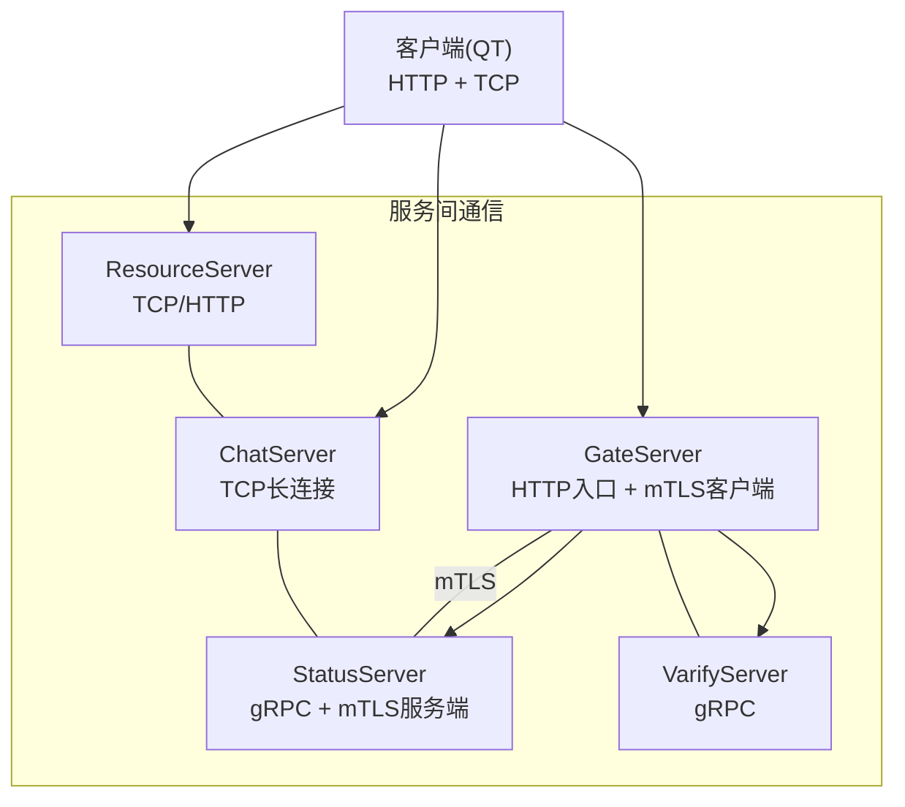
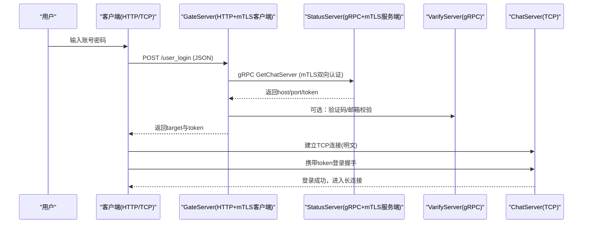
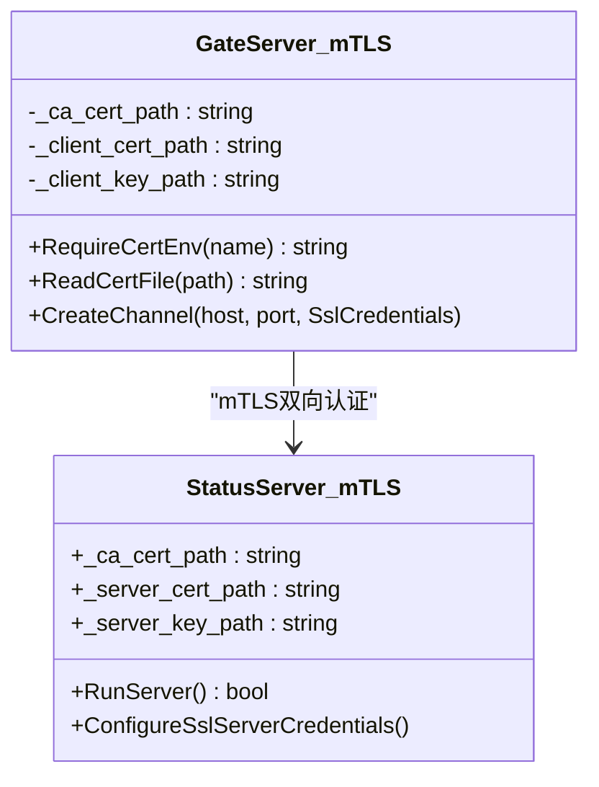
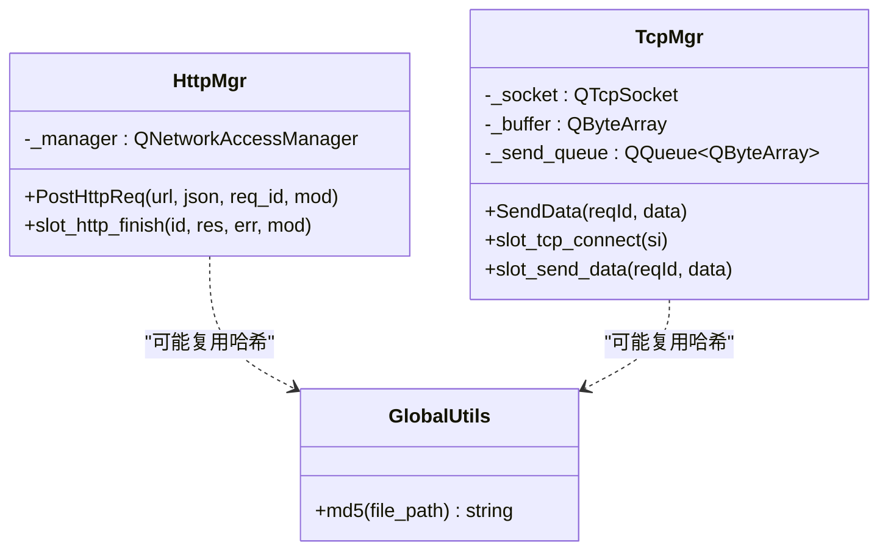
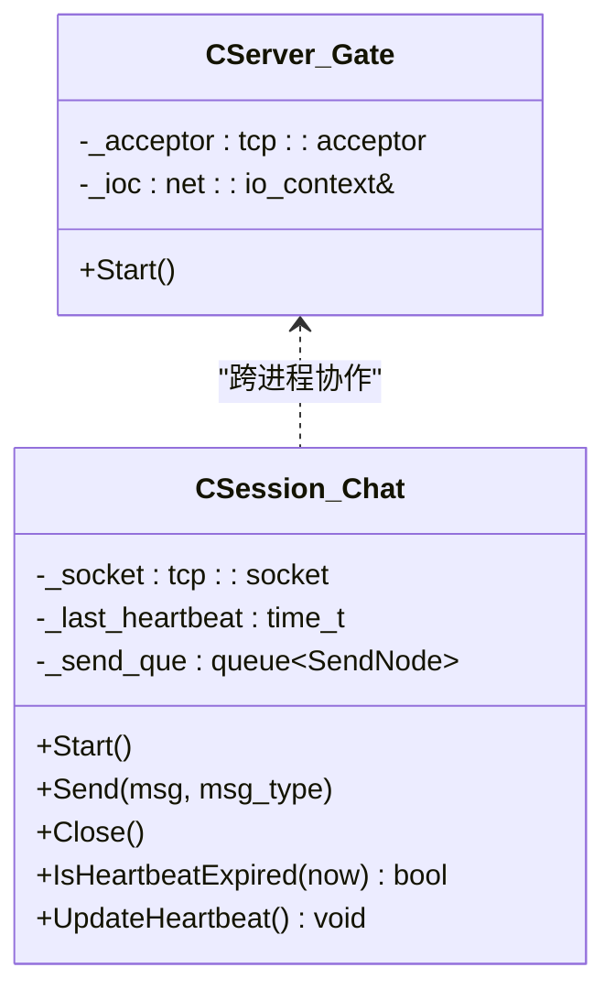
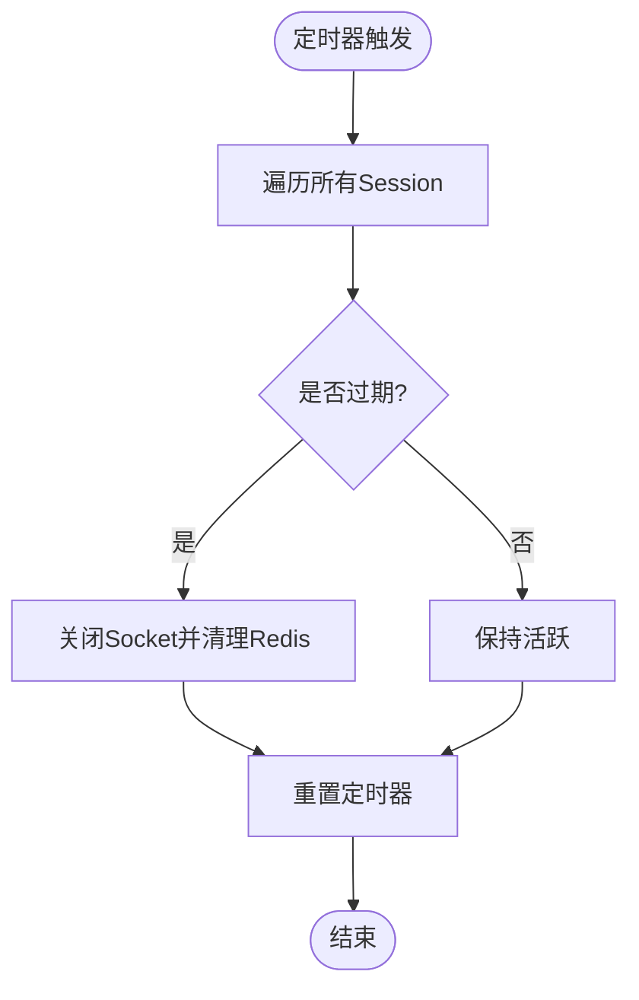
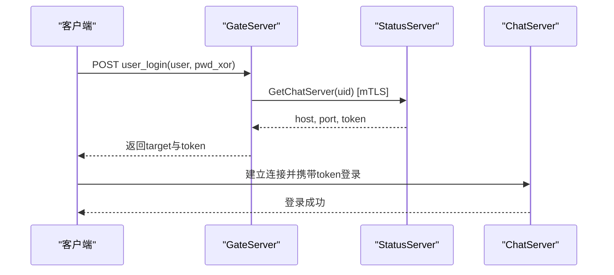
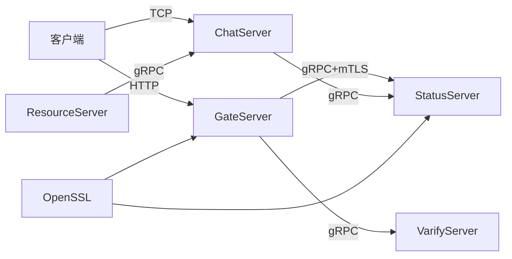

# 传输安全

<cite>
**本文引用的文件**   
- [tcpmgr.h](file://client/llfcchat/include/tcpmgr.h)
- [tcpmgr.cpp](file://client/llfcchat/src/tcpmgr.cpp)
- [httpmgr.h](file://client/llfcchat/include/httpmgr.h)
- [config.ini（客户端）](file://client/llfcchat/config/config.ini)
- [CServer.h（GateServer）](file://server/GateServer/include/CServer.h)
- [CSession.h（ChatServer）](file://server/ChatServer/include/CSession.h)
- [config.ini（GateServer）](file://server/GateServer/config/config.ini)
- [chatserver1.ini](file://server/ChatServer/config/chatserver1.ini)
- [chatserver2.ini](file://server/ChatServer/config/chatserver2.ini)
- [day35心跳逻辑.md](file://开发文档/day35心跳逻辑.md)
- [day14-登录功能.md](file://开发文档/day14-登录功能.md)
- [day17-登录服务验证和客户端数据管理.md](file://开发文档/day17-登录服务验证和客户端数据管理.md)
- [day29-好友认证和聊天通信.md](file://开发文档/day29-好友认证和聊天通信.md)
- [global.cpp](file://client/llfcchat/src/global.cpp)
- [userinfopage.cpp](file://client/llfcchat/src/userinfopage.cpp)
- [index.html（webrtc-demo）](file://webrtc-demo/web/index.html)
- [StatusGrpcClient.cpp（GateServer）](file://server/GateServer/src/StatusGrpcClient.cpp)
- [StatusServer.cpp](file://server/StatusServer/src/StatusServer.cpp)
- [im_integration_tests.cpp](file://tests/im_integration_tests.cpp)
- [ChatGrpcClient.cpp（ChatServer）](file://server/ChatServer/src/ChatGrpcClient.cpp)
- [ChatServerGrpcClient.cpp（ResourceServer）](file://server\ResourceServer\src\ChatServerGrpcClient.cpp)
</cite>

## 更新摘要
**变更内容**   
- 新增 mTLS 双向认证实现，GateServer 与 StatusServer 之间的 gRPC 通信现在使用相互 TLS 加密
- 通过环境变量配置 SSL 凭据：LLFC_STATUS_CA_CERT_PATH、LLFC_GATE_CLIENT_CERT_PATH、LLFC_GATE_CLIENT_KEY_PATH
- StatusServer 启用客户端证书验证，整个 gRPC 服务器在相互 TLS 上运行
- 集成测试包含完整的证书环境配置示例

## 目录
1. [简介](#简介)
2. [项目结构](#项目结构)
3. [核心组件](#核心组件)
4. [架构总览](#架构总览)
5. [详细组件分析](#详细组件分析)
6. [依赖关系分析](#依赖关系分析)
7. [性能与安全特性](#性能与安全特性)
8. [故障排查指南](#故障排查指南)
9. [结论](#结论)
10. [附录：部署与配置清单](#附录部署与配置清单)

## 简介
本文件为 LLFCChat 的"传输安全"专项文档，聚焦于网络层与消息层的加密、认证、完整性校验与抗攻击能力。当前代码库中：
- HTTP 用于注册、登录等控制面交互；TCP 用于长连接聊天消息面；gRPC 用于服务间通信；WebRTC 信令示例使用 WebSocket/TLS。
- **已实现** GateServer 与 StatusServer 之间的 gRPC 通信使用 mTLS 双向认证，通过环境变量加载 SSL 凭据。
- **待增强** TCP 明文通道尚未应用层签名与完整性校验，HTTP 尚未升级为 HTTPS。
- 本文在尊重现有实现的基础上，详细说明已实现的 mTLS 机制，并提供后续安全增强的落地方案。

## 项目结构
LLFCChat 由客户端（Qt）、网关（GateServer）、聊天服务器（ChatServer）、资源服务器（ResourceServer）、状态服务（StatusServer）与验证码服务（VarifyServer）组成。关键安全相关点：
- 客户端通过 QtNetwork 发起 HTTP 请求，通过 QTcpSocket 建立 TCP 长连接。
- GateServer 提供 HTTP 入口并转发至 StatusServer/VerifyService 等 gRPC 服务，**现已启用 mTLS**。
- ChatServer 基于 Boost.Asio/Beast 处理 TCP 会话，包含心跳与超时清理。
- WebRTC 示例展示了 wss/TLS 的使用方式。

**图表来源**
- [CServer.h（GateServer）:1-16](file://server/GateServer/include/CServer.h#L1-L16)
- [CSession.h（ChatServer）:1-86](file://server/ChatServer/include/CSession.h#L1-L86)
- [httpmgr.h:1-34](file://client/llfcchat/include/httpmgr.h#L1-L34)
- [tcpmgr.h:1-90](file://client/llfcchat/include/tcpmgr.h#L1-L90)
- [StatusGrpcClient.cpp（GateServer）:56-84](file://server/GateServer/src/StatusGrpcClient.cpp#L56-L84)
- [StatusServer.cpp:141-158](file://server/StatusServer/src/StatusServer.cpp#L141-L158)

**章节来源**
- [CServer.h（GateServer）:1-16](file://server/GateServer/include/CServer.h#L1-L16)
- [CSession.h（ChatServer）:1-86](file://server/ChatServer/include/CSession.h#L1-L86)
- [httpmgr.h:1-34](file://client/llfcchat/include/httpmgr.h#L1-L34)
- [tcpmgr.h:1-90](file://client/llfcchat/include/tcpmgr.h#L1-L90)

## 核心组件
- 客户端 HTTP 管理器：封装 QNetworkAccessManager，负责注册、登录等 HTTP 请求。
- 客户端 TCP 管理器：封装 QTcpSocket，负责聊天消息的粘包解析、发送队列与错误处理。
- GateServer：HTTP 接入点，调用 gRPC 获取聊天服务器地址与令牌，**已完成 mTLS 客户端实现**。
- ChatServer：基于 Asio/Beast 的 TCP 会话管理与心跳检测。
- StatusServer：**已启用 mTLS 服务端，支持客户端证书验证**。
- 验证码服务：gRPC 接口，生成/校验 Token，派发验证码。

**章节来源**
- [httpmgr.h:1-34](file://client/llfcchat/include/httpmgr.h#L1-L34)
- [tcpmgr.h:1-90](file://client/llfcchat/include/tcpmgr.h#L1-L90)
- [CServer.h（GateServer）:1-16](file://server/GateServer/include/CServer.h#L1-L16)
- [CSession.h（ChatServer）:1-86](file://server/ChatServer/include/CSession.h#L1-L86)
- [StatusGrpcClient.cpp（GateServer）:56-84](file://server/GateServer/src/StatusGrpcClient.cpp#L56-L84)
- [StatusServer.cpp:141-158](file://server/StatusServer/src/StatusServer.cpp#L141-L158)

## 架构总览
下图展示当前控制面与消息面的交互路径，以及已实现的 mTLS 双向认证机制。

**图表来源**
- [day14-登录功能.md:1-382](file://开发文档/day14-登录功能.md#L1-L382)
- [StatusGrpcClient.cpp（GateServer）:56-84](file://server/GateServer/src/StatusGrpcClient.cpp#L56-L84)
- [StatusServer.cpp:141-158](file://server/StatusServer/src/StatusServer.cpp#L141-L158)

## 详细组件分析

### mTLS 双向认证实现

**已实现的功能**：
- GateServer 作为 mTLS 客户端，从环境变量加载 CA 证书、客户端证书和私钥
- StatusServer 作为 mTLS 服务端，配置客户端证书验证
- 完整的证书链验证和双向身份认证

**图表来源**
- [StatusGrpcClient.cpp（GateServer）:7-25](file://server/GateServer/src/StatusGrpcClient.cpp#L7-L25)
- [StatusServer.cpp:22-42](file://server/StatusServer/src/StatusServer.cpp#L22-L42)

**章节来源**
- [StatusGrpcClient.cpp（GateServer）:56-84](file://server/GateServer/src/StatusGrpcClient.cpp#L56-L84)
- [StatusServer.cpp:109-158](file://server/StatusServer/src/StatusServer.cpp#L109-L158)

### 环境变量配置机制

系统通过以下环境变量配置 mTLS 证书：

| 环境变量 | 用途 | 位置 |
|---------|------|------|
| LLFC_STATUS_CA_CERT_PATH | CA 根证书路径 | GateServer 客户端 |
| LLFC_GATE_CLIENT_CERT_PATH | GateServer 客户端证书路径 | GateServer 客户端 |
| LLFC_GATE_CLIENT_KEY_PATH | GateServer 客户端私钥路径 | GateServer 客户端 |
| LLFC_STATUS_SERVER_CERT_PATH | StatusServer 服务器证书路径 | StatusServer 服务端 |
| LLFC_STATUS_SERVER_KEY_PATH | StatusServer 服务器私钥路径 | StatusServer 服务端 |

**章节来源**
- [StatusGrpcClient.cpp（GateServer）:56-59](file://server/GateServer/src/StatusGrpcClient.cpp#L56-L59)
- [StatusServer.cpp:110-115](file://server/StatusServer/src/StatusServer.cpp#L110-L115)
- [im_integration_tests.cpp:59-65](file://tests/im_integration_tests.cpp#L59-L65)

### 客户端 HTTP 与 TCP 现状
- HTTP：使用 QNetworkAccessManager，默认走明文 HTTP。
- TCP：使用 QTcpSocket，自定义头部+长度协议，存在粘包处理逻辑，无加密与签名。
- 哈希工具：全局 MD5 计算用于文件校验等场景。

**图表来源**
- [httpmgr.h:1-34](file://client/llfcchat/include/httpmgr.h#L1-L34)
- [tcpmgr.h:1-90](file://client/llfcchat/include/tcpmgr.h#L1-L90)
- [global.cpp:51-61](file://client/llfcchat/src/global.cpp#L51-L61)
- [userinfopage.cpp:202-209](file://client/llfcchat/src/userinfopage.cpp#L202-L209)

**章节来源**
- [httpmgr.h:1-34](file://client/llfcchat/include/httpmgr.h#L1-L34)
- [tcpmgr.cpp:1-200](file://client/llfcchat/src/tcpmgr.cpp#L1-L200)
- [global.cpp:51-61](file://client/llfcchat/src/global.cpp#L51-L61)
- [userinfopage.cpp:202-209](file://client/llfcchat/src/userinfopage.cpp#L202-L209)

### GateServer 与 ChatServer 会话模型
- GateServer：监听 HTTP 端口，接收登录请求，查询 StatusServer 获取 ChatServer 信息。
- ChatServer：维护 CSession，包含心跳时间戳、异步读写、异常处理与离线通知。

**图表来源**
- [CServer.h（GateServer）:1-16](file://server/GateServer/include/CServer.h#L1-L16)
- [CSession.h（ChatServer）:1-86](file://server/ChatServer/include/CSession.h#L1-L86)

**章节来源**
- [CServer.h（GateServer）:1-16](file://server/GateServer/include/CServer.h#L1-L16)
- [CSession.h（ChatServer）:1-86](file://server/ChatServer/include/CSession.h#L1-L86)

### 心跳与连接保活
- 服务端定时扫描 Session，超过阈值则关闭并清理 Redis 中的会话映射。
- 客户端侧需配合心跳或业务消息维持 NAT/负载均衡会话。

**图表来源**
- [day35心跳逻辑.md:28-146](file://开发文档/day35心跳逻辑.md#L28-L146)

**章节来源**
- [day35心跳逻辑.md:28-146](file://开发文档/day35心跳逻辑.md#L28-L146)

### 登录与令牌流转
- 客户端向 GateServer 提交用户名与密码（已做简单异或处理）。
- GateServer 调用 StatusServer 获取 ChatServer 地址与一次性 token。
- 客户端使用 token 与 ChatServer 完成登录握手。

**图表来源**
- [day14-登录功能.md:1-382](file://开发文档/day14-登录功能.md#L1-L382)
- [StatusGrpcClient.cpp（GateServer）:27-48](file://server/GateServer/src/StatusGrpcClient.cpp#L27-L48)

**章节来源**
- [day14-登录功能.md:1-382](file://开发文档/day14-登录功能.md#L1-L382)
- [StatusGrpcClient.cpp（GateServer）:27-48](file://server/GateServer/src/StatusGrpcClient.cpp#L27-L48)

### WebRTC 信令与 TLS 参考
- webrtc-demo 展示了 wss/TLS 的配置注释，可作为后续将信令与媒体控制面迁移到 TLS 的参考。

**章节来源**
- [index.html（webrtc-demo）:67-106](file://webrtc-demo/web/index.html#L67-L106)

## 依赖关系分析
- 客户端依赖 QtNetwork/QTcpSocket 进行 HTTP/TCP 通信。
- GateServer 依赖 Boost.Asio/Beast 与 nlohmann_json、hiredis、concpp-jdbc。
- ChatServer/ResourceServer/StatusServer 依赖 gRPC、MySQL、Redis。
- 配置文件集中管理各服务端口与主机地址。
- **新增**：mTLS 依赖 OpenSSL 库进行证书处理和加密通信。

**图表来源**
- [config.ini（GateServer）:1-25](file://server/GateServer/config/config.ini#L1-L25)
- [chatserver1.ini:1-29](file://server/ChatServer/config/chatserver1.ini#L1-L29)
- [chatserver2.ini:1-29](file://server/ChatServer/config/chatserver2.ini#L1-L29)
- [config.ini（客户端）:1-3](file://client/llfcchat/config/config.ini#L1-L3)
- [StatusGrpcClient.cpp（GateServer）:77-83](file://server/GateServer/src/StatusGrpcClient.cpp#L77-L83)

**章节来源**
- [config.ini（GateServer）:1-25](file://server/GateServer/config/config.ini#L1-L25)
- [chatserver1.ini:1-29](file://server/ChatServer/config/chatserver1.ini#L1-L29)
- [chatserver2.ini:1-29](file://server/ChatServer/config/chatserver2.ini#L1-L29)
- [config.ini（客户端）:1-3](file://client/llfcchat/config/config.ini#L1-L3)

## 性能与安全特性
- 粘包处理：客户端采用"头部+长度"的解析策略，避免流式解析错位。
- 心跳机制：服务端周期性检测空闲连接，防止中间设备回收。
- 令牌校验：登录阶段通过一次性 token 降低重放风险。
- **已实现**：mTLS 双向认证，确保服务间通信的机密性和完整性。
- **缺失项**：HTTP 尚未升级为 HTTPS，TCP 聊天通道未应用层签名，未实现完整的双向认证与完整性校验。

## 故障排查指南
- 连接失败：检查客户端 config.ini 的 GateServer 地址与端口是否正确。
- 登录失败：确认 GateServer 能正确访问 StatusServer/VerifyService，且 token 未被篡改。
- 连接断开：检查心跳间隔与超时阈值是否匹配中间设备的会话回收策略。
- **mTLS 问题**：检查环境变量配置是否正确，确保证书文件路径有效且权限正确。
- **证书问题**：若启用 TLS，检查证书链、域名匹配与信任根。

**章节来源**
- [config.ini（客户端）:1-3](file://client/llfcchat/config/config.ini#L1-L3)
- [day35心跳逻辑.md:28-146](file://开发文档/day35心跳逻辑.md#L28-L146)
- [StatusGrpcClient.cpp（GateServer）:18-25](file://server/GateServer/src/StatusGrpcClient.cpp#L18-L25)

## 结论
当前 LLFCChat 的控制面与消息面部分实现了安全增强：
- **已实现**：GateServer 与 StatusServer 之间的 gRPC 通信使用 mTLS 双向认证，通过环境变量配置 SSL 凭据。
- **待增强**：HTTP 尚未升级为 HTTPS，TCP 聊天通道未应用层签名与完整性校验。
- 建议在保留现有协议与心跳机制的前提下，优先引入以下措施：
  - 将 HTTP 升级为 HTTPS，并为其他内部 gRPC 通信启用 mTLS。
  - 为 TCP 聊天通道增加应用层签名与完整性校验，结合 nonce/timestamp 防御重放。
  - 实施严格的端口与防火墙策略，最小化暴露面。
  - 完善证书生命周期管理与自动化轮换。

## 附录：部署与配置清单

### 一、HTTPS 配置（GateServer 与反向代理）
- 使用 Nginx/Envoy 作为 TLS 终结点，统一证书管理与 HSTS。
- 后端 GateServer 仅接受来自内网的 HTTP 请求，避免公网直连。
- 强制 HTTPS，禁用弱密码套件与过时协议版本。

### 二、SSL/TLS 证书管理
- 证书类型：生产环境使用受信任 CA 签发的域名证书；内网服务可使用私有 CA。
- 密钥保护：私钥权限最小化，存储于安全介质或密钥管理服务。
- 自动轮换：结合 ACME/Let's Encrypt 或企业 PKI 自动化续期。

### 三、双向认证（mTLS）实现
- **已实现**：GateServer 与 StatusServer 之间的 gRPC 通信使用 mTLS。
- 服务端与客户端均持有证书，握手时互相验证。
- 客户端证书绑定设备指纹或用户身份，限制非法接入。
- 证书吊销列表（CRL/OCSP）在线校验。

### 四、环境变量配置
- **必需的环境变量**：
  - `LLFC_STATUS_CA_CERT_PATH`：CA 根证书路径
  - `LLFC_GATE_CLIENT_CERT_PATH`：GateServer 客户端证书路径
  - `LLFC_GATE_CLIENT_KEY_PATH`：GateServer 客户端私钥路径
  - `LLFC_STATUS_SERVER_CERT_PATH`：StatusServer 服务器证书路径
  - `LLFC_STATUS_SERVER_KEY_PATH`：StatusServer 服务器私钥路径

### 五、TCP 连接加密与消息签名
- **待实现**：在 TCP 之上封装 TLS（如 OpenSSL/Boost.Asio SSL），透明加密。
- **建议方案**：应用层加密（AES-GCM）+ HMAC-SHA256 签名，每包附带 nonce。
- 序列号与时间戳：用于去重与防重放，服务端维护窗口与 TTL。

### 六、中间人攻击防护
- 证书固定（Pinning）：客户端内置可信公钥指纹，拒绝未知证书。
- 严格主机名校验与 SAN 检查。
- 禁止自签名证书在生产环境使用。

### 七、重放攻击防御
- 每个请求携带唯一 nonce 与 timestamp。
- 服务端缓存最近 nonce，重复即拒绝。
- 对敏感操作（登录、转账类）要求二次签名或挑战应答。

### 八、会话劫持防护
- 登录后刷新 session ID 与 token。
- 绑定 IP/设备指纹，异常切换立即失效。
- 短时效 token + 刷新机制，减少泄露影响范围。

### 九、网络层安全配置示例
- 仅开放必要端口：80/443（HTTP/HTTPS），其余服务仅限内网。
- 启用防火墙白名单，限制来源 IP 段。
- 启用入侵检测与日志审计。

### 十、端口安全与防火墙规则
- 客户端：出站 80/443，必要时 443 用于 wss。
- GateServer：入站 443（HTTPS），内网回环访问后端。
- ChatServer/ResourceServer：仅内网可达，禁止公网暴露。
- gRPC 服务：仅内网互通，启用 mTLS。

### 十一、证书生成、部署与维护流程
- 生成私钥与 CSR，提交 CA 签发。
- 部署证书与中间链，设置文件权限。
- 配置服务加载证书，重启生效。
- 监控证书有效期，提前续期。

### 十二、网络安全最佳实践
- 全链路加密（HTTPS/mTLS/AES-GCM）。
- 最小权限原则与零信任架构。
- 定期漏洞扫描与渗透测试。
- 完善的日志与告警体系。

### 十三、当前配置要点（依据仓库）
- 客户端配置：GateServer 地址与端口。
- GateServer：HTTP 端口与各下游服务地址。
- ChatServer：自身 TCP/RPC 端口与对端服务。
- 数据库与 Redis：内网访问，强口令与最小权限。
- **mTLS 配置**：通过环境变量配置证书路径，确保服务启动时能够正确加载。

**章节来源**
- [config.ini（GateServer）:1-25](file://server/GateServer/config/config.ini#L1-L25)
- [chatserver1.ini:1-29](file://server/ChatServer/config/chatserver1.ini#L1-L29)
- [chatserver2.ini:1-29](file://server/ChatServer/config/chatserver2.ini#L1-L29)
- [config.ini（客户端）:1-3](file://client/llfcchat/config/config.ini#L1-L3)
- [StatusGrpcClient.cpp（GateServer）:56-84](file://server/GateServer/src/StatusGrpcClient.cpp#L56-L84)
- [StatusServer.cpp:109-158](file://server/StatusServer/src/StatusServer.cpp#L109-L158)
- [im_integration_tests.cpp:59-65](file://tests/im_integration_tests.cpp#L59-L65)