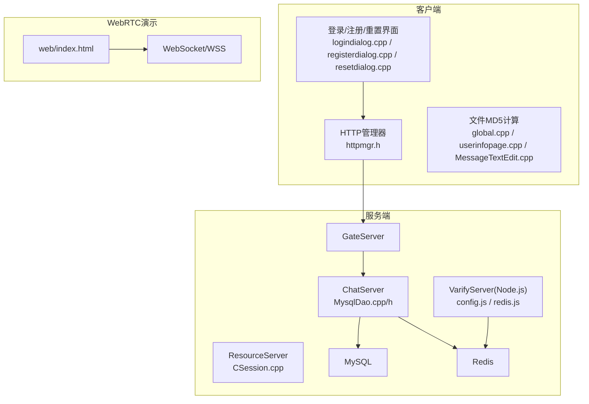
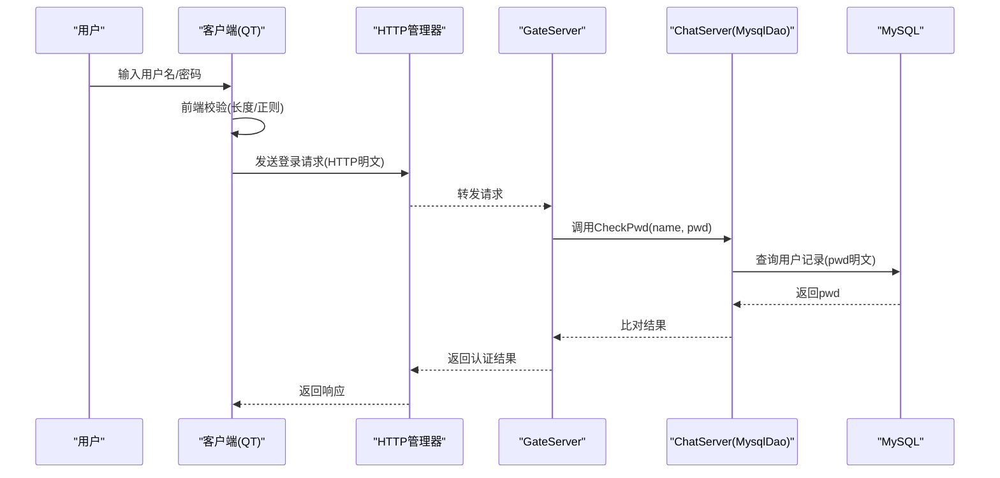
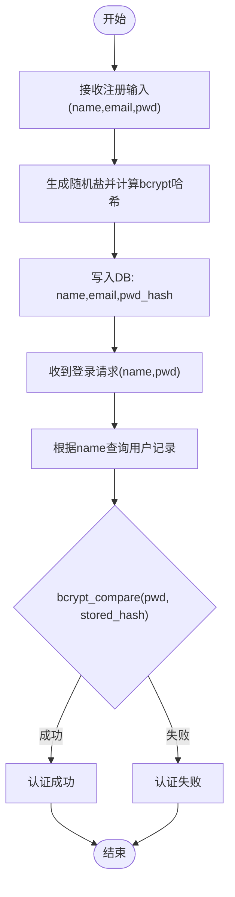
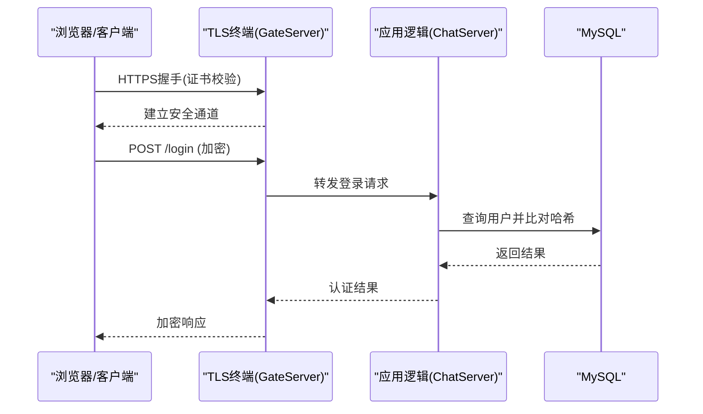
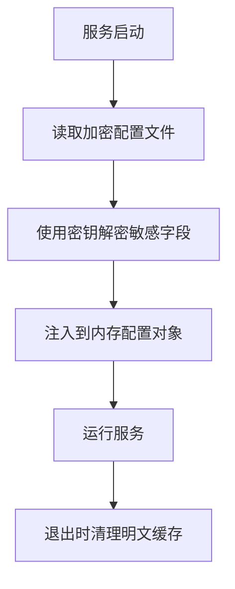
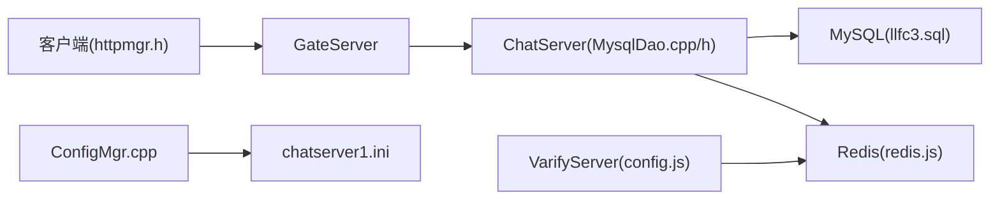

# 数据加密保护

<cite>
**本文引用的文件**   
- [README.md](file://README.md)
- [MysqlDao.h](file://server/ChatServer/include/MysqlDao.h)
- [MysqlDao.cpp](file://server/ChatServer/src/MysqlDao.cpp)
- [ConfigMgr.h](file://server/ChatServer/include/ConfigMgr.h)
- [ConfigMgr.cpp](file://server/ChatServer/src/ConfigMgr.cpp)
- [chatserver1.ini](file://server/ChatServer/config/chatserver1.ini)
- [config.ini（客户端）](file://client/llfcchat/config/config.ini)
- [httpmgr.h](file://client/llfcchat/include/httpmgr.h)
- [logindialog.cpp](file://client/llfcchat/src/logindialog.cpp)
- [registerdialog.cpp](file://client/llfcchat/src/registerdialog.cpp)
- [resetdialog.cpp](file://client/llfcchat/src/resetdialog.cpp)
- [MessageTextEdit.cpp](file://client/llfcchat/src/MessageTextEdit.cpp)
- [global.cpp](file://client/llfcchat/src/global.cpp)
- [userinfopage.cpp](file://client/llfcchat/src/userinfopage.cpp)
- [CSession.cpp](file://server/ResourceServer/src/CSession.cpp)
- [config.js（验证服务）](file://server/VarifyServer/config.js)
- [redis.js（验证服务）](file://server/VarifyServer/redis.js)
- [day08-邮箱认证服务.md](file://开发文档/day08-邮箱认证服务.md)
- [day44-webrtc信令服务器实现.md](file://开发文档/day44-webrtc信令服务器实现.md)
- [index.html（WebRTC前端）](file://webrtc-demo/web/index.html)
- [llfc3.sql](file://sql备份/llfc3.sql)
</cite>

## 目录
1. [简介](#简介)
2. [项目结构](#项目结构)
3. [核心组件](#核心组件)
4. [架构总览](#架构总览)
5. [详细组件分析](#详细组件分析)
6. [依赖关系分析](#依赖关系分析)
7. [性能考虑](#性能考虑)
8. [故障排查指南](#故障排查指南)
9. [结论](#结论)
10. [附录](#附录)

## 简介
本文件围绕LLFCChat项目的数据加密与保护进行系统化说明，覆盖以下方面：
- 密码哈希存储方案（bcrypt算法、盐值生成策略、密码验证流程）
- 数据传输加密（HTTPS配置、SSL/TLS证书管理、客户端-服务器通信加密）
- 配置文件加密存储（敏感信息如数据库连接串、API密钥的加密保存与解密访问）
- 完整加密代码示例与最佳实践
- 加密性能优化建议与常见漏洞防护

当前仓库中已存在部分安全相关实现（如MD5用于文件完整性校验、明文密码存储于数据库、HTTP明文传输等），但尚未实现密码哈希与TLS。本文将基于现有代码定位问题点，并给出可落地的改进方案与参考路径。

## 项目结构
从整体结构看，本项目包含客户端（Qt/C++）、多后端服务（C++ Gate/Chat/Resource/Status、Node.js VarifyServer）、以及WebRTC演示模块。与安全相关的代码主要分布在：
- 客户端登录/注册/重置界面与HTTP请求封装
- 服务端MySQL DAO层（用户注册、密码更新、密码校验）
- 配置管理（INI/JSON）
- WebRTC信令与服务端配置

图表来源 
- [MysqlDao.h:1-270](file://server/ChatServer/include/MysqlDao.h#L1-L270)
- [MysqlDao.cpp:1-120](file://server/ChatServer/src/MysqlDao.cpp#L1-L120)
- [httpmgr.h:1-34](file://client/llfcchat/include/httpmgr.h#L1-L34)
- [logindialog.cpp:140-188](file://client/llfcchat/src/logindialog.cpp#L140-L188)
- [registerdialog.cpp:181-262](file://client/llfcchat/src/registerdialog.cpp#L181-L262)
- [resetdialog.cpp:116-167](file://client/llfcchat/src/resetdialog.cpp#L116-L167)
- [MessageTextEdit.cpp:175-227](file://client/llfcchat/src/MessageTextEdit.cpp#L175-L227)
- [global.cpp:51-61](file://client/llfcchat/src/global.cpp#L51-L61)
- [userinfopage.cpp:202-209](file://client/llfcchat/src/userinfopage.cpp#L202-L209)
- [CSession.cpp:110-114](file://server/ResourceServer/src/CSession.cpp#L110-L114)
- [config.js（验证服务）:1-14](file://server/VarifyServer/config.js#L1-L14)
- [redis.js（验证服务）:1-48](file://server/VarifyServer/redis.js#L1-L48)
- [index.html（WebRTC前端）:67-106](file://webrtc-demo/web/index.html#L67-L106)

章节来源
- [README.md:1-112](file://README.md#L1-L112)

## 核心组件
- 用户认证与密码处理
  - 客户端输入校验（长度、正则）在登录/注册/重置对话框中完成
  - 服务端DAO提供注册、密码更新、密码校验接口
  - 当前实现为明文密码存储与比较，需迁移至bcrypt
- 网络传输
  - 客户端通过QNetworkAccessManager发起HTTP请求
  - 未启用HTTPS/TLS；WebRTC演示支持WSS
- 配置管理
  - C++侧使用INI读取（Boost.PropertyTree）
  - Node.js侧使用JSON读取（含邮箱授权码、Redis密码等）
  - 均未对敏感字段做加密存储
- 文件完整性校验
  - 客户端使用MD5计算文件哈希，用于断点续传与一致性校验

章节来源
- [logindialog.cpp:140-188](file://client/llfcchat/src/logindialog.cpp#L140-L188)
- [registerdialog.cpp:181-262](file://client/llfcchat/src/registerdialog.cpp#L181-L262)
- [resetdialog.cpp:116-167](file://client/llfcchat/src/resetdialog.cpp#L116-L167)
- [MysqlDao.cpp:19-167](file://server/ChatServer/src/MysqlDao.cpp#L19-L167)
- [httpmgr.h:1-34](file://client/llfcchat/include/httpmgr.h#L1-L34)
- [ConfigMgr.cpp:1-50](file://server/ChatServer/src/ConfigMgr.cpp#L1-L50)
- [config.js（验证服务）:1-14](file://server/VarifyServer/config.js#L1-L14)
- [MessageTextEdit.cpp:175-227](file://client/llfcchat/src/MessageTextEdit.cpp#L175-L227)
- [global.cpp:51-61](file://client/llfcchat/src/global.cpp#L51-L61)

## 架构总览
下图展示认证与数据传输的关键路径，标注了当前状态与改进点。

图表来源 
- [httpmgr.h:1-34](file://client/llfcchat/include/httpmgr.h#L1-L34)
- [MysqlDao.cpp:126-167](file://server/ChatServer/src/MysqlDao.cpp#L126-L167)
- [logindialog.cpp:175-188](file://client/llfcchat/src/logindialog.cpp#L175-L188)

章节来源
- [MysqlDao.h:236-267](file://server/ChatServer/include/MysqlDao.h#L236-L267)
- [MysqlDao.cpp:126-167](file://server/ChatServer/src/MysqlDao.cpp#L126-L167)

## 详细组件分析

### 密码哈希存储方案（bcrypt）
现状
- 注册流程：调用存储过程写入用户记录，pwd字段为明文
- 登录校验：直接比较明文pwd
- 密码更新：直接更新明文pwd

风险
- 数据库泄露即导致所有用户密码暴露
- 无法抵御彩虹表攻击
- 不符合现代安全规范

改进方案
- 服务端引入bcrypt库（C++或Node.js均可），统一在注册时生成随机盐并计算哈希
- 登录时仅比较哈希值，禁止明文比较
- 密码更新同样以bcrypt重新哈希后存储
- 数据库schema中pwd字段保留足够长度（bcrypt输出通常≥60字符）

流程图（注册/登录）

图表来源 
- [MysqlDao.cpp:19-57](file://server/ChatServer/src/MysqlDao.cpp#L19-L57)
- [MysqlDao.cpp:126-167](file://server/ChatServer/src/MysqlDao.cpp#L126-L167)
- [llfc3.sql:218-235](file://sql备份/llfc3.sql#L218-L235)

章节来源
- [MysqlDao.cpp:19-57](file://server/ChatServer/src/MysqlDao.cpp#L19-L57)
- [MysqlDao.cpp:96-124](file://server/ChatServer/src/MysqlDao.cpp#L96-L124)
- [MysqlDao.cpp:126-167](file://server/ChatServer/src/MysqlDao.cpp#L126-L167)
- [llfc3.sql:218-235](file://sql备份/llfc3.sql#L218-L235)

### 数据传输加密（HTTPS/TLS）
现状
- 客户端通过QNetworkAccessManager发起HTTP请求，未启用TLS
- WebRTC演示支持WSS（WebSocket over TLS），生产环境建议强制HTTPS/WSS

改进方案
- 在GateServer/HTTP服务层启用TLS（OpenSSL/Boost.Asio SSL）
- 客户端配置信任根证书，禁用弱协议与不安全套件
- 强制HTTPS重定向，启用HSTS（可选）
- 对敏感接口增加签名与防重放机制（时间戳+nonce）

序列图（HTTPS登录）

图表来源 
- [httpmgr.h:1-34](file://client/llfcchat/include/httpmgr.h#L1-L34)
- [day44-webrtc信令服务器实现.md:434-468](file://开发文档/day44-webrtc信令服务器实现.md#L434-L468)
- [index.html（WebRTC前端）:67-106](file://webrtc-demo/web/index.html#L67-L106)

章节来源
- [day44-webrtc信令服务器实现.md:434-468](file://开发文档/day44-webrtc信令服务器实现.md#L434-L468)
- [index.html（WebRTC前端）:67-106](file://webrtc-demo/web/index.html#L67-L106)

### 配置文件加密存储
现状
- C++侧INI文件明文存放数据库账号、Redis密码等
- Node.js侧JSON配置明文存放邮箱授权码、Redis密码等

改进方案
- 采用KMS或本地密钥管理服务（如Windows DPAPI、Linux keyring）
- 敏感字段在配置文件中以密文形式存储，启动时动态解密
- 最小权限原则：仅进程运行时持有明文，避免落盘
- 定期轮换密钥与敏感配置

流程图（配置加载）

图表来源 
- [ConfigMgr.cpp:1-50](file://server/ChatServer/src/ConfigMgr.cpp#L1-L50)
- [chatserver1.ini:14-23](file://server/ChatServer/config/chatserver1.ini#L14-L23)
- [config.js（验证服务）:1-14](file://server/VarifyServer/config.js#L1-L14)

章节来源
- [ConfigMgr.h:46-84](file://server/ChatServer/include/ConfigMgr.h#L46-L84)
- [ConfigMgr.cpp:1-50](file://server/ChatServer/src/ConfigMgr.cpp#L1-L50)
- [chatserver1.ini:14-23](file://server/ChatServer/config/chatserver1.ini#L14-L23)
- [config.js（验证服务）:1-14](file://server/VarifyServer/config.js#L1-L14)

### 文件完整性校验（MD5）
现状
- 客户端使用QCryptographicHash::Md5计算文件哈希，用于上传一致性与断点续传
- 该场景下MD5可用于完整性校验，但不应用于密码哈希

建议
- 保持MD5用于文件完整性校验
- 密码哈希必须使用bcrypt/argon2等抗碰撞且带盐算法

章节来源
- [MessageTextEdit.cpp:175-192](file://client/llfcchat/src/MessageTextEdit.cpp#L175-L192)
- [global.cpp:51-61](file://client/llfcchat/src/global.cpp#L51-L61)
- [userinfopage.cpp:202-209](file://client/llfcchat/src/userinfopage.cpp#L202-L209)

### 会话与分布式标识哈希
现状
- ResourceServer使用std::hash对session_id进行哈希以选择worker
- 该哈希用于负载均衡，非安全用途

建议
- 如需安全令牌，应使用HMAC或JWT，而非简单哈希

章节来源
- [CSession.cpp:110-114](file://server/ResourceServer/src/CSession.cpp#L110-L114)

## 依赖关系分析
- 客户端HTTP模块依赖Qt网络栈，未集成TLS
- 服务端DAO依赖MySQL JDBC驱动，负责用户CRUD与认证
- 配置管理依赖Boost.PropertyTree（INI）与文件系统
- Node.js验证服务依赖ioredis与文件系统读取JSON配置

图表来源 
- [httpmgr.h:1-34](file://client/llfcchat/include/httpmgr.h#L1-L34)
- [MysqlDao.cpp:1-120](file://server/ChatServer/src/MysqlDao.cpp#L1-L120)
- [ConfigMgr.cpp:1-50](file://server/ChatServer/src/ConfigMgr.cpp#L1-L50)
- [chatserver1.ini:14-23](file://server/ChatServer/config/chatserver1.ini#L14-L23)
- [config.js（验证服务）:1-14](file://server/VarifyServer/config.js#L1-L14)
- [redis.js（验证服务）:1-48](file://server/VarifyServer/redis.js#L1-L48)
- [llfc3.sql:218-235](file://sql备份/llfc3.sql#L218-L235)

章节来源
- [MysqlDao.h:1-270](file://server/ChatServer/include/MysqlDao.h#L1-L270)
- [ConfigMgr.h:46-84](file://server/ChatServer/include/ConfigMgr.h#L46-L84)

## 性能考虑
- bcrypt调优
  - 合理设置cost参数（例如10~12），平衡安全性与CPU开销
  - 异步处理注册/改密流程，避免阻塞主线程
- TLS握手
  - 启用会话复用、OCSP Stapling、证书链优化
  - 客户端缓存证书与会话，减少握手次数
- 配置解密
  - 仅在进程启动时解密一次，避免频繁IO与加解密
- 文件MD5
  - 分块读取，避免大文件一次性载入内存
  - 并发上传时按分片计算哈希，提升吞吐

[本节为通用指导，不直接分析具体文件]

## 故障排查指南
- 登录失败
  - 检查是否仍使用明文比较（MysqlDao::CheckPwd）
  - 确认注册流程是否正确写入bcrypt哈希
- 配置错误
  - 确认INI/JSON路径与权限正确
  - 若启用加密配置，检查密钥管理与解密逻辑
- TLS问题
  - 检查证书链与域名匹配
  - 客户端是否信任根证书
- 验证码/邮件
  - 检查Node.js配置中的邮箱授权码与Redis连通性

章节来源
- [MysqlDao.cpp:126-167](file://server/ChatServer/src/MysqlDao.cpp#L126-L167)
- [ConfigMgr.cpp:1-50](file://server/ChatServer/src/ConfigMgr.cpp#L1-L50)
- [config.js（验证服务）:1-14](file://server/VarifyServer/config.js#L1-L14)
- [redis.js（验证服务）:1-48](file://server/VarifyServer/redis.js#L1-L48)

## 结论
当前项目在密码哈希与传输加密方面存在明显安全隐患，建议优先实施：
- 全面迁移至bcrypt密码哈希存储与验证
- 启用HTTPS/TLS，确保全链路加密
- 对配置文件中的敏感信息进行加密存储与受控解密
- 保持MD5用于文件完整性校验，避免误用

以上措施将显著提升系统的安全性，降低数据泄露风险，符合现代安全最佳实践。

[本节为总结性内容，不直接分析具体文件]

## 附录
- 推荐库与工具
  - C++: Botan/OpenSSL/Bcrypt库
  - Node.js: bcryptjs、node-keytar、dotenv
  - 证书管理: Let's Encrypt、ACME自动化
- 参考实现路径
  - 注册/登录流程修改位置：MysqlDao.cpp中的RegUser与CheckPwd
  - 配置加密加载位置：ConfigMgr.cpp初始化阶段
  - TLS接入位置：GateServer/HTTP服务层（需在构建系统中启用SSL）

[本节为补充信息，不直接分析具体文件]