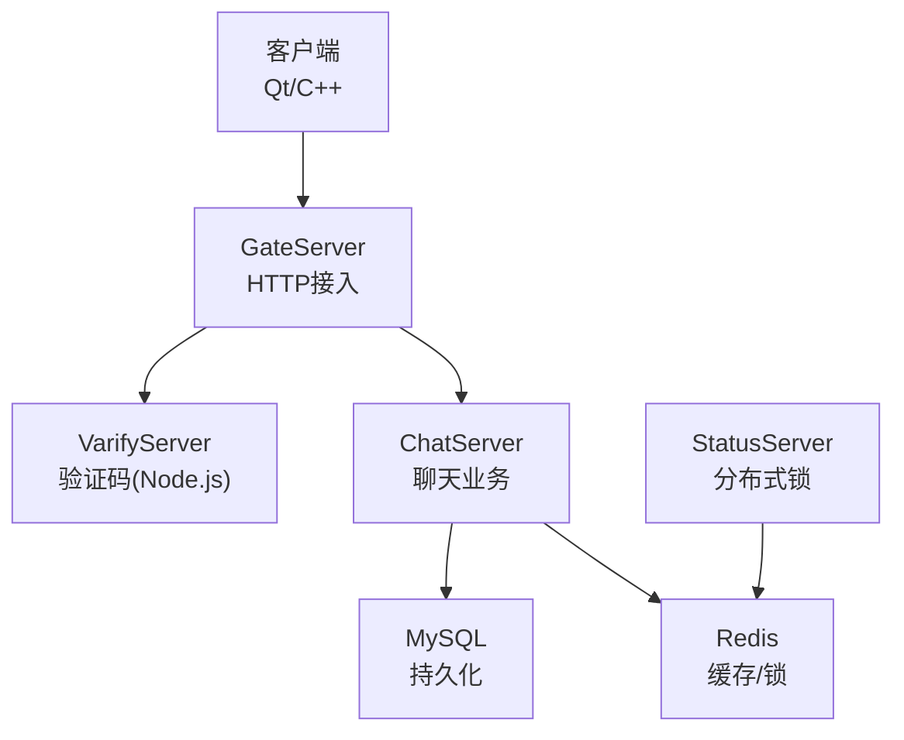
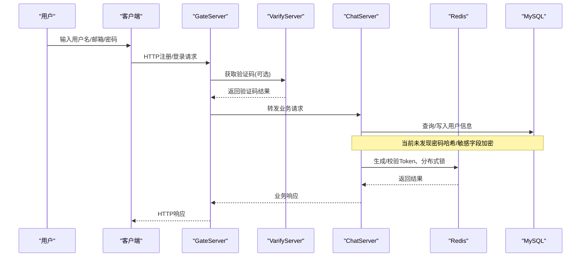
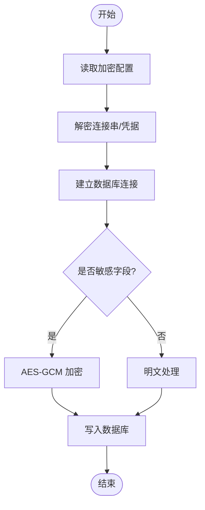
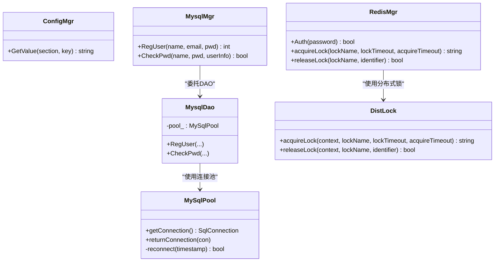

# 数据加密存储

<cite>
**本文引用的文件**   
- [MysqlMgr.h](file://server/ChatServer/include/MysqlMgr.h)
- [MysqlMgr.cpp](file://server/ChatServer/src/MysqlMgr.cpp)
- [MysqlDao.h](file://server/ChatServer/include/MysqlDao.h)
- [ConfigMgr.h](file://server/ChatServer/include/ConfigMgr.h)
- [config.ini](file://server/GateServer/config/config.ini)
- [RedisMgr.cpp](file://server/ChatServer/src/RedisMgr.cpp)
- [DistLock.cpp](file://server/StatusServer/src/DistLock.cpp)
- [logindialog.cpp](file://client/llfcchat/src/logindialog.cpp)
- [registerdialog.cpp](file://client/llfcchat/src/registerdialog.cpp)
- [resetdialog.cpp](file://client/llfcchat/src/resetdialog.cpp)
- [day11-注册功能.md](file://开发文档/day11-注册功能.md)
- [day27-分布式服务设计.md](file://开发文档/day27-分布式服务设计.md)
- [day09-redis服务搭建.md](file://开发文档/day09-redis服务搭建.md)
- [day32分布式锁设计思路.md](file://开发文档/day32分布式锁设计思路.md)
</cite>

## 目录
1. [引言](#引言)
2. [项目结构](#项目结构)
3. [核心组件](#核心组件)
4. [架构总览](#架构总览)
5. [详细组件分析](#详细组件分析)
6. [依赖关系分析](#依赖关系分析)
7. [性能考虑](#性能考虑)
8. [故障排查指南](#故障排查指南)
9. [结论](#结论)
10. [附录](#附录)

## 引言
本技术文档围绕 LLFCChat 的数据加密与敏感信息保护展开，重点覆盖：
- 密码哈希算法（bcrypt、SHA256）的选择与实现建议
- 敏感字段加密存储方案（数据库连接串、配置文件、用户口令等）
- 内存中敏感数据处理与临时文件清理策略
- 密钥管理最佳实践
- 安全强度评估与性能权衡
- 结合现有代码路径给出可落地的改进建议与示例参考

当前仓库在客户端侧实现了输入校验与HTTP交互，在服务端侧通过 MysqlDao/MySqlPool 访问 MySQL，并通过 Redis 进行会话与分布式锁。但尚未发现现成的密码哈希或敏感数据加解密实现，因此本文以“现状分析 + 改进方案”的方式提供完整落地指引。

## 项目结构
LLFCChat 采用多服务架构：
- 客户端（Qt/C++）：负责UI交互、输入校验、HTTP请求
- GateServer（C++）：接入层，处理注册、登录等HTTP请求
- ChatServer（C++）：聊天业务逻辑，访问MySQL与Redis
- StatusServer（C++）：状态服务，包含分布式锁实现
- ResourceServer（C++）：资源服务
- VarifyServer（Node.js）：验证码服务，使用Redis

图表来源
- [MysqlDao.h](file://server/ChatServer/include/MysqlDao.h)
- [MysqlMgr.h](file://server/ChatServer/include/MysqlMgr.h)
- [config.ini](file://server/GateServer/config/config.ini)
- [day27-分布式服务设计.md](file://开发文档/day27-分布式服务设计.md)

章节来源
- [MysqlMgr.h:1-41](file://server/ChatServer/include/MysqlMgr.h#L1-L41)
- [MysqlDao.h:1-270](file://server/ChatServer/include/MysqlDao.h#L1-L270)
- [config.ini:1-23](file://server/GateServer/config/config.ini#L1-L23)
- [day27-分布式服务设计.md:365-444](file://开发文档/day27-分布式服务设计.md#L365-L444)

## 核心组件
- 配置管理（ConfigMgr）：读取INI配置，当前明文存储数据库与Redis凭据
- 数据库访问（MysqlDao/MySqlPool）：连接池、健康检查、重连；未对连接串做加密
- 认证与会话（Redis）：存储用户Token、登录计数、分布式锁
- 客户端输入校验：正则校验密码格式、邮箱格式、验证码非空

章节来源
- [ConfigMgr.h:1-84](file://server/ChatServer/include/ConfigMgr.h#L1-L84)
- [MysqlDao.h:1-270](file://server/ChatServer/include/MysqlDao.h#L1-L270)
- [RedisMgr.cpp:349-402](file://server/ChatServer/src/RedisMgr.cpp#L349-L402)
- [logindialog.cpp:140-188](file://client/llfcchat/src/logindialog.cpp#L140-L188)
- [registerdialog.cpp:181-262](file://client/llfcchat/src/registerdialog.cpp#L181-L262)
- [resetdialog.cpp:116-167](file://client/llfcchat/src/resetdialog.cpp#L116-L167)

## 架构总览
下图展示从客户端到后端服务的认证与数据存储流程，并标注当前缺失的安全环节（如密码哈希、敏感字段加密）。

图表来源
- [day27-分布式服务设计.md:365-444](file://开发文档/day27-分布式服务设计.md#L365-L444)
- [MysqlMgr.cpp:1-95](file://server/ChatServer/src/MysqlMgr.cpp#L1-L95)
- [RedisMgr.cpp:349-402](file://server/ChatServer/src/RedisMgr.cpp#L349-L402)

## 详细组件分析

### 密码哈希与验证（建议方案）
现状
- 客户端仅做输入格式校验，未进行任何哈希或加密传输
- 服务端未发现密码哈希实现，疑似明文存储或简单校验

建议实现
- 使用 bcrypt（推荐）或 Argon2id 对用户密码进行单向哈希
- 每次注册时生成随机盐，计算哈希后存入数据库
- 登录时读取已存哈希，使用相同参数重新计算并与之比较
- 若必须兼容旧系统，可在迁移期支持双模式（明文迁移为bcrypt）

参考实现要点（不直接粘贴代码，仅给出路径与说明）
- 注册接口：调用哈希库生成密码哈希，写入用户表
- 登录接口：读取用户记录中的哈希值，进行比对
- 重置密码：校验验证码后，更新为新密码的哈希

章节来源
- [MysqlMgr.h:1-41](file://server/ChatServer/include/MysqlMgr.h#L1-L41)
- [MysqlMgr.cpp:1-95](file://server/ChatServer/src/MysqlMgr.cpp#L1-L95)
- [day11-注册功能.md:1-708](file://开发文档/day11-注册功能.md#L1-L708)

### 敏感字段加密存储（数据库）
现状
- 未发现对敏感字段（如邮箱、昵称、描述等）进行加密
- 数据库连接串与凭据在配置文件中明文存放

建议实现
- 对高敏感字段（如邮箱、手机号、身份证等）采用对称加密（AES-GCM）存储
- 使用独立密钥管理服务（KMS）或环境变量注入密钥，避免硬编码
- 数据库连接字符串加密：启动时解密，仅在进程内存中持有明文

流程图（概念性）

章节来源
- [MysqlDao.h:1-270](file://server/ChatServer/include/MysqlDao.h#L1-L270)
- [config.ini:1-23](file://server/GateServer/config/config.ini#L1-L23)

### 配置文件与连接串安全
现状
- INI 配置中包含数据库与Redis的Host、Port、Passwd等明文信息
- Node.js 侧 config.js 同样加载明文凭据

建议实现
- 将敏感项移出配置文件，改用环境变量或密钥管理服务
- 若必须保留配置文件，则对关键段进行加密，并在应用启动时解密
- 限制配置文件权限（Linux chmod 600），禁止普通用户读取

章节来源
- [ConfigMgr.h:1-84](file://server/ChatServer/include/ConfigMgr.h#L1-L84)
- [config.ini:1-23](file://server/GateServer/config/config.ini#L1-L23)
- [day11-注册功能.md:310-367](file://开发文档/day11-注册功能.md#L310-L367)

### 内存中敏感数据处理
建议
- 最小化敏感数据在内存中的驻留时间
- 使用不可打印字符掩码显示日志
- 及时清零/释放敏感缓冲区，避免被转储或交换到磁盘

操作要点
- 登录成功后尽快丢弃原始密码
- 临时文件（如上传头像、验证码图片）设置最短生存时间并自动清理
- 避免将敏感信息输出到控制台或日志

章节来源
- [logindialog.cpp:140-188](file://client/llfcchat/src/logindialog.cpp#L140-L188)
- [registerdialog.cpp:181-262](file://client/llfcchat/src/registerdialog.cpp#L181-L262)
- [resetdialog.cpp:116-167](file://client/llfcchat/src/resetdialog.cpp#L116-L167)

### 临时文件清理策略
建议
- 为临时目录设置定期清理任务（cron/systemd timer）
- 文件命名加入时间戳与随机后缀，便于识别与过期删除
- 下载/上传完成后立即删除中间文件，必要时使用内存映射减少落盘

章节来源
- [day11-注册功能.md:310-367](file://开发文档/day11-注册功能.md#L310-L367)

### 密钥管理最佳实践
建议
- 使用专用密钥管理服务（如 HashiCorp Vault、云厂商KMS）
- 密钥按环境隔离（dev/staging/prod），最小权限原则
- 定期轮换密钥，支持灰度切换与回滚
- 禁止在代码与配置中硬编码密钥

章节来源
- [config.ini:1-23](file://server/GateServer/config/config.ini#L1-L23)
- [day11-注册功能.md:310-367](file://开发文档/day11-注册功能.md#L310-L367)

### 分布式锁与Redis安全
现状
- 使用 Redis 作为分布式锁与会话存储
- 存在 AUTH 认证与心跳机制

建议
- 启用 Redis TLS 与强密码
- 限制网络访问白名单
- 对敏感键名与值进行脱敏或加密

章节来源
- [day09-redis服务搭建.md:433-477](file://开发文档/day09-redis服务搭建.md#L433-L477)
- [day32分布式锁设计思路.md:95-479](file://开发文档/day32分布式锁设计思路.md#L95-L479)
- [DistLock.cpp:36-62](file://server/StatusServer/src/DistLock.cpp#L36-L62)

## 依赖关系分析
- ConfigMgr 负责读取INI配置，当前未对敏感项做加密
- MysqlDao/MySqlPool 负责数据库连接池与健康检查
- RedisMgr 封装Redis操作，包括认证、锁、计数
- DistLock 基于 Redis Lua 脚本实现原子性加锁/解锁

图表来源
- [ConfigMgr.h:1-84](file://server/ChatServer/include/ConfigMgr.h#L1-L84)
- [MysqlMgr.h:1-41](file://server/ChatServer/include/MysqlMgr.h#L1-L41)
- [MysqlDao.h:1-270](file://server/ChatServer/include/MysqlDao.h#L1-L270)
- [RedisMgr.cpp:349-402](file://server/ChatServer/src/RedisMgr.cpp#L349-L402)
- [DistLock.cpp:36-62](file://server/StatusServer/src/DistLock.cpp#L36-L62)

章节来源
- [MysqlMgr.h:1-41](file://server/ChatServer/include/MysqlMgr.h#L1-L41)
- [MysqlDao.h:1-270](file://server/ChatServer/include/MysqlDao.h#L1-L270)
- [RedisMgr.cpp:349-402](file://server/ChatServer/src/RedisMgr.cpp#L349-L402)
- [DistLock.cpp:36-62](file://server/StatusServer/src/DistLock.cpp#L36-L62)

## 性能考虑
- 密码哈希：bcrypt 成本因子需根据硬件调优，避免过高的CPU开销影响登录吞吐
- 数据库连接池：合理设置池大小与超时，避免频繁创建/销毁连接
- Redis：连接复用与命令批处理，降低网络往返
- 敏感字段加密：选择硬件加速（AES-NI）与高效库，控制延迟

[本节为通用指导，无需特定文件引用]

## 故障排查指南
常见问题与建议
- 数据库连接失败：检查连接串、权限、防火墙；查看连接池健康检查日志
- Redis认证失败：核对密码、端口、网络连通性；确认AUTH命令返回值
- 分布式锁异常：检查Lua脚本执行结果、锁ID一致性、过期时间设置
- 登录失败：确认密码哈希算法一致、盐值正确、数据库记录存在

章节来源
- [MysqlDao.h:1-270](file://server/ChatServer/include/MysqlDao.h#L1-L270)
- [day09-redis服务搭建.md:433-477](file://开发文档/day09-redis服务搭建.md#L433-L477)
- [day32分布式锁设计思路.md:95-479](file://开发文档/day32分布式锁设计思路.md#L95-L479)

## 结论
当前 LLFCChat 在输入校验与基础通信方面较为完善，但在密码哈希、敏感字段加密、配置与密钥管理方面尚缺实现。建议优先引入 bcrypt/Argon2id 进行密码哈希，采用 AES-GCM 对敏感字段加密，并将配置与密钥迁移至安全的环境变量或KMS。同时完善内存与临时文件的安全策略，确保端到端的数据安全。

[本节为总结性内容，无需特定文件引用]

## 附录
- 安全强度评估要点
  - 密码哈希：抗彩虹表、抗GPU破解、可调成本因子
  - 对称加密：AES-GCM 提供机密性与完整性
  - 密钥管理：轮换、最小权限、审计
- 参考实现路径（不直接粘贴代码）
  - 注册：调用哈希库生成密码哈希，写入用户表
  - 登录：读取哈希值进行比对
  - 重置：校验验证码后更新为新密码哈希
  - 配置：启动时解密连接串，仅内存持有明文
  - 临时文件：定时清理，缩短生命周期

[本节为补充信息，无需特定文件引用]