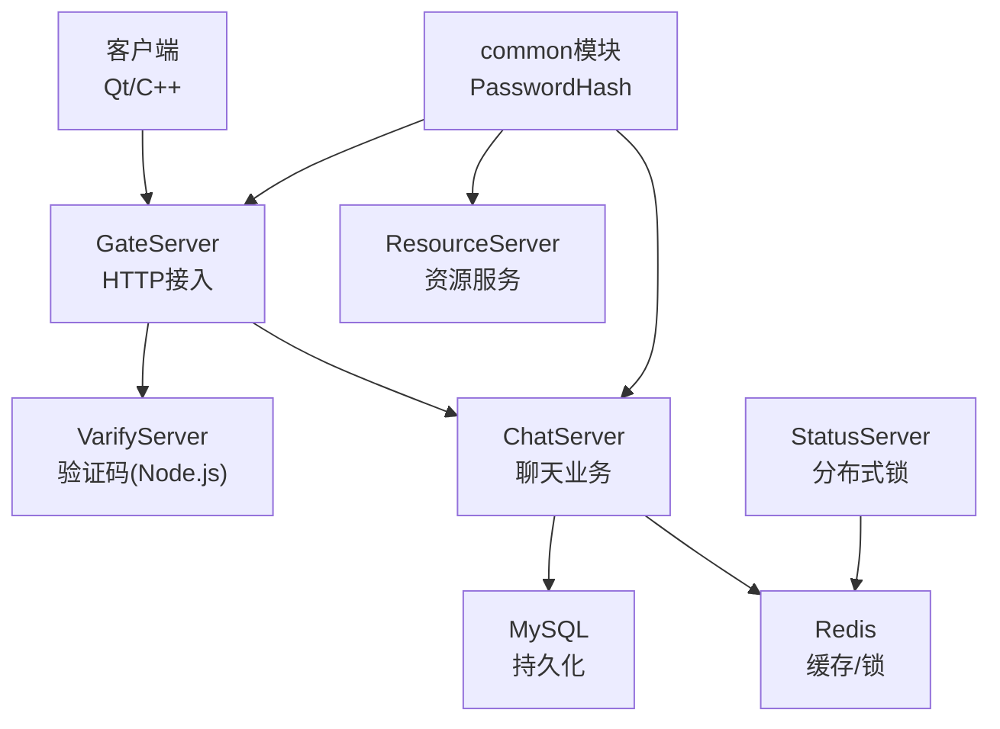
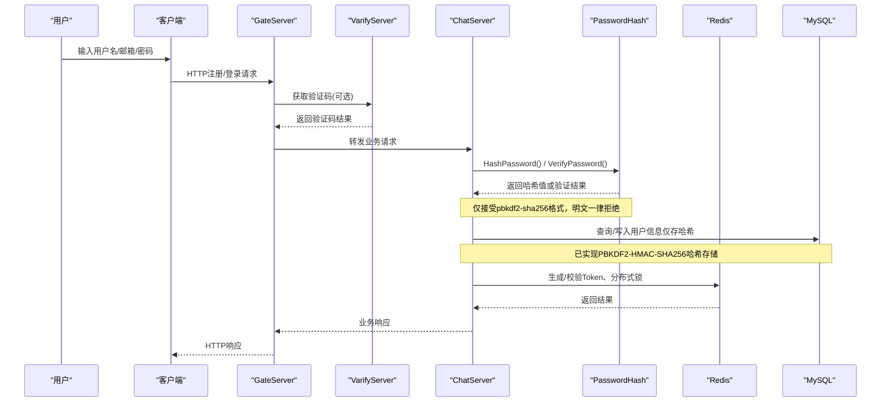
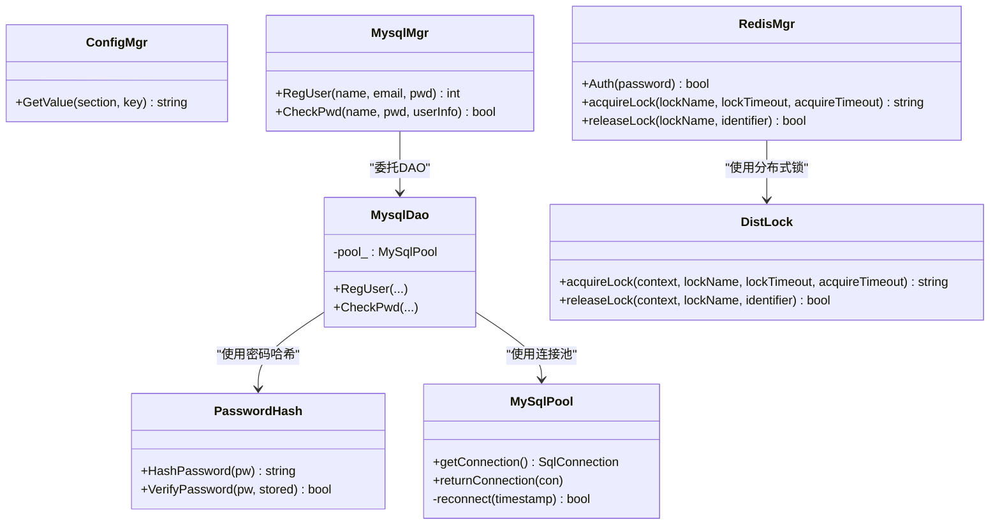

# 数据加密存储

<cite>
**本文引用的文件**   
- [PasswordHash.h](file://server/common/include/PasswordHash.h)
- [PasswordHash.cpp](file://server/common/src/PasswordHash.cpp)
- [MysqlDao.cpp (ChatServer)](file://server/ChatServer/src/MysqlDao.cpp)
- [MysqlDao.cpp (GateServer)](file://server/GateServer/src/MysqlDao.cpp)
- [MysqlDao.cpp (ResourceServer)](file://server/ResourceServer/src/MysqlDao.cpp)
- [password_hash_tests.cpp](file://tests/password_hash_tests.cpp)
- [20260804_pwd_pbkdf2.sql](file://sql备份/20260804_pwd_pbkdf2.sql)
- [MysqlMgr.h](file://server/ChatServer/include/MysqlMgr.h)
- [MysqlMgr.cpp](file://server/ChatServer/src/MysqlMgr.cpp)
- [MysqlDao.h](file://server/ChatServer/include/MysqlDao.h)
- [ConfigMgr.h](file://server/ChatServer/include/ConfigMgr.h)
- [config.ini](file://server/GateServer/config/config.ini)
- [RedisMgr.cpp](file://server/ChatServer/src/RedisMgr.cpp)
- [DistLock.cpp](file://server/StatusServer/src/DistLock.cpp)
- [logindialog.cpp](file://client/llfcchat/src/logindialog.cpp)
- [registerdialog.cpp](file://client/llfcchat/src/registerdialog.cpp)
- [resetdialog.cpp](file://client/llfcchat/src/resetdialog.cpp)
- [day11-注册功能.md](file://开发文档/day11-注册功能.md)
- [day27-分布式服务设计.md](file://开发文档/day27-分布式服务设计.md)
- [day09-redis服务搭建.md](file://开发文档/day09-redis服务搭建.md)
- [day32分布式锁设计思路.md](file://开发文档/day32分布式锁设计思路.md)
</cite>

## 更新摘要
**所做更改**   
- 移除了向后兼容性说明和明文密码支持
- 删除了ShouldRehash相关的安全特性描述
- 更新了密码验证逻辑为硬切换模式
- 简化了密码迁移策略，不再支持平滑迁移
- 更新了测试用例以反映新的安全要求

## 目录
1. [引言](#引言)
2. [项目结构](#项目结构)
3. [核心组件](#核心组件)
4. [架构总览](#架构总览)
5. [详细组件分析](#详细组件分析)
6. [依赖关系分析](#依赖关系分析)
7. [性能考虑](#性能考虑)
8. [故障排查指南](#故障排查指南)
9. [结论](#结论)
10. [附录](#附录)

## 引言
本技术文档围绕 LLFCChat 的数据加密与敏感信息保护展开，重点覆盖：
- **已实现**：PBKDF2-HMAC-SHA256密码哈希算法（OpenSSL实现）
- **已实现**：PasswordHash模块在所有服务中的集成
- **已实现**：安全的密码存储机制，采用硬切换模式
- **建议实现**：敏感字段加密存储方案（数据库连接串、配置文件等）
- **建议实现**：内存中敏感数据处理与临时文件清理策略
- **建议实现**：密钥管理最佳实践
- **安全强度评估**与性能权衡
- **结合现有代码路径**给出可落地的改进建议与示例参考

当前仓库已实现完整的PBKDF2-HMAC-SHA256密码哈希系统，并在所有服务中集成，采用硬切换模式，不再支持明文密码的平滑迁移。

## 项目结构
LLFCChat 采用多服务架构，现已集成统一的密码哈希模块：
- 客户端（Qt/C++）：负责UI交互、输入校验、HTTP请求
- GateServer（C++）：接入层，处理注册、登录等HTTP请求
- ChatServer（C++）：聊天业务逻辑，访问MySQL与Redis
- StatusServer（C++）：状态服务，包含分布式锁实现
- ResourceServer（C++）：资源服务
- VarifyServer（Node.js）：验证码服务，使用Redis
- **common模块**：提供PasswordHash等通用安全功能



**图表来源**
- [PasswordHash.h:1-28](file://server/common/include/PasswordHash.h#L1-L28)
- [MysqlDao.cpp (ChatServer):160-178](file://server/ChatServer/src/MysqlDao.cpp#L160-L178)
- [MysqlDao.cpp (GateServer):270-282](file://server/GateServer/src/MysqlDao.cpp#L270-L282)
- [MysqlDao.cpp (ResourceServer):164-178](file://server/ResourceServer/src/MysqlDao.cpp#L164-L178)

## 核心组件
- **PasswordHash模块**：基于OpenSSL的PBKDF2-HMAC-SHA256实现，提供安全的密码哈希和验证
- **配置管理（ConfigMgr）**：读取INI配置，当前明文存储数据库与Redis凭据
- **数据库访问（MysqlDao/MySqlPool）**：连接池、健康检查、重连；已集成密码哈希
- **认证与会话（Redis）**：存储用户Token、登录计数、分布式锁
- **客户端输入校验**：正则校验密码格式、邮箱格式、验证码非空

**章节来源**
- [PasswordHash.h:1-28](file://server/common/include/PasswordHash.h#L1-L28)
- [PasswordHash.cpp:1-128](file://server/common/src/PasswordHash.cpp#L1-L128)
- [MysqlDao.h:1-270](file://server/ChatServer/include/MysqlDao.h#L1-L270)
- [RedisMgr.cpp:349-402](file://server/ChatServer/src/RedisMgr.cpp#L349-L402)

## 架构总览
下图展示从客户端到后端服务的认证与数据存储流程，现已完整实现PBKDF2-HMAC-SHA256密码哈希，采用硬切换模式：



**图表来源**
- [PasswordHash.cpp:117-125](file://server/common/src/PasswordHash.cpp#L117-L125)
- [MysqlDao.cpp (ChatServer):163-171](file://server/ChatServer/src/MysqlDao.cpp#L163-L171)
- [MysqlDao.cpp (GateServer):270-275](file://server/GateServer/src/MysqlDao.cpp#L270-L275)

## 详细组件分析

### PBKDF2-HMAC-SHA256密码哈希实现（已实现）

#### 核心特性
- **算法选择**：PBKDF2-HMAC-SHA256，符合OWASP推荐标准
- **迭代次数**：600,000次（可根据硬件性能调整）
- **盐值长度**：16字节随机数（OpenSSL RAND_bytes生成）
- **派生密钥长度**：32字节（256位）
- **自描述格式**：`pbkdf2-sha256$i=<iter>$<salt_hex>$<dk_hex>`

#### 实现细节
```cpp
// 核心函数接口
std::string HashPassword(const std::string& pw);        // 生成密码哈希
bool VerifyPassword(const std::string& pw, const std::string& stored);  // 验证密码
```

#### 硬切换模式
- **严格格式验证**：VerifyPassword只接受pbkdf2-sha256格式
- **明文拒绝**：非pbkdf2格式的密码（包括明文）一律返回false
- **无自动迁移**：不再支持ShouldRehash和渐进式迁移
- **预转换要求**：所有存量密码必须预先转换为PBKDF2-SHA256格式

**章节来源**
- [PasswordHash.h:15-25](file://server/common/include/PasswordHash.h#L15-L25)
- [PasswordHash.cpp:117-125](file://server/common/src/PasswordHash.cpp#L117-L125)

### 服务集成状态（已实现）

#### ChatServer集成
```cpp
// 注册时哈希密码
const std::string hashed = llfc::HashPassword(pwd);
if (hashed.empty()) {
    pool_->returnConnection(std::move(con));
    return -1;
}
stmt->setString(3, hashed); // 只存储哈希

// 登录时验证密码 - 硬切换模式
if (!llfc::VerifyPassword(pwd, origin_pwd)) {
    return false;
}
// 注意：不再有ShouldRehash逻辑，明文密码直接失败
```

#### GateServer和ResourceServer集成
两个服务均采用相同的集成模式，确保整个系统的密码安全性一致。

**章节来源**
- [MysqlDao.cpp (ChatServer):28-34](file://server/ChatServer/src/MysqlDao.cpp#L28-L34)
- [MysqlDao.cpp (ChatServer):163-171](file://server/ChatServer/src/MysqlDao.cpp#L163-L171)
- [MysqlDao.cpp (GateServer):270-275](file://server/GateServer/src/MysqlDao.cpp#L270-L275)
- [MysqlDao.cpp (ResourceServer):164-171](file://server/ResourceServer/src/MysqlDao.cpp#L164-L171)

### 数据库迁移策略（已实现）

#### 迁移脚本
```sql
-- 将pwd列改为大小写敏感排序规则
ALTER TABLE `user`
  MODIFY `pwd` VARCHAR(255) CHARACTER SET utf8mb4 COLLATE utf8mb4_bin NOT NULL DEFAULT '';
```

#### 迁移特点
- **预防性加固**：防止未来SQL直接比较pwd时的安全问题
- **字符集保持**：保持utf8mb4以支持非ASCII字符
- **低峰期执行**：ALTER TABLE会重建表，建议在维护窗口执行
- **硬切换要求**：所有存量密码必须预先转换为PBKDF2格式

**章节来源**
- [20260804_pwd_pbkdf2.sql:1-15](file://sql备份/20260804_pwd_pbkdf2.sql#L1-L15)

### 单元测试验证（已实现）

#### 测试覆盖范围
- **基本功能**：哈希生成、验证、错误处理
- **边界情况**：空字符串、非法格式、负数迭代次数
- **二进制密码**：支持包含特殊字符的密码
- **安全性**：常量时间比较、随机盐值
- **格式拒绝**：明文密码和非pbkdf2格式被正确拒绝

#### 测试结果示例
```
[PASS] HashPassword produced a non-empty value
[PASS] round-trip HashPassword->VerifyPassword  
[PASS] wrong password rejected
[PASS] empty stored rejected
[PASS] bad salt hex rejected
[PASS] negative iter rejected
all password_hash tests passed
```

**章节来源**
- [password_hash_tests.cpp:25-59](file://tests/password_hash_tests.cpp#L25-L59)

### 敏感字段加密存储（建议实现）

#### 现状分析
- 密码字段已通过PBKDF2-HMAC-SHA256保护
- 其他敏感字段（邮箱、手机号、身份证等）仍为明文存储
- 数据库连接串与凭据在配置文件中明文存放

#### 建议实现方案
- **对称加密**：对高敏感字段采用AES-GCM存储
- **密钥管理**：使用独立密钥管理服务（KMS）或环境变量注入
- **连接串加密**：启动时解密，仅在进程内存中持有明文

**章节来源**
- [MysqlDao.h:1-270](file://server/ChatServer/include/MysqlDao.h#L1-L270)
- [config.ini:1-23](file://server/GateServer/config/config.ini#L1-L23)

### 配置文件与连接串安全（建议实现）

#### 现状
- INI配置中包含数据库与Redis的Host、Port、Passwd等明文信息
- Node.js侧config.js同样加载明文凭据

#### 建议改进
- **环境变量**：将敏感项移出配置文件，改用环境变量
- **配置文件加密**：若必须保留配置文件，则对关键段进行加密
- **权限控制**：限制配置文件权限（Linux chmod 600）

**章节来源**
- [ConfigMgr.h:1-84](file://server/ChatServer/include/ConfigMgr.h#L1-L84)
- [config.ini:1-23](file://server/GateServer/config/config.ini#L1-L23)

### 内存中敏感数据处理（建议实现）

#### 最佳实践
- **最小化驻留时间**：登录成功后尽快丢弃原始密码
- **日志脱敏**：使用不可打印字符掩码显示日志
- **缓冲区清零**：及时清零/释放敏感缓冲区
- **临时文件清理**：设置最短生存时间并自动清理

**章节来源**
- [logindialog.cpp:140-188](file://client/llfcchat/src/logindialog.cpp#L140-L188)
- [registerdialog.cpp:181-262](file://client/llfcchat/src/registerdialog.cpp#L181-L262)

### 临时文件清理策略（建议实现）

#### 清理机制
- **定期任务**：cron/systemd timer定时清理
- **命名规范**：时间戳+随机后缀便于识别
- **即时删除**：下载/上传完成后立即删除中间文件
- **内存映射**：必要时使用内存映射减少落盘

**章节来源**
- [day11-注册功能.md:310-367](file://开发文档/day11-注册功能.md#L310-L367)

### 密钥管理最佳实践（建议实现）

#### 管理策略
- **专用服务**：使用HashiCorp Vault或云厂商KMS
- **环境隔离**：dev/staging/prod环境密钥分离
- **权限控制**：最小权限原则
- **定期轮换**：支持灰度切换与回滚
- **禁止硬编码**：不在代码与配置中硬编码密钥

**章节来源**
- [config.ini:1-23](file://server/GateServer/config/config.ini#L1-L23)

### 分布式锁与Redis安全（已实现）

#### 现状
- 使用Redis作为分布式锁与会话存储
- 存在AUTH认证与心跳机制

#### 安全建议
- **TLS加密**：启用Redis TLS与强密码
- **网络白名单**：限制网络访问
- **数据脱敏**：对敏感键名与值进行脱敏或加密

**章节来源**
- [day09-redis服务搭建.md:433-477](file://开发文档/day09-redis服务搭建.md#L433-L477)
- [day32分布式锁设计思路.md:95-479](file://开发文档/day32分布式锁设计思路.md#L95-L479)
- [DistLock.cpp:36-62](file://server/StatusServer/src/DistLock.cpp#L36-L62)

## 依赖关系分析



**图表来源**
- [PasswordHash.h:1-28](file://server/common/include/PasswordHash.h#L1-L28)
- [ConfigMgr.h:1-84](file://server/ChatServer/include/ConfigMgr.h#L1-L84)
- [MysqlMgr.h:1-41](file://server/ChatServer/include/MysqlMgr.h#L1-L41)
- [MysqlDao.h:1-270](file://server/ChatServer/include/MysqlDao.h#L1-L270)
- [RedisMgr.cpp:349-402](file://server/ChatServer/src/RedisMgr.cpp#L349-L402)
- [DistLock.cpp:36-62](file://server/StatusServer/src/DistLock.cpp#L36-L62)

**章节来源**
- [PasswordHash.h:1-28](file://server/common/include/PasswordHash.h#L1-L28)
- [MysqlMgr.h:1-41](file://server/ChatServer/include/MysqlMgr.h#L1-L41)
- [MysqlDao.h:1-270](file://server/ChatServer/include/MysqlDao.h#L1-L270)
- [RedisMgr.cpp:349-402](file://server/ChatServer/src/RedisMgr.cpp#L349-L402)
- [DistLock.cpp:36-62](file://server/StatusServer/src/DistLock.cpp#L36-L62)

## 性能考虑

### PBKDF2-HMAC-SHA256性能优化
- **迭代次数调优**：600,000次迭代在主流硬件上约需1秒，可根据服务器性能调整
- **硬件加速**：OpenSSL利用CPU指令集优化SHA256计算
- **内存使用**：每个哈希操作约需几十字节内存
- **并发处理**：Worker线程池避免阻塞主循环

### 整体性能影响
- **注册延迟**：增加约1秒的哈希计算时间
- **登录延迟**：验证过程与注册类似
- **存储开销**：哈希字符串约128字节，比明文稍大
- **迁移成本**：硬切换模式下无需迁移，但需要预先转换存量密码

## 故障排查指南

### PBKDF2相关常见问题
- **哈希生成失败**：检查OpenSSL初始化、RAND_bytes调用
- **验证失败**：确认迭代次数一致、盐值格式正确
- **性能问题**：调整kPbkdf2Iterations参数
- **内存泄漏**：检查向量对象的生命周期管理
- **明文密码失败**：确认所有存量密码已转换为PBKDF2格式

### 数据库相关问题
- **连接失败**：检查连接串、权限、防火墙
- **认证失败**：核对密码、端口、网络连通性
- **分布式锁异常**：检查Lua脚本执行结果、锁ID一致性

### 迁移相关问题
- **硬切换要求**：VerifyPassword不再支持明文密码
- **格式错误**：检查哈希字符串格式是否符合规范
- **存量密码处理**：需要预先批量转换所有明文密码

**章节来源**
- [MysqlDao.h:1-270](file://server/ChatServer/include/MysqlDao.h#L1-L270)
- [day09-redis服务搭建.md:433-477](file://开发文档/day09-redis服务搭建.md#L433-L477)
- [day32分布式锁设计思路.md:95-479](file://开发文档/day32分布式锁设计思路.md#L95-L479)

## 结论
LLFCChat已成功实现完整的PBKDF2-HMAC-SHA256密码哈希系统，具有以下优势：

### 已实现的安全特性
- **强密码哈希**：采用业界标准的PBKDF2-HMAC-SHA256算法
- **硬切换模式**：不再支持明文密码，提高整体安全性
- **统一实现**：PasswordHash模块在所有服务中集成
- **严格验证**：VerifyPassword只接受pbkdf2-sha256格式
- **完整测试**：覆盖各种边界情况和安全性测试

### 待改进的安全措施
- **敏感字段加密**：对其他敏感数据实施对称加密
- **配置安全**：将敏感配置移至环境变量或KMS
- **内存安全**：加强敏感数据的内存管理
- **密钥管理**：建立完善的密钥轮换和管理机制

建议优先实施敏感字段加密和配置安全管理，进一步完善端到端的数据安全保障。

## 附录

### 安全强度评估要点
- **密码哈希**：抗彩虹表、抗GPU破解、可调成本因子
- **算法选择**：PBKDF2-HMAC-SHA256符合OWASP推荐标准
- **盐值质量**：16字节随机数，使用OpenSSL CSPRNG
- **常量时间比较**：防止时序攻击
- **硬切换模式**：不再支持明文密码，提高安全性

### 参考实现路径
- **密码哈希**：使用llfc::HashPassword()生成哈希
- **密码验证**：使用llfc::VerifyPassword()进行验证
- **数据库存储**：只存储哈希字符串，不存储明文
- **配置管理**：逐步迁移敏感配置到环境变量

### 性能基准参考
- **单次哈希**：约1秒（600,000次迭代）
- **内存占用**：每哈希约几十字节
- **存储大小**：哈希字符串约128字节
- **CPU开销**：现代CPU可并行处理多个哈希操作

### 迁移注意事项
- **硬切换要求**：所有存量密码必须预先转换为PBKDF2-SHA256格式
- **用户影响**：明文密码用户将无法登录，需要通过重置密码功能
- **批量转换**：建议使用专门的工具或脚本批量转换存量密码
- **回滚计划**：准备回滚方案以应对转换失败的情况

[本节为补充信息，无需特定文件引用]