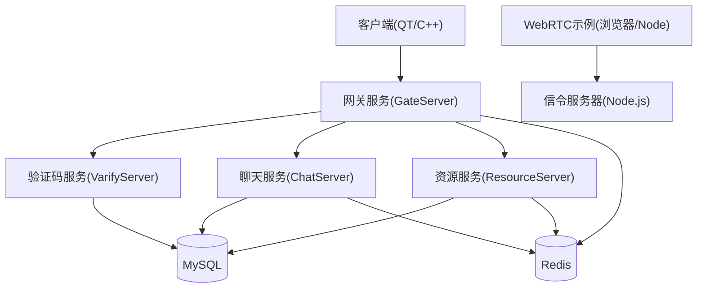
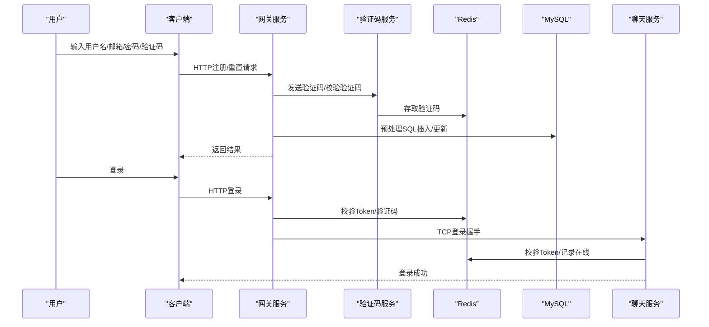
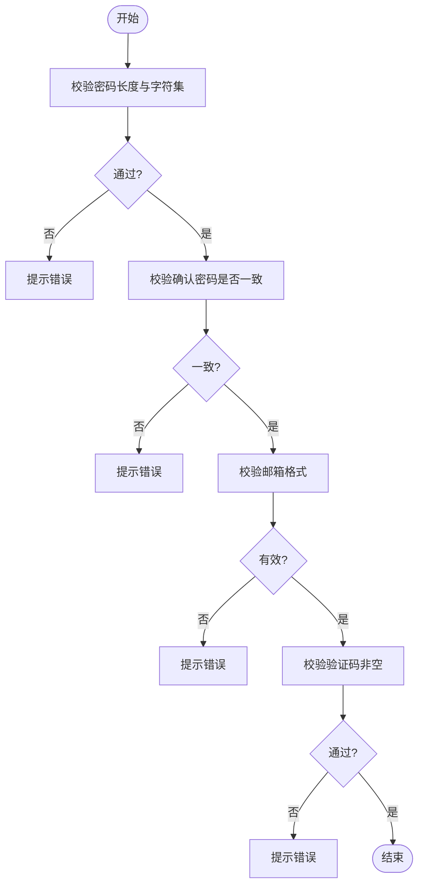
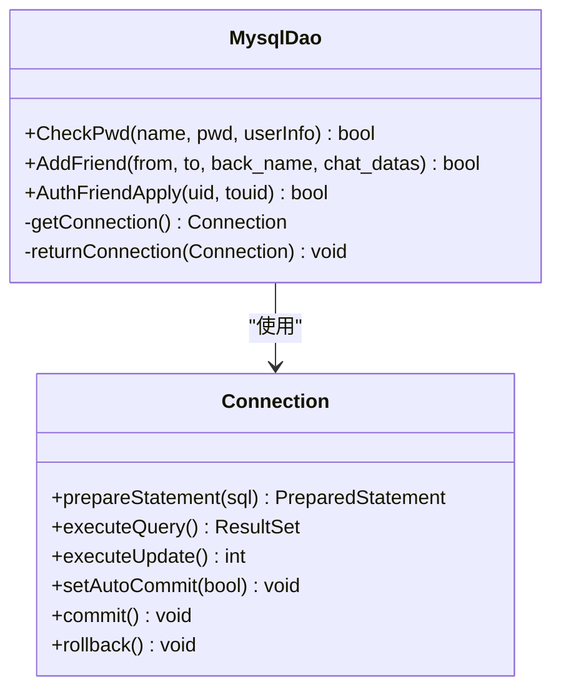
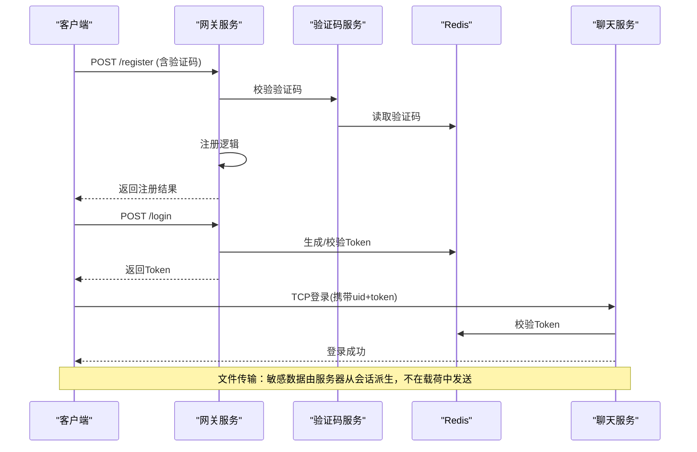
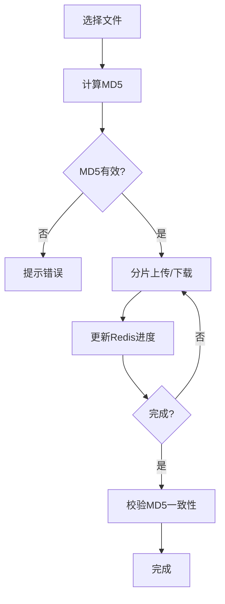
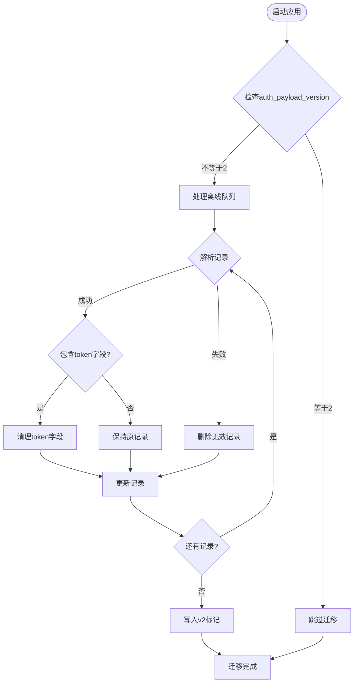
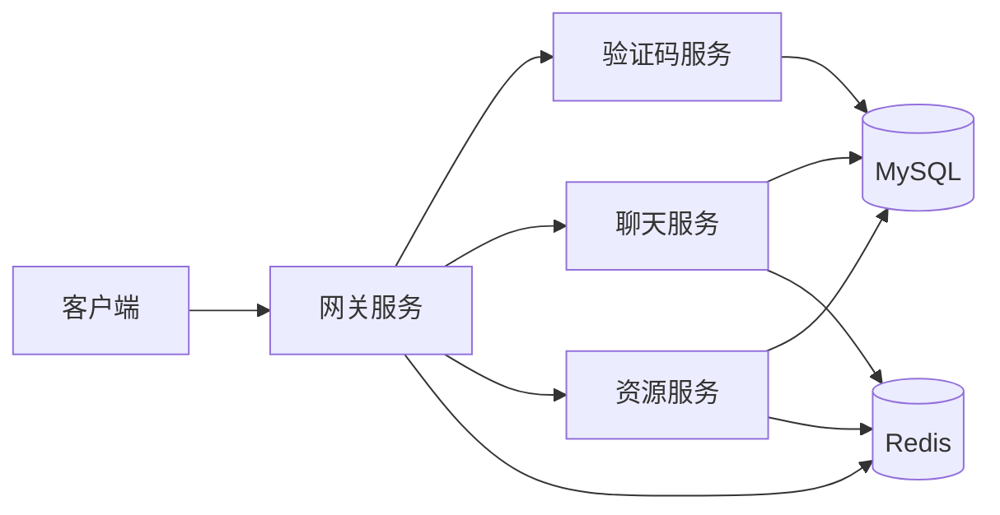

# 数据安全保护

<cite>
**本文引用的文件**   
- [README.md](file://README.md)
- [client/llfcchat/config/config.ini](file://client/llfcchat/config/config.ini)
- [server/GateServer/config/config.ini](file://server/GateServer/config/config.ini)
- [server/VarifyServer/config.js](file://server/VarifyServer/config.js)
- [server/VarifyServer/package.json](file://server/VarifyServer/package.json)
- [sql备份/llfc.sql](file://sql备份/llfc.sql)
- [server/GateServer/src/MysqlDao.cpp](file://server/GateServer/src/MysqlDao.cpp)
- [server/ChatServer/src/MysqlDao.cpp](file://server/ChatServer/src/MysqlDao.cpp)
- [server/ResourceServer/src/MysqlDao.cpp](file://server/ResourceServer/src/MysqlDao.cpp)
- [server/GateServer/src/LogicSystem.cpp](file://server/GateServer/src/LogicSystem.cpp)
- [开发文档/day13-重置界面.md](file://开发文档/day13-重置界面.md)
- [开发文档/day27-分布式服务设计.md](file://开发文档/day27-分布式服务设计.md)
- [开发文档/day41-分布式死锁解决方案.md](file://开发文档/day41-分布式死锁解决方案.md)
- [webrtc-demo/web/index.html](file://webrtc-demo/web/index.html)
- [webrtc-demo/server/package-lock.json](file://webrtc-demo/server/package-lock.json)
- [server/ResourceServer/src/base64.cpp](file://server/ResourceServer/src/base64.cpp)
- [server/ResourceServer/src/FileWorker.cpp](file://server/ResourceServer/src/FileWorker.cpp)
- [client/llfcchat/src/logindialog.cpp](file://client/llfcchat/src/logindialog.cpp)
- [client/llfcchat/src/registerdialog.cpp](file://client/llfcchat/src/registerdialog.cpp)
- [client/llfcchat/src/resetdialog.cpp](file://client/llfcchat/src/resetdialog.cpp)
- [client/llfcchat/src/MessageTextEdit.cpp](file://client/llfcchat/src/MessageTextEdit.cpp)
- [client/llfcchat/include/tcpmgr.h](file://client/llfcchat/include/tcpmgr.h)
- [client/llfcchat/src/tcpmgr.cpp](file://client/llfcchat/src/tcpmgr.cpp)
- [client/llfcchat/src/filetcpmgr.cpp](file://client/llfcchat/src/filetcpmgr.cpp)
</cite>

## 更新摘要
**变更内容**   
- 新增文件传输安全改进：敏感数据不再在传输载荷中发送，由服务器端从已认证会话派生
- 新增迁移函数sanitizeLegacyDeliverySettings()处理旧QSettings数据清理
- 更新传输加密与会话鉴权章节，反映新的安全机制
- 增强数据备份与恢复章节，包含向后兼容性说明

## 目录
1. [引言](#引言)
2. [项目结构](#项目结构)
3. [核心组件](#核心组件)
4. [架构总览](#架构总览)
5. [详细组件分析](#详细组件分析)
6. [依赖关系分析](#依赖关系分析)
7. [性能与安全权衡](#性能与安全权衡)
8. [故障排查指南](#故障排查指南)
9. [结论](#结论)
10. [附录：安全编码与测试清单](#附录安全编码与测试清单)

## 引言
本文件面向LLFCChat项目的数据安全保护，覆盖敏感数据加密存储、传输加密、密钥管理、SQL注入防护、XSS防护、输入验证、数据库连接安全、配置文件保护、日志脱敏、数据备份恢复、完整性校验、隐私保护措施、HTTPS配置、SSL证书管理与网络安全最佳实践。文档基于仓库现有实现进行分析，并给出改进建议与落地方案。

**最新更新**：文件传输操作的安全机制已显著改进，敏感数据（token, uid, sender_id字段）不再在传输载荷中发送，这些字段现在由服务器端从已认证的会话派生，大幅提升了数据传输安全性。

## 项目结构
- 客户端（Qt/C++）：负责用户交互、HTTP/TCP通信、输入校验、本地资源处理等。
- 网关服务（GateServer，C++）：对外暴露HTTP接口，协调验证码、注册、重置密码等业务。
- 聊天服务（ChatServer，C++）：处理好友认证、会话路由、消息转发等。
- 资源服务（ResourceServer，C++）：文件上传下载、Base64编解码、断点续传等。
- 状态服务（StatusServer，C++）：状态查询与统计。
- 验证码服务（VarifyServer，Node.js）：邮箱验证码派发、Redis缓存、MySQL校验。
- 数据库与缓存：MySQL（结构化数据）、Redis（验证码、Token、在线信息）。
- WebRTC信令示例：演示WebSocket信令和TURN/STUN配置。

**图表来源**
- [server/GateServer/config/config.ini](file://server/GateServer/config/config.ini)
- [server/VarifyServer/config.js](file://server/VarifyServer/config.js)
- [webrtc-demo/web/index.html](file://webrtc-demo/web/index.html)

**章节来源**
- [README.md](file://README.md)

## 核心组件
- 输入验证与前端安全：登录/注册/重置界面的密码长度与字符集校验、邮箱格式校验、验证码非空校验。
- 数据库访问层：使用预处理语句（PreparedStatement）避免SQL注入；事务控制保证一致性。
- 会话与鉴权：Redis中存储验证码与用户Token，登录成功后绑定Session与UID。
- 文件与媒体：Base64编解码用于传输，MD5计算用于完整性校验，断点续传提升可靠性。
- 配置与密钥：INI/JSON配置文件集中存放服务地址、端口、账号密码等敏感信息。
- **新增**：安全的文件传输机制，敏感数据由服务器端从会话派生，不再在传输载荷中发送。

**章节来源**
- [client/llfcchat/src/logindialog.cpp](file://client/llfcchat/src/logindialog.cpp)
- [client/llfcchat/src/registerdialog.cpp](file://client/llfcchat/src/registerdialog.cpp)
- [client/llfcchat/src/resetdialog.cpp](file://client/llfcchat/src/resetdialog.cpp)
- [server/GateServer/src/MysqlDao.cpp](file://server/GateServer/src/MysqlDao.cpp)
- [server/ChatServer/src/MysqlDao.cpp](file://server/ChatServer/src/MysqlDao.cpp)
- [server/ResourceServer/src/MysqlDao.cpp](file://server/ResourceServer/src/MysqlDao.cpp)
- [server/ResourceServer/src/base64.cpp](file://server/ResourceServer/src/base64.cpp)
- [server/ResourceServer/src/FileWorker.cpp](file://server/ResourceServer/src/FileWorker.cpp)
- [server/GateServer/config/config.ini](file://server/GateServer/config/config.ini)
- [client/llfcchat/config/config.ini](file://client/llfcchat/config/config.ini)
- [server/VarifyServer/config.js](file://server/VarifyServer/config.js)

## 架构总览
下图展示关键安全流程：注册、重置密码、登录与好友认证的调用链，以及涉及的存储与缓存。

**图表来源**
- [server/GateServer/src/LogicSystem.cpp](file://server/GateServer/src/LogicSystem.cpp)
- [server/VarifyServer/config.js](file://server/VarifyServer/config.js)
- [server/GateServer/src/MysqlDao.cpp](file://server/GateServer/src/MysqlDao.cpp)
- [开发文档/day27-分布式服务设计.md](file://开发文档/day27-分布式服务设计.md)

## 详细组件分析

### 输入验证与XSS防护
- 密码规则：长度6~15位，仅允许字母、数字及限定特殊字符；确认密码需一致。
- 邮箱格式：正则校验基本邮箱格式。
- 验证码：非空校验，服务端二次校验过期与正确性。
- XSS防护：前端不直接渲染不可信HTML；后端输出JSON，避免将用户输入直接拼接为HTML。

**图表来源**
- [client/llfcchat/src/logindialog.cpp](file://client/llfcchat/src/logindialog.cpp)
- [client/llfcchat/src/registerdialog.cpp](file://client/llfcchat/src/registerdialog.cpp)
- [client/llfcchat/src/resetdialog.cpp](file://client/llfcchat/src/resetdialog.cpp)
- [开发文档/day13-重置界面.md](file://开发文档/day13-重置界面.md)

**章节来源**
- [client/llfcchat/src/logindialog.cpp](file://client/llfcchat/src/logindialog.cpp)
- [client/llfcchat/src/registerdialog.cpp](file://client/llfcchat/src/registerdialog.cpp)
- [client/llfcchat/src/resetdialog.cpp](file://client/llfcchat/src/resetdialog.cpp)
- [开发文档/day13-重置界面.md](file://开发文档/day13-重置界面.md)

### SQL注入防护与数据库连接安全
- 使用预处理语句（PreparedStatement）进行参数绑定，避免字符串拼接导致的SQL注入。
- 连接池获取与归还连接，异常时回滚事务，确保一致性。
- 最小权限原则：数据库账号应仅授予必要权限。

**图表来源**
- [server/GateServer/src/MysqlDao.cpp](file://server/GateServer/src/MysqlDao.cpp)
- [server/ChatServer/src/MysqlDao.cpp](file://server/ChatServer/src/MysqlDao.cpp)
- [server/ResourceServer/src/MysqlDao.cpp](file://server/ResourceServer/src/MysqlDao.cpp)

**章节来源**
- [server/GateServer/src/MysqlDao.cpp](file://server/GateServer/src/MysqlDao.cpp)
- [server/ChatServer/src/MysqlDao.cpp](file://server/ChatServer/src/MysqlDao.cpp)
- [server/ResourceServer/src/MysqlDao.cpp](file://server/ResourceServer/src/MysqlDao.cpp)
- [开发文档/day41-分布式死锁解决方案.md](file://开发文档/day41-分布式死锁解决方案.md)

### 传输加密与会话鉴权
- 当前HTTP接口未启用TLS，建议在网关前部署反向代理（如Nginx）启用HTTPS。
- Token机制：登录成功后在Redis中保存Token，后续TCP登录需携带Token进行校验。
- 验证码：通过验证码服务生成并缓存至Redis，重置密码时需校验。
- **重要安全改进**：文件传输操作中，敏感数据（token, uid, sender_id字段）不再在传输载荷中发送，这些字段现在由服务器端从已认证的会话派生，大幅降低了敏感信息泄露风险。

**图表来源**
- [server/GateServer/src/LogicSystem.cpp](file://server/GateServer/src/LogicSystem.cpp)
- [server/VarifyServer/config.js](file://server/VarifyServer/config.js)
- [开发文档/day27-分布式服务设计.md](file://开发文档/day27-分布式服务设计.md)

**章节来源**
- [server/GateServer/src/LogicSystem.cpp](file://server/GateServer/src/LogicSystem.cpp)
- [server/VarifyServer/config.js](file://server/VarifyServer/config.js)
- [开发文档/day27-分布式服务设计.md](file://开发文档/day27-分布式服务设计.md)

### 文件传输与完整性校验
- Base64编解码：用于二进制数据在文本协议中的传输。
- MD5校验：客户端计算文件MD5，作为完整性校验依据。
- 断点续传：分片传输，记录进度到Redis，支持失败恢复。
- **安全增强**：文件传输请求中不再包含token、uid、sender_id等敏感字段，这些信息由Resource服务器从已认证的会话中派生。

**图表来源**
- [server/ResourceServer/src/base64.cpp](file://server/ResourceServer/src/base64.cpp)
- [server/ResourceServer/src/FileWorker.cpp](file://server/ResourceServer/src/FileWorker.cpp)
- [client/llfcchat/src/MessageTextEdit.cpp](file://client/llfcchat/src/MessageTextEdit.cpp)

**章节来源**
- [server/ResourceServer/src/base64.cpp](file://server/ResourceServer/src/base64.cpp)
- [server/ResourceServer/src/FileWorker.cpp](file://server/ResourceServer/src/FileWorker.cpp)
- [client/llfcchat/src/MessageTextEdit.cpp](file://client/llfcchat/src/MessageTextEdit.cpp)

### 配置与密钥管理
- 配置文件包含数据库、Redis、服务地址与端口、账号密码等敏感信息。
- 建议：
  - 使用环境变量或密钥管理服务（如KMS、Vault）替代明文配置。
  - 对配置文件进行访问控制与审计。
  - 生产环境禁用调试输出，避免泄露敏感信息。

**章节来源**
- [server/GateServer/config/config.ini](file://server/GateServer/config/config.ini)
- [client/llfcchat/config/config.ini](file://client/llfcchat/config/config.ini)
- [server/VarifyServer/config.js](file://server/VarifyServer/config.js)
- [server/VarifyServer/package.json](file://server/VarifyServer/package.json)

### 数据备份与恢复、完整性校验
- 提供SQL备份脚本，可用于恢复数据库结构与初始数据。
- 建议：
  - 定期全量与增量备份，异地容灾。
  - 恢复后进行一致性校验（如主键唯一性、外键约束检查）。
  - 结合MD5校验文件完整性，防止传输损坏。
- **向后兼容性**：系统包含sanitizeLegacyDeliverySettings()函数，自动清理旧版本QSettings中可能存在的明文令牌数据，确保平滑过渡到新安全机制。

**章节来源**
- [sql备份/llfc.sql](file://sql备份/llfc.sql)
- [client/llfcchat/src/MessageTextEdit.cpp](file://client/llfcchat/src/MessageTextEdit.cpp)

### 隐私数据保护
- 用户敏感字段（pwd、email、icon等）在数据库中明文存储，存在风险。
- 建议：
  - 密码采用加盐哈希（如bcrypt/argon2），禁止明文存储。
  - 对邮箱、头像URL等敏感字段进行加密或脱敏显示。
  - 限制日志输出，避免打印敏感信息。
- **最新改进**：文件传输过程中不再在载荷中传输敏感数据，所有身份验证信息均由服务器端从已认证会话派生，大幅降低隐私泄露风险。

**章节来源**
- [sql备份/llfc.sql](file://sql备份/llfc.sql)
- [server/GateServer/src/LogicSystem.cpp](file://server/GateServer/src/LogicSystem.cpp)

### 安全数据迁移机制
**新增功能**：系统实现了完整的数据迁移机制，确保从旧版本安全机制向新版本的平滑过渡。

- **迁移函数**：`sanitizeLegacyDeliverySettings()`专门处理包含明文令牌的旧QSettings数据
- **迁移过程**：
  1. 检查`auth_payload_version`标记，已迁移则跳过
  2. 遍历所有用户离线队列记录
  3. 解析每条记录的payload JSON数据
  4. 删除payload中的token字段（保留业务字段如fromuid/touid）
  5. 无法解析的记录自动删除并记录警告
  6. 写入`auth_payload_version=2`标记完成迁移
- **安全保障**：迁移完成后，即使客户端重启也不会重新发送敏感数据，确保向后兼容性

**图表来源**
- [client/llfcchat/src/tcpmgr.cpp](file://client/llfcchat/src/tcpmgr.cpp)
- [client/llfcchat/include/tcpmgr.h](file://client/llfcchat/include/tcpmgr.h)

**章节来源**
- [client/llfcchat/src/tcpmgr.cpp](file://client/llfcchat/src/tcpmgr.cpp)
- [client/llfcchat/include/tcpmgr.h](file://client/llfcchat/include/tcpmgr.h)

## 依赖关系分析
- 客户端依赖网关HTTP接口与聊天服务TCP通道。
- 网关依赖验证码服务与数据库/缓存。
- 聊天服务依赖数据库与缓存，跨服通过gRPC通知。
- 资源服务依赖数据库、缓存与文件系统。

**图表来源**
- [server/GateServer/config/config.ini](file://server/GateServer/config/config.ini)
- [server/VarifyServer/config.js](file://server/VarifyServer/config.js)

**章节来源**
- [server/GateServer/config/config.ini](file://server/GateServer/config/config.ini)
- [server/VarifyServer/config.js](file://server/VarifyServer/config.js)

## 性能与安全权衡
- 预处理语句增加少量开销但显著提升安全性。
- Redis缓存验证码与Token降低数据库压力，但需注意缓存失效与并发竞争。
- Base64编解码带来CPU开销，建议仅在必要时使用，优先采用二进制协议。
- HTTPS引入TLS握手成本，可通过会话复用与CDN优化。
- **安全改进的权衡**：虽然减少了传输载荷大小，但增加了服务器端的会话管理复杂度，需要平衡内存使用与安全性。

## 故障排查指南
- 登录失败：检查Redis中Token是否存在且匹配；确认用户状态与权限。
- 验证码错误：核对验证码有效期与正确性；检查验证码服务与Redis连通性。
- 数据库异常：查看预处理语句参数绑定是否正确；检查事务回滚与错误码。
- 文件传输中断：检查Redis进度记录与MD5一致性；确认网络与磁盘空间。
- **迁移问题**：如果看到"数据迁移"警告对话框，表示检测到无法解析的旧离线消息记录，系统已自动删除以保证安全。

**章节来源**
- [server/GateServer/src/LogicSystem.cpp](file://server/GateServer/src/LogicSystem.cpp)
- [server/GateServer/src/MysqlDao.cpp](file://server/GateServer/src/MysqlDao.cpp)
- [server/ResourceServer/src/FileWorker.cpp](file://server/ResourceServer/src/FileWorker.cpp)

## 结论
LLFCChat在输入验证、预处理SQL、缓存鉴权与文件完整性校验方面具备良好基础。最新的文件传输安全改进进一步提升了系统的安全性，通过移除传输载荷中的敏感数据并由服务器端从会话派生，有效降低了数据泄露风险。下一步重点在于：启用HTTPS、密码加盐哈希、配置文件与日志脱敏、完善备份与恢复策略，以及加强网络安全与访问控制。

## 附录：安全编码与测试清单
- 安全编码
  - 所有数据库操作使用预处理语句，禁止字符串拼接。
  - 密码加盐哈希存储，禁止明文。
  - 输入校验在前端与后端双重执行，严格白名单。
  - 输出JSON，避免直接渲染HTML。
  - 配置文件与日志脱敏，敏感信息入环境变量或密钥管理。
  - **新增**：文件传输载荷中不包含敏感数据，由服务器端从会话派生。
- 漏洞扫描
  - 静态代码分析（SonarQube/Clang-Tidy）检测SQL注入、XSS、硬编码密钥。
  - 依赖库漏洞扫描（npm audit/vcpkg scan）。
- 安全测试
  - 渗透测试：登录爆破、验证码绕过、文件上传越权。
  - 负载与稳定性：高并发登录、大文件传输、断网恢复。
  - 备份恢复演练：定期演练恢复流程与一致性校验。
  - **迁移测试**：验证旧版本数据的平滑迁移，确保向后兼容性。

**章节来源**
- [server/GateServer/src/LogicSystem.cpp](file://server/GateServer/src/LogicSystem.cpp)
- [server/VarifyServer/package.json](file://server/VarifyServer/package.json)
- [webrtc-demo/server/package-lock.json](file://webrtc-demo/server/package-lock.json)