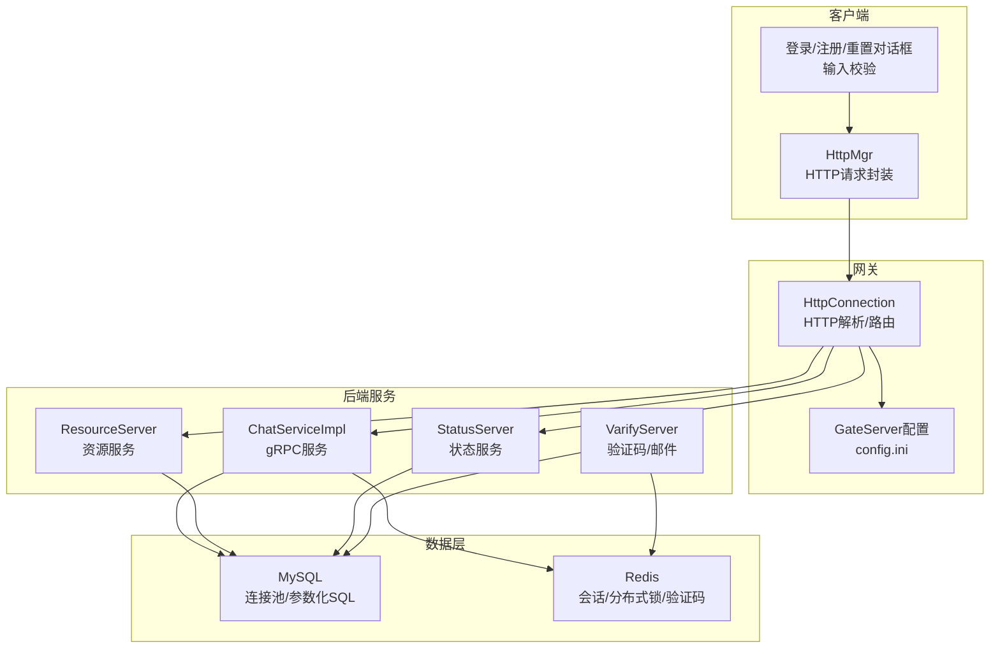
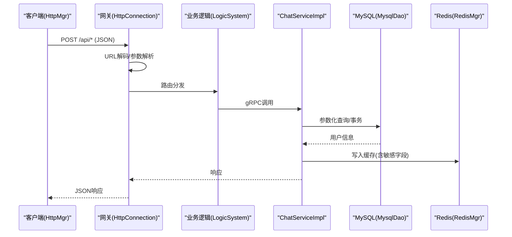
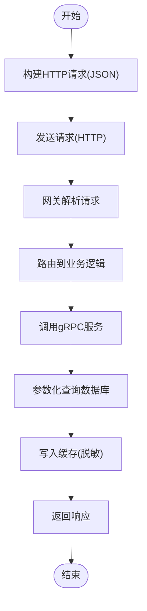
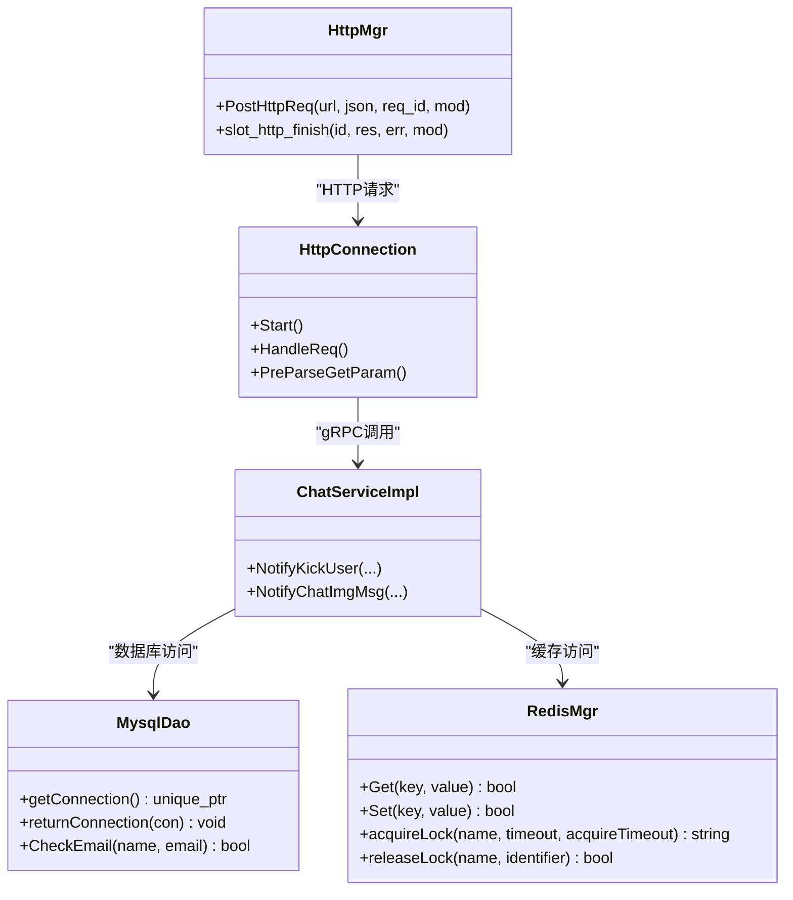

# 数据安全保护

<cite>
**本文引用的文件**   
- [HttpConnection.cpp](file://server/GateServer/src/HttpConnection.cpp)
- [httpmgr.h](file://client/llfcchat/include/httpmgr.h)
- [httpmgr.cpp](file://client/llfcchat/src/httpmgr.cpp)
- [config.ini](file://server/GateServer/config/config.ini)
- [RedisMgr.h](file://server/GateServer/include/RedisMgr.h)
- [MysqlDao.cpp](file://server/ChatServer/src/MysqlDao.cpp)
- [MysqlDao.h](file://server/ChatServer/include/MysqlDao.h)
- [MysqlDao.cpp](file://server/GateServer/src/MysqlDao.cpp)
- [MysqlDao.cpp](file://server/ResourceServer/src/MysqlDao.cpp)
- [ChatServiceImpl.cpp](file://server/ChatServer/src/ChatServiceImpl.cpp)
- [ChatGrpcClient.cpp](file://server/ChatServer/src/ChatGrpcClient.cpp)
- [base64.cpp](file://server/ResourceServer/src/base64.cpp)
- [logindialog.cpp](file://client/llfcchat/src/logindialog.cpp)
- [registerdialog.cpp](file://client/llfcchat/src/registerdialog.cpp)
- [resetdialog.cpp](file://client/llfcchat/src/resetdialog.cpp)
- [day35心跳逻辑.md](file://开发文档/day35心跳逻辑.md)
- [day08-邮箱认证服务.md](file://开发文档/day08-邮箱认证服务.md)
- [day12-注册界面完善.md](file://开发文档/day12-注册界面完善.md)
</cite>

## 目录
1. [简介](#简介)
2. [项目结构](#项目结构)
3. [核心组件](#核心组件)
4. [架构总览](#架构总览)
5. [详细组件分析](#详细组件分析)
6. [依赖关系分析](#依赖关系分析)
7. [性能考虑](#性能考虑)
8. [故障排查指南](#故障排查指南)
9. [结论](#结论)
10. [附录：安全编码规范与示例路径](#附录安全编码规范与示例路径)

## 简介
本文件面向LLFCChat项目的数据安全保护，覆盖敏感信息加密、输入验证、数据库与缓存安全、传输层安全以及配置管理等方面。结合现有代码实现，给出可落地的最佳实践与改进建议，帮助团队在开发与运维中持续强化安全性。

## 项目结构
本项目包含客户端（Qt/C++）、网关HTTP服务（Beast/Asio）、多个后端服务（Chat/Resource/Status/Verify）以及Redis与MySQL等基础设施。与安全相关的关键位置包括：
- 客户端HTTP请求封装与响应处理
- 网关HTTP请求解析与路由
- Redis连接池与会话/锁管理
- MySQL连接池、参数化查询与事务
- gRPC服务间调用与缓存写入
- 前端输入校验与密码策略

**图示来源** 
- [HttpConnection.cpp:133-194](file://server/GateServer/src/HttpConnection.cpp#L133-L194)
- [httpmgr.cpp:8-38](file://client/llfcchat/src/httpmgr.cpp#L8-L38)
- [config.ini:9-18](file://server/GateServer/config/config.ini#L9-L18)
- [ChatServiceImpl.cpp:171-187](file://server/ChatServer/src/ChatServiceImpl.cpp#L171-L187)
- [RedisMgr.h:9-48](file://server/GateServer/include/RedisMgr.h#L9-L48)
- [MysqlDao.h:25-60](file://server/ChatServer/include/MysqlDao.h#L25-L60)

**章节来源**
- [HttpConnection.cpp:133-194](file://server/GateServer/src/HttpConnection.cpp#L133-L194)
- [httpmgr.cpp:8-38](file://client/llfcchat/src/httpmgr.cpp#L8-L38)
- [config.ini:9-18](file://server/GateServer/config/config.ini#L9-L18)

## 核心组件
- 客户端HTTP管理器：负责构造POST请求、设置JSON头、发送并回调结果。当前未启用TLS或证书校验。
- 网关HTTP连接：解析GET/POST请求、CORS设置、URL解码、路由分发。当前CORS为通配符。
- Redis连接池：带AUTH认证、PING保活、自动重连、分布式锁接口。
- MySQL连接池：健康检查、自动重连、参数化PreparedStatement、事务回滚。
- gRPC服务：用户信息查询后写入Redis缓存；存在明文敏感字段写入风险。
- 输入校验：客户端对密码长度、字符集、邮箱格式进行正则校验。

**章节来源**
- [httpmgr.h:11-31](file://client/llfcchat/include/httpmgr.h#L11-L31)
- [httpmgr.cpp:8-38](file://client/llfcchat/src/httpmgr.cpp#L8-L38)
- [HttpConnection.cpp:96-130](file://server/GateServer/src/HttpConnection.cpp#L96-L130)
- [RedisMgr.h:9-48](file://server/GateServer/include/RedisMgr.h#L9-L48)
- [MysqlDao.h:25-60](file://server/ChatServer/include/MysqlDao.h#L25-L60)
- [ChatServiceImpl.cpp:171-187](file://server/ChatServer/src/ChatServiceImpl.cpp#L171-L187)
- [logindialog.cpp:143-166](file://client/llfcchat/src/logindialog.cpp#L143-L166)
- [registerdialog.cpp:181-202](file://client/llfcchat/src/registerdialog.cpp#L181-L202)
- [resetdialog.cpp:116-130](file://client/llfcchat/src/resetdialog.cpp#L116-L130)

## 架构总览
下图展示从客户端到服务端的数据流与安全控制点，包括输入校验、传输、鉴权、缓存与持久化。

**图示来源** 
- [httpmgr.cpp:8-38](file://client/llfcchat/src/httpmgr.cpp#L8-L38)
- [HttpConnection.cpp:133-194](file://server/GateServer/src/HttpConnection.cpp#L133-L194)
- [ChatServiceImpl.cpp:171-187](file://server/ChatServer/src/ChatServiceImpl.cpp#L171-L187)
- [MysqlDao.cpp:329-386](file://server/ChatServer/src/MysqlDao.cpp#L329-L386)
- [RedisMgr.h:267-305](file://server/GateServer/include/RedisMgr.h#L267-L305)

## 详细组件分析

### 敏感信息加密方案
- 密码哈希存储
  - 现状：数据库读取用户信息时包含pwd字段，并在gRPC服务中将pwd写入Redis缓存，存在明文敏感数据泄露风险。
  - 建议：
    - 使用强哈希算法（如bcrypt/argon2）存储密码，禁止明文存储。
    - 登录流程仅比较哈希值，不在缓存中保留明文pwd。
    - 若需显示/比对，应在内存中临时持有且尽快释放。
  - 参考实现位置：
    - [MysqlDao.cpp:476-505](file://server/ResourceServer/src/MysqlDao.cpp#L476-L505)
    - [ChatServiceImpl.cpp:171-187](file://server/ChatServer/src/ChatServiceImpl.cpp#L171-L187)
    - [ChatGrpcClient.cpp:92-105](file://server/ChatServer/src/ChatGrpcClient.cpp#L92-L105)

- 数据传输加密
  - 现状：客户端通过QNetworkAccessManager发起HTTP请求，未启用TLS；网关CORS设置为“*”。
  - 建议：
    - 强制HTTPS/TLS，禁用弱协议与套件；启用HSTS。
    - 严格限制CORS白名单，避免“*”在生产环境使用。
    - 对敏感API增加签名与防重放机制（时间戳+Nonce）。
  - 参考实现位置：
    - [httpmgr.cpp:8-38](file://client/llfcchat/src/httpmgr.cpp#L8-L38)
    - [HttpConnection.cpp:133-194](file://server/GateServer/src/HttpConnection.cpp#L133-L194)

- 配置文件加密
  - 现状：config.ini包含数据库与Redis的账号密码明文。
  - 建议：
    - 使用密钥管理系统（KMS）或环境变量注入；或使用对称加密（AES-GCM）加密配置文件，启动时解密。
    - 最小权限原则：为每个服务创建独立数据库账户，限制IP与操作权限。
  - 参考实现位置：
    - [config.ini:9-18](file://server/GateServer/config/config.ini#L9-L18)

- Base64编解码
  - 现状：提供Base64编解码工具，但不应作为安全加密手段。
  - 建议：
    - 仅用于非敏感数据的传输编码；敏感数据必须使用加密算法。
  - 参考实现位置：
    - [base64.cpp:34-72](file://server/ResourceServer/src/base64.cpp#L34-L72)

**章节来源**
- [MysqlDao.cpp:476-505](file://server/ResourceServer/src/MysqlDao.cpp#L476-L505)
- [ChatServiceImpl.cpp:171-187](file://server/ChatServer/src/ChatServiceImpl.cpp#L171-L187)
- [ChatGrpcClient.cpp:92-105](file://server/ChatServer/src/ChatGrpcClient.cpp#L92-L105)
- [httpmgr.cpp:8-38](file://client/llfcchat/src/httpmgr.cpp#L8-L38)
- [HttpConnection.cpp:133-194](file://server/GateServer/src/HttpConnection.cpp#L133-L194)
- [config.ini:9-18](file://server/GateServer/config/config.ini#L9-L18)
- [base64.cpp:34-72](file://server/ResourceServer/src/base64.cpp#L34-L72)

### 输入验证机制
- SQL注入防护
  - 现状：多处使用PreparedStatement绑定参数，有效防止SQL注入。
  - 建议：
    - 统一使用参数化查询，禁止字符串拼接SQL。
    - 对返回结果做类型与范围校验。
  - 参考实现位置：
    - [MysqlDao.cpp:329-386](file://server/ChatServer/src/MysqlDao.cpp#L329-L386)
    - [MysqlDao.cpp:610-633](file://server/ChatServer/src/MysqlDao.cpp#L610-L633)
    - [MysqlDao.cpp:635-651](file://server/ChatServer/src/MysqlDao.cpp#L635-L651)

- XSS攻击防护
  - 现状：客户端对用户输入进行正则校验；服务端输出JSON，但未显式转义。
  - 建议：
    - 对所有用户输入在服务端进行二次校验与白名单过滤。
    - 输出前进行HTML/JS转义，避免渲染恶意脚本。
  - 参考实现位置：
    - [logindialog.cpp:143-166](file://client/llfcchat/src/logindialog.cpp#L143-L166)
    - [registerdialog.cpp:181-202](file://client/llfcchat/src/registerdialog.cpp#L181-L202)
    - [resetdialog.cpp:116-130](file://client/llfcchat/src/resetdialog.cpp#L116-L130)

- CSRF攻击防护
  - 现状：HTTP请求未体现CSRF令牌校验。
  - 建议：
    - 对写操作引入CSRF Token，服务端校验来源与一致性。
    - 使用SameSite Cookie与严格的Referer校验。
  - 参考实现位置：
    - [httpmgr.cpp:8-38](file://client/llfcchat/src/httpmgr.cpp#L8-L38)
    - [HttpConnection.cpp:133-194](file://server/GateServer/src/HttpConnection.cpp#L133-L194)

**章节来源**
- [MysqlDao.cpp:329-386](file://server/ChatServer/src/MysqlDao.cpp#L329-L386)
- [MysqlDao.cpp:610-633](file://server/ChatServer/src/MysqlDao.cpp#L610-L633)
- [MysqlDao.cpp:635-651](file://server/ChatServer/src/MysqlDao.cpp#L635-L651)
- [logindialog.cpp:143-166](file://client/llfcchat/src/logindialog.cpp#L143-L166)
- [registerdialog.cpp:181-202](file://client/llfcchat/src/registerdialog.cpp#L181-L202)
- [resetdialog.cpp:116-130](file://client/llfcchat/src/resetdialog.cpp#L116-L130)
- [httpmgr.cpp:8-38](file://client/llfcchat/src/httpmgr.cpp#L8-L38)
- [HttpConnection.cpp:133-194](file://server/GateServer/src/HttpConnection.cpp#L133-L194)

### 数据库安全配置
- 连接池安全
  - 现状：MySQL连接池具备健康检查与自动重连；Redis连接池支持AUTH与PING保活。
  - 建议：
    - 限制最大连接数，避免资源耗尽。
    - 使用只读账户执行查询，写操作使用专用账户。
  - 参考实现位置：
    - [MysqlDao.h:25-60](file://server/ChatServer/include/MysqlDao.h#L25-L60)
    - [RedisMgr.h:9-48](file://server/GateServer/include/RedisMgr.h#L9-L48)

- 查询参数化
  - 现状：广泛使用PreparedStatement绑定参数，有效防止注入。
  - 建议：
    - 统一抽象DAO层，集中参数化与错误处理。
  - 参考实现位置：
    - [MysqlDao.cpp:329-386](file://server/ChatServer/src/MysqlDao.cpp#L329-L386)
    - [MysqlDao.cpp:610-633](file://server/ChatServer/src/MysqlDao.cpp#L610-L633)

- 权限最小化
  - 建议：
    - 为各服务分配最小必要权限（SELECT/INSERT/UPDATE/DELETE按需开放）。
    - 限制网络访问（白名单IP），启用审计日志。
  - 参考实现位置：
    - [config.ini:9-18](file://server/GateServer/config/config.ini#L9-L18)

**章节来源**
- [MysqlDao.h:25-60](file://server/ChatServer/include/MysqlDao.h#L25-L60)
- [RedisMgr.h:9-48](file://server/GateServer/include/RedisMgr.h#L9-L48)
- [MysqlDao.cpp:329-386](file://server/ChatServer/src/MysqlDao.cpp#L329-L386)
- [MysqlDao.cpp:610-633](file://server/ChatServer/src/MysqlDao.cpp#L610-L633)
- [config.ini:9-18](file://server/GateServer/config/config.ini#L9-L18)

### 缓存数据安全
- Redis会话存储
  - 现状：会话ID与用户IP信息存储在Redis，使用分布式锁保护清理逻辑。
  - 建议：
    - 会话数据脱敏，避免存储明文敏感字段。
    - 设置合理的过期时间与访问频率限制。
  - 参考实现位置：
    - [day35心跳逻辑.md:318-351](file://开发文档/day35心跳逻辑.md#L318-L351)
    - [RedisMgr.h:267-305](file://server/GateServer/include/RedisMgr.h#L267-L305)

- 敏感数据缓存
  - 现状：gRPC服务将用户信息（含pwd）写入Redis缓存。
  - 建议：
    - 移除敏感字段（pwd）缓存；如需显示，使用脱敏后的副本。
  - 参考实现位置：
    - [ChatServiceImpl.cpp:171-187](file://server/ChatServer/src/ChatServiceImpl.cpp#L171-L187)
    - [ChatGrpcClient.cpp:92-105](file://server/ChatServer/src/ChatGrpcClient.cpp#L92-L105)

- 缓存穿透防护
  - 建议：
    - 对不存在的数据设置短TTL空值缓存，布隆过滤器拦截热点非法键。
  - 参考实现位置：
    - [RedisMgr.h:267-305](file://server/GateServer/include/RedisMgr.h#L267-L305)

**章节来源**
- [day35心跳逻辑.md:318-351](file://开发文档/day35心跳逻辑.md#L318-L351)
- [RedisMgr.h:267-305](file://server/GateServer/include/RedisMgr.h#L267-L305)
- [ChatServiceImpl.cpp:171-187](file://server/ChatServer/src/ChatServiceImpl.cpp#L171-L187)
- [ChatGrpcClient.cpp:92-105](file://server/ChatServer/src/ChatGrpcClient.cpp#L92-L105)

### 传输与认证流程
- HTTP请求流程
  - 客户端构造JSON请求，设置Content-Type；网关解析并路由至业务逻辑。
- gRPC服务调用
  - 服务间通过gRPC通信，查询用户信息并写入缓存。
- 验证码与邮件
  - 验证码服务读取配置，使用Redis存储验证码，发送邮件。

**图示来源** 
- [httpmgr.cpp:8-38](file://client/llfcchat/src/httpmgr.cpp#L8-L38)
- [HttpConnection.cpp:133-194](file://server/GateServer/src/HttpConnection.cpp#L133-L194)
- [ChatServiceImpl.cpp:171-187](file://server/ChatServer/src/ChatServiceImpl.cpp#L171-L187)
- [MysqlDao.cpp:329-386](file://server/ChatServer/src/MysqlDao.cpp#L329-L386)

**章节来源**
- [httpmgr.cpp:8-38](file://client/llfcchat/src/httpmgr.cpp#L8-L38)
- [HttpConnection.cpp:133-194](file://server/GateServer/src/HttpConnection.cpp#L133-L194)
- [ChatServiceImpl.cpp:171-187](file://server/ChatServer/src/ChatServiceImpl.cpp#L171-L187)
- [MysqlDao.cpp:329-386](file://server/ChatServer/src/MysqlDao.cpp#L329-L386)

## 依赖关系分析
- 客户端依赖HTTP管理器，后者依赖Qt网络库。
- 网关依赖Beast/Asio，解析HTTP并路由到业务逻辑。
- 后端服务依赖MySQL Connector C++与hiredis，分别管理数据库与缓存。
- gRPC服务之间相互调用，共享Redis与MySQL资源。

**图示来源** 
- [httpmgr.h:11-31](file://client/llfcchat/include/httpmgr.h#L11-L31)
- [HttpConnection.cpp:133-194](file://server/GateServer/src/HttpConnection.cpp#L133-L194)
- [RedisMgr.h:267-305](file://server/GateServer/include/RedisMgr.h#L267-L305)
- [MysqlDao.h:25-60](file://server/ChatServer/include/MysqlDao.h#L25-L60)
- [ChatServiceImpl.cpp:171-187](file://server/ChatServer/src/ChatServiceImpl.cpp#L171-L187)

**章节来源**
- [httpmgr.h:11-31](file://client/llfcchat/include/httpmgr.h#L11-L31)
- [HttpConnection.cpp:133-194](file://server/GateServer/src/HttpConnection.cpp#L133-L194)
- [RedisMgr.h:267-305](file://server/GateServer/include/RedisMgr.h#L267-L305)
- [MysqlDao.h:25-60](file://server/ChatServer/include/MysqlDao.h#L25-L60)
- [ChatServiceImpl.cpp:171-187](file://server/ChatServer/src/ChatServiceImpl.cpp#L171-L187)

## 性能考虑
- 连接池优化：合理设置MySQL与Redis连接池大小，避免过多上下文切换。
- 缓存命中率：对热点数据设置合理TTL，减少数据库压力。
- 异步处理：使用异步I/O与信号槽机制，提升并发处理能力。
- 监控告警：对连接失败、超时、异常进行监控与告警。

[本节为通用指导，不直接分析具体文件]

## 故障排查指南
- 网络连接问题
  - 检查客户端HTTP请求是否成功，查看错误码与响应体。
  - 确认网关CORS与路由是否正确。
- 数据库连接失败
  - 检查连接池健康检查与重连逻辑。
  - 核对账号权限与网络白名单。
- Redis认证失败
  - 检查AUTH命令与密码配置。
  - 查看PING保活与连接池清理逻辑。
- 缓存一致性问题
  - 核对gRPC服务写入缓存的逻辑，确保脱敏与过期策略。

**章节来源**
- [httpmgr.cpp:8-38](file://client/llfcchat/src/httpmgr.cpp#L8-L38)
- [HttpConnection.cpp:133-194](file://server/GateServer/src/HttpConnection.cpp#L133-L194)
- [MysqlDao.h:25-60](file://server/ChatServer/include/MysqlDao.h#L25-L60)
- [RedisMgr.h:9-48](file://server/GateServer/include/RedisMgr.h#L9-L48)
- [ChatServiceImpl.cpp:171-187](file://server/ChatServer/src/ChatServiceImpl.cpp#L171-L187)

## 结论
通过对LLFCChat项目的代码分析，发现当前在输入校验、参数化查询、连接池管理方面已有良好基础，但在敏感数据加密、传输层安全、配置管理与缓存脱敏方面仍有改进空间。建议优先实施密码哈希存储、强制HTTPS、配置加密与缓存脱敏，以显著提升系统安全性。

[本节为总结性内容，不直接分析具体文件]

## 附录：安全编码规范与示例路径
- 密码策略与输入校验
  - 客户端正则校验密码长度与字符集，邮箱格式校验。
  - 示例路径：
    - [logindialog.cpp:143-166](file://client/llfcchat/src/logindialog.cpp#L143-L166)
    - [registerdialog.cpp:181-202](file://client/llfcchat/src/registerdialog.cpp#L181-202)
    - [resetdialog.cpp:116-130](file://client/llfcchat/src/resetdialog.cpp#L116-L130)
- 数据库安全
  - 使用PreparedStatement绑定参数，避免SQL注入。
  - 示例路径：
    - [MysqlDao.cpp:329-386](file://server/ChatServer/src/MysqlDao.cpp#L329-L386)
    - [MysqlDao.cpp:610-633](file://server/ChatServer/src/MysqlDao.cpp#L610-L633)
- 缓存安全
  - 避免在缓存中存储明文敏感字段，设置合理过期时间。
  - 示例路径：
    - [ChatServiceImpl.cpp:171-187](file://server/ChatServer/src/ChatServiceImpl.cpp#L171-L187)
    - [ChatGrpcClient.cpp:92-105](file://server/ChatServer/src/ChatGrpcClient.cpp#L92-L105)
- 配置管理
  - 使用环境变量或加密配置文件，避免明文密码。
  - 示例路径：
    - [config.ini:9-18](file://server/GateServer/config/config.ini#L9-L18)
- 传输安全
  - 启用HTTPS/TLS，限制CORS，添加请求签名。
  - 示例路径：
    - [httpmgr.cpp:8-38](file://client/llfcchat/src/httpmgr.cpp#L8-L38)
    - [HttpConnection.cpp:133-194](file://server/GateServer/src/HttpConnection.cpp#L133-L194)

**章节来源**
- [logindialog.cpp:143-166](file://client/llfcchat/src/logindialog.cpp#L143-L166)
- [registerdialog.cpp:181-202](file://client/llfcchat/src/registerdialog.cpp#L181-202)
- [resetdialog.cpp:116-130](file://client/llfcchat/src/resetdialog.cpp#L116-L130)
- [MysqlDao.cpp:329-386](file://server/ChatServer/src/MysqlDao.cpp#L329-L386)
- [MysqlDao.cpp:610-633](file://server/ChatServer/src/MysqlDao.cpp#L610-L633)
- [ChatServiceImpl.cpp:171-187](file://server/ChatServer/src/ChatServiceImpl.cpp#L171-L187)
- [ChatGrpcClient.cpp:92-105](file://server/ChatServer/src/ChatGrpcClient.cpp#L92-L105)
- [config.ini:9-18](file://server/GateServer/config/config.ini#L9-L18)
- [httpmgr.cpp:8-38](file://client/llfcchat/src/httpmgr.cpp#L8-L38)
- [HttpConnection.cpp:133-194](file://server/GateServer/src/HttpConnection.cpp#L133-L194)