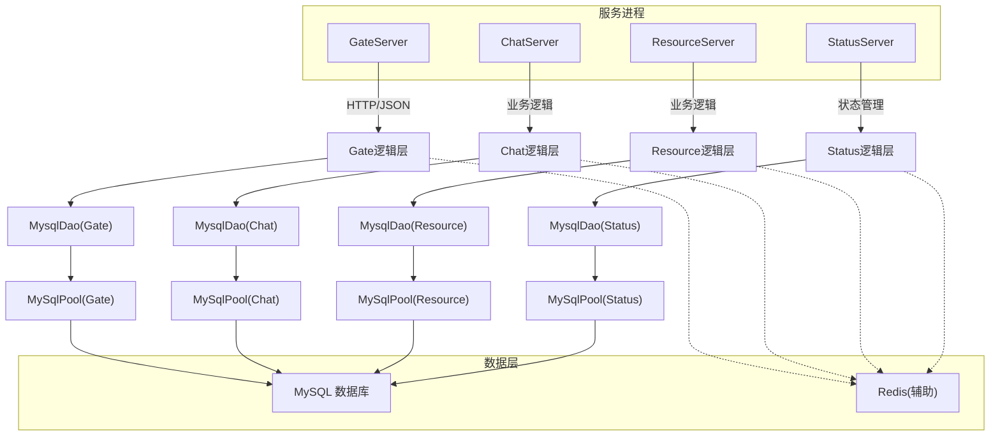
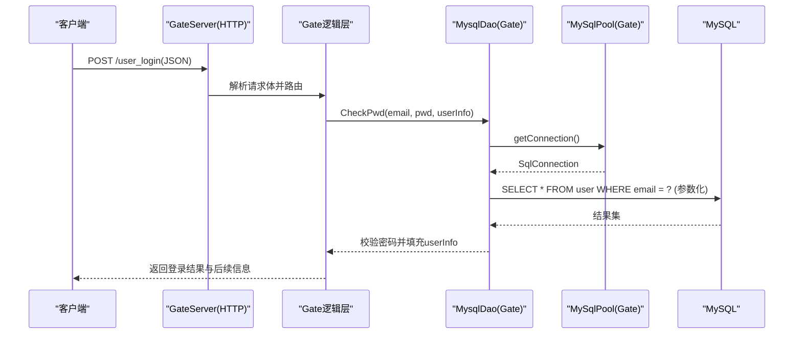
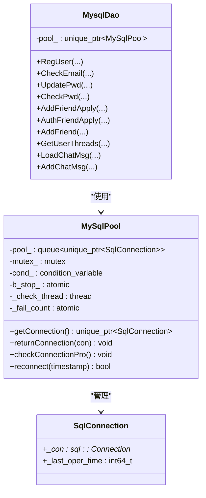

# 数据库安全

<cite>
**本文引用的文件**   
- [server/ChatServer/include/MysqlDao.h](file://server/ChatServer/include/MysqlDao.h)
- [server/ChatServer/src/MysqlDao.cpp](file://server/ChatServer/src/MysqlDao.cpp)
- [server/GateServer/include/MysqlDao.h](file://server/GateServer/include/MysqlDao.h)
- [server/GateServer/src/MysqlDao.cpp](file://server/GateServer/src/MysqlDao.cpp)
- [server/ResourceServer/include/MysqlDao.h](file://server/ResourceServer/include/MysqlDao.h)
- [server/StatusServer/include/MysqlDao.h](file://server/StatusServer/include/MysqlDao.h)
- [server/StatusServer/src/MysqlDao.cpp](file://server/StatusServer/src/MysqlDao.cpp)
- [server/ChatServer/config/chatserver1.ini](file://server/ChatServer/config/chatserver1.ini)
- [server/GateServer/config/config.ini](file://server/GateServer/config/config.ini)
- [sql备份/llfc.sql](file://sql备份/llfc.sql)
- [开发文档/day11-注册功能.md](file://开发文档/day11-注册功能.md)
- [开发文档/day42-用户加载聊天资源.md](file://开发文档/day42-用户加载聊天资源.md)
</cite>

## 目录
1. [简介](#简介)
2. [项目结构](#项目结构)
3. [核心组件](#核心组件)
4. [架构总览](#架构总览)
5. [详细组件分析](#详细组件分析)
6. [依赖分析](#依赖分析)
7. [性能考虑](#性能考虑)
8. [故障排查指南](#故障排查指南)
9. [结论](#结论)
10. [附录](#附录)

## 简介
本文件面向LLFCChat项目的数据库安全，围绕连接池安全配置、查询安全机制、用户权限管理、备份恢复安全以及监控告警等方面给出系统化说明。内容基于代码仓库中的MySQL连接池实现、DAO层参数化查询实践、配置文件与SQL脚本进行归纳与扩展建议，帮助读者构建安全的数据库访问环境。

## 项目结构
本项目在多个服务（GateServer、ChatServer、ResourceServer、StatusServer）中均包含MySQL访问模块，统一通过MysqlDao与MySqlPool封装连接池与数据访问逻辑；配置集中在各服务的ini文件中；SQL结构与存储过程定义位于sql备份目录。

图表来源 
- [server/GateServer/include/MysqlDao.h](file://server/GateServer/include/MysqlDao.h)
- [server/ChatServer/include/MysqlDao.h](file://server/ChatServer/include/MysqlDao.h)
- [server/ResourceServer/include/MysqlDao.h](file://server/ResourceServer/include/MysqlDao.h)
- [server/StatusServer/include/MysqlDao.h](file://server/StatusServer/include/MysqlDao.h)

章节来源
- [server/ChatServer/config/chatserver1.ini](file://server/ChatServer/config/chatserver1.ini)
- [server/GateServer/config/config.ini](file://server/GateServer/config/config.ini)
- [sql备份/llfc.sql](file://sql备份/llfc.sql)

## 核心组件
- MySqlPool：封装MySQL连接池，负责连接的创建、获取、归还、健康检查与自动重连。
- MysqlDao：封装具体数据访问方法，使用PreparedStatement进行参数化查询，避免SQL注入。
- 配置项：Host、Port、User、Passwd、Schema等用于建立数据库连接。
- SQL脚本：定义表结构、索引、存储过程等，支撑业务数据模型。

章节来源
- [server/ChatServer/include/MysqlDao.h](file://server/ChatServer/include/MysqlDao.h)
- [server/GateServer/include/MysqlDao.h](file://server/GateServer/include/MysqlDao.h)
- [server/ResourceServer/include/MysqlDao.h](file://server/ResourceServer/include/MysqlDao.h)
- [server/StatusServer/include/MysqlDao.h](file://server/StatusServer/include/MysqlDao.h)
- [server/ChatServer/config/chatserver1.ini](file://server/ChatServer/config/chatserver1.ini)
- [server/GateServer/config/config.ini](file://server/GateServer/config/config.ini)
- [sql备份/llfc.sql](file://sql备份/llfc.sql)

## 架构总览
下图展示从HTTP登录请求到数据库校验的完整调用链，体现参数化查询与连接池的使用。

图表来源 
- [server/GateServer/src/MysqlDao.cpp](file://server/GateServer/src/MysqlDao.cpp)
- [server/GateServer/include/MysqlDao.h](file://server/GateServer/include/MysqlDao.h)
- [开发文档/day42-用户加载聊天资源.md](file://开发文档/day42-用户加载聊天资源.md)

## 详细组件分析

### 连接池安全配置（连接层）
- 连接字符串与凭据
  - 当前配置以明文形式存在于ini文件中（Host、Port、User、Passwd、Schema）。建议将敏感字段加密存储，并在启动时解密后传入连接池构造器。
  - 最小权限原则：为应用创建专用数据库账户，仅授予必要库/表的SELECT/INSERT/UPDATE/EXECUTE权限，禁止GRANT/REVOKE/DROP等高危操作。
- 连接超时与生命周期
  - 连接池内部维护_last_oper_time，定期执行“SELECT 1”保活；当超过阈值则尝试重建连接。建议显式设置连接超时、读取超时、写入超时，避免僵尸连接占用资源。
- 连接池大小与并发
  - 根据峰值QPS与平均响应时间估算池大小，避免过大导致数据库连接耗尽或过小造成频繁等待。
- 错误处理与重试
  - 捕获SQLException并记录错误码与SQLState；对瞬时网络抖动可引入退避重试策略，但需限制最大重试次数，防止雪崩。

章节来源
- [server/ChatServer/include/MysqlDao.h](file://server/ChatServer/include/MysqlDao.h)
- [server/GateServer/include/MysqlDao.h](file://server/GateServer/include/MysqlDao.h)
- [server/ResourceServer/include/MysqlDao.h](file://server/ResourceServer/include/MysqlDao.h)
- [server/StatusServer/include/MysqlDao.h](file://server/StatusServer/include/MysqlDao.h)
- [server/ChatServer/config/chatserver1.ini](file://server/ChatServer/config/chatserver1.ini)
- [server/GateServer/config/config.ini](file://server/GateServer/config/config.ini)

### 查询安全机制（数据访问层）
- 参数化查询
  - 所有涉及用户输入的地方均使用PreparedStatement与setString/setInt绑定参数，杜绝SQL拼接导致的注入风险。
- 结果过滤与最小返回
  - 只选择必要的列，避免返回敏感字段；对文本内容进行长度与字符集校验，防止超长或非法字符影响系统稳定性。
- 事务与一致性
  - 对多步写操作使用事务包裹，确保原子性与一致性；失败时回滚并记录审计日志。
- 存储过程与权限
  - 若使用存储过程，应限制调用权限，并对输入参数做严格校验。

章节来源
- [server/ChatServer/src/MysqlDao.cpp](file://server/ChatServer/src/MysqlDao.cpp)
- [server/GateServer/src/MysqlDao.cpp](file://server/GateServer/src/MysqlDao.cpp)
- [server/StatusServer/src/MysqlDao.cpp](file://server/StatusServer/src/MysqlDao.cpp)
- [sql备份/llfc.sql](file://sql备份/llfc.sql)

### 用户权限管理与审计
- 角色与权限分配
  - 为不同服务创建独立数据库账户，按职责划分最小权限集合；生产环境禁用root账户直连。
- 操作审计日志
  - 在DAO层对关键操作（登录、修改密码、好友申请等）记录审计日志，包括操作者ID、时间、IP、SQL类型与影响行数。
- 敏感数据访问控制
  - 对密码等敏感字段采用服务端哈希比对，不在日志中输出明文；对外接口返回脱敏数据。

章节来源
- [server/GateServer/src/MysqlDao.cpp](file://server/GateServer/src/MysqlDao.cpp)
- [server/ChatServer/src/MysqlDao.cpp](file://server/ChatServer/src/MysqlDao.cpp)
- [开发文档/day11-注册功能.md](file://开发文档/day11-注册功能.md)

### 备份恢复安全
- 加密备份
  - 对导出文件进行磁盘级或工具级加密（如GPG），并限制备份文件的访问权限。
- 传输安全
  - 使用受信任的网络通道（如内网专线或TLS隧道）传输备份文件，避免中间人攻击。
- 恢复验证
  - 恢复后进行完整性校验（如checksum）、业务关键数据抽样核对，确保可用性与一致性。
- 版本与保留策略
  - 制定备份保留周期与版本管理策略，定期演练恢复流程。

章节来源
- [sql备份/llfc.sql](file://sql备份/llfc.sql)
- [开发文档/day11-注册功能.md](file://开发文档/day11-注册功能.md)

### 监控告警机制
- 连接池指标
  - 监控活跃连接数、等待队列长度、健康检查失败率、重连成功率。
- 查询性能
  - 慢查询统计、执行计划分析、锁等待与死锁检测。
- 异常与审计
  - 对SQLException、权限拒绝、认证失败等进行告警；审计日志集中采集与检索。
- 容量规划
  - 基于历史趋势预测连接与存储增长，提前扩容。

章节来源
- [server/ChatServer/include/MysqlDao.h](file://server/ChatServer/include/MysqlDao.h)
- [server/GateServer/include/MysqlDao.h](file://server/GateServer/include/MysqlDao.h)
- [server/ResourceServer/include/MysqlDao.h](file://server/ResourceServer/include/MysqlDao.h)
- [server/StatusServer/include/MysqlDao.h](file://server/StatusServer/include/MysqlDao.h)

## 依赖分析
- 组件耦合
  - MysqlDao强依赖MySqlPool；各服务间通过独立的DAO实例隔离数据库访问面。
- 外部依赖
  - MySQL Connector C++驱动；Redis作为辅助缓存与令牌存储。
- 潜在循环依赖
  - DAO与Pool之间无循环引用；服务间通过RPC或消息解耦。

图表来源 
- [server/ChatServer/include/MysqlDao.h](file://server/ChatServer/include/MysqlDao.h)
- [server/GateServer/include/MysqlDao.h](file://server/GateServer/include/MysqlDao.h)
- [server/ResourceServer/include/MysqlDao.h](file://server/ResourceServer/include/MysqlDao.h)
- [server/StatusServer/include/MysqlDao.h](file://server/StatusServer/include/MysqlDao.h)

章节来源
- [server/ChatServer/include/MysqlDao.h](file://server/ChatServer/include/MysqlDao.h)
- [server/GateServer/include/MysqlDao.h](file://server/GateServer/include/MysqlDao.h)
- [server/ResourceServer/include/MysqlDao.h](file://server/ResourceServer/include/MysqlDao.h)
- [server/StatusServer/include/MysqlDao.h](file://server/StatusServer/include/MysqlDao.h)

## 性能考虑
- 连接池调优
  - 合理设置池大小、空闲回收阈值、保活间隔；避免频繁创建销毁连接。
- 查询优化
  - 使用合适索引（如chat_message的thread_id与created_at组合索引）；分页查询限制pageSize。
- 事务粒度
  - 缩小事务范围，减少锁持有时间；批量写合并提交。
- 异步与背压
  - 在高并发场景下引入限流与降级策略，保护数据库不被突发流量打垮。

章节来源
- [sql备份/llfc.sql](file://sql备份/llfc.sql)
- [server/ChatServer/src/MysqlDao.cpp](file://server/ChatServer/src/MysqlDao.cpp)

## 故障排查指南
- 连接失败
  - 检查Host、Port、User、Passwd是否正确；确认防火墙与网络可达；查看驱动版本匹配。
- 健康检查失败
  - 关注保活查询异常与重连计数；必要时调整保活阈值与重试策略。
- 参数化查询异常
  - 核对setString/setInt顺序与类型；检查SQL语句占位符数量与位置。
- 权限问题
  - 确认应用账户具备所需权限；避免使用root账户；检查schema与表名大小写。
- 备份恢复问题
  - 校验备份文件完整性；恢复前备份现有数据；恢复后执行关键数据核对。

章节来源
- [server/ChatServer/include/MysqlDao.h](file://server/ChatServer/include/MysqlDao.h)
- [server/GateServer/include/MysqlDao.h](file://server/GateServer/include/MysqlDao.h)
- [server/ResourceServer/include/MysqlDao.h](file://server/ResourceServer/include/MysqlDao.h)
- [server/StatusServer/include/MysqlDao.h](file://server/StatusServer/include/MysqlDao.h)

## 结论
通过对连接池、查询、权限、备份与监控的系统化加固，LLFCChat可在保证性能的同时显著提升数据库安全性。建议优先落地连接串加密、最小权限账户、参数化查询与审计日志，再逐步完善备份恢复与监控告警体系。

## 附录

### 安全配置示例清单
- 连接层
  - 连接串加密存储与启动解密
  - 专用数据库账户与最小权限
  - 连接超时、读取超时、写入超时
  - 连接池大小与空闲回收阈值
- 查询层
  - 全部使用PreparedStatement
  - 输入校验与长度限制
  - 最小列返回与脱敏输出
  - 事务边界与回滚策略
- 权限与审计
  - 角色分离与权限审批
  - 关键操作审计日志
  - 敏感字段不落地明文
- 备份恢复
  - 加密备份与受限访问
  - 安全传输与恢复演练
  - 版本管理与保留策略
- 监控告警
  - 连接池与健康检查指标
  - 慢查询与锁等待告警
  - 异常与审计集中采集

章节来源
- [server/ChatServer/config/chatserver1.ini](file://server/ChatServer/config/chatserver1.ini)
- [server/GateServer/config/config.ini](file://server/GateServer/config/config.ini)
- [server/ChatServer/src/MysqlDao.cpp](file://server/ChatServer/src/MysqlDao.cpp)
- [server/GateServer/src/MysqlDao.cpp](file://server/GateServer/src/MysqlDao.cpp)
- [sql备份/llfc.sql](file://sql备份/llfc.sql)