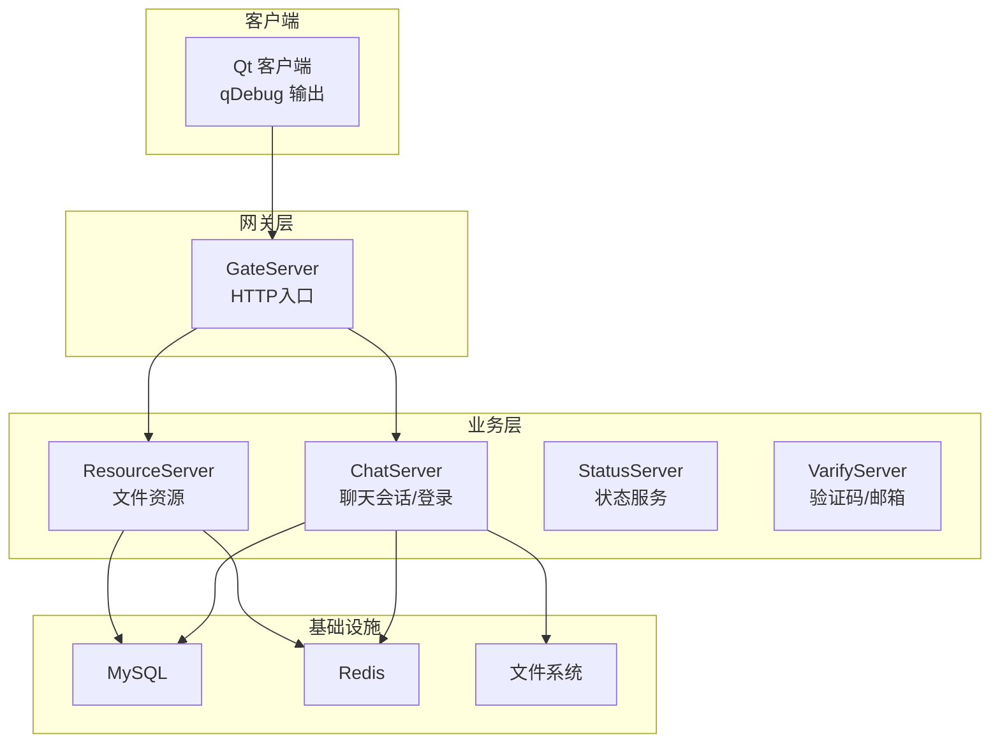
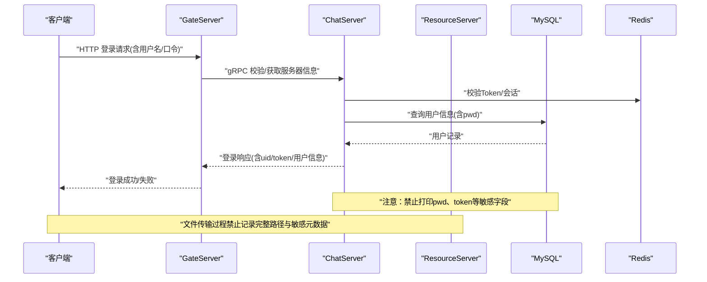
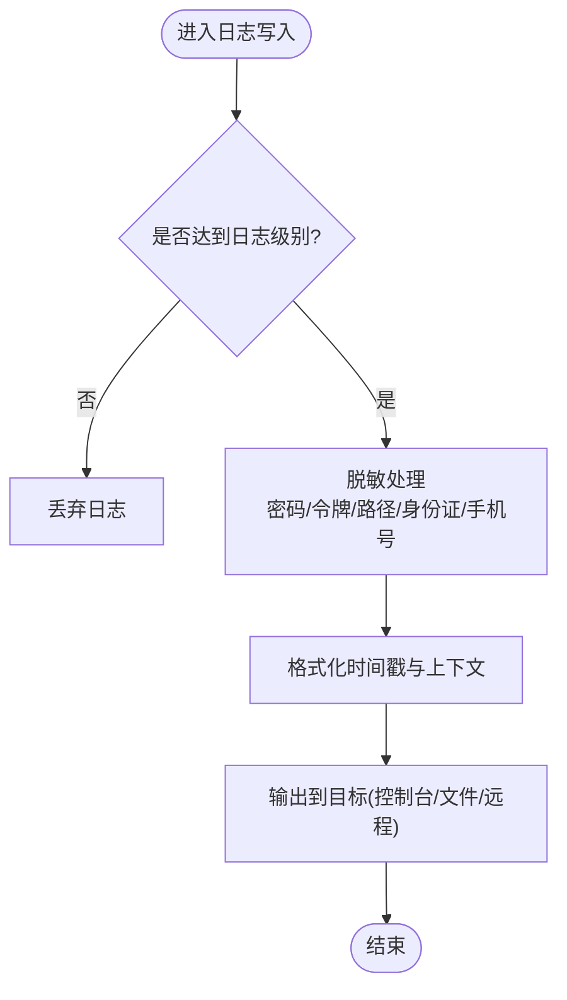
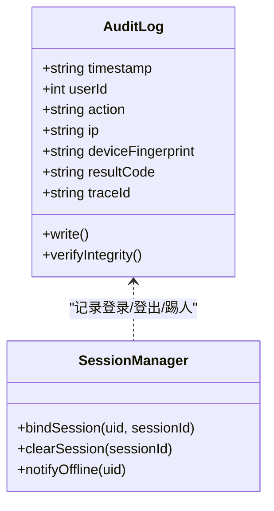
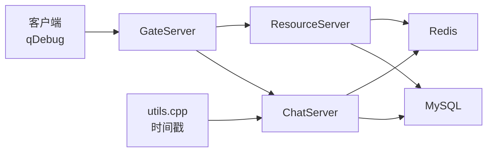

# 日志安全

<cite>
**本文引用的文件**   
- [client/llfcchat/config/config.ini](file://client/llfcchat/config/config.ini)
- [server/GateServer/config/config.ini](file://server/GateServer/config/config.ini)
- [server/ChatServer/config/chatserver1.ini](file://server/ChatServer/config/chatserver1.ini)
- [server/ResourceServer/config/config.ini](file://server/ResourceServer/config/config.ini)
- [server/ChatServer/include/utils.h](file://server/ChatServer/include/utils.h)
- [server/ChatServer/src/utils.cpp](file://server/ChatServer/src/utils.cpp)
- [server/ChatServer/src/MysqlDao.cpp](file://server/ChatServer/src/MysqlDao.cpp)
- [server/ChatServer/src/LogicSystem.cpp](file://server/ChatServer/src/LogicSystem.cpp)
- [server/ChatServer/src/CSession.cpp](file://server/ChatServer/src/CSession.cpp)
- [server/ChatServer/src/ChatServer.cpp](file://server/ChatServer/src/ChatServer.cpp)
- [server/ResourceServer/src/MysqlDao.cpp](file://server/ResourceServer/src/MysqlDao.cpp)
- [server/ResourceServer/src/LogicWorker.cpp](file://server/ResourceServer/src/LogicWorker.cpp)
- [client/llfcchat/src/filetcpmgr.cpp](file://client/llfcchat/src/filetcpmgr.cpp)
- [client/llfcchat/src/tcpmgr.cpp](file://client/llfcchat/src/tcpmgr.cpp)
- [开发文档/day35心跳逻辑.md](file://开发文档/day35心跳逻辑.md)
- [开发文档/day09-redis服务搭建.md](file://开发文档/day09-redis服务搭建.md)
</cite>

## 目录
1. [引言](#引言)
2. [项目结构](#项目结构)
3. [核心组件](#核心组件)
4. [架构总览](#架构总览)
5. [详细组件分析](#详细组件分析)
6. [依赖关系分析](#依赖关系分析)
7. [性能考虑](#性能考虑)
8. [故障排查指南](#故障排查指南)
9. [结论](#结论)
10. [附录：配置与合规清单](#附录配置与合规清单)

## 引言
本安全文档聚焦于 LLFCChat 的日志安全，覆盖敏感信息脱敏、日志级别控制、访问权限管理、用户隐私保护、错误信息与调试信息管理、日志加密存储、日志轮转策略与审计日志实现。结合现有代码中的输出点（qDebug/stdout/stderr）、配置文件与网络交互流程，给出可落地的安全加固方案与最佳实践，帮助在开发与运维阶段避免密码、令牌等敏感信息泄露，并满足合规性要求。

## 项目结构
本项目包含客户端与服务端多模块：
- 客户端：Qt 应用，使用 qDebug 进行调试输出，存在网络 IO、文件下载/上传路径。
- 服务端：GateServer、ChatServer、ResourceServer、StatusServer、VarifyServer，分别处理 HTTP/gRPC、聊天、资源、状态与验证。
- 配置：各服务通过 ini 文件管理连接参数与运行参数。
- 工具：时间戳工具用于生成日志时间。

**图表来源** 
- [server/GateServer/config/config.ini:1-25](file://server/GateServer/config/config.ini#L1-L25)
- [server/ChatServer/config/chatserver1.ini:1-30](file://server/ChatServer/config/chatserver1.ini#L1-L30)
- [server/ResourceServer/config/config.ini:1-27](file://server/ResourceServer/config/config.ini#L1-L27)

**章节来源**
- [client/llfcchat/config/config.ini:1-4](file://client/llfcchat/config/config.ini#L1-L4)
- [server/GateServer/config/config.ini:1-25](file://server/GateServer/config/config.ini#L1-L25)
- [server/ChatServer/config/chatserver1.ini:1-30](file://server/ChatServer/config/chatserver1.ini#L1-L30)
- [server/ResourceServer/config/config.ini:1-27](file://server/ResourceServer/config/config.ini#L1-L27)

## 核心组件
- 日志输出现状
  - 客户端大量使用 qDebug 输出调试信息，包括网络错误、文件传输进度等。
  - 服务端多处使用 std::cout/stderr 输出异常与关键事件，如 MySQL 异常、登录流程、会话异常等。
- 敏感数据暴露风险
  - 登录/认证流程中可能输出 uid、token、用户名、邮箱等。
  - 数据库查询结果中包含明文密码字段被打印或返回。
  - 文件传输过程中记录文件名、路径、大小、进度等。
- 配置与运行时
  - 各服务 ini 配置包含数据库与 Redis 的连接信息，需严格管控。
  - 时间戳工具可用于统一日志时间格式。

**章节来源**
- [server/ChatServer/src/LogicSystem.cpp:119-120](file://server/ChatServer/src/LogicSystem.cpp#L119-L120)
- [server/ChatServer/src/MysqlDao.cpp:127-167](file://server/ChatServer/src/MysqlDao.cpp#L127-L167)
- [server/ResourceServer/src/MysqlDao.cpp:120-164](file://server/ResourceServer/src/MysqlDao.cpp#L120-L164)
- [client/llfcchat/src/filetcpmgr.cpp:399-433](file://client/llfcchat/src/filetcpmgr.cpp#L399-L433)
- [client/llfcchat/src/tcpmgr.cpp:63-91](file://client/llfcchat/src/tcpmgr.cpp#L63-L91)
- [server/ChatServer/include/utils.h:1-7](file://server/ChatServer/include/utils.h#L1-L7)
- [server/ChatServer/src/utils.cpp:1-15](file://server/ChatServer/src/utils.cpp#L1-L15)

## 架构总览
下图展示从客户端到服务端的请求链路，以及潜在日志输出点与敏感信息传播路径。

**图表来源** 
- [server/ChatServer/src/LogicSystem.cpp:119-120](file://server/ChatServer/src/LogicSystem.cpp#L119-L120)
- [server/ChatServer/src/MysqlDao.cpp:127-167](file://server/ChatServer/src/MysqlDao.cpp#L127-L167)
- [server/ResourceServer/src/LogicWorker.cpp:132-177](file://server/ResourceServer/src/LogicWorker.cpp#L132-L177)
- [client/llfcchat/src/filetcpmgr.cpp:769-805](file://client/llfcchat/src/filetcpmgr.cpp#L769-L805)

## 详细组件分析

### 敏感信息脱敏与日志级别控制
- 目标
  - 所有日志不得包含密码、令牌、完整路径、身份证号、手机号等敏感信息。
  - 提供统一的脱敏函数与日志级别开关，支持按环境切换。
- 建议实现
  - 统一脱敏规则：对字符串进行掩码替换（如前2后2保留，中间用*填充）。
  - 日志级别：DEBUG/INFO/WARN/ERROR/FATAL，默认生产环境仅输出 WARN+。
  - 集中式日志门面：封装 qDebug/stdout/stderr 调用，强制走脱敏与级别过滤。
- 当前风险点
  - LogicSystem 登录流程输出 uid 与 token。
  - MysqlDao 查询结果包含 pwd 字段并被打印或返回。
  - 客户端 filetcpmgr 输出文件路径、进度、名称等。

**图表来源** 
- [server/ChatServer/src/utils.cpp:1-15](file://server/ChatServer/src/utils.cpp#L1-L15)

**章节来源**
- [server/ChatServer/src/LogicSystem.cpp:119-120](file://server/ChatServer/src/LogicSystem.cpp#L119-L120)
- [server/ChatServer/src/MysqlDao.cpp:127-167](file://server/ChatServer/src/MysqlDao.cpp#L127-L167)
- [client/llfcchat/src/filetcpmgr.cpp:399-433](file://client/llfcchat/src/filetcpmgr.cpp#L399-L433)

### 访问权限管理与审计日志
- 目标
  - 记录关键操作审计：登录、登出、好友申请、消息发送、文件上传/下载、管理员操作。
  - 审计日志不可被普通用户修改，具备完整性校验与防篡改能力。
- 建议实现
  - 审计日志独立存储与高权限访问控制。
  - 记录必要上下文：时间、用户ID、操作类型、IP、设备指纹、结果码。
  - 对敏感字段做最小化记录（不记录内容，只记录摘要或哈希）。
- 当前相关点
  - 登录流程涉及 uid、token、会话绑定；心跳与异常会话清理涉及会话生命周期。

**图表来源** 
- [开发文档/day35心跳逻辑.md:318-351](file://开发文档/day35心跳逻辑.md#L318-L351)

**章节来源**
- [开发文档/day35心跳逻辑.md:318-351](file://开发文档/day35心跳逻辑.md#L318-L351)

### 用户隐私数据保护
- 目标
  - 不在日志中记录用户隐私：密码、邮箱、昵称、头像URL、聊天内容等。
  - 对外接口返回数据遵循最小化原则。
- 当前风险点
  - MysqlDao 查询用户信息时包含 pwd 字段，可能被打印或返回。
  - 客户端注册/重置界面提示中可能包含用户输入细节。
- 建议措施
  - 移除任何包含 pwd 的打印与返回。
  - 对用户信息进行脱敏后再输出。
  - 限制日志中出现的用户标识为匿名化 ID。

**章节来源**
- [server/ChatServer/src/MysqlDao.cpp:127-167](file://server/ChatServer/src/MysqlDao.cpp#L127-L167)
- [server/ResourceServer/src/MysqlDao.cpp:120-164](file://server/ResourceServer/src/MysqlDao.cpp#L120-L164)

### 错误信息处理与调试信息安全管理
- 目标
  - 错误日志不包含堆栈中的敏感变量值。
  - 调试信息仅在开发环境启用，生产环境关闭。
- 当前风险点
  - 多处 std::cerr 输出异常详情，可能包含 SQLState、错误码等。
  - 客户端网络错误输出包含错误字符串。
- 建议措施
  - 统一错误处理：捕获异常后仅记录错误码与简要描述。
  - 屏蔽敏感字段：对错误消息进行二次脱敏。
  - 调试开关：通过环境变量或配置文件控制。

**章节来源**
- [server/ChatServer/src/MysqlDao.cpp:120-164](file://server/ChatServer/src/MysqlDao.cpp#L120-L164)
- [server/ResourceServer/src/MysqlDao.cpp:120-164](file://server/ResourceServer/src/MysqlDao.cpp#L120-L164)
- [client/llfcchat/src/tcpmgr.cpp:63-91](file://client/llfcchat/src/tcpmgr.cpp#L63-L91)

### 日志文件加密存储与轮转策略
- 目标
  - 日志文件加密存储，防止离线泄露。
  - 实施日志轮转，避免单文件过大影响性能与检索。
- 建议实现
  - 使用系统级加密（如 LUKS）或应用层加密（AES-GCM）对日志文件加密。
  - 轮转策略：按大小（如 100MB）或时间（每日）轮转，保留 N 份。
  - 压缩归档：旧日志压缩并移至冷存储。
- 当前现状
  - 未发现内置日志轮转与加密实现，需在部署层面补充。

[本节为通用指导，无需具体文件引用]

### 审计日志实现
- 目标
  - 记录关键安全事件：登录失败、频繁重试、异地登录、踢人、权限变更。
  - 审计日志不可篡改，支持溯源与合规检查。
- 建议实现
  - 独立审计表/文件，强一致性写入。
  - 签名与校验：对每条审计记录添加数字签名或哈希链。
  - 访问控制：仅审计管理员与审计系统可读取。

[本节为通用指导，无需具体文件引用]

### 日志分析工具使用与安全事件监控
- 目标
  - 建立集中式日志收集与分析平台（如 ELK/EFK）。
  - 设置告警规则：登录失败阈值、异常错误率、敏感关键字命中。
- 建议实现
  - 采集：Filebeat/Fluentd 收集本地日志，转发至中心。
  - 分析：Kibana 可视化，Prometheus 指标监控。
  - 告警：基于规则触发通知（邮件/短信/IM）。

[本节为通用指导，无需具体文件引用]

## 依赖关系分析
- 客户端依赖 Qt 网络与文件系统，输出 qDbug。
- 服务端依赖 Boost.Asio、MySQL、Redis，输出 std::cout/stderr。
- 配置依赖 ini 文件，包含数据库与缓存连接信息。
- 工具依赖 Boost.Time 生成时间戳。

**图表来源** 
- [server/ChatServer/src/utils.cpp:1-15](file://server/ChatServer/src/utils.cpp#L1-L15)
- [server/ChatServer/src/MysqlDao.cpp:120-164](file://server/ChatServer/src/MysqlDao.cpp#L120-L164)
- [server/ResourceServer/src/MysqlDao.cpp:120-164](file://server/ResourceServer/src/MysqlDao.cpp#L120-L164)

**章节来源**
- [server/ChatServer/src/utils.cpp:1-15](file://server/ChatServer/src/utils.cpp#L1-L15)
- [server/ChatServer/src/MysqlDao.cpp:120-164](file://server/ChatServer/src/MysqlDao.cpp#L120-L164)
- [server/ResourceServer/src/MysqlDao.cpp:120-164](file://server/ResourceServer/src/MysqlDao.cpp#L120-L164)

## 性能考虑
- 日志 I/O 开销：异步写入、批量缓冲、避免同步阻塞。
- 脱敏成本：轻量正则替换，避免复杂计算。
- 轮转策略：后台线程执行，避免主线程阻塞。
- 加密存储：硬件加速（AES-NI），减少 CPU 占用。

[本节为通用指导，无需具体文件引用]

## 故障排查指南
- 常见问题
  - 登录失败：检查 LogicSystem 登录流程输出，确认未打印敏感字段。
  - 数据库异常：查看 MysqlDao 异常处理，确保错误码与 SQLState 不泄露。
  - 网络错误：客户端 tcpmgr 错误输出应屏蔽敏感 URL 与 IP。
- 排查步骤
  - 启用 DEBUG 级别临时定位问题。
  - 检查日志脱敏规则是否生效。
  - 验证审计日志完整性与可追溯性。

**章节来源**
- [server/ChatServer/src/LogicSystem.cpp:119-120](file://server/ChatServer/src/LogicSystem.cpp#L119-L120)
- [server/ChatServer/src/MysqlDao.cpp:120-164](file://server/ChatServer/src/MysqlDao.cpp#L120-L164)
- [client/llfcchat/src/tcpmgr.cpp:63-91](file://client/llfcchat/src/tcpmgr.cpp#L63-L91)

## 结论
LLFCChat 当前日志输出存在敏感信息泄露风险，需立即实施脱敏、级别控制与审计日志。建议在开发阶段引入统一日志门面，在生产环境禁用调试输出，并通过加密与轮转保障日志安全。同时建立集中式分析与监控体系，满足合规要求。

[本节为总结，无需具体文件引用]

## 附录：配置与合规清单
- 配置项建议
  - 日志级别：DEBUG/INFO/WARN/ERROR/FATAL，默认生产环境 WARN+。
  - 脱敏开关：开启所有敏感字段掩码。
  - 审计日志：独立存储，强权限控制。
  - 加密存储：启用 AES-GCM 或系统级加密。
  - 轮转策略：按大小/时间轮转，保留 N 份。
- 合规要求
  - 不记录密码、令牌、身份证号、手机号等。
  - 审计日志不可篡改，支持溯源。
  - 定期审计日志访问与修改记录。

[本节为通用指导，无需具体文件引用]