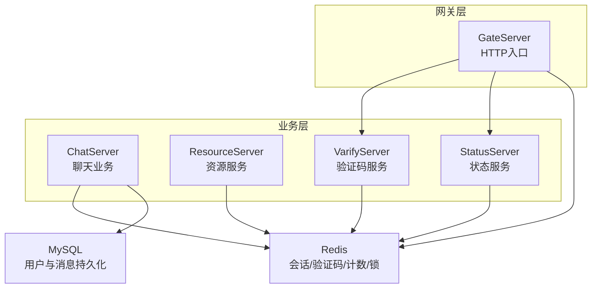
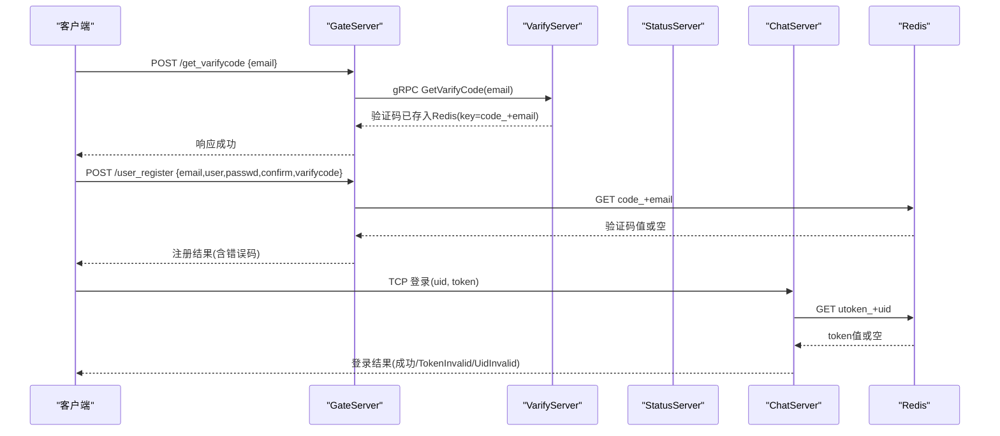
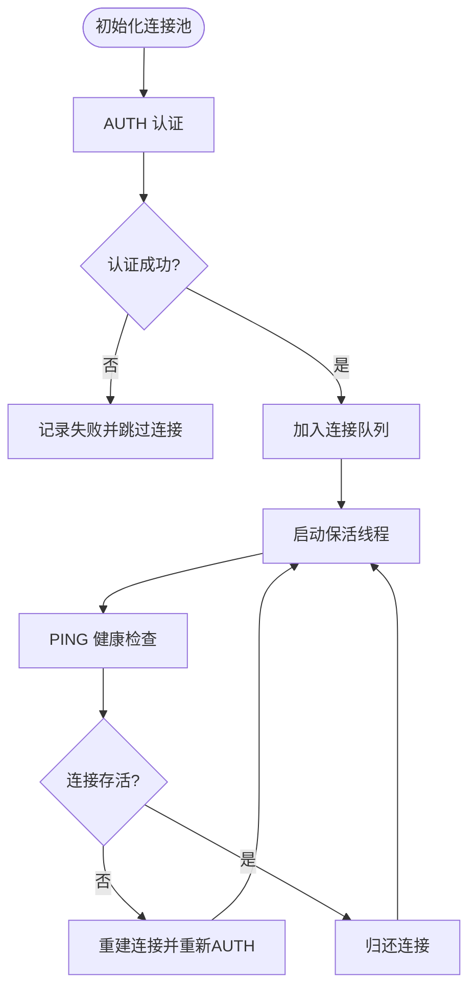
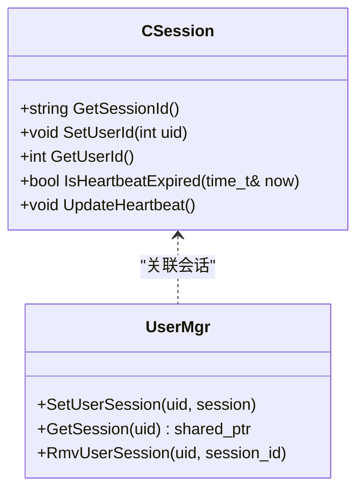
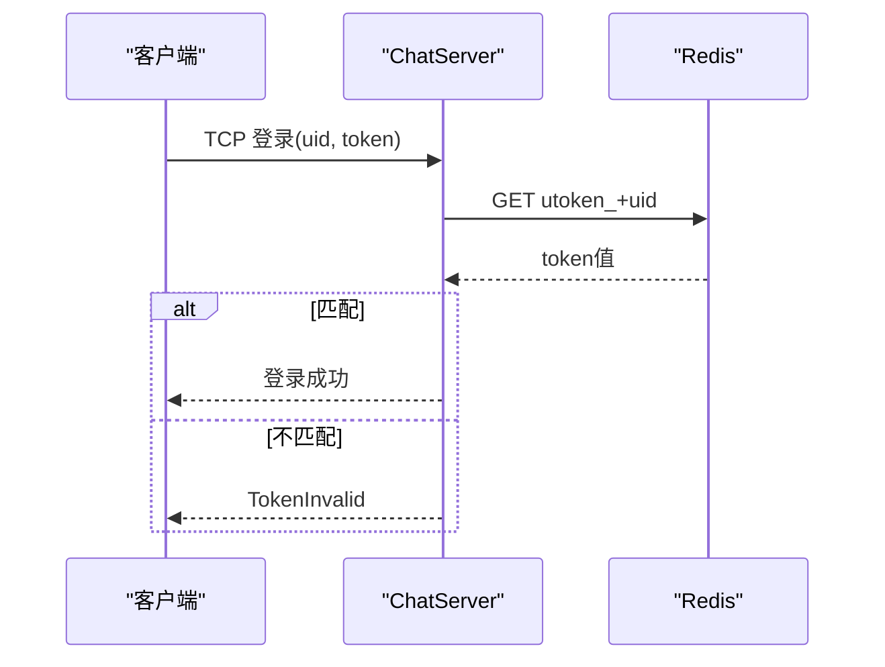
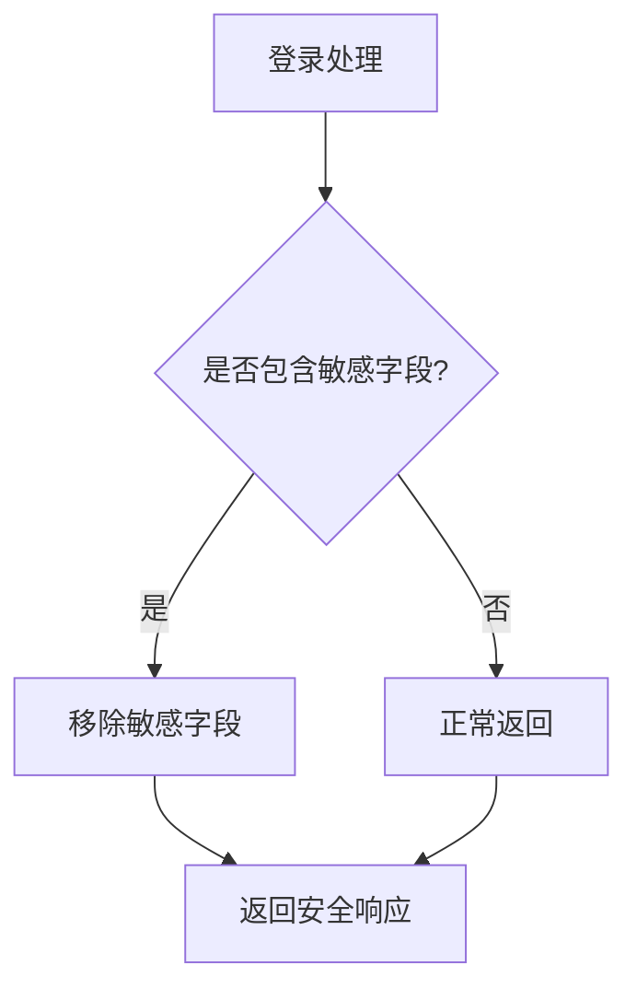
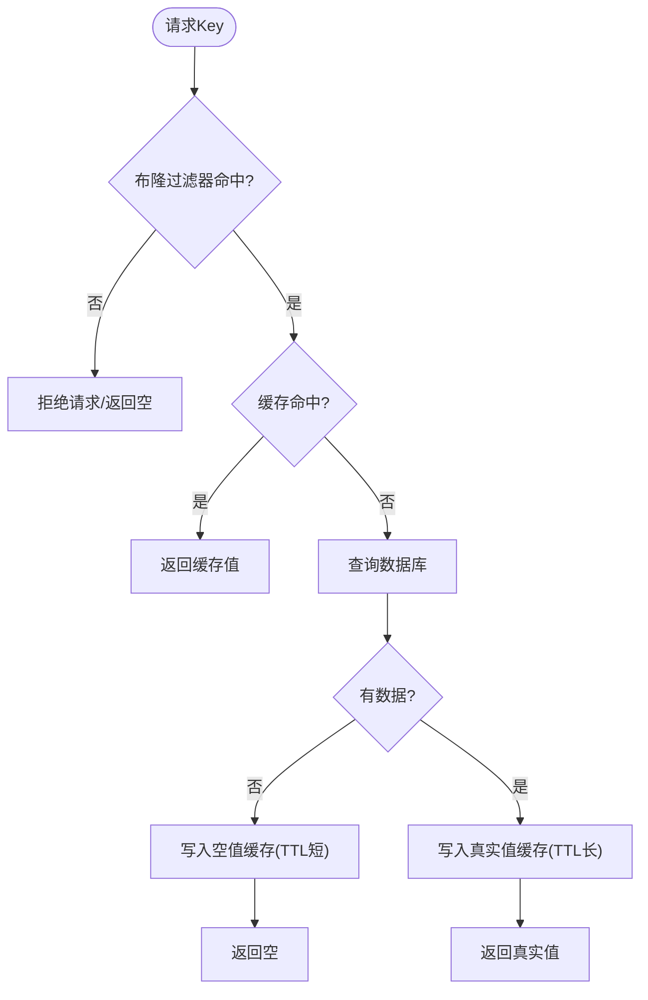
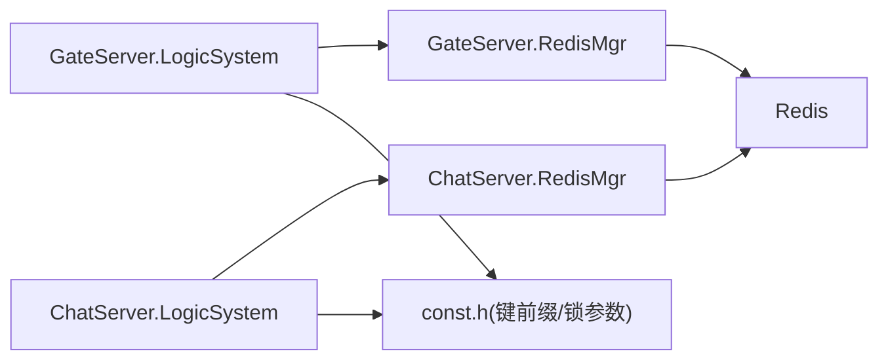

# 缓存数据安全

<cite>
**本文引用的文件**   
- [RedisMgr.h](file://server/ChatServer/include/RedisMgr.h)
- [RedisMgr.cpp](file://server/ChatServer/src/RedisMgr.cpp)
- [const.h](file://server/ChatServer/include/const.h)
- [config.ini](file://server/ChatServer/config/chatserver1.ini)
- [LogicSystem.cpp](file://server/ChatServer/src/LogicSystem.cpp)
- [CSession.h](file://server/ChatServer/include/CSession.h)
- [UserMgr.h](file://server/ChatServer/include/UserMgr.h)
- [RedisMgr.h](file://server/GateServer/include/RedisMgr.h)
- [RedisMgr.cpp](file://server/GateServer/src/RedisMgr.cpp)
- [config.ini](file://server/GateServer/config/config.ini)
- [LogicSystem.cpp](file://server/GateServer/src/LogicSystem.cpp)
- [HttpConnection.cpp](file://server/GateServer/src/HttpConnection.cpp)
</cite>

## 目录
1. [简介](#简介)
2. [项目结构](#项目结构)
3. [核心组件](#核心组件)
4. [架构总览](#架构总览)
5. [详细组件分析](#详细组件分析)
6. [依赖关系分析](#依赖关系分析)
7. [性能考量](#性能考量)
8. [故障排查指南](#故障排查指南)
9. [结论](#结论)
10. [附录](#附录)

## 简介
本文件面向LLFCChat项目的缓存安全，聚焦于Redis会话存储与敏感数据保护、缓存穿透防护、分布式缓存集群安全以及监控方案。文档基于代码仓库中的Redis管理器实现、配置与业务逻辑进行系统性梳理，给出可操作的加固建议与最佳实践，帮助构建安全的缓存系统。

## 项目结构
本项目采用多服务架构（GateServer、ChatServer、ResourceServer、StatusServer、VarifyServer），各服务通过gRPC通信，并使用Redis作为共享缓存层。关键与安全相关的文件包括：
- ChatServer的Redis连接池与会话校验、分布式锁
- GateServer的验证码缓存与HTTP入口
- 常量定义中的键前缀与锁超时参数
- 配置文件中的Redis主机、端口、密码

**图表来源** 
- [RedisMgr.h:267-305](file://server/ChatServer/include/RedisMgr.h#L267-L305)
- [RedisMgr.cpp:1-15](file://server/ChatServer/src/RedisMgr.cpp#L1-L15)
- [config.ini:20-24](file://server/ChatServer/config/chatserver1.ini#L20-L24)
- [config.ini:15-18](file://server/GateServer/config/config.ini#L15-L18)

**章节来源**
- [RedisMgr.h:267-305](file://server/ChatServer/include/RedisMgr.h#L267-L305)
- [RedisMgr.cpp:1-15](file://server/ChatServer/src/RedisMgr.cpp#L1-L15)
- [config.ini:20-24](file://server/ChatServer/config/chatserver1.ini#L20-L24)
- [config.ini:15-18](file://server/GateServer/config/config.ini#L15-L18)

## 核心组件
- Redis连接池与会话管理
  - 连接池初始化、AUTH认证、PING保活、异常重连
  - 提供Get/Set/List/Hash/Del/Exists等基础操作
  - 分布式锁acquireLock/releaseLock封装
- 会话与Token校验
  - 登录流程中从Redis校验Token，失败返回错误码
  - 心跳机制用于检测会话存活
- 验证码缓存
  - GateServer调用VarifyServer生成验证码并写入Redis
  - 注册接口校验验证码是否过期
- 键命名与前缀规范
  - 用户IP映射、Token、基础信息、名称信息等统一前缀
  - 分布式锁前缀与计数Key

**章节来源**
- [RedisMgr.h:9-135](file://server/ChatServer/include/RedisMgr.h#L9-L135)
- [RedisMgr.cpp:19-79](file://server/ChatServer/src/RedisMgr.cpp#L19-L79)
- [const.h:81-94](file://server/ChatServer/include/const.h#L81-L94)
- [LogicSystem.cpp:116-147](file://server/ChatServer/src/LogicSystem.cpp#L116-L147)
- [CSession.h:46-51](file://server/ChatServer/include/CSession.h#L46-L51)
- [LogicSystem.cpp:107-151](file://server/GateServer/src/LogicSystem.cpp#L107-L151)

## 架构总览
下图展示登录与验证码相关的关键调用链，体现Redis在会话与验证码中的作用。

**图表来源** 
- [LogicSystem.cpp:107-151](file://server/GateServer/src/LogicSystem.cpp#L107-L151)
- [LogicSystem.cpp:152-200](file://server/GateServer/src/LogicSystem.cpp#L152-L200)
- [LogicSystem.cpp:116-147](file://server/ChatServer/src/LogicSystem.cpp#L116-L147)
- [RedisMgr.cpp:19-46](file://server/ChatServer/src/RedisMgr.cpp#L19-L46)

## 详细组件分析

### Redis连接池与会话安全
- 连接池初始化时执行AUTH认证，确保仅授权客户端访问
- 后台线程周期性对连接执行PING，检测存活；失败则重建连接并重试
- 提供非阻塞获取连接方法，避免死锁与资源耗尽
- 所有命令执行后释放reply对象并归还连接，防止内存泄漏

**图表来源** 
- [RedisMgr.h:11-48](file://server/ChatServer/include/RedisMgr.h#L11-L48)
- [RedisMgr.h:137-206](file://server/ChatServer/include/RedisMgr.h#L137-L206)

**章节来源**
- [RedisMgr.h:11-48](file://server/ChatServer/include/RedisMgr.h#L11-L48)
- [RedisMgr.h:137-206](file://server/ChatServer/include/RedisMgr.h#L137-L206)
- [RedisMgr.cpp:19-79](file://server/ChatServer/src/RedisMgr.cpp#L19-L79)

### 会话ID生成策略与过期机制
- 当前实现未直接暴露会话ID生成逻辑，但存在USER_SESSION_PREFIX常量，可用于后续扩展
- Token校验使用utoken_前缀，登录成功后由上游服务签发并写入Redis，ChatServer据此校验
- 建议在会话创建时：
  - 使用高熵随机字符串（如UUID v4）作为会话ID
  - 将会话ID与用户UID绑定，设置合理过期时间（TTL）
  - 每次请求刷新TTL，结合心跳检测清理不活跃会话

**图表来源** 
- [CSession.h:31-51](file://server/ChatServer/include/CSession.h#L31-L51)
- [UserMgr.h:12-20](file://server/ChatServer/include/UserMgr.h#L12-L20)

**章节来源**
- [const.h:88-89](file://server/ChatServer/include/const.h#L88-L89)
- [CSession.h:31-51](file://server/ChatServer/include/CSession.h#L31-L51)
- [UserMgr.h:12-20](file://server/ChatServer/include/UserMgr.h#L12-L20)

### 会话劫持防护
- 登录流程中严格校验Token一致性，不一致返回TokenInvalid
- 建议增强措施：
  - 绑定客户端指纹（设备ID/IP段）到会话，异常变更即失效
  - 启用HTTPS/TLS，防止中间人攻击
  - 限制同一账号并发会话数，异地登录踢下线

**图表来源** 
- [LogicSystem.cpp:116-147](file://server/ChatServer/src/LogicSystem.cpp#L116-L147)
- [RedisMgr.cpp:19-46](file://server/ChatServer/src/RedisMgr.cpp#L19-L46)

**章节来源**
- [LogicSystem.cpp:116-147](file://server/ChatServer/src/LogicSystem.cpp#L116-L147)
- [RedisMgr.cpp:19-46](file://server/ChatServer/src/RedisMgr.cpp#L19-L46)

### 敏感数据缓存策略
- 现状：登录响应中包含pwd字段，属于敏感信息，不应缓存或回传
- 建议：
  - 禁止缓存明文密码；如需缓存，必须加密且最小化字段
  - 移除登录响应中的敏感字段，仅返回必要信息
  - 临时数据（验证码、一次性令牌）设置短TTL并自动清理
  - 键命名规范：区分环境（dev/test/prod），使用前缀隔离

**图表来源** 
- [LogicSystem.cpp:150-166](file://server/ChatServer/src/LogicSystem.cpp#L150-L166)

**章节来源**
- [LogicSystem.cpp:150-166](file://server/ChatServer/src/LogicSystem.cpp#L150-L166)

### 缓存穿透防护
- 现状：GET/EXISTS等操作未对空值做特殊处理，可能引发穿透
- 建议：
  - 对查询结果为空的热点Key设置短TTL空值缓存
  - 引入布隆过滤器拦截非法Key请求
  - 限流与熔断保护热点Key，避免雪崩

**图表来源** 
- [RedisMgr.cpp:334-359](file://server/ChatServer/src/RedisMgr.cpp#L334-L359)

**章节来源**
- [RedisMgr.cpp:334-359](file://server/ChatServer/src/RedisMgr.cpp#L334-L359)

### 缓存集群安全
- 节点间通信加密：建议使用Redis TLS或网络层TLS
- 访问控制列表：配置ACL，最小权限原则
- 网络安全组：限制内网访问，禁用公网暴露
- 配置示例（参考现有INI）：
  - Host、Port、Passwd需严格保密，生产环境使用密钥管理服务
  - 不同服务使用独立Redis实例或DB号隔离

**章节来源**
- [config.ini:20-24](file://server/ChatServer/config/chatserver1.ini#L20-L24)
- [config.ini:15-18](file://server/GateServer/config/config.ini#L15-L18)

### 验证码与临时数据保护
- GateServer调用VarifyServer生成验证码并写入Redis，key为CODEPREFIX+email
- 注册接口校验验证码是否过期，失败返回错误
- 建议：
  - 验证码TTL设置为分钟级，使用后删除
  - 限制发送频率，防刷
  - 记录审计日志，便于追踪

**章节来源**
- [LogicSystem.cpp:107-151](file://server/GateServer/src/LogicSystem.cpp#L107-L151)
- [LogicSystem.cpp:152-200](file://server/GateServer/src/LogicSystem.cpp#L152-L200)
- [const.h](file://server/GateServer/include/const.h#L63)

## 依赖关系分析
- ChatServer与GateServer均依赖RedisMgr进行缓存操作
- LogicSystem在各服务中编排业务流程，调用RedisMgr与外部服务
- 常量定义集中管理键前缀与锁超时参数，降低耦合

**图表来源** 
- [LogicSystem.cpp:1-20](file://server/GateServer/src/LogicSystem.cpp#L1-L20)
- [LogicSystem.cpp:1-15](file://server/ChatServer/src/LogicSystem.cpp#L1-L15)
- [const.h:81-94](file://server/ChatServer/include/const.h#L81-L94)

**章节来源**
- [LogicSystem.cpp:1-20](file://server/GateServer/src/LogicSystem.cpp#L1-L20)
- [LogicSystem.cpp:1-15](file://server/ChatServer/src/LogicSystem.cpp#L1-L15)
- [const.h:81-94](file://server/ChatServer/include/const.h#L81-L94)

## 性能考量
- 连接池大小应根据QPS与延迟调优，避免过多上下文切换
- PING间隔与重连策略需平衡资源占用与可用性
- 热点Key使用本地缓存+Redis二级缓存，减少跨进程开销
- 批量操作与管道化命令提升吞吐

[本节为通用指导，无需特定文件引用]

## 故障排查指南
- 连接失败：检查AUTH密码、网络连通性、防火墙规则
- 会话无效：核对Token是否一致，检查Redis中utoken_键是否存在
- 验证码过期：确认TTL设置与发送频率限制
- 内存泄漏：确保freeReplyObject与连接归还路径覆盖所有异常分支

**章节来源**
- [RedisMgr.h:137-206](file://server/ChatServer/include/RedisMgr.h#L137-L206)
- [RedisMgr.cpp:19-79](file://server/ChatServer/src/RedisMgr.cpp#L19-L79)
- [LogicSystem.cpp:116-147](file://server/ChatServer/src/LogicSystem.cpp#L116-L147)

## 结论
通过对Redis连接池、会话校验、验证码缓存与分布式锁的分析，LLFCChat已具备基础的缓存安全能力。建议进一步实施敏感数据脱敏、空值缓存与布隆过滤器、TLS加密与ACL访问控制，以全面提升缓存系统的安全性与稳定性。

[本节为总结，无需特定文件引用]

## 附录
- 安全配置清单
  - 启用Redis AUTH与TLS
  - 配置ACL最小权限
  - 限制网络访问白名单
  - 定期轮换密码与证书
- 监控指标
  - Redis连接池使用率、PING成功率
  - 会话数量与过期率
  - 验证码发送量与失败率
  - 热点Key命中率与延迟

[本节为补充信息，无需特定文件引用]