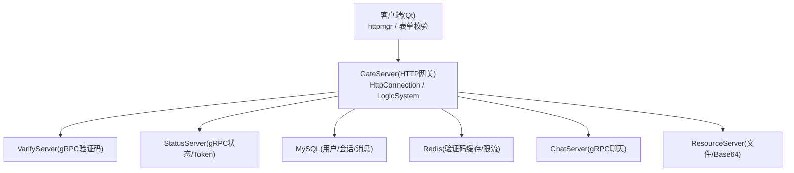
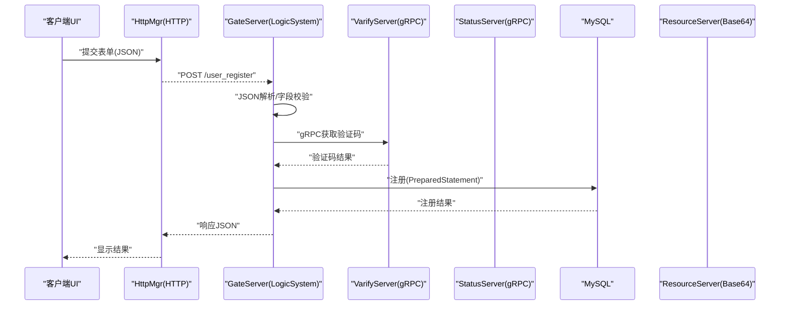
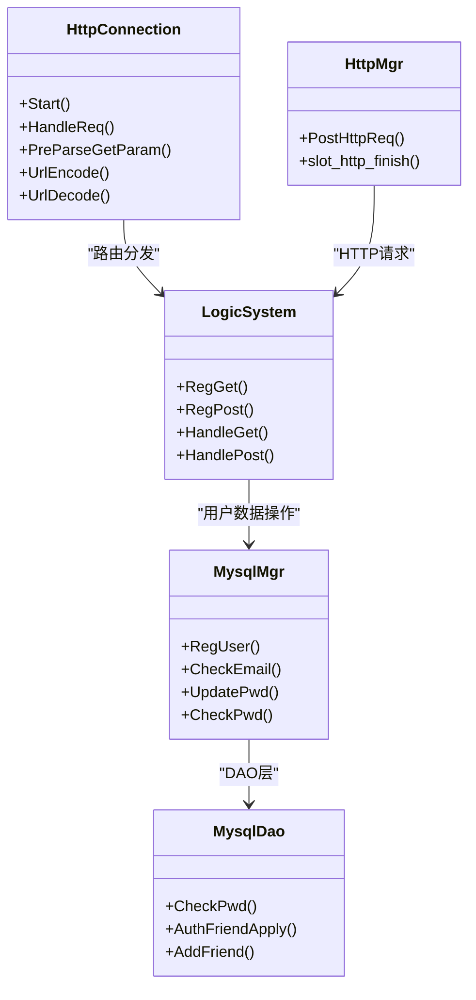

# 输入验证与防护

<cite>
**本文引用的文件**   
- [HttpConnection.cpp](file://server/GateServer/src/HttpConnection.cpp)
- [LogicSystem.cpp](file://server/GateServer/src/LogicSystem.cpp)
- [MysqlMgr.h](file://server/GateServer/include/MysqlMgr.h)
- [MysqlDao.cpp（ChatServer）](file://server/ChatServer/src/MysqlDao.cpp)
- [MysqlDao.cpp（ResourceServer）](file://server<ResourceServer/src/MysqlDao.cpp)
- [base64.cpp](file://server\ResourceServer/src/base64.cpp)
- [FileWorker.cpp](file://server\ResourceServer/src/FileWorker.cpp)
- [httpmgr.h](file://client/llfcchat/include/httpmgr.h)
- [httpmgr.cpp](file://client/llfcchat/src/httpmgr.cpp)
- [global.h](file://client/llfcchat/include/global.h)
- [resetdialog.cpp](file://client/llfcchat/src/resetdialog.cpp)
- [registerdialog.cpp](file://client/llfcchat/src/registerdialog.cpp)
- [tcpmgr.cpp](file://client/llfcchat/src/tcpmgr.cpp)
- [day12-注册界面完善.md](file://开发文档/day12-注册界面完善.md)
- [day14-登录功能.md](file://开发文档/day14-登录功能.md)
- [day29-好友认证和聊天通信.md](file://开发文档/day29-好友认证和聊天通信.md)
</cite>

## 目录
1. [简介](#简介)
2. [项目结构](#项目结构)
3. [核心组件](#核心组件)
4. [架构总览](#架构总览)
5. [详细组件分析](#详细组件分析)
6. [依赖关系分析](#依赖关系分析)
7. [性能考虑](#性能考虑)
8. [故障排查指南](#故障排查指南)
9. [结论](#结论)
10. [附录](#附录)

## 简介
本安全文档聚焦于 LLFCChat 的输入验证与防护，覆盖 SQL 注入、XSS、CSRF 等常见 Web 攻击的防护策略，并详细说明前端输入校验、后端参数校验、恶意请求过滤机制。文档还包含正则表达式验证、数据类型检查、长度限制策略，以及 API 接口安全防护、请求频率限制与异常输入处理的最佳实践。通过代码级分析与流程图，帮助读者理解输入清洗、输出编码与上下文相关的安全处理方式。

## 项目结构
LLFCChat 采用多服务架构：GateServer 作为 HTTP 网关，负责路由分发与基础校验；ChatServer/StatusServer/ResourceServer 分别承担聊天、状态分配与资源传输；客户端使用 Qt 实现 UI 与网络交互。输入验证贯穿“前端表单校验 → HTTP 网关解析与校验 → gRPC/DAO 层数据库操作 → 输出编码”的全链路。

**图示来源** 
- [HttpConnection.cpp:133-194](file://server/GateServer/src/HttpConnection.cpp#L133-L194)
- [LogicSystem.cpp:36-396](file://server/GateServer/src/LogicSystem.cpp#L36-L396)

**章节来源**
- [HttpConnection.cpp:1-225](file://server/GateServer/src/HttpConnection.cpp#L1-L225)
- [LogicSystem.cpp:1-467](file://server/GateServer/src/LogicSystem.cpp#L1-L467)

## 核心组件
- 前端输入校验：Qt 表单中使用 QRegularExpression 进行邮箱、密码、验证码等格式校验，并进行长度限制与空值检查。
- HTTP 网关解析与校验：GateServer 解析 GET/POST，URL 解码，JSON 解析与字段存在性校验，错误码统一返回。
- DAO 层安全访问：所有数据库操作均使用 PreparedStatement 绑定参数，避免 SQL 注入。
- 输出编码：文件传输使用 Base64 编码，避免二进制数据在文本协议中造成解析问题。
- 认证与令牌：登录流程通过 StatusServer 分配 Token，后续连接需携带 Token 进行鉴权。

**章节来源**
- [httpmgr.h:1-34](file://client/llfcchat/include/httpmgr.h#L1-L34)
- [httpmgr.cpp:1-62](file://client/llfcchat/src/httpmgr.cpp#L1-L62)
- [global.h:91-111](file://client/llfcchat/include/global.h#L91-L111)
- [MysqlMgr.h:1-20](file://server/GateServer/include/MysqlMgr.h#L1-L20)
- [MysqlDao.cpp（ChatServer）:329-386](file://server/ChatServer/src/MysqlDao.cpp#L329-L386)
- [MysqlDao.cpp（ResourceServer）:120-349](file://server<ResourceServer/src/MysqlDao.cpp#L120-L349)
- [base64.cpp:111-282](file://server\ResourceServer/src/base64.cpp#L111-L282)
- [FileWorker.cpp:628-659](file://server\ResourceServer/src/FileWorker.cpp#L628-L659)

## 架构总览
下图展示从客户端到各服务的完整调用链，突出输入校验与安全控制点。

**图示来源** 
- [LogicSystem.cpp:157-233](file://server/GateServer/src/LogicSystem.cpp#L157-L233)
- [MysqlDao.cpp（ResourceServer）:120-210](file://server<ResourceServer/src/MysqlDao.cpp#L120-L210)

## 详细组件分析

### 前端输入验证（正则、长度、空值）
- 邮箱校验：使用 QRegularExpression 匹配标准邮箱格式，失败时提示“邮箱地址不正确”。
- 密码校验：长度限制 6~15，字符集限制为字母、数字与部分特殊字符，非法字符提示“不能包含非法字符”。
- 验证码校验：非空检查，为空提示“验证码不能为空”。
- 用户名校验：非空检查，为空提示“用户名不能为空”。

这些校验在注册与重置密码对话框中实现，确保无效输入不会进入网络层。

**章节来源**
- [resetdialog.cpp:94-114](file://client/llfcchat/src/resetdialog.cpp#L94-L114)
- [registerdialog.cpp:142-179](file://client/llfcchat/src/registerdialog.cpp#L142-L179)
- [day12-注册界面完善.md:133-203](file://开发文档/day12-注册界面完善.md#L133-L203)

### HTTP 网关参数解析与校验
- GET 请求：解析 URI 查询字符串，URL 解码后存入键值对，便于后续逻辑使用。
- POST 请求：读取请求体 JSON，解析失败或字段缺失时返回统一错误码（如 Error_Json）。
- 路由分发：根据 URL 路径查找对应处理器，未找到则返回 404。

该层是输入清洗的第一道防线，确保下游只接收合法的结构化数据。

**章节来源**
- [HttpConnection.cpp:96-130](file://server/GateServer/src/HttpConnection.cpp#L96-L130)
- [HttpConnection.cpp:133-194](file://server/GateServer/src/HttpConnection.cpp#L133-L194)
- [LogicSystem.cpp:40-103](file://server/GateServer/src/LogicSystem.cpp#L40-L103)

### 注册与重置密码流程（验证码与数据库校验）
- 注册流程：
  - 校验两次密码一致。
  - 从 Redis 获取验证码并比对，防止过期与错误。
  - 调用 MySQL 注册用户，内部检查用户名/邮箱唯一性。
- 重置密码流程：
  - 校验验证码是否过期与正确。
  - 校验用户名与邮箱是否匹配，防止恶意重置他人密码。
  - 更新数据库中的密码。

上述流程在 LogicSystem 中实现，错误码统一返回，便于前端提示。

**章节来源**
- [LogicSystem.cpp:157-233](file://server/GateServer/src/LogicSystem.cpp#L157-L233)
- [LogicSystem.cpp:243-316](file://server/GateServer/src/LogicSystem.cpp#L243-L316)

### 登录流程（Token 鉴权）
- 登录接口校验邮箱与密码，成功后通过 StatusServer 分配 ChatServer 与 Token。
- 客户端后续连接需携带 Token，服务器端进行 Token 有效性校验。

该流程确保只有合法用户才能建立聊天连接。

**章节来源**
- [LogicSystem.cpp:330-395](file://server/GateServer/src/LogicSystem.cpp#L330-L395)
- [day14-登录功能.md:202-253](file://开发文档/day14-登录功能.md#L202-L253)

### 数据库访问安全（防 SQL 注入）
- 所有数据库操作均使用 PreparedStatement，并通过 setString/setInt 绑定参数，避免 SQL 拼接。
- 事务回滚：当执行失败时进行回滚，保证数据一致性。
- 错误捕获：捕获 SQLException，记录错误信息并返回失败。

这是防止 SQL 注入的核心措施。

**章节来源**
- [MysqlDao.cpp（ChatServer）:329-386](file://server/ChatServer/src/MysqlDao.cpp#L329-L386)
- [MysqlDao.cpp（ResourceServer）:120-210](file://server<ResourceServer/src/MysqlDao.cpp#L120-L210)
- [MysqlDao.cpp（ResourceServer）:212-245](file://server<ResourceServer/src/MysqlDao.cpp#L212-L245)
- [MysqlDao.cpp（ResourceServer）:302-349](file://server<ResourceServer/src/MysqlDao.cpp#L302-L349)

### 输出编码（Base64）
- 文件传输使用 Base64 编码，确保二进制数据在文本协议中安全传输。
- 支持 URL 安全变体与 PEM/MIME 格式，适应不同场景。

**章节来源**
- [base64.cpp:111-282](file://server\ResourceServer/src/base64.cpp#L111-L282)
- [FileWorker.cpp:628-659](file://server\ResourceServer/src/FileWorker.cpp#L628-L659)

### 客户端 HTTP 管理（请求封装与错误处理）
- HttpMgr 封装 QNetworkAccessManager，设置 Content-Type 为 application/json。
- 网络错误时返回 ERR_NETWORK，成功时返回 SUCCESS 与响应体。
- 按模块分发信号，供 UI 层处理。

**章节来源**
- [httpmgr.h:1-34](file://client/llfcchat/include/httpmgr.h#L1-L34)
- [httpmgr.cpp:1-62](file://client/llfcchat/src/httpmgr.cpp#L1-L62)

### 聊天与通知（TCP 消息处理）
- 客户端处理 ID_AUTH_FRIEND_RSP 与 ID_NOTIFY_AUTH_FRIEND_REQ，解析 JSON 并更新 UI。
- 错误处理包括 JSON 解析失败与错误码非 SUCCESS 的情况。

**章节来源**
- [tcpmgr.cpp:290-333](file://client/llfcchat/src/tcpmgr.cpp#L290-L333)
- [day29-好友认证和聊天通信.md:340-420](file://开发文档/day29-好友认证和聊天通信.md#L340-L420)

## 依赖关系分析

**图示来源** 
- [HttpConnection.cpp:1-225](file://server/GateServer/src/HttpConnection.cpp#L1-L225)
- [LogicSystem.cpp:1-467](file://server/GateServer/src/LogicSystem.cpp#L1-L467)
- [MysqlMgr.h:1-20](file://server/GateServer/include/MysqlMgr.h#L1-L20)
- [MysqlDao.cpp（ResourceServer）:120-349](file://server<ResourceServer/src/MysqlDao.cpp#L120-L349)
- [httpmgr.h:1-34](file://client/llfcchat/include/httpmgr.h#L1-L34)

**章节来源**
- [LogicSystem.cpp:406-467](file://server/GateServer/src/LogicSystem.cpp#L406-L467)
- [MysqlMgr.h:1-20](file://server/GateServer/include/MysqlMgr.h#L1-L20)

## 性能考虑
- 数据库连接池：MysqlMgr 使用连接池减少连接开销。
- 异步 I/O：GateServer 使用 Boost.Asio 异步读写，提高并发能力。
- 缓存：Redis 用于验证码缓存，降低数据库压力。
- 分块传输：文件传输分块与续传，提升大文件传输效率。

[本节为通用指导，无需特定文件引用]

## 故障排查指南
- JSON 解析错误：检查请求体是否为有效 JSON，确认字段名与类型。
- 验证码过期：确认 Redis 中验证码是否存在且未过期。
- 数据库异常：查看 SQLException 日志，检查 SQL 语句与参数绑定。
- 网络错误：检查客户端网络状态与服务器端口可达性。

**章节来源**
- [LogicSystem.cpp:68-103](file://server/GateServer/src/LogicSystem.cpp#L68-L103)
- [MysqlDao.cpp（ResourceServer）:120-125](file://server<ResourceServer/src/MysqlDao.cpp#L120-L125)
- [httpmgr.cpp:20-37](file://client/llfcchat/src/httpmgr.cpp#L20-L37)

## 结论
LLFCChat 通过前端正则校验、后端 JSON 解析与字段校验、数据库 PreparedStatement 绑定、Base64 输出编码与 Token 鉴权，构建了较为完整的输入验证与防护体系。建议在生产环境中进一步引入请求频率限制、CORS 白名单、内容安全策略（CSP）与更严格的输入白名单校验，以提升整体安全性。

[本节为总结，无需特定文件引用]

## 附录
- 常见攻击防护要点：
  - SQL 注入：始终使用参数化查询，禁止字符串拼接 SQL。
  - XSS：对用户输入进行转义与输出编码，避免直接渲染 HTML。
  - CSRF：使用 Token 校验与 SameSite Cookie 策略。
  - 输入长度限制：对文本字段设置合理上限，防止缓冲区溢出。
  - 错误信息脱敏：避免泄露敏感信息，返回统一错误码。

[本节为通用指导，无需特定文件引用]