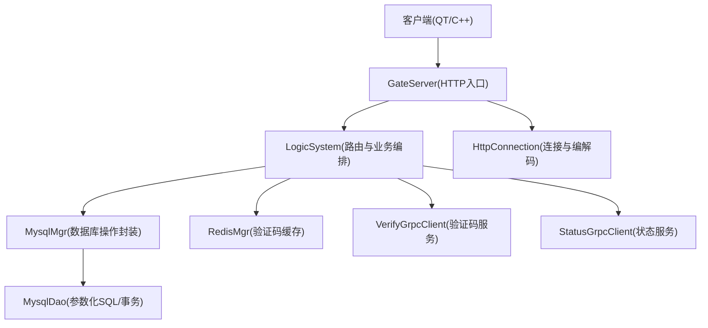
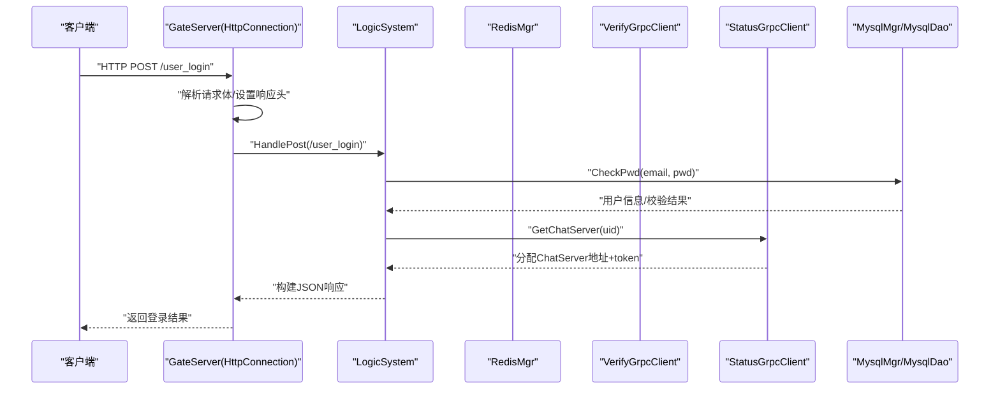
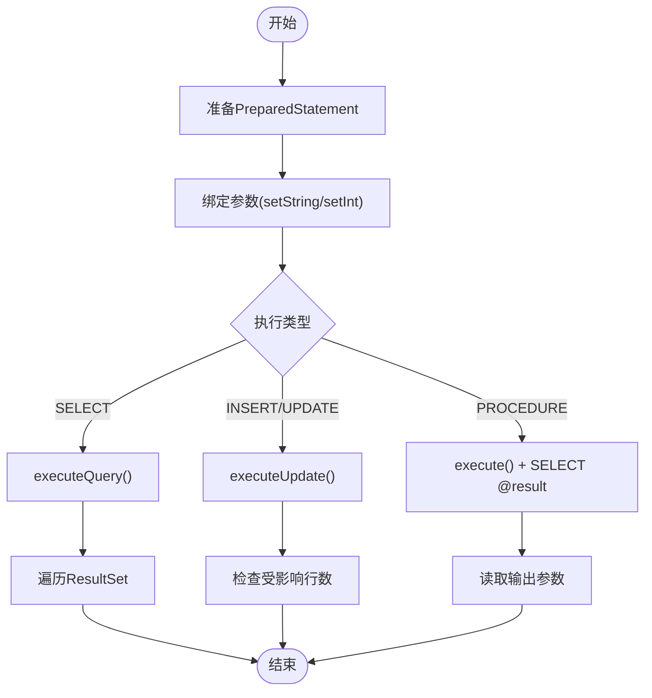
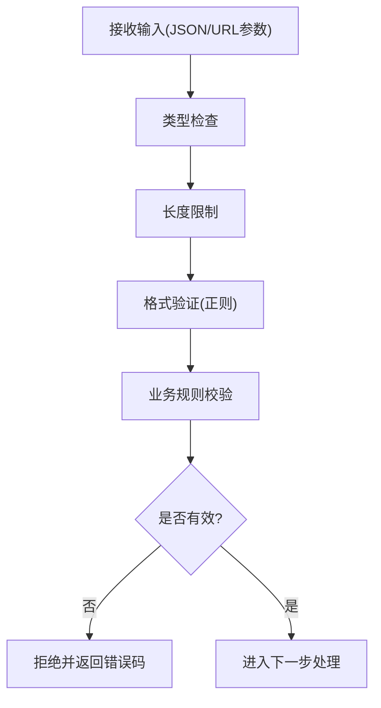
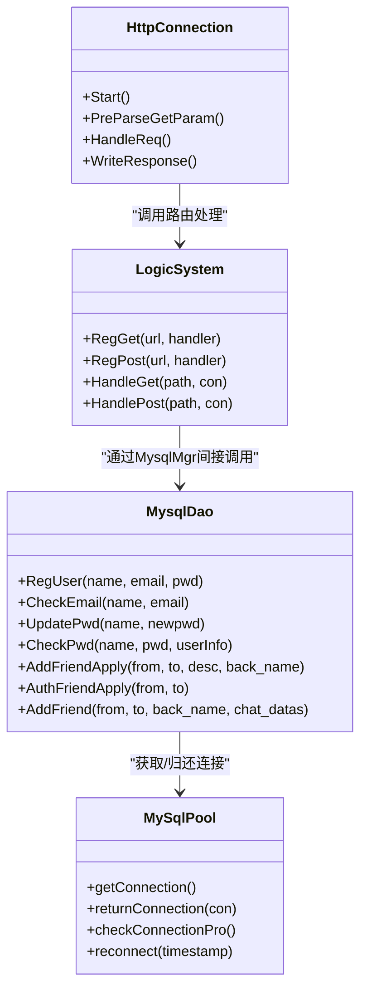

# 输入验证防护

<cite>
**本文引用的文件**   
- [MysqlDao.h](file://server/ChatServer/include/MysqlDao.h)
- [MysqlDao.cpp](file://server/ChatServer/src/MysqlDao.cpp)
- [HttpConnection.h](file://server/GateServer/include/HttpConnection.h)
- [HttpConnection.cpp](file://server/GateServer/src/HttpConnection.cpp)
- [LogicSystem.h](file://server/GateServer/include/LogicSystem.h)
- [LogicSystem.cpp](file://server/GateServer/src/LogicSystem.cpp)
- [logindialog.cpp](file://client/llfcchat/src/logindialog.cpp)
- [day12-注册界面完善.md](file://开发文档/day12-注册界面完善.md)
</cite>

## 目录
1. [简介](#简介)
2. [项目结构](#项目结构)
3. [核心组件](#核心组件)
4. [架构总览](#架构总览)
5. [详细组件分析](#详细组件分析)
6. [依赖关系分析](#依赖关系分析)
7. [性能考虑](#性能考虑)
8. [故障排查指南](#故障排查指南)
9. [结论](#结论)
10. [附录](#附录)

## 简介
本文件面向LLFCChat项目的输入验证与安全防护，聚焦以下方面：
- SQL注入防护：参数化查询、预编译语句、事务与锁的使用规范。
- XSS防护：HTML实体编码、内容安全策略（CSP）、脚本过滤建议。
- CSRF防护：令牌校验、同源策略、请求头检查等跨站请求伪造防护措施。
- 输入数据验证框架：数据类型检查、长度限制、格式验证、业务规则验证的完整流程。
- 代码示例与安全编码规范：结合仓库现有实现，给出可落地的最佳实践与改进建议。

## 项目结构
本项目包含客户端（Qt/C++）与多个服务端（GateServer、ChatServer、ResourceServer、StatusServer、VarifyServer）。输入验证与安全防护的关键点集中在：
- GateServer：HTTP入口，负责请求解析、路由分发、基础校验与响应构造。
- ChatServer：数据库访问层，使用MySQL JDBC进行参数化查询与事务控制。
- 客户端：前端输入校验（正则、长度、非空等），减少无效请求进入后端。

图表来源
- [HttpConnection.cpp:133-194](file://server/GateServer/src/HttpConnection.cpp#L133-L194)
- [LogicSystem.cpp:36-406](file://server/GateServer/src/LogicSystem.cpp#L36-L406)
- [MysqlDao.cpp:19-124](file://server/ChatServer/src/MysqlDao.cpp#L19-L124)

章节来源
- [HttpConnection.h:1-36](file://server/GateServer/include/HttpConnection.h#L1-L36)
- [HttpConnection.cpp:1-225](file://server/GateServer/src/HttpConnection.cpp#L1-L225)
- [LogicSystem.h:1-24](file://server/GateServer/include/LogicSystem.h#L1-L24)
- [LogicSystem.cpp:1-477](file://server/GateServer/src/LogicSystem.cpp#L1-L477)
- [MysqlDao.h:1-270](file://server/ChatServer/include/MysqlDao.h#L1-L270)
- [MysqlDao.cpp:1-800](file://server/ChatServer/src/MysqlDao.cpp#L1-L800)

## 核心组件
- HTTP连接与请求处理（GateServer）
  - HttpConnection：异步读取请求、URL与查询参数解析、响应写入、超时控制。
  - LogicSystem：路由注册与分发，统一处理GET/POST请求，调用后端服务。
- 数据库访问（ChatServer）
  - MysqlDao：基于JDBC的参数化查询、存储过程调用、事务与并发控制。
- 客户端输入校验
  - logindialog.cpp与开发文档中的校验逻辑：正则、长度、非空等。

章节来源
- [HttpConnection.cpp:96-130](file://server/GateServer/src/HttpConnection.cpp#L96-L130)
- [LogicSystem.cpp:416-477](file://server/GateServer/src/LogicSystem.cpp#L416-L477)
- [MysqlDao.cpp:19-124](file://server/ChatServer/src/MysqlDao.cpp#L19-L124)
- [logindialog.cpp:143-166](file://client/llfcchat/src/logindialog.cpp#L143-L166)
- [day12-注册界面完善.md:133-203](file://开发文档/day12-注册界面完善.md#L133-L203)

## 架构总览
下图展示从客户端到GateServer再到ChatServer的数据流与关键安全控制点。

图表来源
- [HttpConnection.cpp:133-194](file://server/GateServer/src/HttpConnection.cpp#L133-L194)
- [LogicSystem.cpp:338-405](file://server/GateServer/src/LogicSystem.cpp#L338-L405)
- [MysqlDao.cpp:126-167](file://server/ChatServer/src/MysqlDao.cpp#L126-L167)

## 详细组件分析

### SQL注入防护机制
- 参数化查询与预编译语句
  - 所有涉及用户输入的SQL均通过prepareStatement与setXxx绑定参数，避免字符串拼接。
  - 典型用法包括注册、密码校验、好友申请、聊天消息插入等。
- 存储过程调用
  - 注册接口通过CALL reg_user(...)并设置会话变量获取输出结果。
- 事务与并发控制
  - AddFriend使用事务、FOR UPDATE行级锁、固定顺序插入避免死锁。
  - 错误路径统一rollback，保证一致性。

图表来源
- [MysqlDao.cpp:19-57](file://server/ChatServer/src/MysqlDao.cpp#L19-L57)
- [MysqlDao.cpp:59-94](file://server/ChatServer/src/MysqlDao.cpp#L59-L94)
- [MysqlDao.cpp:96-124](file://server/ChatServer/src/MysqlDao.cpp#L96-L124)
- [MysqlDao.cpp:169-209](file://server/ChatServer/src/MysqlDao.cpp#L169-L209)
- [MysqlDao.cpp:247-504](file://server/ChatServer/src/MysqlDao.cpp#L247-L504)

章节来源
- [MysqlDao.cpp:19-124](file://server/ChatServer/src/MysqlDao.cpp#L19-L124)
- [MysqlDao.cpp:169-209](file://server/ChatServer/src/MysqlDao.cpp#L169-L209)
- [MysqlDao.cpp:247-504](file://server/ChatServer/src/MysqlDao.cpp#L247-L504)

### XSS攻击防护
- 现状与风险
  - GateServer在响应中设置了Access-Control-Allow-Origin为“*”，存在跨域开放风险。
  - 未显式设置Content-Security-Policy，浏览器端渲染可能存在XSS风险。
  - 若将用户输入直接作为HTML返回，可能触发脚本执行。
- 建议措施
  - 对所有用户输入进行HTML实体编码后再输出到页面或富文本。
  - 设置严格的CSP策略，限制脚本来源与执行环境。
  - 对富文本采用白名单过滤，禁止危险标签与事件属性。
  - 在HTTP响应中增加X-Content-Type-Options、X-Frame-Options等安全头。

章节来源
- [HttpConnection.cpp:138-140](file://server/GateServer/src/HttpConnection.cpp#L138-L140)

### CSRF攻击防护
- 现状与风险
  - 当前GateServer允许任意来源跨域（Access-Control-Allow-Origin: *），缺少CSRF令牌与同源校验。
  - 登录、重置密码等敏感接口未强制校验Referer/Origin与自定义请求头。
- 建议措施
  - 引入CSRF Token：在表单或API请求中携带一次性令牌，服务端校验。
  - 严格同源策略：校验Request Origin/Referer，仅允许受信任域名。
  - 敏感操作要求双重提交或自定义Header（如X-CSRF-Token）。
  - 对Cookie启用SameSite与Secure标志，防止跨站携带。

章节来源
- [HttpConnection.cpp:138-140](file://server/GateServer/src/HttpConnection.cpp#L138-L140)

### 输入数据验证框架
- 客户端侧验证（前端）
  - 用户名非空、邮箱格式正则、密码长度与字符集限制、验证码非空。
  - 参考登录对话框与开发文档中的校验函数。
- 服务端侧验证（后端）
  - JSON字段存在性校验（如email、passwd、confirm、varifycode）。
  - 验证码有效性校验（Redis中是否存在且未过期、值匹配）。
  - 业务规则校验（如重置密码时用户名与邮箱必须匹配）。
- 建议增强
  - 建立统一的输入校验中间件，集中处理类型、长度、格式、业务规则。
  - 对异常输入返回标准化错误码与消息，便于前端提示。

章节来源
- [LogicSystem.cpp:161-239](file://server/GateServer/src/LogicSystem.cpp#L161-L239)
- [LogicSystem.cpp:249-324](file://server/GateServer/src/LogicSystem.cpp#L249-L324)
- [logindialog.cpp:143-166](file://client/llfcchat/src/logindialog.cpp#L143-L166)
- [day12-注册界面完善.md:133-203](file://开发文档/day12-注册界面完善.md#L133-L203)

### 具体代码示例与安全编码规范
- 参数化查询示例（路径引用）
  - 注册存储过程调用：[MysqlDao.cpp:19-57](file://server/ChatServer/src/MysqlDao.cpp#L19-L57)
  - 密码校验查询：[MysqlDao.cpp:126-167](file://server/ChatServer/src/MysqlDao.cpp#L126-L167)
  - 好友申请插入：[MysqlDao.cpp:169-209](file://server/ChatServer/src/MysqlDao.cpp#L169-L209)
  - 好友添加事务与锁：[MysqlDao.cpp:247-504](file://server/ChatServer/src/MysqlDao.cpp#L247-L504)
- 输入校验示例（路径引用）
  - 登录密码长度与正则校验：[logindialog.cpp:143-166](file://client/llfcchat/src/logindialog.cpp#L143-L166)
  - 注册与重置密码的JSON字段校验与验证码校验：[LogicSystem.cpp:161-239](file://server/GateServer/src/LogicSystem.cpp#L161-L239)、[LogicSystem.cpp:249-324](file://server/GateServer/src/LogicSystem.cpp#L249-L324)
- 安全编码规范
  - 一律使用参数化查询，禁止字符串拼接SQL。
  - 对富文本与用户可见内容进行HTML实体编码与白名单过滤。
  - 设置CSP与严格跨域策略，禁用“*”通配。
  - 敏感接口强制CSRF令牌与同源校验。
  - 统一错误码与日志脱敏，避免泄露敏感信息。

章节来源
- [MysqlDao.cpp:19-57](file://server/ChatServer/src/MysqlDao.cpp#L19-L57)
- [MysqlDao.cpp:126-167](file://server/ChatServer/src/MysqlDao.cpp#L126-L167)
- [MysqlDao.cpp:169-209](file://server/ChatServer/src/MysqlDao.cpp#L169-L209)
- [MysqlDao.cpp:247-504](file://server/ChatServer/src/MysqlDao.cpp#L247-L504)
- [logindialog.cpp:143-166](file://client/llfcchat/src/logindialog.cpp#L143-L166)
- [LogicSystem.cpp:161-239](file://server/GateServer/src/LogicSystem.cpp#L161-L239)
- [LogicSystem.cpp:249-324](file://server/GateServer/src/LogicSystem.cpp#L249-L324)

## 依赖关系分析
- GateServer依赖LogicSystem进行路由分发；LogicSystem依赖MysqlMgr、RedisMgr、VerifyGrpcClient、StatusGrpcClient。
- ChatServer的MysqlDao依赖MySqlPool进行连接池管理，内部使用JDBC进行参数化查询与事务控制。
- 客户端依赖Qt网络与JSON库进行请求发送与解析。

图表来源
- [HttpConnection.h:1-36](file://server/GateServer/include/HttpConnection.h#L1-L36)
- [LogicSystem.h:1-24](file://server/GateServer/include/LogicSystem.h#L1-L24)
- [MysqlDao.h:1-270](file://server/ChatServer/include/MysqlDao.h#L1-L270)

章节来源
- [HttpConnection.cpp:1-225](file://server/GateServer/src/HttpConnection.cpp#L1-L225)
- [LogicSystem.cpp:1-477](file://server/GateServer/src/LogicSystem.cpp#L1-L477)
- [MysqlDao.h:1-270](file://server/ChatServer/include/MysqlDao.h#L1-L270)
- [MysqlDao.cpp:1-800](file://server/ChatServer/src/MysqlDao.cpp#L1-L800)

## 性能考虑
- 数据库连接池
  - MySqlPool维护连接队列与心跳检测，定期健康检查与重连，降低连接开销。
- 分页查询优化
  - GetUserThreads使用CTE与LIMIT N+1判断是否还有下一页，减少不必要的数据传输。
- 事务与锁
  - AddFriend使用FOR UPDATE与固定顺序插入，避免死锁与重复插入，提高并发安全性。
- 建议
  - 对热点查询增加索引与缓存（Redis）。
  - 合理设置连接池大小与超时，避免资源耗尽。

章节来源
- [MysqlDao.h:25-232](file://server/ChatServer/include/MysqlDao.h#L25-L232)
- [MysqlDao.cpp:681-770](file://server/ChatServer/src/MysqlDao.cpp#L681-L770)
- [MysqlDao.cpp:247-504](file://server/ChatServer/src/MysqlDao.cpp#L247-L504)

## 故障排查指南
- SQL异常处理
  - 捕获SQLException并记录错误码与SQLState，便于定位问题。
  - 事务失败时确保rollback，避免脏数据。
- 连接池问题
  - checkConnectionPro与reconnect用于维持连接健康，关注失败计数与重连日志。
- HTTP请求处理
  - HandleReq中设置keep_alive=false与CORS头，注意调试跨域问题。
  - PreParseGetParam解析URL参数，检查UrlDecode是否正确处理特殊字符。

章节来源
- [MysqlDao.cpp:50-57](file://server/ChatServer/src/MysqlDao.cpp#L50-L57)
- [MysqlDao.cpp:87-94](file://server/ChatServer/src/MysqlDao.cpp#L87-L94)
- [MysqlDao.cpp:117-124](file://server/ChatServer/src/MysqlDao.cpp#L117-L124)
- [MysqlDao.cpp:161-167](file://server/ChatServer/src/MysqlDao.cpp#L161-L167)
- [MysqlDao.cpp:200-209](file://server/ChatServer/src/MysqlDao.cpp#L200-L209)
- [MysqlDao.cpp:486-504](file://server/ChatServer/src/MysqlDao.cpp#L486-L504)
- [HttpConnection.cpp:133-194](file://server/GateServer/src/HttpConnection.cpp#L133-L194)
- [HttpConnection.cpp:96-130](file://server/GateServer/src/HttpConnection.cpp#L96-L130)

## 结论
LLFCChat在数据库访问层已广泛采用参数化查询与事务控制，具备较好的SQL注入防护基础。GateServer的请求处理与路由分发清晰，但跨域策略过于宽松，缺乏CSRF防护与CSP配置。建议在网关层引入统一的输入校验中间件、CSRF令牌与严格的CSP策略，并对富文本输出进行HTML实体编码与白名单过滤，以全面提升系统的安全性与健壮性。

## 附录
- 常见安全威胁与对策速查
  - SQL注入：参数化查询、存储过程、最小权限账户。
  - XSS：HTML实体编码、CSP、富文本白名单过滤。
  - CSRF：CSRF令牌、同源校验、SameSite Cookie。
  - 输入验证：类型、长度、格式、业务规则四层校验。
- 参考实现路径
  - 参数化查询与事务：[MysqlDao.cpp:19-57](file://server/ChatServer/src/MysqlDao.cpp#L19-L57)、[MysqlDao.cpp:247-504](file://server/ChatServer/src/MysqlDao.cpp#L247-L504)
  - 输入校验与验证码校验：[LogicSystem.cpp:161-239](file://server/GateServer/src/LogicSystem.cpp#L161-L239)、[LogicSystem.cpp:249-324](file://server/GateServer/src/LogicSystem.cpp#L249-L324)
  - 客户端输入校验：[logindialog.cpp:143-166](file://client/llfcchat/src/logindialog.cpp#L143-L166)、[day12-注册界面完善.md:133-203](file://开发文档/day12-注册界面完善.md#L133-L203)