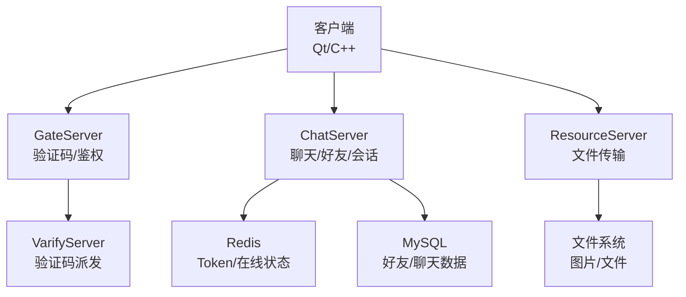
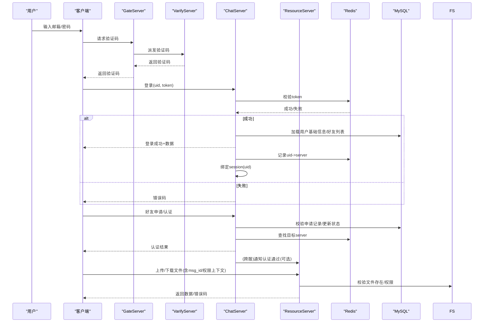
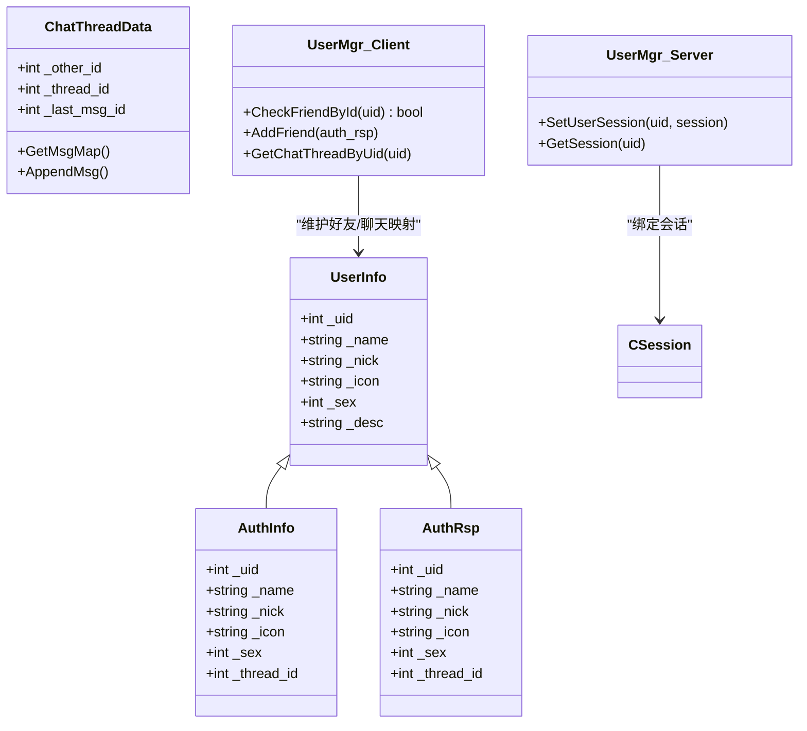
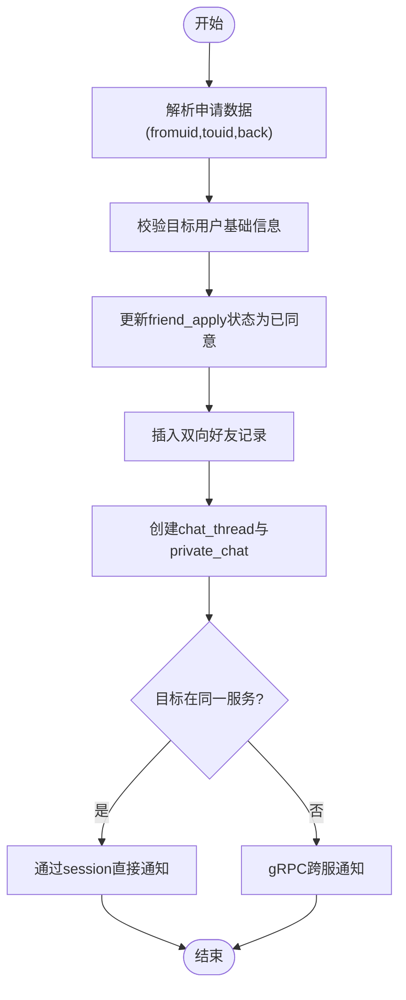
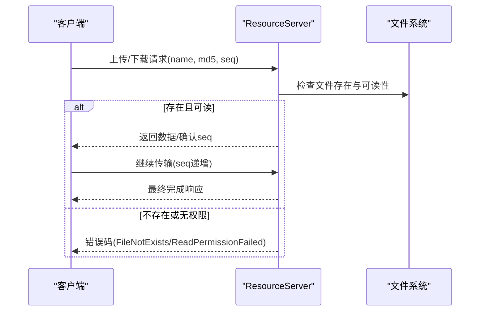
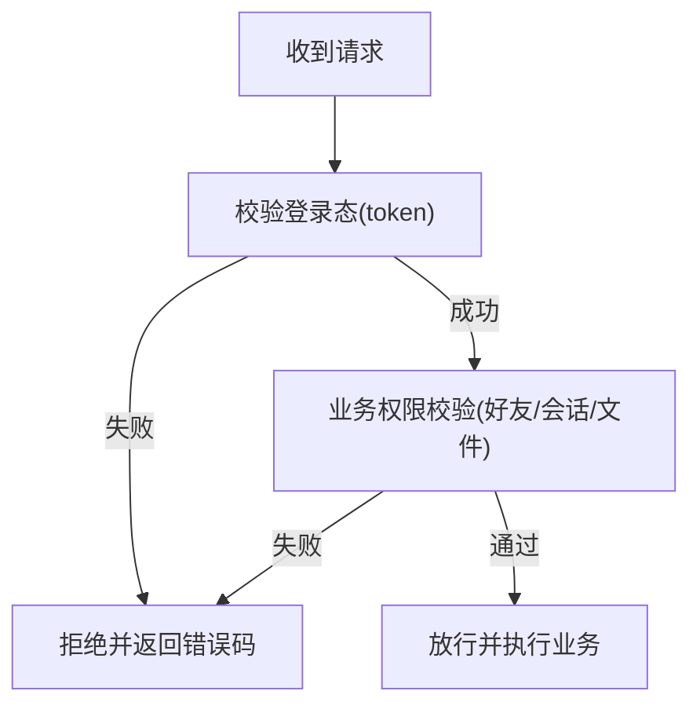
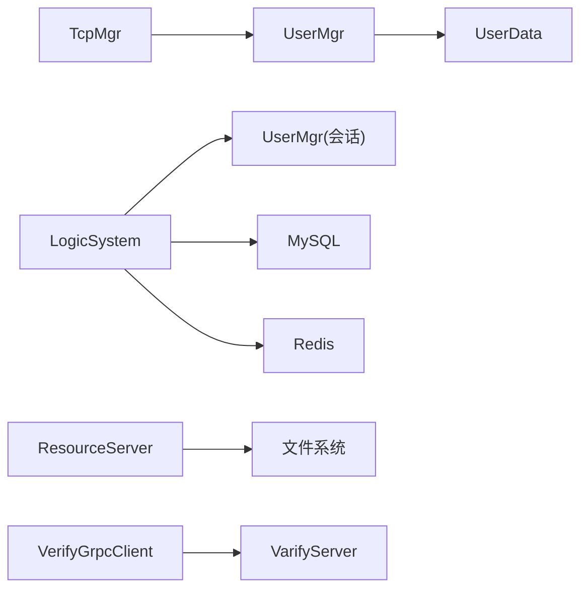

# 权限控制系统

<cite>
**本文引用的文件**   
- [README.md](file://README.md)
- [client/llfcchat/include/usermgr.h](file://client/llfcchat/include/usermgr.h)
- [client/llfcchat/src/usermgr.cpp](file://client/llfcchat/src/usermgr.cpp)
- [client/llfcchat/include/tcpmgr.h](file://client/llfcchat/include/tcpmgr.h)
- [client/llfcchat/include/userdata.h](file://client/llfcchat/include/userdata.h)
- [server/ChatServer/include/UserMgr.h](file://server/ChatServer/include/UserMgr.h)
- [server/ChatServer/include/LogicSystem.h](file://server/ChatServer/include/LogicSystem.h)
- [server/GateServer/include/VerifyGrpcClient.h](file://server/GateServer/include/VerifyGrpcClient.h)
- [server/GateServer/src/VerifyGrpcClient.cpp](file://server/GateServer/src/VerifyGrpcClient.cpp)
- [server/ResourceServer/include/const.h](file://server/ResourceServer/include/const.h)
- [server/ResourceServer/src/FileWorker.cpp](file://server/ResourceServer/src/FileWorker.cpp)
- [开发文档/day27-分布式服务设计.md](file://开发文档/day27-分布式服务设计.md)
- [开发文档/day29-好友认证和聊天通信.md](file://开发文档/day29-好友认证和聊天通信.md)
- [开发文档/day37-聊天信息存储方案.md](file://开发文档/day37-聊天信息存储方案.md)
</cite>

## 目录
1. [引言](#引言)
2. [项目结构](#项目结构)
3. [核心组件](#核心组件)
4. [架构总览](#架构总览)
5. [详细组件分析](#详细组件分析)
6. [依赖关系分析](#依赖关系分析)
7. [性能考虑](#性能考虑)
8. [故障排查指南](#故障排查指南)
9. [结论](#结论)
10. [附录](#附录)

## 引言
本安全文档聚焦 LLFCChat 的权限控制系统，围绕用户角色与权限模型、访问控制策略、好友关系验证、聊天权限控制、文件访问权限管理、用户状态检查、操作权限校验、资源访问控制、权限继承与动态调整等主题展开。文档基于仓库中的客户端与服务端代码及开发文档进行梳理，提供可操作的权限检查示例与最佳实践，帮助防止越权访问和数据泄露。

## 项目结构
LLFCChat 采用多服务架构：客户端（Qt/C++）通过 TCP 与 ChatServer 通信，GateServer 负责验证码等鉴权能力，ResourceServer 处理文件上传下载，StatusServer 维护在线状态，VarifyServer 提供验证码派发。权限相关的关键点包括：
- 登录与会话绑定：Redis 中保存 token 与 uid 映射，ChatServer 将 uid 与 session 绑定，用于后续鉴权与踢人。
- 好友关系与聊天权限：服务端在数据库层维护 friend 表与 private_chat 表，只有建立好友关系后才能创建私聊会话并互发消息。
- 文件访问权限：ResourceServer 对文件读写进行权限校验，结合消息唯一标识与进度同步确保仅授权方可见。

**图表来源** 
- [server/ChatServer/include/LogicSystem.h:1-60](file://server/ChatServer/include/LogicSystem.h#L1-L60)
- [server/GateServer/include/VerifyGrpcClient.h:1-113](file://server/GateServer/include/VerifyGrpcClient.h#L1-L113)
- [server/ResourceServer/include/const.h:82-116](file://server/ResourceServer/include/const.h#L82-L116)

**章节来源**
- [README.md:1-112](file://README.md#L1-L112)

## 核心组件
- 客户端用户管理器（UserMgr）：维护当前用户信息、好友列表、申请列表、聊天线程映射、文件传输状态等，提供权限相关的查询接口（如 CheckFriendById）。
- 服务器会话管理（ChatServer UserMgr）：维护 uid 到 CSession 的映射，支持按 uid 获取会话，用于鉴权与踢人。
- 逻辑系统（LogicSystem）：注册消息回调，处理登录、好友申请、认证、聊天消息等；在关键路径上执行权限校验（如 Token 校验、好友关系校验）。
- 验证码客户端（VerifyGrpcClient）：GateServer 调用 VarifyServer 获取验证码，保证注册/重置流程的合法性。
- 文件工作器（FileWorker）：ResourceServer 侧实现文件读取与错误码返回，配合消息 ID 与序列号进行断点续传与权限校验。

**章节来源**
- [client/llfcchat/include/usermgr.h:1-116](file://client/llfcchat/include/usermgr.h#L1-L116)
- [client/llfcchat/src/usermgr.cpp:375-423](file://client/llfcchat/src/usermgr.cpp#L375-L423)
- [server/ChatServer/include/UserMgr.h:1-22](file://server/ChatServer/include/UserMgr.h#L1-L22)
- [server/ChatServer/include/LogicSystem.h:1-60](file://server/ChatServer/include/LogicSystem.h#L1-L60)
- [server/GateServer/include/VerifyGrpcClient.h:1-113](file://server/GateServer/include/VerifyGrpcClient.h#L1-L113)
- [server/ResourceServer/src/FileWorker.cpp:492-555](file://server/ResourceServer/src/FileWorker.cpp#L492-L555)

## 架构总览
权限控制贯穿“登录—会话—业务—资源”全链路：
- 登录阶段：客户端携带 uid/token 登录 ChatServer，服务端从 Redis 校验 token，成功后绑定 session 并记录 uid->server 映射。
- 业务阶段：好友申请与认证需满足“已存在申请记录且状态允许”，通过后写入数据库并通知对方，建立私聊会话。
- 资源阶段：文件上传/下载由 ResourceServer 处理，请求需包含合法的消息唯一标识与权限上下文，服务端校验后返回或拒绝。

**图表来源** 
- [开发文档/day27-分布式服务设计.md:365-444](file://开发文档/day27-分布式服务设计.md#L365-L444)
- [开发文档/day29-好友认证和聊天通信.md:1-98](file://开发文档/day29-好友认证和聊天通信.md#L1-L98)
- [server/ResourceServer/include/const.h:82-116](file://server/ResourceServer/include/const.h#L82-L116)

## 详细组件分析

### 用户角色与权限模型
- 角色定义：当前系统以“用户”为核心实体，未引入复杂 RBAC；权限通过“关系型约束”实现（如好友关系、会话归属）。
- 权限模型：
  - 登录态：uid 与 token 绑定，Redis 作为权威源。
  - 关系态：friend 表双向记录，private_chat 表限定双方 uid。
  - 会话态：ChatServer 内存中 uid->session 映射，用于即时鉴权与踢人。
  - 资源态：文件操作需携带 msg_id/unique_id，服务端校验来源与权限。

**图表来源** 
- [client/llfcchat/include/userdata.h:108-141](file://client/llfcchat/include/userdata.h#L108-L141)
- [client/llfcchat/include/userdata.h:67-104](file://client/llfcchat/include/userdata.h#L67-L104)
- [client/llfcchat/include/userdata.h:248-284](file://client/llfcchat/include/userdata.h#L248-L284)
- [client/llfcchat/include/usermgr.h:1-116](file://client/llfcchat/include/usermgr.h#L1-L116)
- [server/ChatServer/include/UserMgr.h:1-22](file://server/ChatServer/include/UserMgr.h#L1-L22)

**章节来源**
- [client/llfcchat/include/userdata.h:108-141](file://client/llfcchat/include/userdata.h#L108-L141)
- [client/llfcchat/include/usermgr.h:1-116](file://client/llfcchat/include/usermgr.h#L1-L116)
- [server/ChatServer/include/UserMgr.h:1-22](file://server/ChatServer/include/UserMgr.h#L1-L22)

### 好友关系验证与聊天权限控制
- 申请与认证流程：
  - 客户端发送好友申请（fromuid/touid/back），服务端校验目标用户基础信息，更新数据库 friend_apply 状态，插入双向好友记录与初始消息，创建 chat_thread/private_chat。
  - 若目标用户在本地服务，直接通过 session 推送通知；否则通过 gRPC 跨服通知。
- 聊天权限：
  - 私聊仅限 private_chat.user1_id/user2_id 对应双方。
  - 客户端收到认证通过后，检查是否已是好友，避免重复添加，并初始化聊天线程数据。

**图表来源** 
- [开发文档/day29-好友认证和聊天通信.md:1-98](file://开发文档/day29-好友认证和聊天通信.md#L1-L98)
- [开发文档/day37-聊天信息存储方案.md:1785-2122](file://开发文档/day37-聊天信息存储方案.md#L1785-L2122)

**章节来源**
- [开发文档/day29-好友认证和聊天通信.md:1-98](file://开发文档/day29-好友认证和聊天通信.md#L1-L98)
- [开发文档/day37-聊天信息存储方案.md:1785-2122](file://开发文档/day37-聊天信息存储方案.md#L1785-L2122)

### 文件访问权限管理
- 上传/下载流程：
  - 客户端携带文件名、md5、seq 等信息发起请求，服务端校验文件是否存在、权限是否匹配，返回错误或继续传输。
  - 使用 seq 与 last_confirmed_seq 实现断点续传，确保数据一致性。
- 权限要点：
  - 文件操作需与聊天消息关联（unique_id/msg_id），防止越权访问他人资源。
  - 错误码明确区分“文件不存在/读取权限失败”等场景。

**图表来源** 
- [server/ResourceServer/src/FileWorker.cpp:492-555](file://server/ResourceServer/src/FileWorker.cpp#L492-L555)
- [server/ResourceServer/include/const.h:82-116](file://server/ResourceServer/include/const.h#L82-L116)

**章节来源**
- [server/ResourceServer/src/FileWorker.cpp:492-555](file://server/ResourceServer/src/FileWorker.cpp#L492-L555)
- [server/ResourceServer/include/const.h:82-116](file://server/ResourceServer/include/const.h#L82-L116)

### 用户状态检查与操作权限验证
- 登录态检查：ChatServer 在 LoginHandler 中从 Redis 校验 token，失败则返回错误码；成功则绑定 session 并记录 uid->server。
- 操作权限：
  - 好友申请/认证：服务端校验申请记录与状态，确保仅允许合法转换。
  - 聊天消息：仅允许 private_chat 双方互相发送，服务端根据 thread_id 与 sender_id/recv_id 校验。
  - 文件操作：ResourceServer 校验文件路径与权限，结合消息上下文限制访问范围。

**图表来源** 
- [开发文档/day27-分布式服务设计.md:365-444](file://开发文档/day27-分布式服务设计.md#L365-L444)
- [开发文档/day29-好友认证和聊天通信.md:1-98](file://开发文档/day29-好友认证和聊天通信.md#L1-L98)

**章节来源**
- [开发文档/day27-分布式服务设计.md:365-444](file://开发文档/day27-分布式服务设计.md#L365-L444)
- [开发文档/day29-好友认证和聊天通信.md:1-98](file://开发文档/day29-好友认证和聊天通信.md#L1-L98)

### 权限继承、角色分配与动态调整
- 权限继承：当前系统未实现显式角色继承，权限来源于“关系”（好友）与“会话”（私聊）。
- 角色分配：无 RBAC，所有用户默认具备相同基础权限，受关系与资源上下文限制。
- 动态调整：
  - 好友关系变更：通过数据库事务更新 friend_apply 与 friend 表，实时生效。
  - 会话绑定：登录/登出时动态更新 uid->session 映射，支持踢人。
  - 文件权限：通过 unique_id/msg_id 与消息上下文动态限制访问。

**章节来源**
- [client/llfcchat/include/usermgr.h:1-116](file://client/llfcchat/include/usermgr.h#L1-L116)
- [server/ChatServer/include/UserMgr.h:1-22](file://server/ChatServer/include/UserMgr.h#L1-L22)
- [开发文档/day37-聊天信息存储方案.md:1904-2122](file://开发文档/day37-聊天信息存储方案.md#L1904-L2122)

### 权限检查的代码示例与最佳实践
- 客户端权限检查示例：
  - 好友存在性检查：在添加聊天线程前调用 CheckFriendById，避免重复与越权。
  - 文件传输状态：通过 IsDownLoading/TransFileIsUploading 判断状态，防止并发冲突。
- 服务端权限检查示例：
  - 登录态校验：Redis 中 token 比对，失败立即拒绝。
  - 好友关系校验：数据库事务中锁定并更新申请状态，确保一致性。
  - 文件权限校验：检查文件存在性与可读性，返回明确错误码。
- 最佳实践：
  - 始终在服务端进行权限校验，客户端仅做展示与交互。
  - 使用唯一标识（msg_id/unique_id）绑定资源访问，防止越权。
  - 错误码标准化，便于前端提示与日志追踪。
  - 对敏感操作加锁（如数据库 FOR UPDATE）避免竞态条件。

**章节来源**
- [client/llfcchat/include/usermgr.h:1-116](file://client/llfcchat/include/usermgr.h#L1-L116)
- [client/llfcchat/src/usermgr.cpp:375-423](file://client/llfcchat/src/usermgr.cpp#L375-L423)
- [开发文档/day27-分布式服务设计.md:365-444](file://开发文档/day27-分布式服务设计.md#L365-L444)
- [开发文档/day37-聊天信息存储方案.md:1904-2122](file://开发文档/day37-聊天信息存储方案.md#L1904-L2122)

## 依赖关系分析
- 客户端依赖：
  - TcpMgr：网络收发与消息路由。
  - UserMgr：用户状态、好友列表、聊天线程、文件传输状态。
  - UserData：数据结构定义（UserInfo/AuthInfo/AuthRsp/ChatThreadData）。
- 服务端依赖：
  - LogicSystem：消息回调注册与业务处理。
  - ChatServer UserMgr：会话管理。
  - VerifyGrpcClient：验证码服务调用。
  - ResourceServer FileWorker：文件读写与错误处理。

**图表来源** 
- [client/llfcchat/include/tcpmgr.h:1-90](file://client/llfcchat/include/tcpmgr.h#L1-L90)
- [client/llfcchat/include/usermgr.h:1-116](file://client/llfcchat/include/usermgr.h#L1-L116)
- [client/llfcchat/include/userdata.h:1-288](file://client/llfcchat/include/userdata.h#L1-L288)
- [server/ChatServer/include/LogicSystem.h:1-60](file://server/ChatServer/include/LogicSystem.h#L1-L60)
- [server/GateServer/include/VerifyGrpcClient.h:1-113](file://server/GateServer/include/VerifyGrpcClient.h#L1-L113)

**章节来源**
- [client/llfcchat/include/tcpmgr.h:1-90](file://client/llfcchat/include/tcpmgr.h#L1-L90)
- [client/llfcchat/include/usermgr.h:1-116](file://client/llfcchat/include/usermgr.h#L1-L116)
- [client/llfcchat/include/userdata.h:1-288](file://client/llfcchat/include/userdata.h#L1-L288)
- [server/ChatServer/include/LogicSystem.h:1-60](file://server/ChatServer/include/LogicSystem.h#L1-L60)
- [server/GateServer/include/VerifyGrpcClient.h:1-113](file://server/GateServer/include/VerifyGrpcClient.h#L1-L113)

## 性能考虑
- Redis 缓存：登录态与在线状态使用 Redis，减少数据库压力。
- 会话池：VerifyGrpcClient 使用连接池提升验证码服务调用效率。
- 断点续传：文件传输基于 seq 与 last_confirmed_seq，降低重传开销。
- 数据库事务：好友申请与认证使用事务与行级锁，保证一致性的同时减少锁竞争。

[本节为通用指导，不直接分析具体文件]

## 故障排查指南
- 登录失败：
  - 检查 Redis 中 token 是否存在且匹配。
  - 查看 ChatServer 返回的错误码（UidInvalid/TokenInvalid）。
- 好友申请失败：
  - 检查 friend_apply 表中 from_uid/to_uid 记录是否存在且状态允许。
  - 确认数据库事务是否提交成功。
- 文件传输异常：
  - 检查 ResourceServer 错误码（FileNotExists/FileReadPermissionFailed）。
  - 核对 unique_id/msg_id 是否与聊天消息一致。

**章节来源**
- [开发文档/day27-分布式服务设计.md:365-444](file://开发文档/day27-分布式服务设计.md#L365-L444)
- [server/ResourceServer/src/FileWorker.cpp:492-555](file://server/ResourceServer/src/FileWorker.cpp#L492-L555)

## 结论
LLFCChat 的权限控制以“关系+会话+资源上下文”为核心，通过登录态校验、好友关系约束、私聊会话隔离与文件权限绑定，实现了基础的访问控制。系统在关键路径上使用了 Redis 缓存、数据库事务与行级锁，保证了安全性与一致性。未来可扩展 RBAC 与更细粒度的权限模型，以满足复杂场景需求。

[本节为总结，不直接分析具体文件]

## 附录
- 错误码参考：
  - SUCCESS：操作成功。
  - UidInvalid：用户ID无效。
  - TokenInvalid：令牌无效。
  - RPCFailed：RPC调用失败。
  - FileNotExists：文件不存在。
  - FileReadPermissionFailed：文件读取权限失败。

**章节来源**
- [server/ResourceServer/include/const.h:82-116](file://server/ResourceServer/include/const.h#L82-L116)