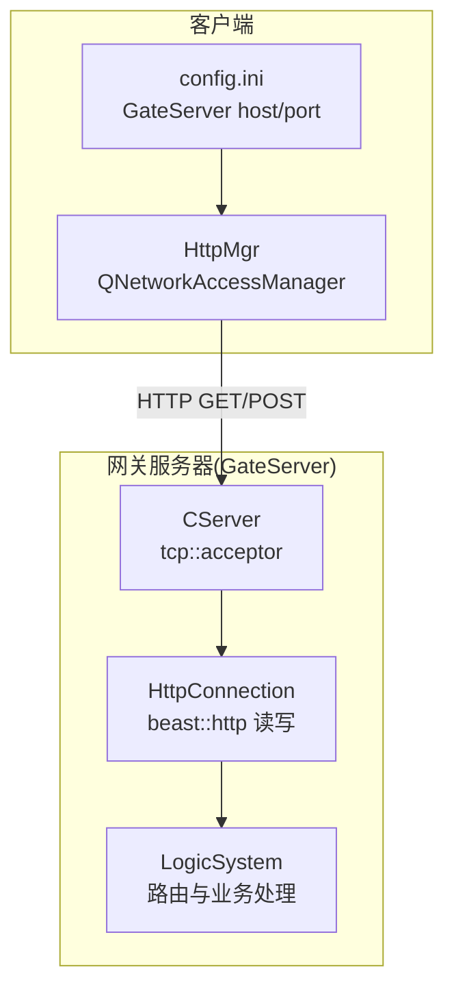
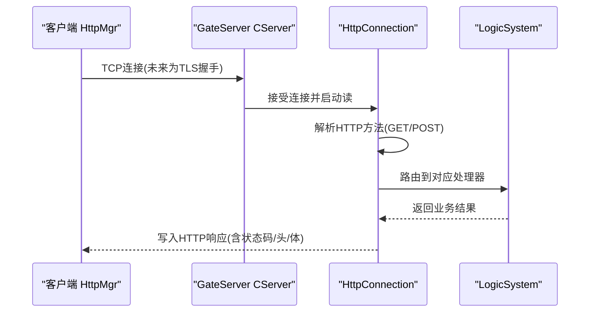
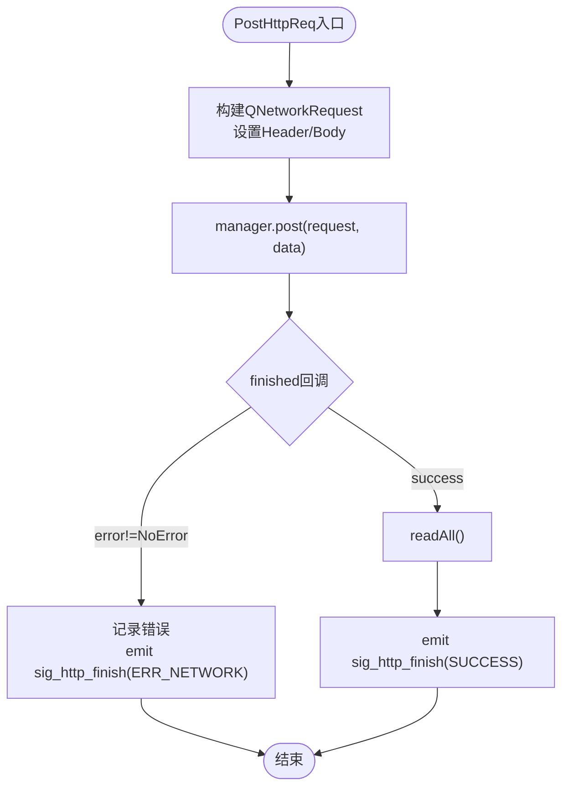
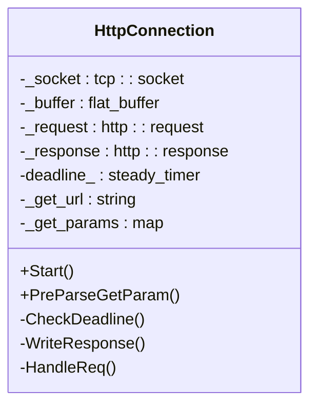
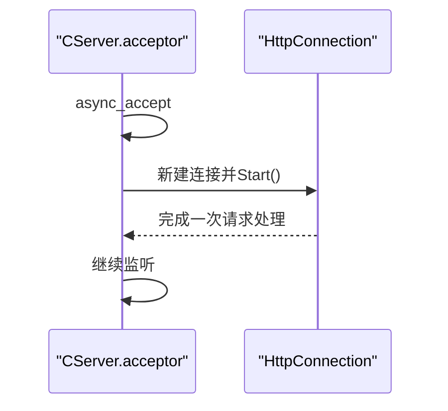
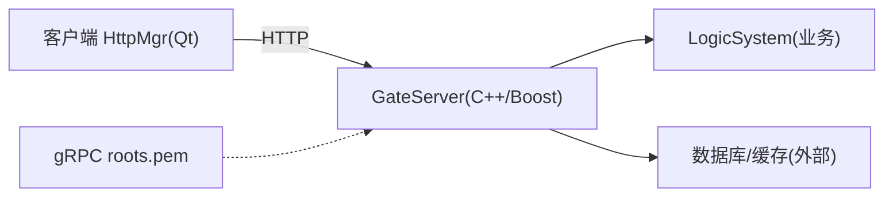

# HTTPS通信安全

<cite>
**本文引用的文件**   
- [client/llfcchat/include/httpmgr.h](file://client/llfcchat/include/httpmgr.h)
- [client/llfcchat/src/httpmgr.cpp](file://client/llfcchat/src/httpmgr.cpp)
- [server/GateServer/include/CServer.h](file://server/GateServer/include/CServer.h)
- [server/GateServer/src/CServer.cpp](file://server/GateServer/src/CServer.cpp)
- [server/GateServer/include/HttpConnection.h](file://server/GateServer/include/HttpConnection.h)
- [server/GateServer/src/HttpConnection.cpp](file://server/GateServer/src/HttpConnection.cpp)
- [client/llfcchat/config/config.ini](file://client/llfcchat/config/config.ini)
- [开发文档/day14-登录功能.md](file://开发文档/day14-登录功能.md)
- [vcpkg_installed/x64-windows/share/grpc/roots.pem](file://vcpkg_installed/x64-windows/share/grpc/roots.pem)
</cite>

## 目录
1. [简介](#简介)
2. [项目结构](#项目结构)
3. [核心组件](#核心组件)
4. [架构总览](#架构总览)
5. [详细组件分析](#详细组件分析)
6. [依赖关系分析](#依赖关系分析)
7. [性能与安全配置建议](#性能与安全配置建议)
8. [故障排查指南](#故障排查指南)
9. [结论](#结论)
10. [附录：HTTPS配置示例与流程](#附录https配置示例与流程)

## 简介
本文件面向LLFCChat项目的HTTPS通信安全，聚焦以下目标：
- TLS证书管理：生成、部署、更新与吊销流程
- SSL/TLS协议配置：加密套件选择、协议版本控制、会话复用等
- 客户端HTTPS连接实现：证书验证、错误处理、连接池管理
- HTTP请求安全：请求签名、参数加密、响应验证
- 提供完整配置示例与常见问题排查指南

当前代码库中，GateServer基于Boost.Asio/Beast实现HTTP服务，客户端使用Qt的QNetworkAccessManager发起HTTP请求。现有实现未启用TLS（均为明文HTTP），因此本文在“现状”基础上给出可落地的HTTPS改造方案与最佳实践。

## 项目结构
- 客户端
  - HTTP客户端封装：HttpMgr（基于QNetworkAccessManager）
  - 配置文件：config.ini（记录GateServer地址与端口）
- 服务端
  - GateServer：CServer监听TCP端口，HttpConnection解析HTTP请求并路由到LogicSystem
  - 其他服务（ChatServer、ResourceServer、StatusServer、VarifyServer）通过gRPC或内部协议交互

图表来源 
- [client/llfcchat/include/httpmgr.h:1-34](file://client/llfcchat/include/httpmgr.h#L1-L34)
- [client/llfcchat/src/httpmgr.cpp:1-61](file://client/llfcchat/src/httpmgr.cpp#L1-L61)
- [server/GateServer/include/CServer.h:1-16](file://server/GateServer/include/CServer.h#L1-L16)
- [server/GateServer/src/CServer.cpp:1-36](file://server/GateServer/src/CServer.cpp#L1-L36)
- [server/GateServer/include/HttpConnection.h:1-36](file://server/GateServer/include/HttpConnection.h#L1-L36)
- [server/GateServer/src/HttpConnection.cpp:1-225](file://server/GateServer/src/HttpConnection.cpp#L1-L225)
- [client/llfcchat/config/config.ini:1-3](file://client/llfcchat/config/config.ini#L1-L3)

章节来源
- [client/llfcchat/include/httpmgr.h:1-34](file://client/llfcchat/include/httpmgr.h#L1-L34)
- [client/llfcchat/src/httpmgr.cpp:1-61](file://client/llfcchat/src/httpmgr.cpp#L1-L61)
- [server/GateServer/include/CServer.h:1-16](file://server/GateServer/include/CServer.h#L1-L16)
- [server/GateServer/src/CServer.cpp:1-36](file://server/GateServer/src/CServer.cpp#L1-L36)
- [server/GateServer/include/HttpConnection.h:1-36](file://server/GateServer/include/HttpConnection.h#L1-L36)
- [server/GateServer/src/HttpConnection.cpp:1-225](file://server/GateServer/src/HttpConnection.cpp#L1-L225)
- [client/llfcchat/config/config.ini:1-3](file://client/llfcchat/config/config.ini#L1-L3)

## 核心组件
- 客户端HTTP管理器（HttpMgr）
  - 职责：构造QNetworkRequest、设置Content-Type/Length、发送POST、处理finished信号、按模块分发结果
  - 现状：未启用TLS；错误处理仅打印errorString并返回ERR_NETWORK
- 网关HTTP连接（HttpConnection）
  - 职责：异步读取HTTP请求、解析GET查询参数、路由到LogicSystem、统一设置响应头与状态码、异步写回响应
  - 现状：短连接、CORS允许*、无TLS握手与证书校验
- 网关监听器（CServer）
  - 职责：创建tcp::acceptor监听端口、接受新连接并交给HttpConnection处理
  - 现状：纯TCP监听，未绑定SSL上下文

章节来源
- [client/llfcchat/include/httpmgr.h:1-34](file://client/llfcchat/include/httpmgr.h#L1-L34)
- [client/llfcchat/src/httpmgr.cpp:1-61](file://client/llfcchat/src/httpmgr.cpp#L1-L61)
- [server/GateServer/include/HttpConnection.h:1-36](file://server/GateServer/include/HttpConnection.h#L1-L36)
- [server/GateServer/src/HttpConnection.cpp:1-225](file://server/GateServer/src/HttpConnection.cpp#L1-L225)
- [server/GateServer/include/CServer.h:1-16](file://server/GateServer/include/CServer.h#L1-L16)
- [server/GateServer/src/CServer.cpp:1-36](file://server/GateServer/src/CServer.cpp#L1-L36)

## 架构总览
下图展示从客户端到网关的HTTP请求流，以及后续接入TLS后的握手与数据保护路径。

图表来源 
- [client/llfcchat/src/httpmgr.cpp:1-61](file://client/llfcchat/src/httpmgr.cpp#L1-L61)
- [server/GateServer/src/CServer.cpp:1-36](file://server/GateServer/src/CServer.cpp#L1-L36)
- [server/GateServer/src/HttpConnection.cpp:132-194](file://server/GateServer/src/HttpConnection.cpp#L132-L194)

## 详细组件分析

### 客户端HTTP管理器（HttpMgr）
- 关键行为
  - 构造请求：设置Content-Type为application/json，计算Content-Length
  - 发送POST：调用QNetworkAccessManager.post，连接finished信号
  - 错误处理：若reply->error()非NoError，输出错误信息并触发sig_http_finish携带ERR_NETWORK
  - 成功处理：读取响应体，触发sig_http_finish携带SUCCESS
- 安全现状与建议
  - 现状：未配置SSL上下文、未启用证书校验、未限制协议版本与套件
  - 建议：
    - 使用QSslConfiguration配置最小TLS版本（如TLS1.2+）、禁用弱套件
    - 加载系统CA或企业根证书，启用严格证书链校验
    - 启用会话复用（Session Tickets/Resumption）提升性能
    - 对敏感字段进行应用层加密或签名（见后文“HTTP请求安全”）

图表来源 
- [client/llfcchat/src/httpmgr.cpp:8-37](file://client/llfcchat/src/httpmgr.cpp#L8-L37)

章节来源
- [client/llfcchat/include/httpmgr.h:1-34](file://client/llfcchat/include/httpmgr.h#L1-L34)
- [client/llfcchat/src/httpmgr.cpp:1-61](file://client/llfcchat/src/httpmgr.cpp#L1-L61)

### 网关HTTP连接（HttpConnection）
- 关键行为
  - 异步读取：beast::async_read解析请求
  - 预处理GET参数：URL解码、键值对提取
  - 路由处理：根据method分派到LogicSystem::HandleGet/HandlePost
  - 响应设置：保持keep_alive=false，设置Server头，统一content_type
  - 超时控制：deadline定时器关闭空闲连接
- 安全现状与建议
  - 现状：纯TCP，CORS允许*，短连接，无TLS
  - 建议：
    - 引入SSL上下文，强制TLS1.2+，禁用不安全套件
    - 启用HSTS（通过反向代理）
    - 限制请求大小与超时时间，避免慢速攻击
    - 收紧CORS策略，仅允许可信来源

图表来源 
- [server/GateServer/include/HttpConnection.h:1-36](file://server/GateServer/include/HttpConnection.h#L1-L36)
- [server/GateServer/src/HttpConnection.cpp:1-225](file://server/GateServer/src/HttpConnection.cpp#L1-L225)

章节来源
- [server/GateServer/include/HttpConnection.h:1-36](file://server/GateServer/include/HttpConnection.h#L1-L36)
- [server/GateServer/src/HttpConnection.cpp:1-225](file://server/GateServer/src/HttpConnection.cpp#L1-L225)

### 网关监听器（CServer）
- 关键行为
  - 构造tcp::acceptor监听指定端口
  - 异步接受连接，创建HttpConnection并启动Start
  - 异常捕获后继续监听
- 安全现状与建议
  - 现状：未绑定SSL上下文
  - 建议：将acceptor替换为ssl::stream包装，或在反向代理层（Nginx/Caddy）终止TLS，后端维持HTTP

图表来源 
- [server/GateServer/src/CServer.cpp:1-36](file://server/GateServer/src/CServer.cpp#L1-L36)

章节来源
- [server/GateServer/include/CServer.h:1-16](file://server/GateServer/include/CServer.h#L1-L16)
- [server/GateServer/src/CServer.cpp:1-36](file://server/GateServer/src/CServer.cpp#L1-L36)

## 依赖关系分析
- 客户端依赖Qt网络栈（QNetworkAccessManager）
- 服务端依赖Boost.Asio/Beast进行HTTP解析与I/O
- gRPC根证书存在于vcpkg安装目录，可用于gRPC侧TLS验证参考

图表来源 
- [client/llfcchat/include/httpmgr.h:1-34](file://client/llfcchat/include/httpmgr.h#L1-L34)
- [server/GateServer/src/CServer.cpp:1-36](file://server/GateServer/src/CServer.cpp#L1-L36)
- [vcpkg_installed/x64-windows/share/grpc/roots.pem](file://vcpkg_installed/x64-windows/share/grpc/roots.pem)

章节来源
- [client/llfcchat/include/httpmgr.h:1-34](file://client/llfcchat/include/httpmgr.h#L1-L34)
- [server/GateServer/src/CServer.cpp:1-36](file://server/GateServer/src/CServer.cpp#L1-L36)
- [vcpkg_installed/x64-windows/share/grpc/roots.pem](file://vcpkg_installed/x64-windows/share/grpc/roots.pem)

## 性能与安全配置建议
- 协议与套件
  - 强制TLS1.2及以上，禁用SSLv3/TLS1.0/1.1
  - 优先ECDHE+AES-GCM套件，禁用CBC与静态RSA套件
- 会话复用
  - 启用Session Tickets与Session Cache，减少握手开销
- 证书校验
  - 客户端严格校验证书链与主机名匹配
  - 服务端启用OCSP Stapling（由反向代理支持）
- 连接与超时
  - 合理设置请求超时、空闲超时、最大并发连接数
  - 限制请求体大小，防止DoS
- 头部安全
  - 设置Strict-Transport-Security、X-Content-Type-Options、X-Frame-Options等（由反向代理）
  - CORS仅允许可信域名

[本节为通用建议，不直接分析具体文件]

## 故障排查指南
- 客户端HTTPS连接失败
  - 检查QSslConfiguration是否启用TLS1.2+、是否正确加载CA证书
  - 查看QNetworkReply错误码与errorString，定位握手失败或证书校验失败
- 服务端握手异常
  - 确认证书链完整、私钥匹配、权限正确
  - 检查防火墙/负载均衡是否放行443端口
- 性能问题
  - 开启会话复用，观察握手次数下降
  - 调整连接池大小与超时阈值
- 常见错误
  - 证书过期/未信任根证书
  - 主机名不匹配
  - 套件不兼容

章节来源
- [client/llfcchat/src/httpmgr.cpp:20-37](file://client/llfcchat/src/httpmgr.cpp#L20-L37)
- [server/GateServer/src/HttpConnection.cpp:132-194](file://server/GateServer/src/HttpConnection.cpp#L132-L194)

## 结论
当前LLFCChat的HTTP通信尚未启用TLS。通过引入客户端QSslConfiguration与服务端SSL上下文（或前置反向代理），可实现端到端HTTPS。配合严格的证书校验、安全的套件与协议版本控制、合理的超时与连接池策略，以及应用层的请求签名与响应验证，可显著提升通信安全性与稳定性。

[本节为总结性内容，不直接分析具体文件]

## 附录：HTTPS配置示例与流程

### TLS证书管理流程
- 生成证书
  - 自签CA与服务器证书（测试环境）
  - 申请权威CA证书（生产环境）
- 部署证书
  - 将证书与私钥放置于受控目录，限制访问权限
  - 在服务端配置加载路径与密码
- 更新证书
  - 平滑热更新：支持重载证书而不中断服务
  - 灰度发布：双证书并行过渡
- 吊销证书
  - 建立吊销清单（CRL）或启用OCSP
  - 客户端/服务端定期刷新吊销状态

[本节为流程说明，不直接分析具体文件]

### SSL/TLS协议配置要点
- 客户端（Qt）
  - 设置QSslConfiguration::Protocol为TLS1.2或更高
  - 禁用不安全套件，启用ECDHE+AES-GCM
  - 加载系统CA或自定义根证书，启用证书链校验
- 服务端（Boost.Asio/Beast）
  - 使用ssl::context配置证书链、私钥、协议与套件
  - 启用会话复用（session_cache、session_tickets）
  - 设置握手超时与I/O超时

[本节为配置要点，不直接分析具体文件]

### 客户端HTTPS连接实现要点
- 证书验证
  - 启用strict证书校验，禁止绕过
  - 校验主机名与证书CN/SAN一致
- 错误处理
  - 区分网络错误、握手错误、证书错误
  - 重试策略与退避机制
- 连接池管理
  - 复用底层TCP连接（Keep-Alive）
  - 限制最大并发与队列长度

章节来源
- [client/llfcchat/src/httpmgr.cpp:1-61](file://client/llfcchat/src/httpmgr.cpp#L1-L61)

### HTTP请求安全措施
- 请求签名
  - 使用HMAC-SHA256对请求体与关键字段签名，附带nonce与时间戳
  - 服务端校验签名与防重放
- 参数加密
  - 敏感字段采用对称加密（如AES-GCM），密钥通过TLS通道协商或KMS下发
- 响应验证
  - 服务端返回签名或MAC，客户端校验完整性
  - 对JSON响应进行严格模式解析，拒绝非法字段

[本节为安全设计建议，不直接分析具体文件]

### 完整HTTPS配置示例（步骤）
- 准备证书
  - 获取权威CA证书或生成自签证书
- 服务端配置
  - 在CServer/HttpConnection处引入SSL上下文
  - 配置协议版本、套件、会话复用、超时
- 客户端配置
  - 在HttpMgr中配置QSslConfiguration与CA证书
  - 启用严格校验与日志
- 反向代理（可选）
  - Nginx/Caddy终止TLS，后端维持HTTP
  - 配置HSTS、安全头、限流与WAF

[本节为操作步骤，不直接分析具体文件]

### 常见问题排查清单
- 握手失败：检查证书链、私钥、协议与套件兼容性
- 证书校验失败：核对主机名、根证书信任链、时间同步
- 性能差：确认会话复用、连接池、压缩与CDN
- 安全告警：检查CORS、HSTS、安全头、输入校验

[本节为排查清单，不直接分析具体文件]