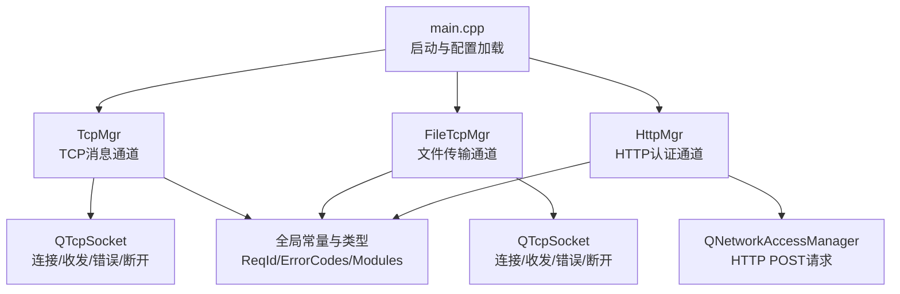
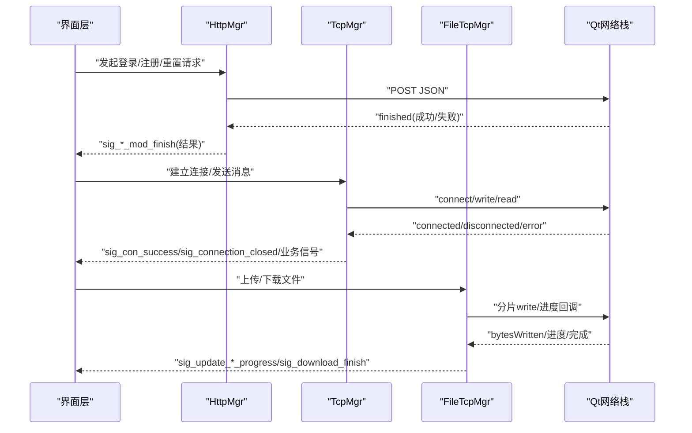
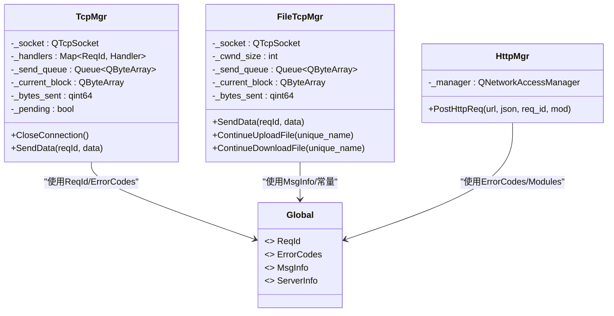

# 客户端网络安全

<cite>
**本文引用的文件**   
- [tcpmgr.h](file://client/llfcchat/include/tcpmgr.h)
- [tcpmgr.cpp](file://client/llfcchat/src/tcpmgr.cpp)
- [httpmgr.h](file://client/llfcchat/include/httpmgr.h)
- [httpmgr.cpp](file://client/llfcchat/src/httpmgr.cpp)
- [filetcpmgr.h](file://client/llfcchat/include/filetcpmgr.h)
- [filetcpmgr.cpp](file://client/llfcchat/src/filetcpmgr.cpp)
- [global.h](file://client/llfcchat/include/global.h)
- [userdata.h](file://client/llfcchat/include/userdata.h)
- [config.ini](file://client/llfcchat/config/config.ini)
- [main.cpp](file://client/llfcchat/src/main.cpp)
- [chatdialog.cpp](file://client/llfcchat/src/chatdialog.cpp)
</cite>

## 目录
1. [简介](#简介)
2. [项目结构](#项目结构)
3. [核心组件](#核心组件)
4. [架构总览](#架构总览)
5. [详细组件分析](#详细组件分析)
6. [依赖关系分析](#依赖关系分析)
7. [性能与健壮性](#性能与健壮性)
8. [故障排查指南](#故障排查指南)
9. [结论](#结论)
10. [附录：安全配置与调试清单](#附录安全配置与调试清单)

## 简介
本文件面向LLFCChat客户端的网络安全与可靠性，聚焦以下方面：
- 连接超时处理机制（连接、读写超时、重试策略）
- 重连机制（自动重连、指数退避、状态同步）
- 网络异常恢复（断线检测、数据完整性校验、状态恢复）
- 客户端安全验证（服务器身份验证、数据传输加密、本地缓存安全）
- 完整的安全配置示例与调试技巧，确保在网络环境变化时的稳定性与安全性

说明：当前代码库未显式实现TLS/HTTPS、证书校验、读写超时与指数退避等能力。本文在“现状”基础上给出增强建议与落地方案，帮助在不破坏现有架构的前提下提升安全性与健壮性。

## 项目结构
客户端网络相关的关键模块如下：
- TCP消息通道：TcpMgr（聊天与控制消息）、FileTcpMgr（文件传输）
- HTTP认证通道：HttpMgr（注册、登录、重置密码）
- 全局常量与数据结构：ReqId、ErrorCodes、Modules、MsgInfo、ServerInfo等
- 应用入口与配置加载：main.cpp、config.ini

图示来源 
- [main.cpp:1-44](file://client/llfcchat/src/main.cpp#L1-L44)
- [tcpmgr.h:1-90](file://client/llfcchat/include/tcpmgr.h#L1-L90)
- [filetcpmgr.h:1-85](file://client/llfcchat/include/filetcpmgr.h#L1-L85)
- [httpmgr.h:1-34](file://client/llfcchat/include/httpmgr.h#L1-L34)
- [global.h:1-296](file://client/llfcchat/include/global.h#L1-L296)

章节来源
- [main.cpp:1-44](file://client/llfcchat/src/main.cpp#L1-L44)
- [config.ini:1-4](file://client/llfcchat/config/config.ini#L1-L4)

## 核心组件
- TcpMgr：封装聊天与控制消息的TCP收发、粘包处理、消息分发、连接事件回调；提供发送队列与异步发送。
- FileTcpMgr：封装文件上传/下载的TCP收发、拥塞窗口控制、进度回调、续传接口。
- HttpMgr：封装HTTP POST请求、响应回调、按模块路由完成信号。
- 全局定义：ReqId、ErrorCodes、Modules、MsgInfo、ServerInfo等，贯穿各模块。

章节来源
- [tcpmgr.h:1-90](file://client/llfcchat/include/tcpmgr.h#L1-L90)
- [tcpmgr.cpp:1-800](file://client/llfcchat/src/tcpmgr.cpp#L1-L800)
- [filetcpmgr.h:1-85](file://client/llfcchat/include/filetcpmgr.h#L1-L85)
- [filetcpmgr.cpp:1-200](file://client/llfcchat/src/filetcpmgr.cpp#L1-L200)
- [httpmgr.h:1-34](file://client/llfcchat/include/httpmgr.h#L1-L34)
- [httpmgr.cpp:1-62](file://client/llfcchat/src/httpmgr.cpp#L1-L62)
- [global.h:1-296](file://client/llfcchat/include/global.h#L1-L296)

## 架构总览
客户端通过三个通道与后端交互：
- HTTP通道用于认证（注册、登录、重置密码），由HttpMgr统一发起并回调。
- TCP通道用于实时聊天与控制消息，由TcpMgr管理连接、收发与消息分发。
- 文件通道用于大文件/图片传输，由FileTcpMgr管理分片、进度与续传。

图示来源 
- [httpmgr.cpp:1-62](file://client/llfcchat/src/httpmgr.cpp#L1-L62)
- [tcpmgr.cpp:1-800](file://client/llfcchat/src/tcpmgr.cpp#L1-L800)
- [filetcpmgr.cpp:1-200](file://client/llfcchat/src/filetcpmgr.cpp#L1-L200)

## 详细组件分析

### 连接与超时处理（现状与建议）
- 现状
  - 连接建立与断开：TcpMgr/FileTcpMgr监听connected/disconnected/error信号，区分拒绝、主机不可达、远程关闭、超时等错误，并通过信号通知上层。
  - 读写流程：readyRead读取全部可用数据，按固定头部解析后进入handleMsg分发；bytesWritten驱动发送队列顺序写出。
  - 心跳：ChatDialog每10秒发送一次心跳请求，服务端返回心跳应答。
- 缺失能力
  - 未设置连接超时、读写超时、空闲超时。
  - 未实现自动重连与指数退避。
  - 未对HTTP请求设置超时与重试。
- 建议增强
  - 为QTcpSocket设置连接超时（例如5s），并在error中捕获SocketTimeoutError触发重连。
  - 为read/write设置超时（例如30s），超过阈值触发断线检测与重连。
  - 增加心跳失败计数，连续N次无应答则判定断线并重连。
  - 为QNetworkAccessManager设置timeout属性，失败时进行有限次数重试（带指数退避）。

章节来源
- [tcpmgr.cpp:1-800](file://client/llfcchat/src/tcpmgr.cpp#L1-L800)
- [filetcpmgr.cpp:1-200](file://client/llfcchat/src/filetcpmgr.cpp#L1-L200)
- [chatdialog.cpp:150-195](file://client/llfcchat/src/chatdialog.cpp#L150-L195)
- [httpmgr.cpp:1-62](file://client/llfcchat/src/httpmgr.cpp#L1-L62)

### 重连机制（现状与建议）
- 现状
  - 未实现自动重连逻辑；错误分支仅打印日志或发出连接失败信号。
  - 心跳存在但无失败判定与重连联动。
- 建议增强
  - 设计重连管理器：维护连接状态机（Idle/Connecting/Connected/Closed），根据错误码与心跳失败次数触发重连。
  - 指数退避算法：初始间隔1s，最大间隔30s，每次失败乘以2并加抖动。
  - 状态同步：重连成功后拉取会话列表、未确认消息、文件传输状态，保证一致性。

章节来源
- [tcpmgr.cpp:1-800](file://client/llfcchat/src/tcpmgr.cpp#L1-L800)
- [filetcpmgr.cpp:1-200](file://client/llfcchat/src/filetcpmgr.cpp#L1-L200)
- [chatdialog.cpp:150-195](file://client/llfcchat/src/chatdialog.cpp#L150-L195)

### 网络异常恢复（断线检测、完整性校验、状态恢复）
- 断线检测
  - 基于disconnected与error信号判断；心跳失败可作为辅助判据。
- 数据完整性
  - TCP粘包处理：按固定头（ID+长度）解析，避免半包/粘包问题。
  - 文件传输：使用唯一文件名、序列号、MD5校验、已接收序列集合与飞行序列集合，支持断点续传。
- 状态恢复
  - 重连后重新加载聊天线程与消息，恢复未确认消息与文件传输状态。

章节来源
- [tcpmgr.cpp:1-800](file://client/llfcchat/src/tcpmgr.cpp#L1-L800)
- [filetcpmgr.cpp:1-200](file://client/llfcchat/src/filetcpmgr.cpp#L1-L200)
- [global.h:1-296](file://client/llfcchat/include/global.h#L1-L296)

### 客户端安全验证（现状与建议）
- 现状
  - HTTP请求未启用TLS/HTTPS，未做服务器证书校验。
  - 登录成功后保存token，但未强制校验来源与有效期。
  - 本地缓存路径可写，未做敏感信息保护。
- 建议增强
  - 将HTTP升级为HTTPS，启用证书校验与HSTS。
  - 对敏感字段（如token）进行本地加密存储，限制访问权限。
  - 对TCP通道考虑TLS（如wss或自定义TLS封装），至少对认证阶段加密。
  - 输入校验与输出过滤，防止注入与XSS风险。

章节来源
- [httpmgr.cpp:1-62](file://client/llfcchat/src/httpmgr.cpp#L1-L62)
- [global.h:1-296](file://client/llfcchat/include/global.h#L1-L296)

### 心跳与保活（现状）
- ChatDialog每10秒发送一次心跳请求，服务端返回心跳应答。
- 建议：心跳失败累计阈值（如3次）触发断线检测与重连；心跳间隔可配置。

章节来源
- [chatdialog.cpp:150-195](file://client/llfcchat/src/chatdialog.cpp#L150-L195)
- [tcpmgr.cpp:583-612](file://client/llfcchat/src/tcpmgr.cpp#L583-L612)

### 文件传输可靠性（现状）
- 拥塞窗口控制：FileTcpMgr维护_cwnd_size与MAX_CWND_SIZE，限制并发分片数量。
- 进度与续传：通过unique_name、seq、md5、rsp_seqs、flighting_seqs等字段跟踪传输状态，支持继续上传/下载。
- 建议：增加分片校验（如CRC32/MD5）、失败重传上限、死锁保护。

章节来源
- [filetcpmgr.cpp:1-200](file://client/llfcchat/src/filetcpmgr.cpp#L1-L200)
- [global.h:1-296](file://client/llfcchat/include/global.h#L1-L296)

## 依赖关系分析
- TcpMgr依赖QTcpSocket、QTimer、QJsonDocument、UserMgr等；负责消息编解码与分发。
- FileTcpMgr依赖QTcpSocket、QPainter、QStandardPaths等；负责文件分片与进度。
- HttpMgr依赖QNetworkAccessManager；负责HTTP请求与回调。
- 全局模块global.h定义ReqId、ErrorCodes、Modules、MsgInfo等，被上述模块共同使用。

图示来源 
- [tcpmgr.h:1-90](file://client/llfcchat/include/tcpmgr.h#L1-L90)
- [filetcpmgr.h:1-85](file://client/llfcchat/include/filetcpmgr.h#L1-L85)
- [httpmgr.h:1-34](file://client/llfcchat/include/httpmgr.h#L1-L34)
- [global.h:1-296](file://client/llfcchat/include/global.h#L1-L296)

章节来源
- [tcpmgr.h:1-90](file://client/llfcchat/include/tcpmgr.h#L1-L90)
- [filetcpmgr.h:1-85](file://client/llfcchat/include/filetcpmgr.h#L1-L85)
- [httpmgr.h:1-34](file://client/llfcchat/include/httpmgr.h#L1-L34)
- [global.h:1-296](file://client/llfcchat/include/global.h#L1-L296)

## 性能与健壮性
- 发送队列与背压：TcpMgr/FileTcpMgr使用QQueue与bytesWritten回调实现顺序发送，避免阻塞UI线程。
- 粘包处理：按固定头解析，减少内存拷贝与解析开销。
- 拥塞控制：FileTcpMgr通过_cwnd_size限制并发分片，降低网络拥塞。
- 建议优化
  - 引入零拷贝或分段缓冲，减少内存分配。
  - 为长连接增加空闲检测与自动清理。
  - 对JSON解析失败与超大消息进行限流与丢弃策略。

章节来源
- [tcpmgr.cpp:1-800](file://client/llfcchat/src/tcpmgr.cpp#L1-L800)
- [filetcpmgr.cpp:1-200](file://client/llfcchat/src/filetcpmgr.cpp#L1-L200)
- [global.h:1-296](file://client/llfcchat/include/global.h#L1-L296)

## 故障排查指南
- 连接失败
  - 检查config.ini中的GateServer地址与端口是否正确。
  - 观察error信号中的错误类型（拒绝、主机不可达、超时等）。
- 心跳异常
  - 确认ChatDialog定时器是否运行；检查服务端心跳应答。
- 文件传输卡住
  - 检查_cwnd_size与MAX_CWND_SIZE配置；查看进度回调是否触发。
- HTTP请求失败
  - 检查QNetworkReply::errorString；确认URL与Content-Type。

章节来源
- [config.ini:1-4](file://client/llfcchat/config/config.ini#L1-L4)
- [tcpmgr.cpp:1-800](file://client/llfcchat/src/tcpmgr.cpp#L1-L800)
- [filetcpmgr.cpp:1-200](file://client/llfcchat/src/filetcpmgr.cpp#L1-L200)
- [httpmgr.cpp:1-62](file://client/llfcchat/src/httpmgr.cpp#L1-L62)
- [chatdialog.cpp:150-195](file://client/llfcchat/src/chatdialog.cpp#L150-L195)

## 结论
当前客户端网络层具备基本的TCP/HTTP通信与消息分发能力，但在连接超时、自动重连、TLS加密、证书校验、本地缓存安全等方面尚待增强。建议在保持现有架构不变的前提下，逐步引入超时与重连、心跳失败判定、HTTPS与证书校验、敏感数据加密存储等措施，以提升整体安全性与健壮性。

## 附录：安全配置与调试清单
- 配置项建议
  - GateServer地址与端口（已在config.ini中）
  - 连接超时（建议5s）
  - 读写超时（建议30s）
  - 心跳间隔（默认10s，可调）
  - 重连最大次数与退避参数（初始1s，最大30s，乘数2，抖动±20%）
  - HTTPS开关与证书校验开关
- 调试技巧
  - 开启详细日志（连接、错误、心跳、发送/接收字节数）
  - 抓包工具验证报文格式与顺序
  - 模拟网络异常（丢包、延迟、断网）验证重连与恢复
  - 校验文件传输MD5与序列号一致性

章节来源
- [config.ini:1-4](file://client/llfcchat/config/config.ini#L1-L4)
- [tcpmgr.cpp:1-800](file://client/llfcchat/src/tcpmgr.cpp#L1-L800)
- [filetcpmgr.cpp:1-200](file://client/llfcchat/src/filetcpmgr.cpp#L1-L200)
- [httpmgr.cpp:1-62](file://client/llfcchat/src/httpmgr.cpp#L1-L62)
- [chatdialog.cpp:150-195](file://client/llfcchat/src/chatdialog.cpp#L150-L195)