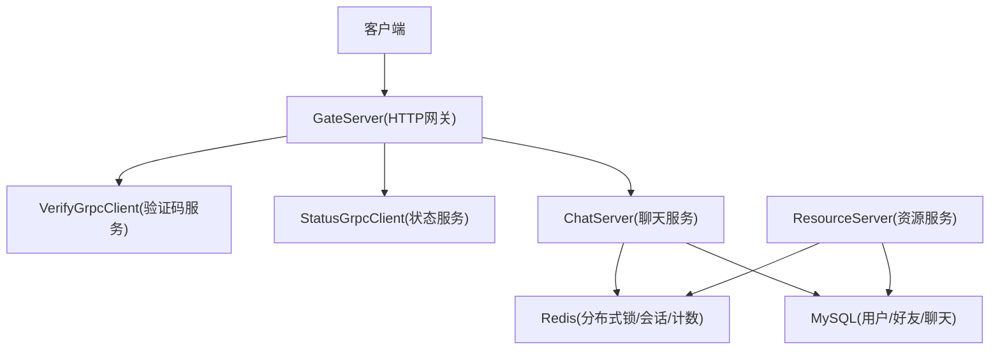
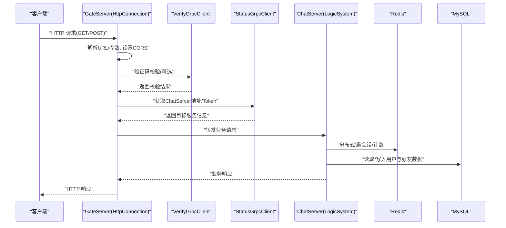
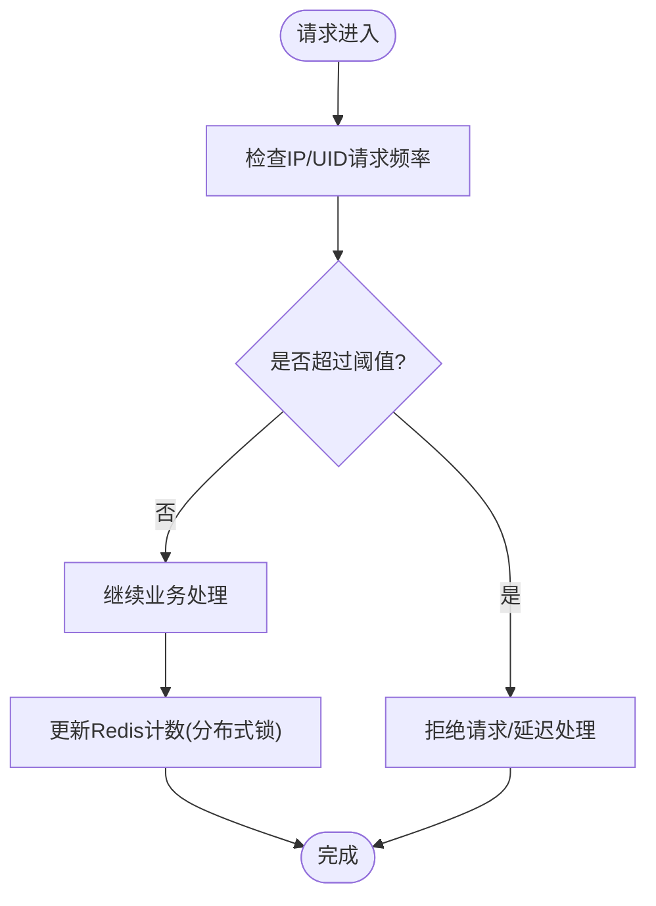
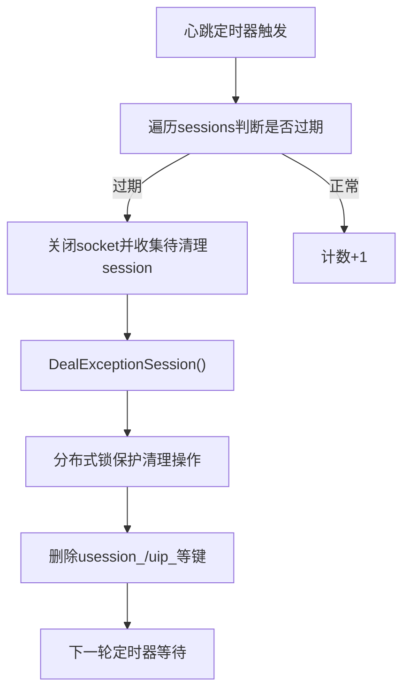
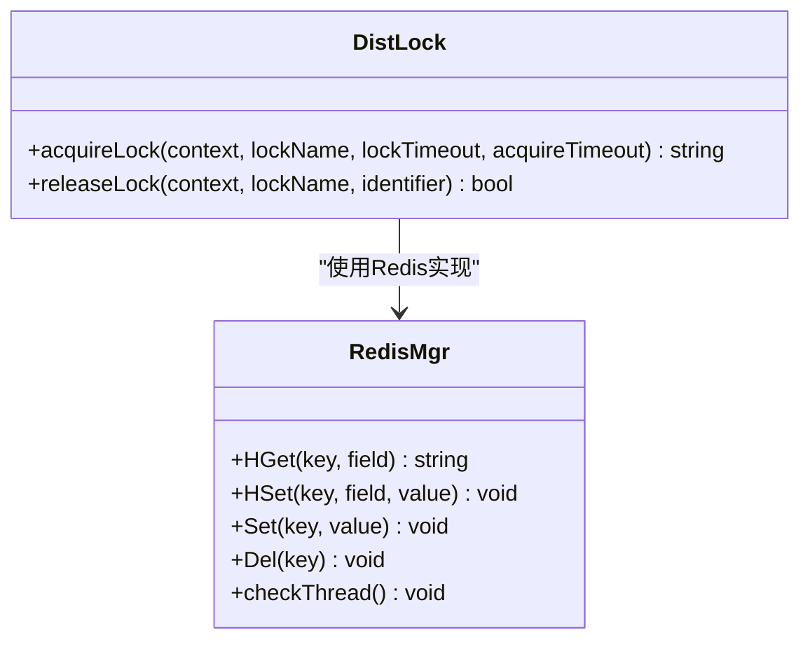
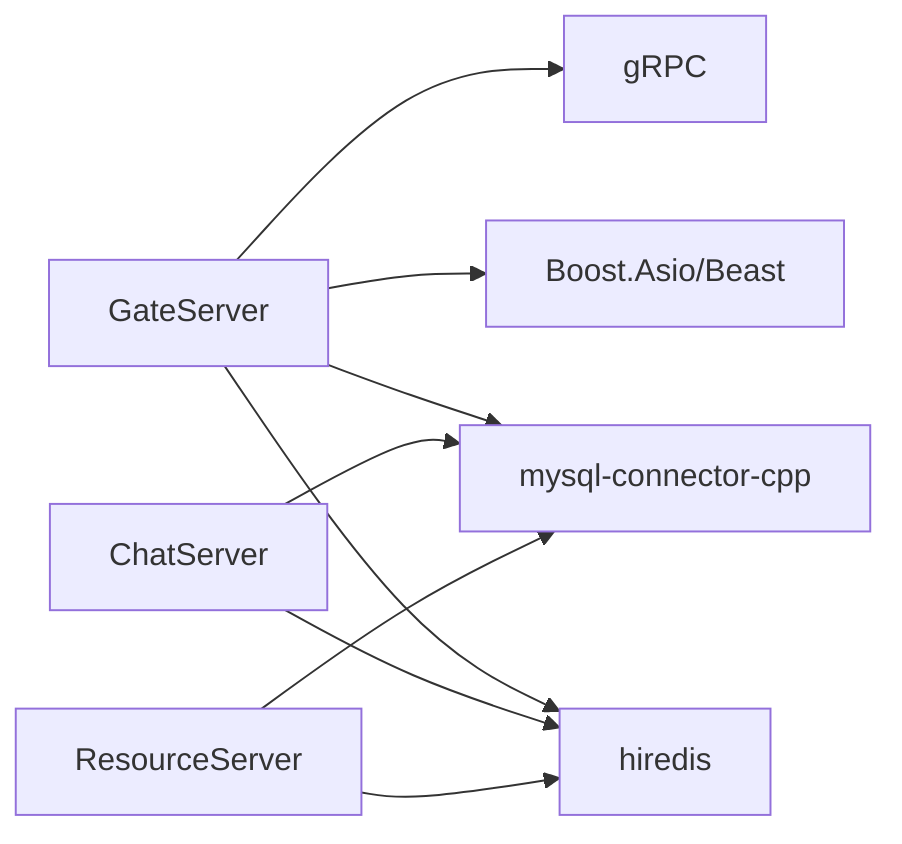

# 攻击防护机制

<cite>
**本文引用的文件**   
- [HttpConnection.cpp](file://server/GateServer/src/HttpConnection.cpp)
- [RedisMgr.h（GateServer）](file://server/GateServer/include/RedisMgr.h)
- [RedisMgr.cpp（ChatServer）](file://server/ChatServer/src/RedisMgr.cpp)
- [DistLock.h（ChatServer）](file://server/ChatServer/include/DistLock.h)
- [const.h（ChatServer）](file://server/ChatServer/include/const.h)
- [const.h（GateServer）](file://server/GateServer/include/const.h)
- [config.ini（GateServer）](file://server/GateServer/config/config.ini)
- [VerifyGrpcClient.h（GateServer）](file://server/GateServer/include/VerifyGrpcClient.h)
- [MysqlDao.cpp（ResourceServer）](file://server\ResourceServer\src\MysqlDao.cpp)
- [day35心跳逻辑.md](file://开发文档/day35心跳逻辑.md)
- [day33单服程踢人逻辑.md](file://开发文档/day33单服程踢人逻辑.md)
- [day14-登录功能.md](file://开发文档/day14-登录功能.md)
</cite>

## 目录
1. [简介](#简介)
2. [项目结构](#项目结构)
3. [核心组件](#核心组件)
4. [架构总览](#架构总览)
5. [详细组件分析](#详细组件分析)
6. [依赖关系分析](#依赖关系分析)
7. [性能考量](#性能考量)
8. [故障排查指南](#故障排查指南)
9. [结论](#结论)
10. [附录](#附录)

## 简介
本文件面向 LLFCChat 的攻击防护机制，系统性梳理 DDoS 防护策略、恶意请求检测与自动封禁、SQL 注入/XSS/CSRF 防护现状与建议、分布式锁防重放、消息队列限流与缓存穿透防护，以及攻击检测规则配置、日志分析与应急响应流程。内容基于仓库中 GateServer、ChatServer、ResourceServer 等模块的实现与开发文档进行归纳与扩展说明，帮助读者在不深入代码细节的情况下理解整体安全能力与改进方向。

## 项目结构
LLFCChat 采用多服务架构：GateServer 作为 HTTP 网关，ChatServer 负责聊天业务与连接管理，ResourceServer 提供资源访问，StatusServer 提供状态与路由，VarifyServer 提供验证码与邮箱认证。各服务通过 gRPC 通信，使用 Redis 做分布式锁与会话计数，MySQL 持久化用户与好友数据。

**图表来源** 
- [HttpConnection.cpp:132-167](file://server/GateServer/src/HttpConnection.cpp#L132-L167)
- [VerifyGrpcClient.h（GateServer）:80-110](file://server/GateServer/include/VerifyGrpcClient.h#L80-L110)
- [const.h（ChatServer）:81-94](file://server/ChatServer/include/const.h#L81-L94)

**章节来源**
- [config.ini（GateServer）:1-25](file://server/GateServer/config/config.ini#L1-L25)

## 核心组件
- HTTP 网关与请求处理：GateServer 的 HttpConnection 解析并分发 GET/POST 请求，设置响应头与跨域策略，调用 LogicSystem 路由处理。
- 分布式锁与会话控制：DistLock 封装 Redis 加解锁；RedisMgr 维护连接池与健康检查；心跳与踢人逻辑保证连接有效性。
- 登录与计数：登录成功/失败统计通过 Redis Hash 记录，结合分布式锁避免并发竞争。
- 数据库访问：ResourceServer 的 MysqlDao 使用预处理语句防止 SQL 注入，事务保障一致性。

**章节来源**
- [HttpConnection.cpp:132-167](file://server/GateServer/src/HttpConnection.cpp#L132-L167)
- [DistLock.h（ChatServer）:1-18](file://server/ChatServer/include/DistLock.h#L1-L18)
- [RedisMgr.h（GateServer）:209-246](file://server/GateServer/include/RedisMgr.h#L209-L246)
- [RedisMgr.cpp（ChatServer）:404-461](file://server/ChatServer/src/RedisMgr.cpp#L404-L461)
- [MysqlDao.cpp（ResourceServer）:127-161](file://server\ResourceServer\src\MysqlDao.cpp#L127-L161)

## 架构总览
下图展示从 HTTP 请求到业务处理的完整链路，包括验证码校验、状态查询、聊天服务交互与 Redis/MySQL 的协作。

**图表来源** 
- [HttpConnection.cpp:132-167](file://server/GateServer/src/HttpConnection.cpp#L132-L167)
- [VerifyGrpcClient.h（GateServer）:80-110](file://server/GateServer/include/VerifyGrpcClient.h#L80-L110)
- [RedisMgr.cpp（ChatServer）:404-461](file://server/ChatServer/src/RedisMgr.cpp#L404-L461)
- [MysqlDao.cpp（ResourceServer）:127-161](file://server\ResourceServer\src\MysqlDao.cpp#L127-L161)

## 详细组件分析

### DDoS 防护策略（流量清洗、连接数限制、带宽控制）
- 连接数限制
  - 通过 Redis Hash 字段 LOGIN_COUNT 记录各服务器当前在线会话数量，登录时增加、退出时减少，配合分布式锁确保原子性。
  - 心跳定时任务汇总本地 session 数量并写回 Redis，降低频繁加锁开销。
- 流量清洗与速率限制
  - 当前实现未包含显式的速率限制器或 IP 黑名单；建议在 GateServer 层引入令牌桶/漏桶算法对同一 IP/UID 的请求频率进行限制，并结合 Redis 计数器实现滑动窗口限流。
- 带宽控制
  - 未在代码中发现带宽限制逻辑；可在网关层按 IP/UID 维度限制每秒字节数，或使用系统级限速工具（如 tc）。

**图表来源** 
- [RedisMgr.cpp（ChatServer）:404-461](file://server/ChatServer/src/RedisMgr.cpp#L404-L461)
- [const.h（ChatServer）:81-94](file://server/ChatServer/include/const.h#L81-L94)

**章节来源**
- [RedisMgr.cpp（ChatServer）:404-461](file://server/ChatServer/src/RedisMgr.cpp#L404-L461)
- [day35心跳逻辑.md:644-688](file://开发文档/day35心跳逻辑.md#L644-L688)

### 恶意请求检测与异常行为识别、自动封禁
- 异常行为识别
  - 心跳超时清理：服务端定时器扫描 session，若心跳过期则关闭连接并清理 Redis 中的会话与登录信息。
  - 异步读错误处理：在 AsyncReadHead/AsyncReadBody 的错误分支中，统一调用 DealExceptionSession 清理会话与 Redis 键值，防止僵尸连接。
- 自动封禁建议
  - 当前未实现自动封禁；可基于 Redis 计数器累计失败次数（如验证码错误、登录失败），超过阈值后加入黑名单，并在网关层拦截。

**图表来源** 
- [day35心跳逻辑.md:41-93](file://开发文档/day35心跳逻辑.md#L41-L93)
- [day33单服程踢人逻辑.md:397-460](file://开发文档/day33单服程踢人逻辑.md#L397-L460)

**章节来源**
- [day35心跳逻辑.md:41-93](file://开发文档/day35心跳逻辑.md#L41-L93)
- [day33单服程踢人逻辑.md:397-460](file://开发文档/day33单服程踢人逻辑.md#L397-L460)

### SQL 注入防护、XSS 防御与 CSRF 保护
- SQL 注入防护
  - ResourceServer 的 MysqlDao 使用 PreparedStatement 与参数绑定，有效防止 SQL 注入。
- XSS 防御
  - 未发现前端输出转义或后端内容过滤逻辑；建议在输出前对用户输入进行 HTML 实体编码，并对富文本内容进行白名单过滤。
- CSRF 保护
  - 未发现 CSRF Token 或 SameSite Cookie 策略；建议在跨站请求中使用 CSRF Token 校验，或在网关层校验 Referer/Origin。

**章节来源**
- [MysqlDao.cpp（ResourceServer）:127-161](file://server\ResourceServer\src\MysqlDao.cpp#L127-L161)

### 分布式锁防重放攻击
- 分布式锁实现
  - DistLock 封装 Redis 加解锁接口，用于登录、踢人、计数等关键路径的原子性保护。
- 防重放建议
  - 当前未实现请求签名与时间戳校验；建议在请求体中加入 nonce 与 timestamp，服务端校验唯一性与时效性，防止重放。

**图表来源** 
- [DistLock.h（ChatServer）:1-18](file://server/ChatServer/include/DistLock.h#L1-L18)
- [RedisMgr.h（GateServer）:209-246](file://server/GateServer/include/RedisMgr.h#L209-L246)

**章节来源**
- [DistLock.h（ChatServer）:1-18](file://server/ChatServer/include/DistLock.h#L1-L18)
- [RedisMgr.h（GateServer）:209-246](file://server/GateServer/include/RedisMgr.h#L209-L246)

### 消息队列限流与缓存穿透防护
- 消息队列限流
  - 未发现专用消息队列；建议在业务处理前引入内存队列或外部 MQ，按 UID/IP 维度进行限流与削峰。
- 缓存穿透防护
  - 当前未实现布隆过滤器或空值缓存；建议在热点查询前增加布隆过滤器预检，并对空结果设置短 TTL 缓存，避免重复查库。

[本节为概念性说明，不直接分析具体文件]

### 攻击检测规则配置、日志分析与应急响应
- 规则配置
  - 可通过 config.ini 调整端口、服务地址、Redis/MySQL 连接参数；建议新增“安全”段，配置限流阈值、黑名单 TTL、验证码重试上限等。
- 日志分析
  - 当前大量错误信息通过 std::cout/std::cerr 输出；建议统一接入结构化日志框架，记录请求 ID、IP、UID、错误码、耗时等，便于审计与告警。
- 应急响应
  - 发现异常流量时，先在 GateServer 层按 IP/UID 拉黑；同时提升验证码难度与重试限制；必要时暂停注册/登录接口，恢复后再逐步放开。

**章节来源**
- [config.ini（GateServer）:1-25](file://server/GateServer/config/config.ini#L1-L25)

## 依赖关系分析
- GateServer 依赖 Boost.Asio/Beast 处理 HTTP，依赖 hiredis 访问 Redis，依赖 mysql-connector-cpp 访问 MySQL，依赖 gRPC 调用 Verify/Status 服务。
- ChatServer 依赖 Redis 做分布式锁与会话计数，依赖 MySQL 存储用户与好友数据。
- ResourceServer 依赖 MySQL 与 Redis，提供资源访问与文件同步。

**图表来源** 
- [GateServer/CMakeLists.txt:38-91](file://server/GateServer/CMakeLists.txt#L38-L91)

**章节来源**
- [GateServer/CMakeLists.txt:38-91](file://server/GateServer/CMakeLists.txt#L38-L91)

## 性能考量
- 心跳优化：将连接数统计移至心跳定时器批量写回 Redis，减少频繁加锁带来的性能损耗。
- 分布式锁粒度：尽量缩小锁范围，仅对关键临界区加锁，避免长事务与阻塞。
- 连接池健康检查：Redis 连接池定期 PING 保活，失败时重建连接并重新 AUTH，提高可用性。

**章节来源**
- [day35心跳逻辑.md:644-688](file://开发文档/day35心跳逻辑.md#L644-L688)
- [RedisMgr.h（GateServer）:209-246](file://server/GateServer/include/RedisMgr.h#L209-L246)

## 故障排查指南
- 连接异常
  - 检查心跳定时器是否正常触发，确认 session 是否被正确清理。
  - 查看 AsyncReadHead/AsyncReadBody 错误分支是否调用 DealExceptionSession。
- 登录失败
  - 核对 Redis 中 token 与 uid 映射是否正确，检查分布式锁是否冲突。
  - 查看登录计数是否异常增长，确认退出逻辑是否执行。
- 数据库错误
  - 检查预处理语句参数绑定是否正确，事务是否提交/回滚。
  - 关注 SQLState 与错误码，定位具体 SQL 问题。

**章节来源**
- [day33单服程踢人逻辑.md:397-460](file://开发文档/day33单服程踢人逻辑.md#L397-L460)
- [day14-登录功能.md:202-253](file://开发文档/day14-登录功能.md#L202-L253)
- [MysqlDao.cpp（ResourceServer）:120-125](file://server\ResourceServer\src\MysqlDao.cpp#L120-L125)

## 结论
LLFCChat 已具备基础的分布式锁与会话管理能力，心跳与踢人机制有效缓解僵尸连接问题。但在 DDoS 防护、恶意请求检测、自动封禁、XSS/CSRF 防护等方面仍有较大提升空间。建议优先在 GateServer 层引入速率限制与黑名单机制，完善日志与监控，增强前端输出过滤与跨站请求校验，以提升整体安全性与可运维性。

## 附录
- 常量与键名定义参考 const.h（ChatServer/GateServer），便于统一配置与排查。
- 验证码与状态服务通过 gRPC 调用，注意连接池管理与错误码处理。

**章节来源**
- [const.h（ChatServer）:81-94](file://server/ChatServer/include/const.h#L81-L94)
- [const.h（GateServer）:31-44](file://server/GateServer/include/const.h#L31-L44)
- [VerifyGrpcClient.h（GateServer）:80-110](file://server/GateServer/include/VerifyGrpcClient.h#L80-L110)