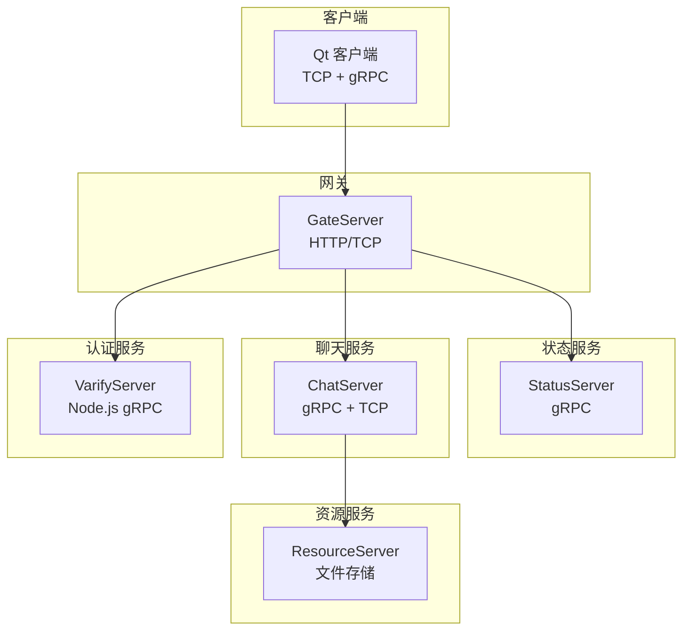
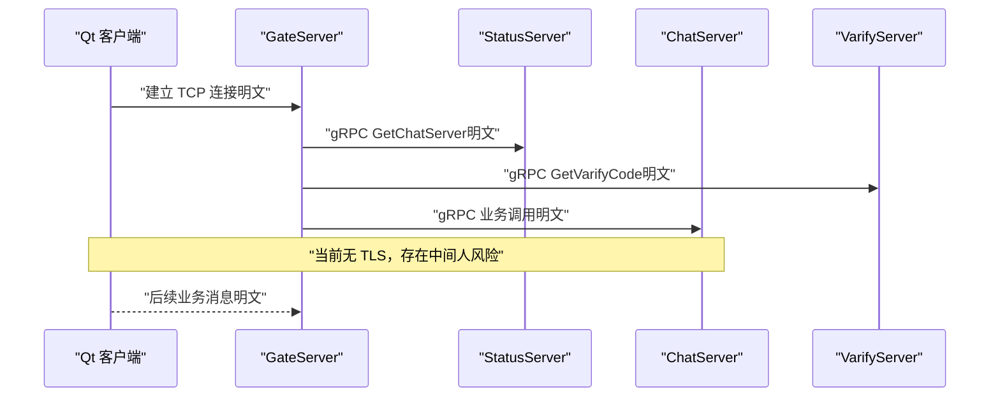
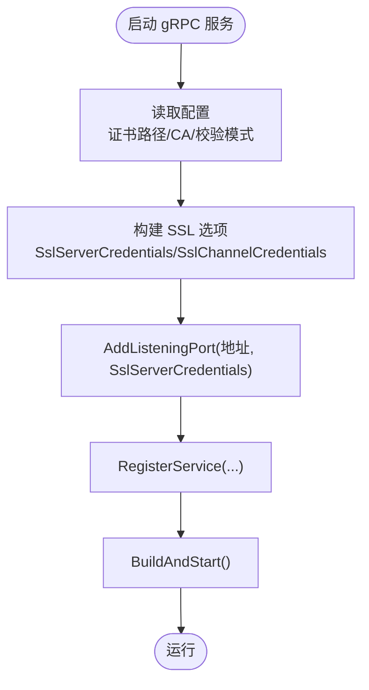
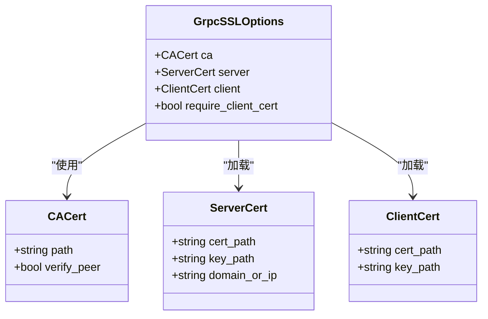
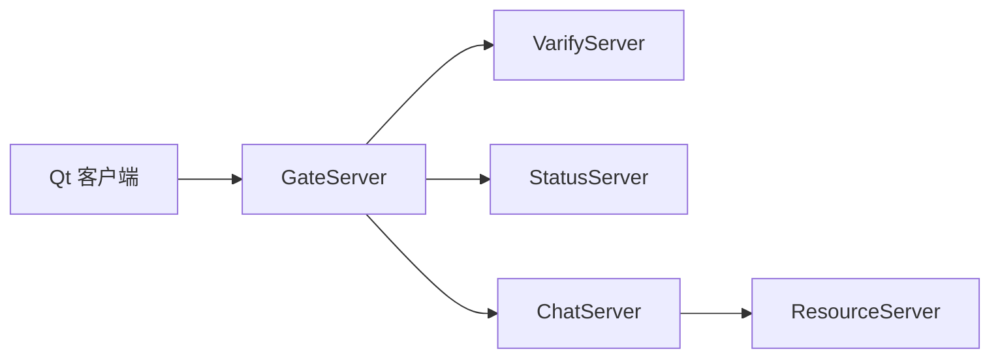

# 数据传输加密

<cite>
**本文引用的文件**   
- [chat.proto](file://proto/chat_service/chat.proto)
- [status.proto](file://proto/status_service/status.proto)
- [verify.proto](file://proto/verify_service/verify.proto)
- [ChatServer.cpp](file://server/ChatServer/src/ChatServer.cpp)
- [CSession.h](file://server/ChatServer/include/CSession.h)
- [config.ini（客户端）](file://client/llfcchat/config/config.ini)
- [chatserver1.ini（服务器）](file://server/ChatServer/config/chatserver1.ini)
- [VerifyGrpcClient.cpp](file://server/GateServer/src/VerifyGrpcClient.cpp)
- [day41-通知客户端异步下载聊天图片.md](file://开发文档/day41-通知客户端异步下载聊天图片.md)
- [day27-分布式服务设计.md](file://开发文档/day27-分布式服务设计.md)
- [tcpmgr.h](file://client/llfcchat/include/tcpmgr.h)
</cite>

## 目录
1. [简介](#简介)
2. [项目结构](#项目结构)
3. [核心组件](#核心组件)
4. [架构总览](#架构总览)
5. [详细组件分析](#详细组件分析)
6. [依赖分析](#依赖分析)
7. [性能考虑](#性能考虑)
8. [故障排查指南](#故障排查指南)
9. [结论](#结论)
10. [附录](#附录)

## 简介
本文件面向 LLFCChat 项目的“数据传输加密”主题，聚焦 gRPC 通信加密配置、TLS 证书部署与双向认证设置；同时给出敏感数据加密算法选择建议（AES、RSA）、密钥管理与轮换策略；并说明网络数据包完整性校验、数字签名验证和数据脱敏处理。此外，提供传输层安全配置、中间人攻击防护、证书吊销检查的落地方案，以及加密配置示例、性能优化建议和兼容性注意事项。

当前代码库中，gRPC 通道默认使用不安全凭据（InsecureChannelCredentials），TCP 连接未启用 TLS。因此，本文在尊重现有实现的基础上，给出从“现状”到“生产级安全”的演进路径与可操作清单。

## 项目结构
LLFCChat 采用多服务架构：
- 客户端（Qt/C++）通过 TCP 与 GateServer 通信，并通过 gRPC 调用 StatusServer、VarifyServer、ChatServer 等后端服务。
- 服务端包含 ChatServer、GateServer、StatusServer、ResourceServer、VarifyServer 等多个进程，各自承担不同职责。
- Proto 定义位于 proto 目录，分别描述 chat_service、status_service、verify_service 的接口。

**图表来源** 
- [chat.proto:1-105](file://proto/chat_service/chat.proto#L1-L105)
- [status.proto:1-32](file://proto/status_service/status.proto#L1-L32)
- [verify.proto:1-19](file://proto/verify_service/verify.proto#L1-L19)
- [ChatServer.cpp:40-79](file://server/ChatServer/src/ChatServer.cpp#L40-L79)

**章节来源**
- [chat.proto:1-105](file://proto/chat_service/chat.proto#L1-L105)
- [status.proto:1-32](file://proto/status_service/status.proto#L1-L32)
- [verify.proto:1-19](file://proto/verify_service/verify.proto#L1-L19)
- [ChatServer.cpp:40-79](file://server/ChatServer/src/ChatServer.cpp#L40-L79)

## 核心组件
- gRPC 协议定义：chat_service、status_service、verify_service 三个服务接口，涵盖好友申请/认证、文本消息、踢人、图片通知、状态查询与登录等。
- 服务端启动与监听：ChatServer 使用 grpc::ServerBuilder 启动 gRPC 服务，当前使用 InsecureServerCredentials。
- 客户端连接池：多个 gRPC 客户端通过连接池复用 Channel/Stub，当前创建 Channel 时使用 InsecureChannelCredentials。
- TCP 会话管理：CSession 负责 TCP 读写、心跳、异常处理；客户端 TcpMgr 负责连接、发送队列与消息分发。

**章节来源**
- [chat.proto:1-105](file://proto/chat_service/chat.proto#L1-L105)
- [status.proto:1-32](file://proto/status_service/status.proto#L1-L32)
- [verify.proto:1-19](file://proto/verify_service/verify.proto#L1-L19)
- [ChatServer.cpp:40-79](file://server/ChatServer/src/ChatServer.cpp#L40-L79)
- [CSession.h:1-86](file://server/ChatServer/include/CSession.h#L1-L86)
- [tcpmgr.h:1-90](file://client/llfcchat/include/tcpmgr.h#L1-L90)

## 架构总览
下图展示当前 gRPC 与 TCP 的安全现状与目标演进方向。当前所有 gRPC 通道均为明文（Insecure），TCP 亦为明文；目标是全面启用 TLS 双向认证，并在应用层对敏感字段进行加密与签名。

**图表来源** 
- [ChatServer.cpp:40-79](file://server/ChatServer/src/ChatServer.cpp#L40-L79)
- [day41-通知客户端异步下载聊天图片.md:61-215](file://开发文档/day41-通知客户端异步下载聊天图片.md#L61-L215)
- [status.proto:1-32](file://proto/status_service/status.proto#L1-L32)
- [verify.proto:1-19](file://proto/verify_service/verify.proto#L1-L19)

## 详细组件分析

### gRPC 通信加密配置（现状与改造）
- 现状
  - 服务端：ChatServer 使用 grpc::InsecureServerCredentials() 监听端口。
  - 客户端：各 gRPC 客户端通过 grpc::CreateChannel(..., grpc::InsecureChannelCredentials()) 创建连接。
- 改造要点
  - 服务端：替换为 grpc::SslServerCredentials(ssl_options)，加载 CA 证书、服务器证书与私钥，开启可选的客户端证书校验以实现 mTLS。
  - 客户端：替换为 grpc::SslChannelCredentials(ssl_options)，加载 CA 证书与可选的客户端证书/私钥。
  - 配置化：将证书路径、CA 列表、校验模式等放入配置文件（如 ini/json），支持按环境切换。

**图表来源** 
- [ChatServer.cpp:40-79](file://server/ChatServer/src/ChatServer.cpp#L40-L79)
- [day41-通知客户端异步下载聊天图片.md:61-215](file://开发文档/day41-通知客户端异步下载聊天图片.md#L61-L215)

**章节来源**
- [ChatServer.cpp:40-79](file://server/ChatServer/src/ChatServer.cpp#L40-L79)
- [day41-通知客户端异步下载聊天图片.md:61-215](file://开发文档/day41-通知客户端异步下载聊天图片.md#L61-L215)

### TLS 证书部署与双向认证（mTLS）
- 证书体系
  - CA 根证书：用于签发服务器与客户端证书。
  - 服务器证书：由 CA 签发，包含域名或 IP SAN。
  - 客户端证书：由 CA 签发，用于客户端身份认证（可选但推荐）。
- 部署步骤
  - 生成 CA 私钥与自签证书。
  - 为服务器与客户端分别生成证书请求并签发。
  - 在服务端配置 CA 证书与服务器证书/私钥；在客户端配置 CA 证书与客户端证书/私钥。
  - 根据环境（开发/测试/生产）切换证书与校验策略。
- 双向认证
  - 服务端要求客户端提供证书（可选严格校验）。
  - 客户端校验服务端证书链与主机名匹配。

**图表来源** 
- [ChatServer.cpp:40-79](file://server/ChatServer/src/ChatServer.cpp#L40-L79)
- [day41-通知客户端异步下载聊天图片.md:61-215](file://开发文档/day41-通知客户端异步下载聊天图片.md#L61-L215)

**章节来源**
- [ChatServer.cpp:40-79](file://server/ChatServer/src/ChatServer.cpp#L40-L79)
- [day41-通知客户端异步下载聊天图片.md:61-215](file://开发文档/day41-通知客户端异步下载聊天图片.md#L61-L215)

### 敏感数据加密算法选择与密钥管理
- 算法建议
  - 对称加密：AES-GCM（推荐）或 AES-CBC+HMAC，用于消息体加密。
  - 非对称加密：RSA-OAEP 或 ECIES，用于密钥协商或令牌签名。
  - 哈希与签名：SHA-256/SHA-3 与 RSA-PSS/ECDSA，用于完整性与签名。
- 密钥管理
  - 使用 KMS 或硬件安全模块（HSM）集中管理密钥。
  - 定期轮换对称密钥与非对称密钥对，最小化泄露影响。
  - 密钥分片与访问控制，避免单点泄露。
- 数据脱敏
  - 对手机号、邮箱、身份证号等敏感字段进行掩码或哈希化处理后再传输。
  - 日志与调试输出中禁止打印敏感信息。

[本节为通用安全实践指导，不直接分析具体文件]

### 网络数据包完整性校验与数字签名
- 传输层完整性：TLS 已提供 MAC/AEAD 保护，防止篡改。
- 应用层签名：对关键业务消息（如登录、转账、好友认证）附加数字签名，确保来源可信与不可抵赖。
- 校验流程：接收方先验签，再解密与解析，失败则丢弃并记录审计日志。

[本节为通用安全实践指导，不直接分析具体文件]

### 传输层安全配置与中间人攻击防护
- 强制 TLS：禁用明文通道，仅允许 TLS 1.2+，禁用弱密码套件。
- 证书校验：严格校验证书链、有效期与主机名匹配。
- HSTS 与证书固定（Pinning）：在客户端侧实施证书固定，降低中间人风险。
- 监控告警：检测异常握手失败、证书错误与频繁重连。

[本节为通用安全实践指导，不直接分析具体文件]

### 证书吊销检查
- 在线检查：启用 OCSP Stapling 与 CRL 检查，及时拒绝被吊销证书。
- 离线兜底：在网络不可用时，结合本地缓存与超时策略，避免阻塞。
- 自动化更新：证书与 CRL/OCSP 响应自动刷新，减少运维负担。

[本节为通用安全实践指导，不直接分析具体文件]

### 配置示例与兼容性考虑
- 配置项建议
  - 服务端：tls_enabled=true, ca_cert_path=..., server_cert_path=..., server_key_path=..., require_client_cert=false
  - 客户端：tls_enabled=true, ca_cert_path=..., client_cert_path=..., client_key_path=...
- 兼容性
  - 旧版本客户端与服务端需灰度过渡，支持双通道（明文与 TLS）并行一段时间。
  - 明确降级策略与回滚机制，确保升级过程稳定。

**章节来源**
- [config.ini（客户端）:1-4](file://client/llfcchat/config/config.ini#L1-L4)
- [chatserver1.ini（服务器）:1-30](file://server/ChatServer/config/chatserver1.ini#L1-L30)

## 依赖分析
- gRPC 依赖
  - ChatServer 作为服务端，注册 ChatServiceImpl，监听 RPC 端口。
  - GateServer 作为客户端，调用 VarifyServer、StatusServer、ChatServer。
  - 客户端通过 TcpMgr 与 GateServer 交互，间接调用后端 gRPC 服务。
- 当前安全依赖
  - 全部使用 InsecureChannelCredentials/InsecureServerCredentials，无 TLS。
- 改造后依赖
  - 引入 OpenSSL/gRPC SSL 选项，统一证书与 CA 管理。

**图表来源** 
- [ChatServer.cpp:40-79](file://server/ChatServer/src/ChatServer.cpp#L40-L79)
- [VerifyGrpcClient.cpp:1-9](file://server/GateServer/src/VerifyGrpcClient.cpp#L1-L9)
- [tcpmgr.h:1-90](file://client/llfcchat/include/tcpmgr.h#L1-L90)

**章节来源**
- [ChatServer.cpp:40-79](file://server/ChatServer/src/ChatServer.cpp#L40-L79)
- [VerifyGrpcClient.cpp:1-9](file://server/GateServer/src/VerifyGrpcClient.cpp#L1-L9)
- [tcpmgr.h:1-90](file://client/llfcchat/include/tcpmgr.h#L1-L90)

## 性能考虑
- TLS 开销
  - 握手成本：首次连接较高，应复用连接（连接池）以减少握手次数。
  - CPU 消耗：加解密与签名验签占用 CPU，建议使用硬件加速（AES-NI、OpenSSL 引擎）。
- 连接池与并发
  - 合理设置连接池大小，避免过多上下文切换与内存占用。
  - 异步 I/O 与零拷贝优化，减少序列化/反序列化开销。
- 缓存与批处理
  - 对高频小消息进行批处理，降低握手与协议头开销。
  - 热点数据缓存，减少数据库与外部服务调用。

[本节为通用性能指导，不直接分析具体文件]

## 故障排查指南
- 常见问题
  - 握手失败：证书路径错误、CA 不匹配、主机名不一致。
  - 连接超时：防火墙拦截、端口未开放、证书过期。
  - 验签失败：私钥不匹配、时间同步问题、签名算法不一致。
- 排查步骤
  - 检查服务端与客户端证书链与有效期。
  - 启用详细日志，捕获握手错误码与堆栈。
  - 使用 openssl s_client 与 wireshark 抓包定位问题。
- 恢复策略
  - 快速回滚到上一稳定版本。
  - 临时放宽校验策略（仅测试环境），尽快修复后恢复严格模式。

[本节为通用故障排查指导，不直接分析具体文件]

## 结论
当前 LLFCChat 的 gRPC 与 TCP 通信均为明文，存在中间人攻击与数据泄露风险。建议尽快完成以下工作：
- 全面启用 TLS 双向认证，禁用明文通道。
- 引入应用层加密与签名，保护敏感字段与关键业务消息。
- 完善密钥管理与轮换策略，结合 KMS/HSM 提升安全性。
- 建立证书吊销检查与监控告警机制，保障生产稳定性。
- 制定灰度发布与回滚策略，确保平滑升级。

[本节为总结性内容，不直接分析具体文件]

## 附录
- 相关 Proto 接口
  - chat_service：好友申请/认证、文本消息、踢人、图片通知。
  - status_service：获取 ChatServer 信息与登录。
  - verify_service：验证码获取。
- 配置参考
  - 客户端 config.ini：GateServer 地址与端口。
  - 服务器 chatserver1.ini：各服务 Host/Port、Redis/Mysql 配置。

**章节来源**
- [chat.proto:1-105](file://proto/chat_service/chat.proto#L1-L105)
- [status.proto:1-32](file://proto/status_service/status.proto#L1-L32)
- [verify.proto:1-19](file://proto/verify_service/verify.proto#L1-L19)
- [config.ini（客户端）:1-4](file://client/llfcchat/config/config.ini#L1-L4)
- [chatserver1.ini（服务器）:1-30](file://server/ChatServer/config/chatserver1.ini#L1-L30)