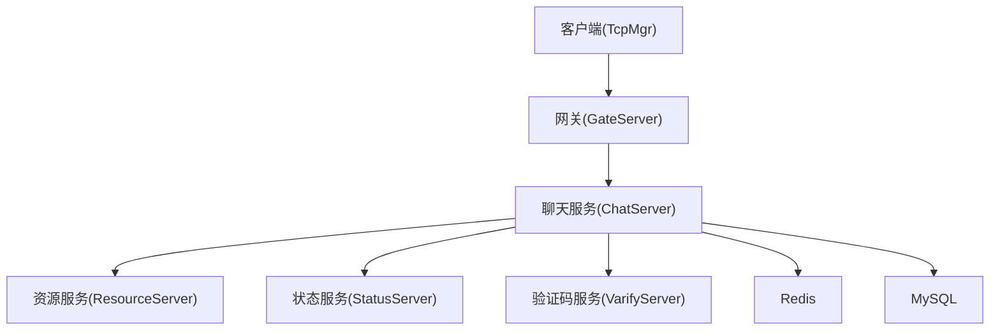
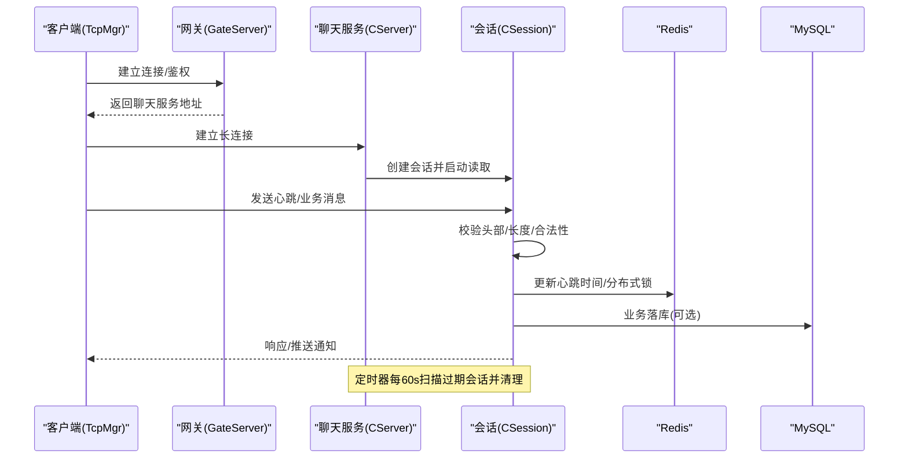
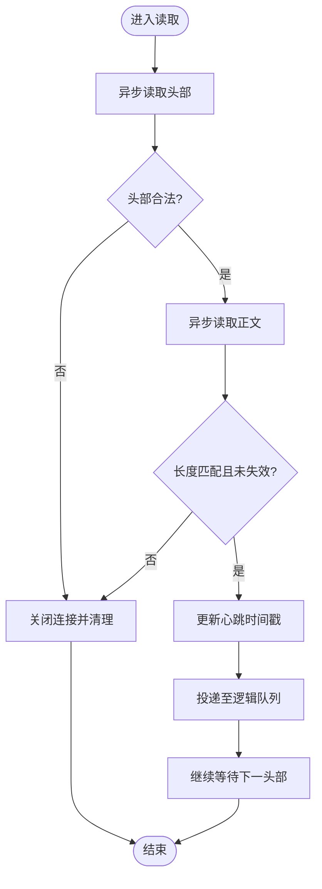
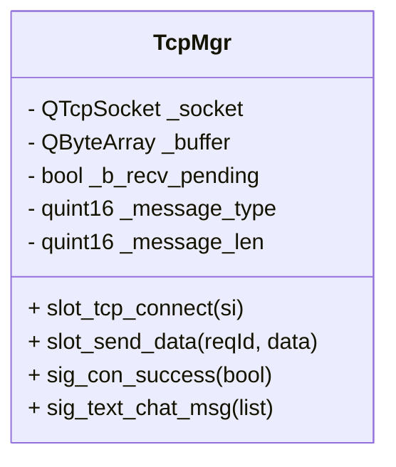
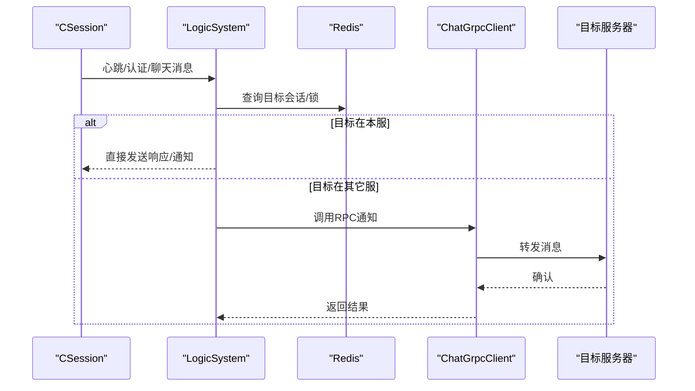
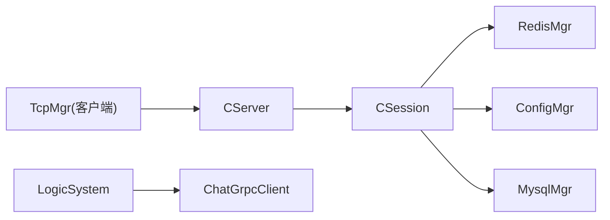

# 网络安全监控

<cite>
**本文引用的文件**   
- [CSession.h](file://server/ChatServer/include/CSession.h)
- [CSession.cpp](file://server/ChatServer/src/CSession.cpp)
- [CServer.h](file://server/ChatServer/include/CServer.h)
- [CServer.cpp](file://server/ChatServer/src/CServer.cpp)
- [tcpmgr.h](file://client/llfcchat/include/tcpmgr.h)
- [LogicSystem.cpp](file://server/ChatServer/src/LogicSystem.cpp)
- [redis.js](file://server/VarifyServer/redis.js)
- [chatserver1.ini](file://server/ChatServer/config/chatserver1.ini)
- [config.ini（Gate）](file://server/GateServer/config/config.ini)
- [day35心跳逻辑.md](file://开发文档/day35心跳逻辑.md)
- [day33单服程踢人逻辑.md](file://开发文档/day33单服程踢人逻辑.md)
</cite>

## 目录
1. [简介](#简介)
2. [项目结构](#项目结构)
3. [核心组件](#核心组件)
4. [架构总览](#架构总览)
5. [详细组件分析](#详细组件分析)
6. [依赖关系分析](#依赖关系分析)
7. [性能与容量规划](#性能与容量规划)
8. [故障诊断指南](#故障诊断指南)
9. [结论](#结论)
10. [附录：监控配置模板、告警规则与审计合规清单](#附录监控配置模板告警规则与审计合规清单)

## 简介
本文件面向 LLFCChat 的网络安全监控，聚焦以下目标：
- 网络流量指标采集：连接数、会话存活、消息吞吐、错误率、时延等。
- 异常连接检测：非法头部、长度越界、频繁断连、异地登录冲突。
- 入侵行为识别：异常报文ID/长度、高频请求、异常IP/端口、资源滥用。
- 安全事件日志与告警：关键路径的错误、超时、锁竞争、Redis/MySQL异常。
- 实时监控面板：服务连接数、活跃会话、错误统计、延迟分布。
- 网络性能分析：心跳周期、读写队列、背压与限流。
- 流量模式识别：聊天文本/图片上传/下载、认证流程、跨服通知。
- 威胁情报集成：可扩展接入外部黑名单/白名单、恶意特征库。
- 安全审计与合规：访问控制、数据持久化、变更留痕、定期评估。

## 项目结构
LLFCChat 采用多进程/多服务架构，核心包括：
- 客户端：Qt TCP 管理模块，负责长连接、粘包处理、消息分发。
- ChatServer：基于 Boost.Asio 的高性能 TCP 服务器，维护会话、心跳、定时清理。
- GateServer：网关入口，统一对外暴露端口。
- ResourceServer：文件传输与资源服务。
- StatusServer：状态服务（示例）。
- VarifyServer：验证码与辅助服务（Node.js + Redis）。
- 存储层：MySQL、Redis。

**图表来源** 
- [CServer.cpp:8-14](file://server/ChatServer/src/CServer.cpp#L8-L14)
- [CSession.cpp:10-16](file://server/ChatServer/src/CSession.cpp#L10-L16)
- [tcpmgr.h:22-87](file://client/llfcchat/include/tcpmgr.h#L22-L87)

**章节来源**
- [CServer.h:1-39](file://server/ChatServer/include/CServer.h#L1-L39)
- [CServer.cpp:8-38](file://server/ChatServer/src/CServer.cpp#L8-L38)
- [CSession.h:28-76](file://server/ChatServer/include/CSession.h#L28-L76)
- [CSession.cpp:10-41](file://server/ChatServer/src/CSession.cpp#L10-L41)
- [tcpmgr.h:22-87](file://client/llfcchat/include/tcpmgr.h#L22-L87)

## 核心组件
- CSession：封装单个TCP会话的读/写、心跳、异常处理、离线通知。
- CServer：监听端口、接受连接、维护会话表、周期性心跳检测与清理。
- TcpMgr（客户端）：封装QTcpSocket，实现粘包解析、发送队列、信号回调。
- LogicSystem：业务逻辑路由（如心跳、好友认证、聊天消息转发）。
- Redis/MySQL：会话状态、分布式锁、用户信息、消息与文件元数据。

**章节来源**
- [CSession.h:28-76](file://server/ChatServer/include/CSession.h#L28-L76)
- [CSession.cpp:87-128](file://server/ChatServer/src/CSession.cpp#L87-L128)
- [CServer.h:10-37](file://server/ChatServer/include/CServer.h#L10-L37)
- [CServer.cpp:75-118](file://server/ChatServer/src/CServer.cpp#L75-L118)
- [tcpmgr.h:22-87](file://client/llfcchat/include/tcpmgr.h#L22-L87)
- [LogicSystem.cpp:568-575](file://server/ChatServer/src/LogicSystem.cpp#L568-L575)

## 架构总览
下图展示从客户端到服务器的完整通信与安全监控关键点：

**图表来源** 
- [CServer.cpp:21-38](file://server/ChatServer/src/CServer.cpp#L21-L38)
- [CSession.cpp:130-191](file://server/ChatServer/src/CSession.cpp#L130-L191)
- [LogicSystem.cpp:568-575](file://server/ChatServer/src/LogicSystem.cpp#L568-L575)
- [redis.js:45-101](file://server/VarifyServer/redis.js#L45-L101)

## 详细组件分析

### 会话与心跳（CSession/CServer）
- 心跳机制：每次成功接收数据即更新最后心跳时间；定时器按阈值判定过期并关闭连接。
- 异常处理：读/写失败、长度不匹配、非法ID触发清理与分布式锁保护。
- 连接数统计：定时器结束后将当前有效会话数写入Redis，便于监控面板聚合。

**图表来源** 
- [CSession.cpp:130-191](file://server/ChatServer/src/CSession.cpp#L130-L191)
- [CSession.cpp:87-128](file://server/ChatServer/src/CSession.cpp#L87-L128)
- [CServer.cpp:75-118](file://server/ChatServer/src/CServer.cpp#L75-L118)

**章节来源**
- [CSession.cpp:285-333](file://server/ChatServer/src/CSession.cpp#L285-L333)
- [CServer.cpp:75-118](file://server/ChatServer/src/CServer.cpp#L75-L118)
- [day35心跳逻辑.md:41-92](file://开发文档/day35心跳逻辑.md#L41-L92)
- [day33单服程踢人逻辑.md:397-460](file://开发文档/day33单服程踢人逻辑.md#L397-L460)

### 客户端TCP管理（TcpMgr）
- 粘包处理：先解析固定长度的头部（消息类型+长度），再按长度读取正文。
- 发送队列：保证并发安全，避免丢包与乱序。
- 信号驱动：通过Qt信号槽将网络事件映射到UI或业务逻辑。

**图表来源** 
- [tcpmgr.h:22-87](file://client/llfcchat/include/tcpmgr.h#L22-L87)

**章节来源**
- [tcpmgr.h:22-87](file://client/llfcchat/include/tcpmgr.h#L22-L87)

### 业务逻辑与跨服通知（LogicSystem）
- 心跳处理：解析请求、回显成功、更新服务端侧的心跳计数。
- 好友认证/聊天消息：根据目标UID所在服务器进行本地或跨服通知。

**图表来源** 
- [LogicSystem.cpp:568-575](file://server/ChatServer/src/LogicSystem.cpp#L568-L575)

**章节来源**
- [LogicSystem.cpp:568-575](file://server/ChatServer/src/LogicSystem.cpp#L568-L575)

### 存储与缓存（Redis/MySQL）
- Redis：会话状态、分布式锁、验证码、文件传输进度等。
- MySQL：用户、好友关系、聊天消息、线程信息等持久化数据。

**章节来源**
- [redis.js:45-101](file://server/VarifyServer/redis.js#L45-L101)

## 依赖关系分析
- CServer 依赖 CSession 管理每个连接的生命周期。
- CSession 依赖 RedisMgr/ConfigMgr/MysqlMgr 完成状态同步与持久化。
- 客户端 TcpMgr 依赖 Qt 网络栈与信号槽机制。
- LogicSystem 依赖 gRPC 客户端进行跨服务通信。

**图表来源** 
- [CServer.h:10-37](file://server/ChatServer/include/CServer.h#L10-L37)
- [CSession.h:28-76](file://server/ChatServer/include/CSession.h#L28-L76)
- [LogicSystem.cpp:568-575](file://server/ChatServer/src/LogicSystem.cpp#L568-L575)

**章节来源**
- [CServer.h:10-37](file://server/ChatServer/include/CServer.h#L10-L37)
- [CSession.h:28-76](file://server/ChatServer/include/CSession.h#L28-L76)
- [LogicSystem.cpp:568-575](file://server/ChatServer/src/LogicSystem.cpp#L568-L575)

## 性能与容量规划
- 心跳周期：默认60秒，可根据负载调整；过短增加开销，过长降低异常发现速度。
- 发送队列：限制最大队列长度，防止内存膨胀；必要时引入背压与丢弃策略。
- 连接数统计：通过Redis哈希记录各服务连接数，便于横向扩展与负载均衡。
- I/O模型：Boost.Asio 异步I/O，配合IOService池提升吞吐。

[本节为通用指导，无需代码引用]

## 故障诊断指南
- 常见错误定位
  - 读取失败/长度不匹配：检查协议头定义、字节序转换、粘包处理。
  - 心跳过期：检查客户端是否按时发送心跳、网络抖动、防火墙策略。
  - 异地登录冲突：检查Redis会话ID一致性、分布式锁获取与释放。
  - 跨服通知失败：检查gRPC连接池、目标服务可达性与权限。
- 排查步骤
  - 查看服务日志中的错误码与堆栈。
  - 检查Redis键是否存在、是否过期、锁是否被正确释放。
  - 使用抓包工具验证报文结构与顺序。
  - 核对配置文件（端口、主机、密码）与服务注册信息。

**章节来源**
- [CSession.cpp:87-128](file://server/ChatServer/src/CSession.cpp#L87-L128)
- [CSession.cpp:130-191](file://server/ChatServer/src/CSession.cpp#L130-L191)
- [CSession.cpp:301-333](file://server/ChatServer/src/CSession.cpp#L301-L333)
- [day33单服程踢人逻辑.md:397-460](file://开发文档/day33单服程踢人逻辑.md#L397-L460)

## 结论
LLFCChat 的网络层具备完善的会话管理、心跳检测与异常处理能力，结合Redis与MySQL可实现高可用与可观测性。通过补充统一的监控指标采集、告警规则与审计日志，可进一步提升安全性与稳定性。

[本节为总结，无需代码引用]

## 附录：监控配置模板、告警规则与审计合规清单

### 监控指标采集建议
- 连接与会话
  - 活跃会话数（按服务维度）
  - 新建连接速率、断开连接速率
  - 心跳成功率、平均心跳时延
- 消息与吞吐
  - 入站/出站消息量（按类型：文本、图片、认证）
  - 消息大小分布、P95/P99时延
- 错误与异常
  - 读/写错误次数、长度不匹配、非法ID
  - 跨服通知失败次数、gRPC错误码分布
- 存储与缓存
  - Redis命中率、键空间增长、锁竞争次数
  - MySQL慢查询、连接池占用、事务失败率

### 告警规则（示例）
- 连接异常
  - 连续N次心跳失败（阈值：3次/分钟）→ 警告
  - 会话数突降超过X%（阈值：20%/5分钟）→ 严重
- 消息异常
  - 消息长度不匹配率 > Y%（阈值：1%/10分钟）→ 严重
  - 跨服通知失败率 > Z%（阈值：5%/5分钟）→ 严重
- 存储异常
  - Redis锁获取失败率 > W%（阈值：2%/分钟）→ 警告
  - MySQL慢查询占比 > V%（阈值：10%/小时）→ 警告

### 安全审计与合规清单
- 访问控制
  - 登录态校验、Token有效性、会话绑定IP/设备指纹（可选）
- 数据持久化
  - 敏感字段加密存储、操作日志不可篡改、保留周期策略
- 变更留痕
  - 配置变更审计、版本发布记录、回滚预案
- 定期评估
  - 渗透测试、漏洞扫描、依赖库升级、最小权限原则

### 监控配置模板（示例）
- 服务配置（ChatServer）
  - 监听端口、RPC端口、对端服务列表、存储连接参数
- 网关配置（GateServer）
  - 对外端口、后端服务路由、健康检查
- 验证码服务（VarifyServer）
  - Redis连接、邮件服务、验证码有效期

**章节来源**
- [chatserver1.ini:1-30](file://server/ChatServer/config/chatserver1.ini#L1-L30)
- [config.ini（Gate）:1-25](file://server/GateServer/config/config.ini#L1-L25)
- [redis.js:45-101](file://server/VarifyServer/redis.js#L45-L101)