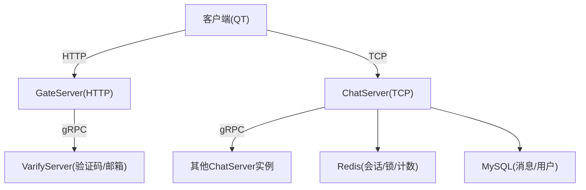
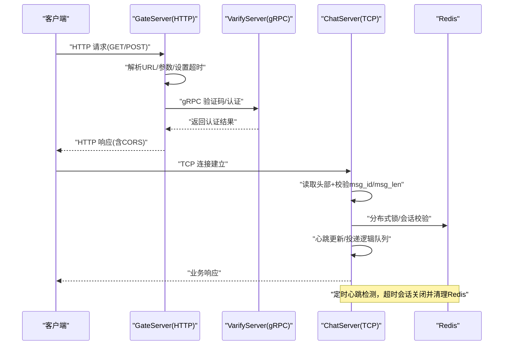
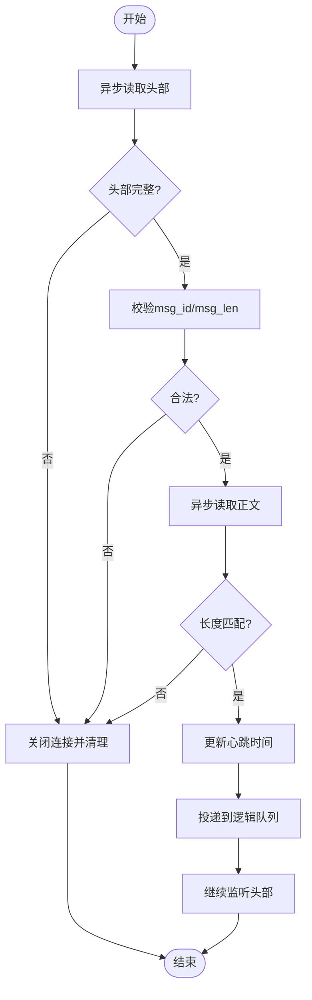
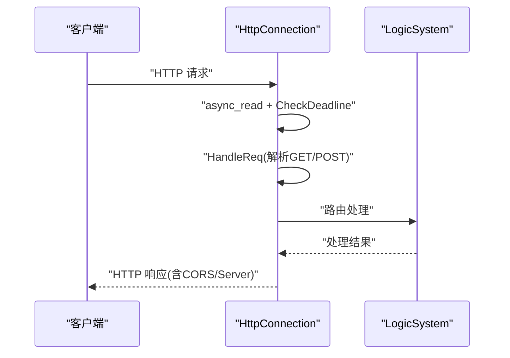
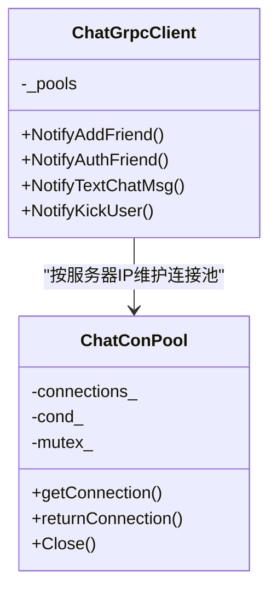
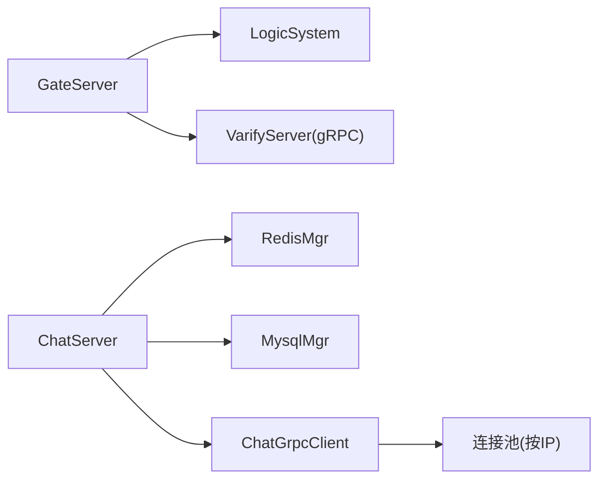

# 网络安全防护

<cite>
**本文引用的文件**   
- [server/GateServer/include/HttpConnection.h](file://server/GateServer/include/HttpConnection.h)
- [server/GateServer/src/HttpConnection.cpp](file://server/GateServer/src/HttpConnection.cpp)
- [server/ChatServer/include/CSession.h](file://server/ChatServer/include/CSession.h)
- [server/ChatServer/src/CSession.cpp](file://server/ChatServer/src/CSession.cpp)
- [server/ChatServer/include/CServer.h](file://server/ChatServer/include/CServer.h)
- [开发文档/day35心跳逻辑.md](file://开发文档/day35心跳逻辑.md)
- [开发文档/day33单服程踢人逻辑.md](file://开发文档/day33单服程踢人逻辑.md)
- [server/ChatServer/include/ChatGrpcClient.h](file://server/ChatServer/include/ChatGrpcClient.h)
- [proto/chat_service/chat.proto](file://proto/chat_service/chat.proto)
- [client/llfcchat/config/config.ini](file://client/llfcchat/config/config.ini)
</cite>

## 目录
1. [简介](#简介)
2. [项目结构](#项目结构)
3. [核心组件](#核心组件)
4. [架构总览](#架构总览)
5. [详细组件分析](#详细组件分析)
6. [依赖关系分析](#依赖关系分析)
7. [性能与安全考量](#性能与安全考量)
8. [故障排查指南](#故障排查指南)
9. [结论](#结论)
10. [附录：安全配置模板与示例](#附录安全配置模板与示例)

## 简介
本安全文档围绕 LLFCChat 的网络通信链路，系统性梳理并强化以下方面：TCP 连接安全、HTTP 请求验证、gRPC 通信加密；DDoS 攻击防护、连接数限制与请求频率控制；网络层安全配置、防火墙规则与入侵检测策略；恶意 IP 封禁、异常行为检测与网络安全监控；以及协议安全、数据包校验与流量分析方法。文档同时给出可落地的代码级参考路径与安全配置模板，帮助在现有实现基础上快速补齐安全能力。

## 项目结构
LLFCChat 采用多服务架构：GateServer（HTTP 网关）、ChatServer（长连接聊天服务）、ResourceServer（资源服务）、StatusServer（状态服务）以及 VarifyServer（验证码/邮箱认证）。客户端通过 GateServer 进行 HTTP 鉴权与路由，随后建立到 ChatServer 的 TCP 长连接；服务间通过 gRPC 通信。Redis 用于分布式锁、会话与登录态管理，MySQL 用于持久化存储。

[无图表来源：该图为概念性架构图]

**章节来源**
- [client/llfcchat/config/config.ini:1-3](file://client/llfcchat/config/config.ini#L1-L3)

## 核心组件
- GateServer HTTP 连接处理：负责解析请求、设置超时、CORS 响应头、路由分发至 LogicSystem。
- ChatServer TCP 会话：基于 Boost.Asio 的异步读写、粘包处理、心跳检测、发送队列限流、异常清理。
- gRPC 客户端池：使用 InsecureChannelCredentials 创建连接池，当前未启用 TLS。
- Redis 管理器：连接池保活、PING 探测、失败重连与 AUTH 认证。

**章节来源**
- [server/GateServer/include/HttpConnection.h:1-36](file://server/GateServer/include/HttpConnection.h#L1-L36)
- [server/GateServer/src/HttpConnection.cpp:1-225](file://server/GateServer/src/HttpConnection.cpp#L1-L225)
- [server/ChatServer/include/CSession.h:1-86](file://server/ChatServer/include/CSession.h#L1-L86)
- [server/ChatServer/src/CSession.cpp:1-200](file://server/ChatServer/src/CSession.cpp#L1-L200)
- [server/ChatServer/include/ChatGrpcClient.h:1-116](file://server/ChatServer/include/ChatGrpcClient.h#L1-L116)

## 架构总览
下图展示了从 HTTP 鉴权到 TCP 聊天、再到跨服务 gRPC 通知的整体流程，并标注了关键的安全检查点（如请求体长度校验、心跳过期清理、分布式锁保护等）。

**图表来源**
- [server/GateServer/src/HttpConnection.cpp:1-225](file://server/GateServer/src/HttpConnection.cpp#L1-L225)
- [server/ChatServer/src/CSession.cpp:1-200](file://server/ChatServer/src/CSession.cpp#L1-L200)
- [开发文档/day35心跳逻辑.md:41-93](file://开发文档/day35心跳逻辑.md#L41-L93)

**章节来源**
- [server/GateServer/src/HttpConnection.cpp:1-225](file://server/GateServer/src/HttpConnection.cpp#L1-L225)
- [server/ChatServer/src/CSession.cpp:1-200](file://server/ChatServer/src/CSession.cpp#L1-L200)
- [开发文档/day35心跳逻辑.md:41-93](file://开发文档/day35心跳逻辑.md#L41-L93)

## 详细组件分析

### TCP 连接安全与会话管理
- 粘包与头部校验：读取固定长度的头部后，校验 msg_id 与 msg_len 是否越界，防止畸形报文导致内存溢出或拒绝服务。
- 发送队列限流：当发送队列超过阈值时直接丢弃，避免内存暴涨。
- 心跳机制：每次接收数据更新心跳时间戳；定时器周期性扫描，超过阈值的会话主动关闭并清理 Redis 中的会话与登录信息。
- 异常清理：读/写错误统一进入异常处理分支，关闭 socket，并通过分布式锁保证会话清理的一致性。

**图表来源**
- [server/ChatServer/src/CSession.cpp:130-191](file://server/ChatServer/src/CSession.cpp#L130-L191)
- [server/ChatServer/src/CSession.cpp:87-128](file://server/ChatServer/src/CSession.cpp#L87-L128)

**章节来源**
- [server/ChatServer/include/CSession.h:1-86](file://server/ChatServer/include/CSession.h#L1-L86)
- [server/ChatServer/src/CSession.cpp:1-200](file://server/ChatServer/src/CSession.cpp#L1-L200)
- [开发文档/day35心跳逻辑.md:41-93](file://开发文档/day35心跳逻辑.md#L41-L93)

### HTTP 请求验证与网关安全
- 请求解析：支持 GET/POST，GET 参数 URL 解码与拆分，POST 交由 LogicSystem 处理。
- 超时控制：为每个连接设置 deadline，超时则关闭 socket。
- CORS：默认允许所有来源，生产环境应严格限制 origin。
- 路由与响应：未命中路由返回 404，成功返回 200 并设置 Server 头。

**图表来源**
- [server/GateServer/src/HttpConnection.cpp:1-225](file://server/GateServer/src/HttpConnection.cpp#L1-L225)

**章节来源**
- [server/GateServer/include/HttpConnection.h:1-36](file://server/GateServer/include/HttpConnection.h#L1-L36)
- [server/GateServer/src/HttpConnection.cpp:1-225](file://server/GateServer/src/HttpConnection.cpp#L1-L225)

### gRPC 通信与加密现状
- 连接池：各服务通过连接池复用 gRPC Channel，减少握手开销。
- 当前凭证：使用 InsecureChannelCredentials，未启用 TLS 加密。
- 建议：在生产环境启用 TLS 双向认证，配置证书与信任链，限制仅允许受信任 CA。

**图表来源**
- [server/ChatServer/include/ChatGrpcClient.h:1-116](file://server/ChatServer/include/ChatGrpcClient.h#L1-L116)
- [proto/chat_service/chat.proto:1-105](file://proto/chat_service/chat.proto#L1-L105)

**章节来源**
- [server/ChatServer/include/ChatGrpcClient.h:1-116](file://server/ChatServer/include/ChatGrpcClient.h#L1-L116)
- [proto/chat_service/chat.proto:1-105](file://proto/chat_service/chat.proto#L1-L105)

### DDoS 防护、连接数限制与频率控制
- 连接数限制：
  - 发送队列上限：防止单个会话占用过多内存。
  - 服务端 Accept 层需增加并发连接上限（当前代码未体现，建议在 AsioIOServicePool 或 CServer 中实现）。
- 频率控制：
  - 网关层对同一 IP 的请求速率进行限制（当前未实现，建议在 GateServer 中引入令牌桶/漏桶算法）。
  - Redis 计数器结合滑动窗口实现接口限流。
- DDoS 缓解：
  - 短连接超时、慢连接淘汰（已实现 HTTP 超时）。
  - 针对 TCP 连接建立阶段增加 SYN Flood 防护（操作系统层面或前置设备）。
  - 接入 CDN/WAF 进行清洗与黑白名单。

[本节为通用指导，不直接分析具体文件]

### 网络层安全配置、防火墙与入侵检测
- 防火墙规则：
  - 仅开放必要端口（如 80/443、gRPC 端口），限制源 IP 段。
  - 对 Redis/MySQL 仅允许内网访问。
- 入侵检测：
  - 基于日志的异常模式识别（高频 404、异常包头、超长报文）。
  - 结合系统审计与 eBPF/IDS 工具进行实时告警。
- 安全加固：
  - 禁用不必要的服务与模块。
  - 定期更新系统与依赖库。

[本节为通用指导，不直接分析具体文件]

### 恶意 IP 封禁、异常行为检测与网络安全监控
- 恶意 IP 封禁：
  - 在 GateServer 中维护黑名单（Redis 或内存），命中即拒绝。
  - 与 WAF/云厂商安全组联动自动封禁。
- 异常行为检测：
  - 统计单位时间内某 IP 的连接数、请求数、错误率，超过阈值触发告警。
  - 对非法 msg_id/msg_len、频繁断线重连等行为进行标记。
- 安全监控：
  - 集中采集日志（Nginx/GateServer/ChatServer/Redis/MySQL），使用 ELK/Splunk 进行分析。
  - 关键指标：QPS、延迟分布、错误码分布、连接数、CPU/内存使用率。

[本节为通用指导，不直接分析具体文件]

## 依赖关系分析
- GateServer 依赖 LogicSystem 进行路由处理，依赖 VarifyServer 进行验证码/邮箱认证。
- ChatServer 依赖 RedisMgr 进行分布式锁与会话管理，依赖 MysqlMgr 进行数据存取。
- gRPC 客户端池依赖配置文件获取目标服务地址与端口。

**图表来源**
- [server/GateServer/src/HttpConnection.cpp:1-225](file://server/GateServer/src/HttpConnection.cpp#L1-L225)
- [server/ChatServer/include/ChatGrpcClient.h:1-116](file://server/ChatServer/include/ChatGrpcClient.h#L1-L116)

**章节来源**
- [server/GateServer/src/HttpConnection.cpp:1-225](file://server/GateServer/src/HttpConnection.cpp#L1-L225)
- [server/ChatServer/include/ChatGrpcClient.h:1-116](file://server/ChatServer/include/ChatGrpcClient.h#L1-L116)

## 性能与安全考量
- 性能：
  - 使用非阻塞 I/O 与异步回调提升吞吐。
  - 连接池复用减少握手开销。
  - 发送队列限流避免背压导致的内存膨胀。
- 安全：
  - 输入校验（头部长度、ID 范围）防止缓冲区溢出。
  - 心跳与超时机制降低僵尸连接风险。
  - 分布式锁确保会话清理一致性，避免竞态条件。
  - 建议启用 gRPC TLS 与 HTTPS，最小化暴露面。

[本节为通用指导，不直接分析具体文件]

## 故障排查指南
- 常见问题：
  - 连接频繁断开：检查心跳阈值、网络抖动、客户端异常退出。
  - 登录踢人：确认 Redis 中会话 ID 一致性，分布式锁是否释放。
  - HTTP 404：检查路由注册与 URL 解析。
- 定位方法：
  - 查看服务端日志（read failed、length not match、invalid msg_id/msg_len）。
  - 检查 Redis 键值（USER_SESSION_PREFIX、USERIPPREFIX）。
  - 使用抓包工具分析 TCP 握手与报文结构。

**章节来源**
- [server/ChatServer/src/CSession.cpp:130-191](file://server/ChatServer/src/CSession.cpp#L130-L191)
- [开发文档/day33单服程踢人逻辑.md:387-395](file://开发文档/day33单服程踢人逻辑.md#L387-L395)

## 结论
LLFCChat 在网络层已具备基础的连接管理、心跳检测与输入校验能力，但在 gRPC 加密、HTTP 安全头、频率限制与 DDoS 防护等方面仍有较大提升空间。建议优先启用 TLS、完善网关安全策略、引入速率限制与入侵检测，并建立完善的监控与告警体系，以全面提升系统的安全性与可用性。

[本节为总结，不直接分析具体文件]

## 附录：安全配置模板与示例

### 安全配置模板
- GateServer HTTP 安全头
  - Content-Security-Policy: 限制资源加载来源
  - X-Frame-Options: DENY
  - X-Content-Type-Options: nosniff
  - Strict-Transport-Security: max-age=31536000; includeSubDomains
  - CORS: 仅允许可信域名
- 防火墙规则
  - 仅开放 80/443 与 gRPC 端口
  - 限制 Redis/MySQL 仅内网访问
- gRPC TLS
  - 启用 mutual TLS，配置证书与信任链
  - 禁止明文通道

[本节为通用模板，不直接分析具体文件]

### 代码示例参考路径
- HTTP 连接与超时控制
  - [server/GateServer/src/HttpConnection.cpp:1-225](file://server/GateServer/src/HttpConnection.cpp#L1-L225)
- TCP 会话与心跳
  - [server/ChatServer/src/CSession.cpp:1-200](file://server/ChatServer/src/CSession.cpp#L1-L200)
  - [开发文档/day35心跳逻辑.md:41-93](file://开发文档/day35心跳逻辑.md#L41-L93)
- gRPC 连接池与调用
  - [server/ChatServer/include/ChatGrpcClient.h:1-116](file://server/ChatServer/include/ChatGrpcClient.h#L1-L116)
  - [proto/chat_service/chat.proto:1-105](file://proto/chat_service/chat.proto#L1-L105)
- 登录与踢人逻辑
  - [开发文档/day33单服程踢人逻辑.md:241-382](file://开发文档/day33单服程踢人逻辑.md#L241-L382)

[本节为引用路径，不包含具体代码内容]