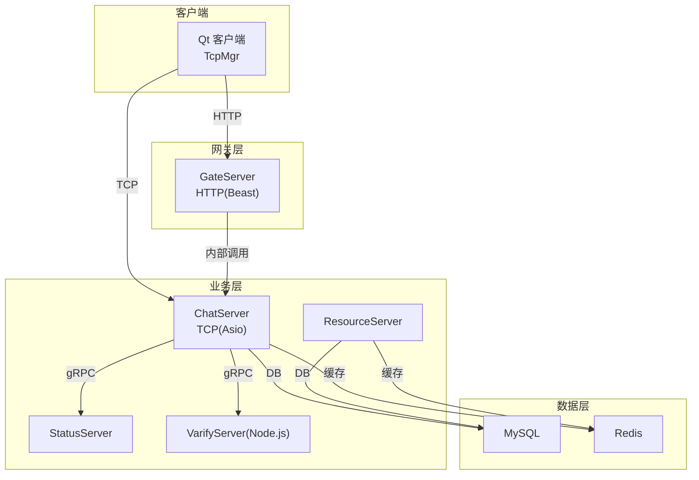
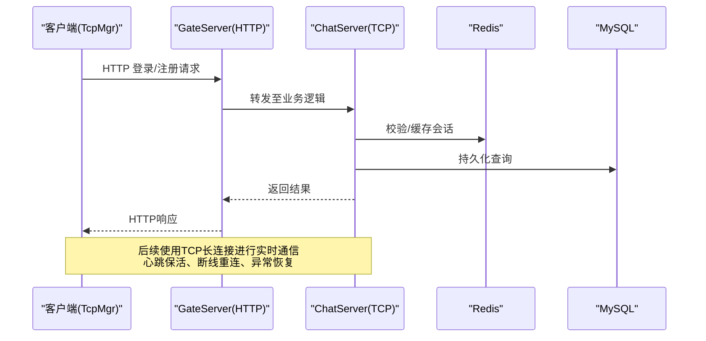
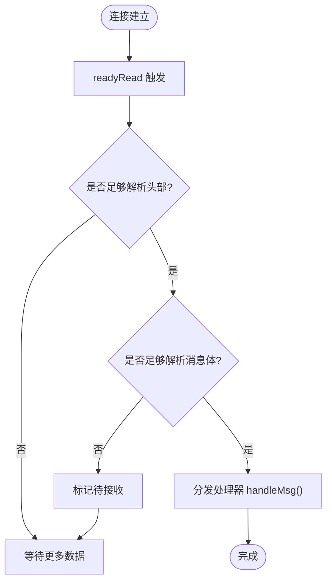
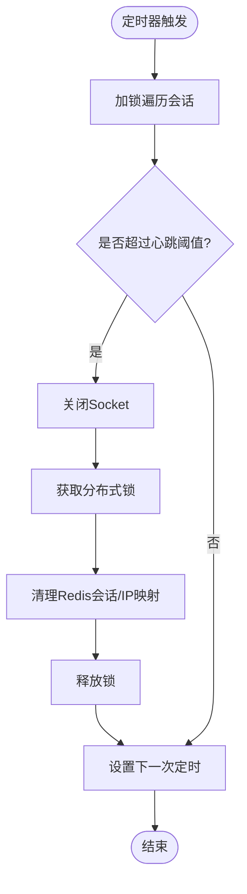
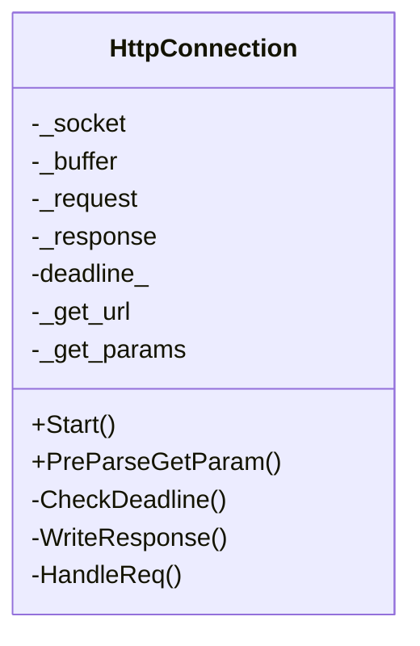
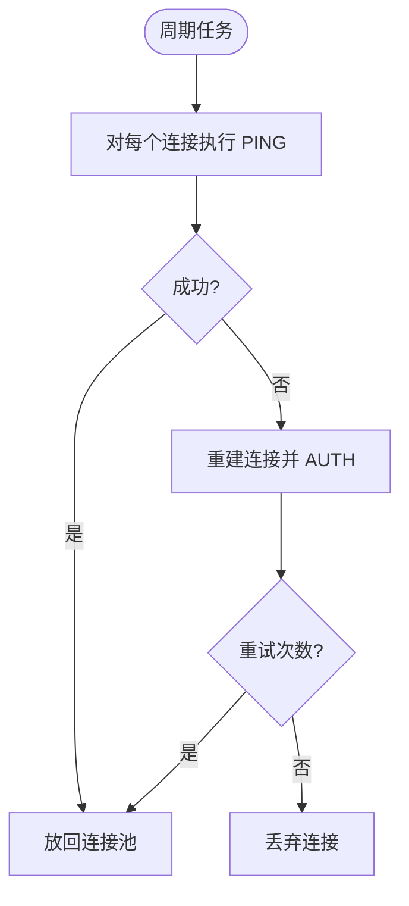
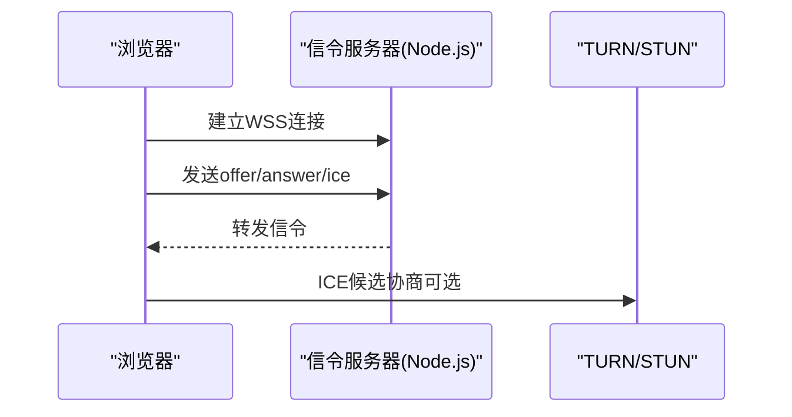
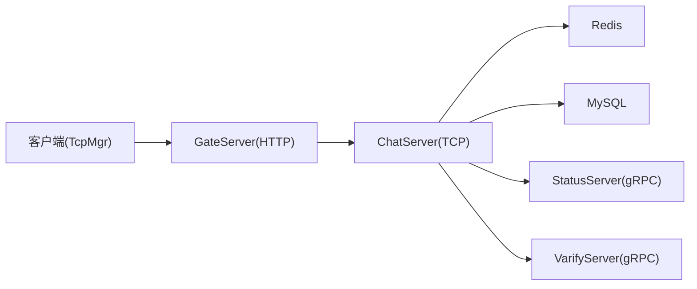

# 网络安全防护

<cite>
**本文引用的文件**   
- [tcpmgr.h](file://client/llfcchat/include/tcpmgr.h)
- [tcpmgr.cpp](file://client/llfcchat/src/tcpmgr.cpp)
- [config.ini（客户端）](file://client/llfcchat/config/config.ini)
- [CServer.h（ChatServer）](file://server/ChatServer/include/CServer.h)
- [CServer.h（GateServer）](file://server/GateServer/include/CServer.h)
- [HttpConnection.h](file://server/GateServer/include/HttpConnection.h)
- [chatserver1.ini（ChatServer）](file://server/ChatServer/config/chatserver1.ini)
- [config.ini（GateServer）](file://server/GateServer/config/config.ini)
- [RedisMgr.h（ChatServer）](file://server/ChatServer/include/RedisMgr.h)
- [MysqlDao.h（ChatServer）](file://server/ChatServer/include/MysqlDao.h)
- [day35心跳逻辑.md](file://开发文档/day35心跳逻辑.md)
- [day42-用户加载聊天资源.md](file://开发文档/day42-用户加载聊天资源.md)
- [day08-邮箱认证服务.md](file://开发文档/day08-邮箱认证服务.md)
- [index.html（WebRTC示例）](file://webrtc-demo/web/index.html)
</cite>

## 目录
1. [简介](#简介)
2. [项目结构](#项目结构)
3. [核心组件](#核心组件)
4. [架构总览](#架构总览)
5. [详细组件分析](#详细组件分析)
6. [依赖关系分析](#依赖关系分析)
7. [性能与安全考量](#性能与安全考量)
8. [故障排查指南](#故障排查指南)
9. [结论](#结论)
10. [附录：配置与示例](#附录配置与示例)

## 简介
本文件面向LLFCChat项目的网络安全防护，聚焦以下方面：
- HTTPS/TLS通信配置与证书管理、协议与传输层安全设置
- 防火墙规则与边界防护（端口管理、IP白名单、DDoS防护）
- 网络流量监控（异常连接检测、流量分析、安全事件告警）
- 客户端网络安全（超时处理、重连机制、异常恢复）
- 完整的安全配置示例与故障排查指南

说明：当前代码库中未直接实现TLS/HTTPS或WSS的加密通道；本文在“现状”基础上给出可落地的增强方案与最佳实践，并结合现有TCP/HTTP/GRPC/Redis/MySQL等组件的连接健康检查与心跳机制，形成端到端的安全加固路径。

## 项目结构
- 客户端（Qt C++）通过TcpMgr建立与服务端的TCP长连接，负责消息编解码、错误处理与信号派发。
- GateServer提供HTTP接入（Beast），并作为网关转发到后端服务。
- ChatServer基于Boost.Asio实现TCP会话管理与心跳检测。
- ResourceServer、StatusServer、VarifyServer分别承担资源、状态与校验功能。
- 外部依赖包括MySQL、Redis、gRPC等。

**图示来源** 
- [CServer.h（ChatServer）:1-33](file://server/ChatServer/include/CServer.h#L1-L33)
- [CServer.h（GateServer）:1-16](file://server/GateServer/include/CServer.h#L1-L16)
- [HttpConnection.h:1-36](file://server/GateServer/include/HttpConnection.h#L1-L36)
- [chatserver1.ini（ChatServer）:1-30](file://server/ChatServer/config/chatserver1.ini#L1-L30)
- [config.ini（GateServer）:1-25](file://server/GateServer/config/config.ini#L1-L25)

**章节来源**
- [tcpmgr.h:1-90](file://client/llfcchat/include/tcpmgr.h#L1-L90)
- [tcpmgr.cpp:1-137](file://client/llfcchat/src/tcpmgr.cpp#L1-L137)
- [config.ini（客户端）:1-4](file://client/llfcchat/config/config.ini#L1-L4)

## 核心组件
- TcpMgr（客户端）：封装QTcpSocket，处理连接、收发、粘包/半包解析、错误与断开回调。
- CServer（ChatServer/GateServer）：基于Asio/Beast的监听与请求处理入口。
- HttpConnection（GateServer）：HTTP请求解析、超时控制与响应写入。
- RedisMgr/MysqlDao：连接池与健康检查、自动重连。
- 心跳与离线清理：服务器侧定时器扫描会话，结合分布式锁清理失效会话。

**章节来源**
- [tcpmgr.cpp:1-137](file://client/llfcchat/src/tcpmgr.cpp#L1-L137)
- [CServer.h（ChatServer）:1-33](file://server/ChatServer/include/CServer.h#L1-L33)
- [CServer.h（GateServer）:1-16](file://server/GateServer/include/CServer.h#L1-L16)
- [HttpConnection.h:1-36](file://server/GateServer/include/HttpConnection.h#L1-L36)
- [RedisMgr.h（ChatServer）:198-246](file://server/ChatServer/include/RedisMgr.h#L198-L246)
- [MysqlDao.h（ChatServer）:102-160](file://server/ChatServer/include/MysqlDao.h#L102-L160)
- [day35心跳逻辑.md:28-93](file://开发文档/day35心跳逻辑.md#L28-L93)

## 架构总览
下图展示从客户端到各服务的交互路径，以及关键安全点（如超时、心跳、鉴权、缓存与数据库）。

**图示来源** 
- [HttpConnection.h:1-36](file://server/GateServer/include/HttpConnection.h#L1-L36)
- [CServer.h（ChatServer）:1-33](file://server/ChatServer/include/CServer.h#L1-L33)
- [RedisMgr.h（ChatServer）:198-246](file://server/ChatServer/include/RedisMgr.h#L198-L246)
- [MysqlDao.h（ChatServer）:102-160](file://server/ChatServer/include/MysqlDao.h#L102-L160)

## 详细组件分析

### 客户端网络健壮性（TcpMgr）
- 连接生命周期：connected/disconnected/error等信号处理，区分拒绝、远程关闭、主机不可达、超时、网络错误等。
- 粘包/半包处理：按“消息ID+长度”头部解析，循环读取直到满足消息体长度。
- 发送队列：bytesWritten回调驱动分片发送，避免阻塞。
- 错误处理：对常见SocketError分类处理，向上层发出统一信号。

**图示来源** 
- [tcpmgr.cpp:18-55](file://client/llfcchat/src/tcpmgr.cpp#L18-L55)

**章节来源**
- [tcpmgr.cpp:1-137](file://client/llfcchat/src/tcpmgr.cpp#L1-L137)
- [day42-用户加载聊天资源.md:334-466](file://开发文档/day42-用户加载聊天资源.md#L334-L466)

### 服务器心跳与会话管理（ChatServer）
- 定时器周期扫描会话，依据最后活动时间戳判断是否过期。
- 过期会话关闭并清理Redis中的会话与IP映射信息，注意分布式锁保护。
- 心跳间隔建议与中间设备（NAT/负载均衡/防火墙）空闲回收阈值协调。

**图示来源** 
- [day35心跳逻辑.md:28-93](file://开发文档/day35心跳逻辑.md#L28-L93)

**章节来源**
- [CServer.h（ChatServer）:1-33](file://server/ChatServer/include/CServer.h#L1-L33)
- [day35心跳逻辑.md:28-93](file://开发文档/day35心跳逻辑.md#L28-L93)

### HTTP连接与超时控制（GateServer）
- HttpConnection维护请求缓冲、请求/响应对象与deadline定时器。
- 通过CheckDeadline确保请求处理不超时，WriteResponse统一输出。

**图示来源** 
- [HttpConnection.h:1-36](file://server/GateServer/include/HttpConnection.h#L1-L36)

**章节来源**
- [HttpConnection.h:1-36](file://server/GateServer/include/HttpConnection.h#L1-L36)

### 外部依赖连接健康检查（Redis/MySQL）
- Redis连接池周期性PING保活，失败则重建连接并AUTH。
- MySQL连接池定期检测健康度，失败时尝试reconnect。

**图示来源** 
- [RedisMgr.h（ChatServer）:198-246](file://server/ChatServer/include/RedisMgr.h#L198-L246)
- [MysqlDao.h（ChatServer）:102-160](file://server/ChatServer/include/MysqlDao.h#L102-L160)

**章节来源**
- [RedisMgr.h（ChatServer）:198-246](file://server/ChatServer/include/RedisMgr.h#L198-L246)
- [MysqlDao.h（ChatServer）:102-160](file://server/ChatServer/include/MysqlDao.h#L102-L160)

### WebRTC信令与TLS建议（示例参考）
- WebRTC示例展示了WebSocket信令交换与TURN配置提示，生产环境建议使用HTTPS/WSS与动态签名的TURN。

**图示来源** 
- [index.html（WebRTC示例）:67-106](file://webrtc-demo/web/index.html#L67-L106)
- [day44-webrtc信令服务器实现.md:434-466](file://开发文档/day44-webrtc信令服务器实现.md#L434-L466)

**章节来源**
- [index.html（WebRTC示例）:67-106](file://webrtc-demo/web/index.html#L67-L106)
- [day44-webrtc信令服务器实现.md:434-466](file://开发文档/day44-webrtc信令服务器实现.md#L434-L466)

## 依赖关系分析
- 客户端依赖TcpMgr进行TCP通信，依赖配置文件指定GateServer地址与端口。
- GateServer依赖Beast处理HTTP，内部可能转发至ChatServer。
- ChatServer依赖Asio进行TCP会话管理，依赖Redis/MySQL进行状态与数据持久化。
- VarifyServer为Node.js服务，用于验证码与邮件等功能。

**图示来源** 
- [config.ini（客户端）:1-4](file://client/llfcchat/config/config.ini#L1-L4)
- [config.ini（GateServer）:1-25](file://server/GateServer/config/config.ini#L1-L25)
- [chatserver1.ini（ChatServer）:1-30](file://server/ChatServer/config/chatserver1.ini#L1-L30)

**章节来源**
- [config.ini（客户端）:1-4](file://client/llfcchat/config/config.ini#L1-L4)
- [config.ini（GateServer）:1-25](file://server/GateServer/config/config.ini#L1-L25)
- [chatserver1.ini（ChatServer）:1-30](file://server/ChatServer/config/chatserver1.ini#L1-L30)

## 性能与安全考量
- 连接复用与池化：Redis/MySQL连接池减少握手开销，提升吞吐。
- 心跳与超时：合理设置心跳间隔与连接超时，避免中间设备回收导致中断。
- 错误隔离：客户端对各类SocketError分类处理，避免级联失败。
- 鉴权与令牌：登录成功后下发token，后续请求携带token进行鉴权（建议在HTTP与gRPC层统一校验）。
- 最小权限原则：仅开放必要端口，限制访问源IP。
- 日志与审计：记录关键安全事件（登录失败、异常断开、鉴权失败），便于追踪与告警。

[本节为通用指导，不直接分析具体文件]

## 故障排查指南
- 客户端连接失败
  - 现象：连接被拒绝、主机不可达、超时。
  - 排查：检查客户端配置host/port是否正确；服务端监听端口是否开放；防火墙策略是否放行。
  - 相关实现：客户端error分支处理与sig_con_success信号。
  
  **章节来源**
  - [tcpmgr.cpp:64-91](file://client/llfcchat/src/tcpmgr.cpp#L64-L91)

- 心跳超时与掉线
  - 现象：长时间无数据导致连接被回收。
  - 排查：确认客户端是否按时发送心跳；服务器定时器阈值是否合理；中间设备空闲回收时间。
  
  **章节来源**
  - [day35心跳逻辑.md:28-93](file://开发文档/day35心跳逻辑.md#L28-L93)

- Redis/MySQL连接异常
  - 现象：连接池PING失败或AUTH失败。
  - 排查：核对密码与端口；检查服务可用性；观察重连逻辑是否生效。
  
  **章节来源**
  - [RedisMgr.h（ChatServer）:198-246](file://server/ChatServer/include/RedisMgr.h#L198-L246)
  - [MysqlDao.h（ChatServer）:102-160](file://server/ChatServer/include/MysqlDao.h#L102-L160)

- HTTP请求超时
  - 现象：请求长时间无响应。
  - 排查：检查HttpConnection的deadline设置；后端处理耗时；上游依赖（Redis/MySQL）延迟。
  
  **章节来源**
  - [HttpConnection.h:1-36](file://server/GateServer/include/HttpConnection.h#L1-L36)

## 结论
当前LLFCChat在网络层以TCP/HTTP为主，尚未启用TLS/HTTPS与WSS。通过引入证书管理、协议升级、边界防护、流量监控与客户端健壮性增强，可在不破坏现有架构的前提下显著提升安全性与稳定性。建议优先落地HTTPS/WSS、端口与IP白名单、心跳与超时优化、连接池健康检查与统一鉴权流程。

[本节为总结性内容，不直接分析具体文件]

## 附录：配置与示例

### HTTPS/TLS通信配置（建议）
- 证书管理
  - 使用权威CA签发证书，私钥与证书分离存储，定期轮换。
  - 服务端配置TLS上下文，启用强加密套件与协议版本（禁用SSLv3/TLS1.0/1.1）。
- 网关与反向代理
  - 在Nginx/Envoy等反向代理上终止TLS，将内网通信保持明文或mTLS。
- WebRTC信令
  - 强制使用WSS；TURN使用动态签名（use-auth-secret）防止带宽滥用。

[本节为通用建议，不直接分析具体文件]

### 防火墙规则与边界防护（建议）
- 端口管理
  - 仅开放必要端口（如HTTP/HTTPS、SSH、数据库与缓存的内网端口）。
- IP白名单
  - 对管理面与敏感接口实施来源IP白名单。
- DDoS防护
  - 启用速率限制、连接数限制、黑名单与清洗服务。

[本节为通用建议，不直接分析具体文件]

### 网络流量监控（建议）
- 异常连接检测
  - 统计连接建立/断开频率、错误码分布，识别异常峰值。
- 流量分析
  - 采集QPS、延迟、丢包率、重传率，绘制趋势图。
- 安全事件告警
  - 登录失败、鉴权失败、连接异常、资源耗尽等事件触发告警。

[本节为通用建议，不直接分析具体文件]

### 客户端网络安全（建议）
- 连接超时与重连
  - 设置合理的连接超时与读写超时；指数退避重连，限制最大重试次数。
- 网络异常恢复
  - 捕获网络错误，清理状态后重新初始化；必要时切换备用服务器。
- 数据完整性
  - 对关键请求添加签名与时间戳，防重放攻击。

[本节为通用建议，不直接分析具体文件]

### 现有配置参考
- 客户端配置（GateServer地址与端口）
  
  **章节来源**
  - [config.ini（客户端）:1-4](file://client/llfcchat/config/config.ini#L1-L4)

- GateServer配置（端口、依赖服务）
  
  **章节来源**
  - [config.ini（GateServer）:1-25](file://server/GateServer/config/config.ini#L1-L25)

- ChatServer配置（自服务、依赖服务）
  
  **章节来源**
  - [chatserver1.ini（ChatServer）:1-30](file://server/ChatServer/config/chatserver1.ini#L1-L30)

- 邮箱认证服务（Node.js）配置示例
  
  **章节来源**
  - [day08-邮箱认证服务.md:91-134](file://开发文档/day08-邮箱认证服务.md#L91-L134)