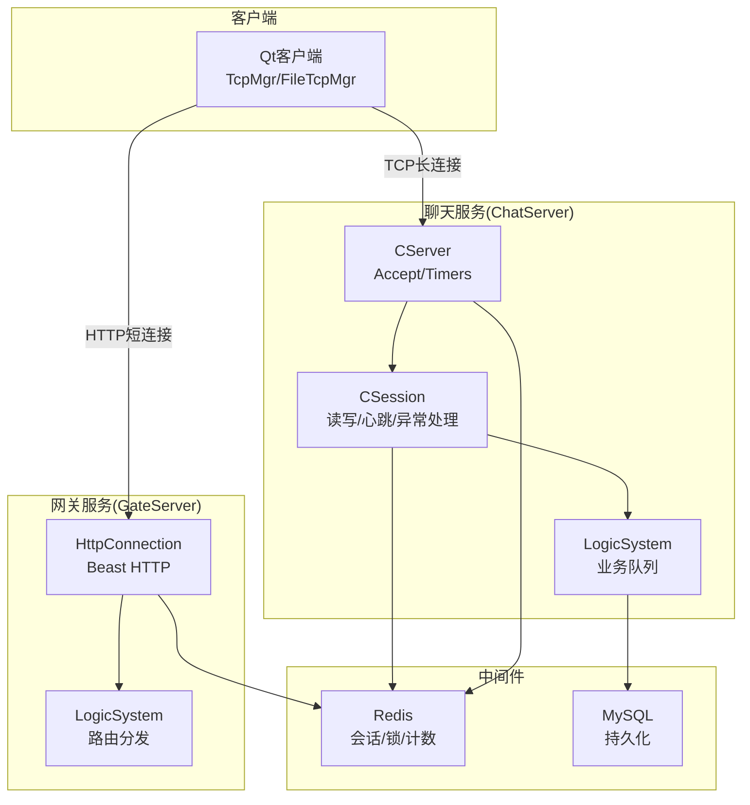
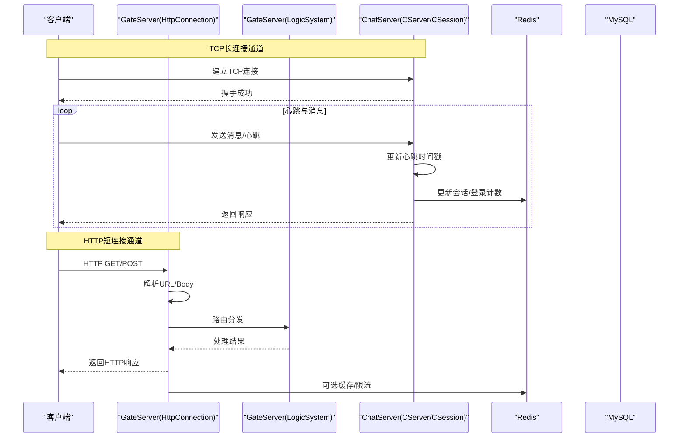
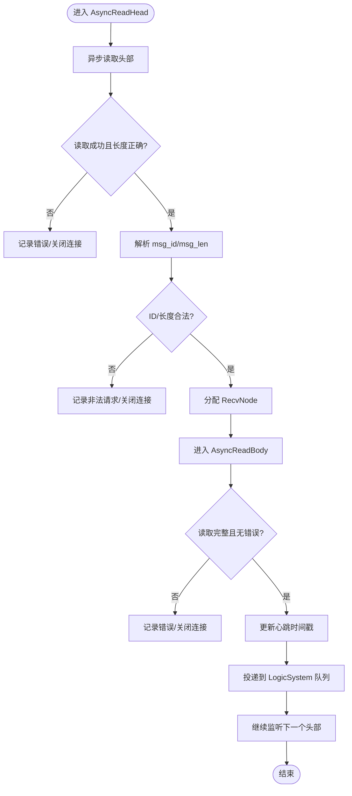
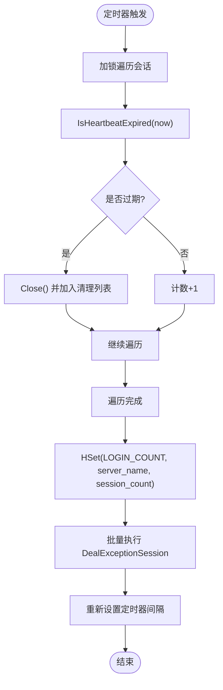
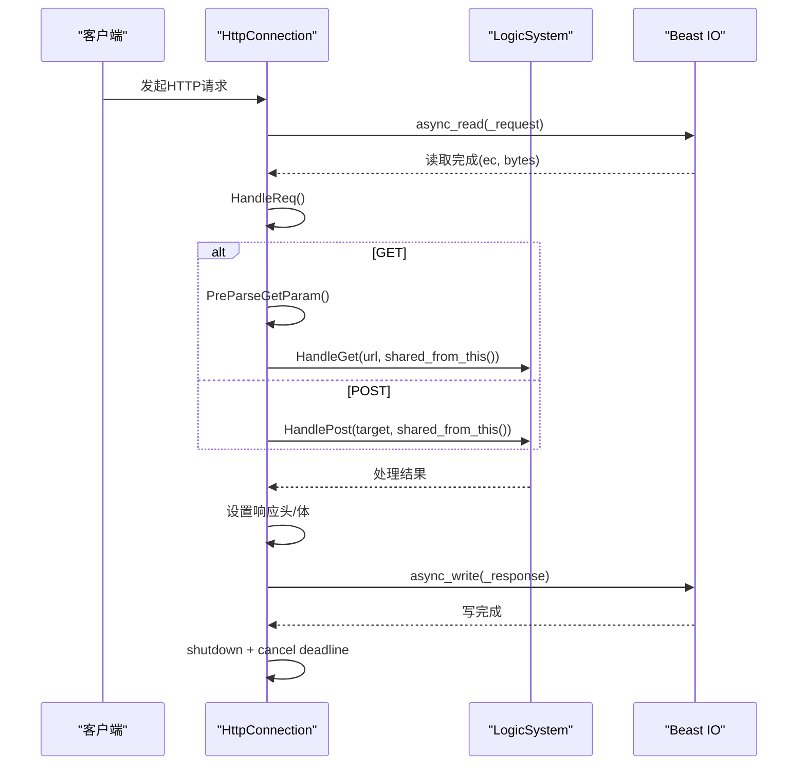
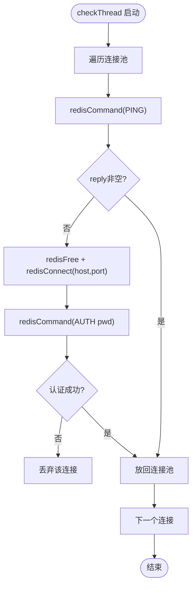
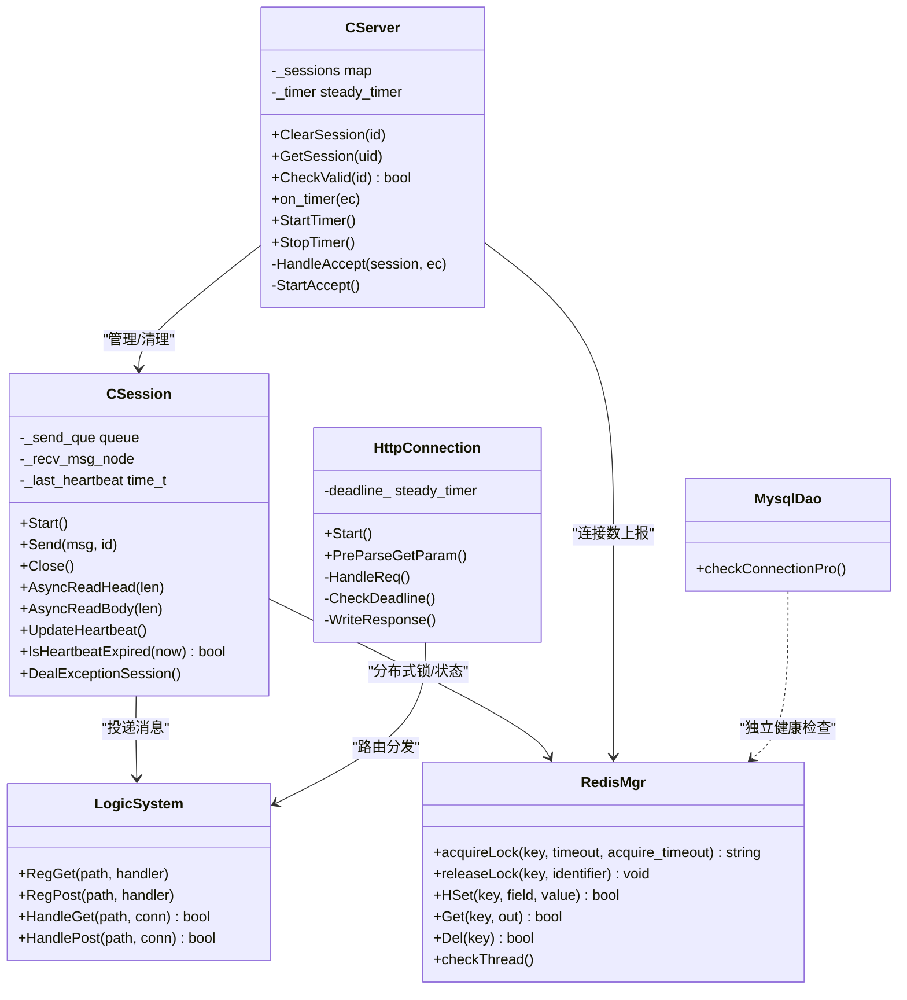

# 网络流量监控

<cite>
**本文引用的文件**   
- [CSession.h](file://server/ChatServer/include/CSession.h)
- [CSession.cpp](file://server/ChatServer/src/CSession.cpp)
- [CServer.h](file://server/ChatServer/include/CServer.h)
- [HttpConnection.h](file://server/GateServer/include/HttpConnection.h)
- [HttpConnection.cpp](file://server/GateServer/src/HttpConnection.cpp)
- [LogicSystem.h](file://server/GateServer/include/LogicSystem.h)
- [RedisMgr.h](file://server/StatusServer/include/RedisMgr.h)
- [MysqlDao.h](file://server/ChatServer/include/MysqlDao.h)
- [day35心跳逻辑.md](file://开发文档/day35心跳逻辑.md)
- [day33单服程踢人逻辑.md](file://开发文档/day33单服程踢人逻辑.md)
- [day04-beast搭建http服务器.md](file://开发文档/day04-beast搭建http服务器.md)
</cite>

## 目录
1. [简介](#简介)
2. [项目结构](#项目结构)
3. [核心组件](#核心组件)
4. [架构总览](#架构总览)
5. [详细组件分析](#详细组件分析)
6. [依赖关系分析](#依赖关系分析)
7. [性能与容量规划](#性能与容量规划)
8. [故障排查指南](#故障排查指南)
9. [结论](#结论)
10. [附录：监控配置与告警策略建议](#附录监控配置与告警策略建议)

## 简介
本文件面向LLFCChat项目的运维与安全团队，聚焦于网络流量监控能力的设计与实践。内容覆盖异常连接检测（非法连接识别、连接状态监控、资源占用分析）、流量分析（请求统计、响应时间、带宽使用）、安全事件告警（异常行为、攻击尝试、阈值配置），以及日志记录与分析（访问日志、错误日志、性能日志）。文档基于现有代码实现进行梳理，并给出可操作的监控与排障建议。

## 项目结构
本项目包含多个服务进程：聊天服务（ChatServer）、网关服务（GateServer）、资源服务（ResourceServer）、状态服务（StatusServer）等。网络流量监控主要围绕以下两个入口展开：
- ChatServer的TCP长连接会话（CSession）：负责消息收发、心跳、异常清理、连接计数上报。
- GateServer的HTTP短连接（HttpConnection）：负责HTTP请求解析、路由分发、超时控制。

图表来源 
- [CServer.h:1-33](file://server/ChatServer/include/CServer.h#L1-L33)
- [CSession.h:1-86](file://server/ChatServer/include/CSession.h#L1-L86)
- [HttpConnection.h:1-36](file://server/GateServer/include/HttpConnection.h#L1-L36)
- [LogicSystem.h:1-24](file://server/GateServer/include/LogicSystem.h#L1-L24)

章节来源
- [CServer.h:1-33](file://server/ChatServer/include/CServer.h#L1-L33)
- [CSession.h:1-86](file://server/ChatServer/include/CSession.h#L1-L86)
- [HttpConnection.h:1-36](file://server/GateServer/include/HttpConnection.h#L1-L36)
- [LogicSystem.h:1-24](file://server/GateServer/include/LogicSystem.h#L1-L24)

## 核心组件
- CSession：封装单个TCP会话的生命周期，包括异步读头/体、写队列、心跳更新、异常清理、离线通知等。
- CServer：管理会话集合、接受新连接、定时任务（心跳检测、连接数统计上报）。
- HttpConnection：Beast实现的HTTP连接，负责请求读取、参数解析、路由调用、响应写入与超时控制。
- LogicSystem（GateServer）：HTTP路由注册与分发。
- RedisMgr：Redis连接池与健康检查、分布式锁、键值存取。
- MysqlDao：MySQL连接池健康检查与重连。

章节来源
- [CSession.cpp:1-338](file://server/ChatServer/src/CSession.cpp#L1-L338)
- [CServer.h:1-33](file://server/ChatServer/include/CServer.h#L1-L33)
- [HttpConnection.cpp:1-225](file://server/GateServer/src/HttpConnection.cpp#L1-L225)
- [LogicSystem.h:1-24](file://server/GateServer/include/LogicSystem.h#L1-L24)
- [RedisMgr.h:203-246](file://server/StatusServer/include/RedisMgr.h#L203-L246)
- [MysqlDao.h:42-100](file://server/ChatServer/include/MysqlDao.h#L42-L100)

## 架构总览
下图展示了从客户端到各服务的请求路径、关键监控点与数据流向。

图表来源 
- [HttpConnection.cpp:1-225](file://server/GateServer/src/HttpConnection.cpp#L1-L225)
- [CSession.cpp:1-338](file://server/ChatServer/src/CSession.cpp#L1-L338)
- [CServer.h:1-33](file://server/ChatServer/include/CServer.h#L1-L33)

## 详细组件分析

### CSession：TCP会话与异常连接检测
- 功能要点
  - 异步读头部与消息体，校验长度与ID合法性，防止非法包注入。
  - 维护发送队列与异步写，避免阻塞IO线程。
  - 心跳时间戳更新与过期检测，用于连接存活判定。
  - 异常路径统一走DealExceptionSession，结合分布式锁清理会话与用户信息。
- 监控指标来源
  - 连接状态：会话创建/关闭、心跳过期、读写错误码。
  - 资源占用：发送队列长度、内存缓冲大小、CPU耗时（可通过外部埋点扩展）。
  - 安全事件：非法msg_id/msg_len、长度不匹配、频繁错误导致的Close。
- 关键流程
  - 读头：AsyncReadHead -> 校验 -> 分配RecvNode -> 读体
  - 读体：AsyncReadBody -> 校验长度 -> 投递逻辑队列 -> 继续读头
  - 写：Send -> 入队 -> HandleWrite出队并异步写
  - 异常：错误回调 -> Close -> DealExceptionSession -> 清理Redis

图表来源 
- [CSession.cpp:133-194](file://server/ChatServer/src/CSession.cpp#L133-L194)
- [CSession.cpp:90-131](file://server/ChatServer/src/CSession.cpp#L90-L131)

章节来源
- [CSession.cpp:90-131](file://server/ChatServer/src/CSession.cpp#L90-L131)
- [CSession.cpp:133-194](file://server/ChatServer/src/CSession.cpp#L133-L194)
- [CSession.cpp:196-220](file://server/ChatServer/src/CSession.cpp#L196-L220)
- [CSession.cpp:288-336](file://server/ChatServer/src/CSession.cpp#L288-L336)

### CServer：连接管理与心跳定时器
- 功能要点
  - 维护会话映射表，提供获取/有效性检查接口。
  - 定时器周期性扫描会话，检测心跳过期，关闭无效连接并上报连接数至Redis。
- 监控指标来源
  - 活跃会话数、过期会话数、清理次数、上报延迟。
- 关键流程
  - on_timer：遍历会话 -> 判断心跳过期 -> 收集待清理列表 -> 批量清理 -> 统计session_count -> HSet到Redis

图表来源 
- [CServer.h:1-33](file://server/ChatServer/include/CServer.h#L1-L33)
- [day35心跳逻辑.md:41-93](file://开发文档/day35心跳逻辑.md#L41-L93)
- [day35心跳逻辑.md:644-688](file://开发文档/day35心跳逻辑.md#L644-L688)

章节来源
- [CServer.h:1-33](file://server/ChatServer/include/CServer.h#L1-L33)
- [day35心跳逻辑.md:41-93](file://开发文档/day35心跳逻辑.md#L41-L93)
- [day35心跳逻辑.md:644-688](file://开发文档/day35心跳逻辑.md#L644-L688)

### HttpConnection：HTTP请求处理与超时控制
- 功能要点
  - 使用Beast异步读取请求，解析GET参数，路由到LogicSystem处理。
  - 设置短连接与CORS头，统一响应格式。
  - 通过steady_timer实现连接处理超时，超时则关闭socket。
- 监控指标来源
  - 请求方法/路径、状态码、处理耗时、超时次数、错误码。
- 关键流程
  - Start：async_read -> HandleReq -> CheckDeadline
  - HandleReq：区分GET/POST -> 路由处理 -> 设置响应 -> WriteResponse
  - CheckDeadline：定时关闭未完成的连接

图表来源 
- [HttpConnection.cpp:1-225](file://server/GateServer/src/HttpConnection.cpp#L1-L225)
- [day04-beast搭建http服务器.md:427-480](file://开发文档/day04-beast搭建http服务器.md#L427-L480)

章节来源
- [HttpConnection.cpp:1-225](file://server/GateServer/src/HttpConnection.cpp#L1-L225)
- [day04-beast搭建http服务器.md:427-480](file://开发文档/day04-beast搭建http服务器.md#L427-L480)

### RedisMgr：连接池健康检查与分布式锁
- 功能要点
  - 定期PING探测连接健康，失败时重建连接并重新认证。
  - 提供分布式锁acquireLock/releaseLock，保证跨进程清理一致性。
- 监控指标来源
  - 连接池大小、PING成功率、重连次数、认证失败次数。
- 关键流程
  - checkThread：遍历连接 -> PING -> 失败则重建并AUTH -> 回收或替换

图表来源 
- [RedisMgr.h:203-246](file://server/StatusServer/include/RedisMgr.h#L203-L246)

章节来源
- [RedisMgr.h:203-246](file://server/StatusServer/include/RedisMgr.h#L203-L246)

### MysqlDao：数据库连接池健康检查
- 功能要点
  - 后台线程定期检查连接可用性，执行SELECT 1验证，失败则标记并计数。
- 监控指标来源
  - 连接池大小、健康检查失败次数、重连次数。
- 关键流程
  - checkConnectionPro：取连接 -> 若长时间未操作则执行SELECT 1 -> 更新last_oper_time或标记失败

章节来源
- [MysqlDao.h:42-100](file://server/ChatServer/include/MysqlDao.h#L42-L100)

## 依赖关系分析
- CSession依赖CServer进行会话有效性检查与清理；依赖LogicSystem投递消息；依赖RedisMgr进行分布式锁与会话状态管理。
- CServer依赖RedisMgr上报连接数；依赖CSession的心跳状态。
- HttpConnection依赖LogicSystem进行路由分发；依赖Beast进行IO；依赖Redis可能用于限流/缓存。
- RedisMgr与MysqlDao各自维护连接池健康，保障后端稳定性。

图表来源 
- [CServer.h:1-33](file://server/ChatServer/include/CServer.h#L1-L33)
- [CSession.h:1-86](file://server/ChatServer/include/CSession.h#L1-L86)
- [HttpConnection.h:1-36](file://server/GateServer/include/HttpConnection.h#L1-L36)
- [LogicSystem.h:1-24](file://server/GateServer/include/LogicSystem.h#L1-L24)
- [RedisMgr.h:203-246](file://server/StatusServer/include/RedisMgr.h#L203-L246)
- [MysqlDao.h:42-100](file://server/ChatServer/include/MysqlDao.h#L42-L100)

章节来源
- [CServer.h:1-33](file://server/ChatServer/include/CServer.h#L1-L33)
- [CSession.h:1-86](file://server/ChatServer/include/CSession.h#L1-L86)
- [HttpConnection.h:1-36](file://server/GateServer/include/HttpConnection.h#L1-L36)
- [LogicSystem.h:1-24](file://server/GateServer/include/LogicSystem.h#L1-L24)
- [RedisMgr.h:203-246](file://server/StatusServer/include/RedisMgr.h#L203-L246)
- [MysqlDao.h:42-100](file://server/ChatServer/include/MysqlDao.h#L42-L100)

## 性能与容量规划
- 连接与吞吐
  - 通过CSession发送队列限制与异步IO降低阻塞风险；建议监控队列长度与写失败率。
  - CServer定时器周期（如60s）平衡心跳检测开销与失效连接清理及时性。
- I/O与内存
  - 合理设置缓冲区大小与最大消息长度，避免过大包导致内存压力。
  - 关注Redis连接池健康与重连频率，避免频繁重建影响延迟。
- 存储与后端
  - MySQL连接池健康检查确保DB可用性；失败时应快速降级或告警。
- 可扩展性
  - 多实例部署下，连接数统计通过Redis聚合；需关注Redis热点键与锁竞争。

[本节为通用指导，不直接分析具体文件]

## 故障排查指南
- 常见异常连接
  - 读失败/写失败：检查网络连通性与对端状态；查看CSession错误回调与Close路径。
  - 长度不匹配：确认协议头定义与编码一致；检查粘包/半包处理。
  - 心跳过期：检查客户端心跳发送频率与服务端阈值；观察CServer定时器与清理逻辑。
- 安全事件
  - 非法msg_id/msg_len：立即关闭连接并记录；必要时封禁IP。
  - 异地登录：根据Redis中session_id比对，清理旧会话。
- 中间件问题
  - Redis不可用：检查checkThread日志、AUTH失败、连接池耗尽。
  - MySQL不可用：检查checkConnectionPro失败计数与重连。
- 定位步骤
  - 查看服务日志中的错误码与堆栈；核对CSession/CServer/HttpConnection的关键路径。
  - 检查Redis键值（会话、锁、计数）与MySQL连接池状态。
  - 复现问题并抓包验证协议与长度字段。

章节来源
- [CSession.cpp:90-131](file://server/ChatServer/src/CSession.cpp#L90-L131)
- [CSession.cpp:133-194](file://server/ChatServer/src/CSession.cpp#L133-L194)
- [CSession.cpp:196-220](file://server/ChatServer/src/CSession.cpp#L196-L220)
- [CSession.cpp:288-336](file://server/ChatServer/src/CSession.cpp#L288-L336)
- [RedisMgr.h:203-246](file://server/StatusServer/include/RedisMgr.h#L203-L246)
- [MysqlDao.h:42-100](file://server/ChatServer/include/MysqlDao.h#L42-L100)

## 结论
LLFCChat在网络层已具备较完善的连接生命周期管理与异常处理能力，结合Redis分布式锁与连接池健康检查，能够支撑高并发与多实例部署。通过引入统一的监控指标采集（连接状态、请求统计、响应时间、带宽使用）与告警策略（异常行为、攻击尝试、阈值越界），可显著提升运维效率与系统安全性。建议在现有基础上完善日志结构化输出与指标上报，形成闭环监控体系。

[本节为总结性内容，不直接分析具体文件]

## 附录：监控配置与告警策略建议
- 连接状态监控
  - 指标：活跃会话数、心跳过期数、读写错误次数、连接建立/断开速率。
  - 采集点：CSession心跳更新、CServer定时器统计、HttpConnection请求计数。
- 流量分析
  - 指标：HTTP请求量（按方法/路径）、响应状态码分布、平均/分位响应时间、带宽（字节/秒）。
  - 采集点：HttpConnection处理前后时间戳、CSession发送/接收字节累计。
- 安全告警
  - 规则：非法msg_id/msg_len、连续错误超过阈值、短时间内大量不同IP连接、异地登录冲突。
  - 动作：记录审计日志、临时封禁、通知值班人员。
- 日志规范
  - 访问日志：请求方法、路径、状态码、耗时、客户端IP。
  - 错误日志：错误码、错误信息、堆栈、上下文（uid、session_id）。
  - 性能日志：关键路径耗时、队列长度、内存峰值、GC/锁等待。
- 阈值配置示例（建议）
  - 心跳超时：20-60秒（依据业务调整）
  - 请求超时：60秒（HttpConnection默认）
  - 发送队列上限：MAX_SENDQUE（避免内存暴涨）
  - 错误率阈值：例如5分钟内错误率>5%触发告警
  - 带宽阈值：单连接上行/下行超过设定值告警

[本节为通用建议，不直接分析具体文件]