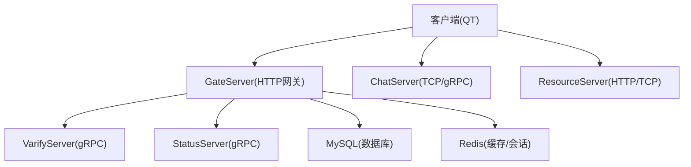
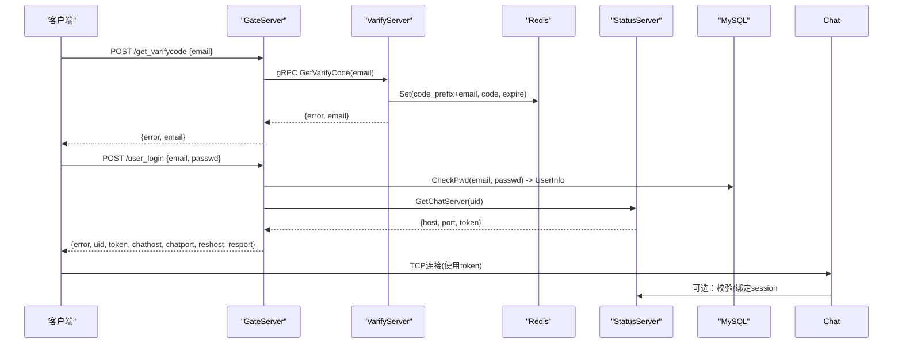
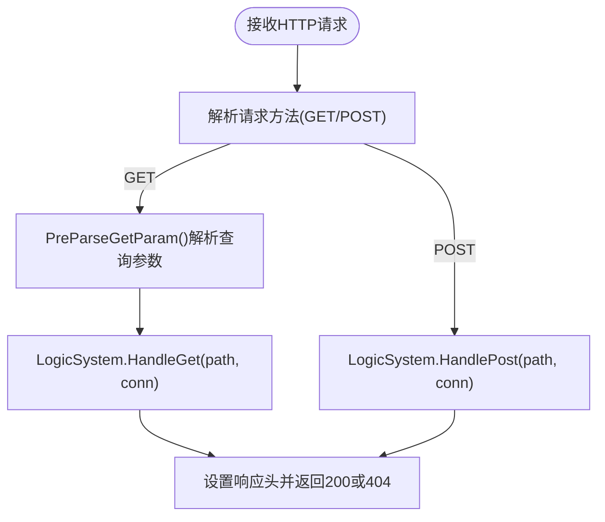
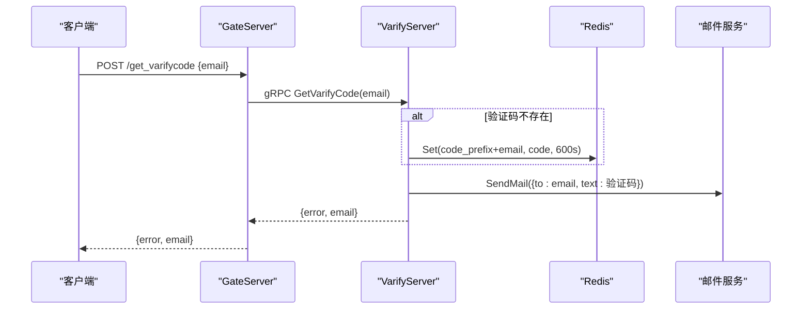
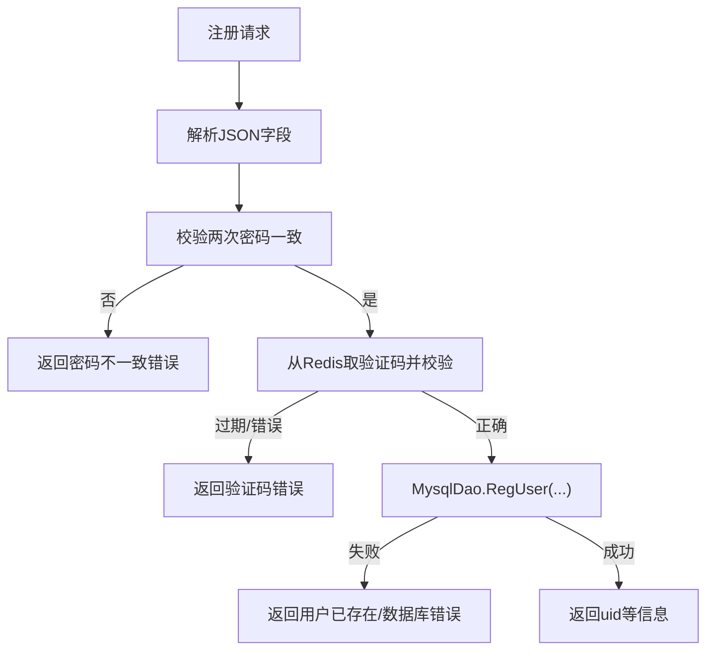
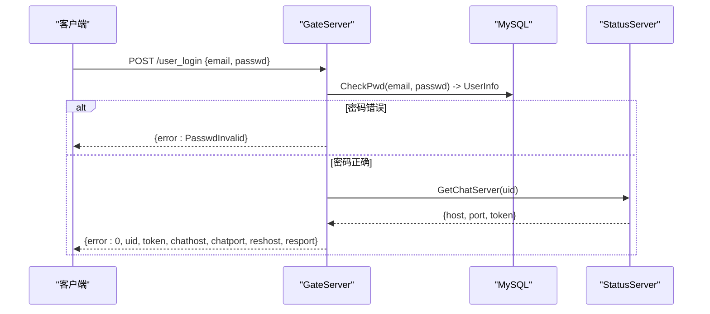
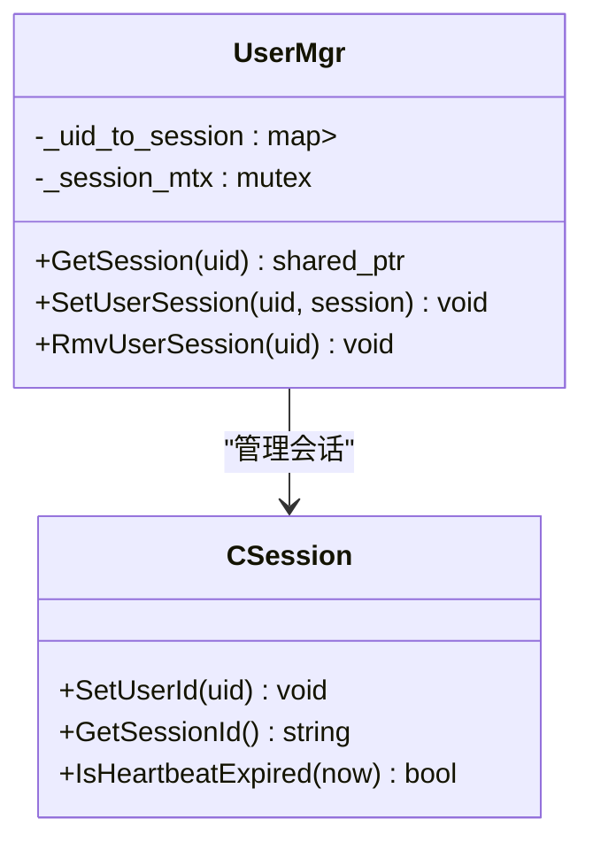
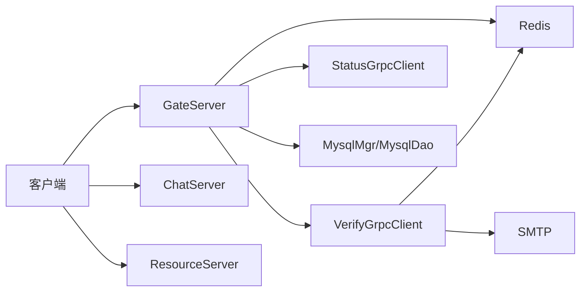

# 请求验证与认证

<cite>
**本文引用的文件**   
- [HttpConnection.cpp](file://server/GateServer/src/HttpConnection.cpp)
- [HttpConnection.h](file://server/GateServer/include/HttpConnection.h)
- [LogicSystem.cpp](file://server/GateServer/src/LogicSystem.cpp)
- [LogicSystem.h](file://server/GateServer/include/LogicSystem.h)
- [VerifyGrpcClient.cpp](file://server/GateServer/src/VerifyGrpcClient.cpp)
- [MysqlDao.h](file://server/GateServer/include/MysqlDao.h)
- [server.js](file://server/VarifyServer/server.js)
- [redis.js](file://server/VarifyServer/redis.js)
- [httpmgr.cpp](file://client/llfcchat/src/httpmgr.cpp)
- [logindialog.cpp](file://client/llfcchat/src/logindialog.cpp)
- [resetdialog.cpp](file://client/llfcchat/src/resetdialog.cpp)
- [registerdialog.cpp](file://client/llfcchat/src/registerdialog.cpp)
- [day27-分布式服务设计.md](file://开发文档/day27-分布式服务设计.md)
- [day35心跳逻辑.md](file://开发文档/day35心跳逻辑.md)
</cite>

## 目录
1. [简介](#简介)
2. [项目结构](#项目结构)
3. [核心组件](#核心组件)
4. [架构总览](#架构总览)
5. [详细组件分析](#详细组件分析)
6. [依赖关系分析](#依赖关系分析)
7. [性能考量](#性能考量)
8. [故障排查指南](#故障排查指南)
9. [结论](#结论)
10. [附录：安全配置模板与最佳实践](#附录安全配置模板与最佳实践)

## 简介
本文件面向LLFCChat的请求验证与认证系统，覆盖以下关键主题：
- HTTP请求签名验证（当前实现现状与建议）
- JWT令牌生成与验证流程（建议方案）
- 用户身份认证机制（密码加密存储、会话管理、多设备登录控制）
- API访问权限控制（角色授权与细粒度权限）
- 请求频率限制、IP白名单与黑名单
- 认证流程图、错误处理策略与安全配置模板

说明：仓库中GateServer作为HTTP网关负责路由分发与业务编排；验证码由独立的VarifyServer通过gRPC提供；Redis用于验证码缓存与会话/令牌管理；MySQL用于用户数据持久化。客户端通过Qt网络模块发起HTTP请求，并通过TCP连接聊天服务。

## 项目结构
- GateServer（C++）：HTTP入口网关，解析请求、路由到处理器，调用后端服务（验证码、状态分配等），并返回JSON响应。
- VarifyServer（Node.js）：gRPC服务，负责生成验证码、发送邮件、将验证码写入Redis。
- ChatServer/StatusServer/ResourceServer（C++）：聊天、状态、资源服务，通过gRPC协作。
- Client（Qt/C++）：HTTP管理器封装网络请求，注册/重置/登录等界面触发HTTP调用。



图表来源
- [LogicSystem.cpp:36-396](file://server/GateServer/src/LogicSystem.cpp#L36-L396)
- [HttpConnection.cpp:132-194](file://server/GateServer/src/HttpConnection.cpp#L132-L194)
- [server.js:15-64](file://server/VarifyServer/server.js#L15-L64)
- [redis.js:41-98](file://server/VarifyServer/redis.js#L41-L98)

章节来源
- [LogicSystem.cpp:36-396](file://server/GateServer/src/LogicSystem.cpp#L36-L396)
- [HttpConnection.cpp:132-194](file://server/GateServer/src/HttpConnection.cpp#L132-L194)

## 核心组件
- HTTP网关与路由
  - HttpConnection：基于Boost.Beast的HTTP连接处理，解析GET/POST请求，设置超时与响应头。
  - LogicSystem：单例路由表，注册GET/POST处理器，按URL分发到对应业务逻辑。
- 验证码服务
  - VarifyServer：gRPC接口GetVarifyCode，生成验证码、存入Redis、发送邮件。
  - Redis：验证码键值对及过期时间管理。
- 用户认证与登录
  - GateServer登录处理器：校验邮箱+密码，查询用户信息，调用StatusServer分配ChatServer并获取token，返回连接信息与资源服务器地址。
  - MysqlDao：用户注册、密码校验、密码更新等数据库操作。
- 客户端HTTP管理
  - HttpMgr：封装QNetworkRequest，统一发送POST JSON请求，回调结果给各模块。

章节来源
- [HttpConnection.h:1-36](file://server/GateServer/include/HttpConnection.h#L1-L36)
- [HttpConnection.cpp:1-225](file://server/GateServer/src/HttpConnection.cpp#L1-L225)
- [LogicSystem.h:1-24](file://server/GateServer/include/LogicSystem.h#L1-L24)
- [LogicSystem.cpp:105-396](file://server/GateServer/src/LogicSystem.cpp#L105-L396)
- [server.js:15-64](file://server/VarifyServer/server.js#L15-L64)
- [redis.js:41-98](file://server/VarifyServer/redis.js#L41-L98)
- [MysqlDao.h:222-235](file://server/GateServer/include/MysqlDao.h#L222-L235)
- [httpmgr.cpp:1-62](file://client/llfcchat/src/httpmgr.cpp#L1-L62)

## 架构总览
下图展示从客户端HTTP请求到验证码、登录鉴权、以及后续TCP聊天连接的端到端流程。



图表来源
- [LogicSystem.cpp:105-147](file://server/GateServer/src/LogicSystem.cpp#L105-L147)
- [LogicSystem.cpp:318-396](file://server/GateServer/src/LogicSystem.cpp#L318-L396)
- [server.js:15-64](file://server/VarifyServer/server.js#L15-L64)
- [redis.js:87-98](file://server/VarifyServer/redis.js#L87-L98)

## 详细组件分析

### HTTP请求处理与路由
- HttpConnection负责读取HTTP请求、设置CORS与超时、解析GET参数，并将请求交由LogicSystem处理。
- LogicSystem在构造时注册所有路由处理器，HandleGet/HandlePost根据路径查找并执行对应lambda。



图表来源
- [HttpConnection.cpp:96-130](file://server/GateServer/src/HttpConnection.cpp#L96-L130)
- [HttpConnection.cpp:132-194](file://server/GateServer/src/HttpConnection.cpp#L132-L194)
- [LogicSystem.cpp:438-467](file://server/GateServer/src/LogicSystem.cpp#L438-L467)

章节来源
- [HttpConnection.cpp:132-194](file://server/GateServer/src/HttpConnection.cpp#L132-L194)
- [LogicSystem.cpp:438-467](file://server/GateServer/src/LogicSystem.cpp#L438-L467)

### 验证码流程（VarifyServer + Redis）
- 客户端调用GateServer的/get_varifycode接口。
- GateServer通过VerifyGrpcClient调用VarifyServer的GetVarifyCode。
- VarifyServer生成验证码，写入Redis（带过期时间），并通过SMTP发送邮件。
- GateServer将结果返回给客户端。



图表来源
- [LogicSystem.cpp:105-147](file://server/GateServer/src/LogicSystem.cpp#L105-L147)
- [server.js:15-64](file://server/VarifyServer/server.js#L15-L64)
- [redis.js:87-98](file://server/VarifyServer/redis.js#L87-L98)

章节来源
- [LogicSystem.cpp:105-147](file://server/GateServer/src/LogicSystem.cpp#L105-L147)
- [server.js:15-64](file://server/VarifyServer/server.js#L15-L64)
- [redis.js:41-98](file://server/VarifyServer/redis.js#L41-L98)

### 用户注册与密码重置
- 注册：校验两次密码一致，校验Redis中的验证码是否有效且未过期，调用MysqlDao注册用户，返回用户信息。
- 重置密码：校验验证码有效性，校验用户名与邮箱匹配，更新数据库密码。



图表来源
- [LogicSystem.cpp:148-233](file://server/GateServer/src/LogicSystem.cpp#L148-L233)

章节来源
- [LogicSystem.cpp:148-233](file://server/GateServer/src/LogicSystem.cpp#L148-L233)
- [MysqlDao.h:222-235](file://server/GateServer/include/MysqlDao.h#L222-L235)

### 登录鉴权与Token发放
- 登录流程：GateServer校验邮箱+密码，查询用户信息；调用StatusServer分配ChatServer并获取token；返回ChatServer与ResourceServer的连接信息。
- 客户端收到响应后保存token，建立TCP连接到ChatServer进行后续通信。



图表来源
- [LogicSystem.cpp:318-396](file://server/GateServer/src/LogicSystem.cpp#L318-L396)

章节来源
- [LogicSystem.cpp:318-396](file://server/GateServer/src/LogicSystem.cpp#L318-L396)

### 会话管理与多设备登录控制
- 登录成功后，ChatServer侧将uid与session绑定，并在Redis记录用户所在服务器名与登录计数。
- 心跳检测：定时清理过期连接，必要时释放Redis中的会话与登录信息，支持踢人逻辑。
- UserMgr维护uid到session的映射，支持跨服务器的踢人与会话清理。



图表来源
- [day27-分布式服务设计.md:285-343](file://开发文档/day27-分布式服务设计.md#L285-L343)
- [day35心跳逻辑.md:41-92](file://开发文档/day35心跳逻辑.md#L41-L92)

章节来源
- [day27-分布式服务设计.md:285-343](file://开发文档/day27-分布式服务设计.md#L285-L343)
- [day35心跳逻辑.md:41-92](file://开发文档/day35心跳逻辑.md#L41-L92)

### 客户端HTTP请求封装
- HttpMgr封装QNetworkRequest，设置Content-Type为application/json，发送POST请求，完成后通过信号槽回调至具体模块（注册、重置、登录）。

```mermaid
flowchart TD
Call["调用PostHttpReq(url, json, req_id, mod)"] --> Build["构建QNetworkRequest与JSON体"]
Build --> Send["发送POST请求"]
Send --> OnFinish{"是否有网络错误?"}
OnFinish --> |是| EmitErr["emit sig_http_finish(req_id, \"\", ERR_NETWORK, mod)"]
OnFinish --> |否| Read["读取响应体"]
Read --> EmitOk["emit sig_http_finish(req_id, res, SUCCESS, mod)"]
```

图表来源
- [httpmgr.cpp:8-38](file://client/llfcchat/src/httpmgr.cpp#L8-L38)

章节来源
- [httpmgr.cpp:8-38](file://client/llfcchat/src/httpmgr.cpp#L8-L38)

## 依赖关系分析
- GateServer依赖：
  - VerifyGrpcClient：调用VarifyServer的验证码服务。
  - StatusGrpcClient：调用StatusServer分配ChatServer。
  - RedisMgr：验证码缓存与会话管理。
  - MysqlMgr/MysqlDao：用户数据持久化。
- VarifyServer依赖：
  - Redis：验证码存储与过期管理。
  - SMTP：发送邮件。
- 客户端依赖：
  - Qt网络模块：HTTP请求。
  - 本地UserMgr：保存用户信息与token。



图表来源
- [VerifyGrpcClient.cpp:1-9](file://server/GateServer/src/VerifyGrpcClient.cpp#L1-L9)
- [LogicSystem.cpp:36-396](file://server/GateServer/src/LogicSystem.cpp#L36-L396)
- [redis.js:41-98](file://server/VarifyServer/redis.js#L41-L98)

章节来源
- [VerifyGrpcClient.cpp:1-9](file://server/GateServer/src/VerifyGrpcClient.cpp#L1-L9)
- [LogicSystem.cpp:36-396](file://server/GateServer/src/LogicSystem.cpp#L36-L396)

## 性能考量
- HTTP网关：
  - 使用非阻塞IO（Boost.Beast），合理设置连接超时避免资源泄露。
  - 路由查找采用哈希/映射，O(1)平均复杂度。
- 验证码服务：
  - Redis单次读写，低延迟；邮件发送异步化，避免阻塞主流程。
- 数据库：
  - 连接池与空闲检查，自动重连，降低连接抖动影响。
- 会话管理：
  - 心跳定时器定期清理，减少僵尸连接占用。

[本节为通用指导，不直接分析具体文件]

## 故障排查指南
- HTTP请求失败：
  - 检查CORS与Content-Type设置，确认请求路径是否正确注册。
  - 查看GateServer日志输出，定位路由未命中或JSON解析失败。
- 验证码异常：
  - 检查VarifyServer是否可连接，Redis是否可达，SMTP配置是否正确。
  - 确认验证码key是否存在且未过期。
- 登录失败：
  - 核对MysqlDao.CheckPwd逻辑与数据库记录。
  - 检查StatusServer是否可用，gRPC调用是否成功。
- 会话断开：
  - 检查心跳定时器与Redis会话清理逻辑，确保多进程/多节点一致性。

章节来源
- [HttpConnection.cpp:132-194](file://server/GateServer/src/HttpConnection.cpp#L132-L194)
- [LogicSystem.cpp:105-147](file://server/GateServer/src/LogicSystem.cpp#L105-L147)
- [server.js:15-64](file://server/VarifyServer/server.js#L15-L64)
- [redis.js:41-98](file://server/VarifyServer/redis.js#L41-L98)
- [day35心跳逻辑.md:41-92](file://开发文档/day35心跳逻辑.md#L41-L92)

## 结论
当前系统在GateServer层实现了HTTP路由与业务编排，验证码通过独立VarifyServer提供，Redis承担验证码与会话缓存，MySQL负责用户数据持久化。登录流程通过StatusServer分配ChatServer并下发token，客户端据此建立TCP连接。现有实现尚未包含HTTP请求签名验证与JWT令牌机制，建议在网关层引入签名校验与JWT签发/验证，以增强API安全性与可审计性。

[本节为总结性内容，不直接分析具体文件]

## 附录：安全配置模板与最佳实践
- 请求签名验证（建议）
  - 在GateServer增加中间件，计算请求体与头部摘要，校验客户端私钥签名。
  - 防重放：加入nonce与时间戳，服务端校验有效期与唯一性。
- JWT令牌（建议）
  - 登录成功后由GateServer签发JWT（含uid、角色、过期时间），客户端携带于Authorization头。
  - 网关层校验JWT签名与过期时间，转发至下游服务时注入用户上下文。
- 密码加密存储（建议）
  - 使用bcrypt/argon2对用户密码进行加盐哈希存储，禁止明文或弱哈希。
- 会话管理与多设备登录控制（建议）
  - Redis中维护用户会话列表（设备ID、token、过期时间），支持强制下线与并发登录策略。
- API权限控制（建议）
  - 基于角色的访问控制（RBAC），在网关层校验用户角色与资源权限。
  - 细粒度权限：接口级与方法级注解，结合JWT中的scope字段。
- 请求频率限制（建议）
  - 基于Redis滑动窗口或令牌桶算法，限制每IP/每用户的请求速率。
- IP白名单与黑名单（建议）
  - 网关层维护IP策略，允许/拒绝特定来源访问敏感接口。
- 安全配置模板（示例）
  - GateServer配置项：
    - jwt_secret: 字符串，JWT签名密钥
    - jwt_expire_seconds: 整数，JWT过期秒数
    - rate_limit_per_ip: 整数，每秒最大请求数
    - ip_whitelist: 数组，允许的IP列表
    - ip_blacklist: 数组，禁止的IP列表
    - cors_allowed_origins: 数组，允许的源域名
  - VarifyServer配置项：
    - redis_host/port/password: Redis连接信息
    - smtp_host/port/user/password: 邮件服务配置
  - MySQL配置项：
    - url/user/pass/schema: 数据库连接信息

[本节为通用指导，不直接分析具体文件]