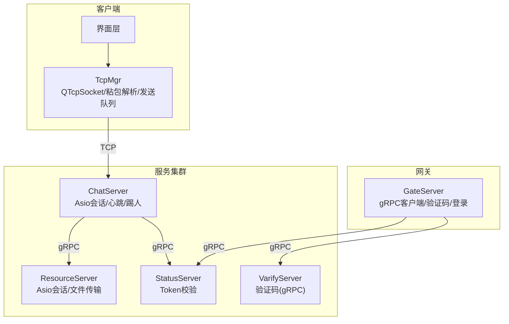
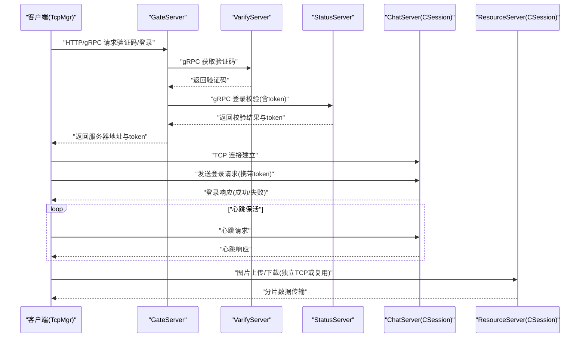
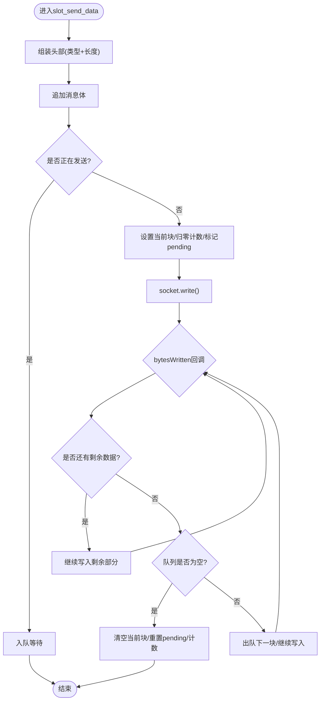
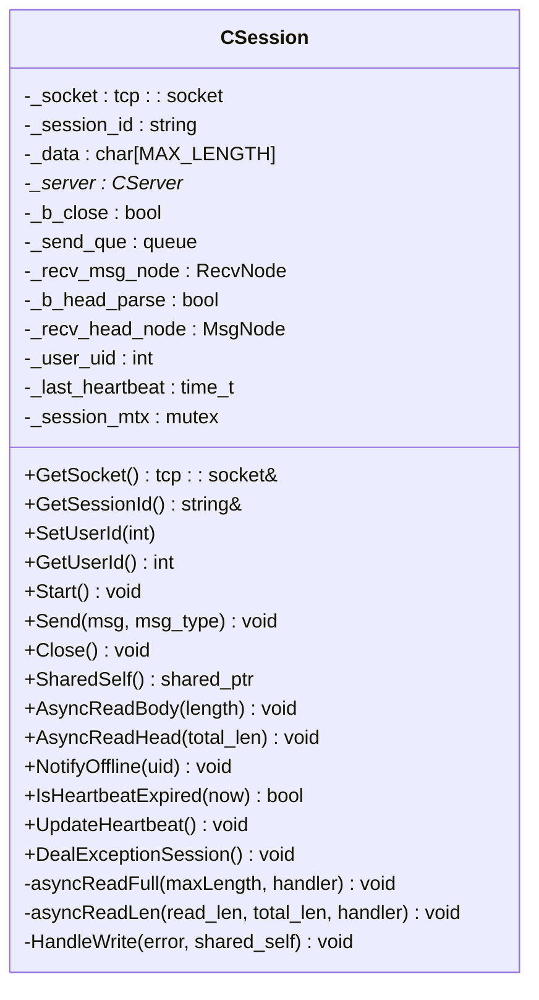
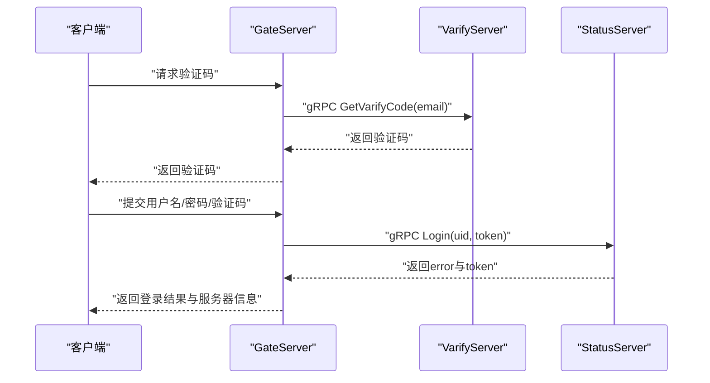
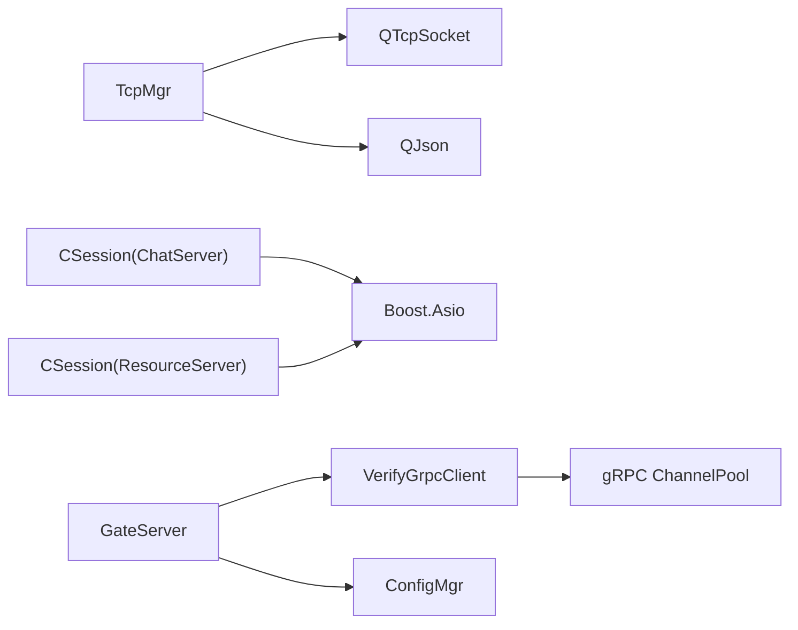

# 连接安全机制

<cite>
**本文引用的文件**   
- [tcpmgr.h](file://client/llfcchat/include/tcpmgr.h)
- [tcpmgr.cpp](file://client/llfcchat/src/tcpmgr.cpp)
- [CSession.h（ChatServer）](file://server/ChatServer/include/CSession.h)
- [CSession.h（ResourceServer）](file://server/ResourceServer/include/CSession.h)
- [config.ini（客户端）](file://client/llfcchat/config/config.ini)
- [config.ini（GateServer）](file://server/GateServer/config/config.ini)
- [chatserver1.ini（ChatServer）](file://server/ChatServer/config/chatserver1.ini)
- [VerifyGrpcClient.h](file://server/GateServer/include/VerifyGrpcClient.h)
- [day35心跳逻辑.md](file://开发文档/day35心跳逻辑.md)
</cite>

## 目录
1. [简介](#简介)
2. [项目结构](#项目结构)
3. [核心组件](#核心组件)
4. [架构总览](#架构总览)
5. [详细组件分析](#详细组件分析)
6. [依赖关系分析](#依赖关系分析)
7. [性能考虑](#性能考虑)
8. [故障排查指南](#故障排查指南)
9. [结论](#结论)
10. [附录：安全配置示例与最佳实践](#附录安全配置示例与最佳实践)

## 简介
本文件面向LLFCChat的TCP连接安全机制，覆盖以下方面：
- TCP连接建立过程中的身份验证、握手协议与安全参数配置
- 客户端与服务端连接生命周期管理（连接池、超时处理、重连机制）
- 连接加密实现（SSL/TLS配置）、证书管理与密钥交换协议现状与建议
- 连接状态监控、异常连接检测与自动断开处理
- 连接安全配置示例与故障排查指南

说明：当前代码库中TCP层未启用TLS；认证通过HTTP/gRPC通道完成并下发Token，后续业务消息在明文TCP上承载。建议在后续版本引入TLS以增强传输安全。

## 项目结构
- 客户端使用Qt网络模块进行TCP通信，封装为TcpMgr，负责连接、粘包/半包解析、发送队列与事件分发。
- 服务端采用Boost.Asio实现高性能异步I/O，会话由CSession管理，包含心跳、读写队列与异常处理。
- GateServer作为网关，负责验证码、登录鉴权等gRPC调用，并使用gRPC连接池。
- ChatServer与ResourceServer分别承担聊天与会话、资源下载等职责，均基于Asio会话模型。

图表来源
- [tcpmgr.h](file://client/llfcchat/include/tcpmgr.h)
- [tcpmgr.cpp](file://client/llfcchat/src/tcpmgr.cpp)
- [CSession.h（ChatServer）](file://server/ChatServer/include/CSession.h)
- [CSession.h（ResourceServer）](file://server/ResourceServer/include/CSession.h)
- [VerifyGrpcClient.h](file://server/GateServer/include/VerifyGrpcClient.h)

章节来源
- [tcpmgr.h](file://client/llfcchat/include/tcpmgr.h)
- [tcpmgr.cpp](file://client/llfcchat/src/tcpmgr.cpp)
- [CSession.h（ChatServer）](file://server/ChatServer/include/CSession.h)
- [CSession.h（ResourceServer）](file://server/ResourceServer/include/CSession.h)
- [VerifyGrpcClient.h](file://server/GateServer/include/VerifyGrpcClient.h)

## 核心组件
- 客户端TcpMgr
  - 基于QTcpSocket，维护主机、端口、接收缓冲、发送队列、当前发送块与已发送字节计数
  - 提供连接、关闭、发送数据接口，并通过信号槽与UI交互
  - 实现消息头（类型+长度）解析与粘包处理
- 服务端CSession（ChatServer/ResourceServer）
  - 基于Boost.Asio，维护socket、会话ID、收发缓冲区、发送队列、心跳时间戳
  - 提供异步读/写、心跳过期判断、异常会话处理、离线通知等能力
- GateServer VerifyGrpcClient
  - gRPC客户端连接池，使用InsecureChannelCredentials（明文），用于验证码获取

章节来源
- [tcpmgr.h](file://client/llfcchat/include/tcpmgr.h)
- [tcpmgr.cpp](file://client/llfcchat/src/tcpmgr.cpp)
- [CSession.h（ChatServer）](file://server/ChatServer/include/CSession.h)
- [CSession.h（ResourceServer）](file://server/ResourceServer/include/CSession.h)
- [VerifyGrpcClient.h](file://server/GateServer/include/VerifyGrpcClient.h)

## 架构总览
下图展示从客户端到各服务的完整交互流程，包括登录鉴权、聊天消息、心跳与文件传输。

图表来源
- [tcpmgr.cpp](file://client/llfcchat/src/tcpmgr.cpp)
- [CSession.h（ChatServer）](file://server/ChatServer/include/CSession.h)
- [CSession.h（ResourceServer）](file://server/ResourceServer/include/CSession.h)
- [VerifyGrpcClient.h](file://server/GateServer/include/VerifyGrpcClient.h)

## 详细组件分析

### 客户端TcpMgr：连接、握手与消息处理
- 连接建立
  - 通过connectToHost发起连接，成功后触发connected信号
  - 错误处理涵盖拒绝、远程关闭、主机未找到、超时、网络错误等
- 握手与鉴权
  - 连接成功后发送登录请求（JSON），服务端返回error字段与用户信息/token
  - 若error非成功，则触发登录失败信号
- 消息解析
  - 头部为两个quint16（消息类型、消息长度），使用QDataStream按大端序写入/读取
  - 粘包/半包处理：循环读取直到满足头部与体长要求
- 发送队列
  - 使用QQueue缓存待发送块，bytesWritten回调推进发送进度
  - pending标志避免并发写冲突

图表来源
- [tcpmgr.cpp](file://client/llfcchat/src/tcpmgr.cpp)

章节来源
- [tcpmgr.cpp](file://client/llfcchat/src/tcpmgr.cpp)

### 服务端CSession：心跳、异常处理与连接生命周期
- 心跳机制
  - 每次收到消息更新_last_heartbeat时间戳
  - 定时任务检查IsHeartbeatExpired，超过阈值则Close并清理会话
- 异常处理
  - DealExceptionSession处理异常连接，确保资源释放
- 异步读写
  - AsyncReadHead/AsyncReadBody配合RecvNode/MsgNode完成粘包解析
  - Send函数将消息入队，HandleWrite回调顺序写出

图表来源
- [CSession.h（ChatServer）](file://server/ChatServer/include/CSession.h)

章节来源
- [CSession.h（ChatServer）](file://server/ChatServer/include/CSession.h)
- [day35心跳逻辑.md](file://开发文档/day35心跳逻辑.md)

### 鉴权与Token流转（GateServer与StatusServer）
- GateServer通过VerifyGrpcClient向VarifyServer获取验证码
- 登录时调用StatusServer的Login接口，校验uid与token一致性
- 成功后返回token给客户端，后续TCP业务消息携带token进行鉴权

图表来源
- [VerifyGrpcClient.h](file://server/GateServer/include/VerifyGrpcClient.h)
- [day17-登录服务验证和客户端数据管理.md](file://开发文档/day17-登录服务验证和客户端数据管理.md)

章节来源
- [VerifyGrpcClient.h](file://server/GateServer/include/VerifyGrpcClient.h)
- [day17-登录服务验证和客户端数据管理.md](file://开发文档/day17-登录服务验证和客户端数据管理.md)

### 文件传输（ResourceServer）
- 客户端收到图片消息通知后，组织下载请求（包含name、seq、total_size、token等）
- ResourceServer分片传输，客户端根据seq与md5校验完整性

章节来源
- [tcpmgr.cpp](file://client/llfcchat/src/tcpmgr.cpp)
- [CSession.h（ResourceServer）](file://server/ResourceServer/include/CSession.h)

## 依赖关系分析
- 客户端依赖Qt网络与JSON库，服务端依赖Boost.Asio与gRPC
- GateServer依赖VerifyGrpcClient与ConfigMgr，使用InsecureChannelCredentials
- ChatServer与ResourceServer共享CSession抽象，具备一致的心跳与异常处理模式

图表来源
- [tcpmgr.h](file://client/llfcchat/include/tcpmgr.h)
- [CSession.h（ChatServer）](file://server/ChatServer/include/CSession.h)
- [CSession.h（ResourceServer）](file://server/ResourceServer/include/CSession.h)
- [VerifyGrpcClient.h](file://server/GateServer/include/VerifyGrpcClient.h)

章节来源
- [tcpmgr.h](file://client/llfcchat/include/tcpmgr.h)
- [CSession.h（ChatServer）](file://server/ChatServer/include/CSession.h)
- [CSession.h（ResourceServer）](file://server/ResourceServer/include/CSession.h)
- [VerifyGrpcClient.h](file://server/GateServer/include/VerifyGrpcClient.h)

## 性能考虑
- 客户端发送队列与bytesWritten回调减少阻塞，提升吞吐
- 服务端异步I/O与发送队列避免锁竞争，提高并发处理能力
- 心跳间隔与阈值需平衡实时性与开销（建议60s检测，20~30s心跳周期）
- JSON序列化/反序列化开销较大，可考虑二进制协议优化

[本节为通用指导，不直接分析具体文件]

## 故障排查指南
- 连接失败
  - 检查客户端config.ini中的GateServer host/port
  - 确认防火墙与NAT映射，查看错误码（拒绝、超时、主机未找到）
- 登录失败
  - 检查验证码是否正确，StatusServer的token是否匹配
  - 查看登录响应error字段
- 心跳超时
  - 调整心跳阈值与间隔，确保客户端定时发送心跳
  - 检查服务端定时器与IsHeartbeatExpired逻辑
- 文件传输中断
  - 核对seq、md5与total_size一致性
  - 检查ResourceServer的分片输出与客户端接收逻辑

章节来源
- [config.ini（客户端）](file://client/llfcchat/config/config.ini)
- [tcpmgr.cpp](file://client/llfcchat/src/tcpmgr.cpp)
- [day35心跳逻辑.md](file://开发文档/day35心跳逻辑.md)

## 结论
- 当前LLFCChat的TCP层未启用TLS，认证通过HTTP/gRPC通道完成并下发Token，业务消息在明文TCP上承载
- 客户端与服务端具备完善的连接生命周期管理、粘包处理、心跳与异常处理机制
- 建议后续引入TLS（OpenSSL/Boost.Asio SSL）以增强传输安全，并对gRPC通道启用TLS与双向认证

[本节为总结性内容，不直接分析具体文件]

## 附录：安全配置示例与最佳实践
- 客户端配置（示例）
  - GateServer host/port：用于初始HTTP/gRPC交互
- 服务端配置（示例）
  - GateServer：验证码与登录相关服务地址
  - ChatServer：自服务名、监听端口、RPC端口
  - Redis/Mysql：存储与缓存配置
- TLS建议
  - 客户端：配置CA证书路径、启用verifyMode
  - 服务端：加载证书与私钥，启用sslContext
  - gRPC：替换InsecureChannelCredentials为SecureChannelCredentials，启用双向认证

章节来源
- [config.ini（客户端）](file://client/llfcchat/config/config.ini)
- [config.ini（GateServer）](file://server/GateServer/config/config.ini)
- [chatserver1.ini（ChatServer）](file://server/ChatServer/config/chatserver1.ini)
- [VerifyGrpcClient.h](file://server/GateServer/include/VerifyGrpcClient.h)