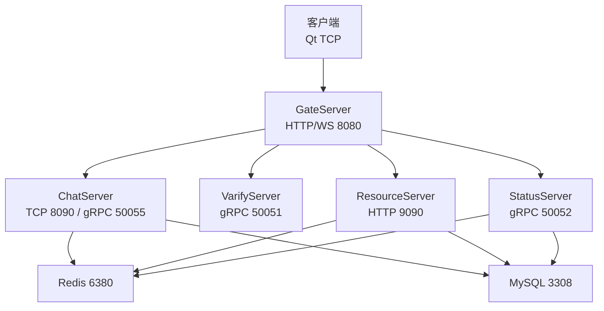
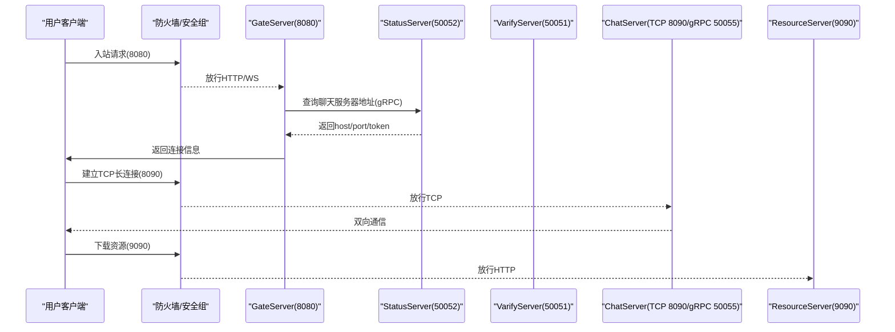
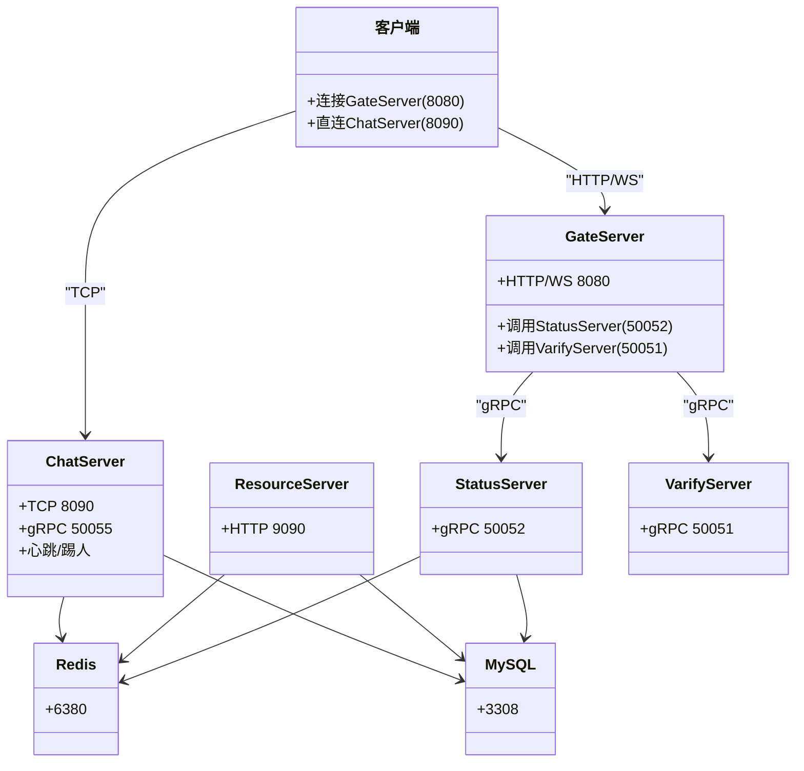

# 防火墙规则配置

<cite>
**本文引用的文件**   
- [README.md](file://README.md)
- [client/llfcchat/config/config.ini](file://client/llfcchat/config/config.ini)
- [server/GateServer/config/config.ini](file://server/GateServer/config/config.ini)
- [server/ChatServer/config/chatserver1.ini](file://server/ChatServer/config/chatserver1.ini)
- [server/ResourceServer/config/config.ini](file://server/ResourceServer/config/config.ini)
- [server/StatusServer/config/config.ini](file://server/StatusServer/config/config.ini)
- [server/GateServer/include/CServer.h](file://server/GateServer/include/CServer.h)
- [server/ChatServer/include/CServer.h](file://server/ChatServer/include/CServer.h)
- [server/ChatServer/include/CSession.h](file://server/ChatServer/include/CSession.h)
- [server/ResourceServer/include/CSession.h](file://server/ResourceServer/include/CSession.h)
- [server/GateServer/src/VerifyGrpcClient.cpp](file://server/GateServer/src/VerifyGrpcClient.cpp)
- [开发文档/day15-客户端Tcp管理类设计.md](file://开发文档/day15-客户端Tcp管理类设计.md)
- [开发文档/day27-分布式服务设计.md](file://开发文档/day27-分布式服务设计.md)
- [开发文档/day35心跳逻辑.md](file://开发文档/day35心跳逻辑.md)
- [开发文档/day44-webrtc信令服务器实现.md](file://开发文档/day44-webrtc信令服务器实现.md)
</cite>

## 目录
1. [引言](#引言)
2. [项目结构](#项目结构)
3. [核心组件](#核心组件)
4. [架构总览](#架构总览)
5. [详细组件分析](#详细组件分析)
6. [依赖关系分析](#依赖关系分析)
7. [性能与容量规划](#性能与容量规划)
8. [故障排查指南](#故障排查指南)
9. [结论](#结论)
10. [附录：端口清单与安全基线](#附录端口清单与安全基线)

## 引言
本文件面向LLFCChat项目的网络边界安全，提供一套可落地的防火墙规则与网络安全组配置方案。内容覆盖端口管理策略（开放、映射、转发）、IP白名单机制（可信段、动态过滤、地理限制）、DDoS防护（连接数限制、请求频率控制、流量清洗）、以及入站/出站规则、协议过滤与带宽限制等。同时结合项目实际的网络拓扑与端口配置，给出最小化暴露面与纵深防御的最佳实践。

## 项目结构
LLFCChat由多类服务组成：客户端、网关服务（GateServer）、聊天服务（ChatServer）、资源服务（ResourceServer）、状态服务（StatusServer）以及验证服务（VarifyServer）。各服务通过TCP/gRPC对外暴露端口，并通过Redis/MySQL进行状态与数据持久化。

图表来源
- [server/GateServer/config/config.ini:1-23](file://server/GateServer/config/config.ini#L1-L23)
- [server/ChatServer/config/chatserver1.ini:1-30](file://server/ChatServer/config/chatserver1.ini#L1-L30)
- [server/ResourceServer/config/config.ini:1-27](file://server/ResourceServer/config/config.ini#L1-L27)
- [server/StatusServer/config/config.ini:1-23](file://server/StatusServer/config/config.ini#L1-L23)

章节来源
- [README.md:1-112](file://README.md#L1-L112)
- [server/GateServer/config/config.ini:1-23](file://server/GateServer/config/config.ini#L1-L23)
- [server/ChatServer/config/chatserver1.ini:1-30](file://server/ChatServer/config/chatserver1.ini#L1-L30)
- [server/ResourceServer/config/config.ini:1-27](file://server/ResourceServer/config/config.ini#L1-L27)
- [server/StatusServer/config/config.ini:1-23](file://server/StatusServer/config/config.ini#L1-L23)

## 核心组件
- 客户端TCP管理器：负责与聊天服务器的长连接建立、粘包处理、错误处理与重连。
- GateServer：统一入口，处理HTTP/WebSocket接入，并路由到后端服务。
- ChatServer：聊天业务主服务，监听TCP与gRPC端口，维护会话、心跳、踢人逻辑。
- ResourceServer：静态资源与文件传输服务。
- StatusServer：状态管理与路由发现服务。
- VarifyServer：验证码与邮箱认证服务。

章节来源
- [开发文档/day15-客户端Tcp管理类设计.md:1-209](file://开发文档/day15-客户端Tcp管理类设计.md#L1-L209)
- [server/GateServer/include/CServer.h:1-16](file://server/GateServer/include/CServer.h#L1-L16)
- [server/ChatServer/include/CServer.h:1-33](file://server/ChatServer/include/CServer.h#L1-L33)
- [server/ChatServer/include/CSession.h:1-86](file://server/ChatServer/include/CSession.h#L1-L86)
- [server/ResourceServer/include/CSession.h:1-64](file://server/ResourceServer/include/CSession.h#L1-L64)

## 架构总览
从网络边界视角，建议将GateServer作为唯一对外入口，其他服务仅对内部网段或特定代理开放。下图展示典型部署下的访问路径与端口暴露点。

图表来源
- [server/GateServer/config/config.ini:1-23](file://server/GateServer/config/config.ini#L1-L23)
- [server/ChatServer/config/chatserver1.ini:1-30](file://server/ChatServer/config/chatserver1.ini#L1-L30)
- [server/ResourceServer/config/config.ini:1-27](file://server/ResourceServer/config/config.ini#L1-L27)
- [server/StatusServer/config/config.ini:1-23](file://server/StatusServer/config/config.ini#L1-L23)

## 详细组件分析

### 端口管理与访问控制
- 对外端口（建议仅暴露）
  - GateServer HTTP/WS：8080
  - ResourceServer HTTP：9090（如需要公网访问；否则仅内网）
- 对内端口（仅允许GateServer/StatusServer/ResourceServer互访）
  - ChatServer TCP：8090
  - ChatServer gRPC：50055
  - StatusServer gRPC：50052
  - VarifyServer gRPC：50051
- 数据库与缓存（仅应用层访问）
  - MySQL：3308
  - Redis：6380

端口来源
- [server/GateServer/config/config.ini:1-23](file://server/GateServer/config/config.ini#L1-L23)
- [server/ChatServer/config/chatserver1.ini:1-30](file://server/ChatServer/config/chatserver1.ini#L1-L30)
- [server/ResourceServer/config/config.ini:1-27](file://server/ResourceServer/config/config.ini#L1-L27)
- [server/StatusServer/config/config.ini:1-23](file://server/StatusServer/config/config.ini#L1-L23)

章节来源
- [server/GateServer/config/config.ini:1-23](file://server/GateServer/config/config.ini#L1-L23)
- [server/ChatServer/config/chatserver1.ini:1-30](file://server/ChatServer/config/chatserver1.ini#L1-L30)
- [server/ResourceServer/config/config.ini:1-27](file://server/ResourceServer/config/config.ini#L1-L27)
- [server/StatusServer/config/config.ini:1-23](file://server/StatusServer/config/config.ini#L1-L23)

### IP白名单与访问控制
- 可信IP段
  - 仅允许GateServer所在子网访问StatusServer/ChatServer/ResourceServer的gRPC/HTTP端口。
  - 仅允许ChatServer/ResourceServer访问MySQL与Redis。
- 动态IP过滤
  - 登录成功后，服务端记录用户当前会话与服务器名，重复登录时触发踢人逻辑，避免同一账号并发异常。
- 地理位置限制
  - 在网关层按源IP归属地做黑白名单策略，仅放行目标国家/地区。

相关实现参考
- [server/ChatServer/src/LogicSystem.cpp:211-254](file://server/ChatServer/src/LogicSystem.cpp#L211-L254)

章节来源
- [server/ChatServer/src/LogicSystem.cpp:211-254](file://server/ChatServer/src/LogicSystem.cpp#L211-L254)

### DDoS防护策略
- 连接数限制
  - 单IP最大并发连接数限制（例如每IP不超过N个TCP连接）。
  - 全局连接池上限，防止资源耗尽。
- 请求频率控制
  - 针对登录、验证码、注册等敏感接口实施限流（如每秒/分钟阈值）。
- 流量清洗
  - 启用上游CDN/WAF进行SYN Flood、CC攻击缓解，回源仅允许网关IP。

章节来源
- [开发文档/day27-分布式服务设计.md:221-276](file://开发文档/day27-分布式服务设计.md#L221-L276)

### 网络安全组与边界防护
- 入站规则
  - 仅开放8080、9090（可选）至互联网；其余端口仅允许内网或反向代理访问。
  - 限制ICMP类型与速率，避免被探测利用。
- 出站规则
  - 仅允许应用访问必要的MySQL/Redis与外部API（如邮件服务），禁止任意出站。
- 协议过滤
  - 仅放行HTTP/HTTPS、WebSocket、gRPC、TCP；阻断非业务协议。
- 带宽限制
  - 为不同服务设置带宽上限，防止单一服务占满出口带宽。

章节来源
- [server/GateServer/config/config.ini:1-23](file://server/GateServer/config/config.ini#L1-L23)
- [server/ResourceServer/config/config.ini:1-27](file://server/ResourceServer/config/config.ini#L1-L27)

### 会话与心跳（防僵尸连接）
- 心跳检测
  - 服务端定时扫描会话，超过阈值关闭空闲连接，清理Redis中的会话与登录标记。
- 异常会话处理
  - 读写异常时主动清理会话队列与资源，避免内存泄漏。

相关实现参考
- [server/ChatServer/include/CSession.h:1-86](file://server/ChatServer/include/CSession.h#L1-L86)
- [开发文档/day35心跳逻辑.md:41-93](file://开发文档/day35心跳逻辑.md#L41-L93)

章节来源
- [server/ChatServer/include/CSession.h:1-86](file://server/ChatServer/include/CSession.h#L1-L86)
- [开发文档/day35心跳逻辑.md:41-93](file://开发文档/day35心跳逻辑.md#L41-L93)

### WebRTC信令与媒体通道
- 信令服务器（WebRTC demo）用于握手协商，媒体走P2P，不经过服务器。
- 生产环境建议：
  - 使用HTTPS/WSS加密信令。
  - TURN使用动态签名，防止带宽滥用。
  - 房间加入需鉴权（token/用户身份）。

章节来源
- [开发文档/day44-webrtc信令服务器实现.md:371-468](file://开发文档/day44-webrtc信令服务器实现.md#L371-L468)

## 依赖关系分析
- 客户端依赖GateServer获取聊天服务器地址与令牌，随后直连ChatServer。
- GateServer依赖StatusServer与VarifyServer完成路由与验证码校验。
- ChatServer/ResourceServer/StatusServer依赖MySQL与Redis。

图表来源
- [server/GateServer/config/config.ini:1-23](file://server/GateServer/config/config.ini#L1-L23)
- [server/ChatServer/config/chatserver1.ini:1-30](file://server/ChatServer/config/chatserver1.ini#L1-L30)
- [server/ResourceServer/config/config.ini:1-27](file://server/ResourceServer/config/config.ini#L1-L27)
- [server/StatusServer/config/config.ini:1-23](file://server/StatusServer/config/config.ini#L1-L23)

章节来源
- [server/GateServer/src/VerifyGrpcClient.cpp:1-9](file://server/GateServer/src/VerifyGrpcClient.cpp#L1-L9)
- [server/GateServer/config/config.ini:1-23](file://server/GateServer/config/config.ini#L1-L23)

## 性能与容量规划
- 连接数与线程池
  - 根据CPU核数与IO模型调整Asio线程池大小，避免上下文切换开销过大。
- 超时与重试
  - 合理设置TCP/HTTP/gRPC超时，配合指数退避重试，降低雪崩风险。
- 缓存与分片
  - 热点数据缓存于Redis，跨服会话与锁使用分布式锁与键空间隔离。
- 监控与告警
  - 监控连接数、QPS、延迟、错误率，设置阈值告警。

章节来源
- [开发文档/day27-分布式服务设计.md:221-276](file://开发文档/day27-分布式服务设计.md#L221-L276)

## 故障排查指南
- 连接失败
  - 检查防火墙是否放行8080/9090/8090等端口；确认DNS解析与主机可达性。
- 频繁断线
  - 检查心跳阈值与网络抖动；查看服务端会话清理日志。
- 登录冲突
  - 依据踢人逻辑定位重复登录来源，必要时限制同账号并发。
- 资源下载慢
  - 检查ResourceServer带宽与磁盘IO；开启CDN缓存静态资源。

章节来源
- [开发文档/day15-客户端Tcp管理类设计.md:1-209](file://开发文档/day15-客户端Tcp管理类设计.md#L1-L209)
- [开发文档/day35心跳逻辑.md:41-93](file://开发文档/day35心跳逻辑.md#L41-L93)

## 结论
通过将GateServer作为唯一对外入口、严格限制内网服务端口暴露、结合IP白名单与DDoS防护，可在保障业务可用性的同时显著提升系统安全性。配合心跳与踢人机制、合理的超时与限流策略，可有效抵御常见网络攻击与异常流量。

## 附录：端口清单与安全基线
- 对外端口
  - 8080：GateServer HTTP/WS（必须）
  - 9090：ResourceServer HTTP（按需开放）
- 对内端口
  - 8090：ChatServer TCP（仅内网）
  - 50055：ChatServer gRPC（仅内网）
  - 50052：StatusServer gRPC（仅内网）
  - 50051：VarifyServer gRPC（仅内网）
- 数据端口
  - 3308：MySQL（仅应用层）
  - 6380：Redis（仅应用层）

安全基线建议
- 最小暴露面：仅开放必要端口，其余默认拒绝。
- 源地址限制：基于IP段/地理位置限制入站。
- 协议白名单：仅放行HTTP/HTTPS/WS/gRPC/TCP。
- 速率限制：对敏感接口实施限流与熔断。
- 审计与告警：记录访问日志与异常事件，及时告警。

章节来源
- [server/GateServer/config/config.ini:1-23](file://server/GateServer/config/config.ini#L1-L23)
- [server/ChatServer/config/chatserver1.ini:1-30](file://server/ChatServer/config/chatserver1.ini#L1-L30)
- [server/ResourceServer/config/config.ini:1-27](file://server/ResourceServer/config/config.ini#L1-L27)
- [server/StatusServer/config/config.ini:1-23](file://server/StatusServer/config/config.ini#L1-L23)