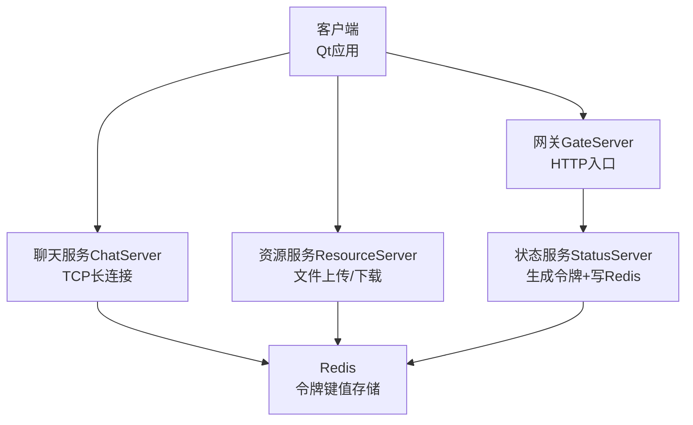
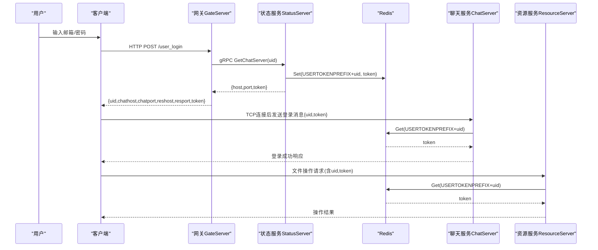
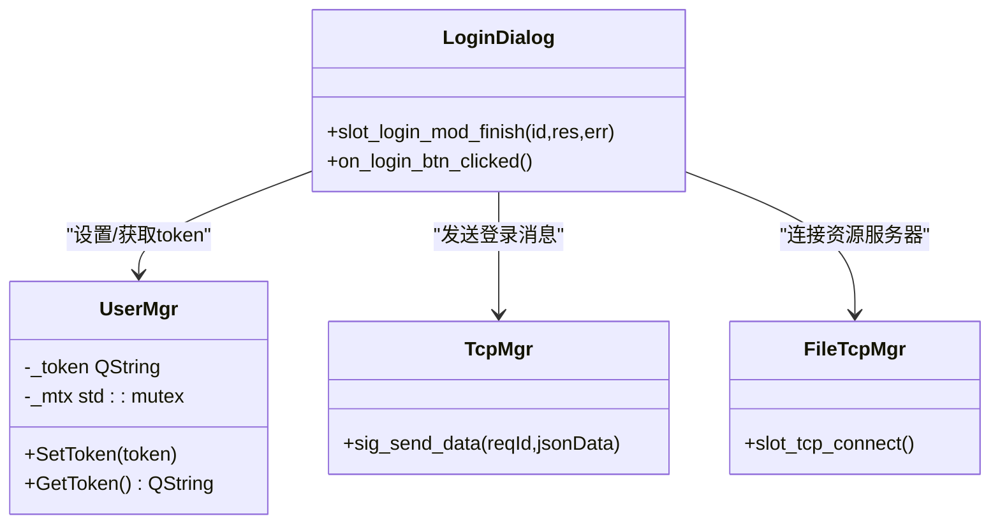
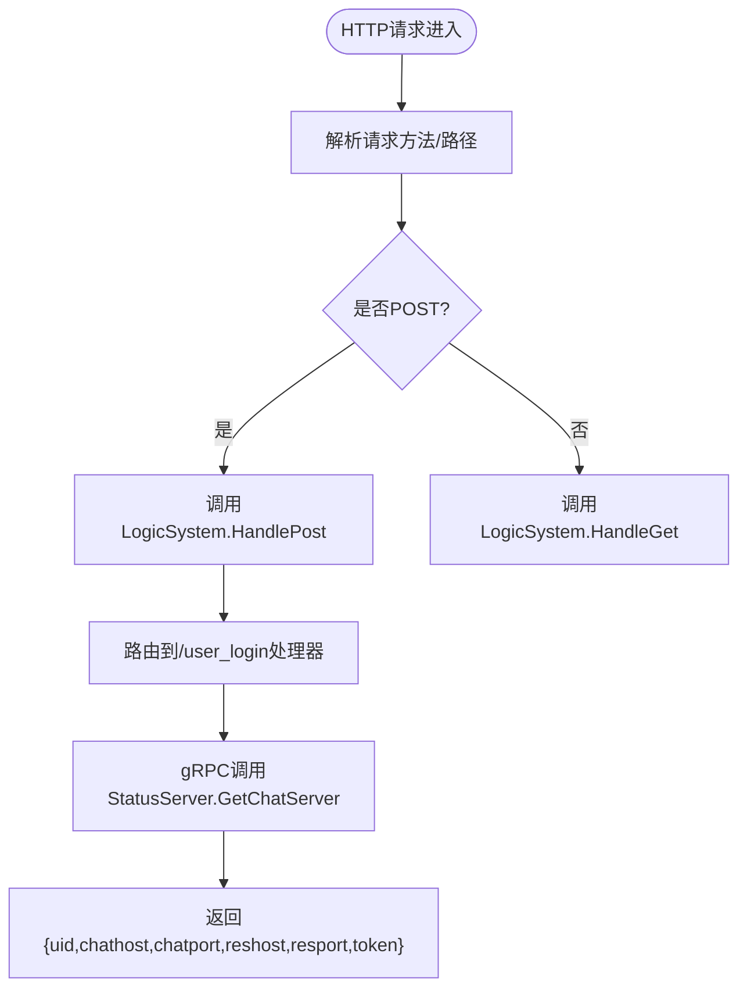
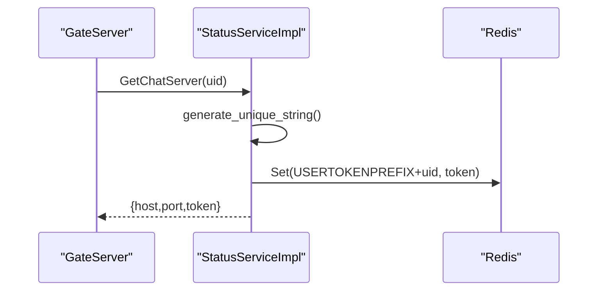
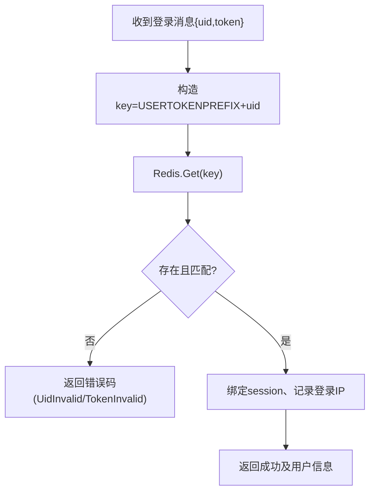
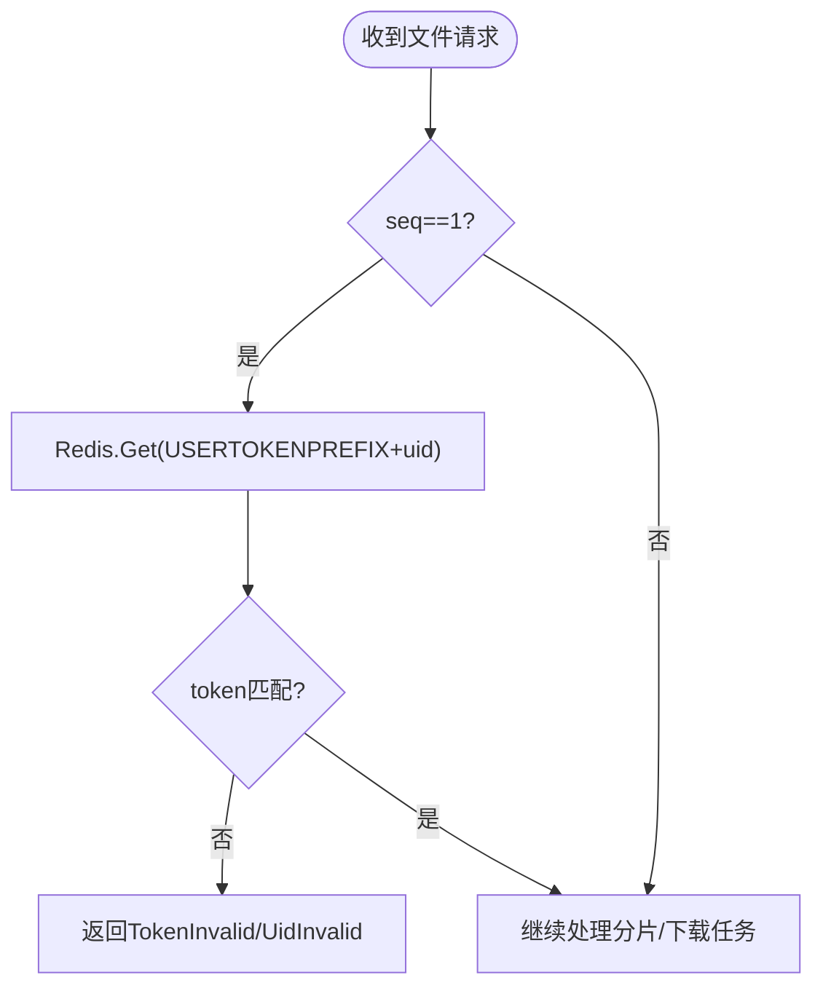
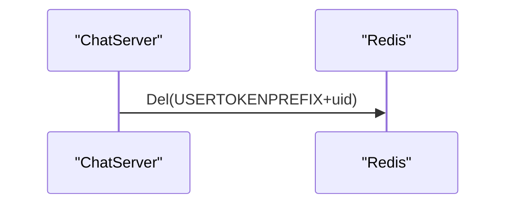
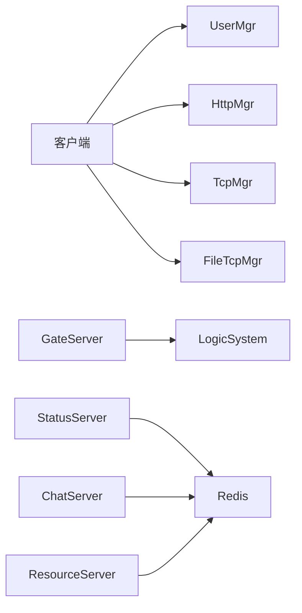
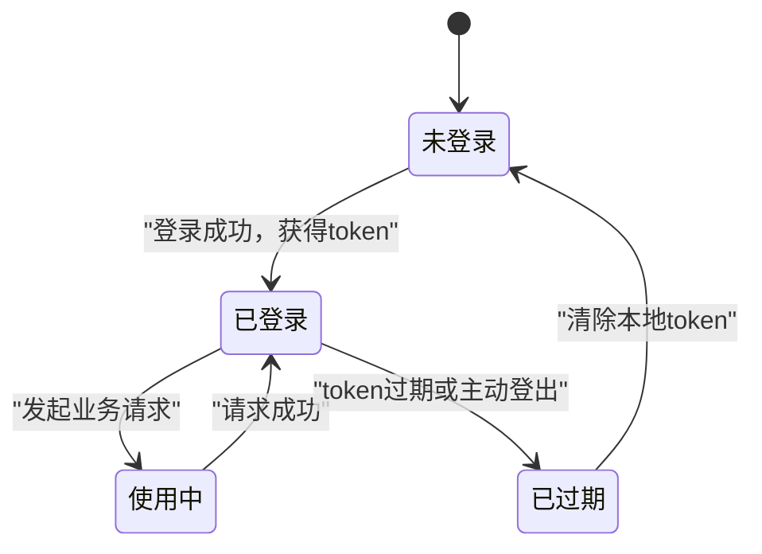

# JWT令牌管理

<cite>
**本文引用的文件**   
- [server.js](file://server/VarifyServer/server.js)
- [usermgr.h](file://client/llfcchat/include/usermgr.h)
- [usermgr.cpp](file://client/llfcchat/src/usermgr.cpp)
- [logindialog.cpp](file://client/llfcchat/src/logindialog.cpp)
- [HttpConnection.cpp](file://server/GateServer/src/HttpConnection.cpp)
- [StatusServiceImpl.cpp](file://server/StatusServer/src/StatusServiceImpl.cpp)
- [LogicSystem.cpp](file://server/ChatServer/src/LogicSystem.cpp)
- [CSession.cpp](file://server/ChatServer/src/CSession.cpp)
- [LogicWorker.cpp](file://server/ResourceServer/src/LogicWorker.cpp)
</cite>

## 目录
1. [简介](#简介)
2. [项目结构](#项目结构)
3. [核心组件](#核心组件)
4. [架构总览](#架构总览)
5. [详细组件分析](#详细组件分析)
6. [依赖关系分析](#依赖关系分析)
7. [性能考量](#性能考量)
8. [故障排查指南](#故障排查指南)
9. [结论](#结论)
10. [附录](#附录)

## 简介
本文件围绕LLFCChat项目的“令牌管理机制”进行系统化说明。需要特别说明的是：当前仓库并未实现标准JWT（JSON Web Token）的生成、签名与验签流程，而是采用“服务端随机字符串令牌 + Redis键值校验”的会话令牌方案。该方案在功能上等价于无状态JWT的“有状态化替代”，通过Redis集中存储令牌的合法性与过期策略，达到统一鉴权与跨服务共享的目的。

本文将基于代码实际实现，完整梳理令牌的生成、下发、存储、校验、刷新与失效的全链路，并给出客户端侧的本地存储与自动刷新策略建议，以及安全最佳实践与常见漏洞防护要点。

## 项目结构
从令牌相关的关键路径看，涉及以下模块：
- 客户端（Qt C++）：登录界面、HTTP/TCP管理器、用户态令牌存储
- 网关（GateServer）：HTTP入口，转发登录请求至状态服务
- 状态服务（StatusServer）：生成唯一令牌并写入Redis
- 聊天服务（ChatServer）：接收TCP连接后校验令牌，建立会话
- 资源服务（ResourceServer）：上传/下载等接口对令牌进行校验
- 验证码服务（VarifyServer）：独立服务，负责验证码发放（与令牌机制解耦）

**图表来源** 
- [HttpConnection.cpp:133-194](file://server/GateServer/src/HttpConnection.cpp#L133-L194)
- [StatusServiceImpl.cpp:17-27](file://server/StatusServer/src/StatusServiceImpl.cpp#L17-L27)
- [LogicSystem.cpp:116-156](file://server/ChatServer/src/LogicSystem.cpp#L116-L156)
- [LogicWorker.cpp:235-254](file://server/ResourceServer/src/LogicWorker.cpp#L235-L254)

**章节来源**
- [HttpConnection.cpp:133-194](file://server/GateServer/src/HttpConnection.cpp#L133-L194)
- [StatusServiceImpl.cpp:17-27](file://server/StatusServer/src/StatusServiceImpl.cpp#L17-L27)
- [LogicSystem.cpp:116-156](file://server/ChatServer/src/LogicSystem.cpp#L116-L156)
- [LogicWorker.cpp:235-254](file://server/ResourceServer/src/LogicWorker.cpp#L235-L254)

## 核心组件
- 客户端用户态令牌管理
  - UserMgr：提供SetToken/GetToken，线程安全的内存令牌存取
  - LoginDialog：登录成功后解析token，发起TCP连接并携带token完成聊天服务登录
  - 其他业务模块（如文件传输、聊天消息）在请求中附带token字段
- 网关HTTP处理
  - HttpConnection：解析HTTP请求，路由到逻辑系统处理
- 状态服务令牌生成
  - StatusServiceImpl：生成唯一令牌（UUID），写入Redis，返回给客户端
- 聊天服务令牌校验与会话绑定
  - LogicSystem.LoginHandler：从Redis读取令牌并比对，成功则绑定session、记录登录IP
  - CSession：登出时清理Redis中的令牌键
- 资源服务令牌校验
  - LogicWorker：在首包校验token，后续按seq分片处理

**章节来源**
- [usermgr.h:12-28](file://client/llfcchat/include/usermgr.h#L12-L28)
- [usermgr.cpp:15-24](file://client/llfcchat/src/usermgr.cpp#L15-L24)
- [logindialog.cpp:80-109](file://client/llfcchat/src/logindialog.cpp#L80-L109)
- [HttpConnection.cpp:133-194](file://server/GateServer/src/HttpConnection.cpp#L133-L194)
- [StatusServiceImpl.cpp:17-27](file://server/StatusServer/src/StatusServiceImpl.cpp#L17-L27)
- [LogicSystem.cpp:116-156](file://server/ChatServer/src/LogicSystem.cpp#L116-L156)
- [CSession.cpp:332-334](file://server/ChatServer/src/CSession.cpp#L332-L334)
- [LogicWorker.cpp:235-254](file://server/ResourceServer/src/LogicWorker.cpp#L235-L254)

## 架构总览
下图展示了从用户登录到各服务校验令牌的端到端流程。注意：当前实现并非JWT，而是“随机令牌+Redis校验”。

**图表来源** 
- [logindialog.cpp:193-255](file://client/llfcchat/src/logindialog.cpp#L193-L255)
- [StatusServiceImpl.cpp:17-27](file://server/StatusServer/src/StatusServiceImpl.cpp#L17-L27)
- [LogicSystem.cpp:116-156](file://server/ChatServer/src/LogicSystem.cpp#L116-L156)
- [LogicWorker.cpp:235-254](file://server/ResourceServer/src/LogicWorker.cpp#L235-L254)

## 详细组件分析

### 客户端令牌管理与使用
- 令牌存储
  - UserMgr提供SetToken/GetToken，内部以互斥锁保护内存中的_token字段
  - 登录成功后，LoginDialog解析HTTP响应中的token并调用UserMgr::SetToken保存
- 令牌使用
  - 聊天消息、文件传输、头像上传等请求中均会附加token字段
  - 示例引用路径：
    - 聊天消息：[chatpage.cpp:510](file://client/llfcchat/src/chatpage.cpp#L510)
    - 文件传输：[filetcpmgr.cpp:798](file://client/llfcchat/src/filetcpmgr.cpp#L798), [filetcpmgr.cpp:876](file://client/llfcchat/src/filetcpmgr.cpp#L876), [filetcpmgr.cpp:1094](file://client/llfcchat/src/filetcpmgr.cpp#L1094), [filetcpmgr.cpp:1116](file://client/llfcchat/src/filetcpmgr.cpp#L1116)
    - TCP登录：[tcpmgr.cpp:222](file://client/llfcchat/src/tcpmgr.cpp#L222)
- 本地持久化与自动刷新
  - 当前未实现持久化存储与自动刷新；建议在进程内缓存基础上增加安全存储（如加密文件或系统密钥库），并在token即将过期前触发刷新流程

**图表来源** 
- [usermgr.h:12-28](file://client/llfcchat/include/usermgr.h#L12-L28)
- [usermgr.cpp:15-24](file://client/llfcchat/src/usermgr.cpp#L15-L24)
- [logindialog.cpp:80-109](file://client/llfcchat/src/logindialog.cpp#L80-L109)
- [logindialog.cpp:193-255](file://client/llfcchat/src/logindialog.cpp#L193-L255)

**章节来源**
- [usermgr.h:12-28](file://client/llfcchat/include/usermgr.h#L12-L28)
- [usermgr.cpp:15-24](file://client/llfcchat/src/usermgr.cpp#L15-L24)
- [logindialog.cpp:80-109](file://client/llfcchat/src/logindialog.cpp#L80-L109)
- [logindialog.cpp:193-255](file://client/llfcchat/src/logindialog.cpp#L193-L255)
- [chatpage.cpp:510](file://client/llfcchat/src/chatpage.cpp#L510)
- [filetcpmgr.cpp:798](file://client/llfcchat/src/filetcpmgr.cpp#L798)
- [filetcpmgr.cpp:876](file://client/llfcchat/src/filetcpmgr.cpp#L876)
- [filetcpmgr.cpp:1094](file://client/llfcchat/src/filetcpmgr.cpp#L1094)
- [filetcpmgr.cpp:1116](file://client/llfcchat/src/filetcpmgr.cpp#L1116)
- [tcpmgr.cpp:222](file://client/llfcchat/src/tcpmgr.cpp#L222)

### 网关HTTP入口与路由
- HttpConnection负责解析HTTP请求（GET/POST），将请求交由LogicSystem处理
- 登录接口由GateServer注册的路由处理，最终调用StatusGrpcClient获取聊天服务信息与token

**图表来源** 
- [HttpConnection.cpp:133-194](file://server/GateServer/src/HttpConnection.cpp#L133-L194)
- [开发文档/day42-用户加载聊天资源.md:110-166](file://开发文档/day42-用户加载聊天资源.md#L110-L166)

**章节来源**
- [HttpConnection.cpp:133-194](file://server/GateServer/src/HttpConnection.cpp#L133-L194)
- [开发文档/day42-用户加载聊天资源.md:110-166](file://开发文档/day42-用户加载聊天资源.md#L110-L166)

### 状态服务令牌生成与存储
- StatusServiceImpl::GetChatServer生成唯一字符串（UUID），并通过insertToken写入Redis
- 插入键格式为USERTOKENPREFIX+uid_str，值为生成的token

**图表来源** 
- [StatusServiceImpl.cpp:7-15](file://server/StatusServer/src/StatusServiceImpl.cpp#L7-L15)
- [StatusServiceImpl.cpp:17-27](file://server/StatusServer/src/StatusServiceImpl.cpp#L17-L27)
- [StatusServiceImpl.cpp:118-123](file://server/StatusServer/src/StatusServiceImpl.cpp#L118-L123)

**章节来源**
- [StatusServiceImpl.cpp:7-15](file://server/StatusServer/src/StatusServiceImpl.cpp#L7-L15)
- [StatusServiceImpl.cpp:17-27](file://server/StatusServer/src/StatusServiceImpl.cpp#L17-L27)
- [StatusServiceImpl.cpp:118-123](file://server/StatusServer/src/StatusServiceImpl.cpp#L118-L123)

### 聊天服务令牌校验与会话绑定
- LogicSystem.LoginHandler解析登录消息中的uid与token，从Redis读取对应键值进行比对
- 校验通过后，绑定session、记录登录IP，并返回用户信息、好友列表等

**图表来源** 
- [LogicSystem.cpp:116-156](file://server/ChatServer/src/LogicSystem.cpp#L116-L156)

**章节来源**
- [LogicSystem.cpp:116-156](file://server/ChatServer/src/LogicSystem.cpp#L116-L156)

### 资源服务令牌校验
- LogicWorker在处理上传/下载等请求时，首包即校验token（Redis查询并比对）
- 校验失败直接返回错误码，避免后续处理

**图表来源** 
- [LogicWorker.cpp:235-254](file://server/ResourceServer/src/LogicWorker.cpp#L235-L254)
- [LogicWorker.cpp:340-358](file://server/ResourceServer/src/LogicWorker.cpp#L340-L358)

**章节来源**
- [LogicWorker.cpp:235-254](file://server/ResourceServer/src/LogicWorker.cpp#L235-L254)
- [LogicWorker.cpp:340-358](file://server/ResourceServer/src/LogicWorker.cpp#L340-L358)

### 登出与令牌清理
- CSession在登出或会话结束时删除Redis中的令牌键，防止令牌被复用

**图表来源** 
- [CSession.cpp:332-334](file://server/ChatServer/src/CSession.cpp#L332-L334)

**章节来源**
- [CSession.cpp:332-334](file://server/ChatServer/src/CSession.cpp#L332-L334)

### 验证码服务（与令牌机制解耦）
- VarifyServer负责验证码生成与邮件发送，使用Redis缓存验证码ID，与令牌机制无直接耦合

**章节来源**
- [server.js:15-63](file://server/VarifyServer/server.js#L15-L63)

## 依赖关系分析
- 客户端依赖UserMgr进行令牌存取，依赖HttpMgr/TcpMgr/FileTcpMgr进行网络通信
- 网关依赖LogicSystem进行路由分发
- 状态服务依赖Redis进行令牌存储
- 聊天/资源服务依赖Redis进行令牌校验

**图表来源** 
- [usermgr.h:12-28](file://client/llfcchat/include/usermgr.h#L12-L28)
- [HttpConnection.cpp:133-194](file://server/GateServer/src/HttpConnection.cpp#L133-L194)
- [StatusServiceImpl.cpp:17-27](file://server/StatusServer/src/StatusServiceImpl.cpp#L17-L27)
- [LogicSystem.cpp:116-156](file://server/ChatServer/src/LogicSystem.cpp#L116-L156)
- [LogicWorker.cpp:235-254](file://server/ResourceServer/src/LogicWorker.cpp#L235-L254)

**章节来源**
- [usermgr.h:12-28](file://client/llfcchat/include/usermgr.h#L12-L28)
- [HttpConnection.cpp:133-194](file://server/GateServer/src/HttpConnection.cpp#L133-L194)
- [StatusServiceImpl.cpp:17-27](file://server/StatusServer/src/StatusServiceImpl.cpp#L17-L27)
- [LogicSystem.cpp:116-156](file://server/ChatServer/src/LogicSystem.cpp#L116-L156)
- [LogicWorker.cpp:235-254](file://server/ResourceServer/src/LogicWorker.cpp#L235-L254)

## 性能考量
- Redis访问频率
  - 每次登录、聊天登录、文件操作首包均需访问Redis，需确保Redis高可用与低延迟
- 令牌长度与生成成本
  - UUID生成开销较低，但应避免频繁重复生成；可考虑短期令牌+刷新令牌组合降低Redis压力
- 并发与锁
  - 登录过程中使用分布式锁避免多端冲突，减少竞态条件导致的异常

[本节为通用指导，不直接分析具体文件]

## 故障排查指南
- 登录失败
  - 检查HTTP响应error字段与Redis中是否存在对应token键
  - 参考路径：[logindialog.cpp:193-255](file://client/llfcchat/src/logindialog.cpp#L193-L255)
- 聊天服务登录失败
  - 确认Redis中USERTOKENPREFIX+uid键是否存在且值匹配
  - 参考路径：[LogicSystem.cpp:116-156](file://server/ChatServer/src/LogicSystem.cpp#L116-L156)
- 资源服务操作失败
  - 首包token校验失败会导致立即返回错误码
  - 参考路径：[LogicWorker.cpp:235-254](file://server/ResourceServer/src/LogicWorker.cpp#L235-L254)
- 登出后仍可使用令牌
  - 检查CSession是否在登出时执行Del操作
  - 参考路径：[CSession.cpp:332-334](file://server/ChatServer/src/CSession.cpp#L332-L334)

**章节来源**
- [logindialog.cpp:193-255](file://client/llfcchat/src/logindialog.cpp#L193-L255)
- [LogicSystem.cpp:116-156](file://server/ChatServer/src/LogicSystem.cpp#L116-L156)
- [LogicWorker.cpp:235-254](file://server/ResourceServer/src/LogicWorker.cpp#L235-L254)
- [CSession.cpp:332-334](file://server/ChatServer/src/CSession.cpp#L332-L334)

## 结论
当前LLFCChat采用“随机令牌+Redis校验”的会话式鉴权方案，而非标准JWT。其优势在于集中化管理、易于撤销与过期控制；劣势在于强依赖Redis可用性。若未来迁移至JWT，建议：
- 选择对称或非对称算法（如HS256/RS256），合理设置载荷与过期时间
- 引入刷新令牌机制，缩短访问令牌生命周期
- 客户端实现本地安全存储与自动刷新，提升用户体验与安全性

[本节为总结性内容，不直接分析具体文件]

## 附录
- 令牌生命周期流程图（概念图）

[此图为概念示意，不映射具体源码文件]