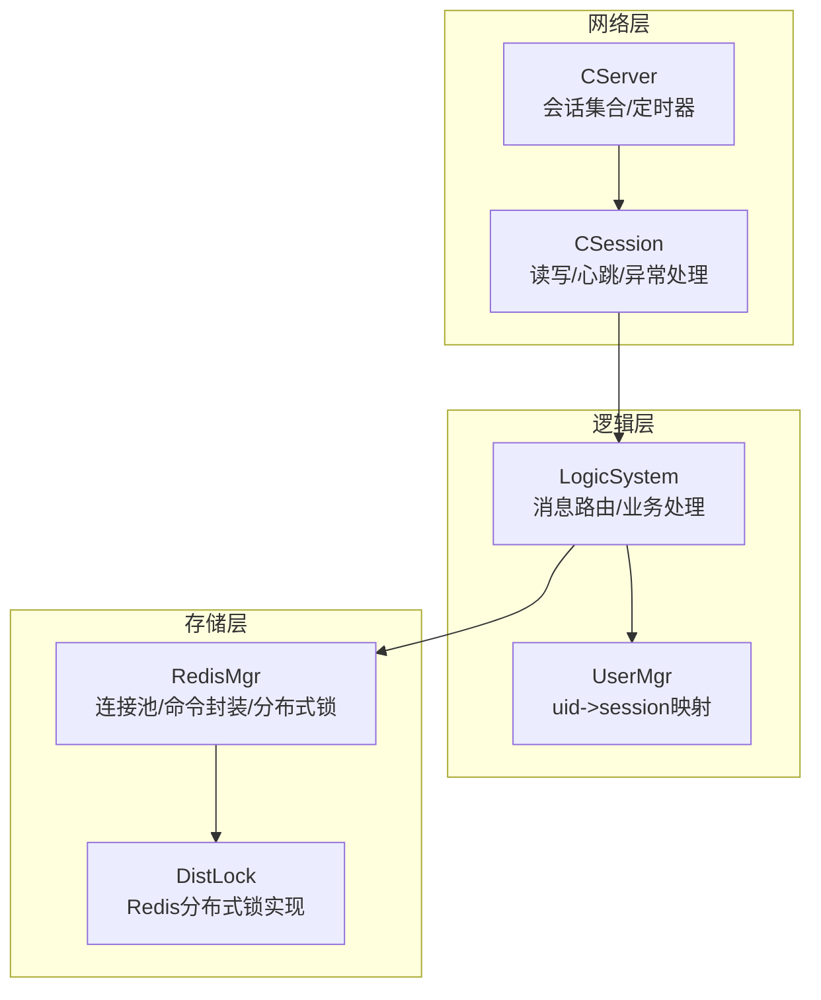
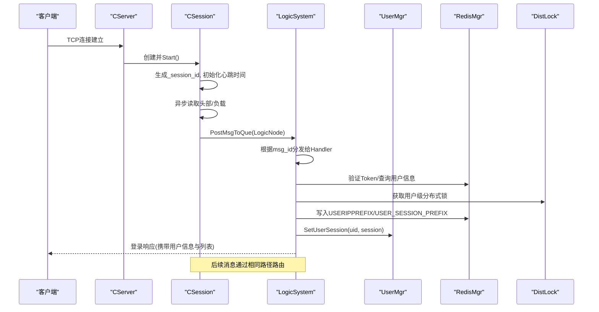
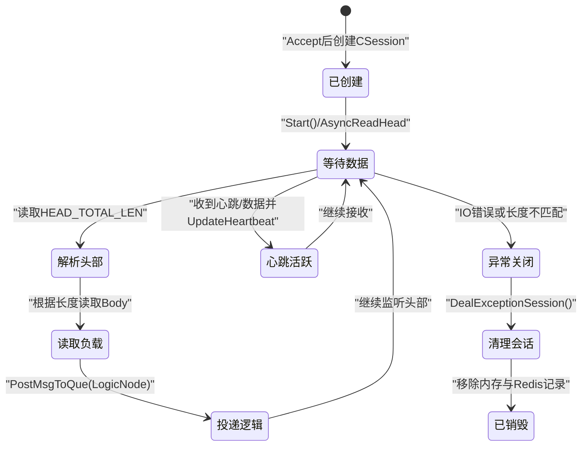
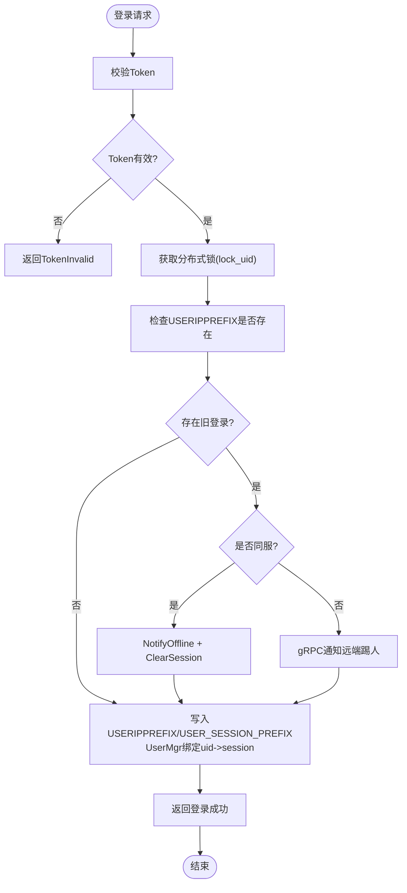
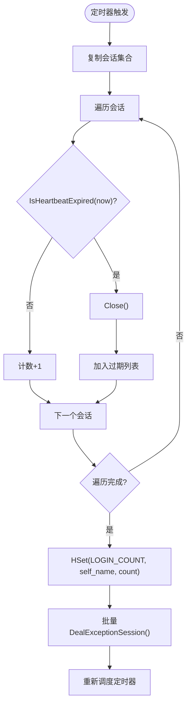
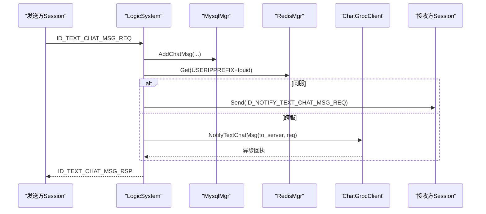
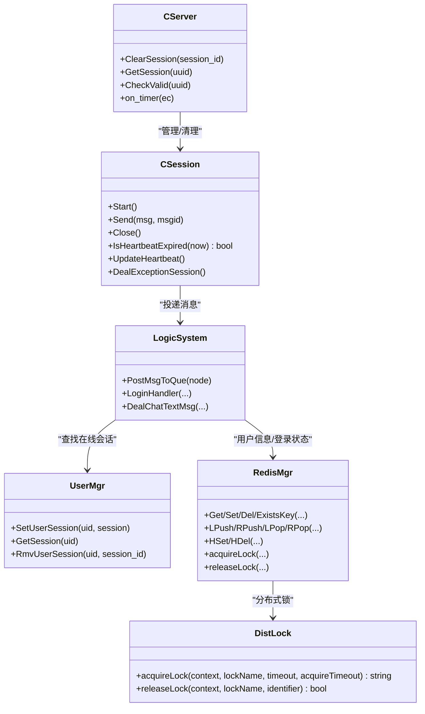

# 会话管理

<cite>
**本文引用的文件**   
- [CSession.h](file://server/ChatServer/include/CSession.h)
- [CSession.cpp](file://server/ChatServer/src/CSession.cpp)
- [RedisMgr.h](file://server/ChatServer/include/RedisMgr.h)
- [RedisMgr.cpp](file://server/ChatServer/src/RedisMgr.cpp)
- [DistLock.h](file://server/ChatServer/include/DistLock.h)
- [UserMgr.h](file://server/ChatServer/include/UserMgr.h)
- [UserMgr.cpp](file://server/ChatServer/src/UserMgr.cpp)
- [LogicSystem.h](file://server/ChatServer/include/LogicSystem.h)
- [LogicSystem.cpp](file://server/ChatServer/src/LogicSystem.cpp)
- [CServer.h](file://server/ChatServer/include/CServer.h)
- [CServer.cpp](file://server/ChatServer/src/CServer.cpp)
- [const.h](file://server/ChatServer/include/const.h)
</cite>

## 目录
1. [简介](#简介)
2. [项目结构](#项目结构)
3. [核心组件](#核心组件)
4. [架构总览](#架构总览)
5. [详细组件分析](#详细组件分析)
6. [依赖分析](#依赖分析)
7. [性能考虑](#性能考虑)
8. [故障排查指南](#故障排查指南)
9. [结论](#结论)
10. [附录](#附录)

## 简介
本文件面向LLFCChat项目的会话管理机制，系统性阐述用户会话的创建、维护与销毁生命周期；深入说明基于Redis的会话存储策略、分布式锁并发控制、多设备登录管理与踢人机制；覆盖会话安全策略（会话固定攻击防护、会话劫持检测、超时清理）；并提供会话状态转换图与并发访问控制流程图，给出性能优化建议与故障恢复策略。

## 项目结构
会话相关代码集中在ChatServer模块：
- 网络会话层：CSession负责TCP连接、读写、心跳、异常处理与消息投递
- 业务逻辑层：LogicSystem负责消息路由、登录认证、好友关系、聊天消息等
- 会话与用户映射：UserMgr维护uid到session的内存映射
- 持久化与缓存：RedisMgr提供Redis连接池与原子操作（含分布式锁）
- 服务器与定时器：CServer负责Accept、会话集合管理、定时心跳过期清理
- 常量与协议：const.h定义错误码、消息ID、键名前缀、锁超时等

**图示来源** 
- [CServer.h:1-33](file://server/ChatServer/include/CServer.h#L1-L33)
- [CServer.cpp:1-133](file://server/ChatServer/src/CServer.cpp#L1-L133)
- [CSession.h:1-86](file://server/ChatServer/include/CSession.h#L1-L86)
- [CSession.cpp:1-338](file://server/ChatServer/src/CSession.cpp#L1-L338)
- [LogicSystem.h:1-61](file://server/ChatServer/include/LogicSystem.h#L1-L61)
- [LogicSystem.cpp:1-800](file://server/ChatServer/src/LogicSystem.cpp#L1-L800)
- [UserMgr.h:1-22](file://server/ChatServer/include/UserMgr.h#L1-L22)
- [UserMgr.cpp:1-50](file://server/ChatServer/src/UserMgr.cpp#L1-L50)
- [RedisMgr.h:1-305](file://server/ChatServer/include/RedisMgr.h#L1-L305)
- [RedisMgr.cpp:1-462](file://server/ChatServer/src/RedisMgr.cpp#L1-L462)
- [DistLock.h:1-18](file://server/ChatServer/include/DistLock.h#L1-L18)

**章节来源**
- [CServer.h:1-33](file://server/ChatServer/include/CServer.h#L1-L33)
- [CServer.cpp:1-133](file://server/ChatServer/src/CServer.cpp#L1-L133)
- [CSession.h:1-86](file://server/ChatServer/include/CSession.h#L1-L86)
- [CSession.cpp:1-338](file://server/ChatServer/src/CSession.cpp#L1-L338)
- [LogicSystem.h:1-61](file://server/ChatServer/include/LogicSystem.h#L1-L61)
- [LogicSystem.cpp:1-800](file://server/ChatServer/src/LogicSystem.cpp#L1-L800)
- [UserMgr.h:1-22](file://server/ChatServer/include/UserMgr.h#L1-L22)
- [UserMgr.cpp:1-50](file://server/ChatServer/src/UserMgr.cpp#L1-L50)
- [RedisMgr.h:1-305](file://server/ChatServer/include/RedisMgr.h#L1-L305)
- [RedisMgr.cpp:1-462](file://server/ChatServer/src/RedisMgr.cpp#L1-L462)
- [DistLock.h:1-18](file://server/ChatServer/include/DistLock.h#L1-L18)

## 核心组件
- CSession：封装单个TCP连接的读写、心跳、发送队列、异常处理；维护_session_id、_user_uid、_last_heartbeat等关键状态
- LogicSystem：单例消息处理器，维护回调表，按msg_id分发到具体业务Handler；包含登录、搜索、好友申请、文本/图片聊天、心跳等
- UserMgr：维护uid到shared_ptr<CSession>的内存映射，支持设置、查询、移除（含session_id一致性校验）
- RedisMgr：封装hiredis连接池、常用命令（GET/SET/LPUSH/RPUSH/HSET/HDEL/DEL/EXISTS）、分布式锁acquire/release、服务计数统计
- DistLock：基于Redis的分布式锁接口（获取与释放），配合标识符保证幂等释放
- CServer：Accept循环、会话集合管理、定时器周期扫描心跳过期并触发清理流程

**章节来源**
- [CSession.h:1-86](file://server/ChatServer/include/CSession.h#L1-L86)
- [CSession.cpp:1-338](file://server/ChatServer/src/CSession.cpp#L1-L338)
- [LogicSystem.h:1-61](file://server/ChatServer/include/LogicSystem.h#L1-L61)
- [LogicSystem.cpp:1-800](file://server/ChatServer/src/LogicSystem.cpp#L1-L800)
- [UserMgr.h:1-22](file://server/ChatServer/include/UserMgr.h#L1-L22)
- [UserMgr.cpp:1-50](file://server/ChatServer/src/UserMgr.cpp#L1-L50)
- [RedisMgr.h:1-305](file://server/ChatServer/include/RedisMgr.h#L1-L305)
- [RedisMgr.cpp:1-462](file://server/ChatServer/src/RedisMgr.cpp#L1-L462)
- [DistLock.h:1-18](file://server/ChatServer/include/DistLock.h#L1-L18)
- [CServer.h:1-33](file://server/ChatServer/include/CServer.h#L1-L33)
- [CServer.cpp:1-133](file://server/ChatServer/src/CServer.cpp#L1-L133)

## 架构总览
下图展示从客户端连接到登录、在线状态维护、消息路由与跨服通知的整体流程。

**图示来源** 
- [CServer.cpp:21-38](file://server/ChatServer/src/CServer.cpp#L21-L38)
- [CSession.cpp:13-44](file://server/ChatServer/src/CSession.cpp#L13-L44)
- [LogicSystem.cpp:116-254](file://server/ChatServer/src/LogicSystem.cpp#L116-L254)
- [RedisMgr.cpp:362-393](file://server/ChatServer/src/RedisMgr.cpp#L362-L393)
- [DistLock.h:1-18](file://server/ChatServer/include/DistLock.h#L1-L18)
- [UserMgr.cpp:21-25](file://server/ChatServer/src/UserMgr.cpp#L21-L25)

## 详细组件分析

### 会话生命周期与状态转换
- 创建：CServer::HandleAccept创建CSession，分配随机_session_id，启动AsyncReadHead
- 活跃：CSession持续异步读头/体，更新_last_heartbeat，投递到LogicSystem队列
- 心跳：客户端周期性发送心跳，服务端回复并更新时间；定时器每分钟扫描，超过阈值则Close并进入异常清理
- 销毁：网络异常或心跳过期触发DealExceptionSession，清理Redis中的会话、IP、Token记录，并从UserMgr与CServer会话集合中移除

**图示来源** 
- [CServer.cpp:21-38](file://server/ChatServer/src/CServer.cpp#L21-L38)
- [CSession.cpp:133-194](file://server/ChatServer/src/CSession.cpp#L133-L194)
- [CSession.cpp:288-336](file://server/ChatServer/src/CSession.cpp#L288-L336)
- [CServer.cpp:75-118](file://server/ChatServer/src/CServer.cpp#L75-L118)

**章节来源**
- [CServer.cpp:21-38](file://server/ChatServer/src/CServer.cpp#L21-L38)
- [CSession.cpp:133-194](file://server/ChatServer/src/CSession.cpp#L133-L194)
- [CSession.cpp:288-336](file://server/ChatServer/src/CSession.cpp#L288-L336)
- [CServer.cpp:75-118](file://server/ChatServer/src/CServer.cpp#L75-L118)

### 登录与会话绑定（多设备与踢人）
- 登录流程：
  - 校验Token（Redis中USERTOKENPREFIX）
  - 使用分布式锁LOCK_PREFIX+uid保护登录临界区
  - 若已有登录记录（USERIPPREFIX），判断是否同服：同服直接NotifyOffline并ClearSession；跨服通过gRPC通知对方踢人
  - 写入当前服务器名到USERIPPREFIX，写入_session_id到USER_SESSION_PREFIX
  - 在UserMgr中绑定uid->session
- 多设备登录：
  - 新登录会覆盖旧登录记录，旧连接被踢下线，确保同一用户仅一个活跃会话
- 会话失效清理：
  - DealExceptionSession再次校验Redis中usession是否一致，不一致则视为异地登录，清理本地会话、IP、Token

**图示来源** 
- [LogicSystem.cpp:116-254](file://server/ChatServer/src/LogicSystem.cpp#L116-L254)
- [RedisMgr.cpp:362-393](file://server/ChatServer/src/RedisMgr.cpp#L362-L393)
- [UserMgr.cpp:21-25](file://server/ChatServer/src/UserMgr.cpp#L21-L25)
- [CSession.cpp:253-264](file://server/ChatServer/src/CSession.cpp#L253-L264)

**章节来源**
- [LogicSystem.cpp:116-254](file://server/ChatServer/src/LogicSystem.cpp#L116-L254)
- [RedisMgr.cpp:362-393](file://server/ChatServer/src/RedisMgr.cpp#L362-L393)
- [UserMgr.cpp:21-25](file://server/ChatServer/src/UserMgr.cpp#L21-L25)
- [CSession.cpp:253-264](file://server/ChatServer/src/CSession.cpp#L253-L264)

### Redis会话存储策略
- 键空间设计：
  - USER_SESSION_PREFIX + uid -> session_id（用于校验会话归属）
  - USERIPPREFIX + uid -> server_name（标记当前登录服务器）
  - USERTOKENPREFIX + uid -> token（登录凭证）
  - LOGIN_COUNT -> {server_name: count}（每服在线数统计）
- 操作封装：
  - GET/SET/DEL/EXISTS用于基础KV
  - HSET/HDEL用于LOGIN_COUNT计数
  - LPush/RPush/LPop/RPop用于队列场景（可扩展）
- 连接池与健康检查：
  - RedisConPool维护固定大小连接，后台线程定期PING检测存活，失败自动重建
  - 非阻塞取连接getConNonBlock用于健康检查，避免阻塞业务

**章节来源**
- [RedisMgr.h:267-305](file://server/ChatServer/include/RedisMgr.h#L267-L305)
- [RedisMgr.cpp:1-11](file://server/ChatServer/src/RedisMgr.cpp#L1-L11)
- [RedisMgr.cpp:19-79](file://server/ChatServer/src/RedisMgr.cpp#L19-L79)
- [RedisMgr.cpp:81-184](file://server/ChatServer/src/RedisMgr.cpp#L81-L184)
- [RedisMgr.cpp:186-245](file://server/ChatServer/src/RedisMgr.cpp#L186-L245)
- [RedisMgr.cpp:247-307](file://server/ChatServer/src/RedisMgr.cpp#L247-L307)
- [RedisMgr.cpp:309-359](file://server/ChatServer/src/RedisMgr.cpp#L309-L359)
- [RedisMgr.cpp:395-462](file://server/ChatServer/src/RedisMgr.cpp#L395-L462)

### 并发控制与分布式锁
- 用户级锁：LOCK_PREFIX + uid，防止并发登录/踢人竞态
- 计数锁：LOCK_COUNT，保护LOGIN_COUNT的增减
- 锁获取与释放：
  - acquireLock：带超时重试，返回唯一identifier
  - releaseLock：基于identifier幂等释放，避免误删他人锁
- 使用模式：
  - 登录/踢人/计数等关键路径均先acquireLock，再执行业务，最后releaseLock
  - 借助Defer确保异常路径也能释放锁

**章节来源**
- [RedisMgr.cpp:362-393](file://server/ChatServer/src/RedisMgr.cpp#L362-L393)
- [RedisMgr.cpp:395-462](file://server/ChatServer/src/RedisMgr.cpp#L395-L462)
- [DistLock.h:1-18](file://server/ChatServer/include/DistLock.h#L1-L18)
- [const.h:87-94](file://server/ChatServer/include/const.h#L87-L94)

### 心跳与超时清理
- 心跳更新：每次收到数据或心跳请求时调用UpdateHeartbeat
- 过期判定：IsHeartbeatExpired比较_last_heartbeat与当前时间差，阈值约20秒
- 清理流程：定时器每分钟遍历会话副本，对过期会话Close并收集，统一调用DealExceptionSession进行清理

**图示来源** 
- [CServer.cpp:75-118](file://server/ChatServer/src/CServer.cpp#L75-L118)
- [CSession.cpp:288-302](file://server/ChatServer/src/CSession.cpp#L288-L302)

**章节来源**
- [CServer.cpp:75-118](file://server/ChatServer/src/CServer.cpp#L75-L118)
- [CSession.cpp:288-302](file://server/ChatServer/src/CSession.cpp#L288-L302)

### 多用户在线协调与消息路由
- 消息路由：CSession将RecvNode投递到LogicSystem队列，由单线程消费者按msg_id分发到对应Handler
- 在线推送：
  - 同服：通过UserMgr.GetSession直接Send
  - 跨服：通过ChatGrpcClient转发到目标服务器
- 文本/图片聊天：插入数据库后，构造响应回发发送方，并推送给接收方（同服或跨服）

**图示来源** 
- [LogicSystem.cpp:480-576](file://server/ChatServer/src/LogicSystem.cpp#L480-L576)
- [RedisMgr.cpp:19-46](file://server/ChatServer/src/RedisMgr.cpp#L19-L46)

**章节来源**
- [LogicSystem.cpp:480-576](file://server/ChatServer/src/LogicSystem.cpp#L480-L576)
- [RedisMgr.cpp:19-46](file://server/ChatServer/src/RedisMgr.cpp#L19-L46)

## 依赖分析
- CSession依赖CServer（会话有效性检查、清理）、LogicSystem（消息投递）、RedisMgr（分布式锁、会话状态）
- LogicSystem依赖UserMgr（在线会话查找）、RedisMgr（用户信息、登录状态、计数）、MysqlMgr（持久化）、ChatGrpcClient（跨服通知）
- RedisMgr依赖DistLock（分布式锁实现）
- CServer依赖UserMgr（清理关联）、RedisMgr（计数统计）

**图示来源** 
- [CServer.h:1-33](file://server/ChatServer/include/CServer.h#L1-L33)
- [CSession.h:1-86](file://server/ChatServer/include/CSession.h#L1-L86)
- [LogicSystem.h:1-61](file://server/ChatServer/include/LogicSystem.h#L1-L61)
- [UserMgr.h:1-22](file://server/ChatServer/include/UserMgr.h#L1-L22)
- [RedisMgr.h:1-305](file://server/ChatServer/include/RedisMgr.h#L1-L305)
- [DistLock.h:1-18](file://server/ChatServer/include/DistLock.h#L1-L18)

**章节来源**
- [CServer.h:1-33](file://server/ChatServer/include/CServer.h#L1-L33)
- [CSession.h:1-86](file://server/ChatServer/include/CSession.h#L1-L86)
- [LogicSystem.h:1-61](file://server/ChatServer/include/LogicSystem.h#L1-L61)
- [UserMgr.h:1-22](file://server/ChatServer/include/UserMgr.h#L1-L22)
- [RedisMgr.h:1-305](file://server/ChatServer/include/RedisMgr.h#L1-L305)
- [DistLock.h:1-18](file://server/ChatServer/include/DistLock.h#L1-L18)

## 性能考虑
- 连接池与I/O
  - Redis连接池复用连接，减少握手开销；后台PING保活，失败自动重建
  - CSession采用异步读写与发送队列，避免阻塞；发送队列上限MAX_SENDQUE防拥塞
- 锁粒度与热点
  - 用户级锁降低冲突面；计数锁隔离统计热点
  - 登录流程加锁范围尽量小，避免长事务
- 缓存策略
  - 用户基础信息优先查Redis，未命中再落库并回填，降低DB压力
- 定时器与清理
  - 定时器批量复制会话集合后再遍历，避免持有大锁过久；过期会话集中清理，减少抖动
- 扩展建议
  - 可引入消息去重与限流（如unique_id）
  - 对高频键（如LOGIN_COUNT）做本地计数+周期性同步，降低Redis竞争

[本节为通用性能指导，不直接分析具体文件]

## 故障排查指南
- 连接异常
  - 现象：read/write错误导致Close与异常清理
  - 排查：查看CSession::HandleWrite与AsyncRead*的错误分支日志
- 心跳过期
  - 现象：定时器检测到_isExpired=true，触发Close与清理
  - 排查：确认客户端心跳频率与IsHeartbeatExpired阈值匹配
- 登录失败
  - 现象：Token无效或用户不存在
  - 排查：检查Redis中USERTOKENPREFIX与用户基础信息键
- 多设备冲突
  - 现象：旧连接被踢出
  - 排查：确认USERIPPREFIX与USER_SESSION_PREFIX更新顺序与分布式锁生效
- Redis不可用
  - 现象：连接池无可用连接或PING失败
  - 排查：观察RedisConPool后台检查线程与reconnect逻辑

**章节来源**
- [CSession.cpp:196-220](file://server/ChatServer/src/CSession.cpp#L196-L220)
- [CSession.cpp:288-336](file://server/ChatServer/src/CSession.cpp#L288-L336)
- [CServer.cpp:75-118](file://server/ChatServer/src/CServer.cpp#L75-L118)
- [LogicSystem.cpp:116-156](file://server/ChatServer/src/LogicSystem.cpp#L116-L156)
- [RedisMgr.cpp:137-206](file://server/ChatServer/src/RedisMgr.cpp#L137-L206)

## 结论
LLFCChat的会话管理以CSession为核心，结合LogicSystem的消息路由、UserMgr的在线映射、RedisMgr的缓存与分布式锁、以及CServer的定时器清理，形成完整的会话生命周期闭环。通过用户级分布式锁与严格的键空间设计，实现了多设备登录互斥、会话固定攻击防护与劫持检测。系统具备高并发与可扩展性，建议在热点键与消息路由上进一步优化，以提升整体吞吐与稳定性。

[本节为总结性内容，不直接分析具体文件]

## 附录
- 键命名规范
  - USER_SESSION_PREFIX + uid -> session_id
  - USERIPPREFIX + uid -> server_name
  - USERTOKENPREFIX + uid -> token
  - LOGIN_COUNT -> {server_name: count}
- 常量参考
  - HEAD_TOTAL_LEN/HEAD_ID_LEN/HEAD_DATA_LEN：协议头部长度
  - MAX_LENGTH/MAX_RECVQUE/MAX_SENDQUE：缓冲与队列上限
  - LOCK_TIME_OUT/ACQUIRE_TIME_OUT：分布式锁超时参数
  - MSG_IDS：消息类型枚举

**章节来源**
- [const.h:38-94](file://server/ChatServer/include/const.h#L38-L94)