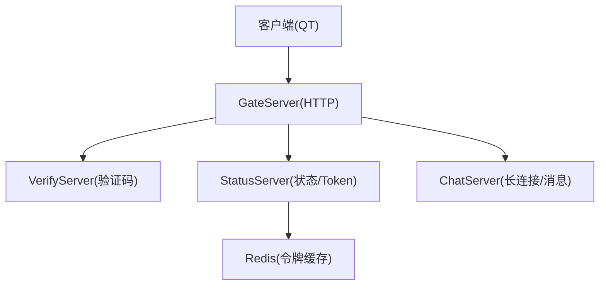
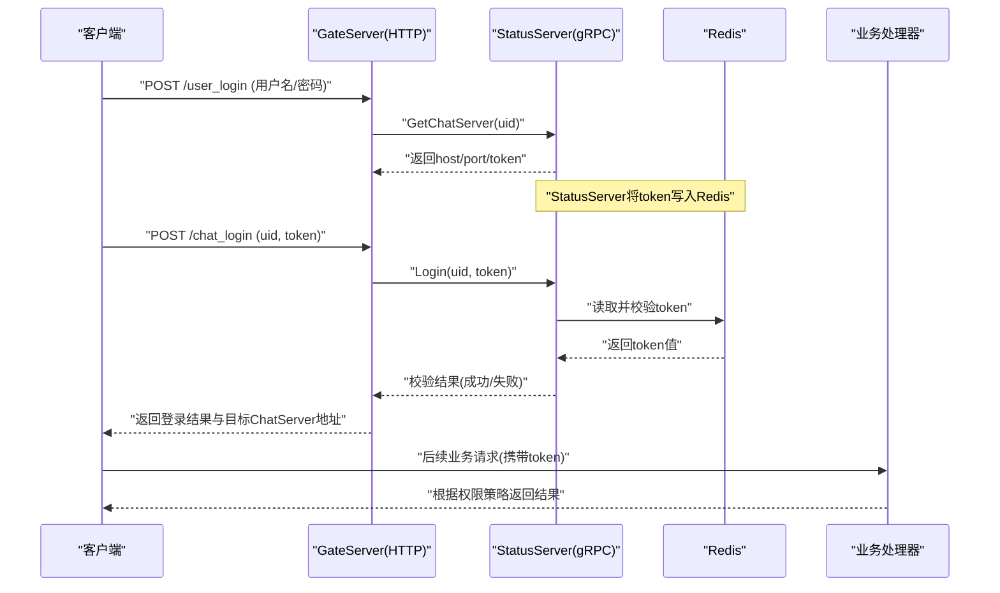
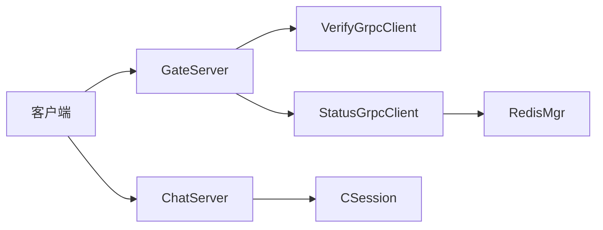
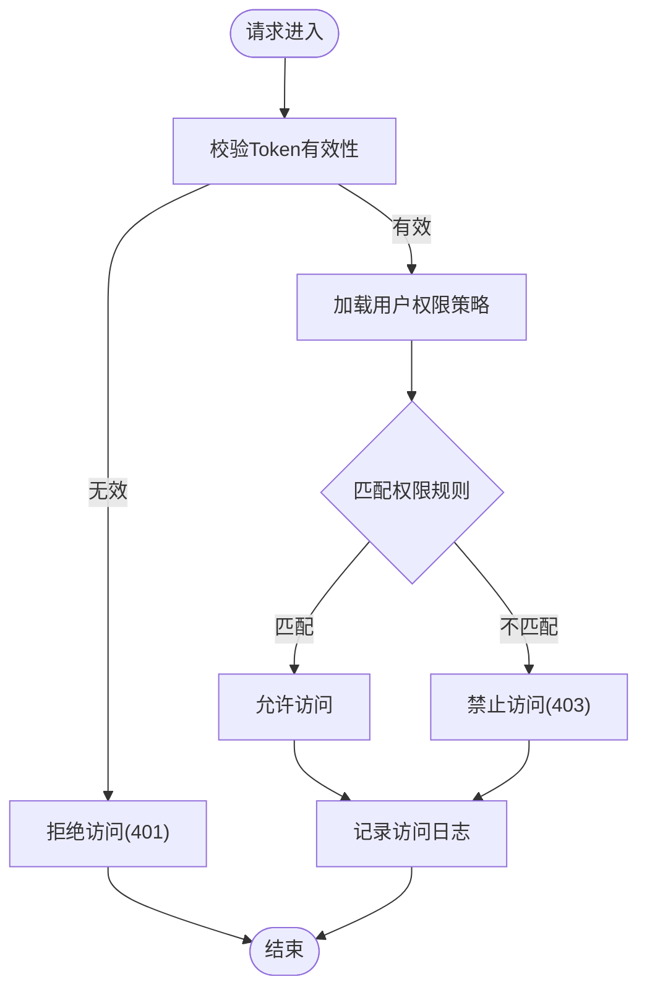

# 权限控制

<cite>
**本文引用的文件**   
- [HttpConnection.h](file://server/GateServer/include/HttpConnection.h)
- [HttpConnection.cpp](file://server/GateServer/src/HttpConnection.cpp)
- [StatusServiceImpl.h](file://server/StatusServer/include/StatusServiceImpl.h)
- [StatusServiceImpl.cpp](file://server/StatusServer/src/StatusServiceImpl.cpp)
- [VerifyGrpcClient.cpp](file://server/GateServer/src/VerifyGrpcClient.cpp)
- [CSession.h](file://server/ChatServer/include/CSession.h)
- [global.h](file://client/llfcchat/include/global.h)
- [authenfriend.cpp](file://client/llfcchat/src/authenfriend.cpp)
- [day17-登录服务验证和客户端数据管理.md](file://开发文档/day17-登录服务验证和客户端数据管理.md)
- [day29-好友认证和聊天通信.md](file://开发文档/day29-好友认证和聊天通信.md)
</cite>

## 目录
1. [引言](#引言)
2. [项目结构](#项目结构)
3. [核心组件](#核心组件)
4. [架构总览](#架构总览)
5. [详细组件分析](#详细组件分析)
6. [依赖关系分析](#依赖关系分析)
7. [性能考虑](#性能考虑)
8. [故障排查指南](#故障排查指南)
9. [结论](#结论)
10. [附录](#附录)

## 引言
本文件面向LLFCChat项目的权限控制机制，聚焦于角色定义、权限分配、API访问控制等细粒度权限管理的实现。当前代码库已具备基于令牌（Token）的会话认证与状态校验能力，并围绕GateServer、StatusServer、ChatServer、VerifyServer等组件形成完整的请求处理链路。本文将在此基础上：
- 梳理现有认证流程与令牌生命周期
- 设计并说明基于角色的访问控制（RBAC）模型扩展方案
- 给出权限验证中间件的设计思路（请求拦截、权限匹配、访问日志记录）
- 提供权限决策流程图与API保护示例
- 阐述权限扩展机制与自定义权限规则的实现方法

注意：当前仓库中尚未发现显式的“角色-权限”表或通用鉴权中间件实现，因此本文在尊重现有实现的基础上，提出可落地的扩展设计与集成点。

## 项目结构
从权限相关视角看，关键目录与文件如下：
- GateServer：HTTP入口，负责路由分发、参数解析、调用内部服务（如验证码、状态服务）
- StatusServer：状态与调度服务，负责生成与校验Token、选择ChatServer实例
- ChatServer：长连接服务，维护会话、心跳、消息转发
- VerifyServer：验证码服务（Redis缓存），GateServer通过gRPC调用
- 客户端：Qt界面，发起HTTP/TCP/gRPC请求，维护本地用户上下文与会话信息

图表来源
- [HttpConnection.cpp:133-194](file://server/GateServer/src/HttpConnection.cpp#L133-L194)
- [StatusServiceImpl.cpp:17-27](file://server/StatusServer/src/StatusServiceImpl.cpp#L17-L27)
- [VerifyGrpcClient.cpp:1-9](file://server/GateServer/src/VerifyGrpcClient.cpp#L1-L9)
- [CSession.h:28-76](file://server/ChatServer/include/CSession.h#L28-L76)

章节来源
- [HttpConnection.h:1-36](file://server/GateServer/include/HttpConnection.h#L1-L36)
- [HttpConnection.cpp:133-194](file://server/GateServer/src/HttpConnection.cpp#L133-L194)
- [StatusServiceImpl.h:36-50](file://server/StatusServer/include/StatusServiceImpl.h#L36-L50)
- [StatusServiceImpl.cpp:17-27](file://server/StatusServer/src/StatusServiceImpl.cpp#L17-L27)
- [VerifyGrpcClient.cpp:1-9](file://server/GateServer/src/VerifyGrpcClient.cpp#L1-L9)
- [CSession.h:28-76](file://server/ChatServer/include/CSession.h#L28-L76)

## 核心组件
- HTTP网关（GateServer）
  - 负责接收HTTP请求，解析URL与参数，路由到具体业务处理器
  - 作为统一入口，适合在此处接入统一的鉴权中间件（请求拦截、权限匹配、访问日志）
- 状态服务（StatusServer）
  - 生成并下发Token，并在后续登录校验时比对Token有效性
  - 使用Redis存储Token映射，支持分布式环境下的令牌校验
- 聊天服务（ChatServer）
  - 维护TCP长连接与会话（CSession），包含心跳检测、离线通知、消息收发
  - 可在会话层进行二次鉴权（例如按资源维度限制操作）
- 验证码服务（VerifyServer）
  - 通过Redis缓存验证码，GateServer通过gRPC调用获取验证码
- 客户端（Qt）
  - 维护用户ID、Token、服务器信息等上下文；发起注册、登录、好友申请、聊天等操作

章节来源
- [HttpConnection.cpp:133-194](file://server/GateServer/src/HttpConnection.cpp#L133-L194)
- [StatusServiceImpl.cpp:94-116](file://server/StatusServer/src/StatusServiceImpl.cpp#L94-L116)
- [CSession.h:28-76](file://server/ChatServer/include/CSession.h#L28-L76)
- [VerifyGrpcClient.cpp:1-9](file://server/GateServer/src/VerifyGrpcClient.cpp#L1-L9)
- [global.h:122-135](file://client/llfcchat/include/global.h#L122-L135)

## 架构总览
下图展示从客户端请求到权限验证的完整链路，包括HTTP入口、状态服务Token校验、以及后续的业务处理。

图表来源
- [day17-登录服务验证和客户端数据管理.md:66-104](file://开发文档/day17-登录服务验证和客户端数据管理.md#L66-L104)
- [StatusServiceImpl.cpp:94-116](file://server/StatusServer/src/StatusServiceImpl.cpp#L94-L116)
- [HttpConnection.cpp:133-194](file://server/GateServer/src/HttpConnection.cpp#L133-L194)

## 详细组件分析

### HTTP网关与请求拦截（GateServer）
- 功能要点
  - 解析GET/POST请求，提取URL路径与查询参数
  - 路由到LogicSystem的具体处理器
  - 可作为统一鉴权中间件的接入点：在HandleReq前后插入鉴权逻辑
- 建议的鉴权中间件设计
  - 请求拦截：在HandleReq入口处检查请求是否携带有效Token
  - 权限匹配：根据URL路径与方法，结合RBAC策略判断是否允许访问
  - 访问日志：记录请求时间、IP、UID、URL、方法、结果等
- 集成位置
  - 在HttpConnection::HandleReq中，对每个请求执行鉴权前置检查
  - 若鉴权失败，直接返回401/403响应，避免进入业务处理器

章节来源
- [HttpConnection.cpp:133-194](file://server/GateServer/src/HttpConnection.cpp#L133-L194)
- [HttpConnection.h:1-36](file://server/GateServer/include/HttpConnection.h#L1-L36)

### 状态服务与Token校验（StatusServer）
- 功能要点
  - GetChatServer：为指定uid生成唯一token，并写入Redis
  - Login：校验客户端提交的uid与token是否与Redis中一致
- 安全特性
  - Token一次性绑定uid，防止重放攻击
  - 分布式环境下通过Redis共享Token状态
- 错误码
  - UidInvalid：用户不存在或无效
  - TokenInvalid：Token不匹配或过期

章节来源
- [StatusServiceImpl.cpp:17-27](file://server/StatusServer/src/StatusServiceImpl.cpp#L17-L27)
- [StatusServiceImpl.cpp:94-116](file://server/StatusServer/src/StatusServiceImpl.cpp#L94-L116)
- [day17-登录服务验证和客户端数据管理.md:66-104](file://开发文档/day17-登录服务验证和客户端数据管理.md#L66-L104)

### 聊天会话与会话级鉴权（ChatServer）
- 功能要点
  - CSession维护会话ID、用户ID、心跳时间戳
  - 支持心跳过期检测、异常连接处理、消息异步发送
- 会话级鉴权建议
  - 在建立连接时校验Token，绑定uid到session
  - 在消息处理前校验会话有效性（心跳、超时）
  - 针对敏感操作（如删除消息、修改资料）增加二次鉴权

章节来源
- [CSession.h:28-76](file://server/ChatServer/include/CSession.h#L28-L76)

### 客户端上下文与权限标识
- 功能要点
  - global.h定义了请求ID、错误码、传输状态、聊天类型等枚举
  - ServerInfo结构体保存uid、token、ChatServer地址等信息
- 权限相关建议
  - 客户端在每次请求时携带uid与token
  - 根据服务端返回的权限策略动态控制UI元素可见性

章节来源
- [global.h:43-88](file://client/llfcchat/include/global.h#L43-L88)
- [global.h:122-135](file://client/llfcchat/include/global.h#L122-L135)

### 好友认证流程中的权限控制
- 功能要点
  - 客户端发送认证请求（ID_AUTH_FRIEND_REQ），包含fromuid与touid
  - 服务器侧通过gRPC通知对方，完成好友关系建立
- 权限控制建议
  - 在认证请求处理前，校验双方是否为好友或允许申请
  - 记录认证日志，便于审计与风控

章节来源
- [authenfriend.cpp:412-436](file://client/llfcchat/src/authenfriend.cpp#L412-L436)
- [day29-好友认证和聊天通信.md:100-139](file://开发文档/day29-好友认证和聊天通信.md#L100-L139)

## 依赖关系分析
- GateServer依赖
  - VerifyGrpcClient：调用验证码服务
  - StatusGrpcClient：调用状态服务获取ChatServer与Token
- StatusServer依赖
  - RedisMgr：读写Token缓存
- ChatServer依赖
  - CSession：会话管理与心跳
- 客户端依赖
  - HttpMgr/TcpMgr：HTTP与TCP通信
  - UserMgr：用户信息与好友关系管理

图表来源
- [VerifyGrpcClient.cpp:1-9](file://server/GateServer/src/VerifyGrpcClient.cpp#L1-L9)
- [StatusServiceImpl.cpp:118-123](file://server/StatusServer/src/StatusServiceImpl.cpp#L118-L123)
- [CSession.h:28-76](file://server/ChatServer/include/CSession.h#L28-L76)

章节来源
- [VerifyGrpcClient.cpp:1-9](file://server/GateServer/src/VerifyGrpcClient.cpp#L1-L9)
- [StatusServiceImpl.cpp:118-123](file://server/StatusServer/src/StatusServiceImpl.cpp#L118-L123)
- [CSession.h:28-76](file://server/ChatServer/include/CSession.h#L28-L76)

## 性能考虑
- Token校验
  - 使用Redis缓存Token，减少数据库压力
  - 建议设置合理的过期时间与刷新策略
- 请求处理
  - 在GateServer层进行快速失败（鉴权失败立即返回）
  - 避免在高频路径上进行复杂计算
- 会话管理
  - 心跳间隔与超时阈值需平衡实时性与资源占用
  - 定期清理过期会话，释放内存与连接资源

## 故障排查指南
- 常见问题
  - Token无效：检查StatusServer是否正确写入Redis，客户端是否传递正确的uid与token
  - 登录失败：确认GateServer是否正确调用StatusServer的Login接口
  - 会话断开：检查心跳是否正常更新，是否存在网络波动或服务重启
- 排查步骤
  - 查看GateServer日志，确认请求是否到达及路由是否正确
  - 检查StatusServer的Redis键值，确认Token是否存在且匹配
  - 检查ChatServer的心跳逻辑，确认会话是否活跃

章节来源
- [StatusServiceImpl.cpp:94-116](file://server/StatusServer/src/StatusServiceImpl.cpp#L94-L116)
- [HttpConnection.cpp:133-194](file://server/GateServer/src/HttpConnection.cpp#L133-L194)
- [CSession.h:46-51](file://server/ChatServer/include/CSession.h#L46-L51)

## 结论
当前LLFCChat项目已具备完善的Token认证机制与分布式状态管理能力。在此基础上，可通过在GateServer引入统一的鉴权中间件，结合RBAC模型实现细粒度的权限控制。建议在以下方面持续优化：
- 在HTTP入口集中化鉴权逻辑，提升安全性与可维护性
- 设计可扩展的RBAC模型，支持角色继承与动态权限分配
- 完善访问日志与审计功能，便于问题追踪与安全分析
- 在会话层加强二次鉴权，确保敏感操作的合法性

## 附录

### RBAC模型设计建议
- 角色定义
  - 管理员、普通用户、访客等基础角色
  - 支持角色继承（如管理员继承普通用户权限）
- 权限分配
  - 资源-操作-角色三元组（如/chat/delete -> admin）
  - 支持动态权限（基于用户属性或上下文）
- 权限检查
  - 在GateServer中间件中统一检查
  - 在ChatServer会话层进行二次校验

### 权限决策流程图

### API保护示例
- 受保护接口
  - POST /user_login：无需鉴权（登录）
  - POST /chat_login：需携带uid与token
  - GET /chat/messages：需具备chat:read权限
  - DELETE /chat/message/{id}：需具备chat:delete权限
- 鉴权逻辑
  - 在GateServer的HandleReq中插入鉴权检查
  - 根据URL路径与方法匹配RBAC策略
  - 返回401/403或继续处理