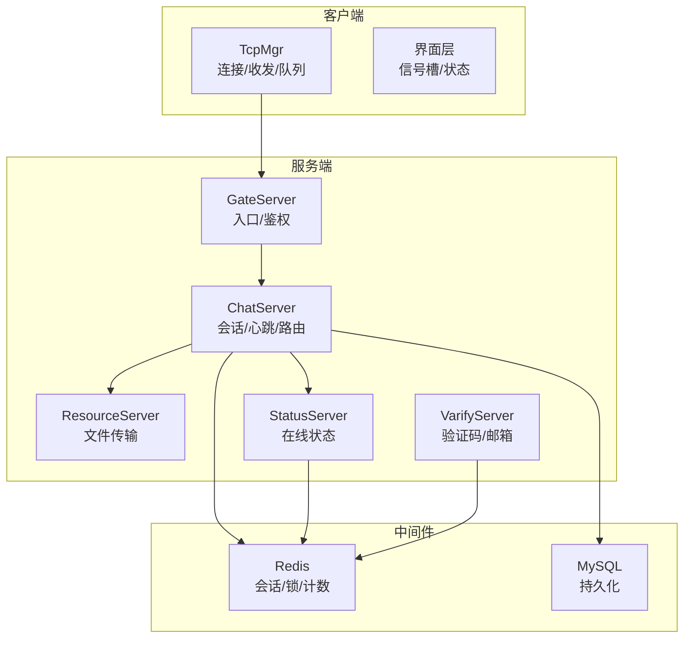
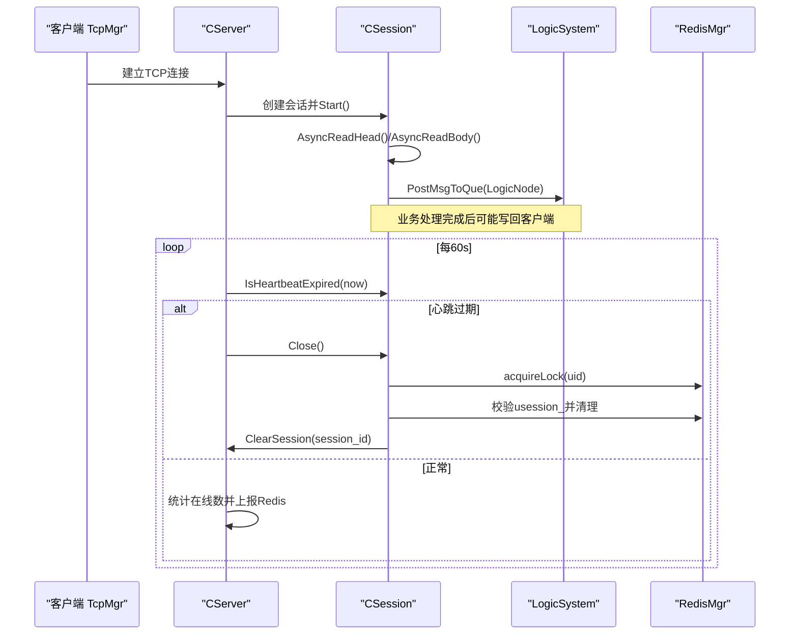
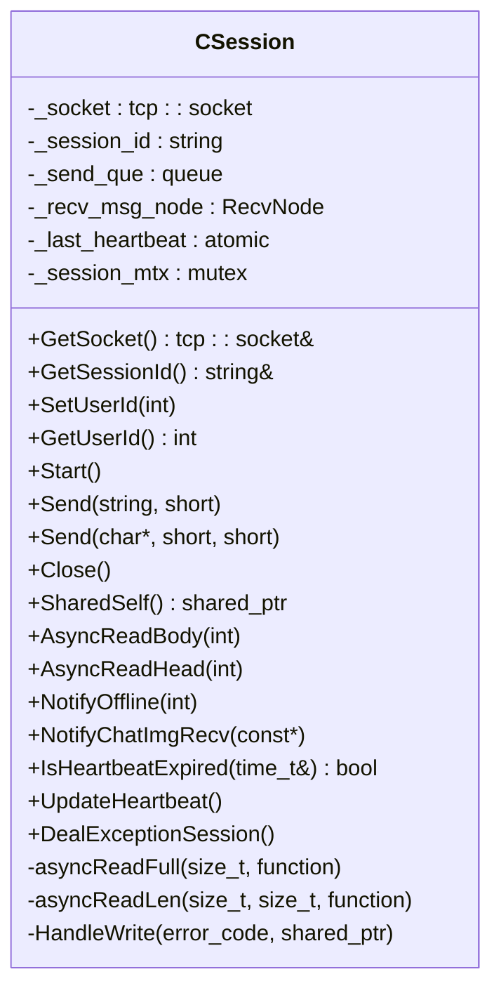
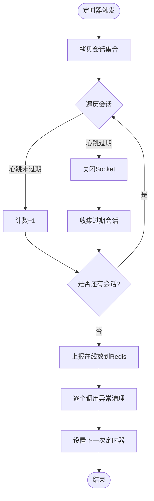
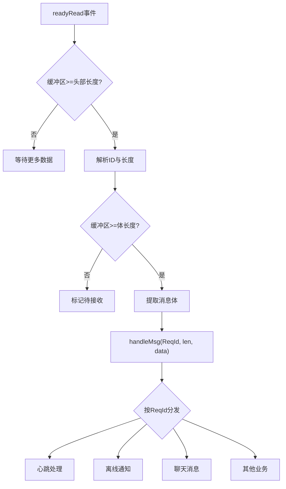
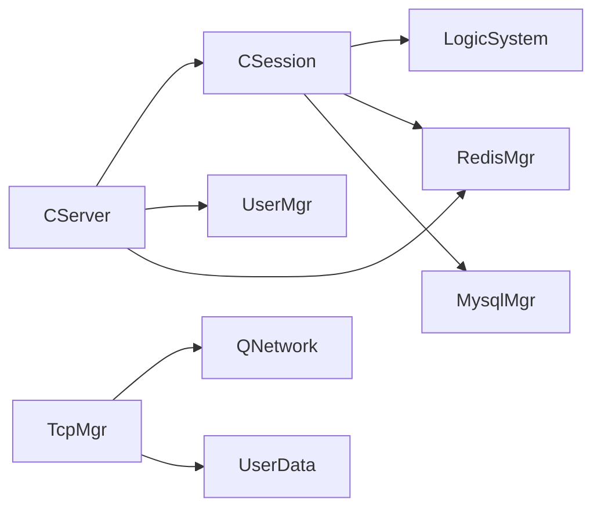
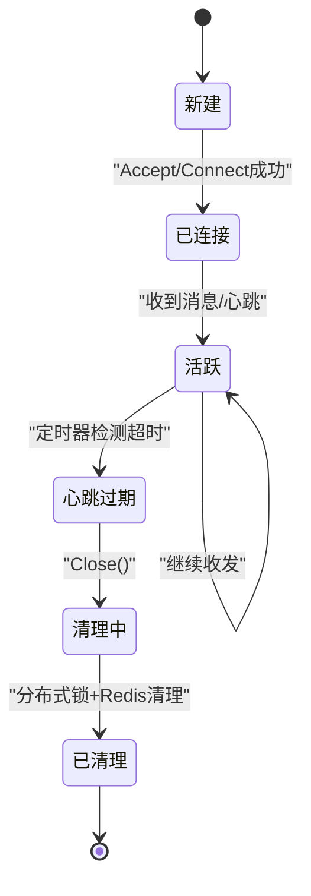
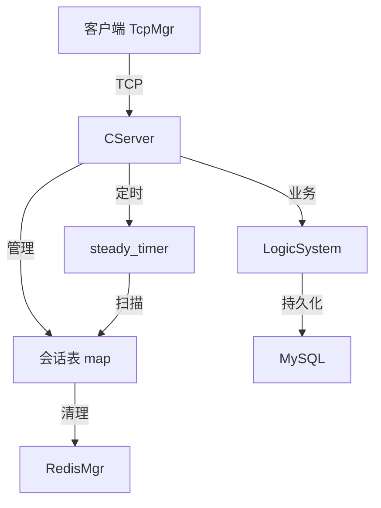
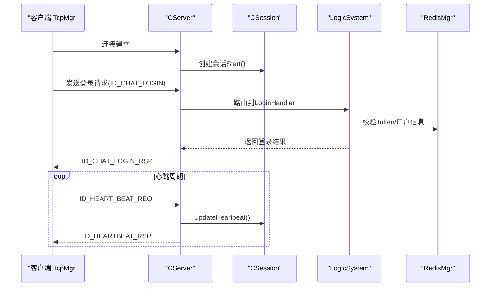

# 会话管理机制

<cite>
**本文引用的文件**   
- [CSession.h](file://server/ChatServer/include/CSession.h)
- [CSession.cpp](file://server/ChatServer/src/CSession.cpp)
- [CServer.h](file://server/ChatServer/include/CServer.h)
- [CServer.cpp](file://server/ChatServer/src/CServer.cpp)
- [RedisMgr.h](file://server/ChatServer/include/RedisMgr.h)
- [UserMgr.h](file://server/ChatServer/include/UserMgr.h)
- [UserMgr.cpp](file://server/ChatServer/src/UserMgr.cpp)
- [LogicSystem.h](file://server/ChatServer/include/LogicSystem.h)
- [const.h](file://server/ChatServer/include/const.h)
- [tcpmgr.h](file://client/llfcchat/include/tcpmgr.h)
- [tcpmgr.cpp](file://client/llfcchat/src/tcpmgr.cpp)
- [global.h](file://client/llfcchat/include/global.h)
- [userdata.h](file://client/llfcchat/include/userdata.h)
- [day35心跳逻辑.md](file://开发文档/day35心跳逻辑.md)
</cite>

## 目录
1. [引言](#引言)
2. [项目结构](#项目结构)
3. [核心组件](#核心组件)
4. [架构总览](#架构总览)
5. [详细组件分析](#详细组件分析)
6. [依赖关系分析](#依赖关系分析)
7. [性能与优化](#性能与优化)
8. [故障排查指南](#故障排查指南)
9. [结论](#结论)
10. [附录](#附录)

## 引言
本文件面向LLFCChat项目的“会话管理机制”，系统性阐述服务端与客户端在长连接下的会话生命周期、在线状态维护、连接池管理、分布式同步、缓存策略、持久化以及前端重连与心跳保活等关键能力。文档以代码级为依据，结合架构图与时序图，帮助读者从整体到细节理解会话创建、维护、销毁的完整闭环，并给出性能与安全建议及常见问题定位方法。

## 项目结构
本项目采用前后端分离的多服务架构：
- 客户端（Qt C++）：负责TCP连接、粘包处理、消息编解码、UI事件、自动重连与心跳。
- 聊天服务器（C++/Boost.Asio）：负责会话接入、读写协议、心跳检测、异常清理、业务逻辑分发。
- Redis：作为分布式锁与会话状态缓存中心。
- 其他服务（网关、资源、状态、验证等）：通过gRPC或HTTP协作完成认证、鉴权与资源管理。

图表来源
- [CServer.h:1-33](file://server/ChatServer/include/CServer.h#L1-L33)
- [CSession.h:1-86](file://server/ChatServer/include/CSession.h#L1-L86)
- [tcpmgr.h:1-90](file://client/llfcchat/include/tcpmgr.h#L1-L90)

章节来源
- [CServer.h:1-33](file://server/ChatServer/include/CServer.h#L1-L33)
- [CSession.h:1-86](file://server/ChatServer/include/CSession.h#L1-L86)
- [tcpmgr.h:1-90](file://client/llfcchat/include/tcpmgr.h#L1-L90)

## 核心组件
- 会话对象 CSession：封装单个TCP连接的读写、心跳、发送队列、异常清理。
- 会话容器 CServer：管理所有活跃会话、定时心跳扫描、会话清理。
- 用户映射 UserMgr：uid 到 session 的映射，支持踢人与跨服一致性。
- 逻辑系统 LogicSystem：消息路由、业务回调注册与处理。
- Redis管理器 RedisMgr：连接池、键值操作、分布式锁、计数统计。
- 客户端 TcpMgr：连接建立、粘包解析、消息分发、发送队列、错误处理。

章节来源
- [CSession.h:1-86](file://server/ChatServer/include/CSession.h#L1-L86)
- [CSession.cpp:1-338](file://server/ChatServer/src/CSession.cpp#L1-L338)
- [CServer.h:1-33](file://server/ChatServer/include/CServer.h#L1-L33)
- [CServer.cpp:1-133](file://server/ChatServer/src/CServer.cpp#L1-L133)
- [UserMgr.h:1-22](file://server/ChatServer/include/UserMgr.h#L1-L22)
- [UserMgr.cpp:1-50](file://server/ChatServer/src/UserMgr.cpp#L1-L50)
- [LogicSystem.h:1-61](file://server/ChatServer/include/LogicSystem.h#L1-L61)
- [RedisMgr.h:1-305](file://server/ChatServer/include/RedisMgr.h#L1-L305)
- [tcpmgr.h:1-90](file://client/llfcchat/include/tcpmgr.h#L1-L90)
- [tcpmgr.cpp:1-800](file://client/llfcchat/src/tcpmgr.cpp#L1-L800)

## 架构总览
下图展示会话从建立到销毁的关键路径，包括客户端连接、服务端接入、心跳检测、异常清理与分布式锁保护。

图表来源
- [CServer.cpp:75-118](file://server/ChatServer/src/CServer.cpp#L75-L118)
- [CSession.cpp:133-194](file://server/ChatServer/src/CSession.cpp#L133-L194)
- [CSession.cpp:288-336](file://server/ChatServer/src/CSession.cpp#L288-L336)
- [RedisMgr.h:290-299](file://server/ChatServer/include/RedisMgr.h#L290-L299)

## 详细组件分析

### 会话对象 CSession：读写、心跳与异常清理
- 职责
  - 非阻塞异步读头/体，按固定头部协议解析消息ID与长度。
  - 维护发送队列与互斥锁，保证并发安全与顺序性。
  - 记录最近心跳时间戳，提供过期判断与更新接口。
  - 异常时触发分布式锁清理流程，确保跨服一致。
- 关键点
  - 读取失败或长度不匹配时关闭连接并清理。
  - 每次成功接收数据后更新心跳时间戳。
  - 使用Defer释放分布式锁，避免遗漏。
  - 通知下线与图片下载通知等特定消息构造JSON返回。

图表来源
- [CSession.h:28-76](file://server/ChatServer/include/CSession.h#L28-L76)
- [CSession.cpp:13-338](file://server/ChatServer/src/CSession.cpp#L13-L338)

章节来源
- [CSession.h:1-86](file://server/ChatServer/include/CSession.h#L1-L86)
- [CSession.cpp:1-338](file://server/ChatServer/src/CSession.cpp#L1-L338)

### 会话容器 CServer：接入、定时器与清理
- 职责
  - 监听端口，接受新连接并创建CSession。
  - 维护全局会话表，提供查询与有效性检查。
  - 启动定时器周期性扫描会话心跳，清理过期连接。
  - 将在线会话数量上报至Redis用于监控。
- 关键点
  - 定时器回调中先拷贝会话集合再遍历，避免持有锁期间执行耗时操作。
  - 过期会话收集后统一调用异常清理，防止死锁。
  - 清理时调用UserMgr移除用户与session关联。

图表来源
- [CServer.cpp:75-118](file://server/ChatServer/src/CServer.cpp#L75-L118)
- [CServer.cpp:40-53](file://server/ChatServer/src/CServer.cpp#L40-L53)

章节来源
- [CServer.h:1-33](file://server/ChatServer/include/CServer.h#L1-L33)
- [CServer.cpp:1-133](file://server/ChatServer/src/CServer.cpp#L1-L133)

### 用户映射 UserMgr：uid 到 session 的管理
- 职责
  - 维护 uid -> session 的映射，支持获取、设置与删除。
  - 删除时校验当前session_id，避免误删异地登录的会话。
- 关键点
  - 线程安全的哈希表访问。
  - 与分布式锁配合，确保踢人逻辑的一致性。

章节来源
- [UserMgr.h:1-22](file://server/ChatServer/include/UserMgr.h#L1-L22)
- [UserMgr.cpp:1-50](file://server/ChatServer/src/UserMgr.cpp#L1-L50)

### 逻辑系统 LogicSystem：消息路由与回调
- 职责
  - 维护消息ID到处理函数的映射。
  - 单线程工作队列消费网络IO投递的消息，解耦IO与业务。
  - 提供登录、搜索、好友申请、聊天消息、心跳等处理器。
- 关键点
  - 使用条件变量与互斥量实现生产者-消费者模型。
  - 回调函数签名统一，便于扩展。

章节来源
- [LogicSystem.h:1-61](file://server/ChatServer/include/LogicSystem.h#L1-L61)

### Redis 管理与分布式锁
- 职责
  - 连接池管理，包含健康检查与自动重连。
  - 提供常用KV操作、Hash操作、列表操作。
  - 分布式锁acquire/release，超时与重试参数可配。
  - 计数统计（如在线会话数）。
- 关键点
  - PING探测与失败计数驱动重连。
  - 锁粒度为用户维度，避免多进程竞争。

章节来源
- [RedisMgr.h:1-305](file://server/ChatServer/include/RedisMgr.h#L1-L305)

### 客户端 TcpMgr：连接、粘包、队列与重连
- 职责
  - 建立QTcpSocket连接，处理connected/disconnected/error信号。
  - 粘包处理：循环读取，先解析头部（ID+长度），再读取指定长度体。
  - 发送队列：bytesWritten回调驱动队列出队与续发。
  - 消息分发：根据ReqId分发给对应处理lambda。
- 关键点
  - 错误分类处理，区分拒绝、远程关闭、主机未知、超时等。
  - 断开后发出sig_connection_closed供上层重连。
  - 心跳响应处理与离线通知处理。

图表来源
- [tcpmgr.cpp:18-55](file://client/llfcchat/src/tcpmgr.cpp#L18-L55)
- [tcpmgr.cpp:103-130](file://client/llfcchat/src/tcpmgr.cpp#L103-L130)
- [tcpmgr.cpp:550-612](file://client/llfcchat/src/tcpmgr.cpp#L550-L612)

章节来源
- [tcpmgr.h:1-90](file://client/llfcchat/include/tcpmgr.h#L1-L90)
- [tcpmgr.cpp:1-800](file://client/llfcchat/src/tcpmgr.cpp#L1-L800)

### 协议与常量
- 消息ID定义：涵盖登录、搜索、好友、聊天、图片、文件、心跳等。
- 头部格式：固定长度头部包含消息ID与消息体长度。
- 错误码：统一错误码枚举，便于前后端一致处理。

章节来源
- [const.h:1-104](file://server/ChatServer/include/const.h#L1-L104)
- [global.h:43-88](file://client/llfcchat/include/global.h#L43-L88)

## 依赖关系分析
- CServer 依赖 CSession、UserMgr、RedisMgr、ConfigMgr。
- CSession 依赖 Boost.Asio、JsonCpp、RedisMgr、MysqlMgr、LogicSystem。
- TcpMgr 依赖 Qt网络模块、QJson、自定义数据结构。
- RedisMgr 依赖 hiredis、线程与互斥原语。

图表来源
- [CServer.h:1-33](file://server/ChatServer/include/CServer.h#L1-L33)
- [CSession.h:1-86](file://server/ChatServer/include/CSession.h#L1-L86)
- [tcpmgr.h:1-90](file://client/llfcchat/include/tcpmgr.h#L1-L90)
- [RedisMgr.h:1-305](file://server/ChatServer/include/RedisMgr.h#L1-L305)

章节来源
- [CServer.h:1-33](file://server/ChatServer/include/CServer.h#L1-L33)
- [CSession.h:1-86](file://server/ChatServer/include/CSession.h#L1-L86)
- [tcpmgr.h:1-90](file://client/llfcchat/include/tcpmgr.h#L1-L90)
- [RedisMgr.h:1-305](file://server/ChatServer/include/RedisMgr.h#L1-L305)

## 性能与优化
- 连接与内存
  - 发送队列上限限制，避免内存暴涨；超过阈值直接丢弃并记录日志。
  - 接收缓冲复用固定大小数组，减少频繁分配。
  - 定时器批量收集过期会话后再统一清理，降低锁竞争。
- 并发与锁
  - 发送路径加互斥锁保证顺序；会话级锁保护关闭与清理。
  - 分布式锁仅对用户维度加锁，缩小锁粒度。
- I/O与心跳
  - 异步读写避免阻塞；心跳阈值合理配置（示例20s，生产建议60s）。
  - Redis连接池PING保活与自动重连，提升稳定性。
- 序列化与解析
  - JSON解析失败快速返回错误码，避免无效业务处理。
  - 客户端粘包处理循环解析，减少上下文切换。

[本节为通用指导，不直接分析具体文件]

## 故障排查指南
- 连接异常
  - 检查客户端error分支，区分拒绝、远程关闭、主机未知、超时等。
  - 查看服务端AsyncReadHead/Body的错误回调，确认是否长度不匹配或网络错误。
- 心跳超时
  - 核对IsHeartbeatExpired阈值与客户端心跳频率是否匹配。
  - 确认定时器on_timer是否持续调度，避免被阻塞。
- 分布式锁问题
  - 检查acquireLock返回值是否为空，若为空说明锁获取失败，应跳过清理。
  - 确认Redis连接池健康，PING失败会触发重连。
- 消息丢失或乱序
  - 检查发送队列是否满，超限会被丢弃。
  - 确认客户端bytesWritten回调是否正确推进队列。

章节来源
- [CSession.cpp:133-194](file://server/ChatServer/src/CSession.cpp#L133-L194)
- [CSession.cpp:288-336](file://server/ChatServer/src/CSession.cpp#L288-L336)
- [CServer.cpp:75-118](file://server/ChatServer/src/CServer.cpp#L75-L118)
- [tcpmgr.cpp:64-98](file://client/llfcchat/src/tcpmgr.cpp#L64-L98)
- [RedisMgr.h:137-206](file://server/ChatServer/include/RedisMgr.h#L137-L206)

## 结论
LLFCChat的会话管理机制围绕CSession与CServer构建，结合Redis分布式锁与连接池，实现了高可用的长连接会话管理。客户端通过TcpMgr完成可靠的粘包处理与重连机制，配合心跳保活保障连接活性。整体设计清晰、可扩展性强，适合分布式部署与横向扩展。建议在上线前完善心跳阈值、队列上限与错误告警策略，并进行压测与故障演练。

[本节为总结性内容，不直接分析具体文件]

## 附录

### 会话状态转换图

图表来源
- [CServer.cpp:75-118](file://server/ChatServer/src/CServer.cpp#L75-L118)
- [CSession.cpp:288-336](file://server/ChatServer/src/CSession.cpp#L288-L336)

### 连接管理架构图

图表来源
- [CServer.h:1-33](file://server/ChatServer/include/CServer.h#L1-L33)
- [CSession.h:1-86](file://server/ChatServer/include/CSession.h#L1-L86)
- [LogicSystem.h:1-61](file://server/ChatServer/include/LogicSystem.h#L1-L61)
- [RedisMgr.h:1-305](file://server/ChatServer/include/RedisMgr.h#L1-L305)

### 关键流程时序图（登录与心跳）

图表来源
- [tcpmgr.cpp:185-234](file://client/llfcchat/src/tcpmgr.cpp#L185-L234)
- [CSession.cpp:298-302](file://server/ChatServer/src/CSession.cpp#L298-L302)
- [const.h:49-79](file://server/ChatServer/include/const.h#L49-L79)

### 参考文档
- 心跳逻辑设计与实现细节参见开发文档。

章节来源
- [day35心跳逻辑.md:1-444](file://开发文档/day35心跳逻辑.md#L1-L444)