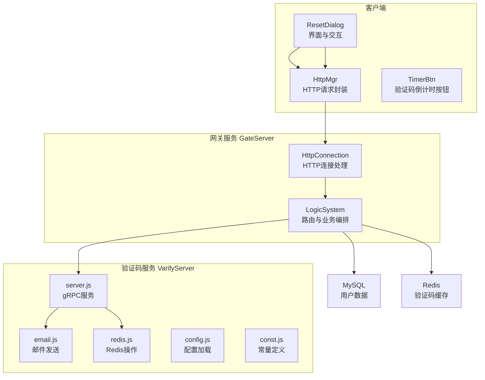
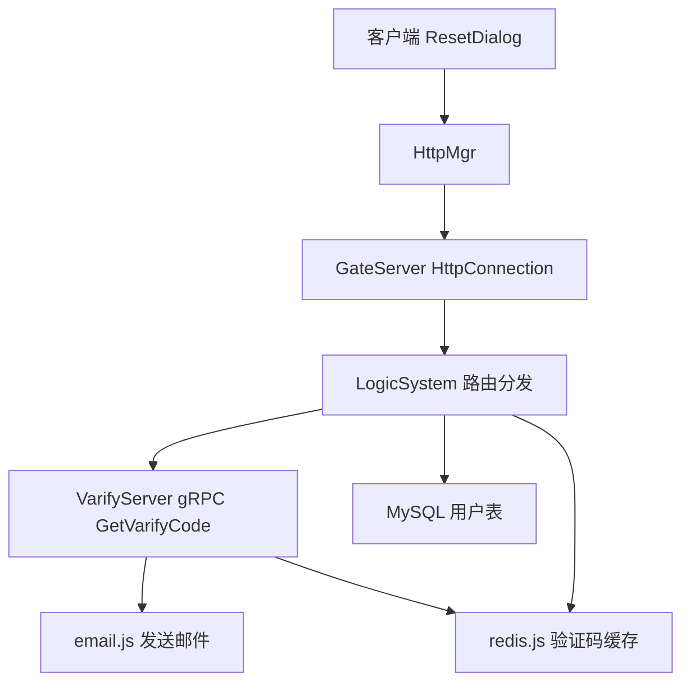
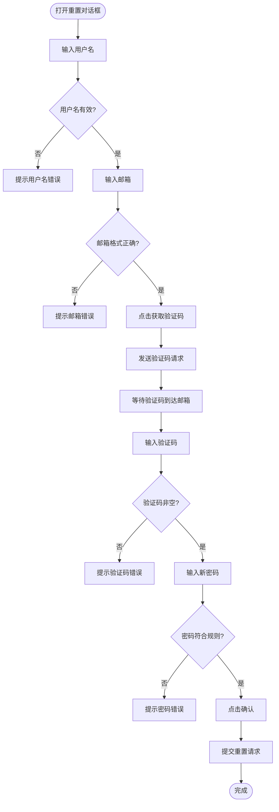
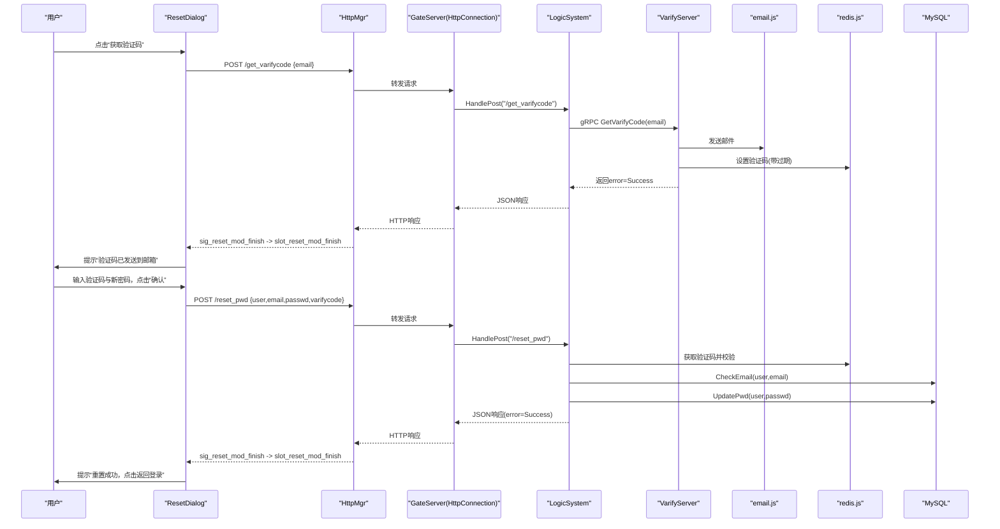
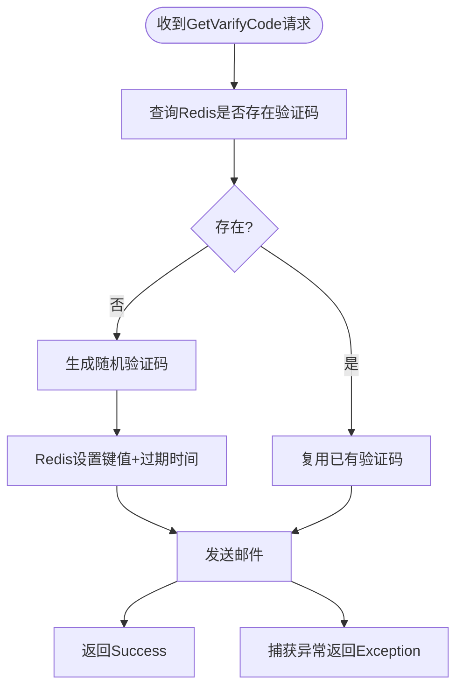
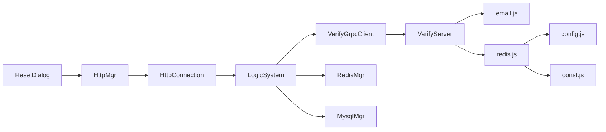

# 密码重置流程

<cite>
**本文引用的文件**   
- [resetdialog.h](file://client/llfcchat/include/resetdialog.h)
- [resetdialog.cpp](file://client/llfcchat/src/resetdialog.cpp)
- [resetdialog.ui](file://client/llfcchat/ui/resetdialog.ui)
- [httpmgr.h](file://client/llfcchat/include/httpmgr.h)
- [timerbtn.h](file://client/llfcchat/include/timerbtn.h)
- [HttpConnection.cpp](file://server/GateServer/src/HttpConnection.cpp)
- [LogicSystem.h](file://server/GateServer/include/LogicSystem.h)
- [LogicSystem.cpp](file://server/GateServer/src/LogicSystem.cpp)
- [server.js](file://server/VarifyServer/server.js)
- [email.js](file://server/VarifyServer/email.js)
- [redis.js](file://server/VarifyServer/redis.js)
- [config.js](file://server/VarifyServer/config.js)
- [const.js](file://server/VarifyServer/const.js)
</cite>

## 目录
1. [简介](#简介)
2. [项目结构](#项目结构)
3. [核心组件](#核心组件)
4. [架构总览](#架构总览)
5. [详细组件分析](#详细组件分析)
6. [依赖关系分析](#依赖关系分析)
7. [性能考虑](#性能考虑)
8. [故障排查指南](#故障排查指南)
9. [结论](#结论)
10. [附录](#附录)

## 简介
本文件面向LLFCChat项目的“密码重置”功能，提供端到端的业务流程说明与实现细节。内容覆盖：
- 客户端界面交互、表单校验与反馈
- 验证码获取与邮件发送
- 服务端路由分发、验证码校验、用户邮箱匹配与密码更新
- 安全机制（令牌生成、临时存储、过期控制）
- 完整的时序图与流程图，帮助理解从发起重置到成功更新的完整链路

## 项目结构
密码重置涉及客户端Qt对话框、HTTP管理器、网关服务、验证码服务以及Redis与MySQL等基础设施。关键文件分布如下：
- 客户端UI与逻辑：resetdialog.*、httpmgr.h、timerbtn.h
- 网关服务：GateServer的HttpConnection与LogicSystem
- 验证码服务：VarifyServer的server.js、email.js、redis.js、config.js、const.js

图表来源
- [resetdialog.cpp:1-252](file://client/llfcchat/src/resetdialog.cpp#L1-L252)
- [httpmgr.h:1-34](file://client/llfcchat/include/httpmgr.h#L1-L34)
- [HttpConnection.cpp:1-225](file://server/GateServer/src/HttpConnection.cpp#L1-L225)
- [LogicSystem.cpp:1-477](file://server/GateServer/src/LogicSystem.cpp#L1-L477)
- [server.js:1-76](file://server/VarifyServer/server.js#L1-L76)
- [email.js:1-37](file://server/VarifyServer/email.js#L1-L37)
- [redis.js:1-101](file://server/VarifyServer/redis.js#L1-L101)
- [config.js:1-15](file://server/VarifyServer/config.js#L1-L15)
- [const.js:1-10](file://server/VarifyServer/const.js#L1-L10)

章节来源
- [resetdialog.h:1-44](file://client/llfcchat/include/resetdialog.h#L1-L44)
- [resetdialog.cpp:1-252](file://client/llfcchat/src/resetdialog.cpp#L1-L252)
- [resetdialog.ui:1-317](file://client/llfcchat/ui/resetdialog.ui#L1-L317)
- [httpmgr.h:1-34](file://client/llfcchat/include/httpmgr.h#L1-L34)
- [timerbtn.h:1-20](file://client/llfcchat/include/timerbtn.h#L1-L20)
- [HttpConnection.cpp:1-225](file://server/GateServer/src/HttpConnection.cpp#L1-L225)
- [LogicSystem.h:1-24](file://server/GateServer/include/LogicSystem.h#L1-L24)
- [LogicSystem.cpp:1-477](file://server/GateServer/src/LogicSystem.cpp#L1-L477)
- [server.js:1-76](file://server/VarifyServer/server.js#L1-L76)
- [email.js:1-37](file://server/VarifyServer/email.js#L1-L37)
- [redis.js:1-101](file://server/VarifyServer/redis.js#L1-L101)
- [config.js:1-15](file://server/VarifyServer/config.js#L1-L15)
- [const.js:1-10](file://server/VarifyServer/const.js#L1-L10)

## 核心组件
- 客户端重置对话框（ResetDialog）
  - 负责用户名、邮箱、验证码、新密码输入与实时校验
  - 触发获取验证码与提交重置请求
  - 统一错误提示与状态展示
- HTTP管理器（HttpMgr）
  - 封装POST请求，按模块分发回调信号
- 网关服务（GateServer）
  - 解析HTTP请求，路由到具体处理器（LogicSystem）
  - 调用验证码服务、Redis与MySQL完成业务逻辑
- 验证码服务（VarifyServer）
  - 生成验证码、发送邮件、将验证码写入Redis并设置过期时间
- 持久化与缓存
  - MySQL用于用户信息与密码更新
  - Redis用于验证码临时存储与过期控制

章节来源
- [resetdialog.cpp:1-252](file://client/llfcchat/src/resetdialog.cpp#L1-L252)
- [httpmgr.h:1-34](file://client/llfcchat/include/httpmgr.h#L1-L34)
- [LogicSystem.cpp:241-324](file://server/GateServer/src/LogicSystem.cpp#L241-L324)
- [server.js:15-64](file://server/VarifyServer/server.js#L15-L64)
- [redis.js:87-98](file://server/VarifyServer/redis.js#L87-L98)

## 架构总览
下图展示了密码重置的整体架构与组件交互关系。

图表来源
- [resetdialog.cpp:1-252](file://client/llfcchat/src/resetdialog.cpp#L1-L252)
- [HttpConnection.cpp:132-194](file://server/GateServer/src/HttpConnection.cpp#L132-L194)
- [LogicSystem.cpp:107-151](file://server/GateServer/src/LogicSystem.cpp#L107-L151)
- [server.js:15-64](file://server/VarifyServer/server.js#L15-L64)
- [redis.js:87-98](file://server/VarifyServer/redis.js#L87-L98)

## 详细组件分析

### 客户端重置对话框（ResetDialog）
- 界面元素
  - 用户名、邮箱、验证码、新密码输入框
  - “获取验证码”按钮（TimerBtn），支持倒计时
  - “确认”、“返回”按钮
  - 错误提示标签（err_tip）
- 表单校验规则
  - 用户名非空
  - 邮箱格式正则校验
  - 验证码非空
  - 新密码长度6~15位，仅允许字母、数字及指定特殊字符
- 交互流程
  - 点击“获取验证码”：校验邮箱后通过HTTP请求发送至网关
  - 点击“确认”：依次校验所有字段，通过后提交重置请求
  - 统一错误提示：根据校验结果或网络响应显示成功/失败信息

图表来源
- [resetdialog.cpp:94-161](file://client/llfcchat/src/resetdialog.cpp#L94-L161)
- [resetdialog.cpp:221-251](file://client/llfcchat/src/resetdialog.cpp#L221-L251)
- [resetdialog.ui:1-317](file://client/llfcchat/ui/resetdialog.ui#L1-L317)

章节来源
- [resetdialog.h:11-41](file://client/llfcchat/include/resetdialog.h#L11-L41)
- [resetdialog.cpp:1-252](file://client/llfcchat/src/resetdialog.cpp#L1-L252)
- [resetdialog.ui:1-317](file://client/llfcchat/ui/resetdialog.ui#L1-L317)
- [timerbtn.h:1-20](file://client/llfcchat/include/timerbtn.h#L1-L20)

### HTTP管理器（HttpMgr）
- 职责
  - 封装HTTP POST请求，携带JSON体与请求ID、模块标识
  - 完成后通过信号分发至对应模块的回调处理函数
- 在重置流程中的作用
  - 接收ResetDialog的POST请求参数
  - 转发到GateServer的相应接口
  - 将响应结果以信号形式回传给ResetDialog进行解析与提示

章节来源
- [httpmgr.h:11-31](file://client/llfcchat/include/httpmgr.h#L11-L31)
- [resetdialog.cpp:32-35](file://client/llfcchat/src/resetdialog.cpp#L32-L35)

### 网关服务（GateServer）
- HTTP连接处理（HttpConnection）
  - 读取请求、解析GET查询参数、分发到LogicSystem
  - 对POST请求直接交由LogicSystem处理
- 路由与业务编排（LogicSystem）
  - 注册POST /get_varifycode与POST /reset_pwd
  - 验证码获取：调用VarifyServer gRPC接口
  - 密码重置：校验Redis验证码、验证用户名与邮箱匹配、更新数据库密码

图表来源
- [resetdialog.cpp:50-64](file://client/llfcchat/src/resetdialog.cpp#L50-L64)
- [resetdialog.cpp:221-251](file://client/llfcchat/src/resetdialog.cpp#L221-L251)
- [HttpConnection.cpp:132-194](file://server/GateServer/src/HttpConnection.cpp#L132-L194)
- [LogicSystem.cpp:107-151](file://server/GateServer/src/LogicSystem.cpp#L107-L151)
- [LogicSystem.cpp:241-324](file://server/GateServer/src/LogicSystem.cpp#L241-L324)
- [server.js:15-64](file://server/VarifyServer/server.js#L15-L64)
- [email.js:22-35](file://server/VarifyServer/email.js#L22-L35)
- [redis.js:87-98](file://server/VarifyServer/redis.js#L87-L98)

章节来源
- [HttpConnection.cpp:132-194](file://server/GateServer/src/HttpConnection.cpp#L132-L194)
- [LogicSystem.cpp:107-151](file://server/GateServer/src/LogicSystem.cpp#L107-L151)
- [LogicSystem.cpp:241-324](file://server/GateServer/src/LogicSystem.cpp#L241-L324)

### 验证码服务（VarifyServer）
- 验证码生成与存储
  - 若Redis中不存在该邮箱的验证码，则生成随机码（截取前4位）
  - 使用Redis设置键值并设置过期时间（秒级）
- 邮件发送
  - 使用SMTP配置发送邮件，包含验证码与提示信息
- 错误处理
  - Redis异常或邮件发送异常时返回错误码

图表来源
- [server.js:15-64](file://server/VarifyServer/server.js#L15-L64)
- [redis.js:87-98](file://server/VarifyServer/redis.js#L87-L98)
- [email.js:22-35](file://server/VarifyServer/email.js#L22-L35)
- [config.js:1-15](file://server/VarifyServer/config.js#L1-L15)
- [const.js:1-10](file://server/VarifyServer/const.js#L1-L10)

章节来源
- [server.js:15-64](file://server/VarifyServer/server.js#L15-L64)
- [email.js:22-35](file://server/VarifyServer/email.js#L22-L35)
- [redis.js:87-98](file://server/VarifyServer/redis.js#L87-L98)
- [config.js:1-15](file://server/VarifyServer/config.js#L1-L15)
- [const.js:1-10](file://server/VarifyServer/const.js#L1-L10)

## 依赖关系分析
- 客户端依赖
  - ResetDialog依赖HttpMgr进行网络通信
  - TimerBtn为验证码按钮提供倒计时能力
- 网关服务依赖
  - HttpConnection依赖LogicSystem进行路由分发
  - LogicSystem依赖VerifyGrpcClient、RedisMgr、MysqlMgr
- 验证码服务依赖
  - server.js依赖email.js与redis.js
  - redis.js依赖config.js与const.js

图表来源
- [resetdialog.cpp:1-252](file://client/llfcchat/src/resetdialog.cpp#L1-L252)
- [httpmgr.h:1-34](file://client/llfcchat/include/httpmgr.h#L1-L34)
- [HttpConnection.cpp:1-225](file://server/GateServer/src/HttpConnection.cpp#L1-L225)
- [LogicSystem.cpp:1-477](file://server/GateServer/src/LogicSystem.cpp#L1-L477)
- [server.js:1-76](file://server/VarifyServer/server.js#L1-L76)
- [email.js:1-37](file://server/VarifyServer/email.js#L1-L37)
- [redis.js:1-101](file://server/VarifyServer/redis.js#L1-L101)
- [config.js:1-15](file://server/VarifyServer/config.js#L1-L15)
- [const.js:1-10](file://server/VarifyServer/const.js#L1-L10)

章节来源
- [LogicSystem.cpp:1-477](file://server/GateServer/src/LogicSystem.cpp#L1-L477)
- [HttpConnection.cpp:1-225](file://server/GateServer/src/HttpConnection.cpp#L1-L225)
- [server.js:1-76](file://server/VarifyServer/server.js#L1-L76)

## 性能考虑
- 验证码缓存与过期
  - 使用Redis减少重复计算与邮件发送压力
  - 合理设置过期时间，避免长期占用内存
- 网络请求优化
  - 客户端表单即时校验，减少无效请求
  - 网关层异步读写与短连接策略，提升吞吐
- 数据库访问
  - 使用连接池与预编译语句，降低SQL开销
  - 校验与更新分离，避免长事务

[本节为通用指导，不直接分析具体文件]

## 故障排查指南
- 客户端常见问题
  - 网络请求错误：检查HttpMgr信号与槽连接是否正常
  - JSON解析错误：确认后端返回格式与字段名一致
  - 表单校验失败：核对正则表达式与提示文案
- 网关服务问题
  - 路由未找到：检查LogicSystem是否注册对应POST路径
  - Redis验证码过期：确认过期时间与前端提示一致性
  - 用户名与邮箱不匹配：检查CheckEmail逻辑
- 验证码服务问题
  - 邮件发送失败：检查SMTP配置与授权码
  - Redis连接异常：检查连接配置与心跳机制

章节来源
- [resetdialog.cpp:66-92](file://client/llfcchat/src/resetdialog.cpp#L66-L92)
- [LogicSystem.cpp:241-324](file://server/GateServer/src/LogicSystem.cpp#L241-L324)
- [server.js:56-62](file://server/VarifyServer/server.js#L56-L62)
- [redis.js:16-28](file://server/VarifyServer/redis.js#L16-L28)

## 结论
密码重置流程通过客户端表单校验、网关路由分发、验证码服务与缓存、数据库校验与更新等环节协同完成。整体设计强调安全性（验证码临时存储与过期控制、用户名与邮箱匹配校验）、用户体验（即时校验与明确提示）与可维护性（模块化与清晰的依赖关系）。建议在生产环境中进一步增加频率限制、IP限流与审计日志，以提升抗攻击能力与可观测性。

[本节为总结性内容，不直接分析具体文件]

## 附录
- 安全机制要点
  - 验证码生成：随机数截取固定长度，保证不可预测性
  - 临时存储：Redis键值包含邮箱前缀，避免冲突
  - 过期控制：设置过期时间，防止重放攻击
- 用户体验优化
  - 表单即时校验与错误提示
  - 验证码按钮倒计时，防止频繁点击
  - 成功与失败状态的清晰反馈

[本节为补充说明，不直接分析具体文件]