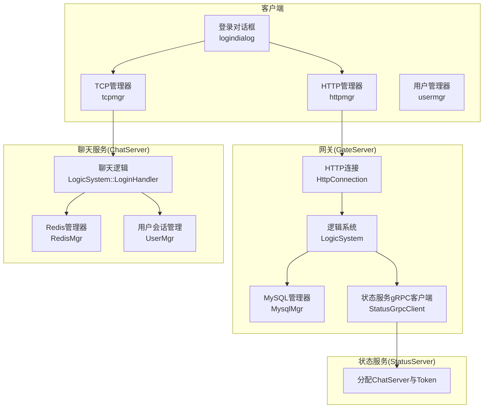
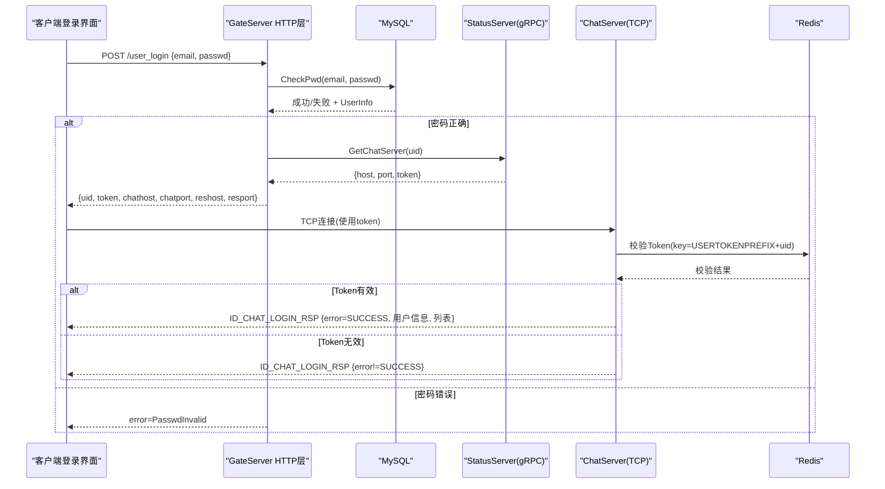
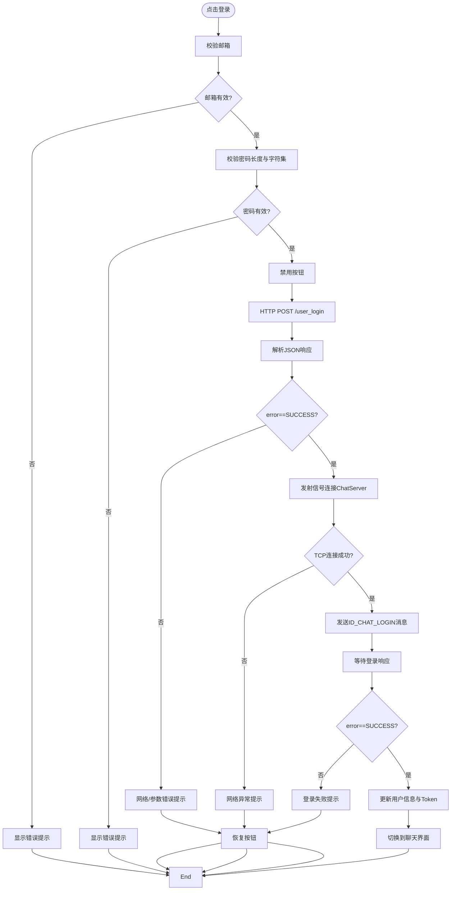
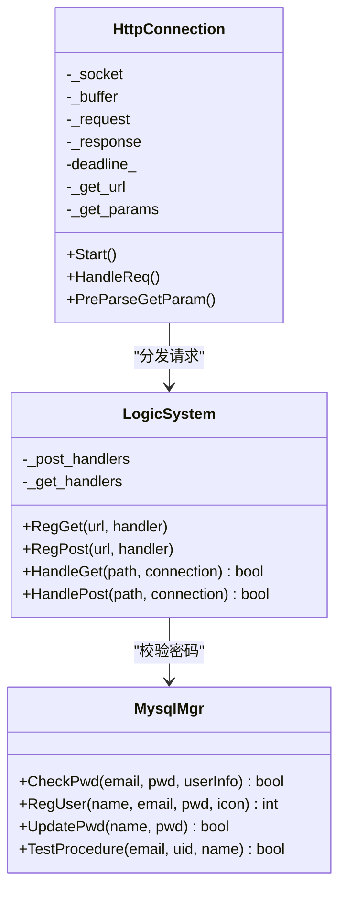
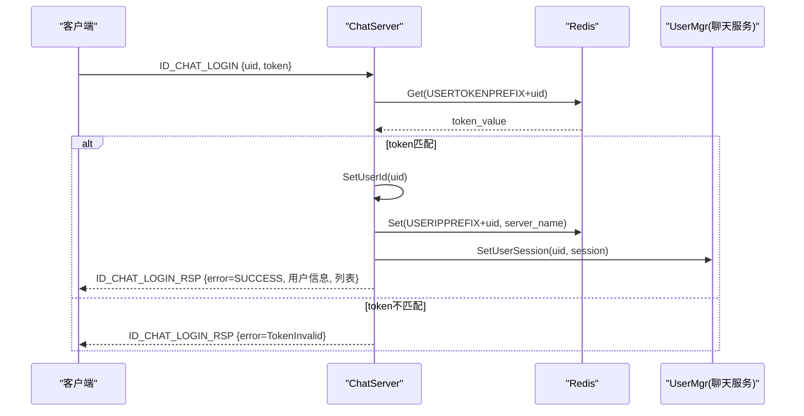
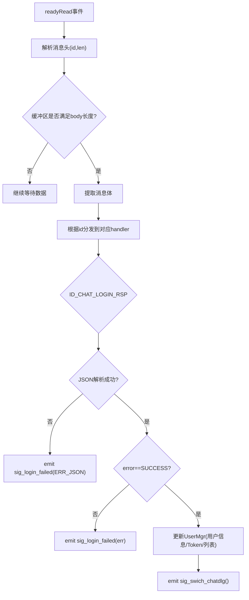
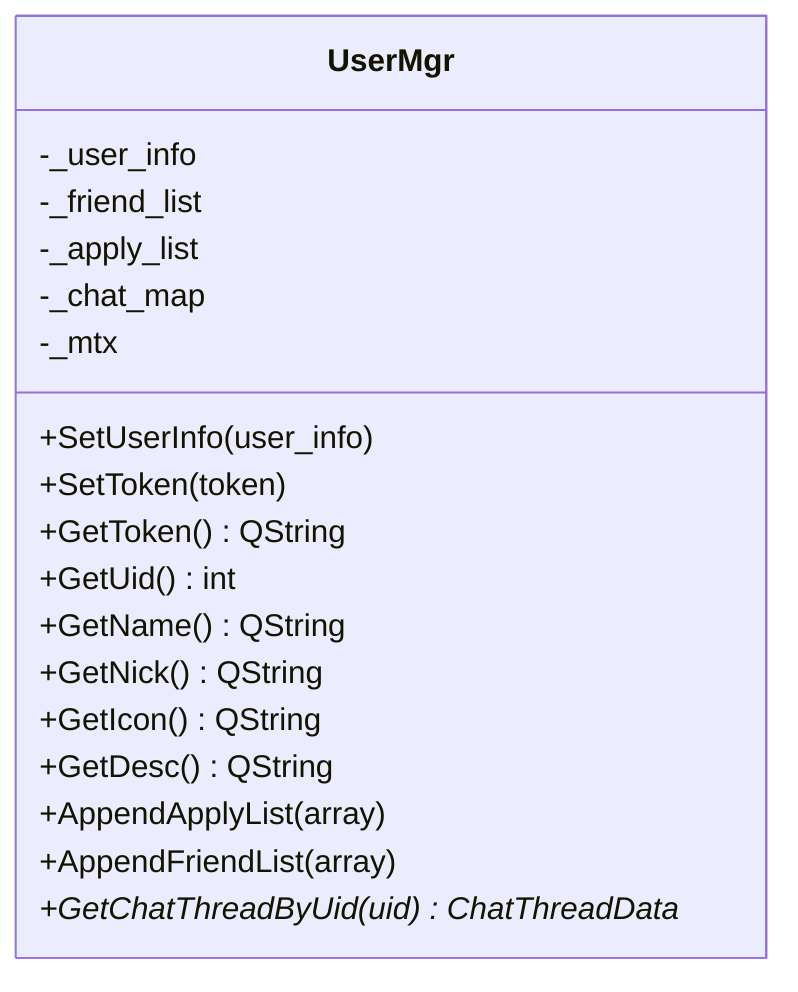
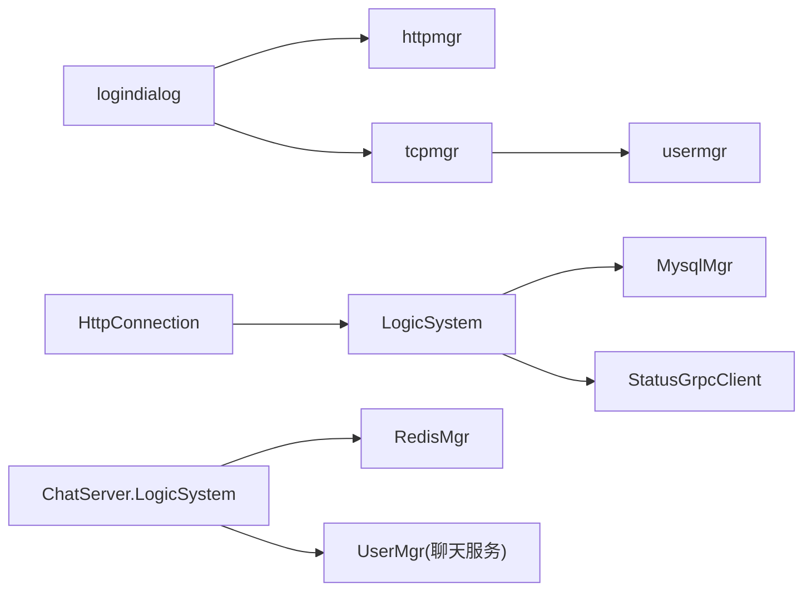

# 用户登录认证流程

<cite>
**本文引用的文件**   
- [logindialog.h](file://client/llfcchat/include/logindialog.h)
- [logindialog.cpp](file://client/llfcchat/src/logindialog.cpp)
- [tcpmgr.h](file://client/llfcchat/include/tcpmgr.h)
- [tcpmgr.cpp](file://client/llfcchat/src/tcpmgr.cpp)
- [usermgr.h](file://client/llfcchat/include/usermgr.h)
- [usermgr.cpp](file://client/llfcchat/src/usermgr.cpp)
- [HttpConnection.h](file://server/GateServer/include/HttpConnection.h)
- [HttpConnection.cpp](file://server/GateServer/src/HttpConnection.cpp)
- [LogicSystem.h](file://server/GateServer/include/LogicSystem.h)
- [LogicSystem.cpp](file://server/GateServer/src/LogicSystem.cpp)
- [MysqlMgr.h](file://server/GateServer/include/MysqlMgr.h)
- [MysqlMgr.cpp](file://server/GateServer/src/MysqlMgr.cpp)
- [ChatServer.cpp](file://server/ChatServer/src/ChatServer.cpp)
- [LogicSystem.cpp（聊天服务）](file://开发文档/day27-分布式服务设计.md)
</cite>

## 目录
1. [简介](#简介)
2. [项目结构](#项目结构)
3. [核心组件](#核心组件)
4. [架构总览](#架构总览)
5. [详细组件分析](#详细组件分析)
6. [依赖关系分析](#依赖关系分析)
7. [性能考虑](#性能考虑)
8. [故障排查指南](#故障排查指南)
9. [结论](#结论)
10. [附录](#附录)

## 简介
本文件面向LLFCChat项目的“用户登录认证”全流程，覆盖客户端与网关、状态服务、聊天服务器之间的交互。重点说明：
- 用户名密码验证与前端校验
- HTTP登录接口处理与后端路由分发
- Token生成与验证机制（Redis缓存校验）
- TCP长连接建立与会话绑定
- 登录失败处理、账户锁定与多设备登录管理思路
- 完整时序图：从输入凭据到建立TCP连接的端到端流程

## 项目结构
登录相关代码分布在客户端与GateServer两个部分：
- 客户端：登录对话框、HTTP请求封装、TCP管理器、用户会话管理
- GateServer：HTTP连接处理、逻辑路由、MySQL查询、gRPC调用状态服务
- ChatServer：接收TCP登录消息、校验Token、绑定Session、返回用户信息

**图表来源** 
- [logindialog.cpp:1-277](file://client/llfcchat/src/logindialog.cpp#L1-L277)
- [HttpConnection.cpp:1-225](file://server/GateServer/src/HttpConnection.cpp#L1-L225)
- [LogicSystem.cpp:326-405](file://server/GateServer/src/LogicSystem.cpp#L326-L405)
- [tcpmgr.cpp:1-200](file://client/llfcchat/src/tcpmgr.cpp#L1-L200)
- [LogicSystem.cpp（聊天服务）:365-444](file://开发文档/day27-分布式服务设计.md#L365-L444)

**章节来源**
- [logindialog.h:1-47](file://client/llfcchat/include/logindialog.h#L1-L47)
- [logindialog.cpp:1-277](file://client/llfcchat/src/logindialog.cpp#L1-L277)
- [HttpConnection.h:1-36](file://server/GateServer/include/HttpConnection.h#L1-L36)
- [HttpConnection.cpp:1-225](file://server/GateServer/src/HttpConnection.cpp#L1-L225)
- [LogicSystem.h:1-24](file://server/GateServer/include/LogicSystem.h#L1-L24)
- [LogicSystem.cpp:1-477](file://server/GateServer/src/LogicSystem.cpp#L1-L477)
- [MysqlMgr.h:1-20](file://server/GateServer/include/MysqlMgr.h#L1-L20)
- [MysqlMgr.cpp:1-33](file://server/GateServer/src/MysqlMgr.cpp#L1-L33)
- [tcpmgr.h:1-90](file://client/llfcchat/include/tcpmgr.h#L1-L90)
- [tcpmgr.cpp:1-800](file://client/llfcchat/src/tcpmgr.cpp#L1-L800)
- [usermgr.h:1-116](file://client/llfcchat/include/usermgr.h#L1-L116)
- [usermgr.cpp:1-566](file://client/llfcchat/src/usermgr.cpp#L1-L566)
- [ChatServer.cpp](file://server/ChatServer/src/ChatServer.cpp)
- [LogicSystem.cpp（聊天服务）:365-444](file://开发文档/day27-分布式服务设计.md#L365-L444)

## 核心组件
- 登录对话框（客户端）
  - 负责UI输入校验、发起HTTP登录请求、解析响应并触发TCP连接
  - 维护错误提示、按钮禁用/启用状态
- HTTP连接与路由（GateServer）
  - 解析HTTP请求，按URL分发到对应处理器
  - /user_login处理器完成凭证校验、分配ChatServer、返回连接信息与Token
- MySQL管理器（GateServer）
  - 提供CheckPwd等数据库操作接口
- 状态服务gRPC客户端（GateServer）
  - 调用StatusServer获取ChatServer地址与Token
- TCP管理器（客户端）
  - 管理QTcpSocket生命周期、粘包处理、消息分发
  - 发送ID_CHAT_LOGIN消息，处理登录响应并更新用户会话
- 用户管理器（客户端）
  - 保存当前用户信息、Token、好友列表、申请列表等
- 聊天服务登录处理器（ChatServer）
  - 校验Redis中的Token，绑定Session，返回用户信息与好友/申请列表

**章节来源**
- [logindialog.cpp:175-223](file://client/llfcchat/src/logindialog.cpp#L175-L223)
- [HttpConnection.cpp:132-194](file://server/GateServer/src/HttpConnection.cpp#L132-L194)
- [LogicSystem.cpp:326-405](file://server/GateServer/src/LogicSystem.cpp#L326-L405)
- [MysqlMgr.cpp:24-26](file://server/GateServer/src/MysqlMgr.cpp#L24-L26)
- [tcpmgr.cpp:182-234](file://client/llfcchat/src/tcpmgr.cpp#L182-L234)
- [usermgr.cpp:10-24](file://client/llfcchat/src/usermgr.cpp#L10-L24)
- [LogicSystem.cpp（聊天服务）:365-444](file://开发文档/day27-分布式服务设计.md#L365-L444)

## 架构总览
登录认证的整体架构由“客户端—网关—状态服务—聊天服务”组成，采用HTTP+gRPC+TCP的组合通信方式：
- 客户端通过HTTP向GateServer发起登录请求
- GateServer校验凭证后，调用StatusServer分配ChatServer并获取Token
- 客户端使用返回的ChatServer地址与Token建立TCP长连接
- ChatServer在Redis中校验Token，成功后绑定Session并返回用户数据

**图表来源** 
- [LogicSystem.cpp:326-405](file://server/GateServer/src/LogicSystem.cpp#L326-L405)
- [tcpmgr.cpp:182-234](file://client/llfcchat/src/tcpmgr.cpp#L182-L234)
- [LogicSystem.cpp（聊天服务）:365-444](file://开发文档/day27-分布式服务设计.md#L365-L444)

## 详细组件分析

### 客户端登录对话框（UI与HTTP/TCP编排）
- 输入校验：邮箱非空、密码长度与字符集正则校验
- 发起HTTP登录：POST到/gate_url_prefix+"/user_login"，密码进行简单异或加密传输
- 解析响应：提取uid、token、chathost/chatport、reshost/resport
- 触发TCP连接：发射信号给TcpMgr建立长连接
- 处理TCP连接结果：连接成功后发送ID_CHAT_LOGIN消息；失败则提示并重试

**图表来源** 
- [logindialog.cpp:175-223](file://client/llfcchat/src/logindialog.cpp#L175-L223)
- [tcpmgr.cpp:225-262](file://client/llfcchat/src/tcpmgr.cpp#L225-L262)

**章节来源**
- [logindialog.cpp:131-195](file://client/llfcchat/src/logindialog.cpp#L131-L195)
- [logindialog.cpp:197-223](file://client/llfcchat/src/logindialog.cpp#L197-L223)
- [logindialog.cpp:225-262](file://client/llfcchat/src/logindialog.cpp#L225-L262)

### GateServer HTTP连接与路由分发
- HttpConnection负责读取HTTP请求、设置超时、解析GET参数、转发到LogicSystem
- LogicSystem注册所有路由（包括/user_login），根据路径分发到具体处理器
- /user_login处理器：
  - 解析请求体JSON（email、passwd）
  - 调用MysqlMgr.CheckPwd校验密码并填充UserInfo
  - 调用StatusGrpcClient.GetChatServer分配ChatServer与Token
  - 从配置读取ResourceServer地址
  - 返回包含uid、token、chathost/chatport、reshost/resport的JSON

**图表来源** 
- [HttpConnection.h:1-36](file://server/GateServer/include/HttpConnection.h#L1-L36)
- [HttpConnection.cpp:132-194](file://server/GateServer/src/HttpConnection.cpp#L132-L194)
- [LogicSystem.h:1-24](file://server/GateServer/include/LogicSystem.h#L1-L24)
- [LogicSystem.cpp:326-405](file://server/GateServer/src/LogicSystem.cpp#L326-L405)
- [MysqlMgr.h:1-20](file://server/GateServer/include/MysqlMgr.h#L1-L20)

**章节来源**
- [HttpConnection.cpp:1-225](file://server/GateServer/src/HttpConnection.cpp#L1-L225)
- [LogicSystem.cpp:1-477](file://server/GateServer/src/LogicSystem.cpp#L1-L477)
- [MysqlMgr.cpp:1-33](file://server/GateServer/src/MysqlMgr.cpp#L1-L33)

### 聊天服务登录处理器（Token校验与会话绑定）
- 接收ID_CHAT_LOGIN消息，解析uid与token
- 从Redis中读取USERTOKENPREFIX+uid对应的token进行比对
- 若校验失败，返回相应错误码；成功则：
  - 设置session的用户ID
  - 记录用户所在服务器名称（用于踢人、在线状态）
  - 将uid与session绑定到UserMgr
  - 返回用户基本信息、申请列表、好友列表

**图表来源** 
- [LogicSystem.cpp（聊天服务）:365-444](file://开发文档/day27-分布式服务设计.md#L365-L444)

**章节来源**
- [LogicSystem.cpp（聊天服务）:365-444](file://开发文档/day27-分布式服务设计.md#L365-L444)

### 客户端TCP管理器（粘包处理与消息分发）
- 基于QTcpSocket实现异步读写
- 自定义协议：消息头为消息ID与长度，随后为消息体
- 登录响应处理：
  - 解析JSON，检查error字段
  - 成功时更新UserMgr中的用户信息与Token
  - 附加申请列表与好友列表
  - 切换至聊天界面

**图表来源** 
- [tcpmgr.cpp:18-55](file://client/llfcchat/src/tcpmgr.cpp#L18-L55)
- [tcpmgr.cpp:182-234](file://client/llfcchat/src/tcpmgr.cpp#L182-L234)

**章节来源**
- [tcpmgr.cpp:1-200](file://client/llfcchat/src/tcpmgr.cpp#L1-L200)
- [tcpmgr.cpp:182-234](file://client/llfcchat/src/tcpmgr.cpp#L182-L234)

### 用户会话管理（客户端）
- UserMgr集中管理当前用户信息、Token、好友列表、申请列表、聊天会话映射等
- 线程安全：关键方法加锁保护
- 登录成功后：
  - SetUserInfo(UserInfo)
  - SetToken(token)
  - AppendApplyList/FriendList

**图表来源** 
- [usermgr.h:1-116](file://client/llfcchat/include/usermgr.h#L1-L116)
- [usermgr.cpp:10-24](file://client/llfcchat/src/usermgr.cpp#L10-L24)

**章节来源**
- [usermgr.h:1-116](file://client/llfcchat/include/usermgr.h#L1-L116)
- [usermgr.cpp:1-120](file://client/llfcchat/src/usermgr.cpp#L1-L120)

## 依赖关系分析
- 客户端依赖：
  - logindialog依赖httpmgr与tcpmgr
  - tcpmgr依赖usermgr
- GateServer依赖：
  - HttpConnection依赖LogicSystem
  - LogicSystem依赖MysqlMgr与StatusGrpcClient
- ChatServer依赖：
  - LogicSystem依赖RedisMgr与UserMgr

**图表来源** 
- [logindialog.cpp:1-277](file://client/llfcchat/src/logindialog.cpp#L1-L277)
- [tcpmgr.cpp:1-200](file://client/llfcchat/src/tcpmgr.cpp#L1-L200)
- [HttpConnection.cpp:1-225](file://server/GateServer/src/HttpConnection.cpp#L1-L225)
- [LogicSystem.cpp:1-477](file://server/GateServer/src/LogicSystem.cpp#L1-L477)
- [LogicSystem.cpp（聊天服务）:365-444](file://开发文档/day27-分布式服务设计.md#L365-L444)

**章节来源**
- [logindialog.cpp:1-277](file://client/llfcchat/src/logindialog.cpp#L1-L277)
- [tcpmgr.cpp:1-200](file://client/llfcchat/src/tcpmgr.cpp#L1-L200)
- [HttpConnection.cpp:1-225](file://server/GateServer/src/HttpConnection.cpp#L1-L225)
- [LogicSystem.cpp:1-477](file://server/GateServer/src/LogicSystem.cpp#L1-L477)
- [LogicSystem.cpp（聊天服务）:365-444](file://开发文档/day27-分布式服务设计.md#L365-L444)

## 性能考虑
- HTTP层：Beast异步读写，避免阻塞；短连接模式减少资源占用
- 数据库：CheckPwd单次查询，建议对email建立索引；可考虑缓存热点用户信息
- gRPC：StatusServer分配策略应负载均衡，避免单点过载
- Redis：Token校验O(1)，注意过期时间与并发访问一致性
- TCP层：粘包处理采用流式解析，避免频繁内存拷贝；发送队列保证有序发送
- 客户端：UI线程与网络线程分离，避免卡顿

[本节为通用指导，无需源码引用]

## 故障排查指南
- 登录失败常见原因：
  - 邮箱为空或格式错误：检查客户端校验逻辑
  - 密码长度或字符集不符合要求：检查正则表达式
  - HTTP请求失败：检查网络、网关地址、CORS设置
  - 密码错误：检查MysqlMgr.CheckPwd实现与数据库存储
  - StatusServer不可用：检查gRPC连接与配置
  - Token无效：检查Redis中USERTOKENPREFIX+uid是否存在且一致
  - TCP连接失败：检查防火墙、端口、ChatServer运行状态
- 定位手段：
  - 查看客户端日志（logindialog与tcpmgr的调试输出）
  - 查看GateServer日志（HTTP请求体、错误码）
  - 查看ChatServer日志（Token校验结果、Session绑定）
  - 检查Redis键值是否存在与过期时间

**章节来源**
- [logindialog.cpp:197-223](file://client/llfcchat/src/logindialog.cpp#L197-L223)
- [tcpmgr.cpp:182-234](file://client/llfcchat/src/tcpmgr.cpp#L182-L234)
- [LogicSystem.cpp:326-405](file://server/GateServer/src/LogicSystem.cpp#L326-L405)
- [LogicSystem.cpp（聊天服务）:365-444](file://开发文档/day27-分布式服务设计.md#L365-L444)

## 结论
LLFCChat的登录认证流程通过“HTTP鉴权+gRPC分配+TCP会话”的分层设计，实现了清晰的职责划分与可扩展性。客户端负责输入校验与状态管理，GateServer负责凭证校验与服务发现，ChatServer负责会话绑定与业务数据下发。Token机制结合Redis保证了跨设备登录的安全性与一致性。建议在后续迭代中增强账户锁定策略、完善错误码体系与监控告警能力。

[本节为总结，无需源码引用]

## 附录
- 登录接口定义（GateServer）
  - 路径：/user_login
  - 方法：POST
  - 请求体：{email, passwd}
  - 响应体：{error, email, uid, token, chathost, chatport, reshost, resport}
- 聊天服务登录消息（ChatServer）
  - 消息ID：ID_CHAT_LOGIN
  - 请求体：{uid, token}
  - 响应ID：ID_CHAT_LOGIN_RSP
  - 响应体：{error, 用户信息, 申请列表, 好友列表}

**章节来源**
- [LogicSystem.cpp:326-405](file://server/GateServer/src/LogicSystem.cpp#L326-L405)
- [tcpmgr.cpp:182-234](file://client/llfcchat/src/tcpmgr.cpp#L182-L234)
- [LogicSystem.cpp（聊天服务）:365-444](file://开发文档/day27-分布式服务设计.md#L365-L444)