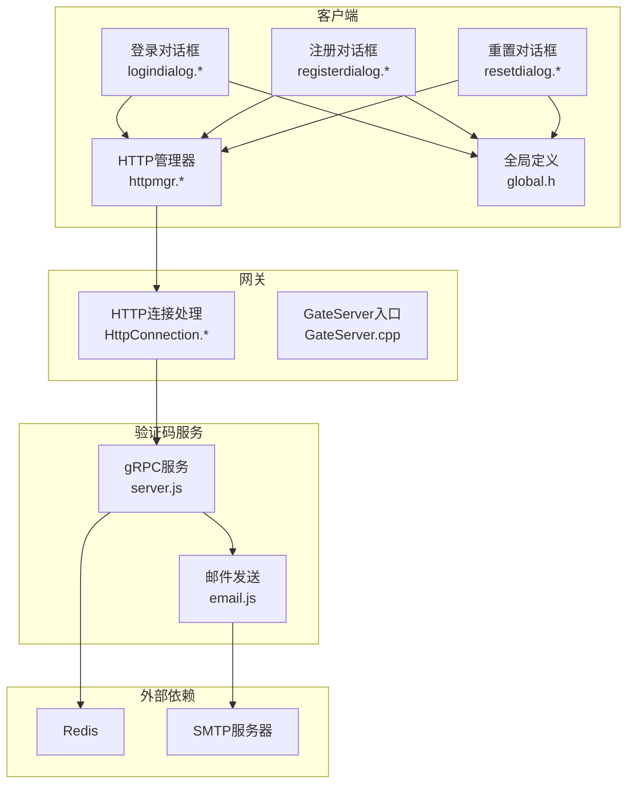
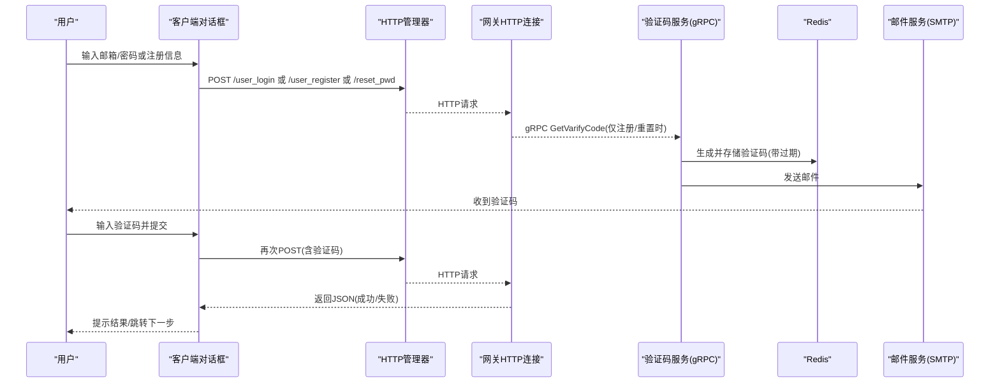
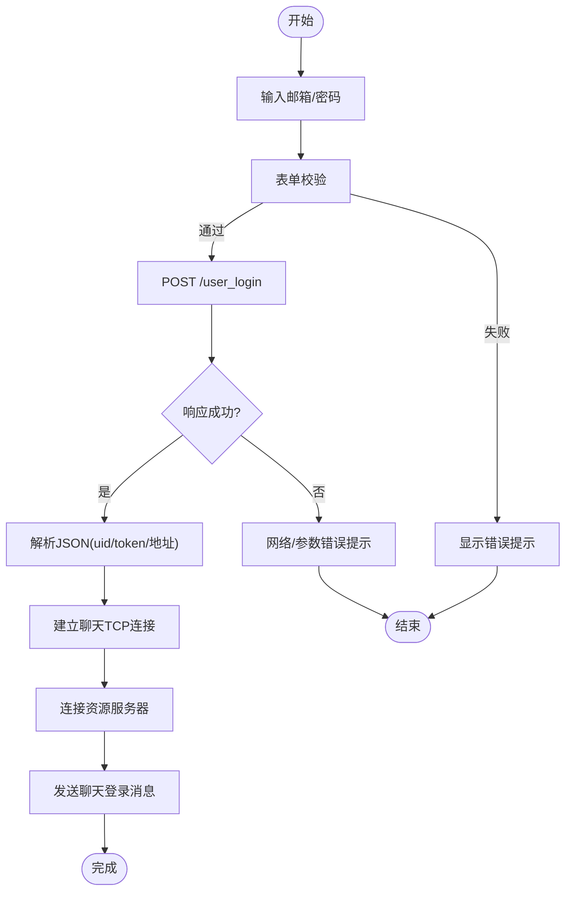
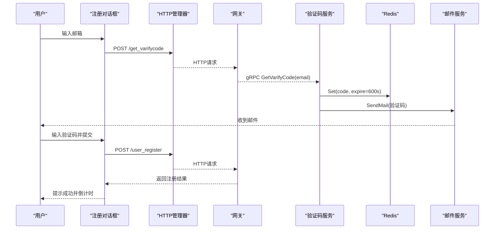
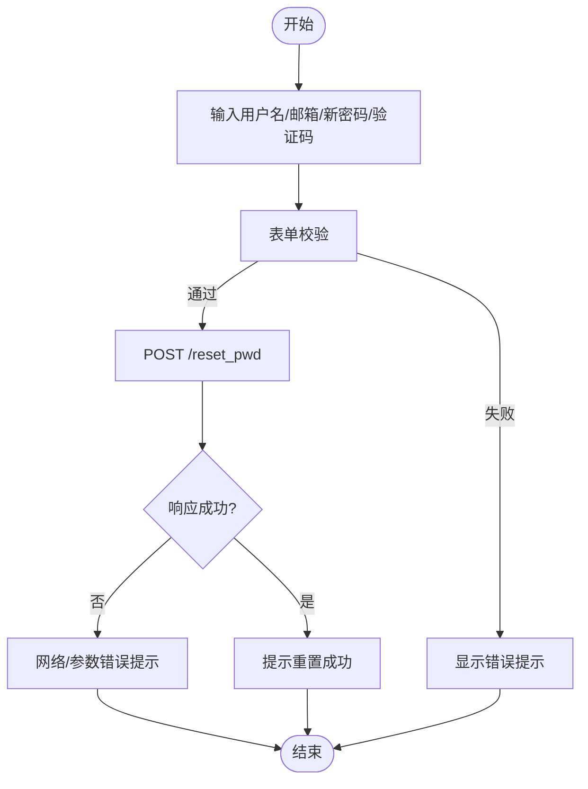
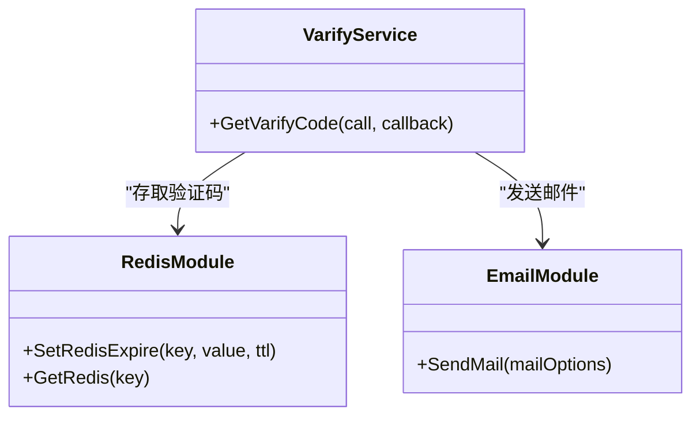
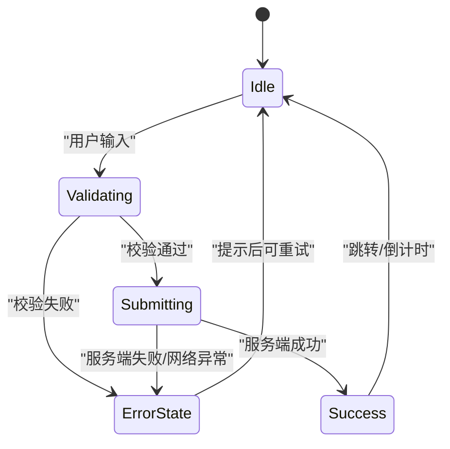
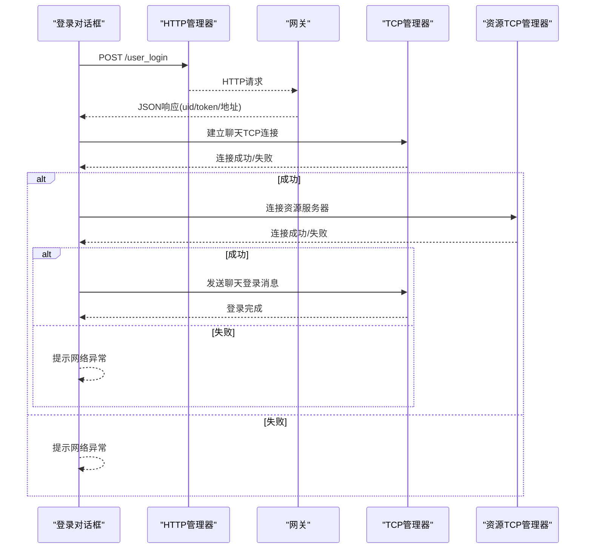
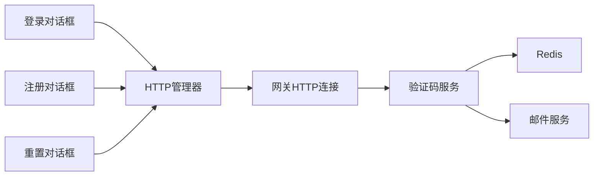

# 用户认证流程

<cite>
**本文引用的文件**   
- [logindialog.h](file://client/llfcchat/include/logindialog.h)
- [logindialog.cpp](file://client/llfcchat/src/logindialog.cpp)
- [registerdialog.h](file://client/llfcchat/include/registerdialog.h)
- [registerdialog.cpp](file://client/llfcchat/src/registerdialog.cpp)
- [resetdialog.h](file://client/llfcchat/include/resetdialog.h)
- [resetdialog.cpp](file://client/llfcchat/src/resetdialog.cpp)
- [httpmgr.h](file://client/llfcchat/include/httpmgr.h)
- [httpmgr.cpp](file://client/llfcchat/src/httpmgr.cpp)
- [global.h](file://client/llfcchat/include/global.h)
- [HttpConnection.h](file://server/GateServer/include/HttpConnection.h)
- [HttpConnection.cpp](file://server/GateServer/src/HttpConnection.cpp)
- [GateServer.cpp](file://server/GateServer/src/GateServer.cpp)
- [server.js](file://server/VarifyServer/server.js)
- [email.js](file://server/VarifyServer/email.js)
</cite>

## 目录
1. [简介](#简介)
2. [项目结构](#项目结构)
3. [核心组件](#核心组件)
4. [架构总览](#架构总览)
5. [详细组件分析](#详细组件分析)
6. [依赖关系分析](#依赖关系分析)
7. [性能考虑](#性能考虑)
8. [故障排查指南](#故障排查指南)
9. [结论](#结论)
10. [附录](#附录)

## 简介
本文件面向LLFCChat项目的用户认证子系统，系统性阐述邮箱验证码注册、登录验证与密码重置的端到端实现。内容覆盖：
- 客户端界面交互与表单校验
- HTTP网关路由与请求分发
- 验证码服务（gRPC）与邮件发送
- Redis缓存中的验证码存储与过期控制
- 登录成功后建立长连接并进入聊天系统
- 错误处理、重试机制与安全加固建议

## 项目结构
认证相关代码分布在客户端Qt工程与后端多服务中：
- 客户端（Qt/C++）
  - 登录对话框：logindialog.*
  - 注册对话框：registerdialog.*
  - 重置密码对话框：resetdialog.*
  - HTTP管理器：httpmgr.*
  - 全局常量与枚举：global.h
- 网关（C++/Boost.Asio）
  - HTTP连接处理：HttpConnection.*
  - GateServer入口：GateServer.cpp
- 验证码服务（Node.js/gRPC）
  - gRPC服务实现：server.js
  - 邮件发送封装：email.js

**图表来源** 
- [logindialog.cpp:1-277](file://client/llfcchat/src/logindialog.cpp#L1-L277)
- [registerdialog.cpp:1-375](file://client/llfcchat/src/registerdialog.cpp#L1-L375)
- [resetdialog.cpp:1-252](file://client/llfcchat/src/resetdialog.cpp#L1-L252)
- [httpmgr.cpp:1-62](file://client/llfcchat/src/httpmgr.cpp#L1-L62)
- [HttpConnection.cpp:1-225](file://server/GateServer/src/HttpConnection.cpp#L1-L225)
- [GateServer.cpp:1-163](file://server/GateServer/src/GateServer.cpp#L1-L163)
- [server.js:1-76](file://server/VarifyServer/server.js#L1-L76)
- [email.js:1-37](file://server/VarifyServer/email.js#L1-L37)

**章节来源**
- [logindialog.h:1-47](file://client/llfcchat/include/logindialog.h#L1-L47)
- [registerdialog.h:1-55](file://client/llfcchat/include/registerdialog.h#L1-L55)
- [resetdialog.h:1-44](file://client/llfcchat/include/resetdialog.h#L1-L44)
- [httpmgr.h:1-34](file://client/llfcchat/include/httpmgr.h#L1-L34)
- [global.h:1-296](file://client/llfcchat/include/global.h#L1-L296)
- [HttpConnection.h:1-36](file://server/GateServer/include/HttpConnection.h#L1-L36)
- [HttpConnection.cpp:1-225](file://server/GateServer/src/HttpConnection.cpp#L1-L225)
- [GateServer.cpp:1-163](file://server/GateServer/src/GateServer.cpp#L1-L163)
- [server.js:1-76](file://server/VarifyServer/server.js#L1-L76)
- [email.js:1-37](file://server/VarifyServer/email.js#L1-L37)

## 核心组件
- 客户端对话框
  - 登录对话框：负责邮箱/密码输入校验、发起HTTP登录、解析回包、触发TCP长连接与资源服务器连接。
  - 注册对话框：负责用户名/邮箱/密码/确认密码/验证码校验，获取验证码、提交注册、倒计时返回登录。
  - 重置对话框：负责用户名/邮箱/新密码/验证码校验，获取验证码、提交重置。
- HTTP管理器：统一封装POST请求、错误处理、按模块分发完成信号。
- 网关HTTP连接：解析GET/POST请求、调用逻辑系统路由、设置响应头与超时。
- 验证码服务：基于gRPC提供获取验证码接口，使用Redis存储验证码并设置过期时间，通过邮件服务发送。
- 邮件服务：基于nodemailer配置SMTP发送验证码邮件。

**章节来源**
- [logindialog.cpp:1-277](file://client/llfcchat/src/logindialog.cpp#L1-L277)
- [registerdialog.cpp:1-375](file://client/llfcchat/src/registerdialog.cpp#L1-L375)
- [resetdialog.cpp:1-252](file://client/llfcchat/src/resetdialog.cpp#L1-L252)
- [httpmgr.cpp:1-62](file://client/llfcchat/src/httpmgr.cpp#L1-L62)
- [HttpConnection.cpp:1-225](file://server/GateServer/src/HttpConnection.cpp#L1-L225)
- [server.js:1-76](file://server/VarifyServer/server.js#L1-L76)
- [email.js:1-37](file://server/VarifyServer/email.js#L1-L37)

## 架构总览
下图展示从客户端到后端各服务的完整认证链路，包括HTTP与gRPC通信、Redis与SMTP集成。

**图表来源** 
- [registerdialog.cpp:1-375](file://client/llfcchat/src/registerdialog.cpp#L1-L375)
- [resetdialog.cpp:1-252](file://client/llfcchat/src/resetdialog.cpp#L1-L252)
- [logindialog.cpp:1-277](file://client/llfcchat/src/logindialog.cpp#L1-L277)
- [httpmgr.cpp:1-62](file://client/llfcchat/src/httpmgr.cpp#L1-L62)
- [HttpConnection.cpp:1-225](file://server/GateServer/src/HttpConnection.cpp#L1-L225)
- [server.js:1-76](file://server/VarifyServer/server.js#L1-L76)
- [email.js:1-37](file://server/VarifyServer/email.js#L1-L37)

## 详细组件分析

### 登录流程（邮箱+密码）
- 前端校验
  - 邮箱非空校验
  - 密码长度与字符集校验（6~15位，允许字母数字及指定特殊字符）
- 网络请求
  - 通过HTTP管理器POST至网关/user_login
  - 密码在客户端进行异或编码后传输
- 服务端处理
  - 网关接收POST请求，交由逻辑系统路由处理
  - 验证通过后返回包含uid、token、聊天与资源服务器地址的JSON
- 后续动作
  - 客户端解析响应，构造ServerInfo并触发TCP长连接至聊天服务器
  - 连接成功后再连接资源服务器，随后发送聊天登录消息完成会话建立

**图表来源** 
- [logindialog.cpp:1-277](file://client/llfcchat/src/logindialog.cpp#L1-L277)
- [httpmgr.cpp:1-62](file://client/llfcchat/src/httpmgr.cpp#L1-L62)
- [HttpConnection.cpp:1-225](file://server/GateServer/src/HttpConnection.cpp#L1-L225)

**章节来源**
- [logindialog.cpp:175-262](file://client/llfcchat/src/logindialog.cpp#L175-L262)
- [httpmgr.cpp:8-38](file://client/llfcchat/src/httpmgr.cpp#L8-L38)
- [HttpConnection.cpp:133-194](file://server/GateServer/src/HttpConnection.cpp#L133-L194)

### 注册流程（邮箱验证码）
- 前端校验
  - 用户名非空
  - 邮箱格式正则校验
  - 密码与确认密码一致性、长度与字符集校验
  - 验证码非空
- 获取验证码
  - 点击“获取验证码”按钮，POST至网关/get_varifycode
  - 网关转发至验证码服务gRPC接口GetVarifyCode
  - 验证码服务生成短码存入Redis（带过期），并通过邮件服务发送
- 提交注册
  - 填写验证码后提交POST /user_register
  - 服务端校验验证码与用户信息，成功后返回注册结果
- 用户体验
  - 注册成功后切换页面并启动倒计时自动返回登录

**图表来源** 
- [registerdialog.cpp:98-111](file://client/llfcchat/src/registerdialog.cpp#L98-L111)
- [registerdialog.cpp:319-362](file://client/llfcchat/src/registerdialog.cpp#L319-L362)
- [server.js:15-63](file://server/VarifyServer/server.js#L15-L63)
- [email.js:22-35](file://server/VarifyServer/email.js#L22-L35)

**章节来源**
- [registerdialog.cpp:142-248](file://client/llfcchat/src/registerdialog.cpp#L142-L248)
- [registerdialog.cpp:250-277](file://client/llfcchat/src/registerdialog.cpp#L250-L277)
- [registerdialog.cpp:296-303](file://client/llfcchat/src/registerdialog.cpp#L296-L303)
- [server.js:15-63](file://server/VarifyServer/server.js#L15-L63)

### 密码重置流程（邮箱验证码）
- 前端校验
  - 用户名非空
  - 邮箱格式校验
  - 新密码长度与字符集校验
  - 验证码非空
- 获取验证码
  - 同注册流程，POST /get_varifycode，经网关转发至验证码服务
- 提交重置
  - 填写验证码后POST /reset_pwd
  - 服务端校验验证码与用户信息，成功后返回重置结果

**图表来源** 
- [resetdialog.cpp:50-64](file://client/llfcchat/src/resetdialog.cpp#L50-L64)
- [resetdialog.cpp:221-251](file://client/llfcchat/src/resetdialog.cpp#L221-L251)

**章节来源**
- [resetdialog.cpp:94-161](file://client/llfcchat/src/resetdialog.cpp#L94-L161)
- [resetdialog.cpp:180-206](file://client/llfcchat/src/resetdialog.cpp#L180-L206)
- [resetdialog.cpp:221-251](file://client/llfcchat/src/resetdialog.cpp#L221-L251)

### 验证码生成与验证机制
- 生成策略
  - 验证码服务检查Redis是否已有该邮箱的验证码；若无则生成短码（UUID前缀截取）并存入Redis，设置过期时间为600秒
- 发送渠道
  - 使用nodemailer通过SMTP发送文本邮件，包含验证码与有效期说明
- 安全要点
  - 验证码短期有效，避免重放
  - 建议增加频率限制与IP限流（当前实现未体现）

**图表来源** 
- [server.js:15-63](file://server/VarifyServer/server.js#L15-L63)
- [email.js:22-35](file://server/VarifyServer/email.js#L22-L35)

**章节来源**
- [server.js:15-63](file://server/VarifyServer/server.js#L15-L63)
- [email.js:22-35](file://server/VarifyServer/email.js#L22-L35)

### 客户端认证界面交互逻辑
- 表单验证
  - 实时监听输入框编辑完成事件，逐项校验并即时反馈错误提示
  - 统一的错误提示管理：AddTipErr/DelTipErr维护错误集合，优先显示首条错误
- 用户体验优化
  - 密码可见性切换（点击图标切换明文/密文）
  - 注册成功后倒计时自动返回登录
  - 登录失败时恢复按钮可用状态，便于重试
- 错误处理
  - 网络异常、JSON解析异常、参数错误均有明确提示
  - 区分不同模块（注册/重置/登录）的信号回调，精准处理

**图表来源** 
- [registerdialog.cpp:26-44](file://client/llfcchat/src/registerdialog.cpp#L26-L44)
- [resetdialog.cpp:14-29](file://client/llfcchat/src/resetdialog.cpp#L14-L29)
- [logindialog.cpp:175-195](file://client/llfcchat/src/logindialog.cpp#L175-L195)

**章节来源**
- [registerdialog.cpp:26-44](file://client/llfcchat/src/registerdialog.cpp#L26-L44)
- [resetdialog.cpp:14-29](file://client/llfcchat/src/resetdialog.cpp#L14-L29)
- [logindialog.cpp:175-195](file://client/llfcchat/src/logindialog.cpp#L175-L195)

### 登录成功后状态转换与长连接
- 状态流转
  - 解析HTTP响应，提取uid、token、聊天与资源服务器地址
  - 触发TCP连接至聊天服务器，成功后再连接资源服务器
  - 向聊天服务器发送登录消息完成会话建立
- 错误处理
  - TCP连接失败提示网络异常并恢复按钮状态
  - 登录失败回调显示具体错误码

**图表来源** 
- [logindialog.cpp:77-110](file://client/llfcchat/src/logindialog.cpp#L77-L110)
- [logindialog.cpp:225-262](file://client/llfcchat/src/logindialog.cpp#L225-L262)

**章节来源**
- [logindialog.cpp:77-110](file://client/llfcchat/src/logindialog.cpp#L77-L110)
- [logindialog.cpp:225-262](file://client/llfcchat/src/logindialog.cpp#L225-L262)

## 依赖关系分析
- 客户端内部依赖
  - 对话框依赖HTTP管理器进行网络请求
  - 全局枚举定义ReqId、ErrorCodes、Modules等，贯穿各模块
- 网关与服务依赖
  - 网关HTTP连接处理请求并路由至逻辑系统
  - 验证码服务依赖Redis与邮件服务
- 外部依赖
  - Redis用于验证码缓存与过期控制
  - SMTP用于邮件发送

**图表来源** 
- [global.h:43-101](file://client/llfcchat/include/global.h#L43-L101)
- [httpmgr.cpp:8-38](file://client/llfcchat/src/httpmgr.cpp#L8-L38)
- [HttpConnection.cpp:133-194](file://server/GateServer/src/HttpConnection.cpp#L133-L194)
- [server.js:15-63](file://server/VarifyServer/server.js#L15-L63)

**章节来源**
- [global.h:43-101](file://client/llfcchat/include/global.h#L43-L101)
- [httpmgr.cpp:8-38](file://client/llfcchat/src/httpmgr.cpp#L8-L38)
- [HttpConnection.cpp:133-194](file://server/GateServer/src/HttpConnection.cpp#L133-L194)
- [server.js:15-63](file://server/VarifyServer/server.js#L15-L63)

## 性能考虑
- 验证码缓存
  - Redis短时效缓存减少重复生成与邮件发送压力
- 异步网络
  - 客户端使用QNetworkAccessManager异步请求，避免阻塞UI
- 连接复用
  - 登录后建立长连接，减少握手开销
- 建议优化
  - 增加验证码请求频率限制与IP限流
  - 对敏感字段采用TLS加密传输（当前为明文HTTP，建议升级HTTPS）
  - 密码不应使用简单异或编码，建议使用哈希加盐并在服务端比对

[本节为通用指导，不直接分析具体文件]

## 故障排查指南
- 常见错误类型
  - 网络错误：检查网络连接与网关可达性
  - JSON解析错误：检查服务端返回格式与字段完整性
  - 参数错误：检查请求字段是否符合规范（邮箱格式、密码长度等）
- 定位方法
  - 查看客户端日志输出（如调试打印）
  - 检查网关日志与验证码服务日志
  - 验证Redis键是否存在且未过期
  - 检查SMTP配置与授权码是否正确
- 恢复措施
  - 网络异常时恢复按钮可用性并重试
  - 参数错误时提示具体原因并引导修正
  - 验证码过期需重新获取

**章节来源**
- [logindialog.cpp:197-223](file://client/llfcchat/src/logindialog.cpp#L197-L223)
- [registerdialog.cpp:113-139](file://client/llfcchat/src/registerdialog.cpp#L113-L139)
- [resetdialog.cpp:66-92](file://client/llfcchat/src/resetdialog.cpp#L66-L92)

## 结论
LLFCChat的用户认证流程以客户端表单校验为基础，通过HTTP网关与验证码服务协作，结合Redis与邮件服务完成安全的邮箱验证码机制。登录成功后建立长连接进入聊天系统，整体链路清晰、职责分离。建议在安全性方面加强传输加密与密码处理策略，并在验证码服务中引入限流与风控机制以提升健壮性与抗攻击能力。

[本节为总结性内容，不直接分析具体文件]

## 附录
- 关键枚举与常量
  - ReqId：定义各类请求ID（获取验证码、注册、重置、登录等）
  - ErrorCodes：定义成功与错误码（网络、JSON解析等）
  - Modules：划分模块（注册、重置、登录）
- 数据模型
  - ServerInfo：保存聊天与资源服务器地址、用户UID与Token

**章节来源**
- [global.h:43-136](file://client/llfcchat/include/global.h#L43-L136)