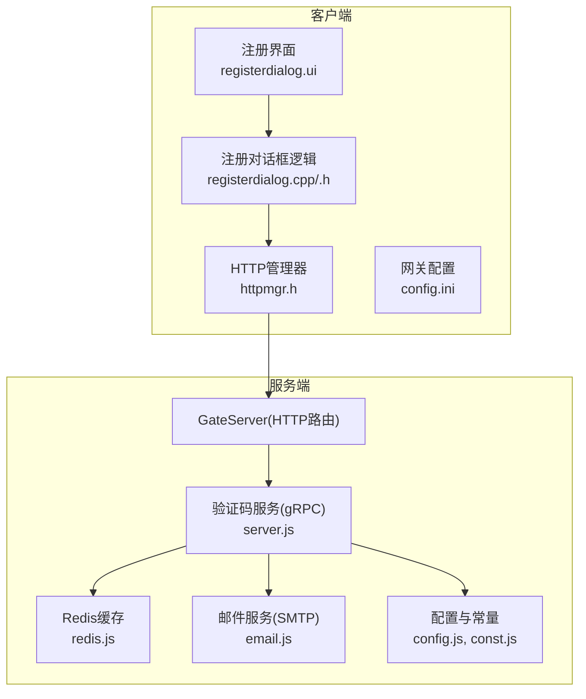
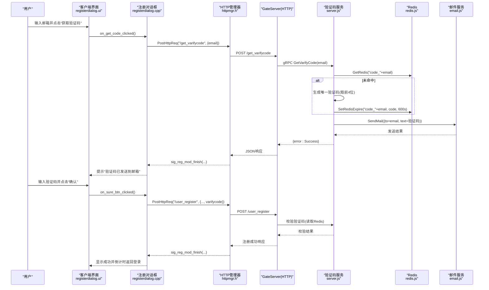
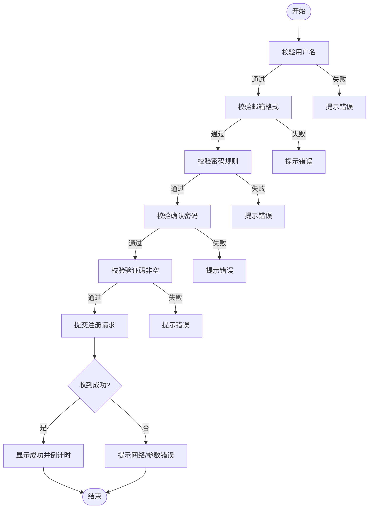
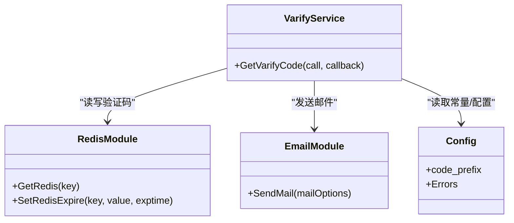
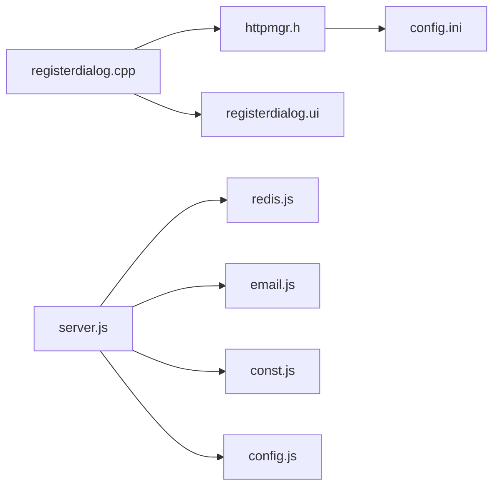

# 邮箱验证码注册流程

<cite>
**本文引用的文件**   
- [registerdialog.cpp](file://client/llfcchat/src/registerdialog.cpp)
- [registerdialog.h](file://client/llfcchat/include/registerdialog.h)
- [registerdialog.ui](file://client/llfcchat/ui/registerdialog.ui)
- [httpmgr.h](file://client/llfcchat/include/httpmgr.h)
- [config.ini](file://client/llfcchat/config/config.ini)
- [server.js](file://server/VarifyServer/server.js)
- [redis.js](file://server/VarifyServer/redis.js)
- [email.js](file://server/VarifyServer/email.js)
- [const.js](file://server/VarifyServer/const.js)
- [config.js](file://server/VarifyServer/config.js)
- [day10-多服务验证码派发功能调试.md](file://开发文档/day10-多服务验证码派发功能调试.md)
- [day11-注册功能.md](file://开发文档/day11-注册功能.md)
</cite>

## 目录
1. [简介](#简介)
2. [项目结构](#项目结构)
3. [核心组件](#核心组件)
4. [架构总览](#架构总览)
5. [详细组件分析](#详细组件分析)
6. [依赖关系分析](#依赖关系分析)
7. [性能考虑](#性能考虑)
8. [故障排查指南](#故障排查指南)
9. [结论](#结论)
10. [附录](#附录)

## 简介
本文件面向LLFCChat项目的邮箱验证码注册流程，系统性阐述从客户端输入邮箱到注册成功的完整链路。内容覆盖：
- 验证码随机生成算法与存储策略（Redis）
- 邮件服务集成（SMTP）
- 前端表单校验、异步请求与错误反馈
- 验证码有效期管理、重试限制与防刷机制
- 完整的注册时序图与关键实现路径

## 项目结构
围绕邮箱验证码注册的关键代码分布在客户端与验证服务两部分：
- 客户端（Qt/C++）
  - 注册界面与交互逻辑：registerdialog.*、registerdialog.ui
  - HTTP请求封装：httpmgr.h
  - 网关地址配置：config.ini
- 验证服务（Node.js/gRPC）
  - gRPC服务入口与验证码处理：server.js
  - Redis缓存封装：redis.js
  - 邮件发送封装：email.js
  - 常量与配置：const.js、config.js

图表来源
- [registerdialog.ui](file://client/llfcchat/ui/registerdialog.ui)
- [registerdialog.cpp](file://client/llfcchat/src/registerdialog.cpp)
- [httpmgr.h](file://client/llfcchat/include/httpmgr.h)
- [server.js](file://server/VarifyServer/server.js)
- [redis.js](file://server/VarifyServer/redis.js)
- [email.js](file://server/VarifyServer/email.js)
- [config.js](file://server/VarifyServer/config.js)
- [const.js](file://server/VarifyServer/const.js)

章节来源
- [registerdialog.cpp:1-375](file://client/llfcchat/src/registerdialog.cpp#L1-L375)
- [registerdialog.h:1-54](file://client/llfcchat/include/registerdialog.h#L1-L54)
- [registerdialog.ui:1-530](file://client/llfcchat/ui/registerdialog.ui#L1-L530)
- [httpmgr.h:1-34](file://client/llfcchat/include/httpmgr.h#L1-L34)
- [config.ini:1-3](file://client/llfcchat/config/config.ini#L1-L3)
- [server.js:1-76](file://server/VarifyServer/server.js#L1-L76)
- [redis.js:1-101](file://server/VarifyServer/redis.js#L1-L101)
- [email.js:1-37](file://server/VarifyServer/email.js#L1-L37)
- [const.js:1-10](file://server/VarifyServer/const.js#L1-L10)
- [config.js:1-15](file://server/VarifyServer/config.js#L1-L15)

## 核心组件
- 客户端注册对话框
  - 负责表单校验、触发获取验证码、提交注册、倒计时与页面切换
- HTTP管理器
  - 统一POST请求封装、错误处理与模块信号分发
- 验证码gRPC服务
  - 接收邮箱、生成或复用验证码、写入Redis并发送邮件
- Redis缓存
  - 以“code_邮箱”为键存储验证码，设置过期时间（秒级）
- 邮件服务
  - 基于SMTP通过nodemailer发送验证码邮件

章节来源
- [registerdialog.cpp:98-111](file://client/llfcchat/src/registerdialog.cpp#L98-L111)
- [httpmgr.h:18-31](file://client/llfcchat/include/httpmgr.h#L18-L31)
- [server.js:15-64](file://server/VarifyServer/server.js#L15-L64)
- [redis.js:41-98](file://server/VarifyServer/redis.js#L41-L98)
- [email.js:22-35](file://server/VarifyServer/email.js#L22-L35)

## 架构总览
下图展示从用户点击“获取验证码”到注册成功的端到端调用链。

图表来源
- [registerdialog.cpp:98-111](file://client/llfcchat/src/registerdialog.cpp#L98-L111)
- [registerdialog.cpp:319-362](file://client/llfcchat/src/registerdialog.cpp#L319-L362)
- [httpmgr.h:18-31](file://client/llfcchat/include/httpmgr.h#L18-L31)
- [server.js:15-64](file://server/VarifyServer/server.js#L15-L64)
- [redis.js:41-98](file://server/VarifyServer/redis.js#L41-L98)
- [email.js:22-35](file://server/VarifyServer/email.js#L22-L35)

## 详细组件分析

### 客户端注册对话框（表单校验与交互）
- 输入框校验
  - 用户名：非空
  - 邮箱：正则匹配格式
  - 密码/确认密码：长度6~15，字符集限制，两者一致
  - 验证码：非空
- 获取验证码
  - 点击按钮后校验邮箱，构造JSON并发起HTTP POST至“/get_varifycode”
- 提交注册
  - 校验全部字段通过后，组装用户信息、头像、昵称、密码（含简单变换）、验证码等，POST至“/user_register”
- 回调处理
  - 根据ReqId分发不同业务回调，如ID_GET_VARIFY_CODE、ID_REG_USER
- 成功反馈
  - 切换页面并启动倒计时，自动返回登录界面

图表来源
- [registerdialog.cpp:142-248](file://client/llfcchat/src/registerdialog.cpp#L142-L248)
- [registerdialog.cpp:319-362](file://client/llfcchat/src/registerdialog.cpp#L319-L362)

章节来源
- [registerdialog.cpp:142-248](file://client/llfcchat/src/registerdialog.cpp#L142-L248)
- [registerdialog.cpp:319-362](file://client/llfcchat/src/registerdialog.cpp#L319-L362)
- [registerdialog.ui:305-322](file://client/llfcchat/ui/registerdialog.ui#L305-L322)

### HTTP管理器（异步请求与信号分发）
- 职责
  - 封装QNetworkAccessManager的POST请求
  - 统一设置Content-Type、Content-Length
  - 完成时发出sig_http_finish，按模块转发到对应信号（如sig_reg_mod_finish）
- 错误处理
  - 网络错误直接返回ERR_NETWORK
  - 成功则携带响应体与SUCCESS状态

章节来源
- [httpmgr.h:18-31](file://client/llfcchat/include/httpmgr.h#L18-L31)
- [day42-用户加载聊天资源.md:51-82](file://开发文档/day42-用户加载聊天资源.md#L51-L82)

### 验证码gRPC服务（生成、缓存与发送）
- 流程
  - 接收邮箱参数
  - 查询Redis中是否存在该邮箱的验证码
  - 若不存在：生成唯一码（UUID截取前4位），写入Redis并设置过期时间（600秒）
  - 使用SMTP发送邮件，内容为“您的验证码为...请三分钟内完成注册”
  - 返回成功状态
- 异常处理
  - Redis操作失败返回RedisErr
  - 其他异常返回Exception

图表来源
- [server.js:15-64](file://server/VarifyServer/server.js#L15-L64)
- [redis.js:41-98](file://server/VarifyServer/redis.js#L41-L98)
- [email.js:22-35](file://server/VarifyServer/email.js#L22-L35)
- [const.js:1-10](file://server/VarifyServer/const.js#L1-L10)
- [config.js:1-15](file://server/VarifyServer/config.js#L1-L15)

章节来源
- [server.js:15-64](file://server/VarifyServer/server.js#L15-L64)
- [redis.js:41-98](file://server/VarifyServer/redis.js#L41-L98)
- [email.js:22-35](file://server/VarifyServer/email.js#L22-L35)
- [const.js:1-10](file://server/VarifyServer/const.js#L1-L10)
- [config.js:1-15](file://server/VarifyServer/config.js#L1-L15)

### Redis缓存策略（验证码存储与过期）
- Key设计
  - 前缀“code_”+邮箱，例如“code_user@example.com”
- 操作
  - GetRedis：读取验证码，不存在返回null
  - SetRedisExpire：设置值并设置过期时间（秒）
- 心跳与健康检查
  - 定时写入heartbeat键，便于监控连接存活

章节来源
- [redis.js:41-98](file://server/VarifyServer/redis.js#L41-L98)
- [day10-多服务验证码派发功能调试.md:29-123](file://开发文档/day10-多服务验证码派发功能调试.md#L29-L123)

### 邮件服务（SMTP发送）
- 配置
  - SMTP服务器：smtp.163.com，端口465，SSL安全
  - 认证：用户与授权码从配置文件读取
- 发送
  - 使用nodemailer创建传输通道，sendMail异步发送
  - 成功返回info.response，失败抛出错误

章节来源
- [email.js:1-37](file://server/VarifyServer/email.js#L1-L37)
- [config.js:1-15](file://server/VarifyServer/config.js#L1-L15)

### 前端界面与交互（UI与事件）
- 界面元素
  - 用户名、邮箱、密码、确认密码、验证码输入框
  - “获取验证码”按钮（TimerBtn）
  - “确认”、“取消”按钮
  - 错误提示标签err_tip
- 交互
  - 输入完成后触发校验
  - 点击“获取验证码”发起HTTP请求
  - 注册成功后切换到page_2并启动倒计时

章节来源
- [registerdialog.ui:305-322](file://client/llfcchat/ui/registerdialog.ui#L305-L322)
- [registerdialog.cpp:26-44](file://client/llfcchat/src/registerdialog.cpp#L26-L44)
- [registerdialog.cpp:296-303](file://client/llfcchat/src/registerdialog.cpp#L296-L303)

## 依赖关系分析
- 客户端依赖
  - registerdialog.cpp依赖httpmgr.h进行网络请求
  - registerdialog.ui定义界面布局与控件
  - config.ini提供GateServer地址
- 服务端依赖
  - server.js依赖redis.js、email.js、const.js、config.js
  - redis.js依赖ioredis库与配置
  - email.js依赖nodemailer与SMTP配置

图表来源
- [registerdialog.cpp:1-10](file://client/llfcchat/src/registerdialog.cpp#L1-L10)
- [httpmgr.h:1-34](file://client/llfcchat/include/httpmgr.h#L1-L34)
- [registerdialog.ui:1-530](file://client/llfcchat/ui/registerdialog.ui#L1-L530)
- [config.ini:1-3](file://client/llfcchat/config/config.ini#L1-L3)
- [server.js:1-10](file://server/VarifyServer/server.js#L1-L10)
- [redis.js:1-10](file://server/VarifyServer/redis.js#L1-L10)
- [email.js:1-10](file://server/VarifyServer/email.js#L1-L10)
- [const.js:1-10](file://server/VarifyServer/const.js#L1-L10)
- [config.js:1-15](file://server/VarifyServer/config.js#L1-L15)

章节来源
- [registerdialog.cpp:1-10](file://client/llfcchat/src/registerdialog.cpp#L1-L10)
- [httpmgr.h:1-34](file://client/llfcchat/include/httpmgr.h#L1-L34)
- [registerdialog.ui:1-530](file://client/llfcchat/ui/registerdialog.ui#L1-L530)
- [config.ini:1-3](file://client/llfcchat/config/config.ini#L1-L3)
- [server.js:1-10](file://server/VarifyServer/server.js#L1-L10)
- [redis.js:1-10](file://server/VarifyServer/redis.js#L1-L10)
- [email.js:1-10](file://server/VarifyServer/email.js#L1-L10)
- [const.js:1-10](file://server/VarifyServer/const.js#L1-L10)
- [config.js:1-15](file://server/VarifyServer/config.js#L1-L15)

## 性能考虑
- 验证码生成与缓存
  - 首次生成后缓存于Redis，避免重复计算；过期时间600秒，兼顾安全与体验
- 网络请求
  - 使用异步HTTP请求，避免阻塞UI线程
- 邮件发送
  - 采用异步SMTP发送，不阻塞主流程
- 连接健康
  - Redis心跳检测，提升稳定性

[本节为通用指导，无需具体文件引用]

## 故障排查指南
- 客户端侧
  - 网络错误：检查HTTP管理器错误分支与网络连通性
  - JSON解析错误：确认服务端返回格式正确
  - 表单校验失败：检查各字段校验逻辑与提示信息
- 服务端侧
  - Redis连接失败：查看redis.js错误监听与重连逻辑
  - 邮件发送失败：检查SMTP配置与授权码有效性
  - 验证码过期：确认Redis键存在且未过期

章节来源
- [registerdialog.cpp:113-139](file://client/llfcchat/src/registerdialog.cpp#L113-L139)
- [redis.js:16-28](file://server/VarifyServer/redis.js#L16-L28)
- [email.js:22-35](file://server/VarifyServer/email.js#L22-L35)

## 结论
本流程通过客户端严格的前端校验、稳定的HTTP异步通信、验证码服务的可靠生成与缓存、以及邮件服务的稳定发送，构建了完整的邮箱验证码注册链路。结合Redis过期机制与服务端校验，有效保障安全性与用户体验。建议在生产环境中进一步完善防刷策略（如频率限制、IP限流、图形验证码）与日志审计。

[本节为总结性内容，无需具体文件引用]

## 附录
- 验证码有效期管理
  - Redis键“code_邮箱”设置过期时间为600秒
- 重试限制与防刷
  - 当前实现未包含显式频率限制，建议在GateServer或验证码服务层增加限流与黑名单机制
- 注册后端校验
  - GateServer在/user_register接口中校验验证码一致性、用户唯一性与数据库写入

章节来源
- [redis.js:87-98](file://server/VarifyServer/redis.js#L87-L98)
- [day11-注册功能.md:639-707](file://开发文档/day11-注册功能.md#L639-L707)