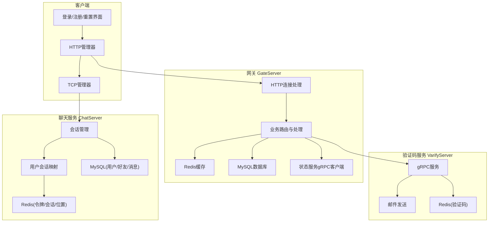
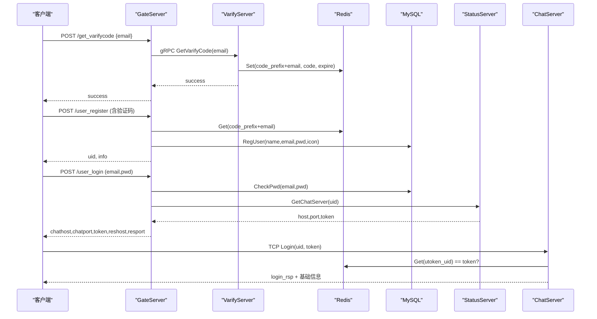
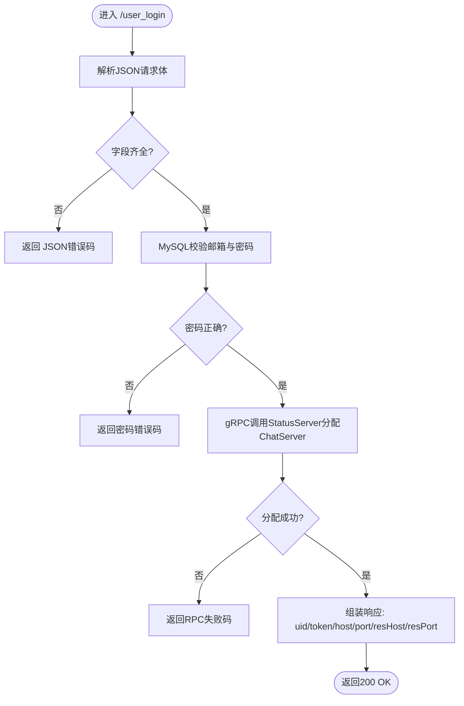
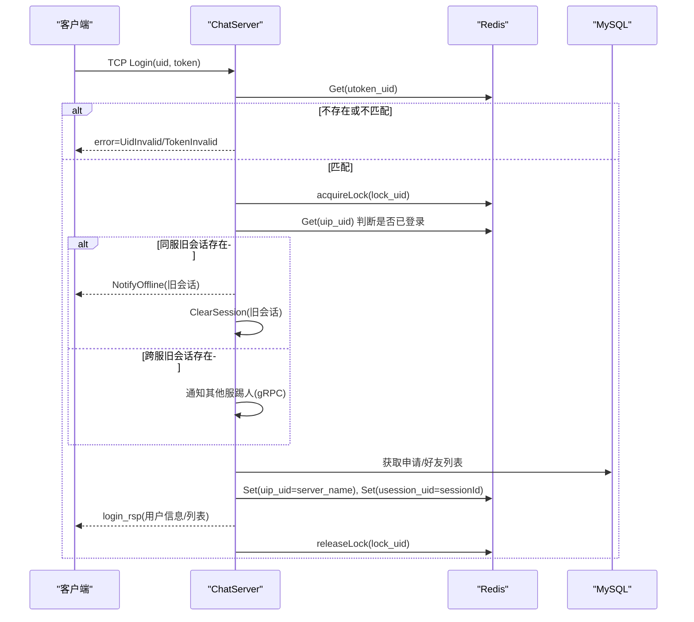
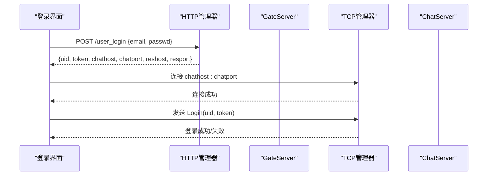
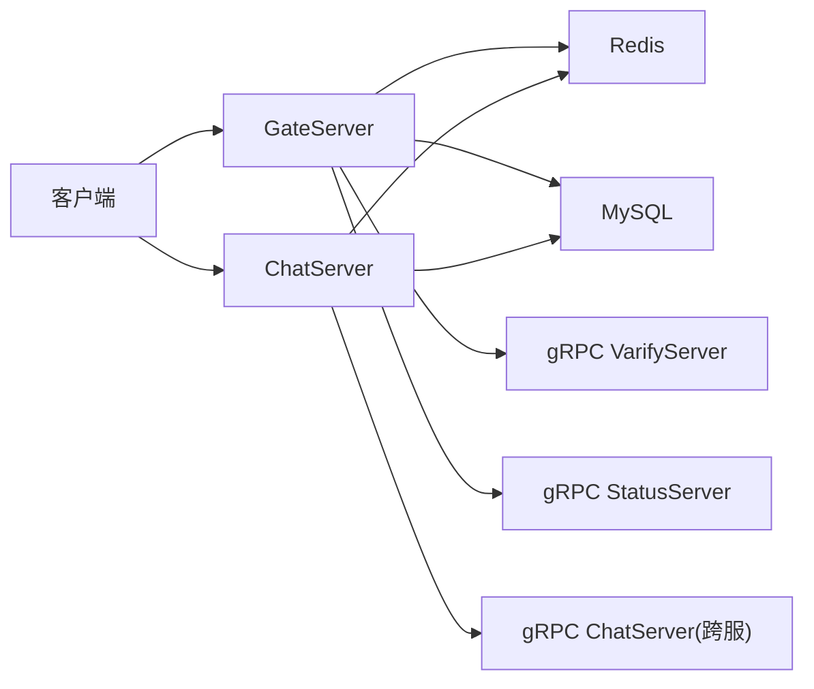
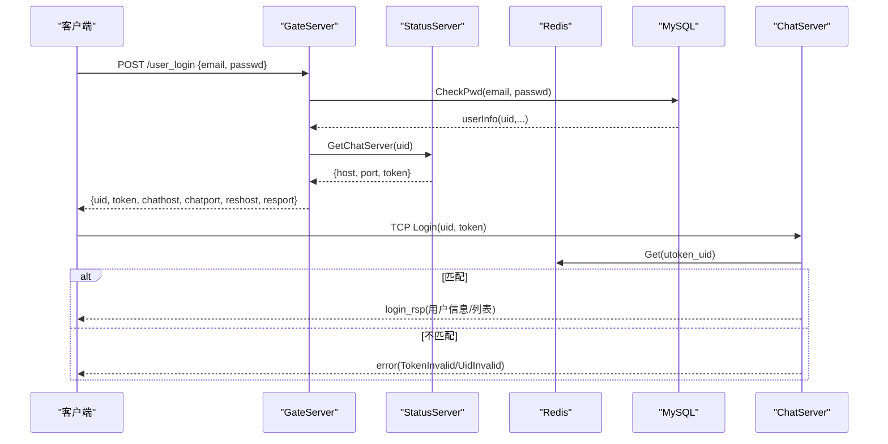
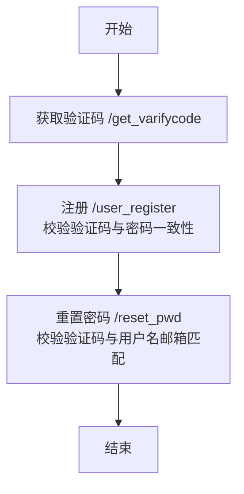
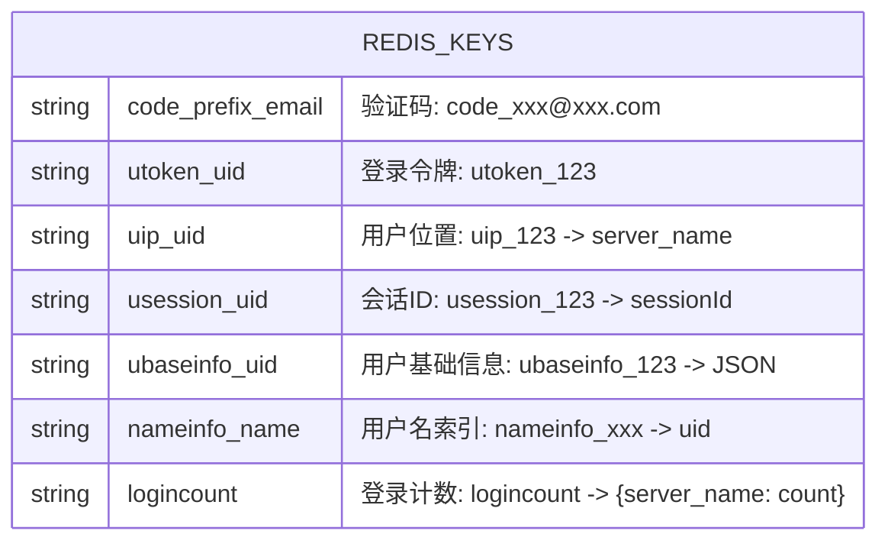

# 认证授权机制

<cite>
**本文引用的文件**   
- [server.js](file://server/VarifyServer/server.js)
- [message.proto](file://server/VarifyServer/message.proto)
- [HttpConnection.cpp](file://server/GateServer/src/HttpConnection.cpp)
- [LogicSystem.cpp](file://server/GateServer/src/LogicSystem.cpp)
- [const.h](file://server/GateServer/include/const.h)
- [logindialog.cpp](file://client/llfcchat/src/logindialog.cpp)
- [registerdialog.cpp](file://client/llfcchat/src/registerdialog.cpp)
- [resetdialog.cpp](file://client/llfcchat/src/resetdialog.cpp)
- [usermgr.cpp](file://client/llfcchat/src/usermgr.cpp)
- [LogicSystem.cpp](file://server/ChatServer/src/LogicSystem.cpp)
- [CServer.cpp](file://server/ChatServer/src/CServer.cpp)
- [const.h](file://server/ChatServer/include/const.h)
- [README.md](file://README.md)
</cite>

## 目录
1. [简介](#简介)
2. [项目结构](#项目结构)
3. [核心组件](#核心组件)
4. [架构总览](#架构总览)
5. [详细组件分析](#详细组件分析)
6. [依赖关系分析](#依赖关系分析)
7. [性能与扩展性](#性能与扩展性)
8. [故障排查指南](#故障排查指南)
9. [结论](#结论)
10. [附录：关键流程图与数据模型](#附录关键流程图与数据模型)

## 简介
本文件面向LLFCChat项目的认证与授权机制，系统性阐述以下方面：
- JWT令牌管理（生成、校验、刷新、过期）在系统中的实现现状与改进建议
- 用户身份认证流程：邮箱验证码注册、登录验证、密码重置
- 会话安全管理：会话存储、并发控制、多设备登录与踢人策略
- 权限控制模型：角色定义、权限分配、API访问控制的现状与建议
- 完整认证流程图与代码级示例路径，覆盖从客户端请求到服务端鉴权的处理链路
- 常见安全问题防护与最佳实践

说明：当前仓库未实现标准JWT令牌；登录态通过“服务器生成的token+Redis缓存”的方式完成。后续章节将给出基于JWT的增强方案与迁移建议。

## 项目结构
认证相关的关键模块分布在网关GateServer、聊天服务ChatServer、验证码服务VarifyServer以及客户端Qt应用：
- GateServer：HTTP入口，负责路由分发、验证码派发、注册、登录、密码重置等接口
- ChatServer：TCP长连接服务，负责登录握手、会话绑定、心跳、消息转发、踢人逻辑
- VarifyServer：gRPC服务，负责邮箱验证码生成与发送，验证码落盘至Redis
- 客户端：Qt界面层封装HTTP/TCP调用，维护本地用户信息与Token

图表来源
- [HttpConnection.cpp:133-194](file://server/GateServer/src/HttpConnection.cpp#L133-L194)
- [LogicSystem.cpp:36-406](file://server/GateServer/src/LogicSystem.cpp#L36-L406)
- [server.js:15-75](file://server/VarifyServer/server.js#L15-L75)
- [LogicSystem.cpp:116-254](file://server/ChatServer/src/LogicSystem.cpp#L116-L254)

章节来源
- [README.md:1-112](file://README.md#L1-L112)

## 核心组件
- 验证码服务（VarifyServer）
  - gRPC接口GetVarifyCode：生成短码并发送邮件，同时将验证码写入Redis（键前缀CODEPREFIX）
- 网关（GateServer）
  - HTTP路由：/get_varifycode、/user_register、/reset_pwd、/user_login
  - 验证码派发：调用VarifyServer gRPC
  - 注册/重置：校验Redis验证码、校验用户名/邮箱一致性、更新MySQL
  - 登录：校验MySQL密码，调用StatusServer分配ChatServer及token，返回连接信息
- 聊天服务（ChatServer）
  - 登录握手：校验Redis中的uid_token匹配，建立会话绑定，记录用户所在服务器名，支持踢人
  - 心跳与超时清理：定时任务清理过期会话
- 客户端（Qt）
  - 登录/注册/重置UI与HTTP/TCP调用封装，维护本地Token与用户信息

章节来源
- [server.js:15-75](file://server/VarifyServer/server.js#L15-L75)
- [message.proto:1-44](file://server/VarifyServer/message.proto#L1-L44)
- [LogicSystem.cpp:107-406](file://server/GateServer/src/LogicSystem.cpp#L107-L406)
- [LogicSystem.cpp:116-254](file://server/ChatServer/src/LogicSystem.cpp#L116-L254)
- [CServer.cpp:102-132](file://server/ChatServer/src/CServer.cpp#L102-L132)
- [logindialog.cpp:175-261](file://client/llfcchat/src/logindialog.cpp#L175-L261)
- [registerdialog.cpp:98-362](file://client/llfcchat/src/registerdialog.cpp#L98-L362)
- [resetdialog.cpp:59-251](file://client/llfcchat/src/resetdialog.cpp#L59-L251)

## 架构总览
认证授权整体采用“网关统一入口 + 微服务协作 + Redis集中缓存”的模式：
- 验证码由VarifyServer生成并通过邮件发送，同时存入Redis供后续校验
- 注册/重置由GateServer协调Redis与MySQL完成
- 登录由GateServer校验凭证后，通过StatusServer分配ChatServer并下发token
- ChatServer使用Redis进行token校验与会话绑定，结合分布式锁实现多端登录互斥与踢人

图表来源
- [LogicSystem.cpp:107-406](file://server/GateServer/src/LogicSystem.cpp#L107-L406)
- [server.js:15-75](file://server/VarifyServer/server.js#L15-L75)
- [LogicSystem.cpp:116-254](file://server/ChatServer/src/LogicSystem.cpp#L116-L254)

## 详细组件分析

### 验证码服务（VarifyServer）
- 功能要点
  - 生成短验证码（UUID截取），设置Redis过期时间（如600秒）
  - 通过SMTP发送邮件，返回成功状态
- 安全要点
  - 验证码仅短期有效，避免重放
  - 错误分支统一返回错误码，便于上层处理

章节来源
- [server.js:15-75](file://server/VarifyServer/server.js#L15-L75)
- [message.proto:1-44](file://server/VarifyServer/message.proto#L1-L44)

### 网关（GateServer）HTTP路由与认证接口
- 路由与处理
  - /get_varifycode：解析JSON，调用VarifyServer gRPC，返回结果
  - /user_register：校验两次密码一致、Redis验证码存在且正确、调用MySQL注册用户
  - /reset_pwd：校验Redis验证码、校验用户名与邮箱匹配、更新密码
  - /user_login：校验密码，调用StatusServer获取ChatServer地址与token，返回资源服务器信息
- 错误码与常量
  - ErrorCodes统一错误码
  - CODEPREFIX用于验证码Key前缀

图表来源
- [LogicSystem.cpp:338-406](file://server/GateServer/src/LogicSystem.cpp#L338-L406)
- [const.h:32-45](file://server/GateServer/include/const.h#L32-L45)

章节来源
- [HttpConnection.cpp:133-194](file://server/GateServer/src/HttpConnection.cpp#L133-L194)
- [LogicSystem.cpp:107-406](file://server/GateServer/src/LogicSystem.cpp#L107-L406)
- [const.h:32-45](file://server/GateServer/include/const.h#L32-L45)

### 聊天服务（ChatServer）登录握手与会话管理
- 登录握手
  - 接收uid与token，校验Redis中utoken_uid是否等于token
  - 成功后读取用户基础信息，加载申请列表与好友列表
  - 使用分布式锁保证登录互斥，处理同服或跨服踢人
  - 绑定session与uid，记录用户所在服务器名，更新登录计数
- 心跳与过期清理
  - 定时任务处理过期会话，防止僵尸连接

图表来源
- [LogicSystem.cpp:116-254](file://server/ChatServer/src/LogicSystem.cpp#L116-L254)
- [const.h:81-94](file://server/ChatServer/include/const.h#L81-L94)

章节来源
- [LogicSystem.cpp:116-254](file://server/ChatServer/src/LogicSystem.cpp#L116-L254)
- [CServer.cpp:102-132](file://server/ChatServer/src/CServer.cpp#L102-L132)
- [const.h:81-94](file://server/ChatServer/include/const.h#L81-L94)

### 客户端认证交互（登录/注册/重置）
- 登录流程
  - 输入邮箱与密码，POST到/gate/user_login
  - 收到chathost/chatport/token后，发起TCP连接并发送Login(uid, token)
- 注册流程
  - 点击获取验证码，POST到/gate/get_varifycode
  - 填写注册表单，POST到/gate/user_register，校验验证码与密码一致性
- 重置密码
  - 获取验证码后，POST到/gate/reset_pwd，校验验证码与用户名邮箱匹配后更新密码

图表来源
- [logindialog.cpp:175-261](file://client/llfcchat/src/logindialog.cpp#L175-L261)
- [registerdialog.cpp:98-362](file://client/llfcchat/src/registerdialog.cpp#L98-L362)
- [resetdialog.cpp:59-251](file://client/llfcchat/src/resetdialog.cpp#L59-L251)

章节来源
- [logindialog.cpp:175-261](file://client/llfcchat/src/logindialog.cpp#L175-L261)
- [registerdialog.cpp:98-362](file://client/llfcchat/src/registerdialog.cpp#L98-L362)
- [resetdialog.cpp:59-251](file://client/llfcchat/src/resetdialog.cpp#L59-L251)
- [usermgr.cpp:15-24](file://client/llfcchat/src/usermgr.cpp#L15-L24)

## 依赖关系分析
- GateServer依赖
  - Redis：验证码缓存、登录令牌缓存、用户位置与会话ID
  - MySQL：用户注册、登录校验、密码重置
  - gRPC客户端：调用VarifyServer与StatusServer
- ChatServer依赖
  - Redis：令牌校验、用户位置、会话ID、分布式锁
  - MySQL：用户基础信息、好友与申请列表
  - gRPC客户端：跨服踢人通知
- 客户端依赖
  - Qt网络库：HTTP与TCP通信
  - 本地内存：用户信息、Token、会话线程数据

图表来源
- [LogicSystem.cpp:107-406](file://server/GateServer/src/LogicSystem.cpp#L107-L406)
- [LogicSystem.cpp:116-254](file://server/ChatServer/src/LogicSystem.cpp#L116-L254)

章节来源
- [LogicSystem.cpp:107-406](file://server/GateServer/src/LogicSystem.cpp#L107-L406)
- [LogicSystem.cpp:116-254](file://server/ChatServer/src/LogicSystem.cpp#L116-L254)

## 性能与扩展性
- 验证码派发
  - 使用Redis短TTL降低重复发送风险，提升用户体验
- 登录握手
  - 分布式锁避免竞态条件，确保踢人与会话更新的原子性
  - Redis缓存用户基础信息，减少MySQL压力
- 会话管理
  - 定时任务清理过期会话，释放资源
- 扩展建议
  - 引入JWT：签发时包含用户角色与权限声明，服务端校验签名与过期时间
  - 令牌刷新：提供refresh_token机制，缩短access_token生命周期，降低泄露风险
  - 限流与风控：对验证码与登录接口增加频率限制与异常检测

[本节为通用指导，不直接分析具体文件]

## 故障排查指南
- 验证码相关问题
  - 现象：验证码过期或错误
  - 排查：检查Redis中code_prefix+email是否存在且未过期；确认VarifyServer邮件发送是否成功
- 登录失败
  - 现象：Token无效或UID无效
  - 排查：检查Redis中utoken_uid是否等于客户端token；确认StatusServer分配是否成功
- 踢人问题
  - 现象：新登录后旧会话未被踢出
  - 排查：检查分布式锁获取与释放；确认uip_uid指向的服务器名是否正确；跨服踢人gRPC是否成功

章节来源
- [LogicSystem.cpp:116-254](file://server/ChatServer/src/LogicSystem.cpp#L116-L254)
- [LogicSystem.cpp:338-406](file://server/GateServer/src/LogicSystem.cpp#L338-L406)
- [server.js:15-75](file://server/VarifyServer/server.js#L15-L75)

## 结论
当前系统通过“验证码+Redis令牌+分布式锁”的组合实现了较为完善的认证与会话管理。建议在后续迭代中引入JWT以增强可移植性与细粒度权限控制，并结合refresh_token机制提升安全性与用户体验。

[本节为总结，不直接分析具体文件]

## 附录：关键流程图与数据模型

### 登录握手序列图（代码级）

图表来源
- [LogicSystem.cpp:338-406](file://server/GateServer/src/LogicSystem.cpp#L338-L406)
- [LogicSystem.cpp:116-254](file://server/ChatServer/src/LogicSystem.cpp#L116-L254)

### 注册与重置密码流程图（代码级）

图表来源
- [LogicSystem.cpp:107-239](file://server/GateServer/src/LogicSystem.cpp#L107-L239)
- [LogicSystem.cpp:241-324](file://server/GateServer/src/LogicSystem.cpp#L241-L324)

### 数据模型（Redis Key约定）

图表来源
- [const.h:81-94](file://server/ChatServer/include/const.h#L81-L94)
- [const.h:63](file://server/GateServer/include/const.h#L63)